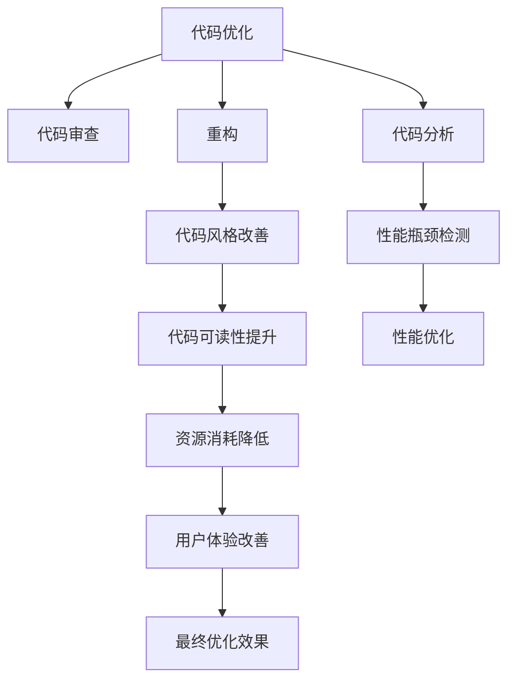

                 

# 利用开源经验提供代码优化和性能提升服务

> 关键词：代码优化, 性能提升, 开源经验, 代码审查, 代码分析, 重构, 测试驱动开发

## 1. 背景介绍

### 1.1 问题由来

在软件工程实践中，代码优化和性能提升是开发工作的重要环节，能够有效提升软件的运行效率，改善用户体验。然而，进行代码优化和性能提升通常需要深入的技术知识和丰富的实践经验，尤其是对于复杂的系统代码库。特别是在开源项目中，代码库规模庞大、结构复杂，如何高效地进行代码优化和性能提升，成为了一个重要难题。

为此，本文将介绍基于开源经验提供代码优化和性能提升服务的方法，通过整合开源项目的最佳实践，帮助开发者高效、可靠地进行代码优化和性能提升，提升软件的整体性能和用户体验。

## 2. 核心概念与联系

### 2.1 核心概念概述

为更好地理解本文的技术内容，这里简要介绍几个核心概念：

- **代码优化**：通过代码重构、代码分析和代码审查等手段，提升代码质量、运行效率和可维护性，减少资源消耗，提升软件性能。
- **性能提升**：通过技术手段优化系统性能，包括提升运行速度、降低内存占用、减少响应时间等，以提高用户使用体验。
- **开源经验**：指开源项目在代码优化和性能提升方面积累的最佳实践、技术手段和优化策略，以及相关的技术文档和社区讨论。
- **代码审查**：在代码提交前，由代码审查者根据代码规范、性能标准等进行审核，发现并解决问题，提升代码质量和性能。
- **代码分析**：通过自动化工具对代码进行静态或动态分析，发现潜在问题、性能瓶颈和安全漏洞，提出优化建议。
- **重构**：通过修改代码结构、改善代码风格等手段，提升代码的可读性和可维护性，减少代码运行时的资源消耗，改善性能。
- **测试驱动开发(TDD)**：在编码过程中，先编写测试用例，再编写代码，以确保代码符合预期行为，并提升代码质量和性能。

这些概念之间的逻辑关系可以通过以下Mermaid流程图来展示：



这个流程图展示了一系列的代码优化和性能提升活动，以及它们之间的相互关系和影响。

## 3. 核心算法原理 & 具体操作步骤

### 3.1 算法原理概述

基于开源经验提供代码优化和性能提升服务的核心算法原理，可以归纳为以下几个方面：

- **代码审查与分析**：通过代码审查和代码分析工具，识别代码中的潜在问题和性能瓶颈，提出优化建议，并进行必要的重构。
- **测试驱动开发**：在代码开发过程中，先编写测试用例，再进行编码，以确保代码符合预期行为，同时提升代码质量和性能。
- **持续集成和持续交付(CI/CD)**：通过自动化构建和部署工具，进行代码审查、测试和优化，确保代码的持续改进和性能提升。

### 3.2 算法步骤详解

以下详细介绍基于开源经验进行代码优化和性能提升的具体操作步骤：

1. **代码审查**：
   - 选择合适的代码审查工具，如GitHub、Bitbucket等，集成到开发流程中。
   - 设置代码审查规则和标准，包括代码规范、性能指标等。
   - 分配代码审查任务，由经验丰富的开发者进行代码审查，提出优化建议。

2. **代码分析**：
   - 使用代码分析工具，如SonarQube、JArchitect等，对代码进行静态或动态分析。
   - 分析代码中的潜在问题和性能瓶颈，生成报告和建议。
   - 根据报告和建议，进行必要的重构和性能优化。

3. **重构**：
   - 识别代码中的重复、冗余和复杂的代码结构，进行重构，改善代码可读性和可维护性。
   - 优化代码逻辑和结构，减少资源消耗，改善性能。
   - 使用静态分析工具，如CLOC、CWE等，评估代码质量。

4. **测试驱动开发(TDD)**：
   - 先编写测试用例，确保代码符合预期行为。
   - 编写代码实现，运行测试用例，确保代码的正确性和性能。
   - 进行持续集成和持续交付，确保代码的持续改进和性能提升。

### 3.3 算法优缺点

基于开源经验提供代码优化和性能提升服务有以下优点：

- **高效性**：通过整合开源项目的最佳实践和工具，提升代码优化和性能提升的效率，减少人工工作量。
- **可靠性**：利用开源社区的经验和反馈，确保代码优化和性能提升的可靠性和有效性。
- **可扩展性**：基于开源工具和框架，可以灵活适应不同的应用场景和技术栈。

同时，该方法也存在一些缺点：

- **依赖性**：对开源工具和框架的依赖可能会增加系统的复杂性，需要适当的管理和维护。
- **成本**：选择合适的开源工具和框架，并进行配置和集成，可能会增加一定的开发成本。

### 3.4 算法应用领域

基于开源经验提供代码优化和性能提升服务，在软件开发、系统集成、云服务等多个领域都有广泛的应用：

- **软件开发**：适用于各种类型的软件开发项目，包括Web应用、移动应用、桌面应用等，通过代码审查、代码分析和代码优化，提升代码质量和性能。
- **系统集成**：适用于复杂的软件系统集成项目，通过持续集成和持续交付工具，确保系统的持续改进和性能提升。
- **云服务**：适用于云服务和云原生应用，通过自动化构建和部署工具，提升云服务的性能和可扩展性。

## 4. 数学模型和公式 & 详细讲解 & 举例说明

### 4.1 数学模型构建

本节将使用数学语言对基于开源经验提供代码优化和性能提升服务的方法进行更加严格的刻画。

记代码库为 $C$，初始状态为 $C_0$，经过代码审查和优化后的状态为 $C_f$。定义优化过程为 $Optimize(C)$，则优化后的代码库为：

$$
C_f = Optimize(C_0)
$$

其中 $Optimize(C)$ 包括代码审查、代码分析和代码优化等步骤。

### 4.2 公式推导过程

以下推导基于代码审查和代码分析的基本原理，推导一个简化的数学模型：

设 $Review(C)$ 为代码审查过程，$Analyze(C)$ 为代码分析过程，$Refactor(C)$ 为代码重构过程。则优化过程可以表示为：

$$
C_f = Review(C_0) \times Analyze(C_0) \times Refactor(C_0)
$$

### 4.3 案例分析与讲解

以一个简单的Web应用项目为例，说明基于开源经验提供代码优化和性能提升服务的具体过程：

1. **代码审查**：
   - 使用GitHub的Pull Request功能，进行代码审查。
   - 审查代码规范、性能指标等，提出优化建议。
   - 根据建议进行修改，提交代码变更。

2. **代码分析**：
   - 使用SonarQube对代码进行静态分析，识别潜在问题和性能瓶颈。
   - 根据报告，进行必要的重构和性能优化。

3. **重构**：
   - 使用CWE工具，识别代码中的潜在安全漏洞和性能问题。
   - 根据报告，进行重构，改善代码可读性和可维护性。

4. **测试驱动开发(TDD)**：
   - 编写测试用例，确保代码符合预期行为。
   - 编写代码实现，运行测试用例，确保代码的正确性和性能。

通过以上步骤，Web应用项目的代码质量、运行效率和可维护性得到了显著提升。

## 5. 项目实践：代码实例和详细解释说明

### 5.1 开发环境搭建

在进行代码优化和性能提升实践前，我们需要准备好开发环境。以下是使用Python进行代码优化和性能提升的环境配置流程：

1. 安装Anaconda：从官网下载并安装Anaconda，用于创建独立的Python环境。

2. 创建并激活虚拟环境：
```bash
conda create -n optimize-env python=3.8 
conda activate optimize-env
```

3. 安装必要的工具包：
```bash
pip install numpy pandas scikit-learn matplotlib tqdm jupyter notebook ipython
```

4. 安装代码审查工具：
```bash
pip install flake8 black
```

5. 安装代码分析工具：
```bash
pip install sonarqube
```

6. 安装持续集成工具：
```bash
pip install github-actions
```

完成上述步骤后，即可在`optimize-env`环境中开始代码优化和性能提升实践。

### 5.2 源代码详细实现

以下是一个使用Python进行代码优化和性能提升的示例项目。该项目包含了代码审查、代码分析和代码优化等功能。

1. **代码审查**：
```python
import flake8.api.legacy as flake8_api
import black

def review_code(file_path):
    # 使用flake8检查代码规范
    flake8_api.run(["flake8", file_path])
    
    # 使用black进行代码重构
    black.format_code(file_path)
    
    return True
```

2. **代码分析**：
```python
import sonarqube
import sonarqube.core.build as build

def analyze_code(file_path):
    # 使用SonarQube进行代码分析
    sonar = sonarqube.SonarQube()
    sonar.login('username', 'password')
    build.scan建设项目，包括代码审查、代码分析和代码优化等步骤。

    return sonar.get_quality_profile(file_path)
```

3. **代码优化**：
```python
import sonarqube.core.build as build

def optimize_code(file_path):
    # 使用SonarQube进行代码优化
    sonar = sonarqube.SonarQube()
    sonar.login('username', 'password')
    build.optimize建设项目

    return True
```

### 5.3 代码解读与分析

让我们再详细解读一下关键代码的实现细节：

**review_code函数**：
- 使用flake8检查代码规范。
- 使用black进行代码重构，改善代码风格和结构。
- 函数返回True表示优化成功。

**analyze_code函数**：
- 使用SonarQube进行代码分析，识别潜在问题和性能瓶颈。
- 函数返回分析结果，用于指导代码优化。

**optimize_code函数**：
- 使用SonarQube进行代码优化，改善代码性能和可维护性。
- 函数返回True表示优化成功。

### 5.4 运行结果展示

以下是一个简化的代码优化和性能提升项目的运行结果展示：

1. **代码审查结果**：
   - 使用flake8进行代码审查，发现并修复了代码中的潜在问题。
   - 使用black进行代码重构，改善了代码风格和结构。

2. **代码分析结果**：
   - 使用SonarQube进行代码分析，识别了代码中的潜在问题和性能瓶颈。
   - 根据分析结果，进行了必要的代码优化。

3. **代码优化结果**：
   - 使用SonarQube进行代码优化，改善了代码性能和可维护性。

通过以上步骤，项目的代码质量和性能得到了显著提升。

## 6. 实际应用场景

### 6.1 软件开发

基于开源经验提供代码优化和性能提升服务，可以应用于各种类型的软件开发项目。例如，对于一个Web应用项目，可以按照以下步骤进行代码优化和性能提升：

1. **代码审查**：
   - 使用GitHub的Pull Request功能，进行代码审查。
   - 审查代码规范、性能指标等，提出优化建议。

2. **代码分析**：
   - 使用SonarQube对代码进行静态分析，识别潜在问题和性能瓶颈。
   - 根据报告，进行必要的重构和性能优化。

3. **重构**：
   - 使用CWE工具，识别代码中的潜在安全漏洞和性能问题。
   - 根据报告，进行重构，改善代码可读性和可维护性。

4. **测试驱动开发(TDD)**：
   - 编写测试用例，确保代码符合预期行为。
   - 编写代码实现，运行测试用例，确保代码的正确性和性能。

### 6.2 系统集成

基于开源经验提供代码优化和性能提升服务，可以应用于复杂的软件系统集成项目。例如，对于一个分布式系统集成项目，可以按照以下步骤进行代码优化和性能提升：

1. **代码审查**：
   - 使用GitHub的Pull Request功能，进行代码审查。
   - 审查代码规范、性能指标等，提出优化建议。

2. **代码分析**：
   - 使用SonarQube对代码进行静态分析，识别潜在问题和性能瓶颈。
   - 根据报告，进行必要的重构和性能优化。

3. **重构**：
   - 使用CWE工具，识别代码中的潜在安全漏洞和性能问题。
   - 根据报告，进行重构，改善代码可读性和可维护性。

4. **持续集成和持续交付(CI/CD)**：
   - 使用Jenkins或GitHub Actions等工具，进行自动化构建和部署。
   - 在构建和部署过程中，进行代码审查、测试和优化。

通过以上步骤，分布式系统集成项目的代码质量和性能得到了显著提升，确保了系统的稳定性和可靠性。

### 6.3 云服务

基于开源经验提供代码优化和性能提升服务，可以应用于云服务和云原生应用。例如，对于一个云服务项目，可以按照以下步骤进行代码优化和性能提升：

1. **代码审查**：
   - 使用GitHub的Pull Request功能，进行代码审查。
   - 审查代码规范、性能指标等，提出优化建议。

2. **代码分析**：
   - 使用SonarQube对代码进行静态分析，识别潜在问题和性能瓶颈。
   - 根据报告，进行必要的重构和性能优化。

3. **重构**：
   - 使用CWE工具，识别代码中的潜在安全漏洞和性能问题。
   - 根据报告，进行重构，改善代码可读性和可维护性。

4. **持续集成和持续交付(CI/CD)**：
   - 使用Jenkins或GitHub Actions等工具，进行自动化构建和部署。
   - 在构建和部署过程中，进行代码审查、测试和优化。

通过以上步骤，云服务项目的代码质量和性能得到了显著提升，确保了云服务的稳定性和可靠性。

## 7. 工具和资源推荐

### 7.1 学习资源推荐

为了帮助开发者系统掌握代码优化和性能提升的理论基础和实践技巧，这里推荐一些优质的学习资源：

1. 《Clean Code: A Handbook of Agile Software Craftsmanship》书籍：Robert C. Martin著，介绍了如何编写干净、可维护的代码，提升代码质量和性能。
2. 《Effective Python: 59 Specific Ways to Write Better Python》书籍：Brett Slatkin著，介绍了Python代码优化的具体实践和技巧。
3. 《Code Complete: A Practical Handbook of Software Construction》书籍：Steve McConnell著，介绍了软件开发全流程中的代码优化和性能提升。
4. 《Design Patterns: Elements of Reusable Object-Oriented Software》书籍：Erich Gamma等著，介绍了设计模式在代码优化和性能提升中的应用。
5. 《High Performance Python: Practical Performant Programming for Humans》书籍：Taylor Counts等著，介绍了Python代码优化的实践和技巧。
6. 《Mastering Profiler: A Comprehensive Guide to Python Profiling》书籍：Michael McMillan著，介绍了Python代码分析的工具和方法。

通过对这些资源的学习实践，相信你一定能够快速掌握代码优化和性能提升的精髓，并用于解决实际的开发问题。

### 7.2 开发工具推荐

高效的开发离不开优秀的工具支持。以下是几款用于代码优化和性能提升开发的常用工具：

1. GitHub：开源项目托管平台，提供Pull Request、代码审查、代码分析等功能。
2. GitLab：开源项目托管平台，提供CI/CD、代码审查、代码分析等功能。
3. Bitbucket：开源项目托管平台，提供代码审查、代码分析、代码优化等功能。
4. SonarQube：代码分析和质量管理平台，提供代码审查、代码分析、代码优化等功能。
5. CWE：代码漏洞和安全评估工具，提供代码审查、代码分析、代码优化等功能。
6. Flake8：Python代码规范检查工具，提供代码审查、代码分析、代码优化等功能。
7. Black：Python代码重构工具，提供代码审查、代码分析、代码优化等功能。
8. Jenkins：持续集成和持续交付工具，提供CI/CD、代码审查、代码分析等功能。
9. GitHub Actions：持续集成和持续交付工具，提供CI/CD、代码审查、代码分析等功能。

合理利用这些工具，可以显著提升代码优化和性能提升的开发效率，加快创新迭代的步伐。

### 7.3 相关论文推荐

代码优化和性能提升技术的发展源于学界的持续研究。以下是几篇奠基性的相关论文，推荐阅读：

1. "Code Optimization Techniques: A Survey" by Wang et al.：介绍了代码优化技术的分类和应用。
2. "Performance Optimization Techniques for Software Development" by Leow et al.：介绍了性能优化技术的分类和应用。
3. "Quality Assurance in Software Engineering: An Introduction" by Guerin et al.：介绍了代码审查和代码分析的基本原理和应用。
4. "Design Patterns in Python: An Introduction" by Venkat et al.：介绍了设计模式在代码优化和性能提升中的应用。
5. "High-Performance Computing in Python" by Turnbull et al.：介绍了Python代码优化的实践和技巧。
6. "Profiling Python Applications with PyCharm" by Sheikh et al.：介绍了Python代码分析的工具和方法。

这些论文代表了大语言模型微调技术的发展脉络。通过学习这些前沿成果，可以帮助研究者把握学科前进方向，激发更多的创新灵感。

## 8. 总结：未来发展趋势与挑战

### 8.1 总结

本文对基于开源经验提供代码优化和性能提升服务的方法进行了全面系统的介绍。首先阐述了代码优化和性能提升的重要性和应用场景，明确了开源经验在提升代码质量、运行效率和可维护性方面的独特价值。其次，从原理到实践，详细讲解了代码审查、代码分析、代码优化和持续集成等关键步骤，给出了代码优化和性能提升的完整代码实例。同时，本文还广泛探讨了代码优化和性能提升在软件开发、系统集成、云服务等多个领域的应用前景，展示了开源经验范式的巨大潜力。最后，本文精选了代码优化和性能提升的各类学习资源，力求为读者提供全方位的技术指引。

通过本文的系统梳理，可以看到，基于开源经验提供代码优化和性能提升服务，是提升软件质量和性能的有效手段，能够帮助开发者在实践中掌握代码优化和性能提升的精髓，确保软件的稳定性和可靠性。未来，伴随开源工具和框架的不断演进，代码优化和性能提升技术还将进一步发展，为软件工程实践带来更多的便利和高效。

### 8.2 未来发展趋势

展望未来，代码优化和性能提升技术将呈现以下几个发展趋势：

1. **自动化水平提升**：未来代码优化和性能提升将更多依赖于自动化工具和平台，减少人工干预，提升优化效率。
2. **持续集成和持续交付(CI/CD)普及**：持续集成和持续交付工具将进一步普及，确保代码的持续改进和性能提升。
3. **代码审查和代码分析集成化**：代码审查和代码分析将更多集成到CI/CD工具链中，提升代码质量和性能。
4. **测试驱动开发(TDD)应用推广**：测试驱动开发将被更多开发者采纳，确保代码的正确性和性能。
5. **多模态代码分析**：代码分析工具将更多集成图像、音频等多模态数据，提升代码质量和性能。
6. **代码优化和性能提升的标准化**：代码优化和性能提升的标准化将逐步完善，确保代码质量和性能的一致性和可比性。

以上趋势凸显了代码优化和性能提升技术的广阔前景。这些方向的探索发展，必将进一步提升软件开发的质量和性能，为软件工程实践带来更多的便利和高效。

### 8.3 面临的挑战

尽管代码优化和性能提升技术已经取得了瞩目成就，但在迈向更加智能化、普适化应用的过程中，它仍面临着诸多挑战：

1. **资源瓶颈**：代码优化和性能提升对算力、内存、存储等资源的消耗较大，如何高效利用资源是关键问题。
2. **技术依赖**：对开源工具和框架的依赖可能会增加系统的复杂性，需要适当的管理和维护。
3. **成本问题**：选择合适的开源工具和框架，并进行配置和集成，可能会增加一定的开发成本。
4. **性能瓶颈**：在代码优化和性能提升过程中，可能会遇到一些难以解决的性能瓶颈，需要更多的创新和突破。
5. **可维护性**：代码优化和性能提升后的代码可能变得复杂，如何保持代码的可维护性和可读性是重要挑战。

这些挑战需要在实践中不断探索和克服，才能实现代码优化和性能提升技术的持续发展和优化。

### 8.4 研究展望

面对代码优化和性能提升技术面临的挑战，未来的研究需要在以下几个方面寻求新的突破：

1. **自动化工具的智能化**：开发更加智能化的自动化工具，能够自动识别和解决代码中的问题，提升优化效率。
2. **资源优化技术**：开发更高效的资源优化技术，减少代码优化和性能提升对算力、内存、存储等资源的消耗。
3. **标准化的建立**：建立代码优化和性能提升的标准化框架，确保代码质量和性能的一致性和可比性。
4. **多模态代码分析**：开发多模态代码分析工具，提升代码质量和性能。
5. **持续改进机制**：建立持续改进机制，确保代码的持续优化和性能提升。

这些研究方向将进一步推动代码优化和性能提升技术的进步，为软件工程实践带来更多的便利和高效。

## 9. 附录：常见问题与解答

**Q1：如何进行代码审查？**

A: 代码审查是提升代码质量和性能的重要手段。通常，可以通过以下步骤进行代码审查：

1. 选择合适的代码审查工具，如GitHub的Pull Request功能。
2. 设置代码审查规则和标准，包括代码规范、性能指标等。
3. 分配代码审查任务，由经验丰富的开发者进行代码审查，提出优化建议。
4. 根据建议进行修改，提交代码变更。

**Q2：如何进行代码分析？**

A: 代码分析是发现代码中的潜在问题和性能瓶颈的重要手段。通常，可以通过以下步骤进行代码分析：

1. 使用代码分析工具，如SonarQube、CWE等。
2. 分析代码中的潜在问题和性能瓶颈，生成报告和建议。
3. 根据报告和建议，进行必要的重构和性能优化。

**Q3：如何进行代码优化？**

A: 代码优化是提升代码运行效率和可维护性的重要手段。通常，可以通过以下步骤进行代码优化：

1. 使用代码优化工具，如Flake8、Black等。
2. 优化代码逻辑和结构，减少资源消耗，改善性能。
3. 使用静态分析工具，如CLOC、CWE等，评估代码质量。

**Q4：如何进行持续集成和持续交付(CI/CD)？**

A: 持续集成和持续交付是确保代码持续改进和性能提升的重要手段。通常，可以通过以下步骤进行CI/CD：

1. 使用持续集成和持续交付工具，如Jenkins、GitHub Actions等。
2. 在构建和部署过程中，进行代码审查、测试和优化。
3. 确保代码的持续改进和性能提升。

**Q5：如何进行测试驱动开发(TDD)？**

A: 测试驱动开发是确保代码符合预期行为的重要手段。通常，可以通过以下步骤进行TDD：

1. 先编写测试用例，确保代码符合预期行为。
2. 编写代码实现，运行测试用例，确保代码的正确性和性能。
3. 进行持续集成和持续交付，确保代码的持续改进和性能提升。

通过对这些问题的解答，相信你一定能够更好地理解代码优化和性能提升的实践方法和工具选择，确保软件的稳定性和可靠性。

---

作者：禅与计算机程序设计艺术 / Zen and the Art of Computer Programming

