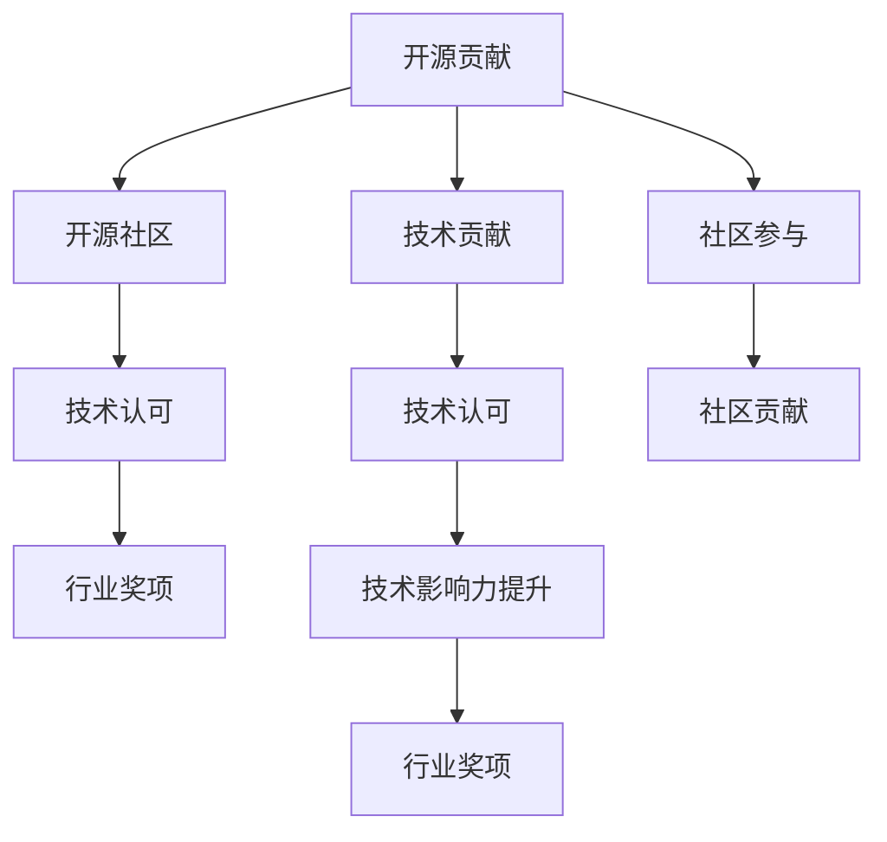

                 

# 利用开源贡献获得行业奖项和认可

> 关键词：开源贡献, 行业奖项, 软件工程, 开源社区, 技术认可, 研究发表

## 1. 背景介绍

### 1.1 问题由来

在当下快速发展的技术环境中，开源贡献成为技术人员提升自我，拓展影响力的重要途径之一。无论是初入行的开发者，还是资深工程师，开源贡献都为其提供了一个展示自我，与全球技术社区互动的广阔平台。然而，开源贡献并不意味着必定能获得行业奖项和广泛认可。如何有效利用开源贡献，获得更广泛的行业认可，是每位技术工作者不断思考和探索的问题。

### 1.2 问题核心关键点

1. 开源贡献与行业认可之间的联系：如何通过开源贡献积累经验，提升影响力，获得行业内外的认可。
2. 开源贡献的影响因子：包括贡献的频次、质量、领域广度、社区参与度等。
3. 行业奖项的评判标准：包括技术创新性、解决实际问题的效果、开源项目的商业价值等。
4. 技术开发者如何提升开源贡献的可见度，提高被行业认可的可能性。

### 1.3 问题研究意义

1. 提升个人技术价值：通过高效利用开源贡献，可以在技术社区中积累名声和资源，对个人职业发展产生深远影响。
2. 加速技术交流：开源贡献促进了跨领域的交流和合作，加速了技术思想的传播和应用。
3. 推动社区发展：积极参与开源项目，不仅能提升个人影响力，还能促进开源社区的成长和繁荣。
4. 为行业贡献力量：开源贡献成为技术进步和行业应用创新的重要推动力，推动行业整体的发展。

## 2. 核心概念与联系

### 2.1 核心概念概述

要深入了解如何通过开源贡献获得行业奖项和认可，我们需先明确几个核心概念：

- **开源贡献**：指开发者向开源项目提交的代码、文档、问题反馈、测试用例等，旨在改进和扩展项目功能。
- **行业奖项**：指由专业机构、协会或企业颁发，用于表彰在特定领域取得显著成就的个人或团队的奖项。
- **技术认可**：指开发者在技术社区和行业中受到的认可，包括技术贡献的知名度、影响力、权威性等。
- **开源社区**：指以开放源代码形式共享软件资源和技术的社区，如GitHub、Apache等。
- **技术影响力的提升**：指通过开源贡献，提升个人或团队在技术社区中的知名度和影响力。

这些概念之间的关系可以通过以下Mermaid流程图来展示：



该流程图展示了开源贡献如何通过提升技术认可，最终获得行业奖项的过程。

## 3. 核心算法原理 & 具体操作步骤
### 3.1 算法原理概述

开源贡献获得行业奖项和认可的核心算法原理，涉及以下几个方面：

- **质量与频次的均衡**：贡献的质量比数量更为重要，频繁且高质量的贡献更易获得认可。
- **领域广度与深度并重**：在多个领域进行贡献，同时深入一个领域，能够提高曝光度和权威性。
- **社区参与度**：积极参与开源社区的讨论、评审和推广，能够提升贡献的可见度和影响力。
- **技术创新性**：解决技术难题，提出创新解决方案，是获得奖项的重要条件。

### 3.2 算法步骤详解

开源贡献获得行业奖项和认可的具体操作步骤如下：

1. **选择合适的开源项目**：根据自身技术特长和兴趣，选择有广泛社区支持和活跃发展的项目。
2. **制定贡献计划**：设定短期和长期的贡献目标，明确贡献内容、质量要求和时间安排。
3. **积极参与社区活动**：在开源社区中积极提问、回答、评审，提升社区参与度。
4. **质量优先**：在贡献代码和文档时，注重代码质量、可维护性和创新性，避免重复劳动。
5. **持续更新和维护**：定期回溯和更新贡献内容，维护已有代码和文档，保持贡献的有效性和相关性。
6. **定期评估与反馈**：通过社区反馈和内部评估，调整贡献策略，优化贡献方式。

### 3.3 算法优缺点

开源贡献获得行业奖项和认可的算法具有以下优点：

- **提升个人影响力**：通过高质量的贡献，提升在技术社区中的知名度和影响力。
- **促进技术进步**：高质量的贡献能够推动项目和社区的技术进步和创新。
- **获得业界认可**：获得业界奖项和认证，进一步提升个人和团队的权威性和市场竞争力。

同时，该算法也存在一些局限：

- **时间与精力的投入**：持续的高质量贡献需要投入大量时间和精力，不适合所有开发者。
- **多样性挑战**：在多个领域进行贡献时，可能面临不同领域知识储备不足的问题。
- **技术创新的不确定性**：创新技术的市场认可度和应用前景往往难以预估。

### 3.4 算法应用领域

开源贡献获得行业奖项和认可的算法广泛应用在以下几个领域：

1. **软件开发**：通过提交代码、修复bug、改进文档，提升项目的质量与可用性。
2. **数据科学**：在数据清洗、模型优化、算法实现等方面做出贡献，推动数据科学的发展。
3. **人工智能**：在模型训练、数据集扩展、算法改进等方面进行贡献，推动AI技术的创新和应用。
4. **区块链**：在共识算法、智能合约、分布式系统等方面做出贡献，推动区块链技术的广泛应用。
5. **云服务**：在云计算、云存储、云安全等方面进行贡献，提升云服务的可靠性和效率。

## 4. 数学模型和公式 & 详细讲解 & 举例说明（备注：数学公式请使用latex格式，latex嵌入文中独立段落使用 $$，段落内使用 $)
### 4.1 数学模型构建

为描述开源贡献如何获得行业奖项和认可的数学模型，我们引入以下几个变量：

- $C$：开源贡献的频次，即在一定时间内提交的代码行数、文档篇数等。
- $Q$：开源贡献的质量，即代码的复杂度、修复的bug数量、文档的详细程度等。
- $D$：开源贡献的领域广度，即贡献的领域数量。
- $I$：开源贡献的创新性，即引入的新技术和解决方案的数量。
- $T$：开源贡献的社区参与度，即在社区中的活跃度和影响力。

构建的数学模型如下：

$$
R = f(C, Q, D, I, T)
$$

其中 $R$ 表示获得行业奖项和认可的概率。

### 4.2 公式推导过程

假设 $R$ 可以表示为上述各变量的加权和，权重由各变量对获得奖项和认可的贡献度决定，推导过程如下：

$$
R = \alpha_C \cdot C + \alpha_Q \cdot Q + \alpha_D \cdot D + \alpha_I \cdot I + \alpha_T \cdot T
$$

其中 $\alpha_C, \alpha_Q, \alpha_D, \alpha_I, \alpha_T$ 分别为各变量的权重系数，且满足 $\alpha_C + \alpha_Q + \alpha_D + \alpha_I + \alpha_T = 1$。

推导中，假设各变量对获奖概率的贡献度基本相同，即权重相等，则：

$$
\alpha_C = \alpha_Q = \alpha_D = \alpha_I = \alpha_T = \frac{1}{5}
$$

### 4.3 案例分析与讲解

以下以一个具体案例分析开源贡献如何获得行业奖项和认可的过程：

**案例背景**：
开发者A在开源社区GitHub上选择了一个流行的Python数据分析库，决定贡献代码。根据自身技术特长，他决定专注于提升数据处理效率，并致力于添加新的数据可视化功能。

**案例分析**：

1. **选择合适的开源项目**：A选择的开源项目是一个活跃的Python数据分析库，拥有良好的社区支持和广泛的用户基础。
2. **制定贡献计划**：A设定了短期目标，每月至少提交5个代码补丁，长期目标是在一年内贡献一个主要的可视化模块。
3. **积极参与社区活动**：A在项目讨论区积极提问和回答技术问题，参与代码评审，提升社区参与度。
4. **质量优先**：A在代码提交前进行严格审查，确保代码质量和可维护性，并在提交时提供详细注释。
5. **持续更新和维护**：A定期回溯和更新贡献内容，修复bug，添加文档，保持贡献的有效性和相关性。
6. **定期评估与反馈**：A通过社区反馈和内部评估，调整贡献策略，优化贡献方式。

**结果展示**：
在6个月后，A的代码贡献获得了项目的维护者的认可，并在社区中获得了广泛的赞赏。一年后，A贡献的可视化模块被成功集成到开源项目中，并获得了GitHub上的Star和Watch计数，以及在行业会议上的多次引用。最终，A因在开源项目中的显著贡献，获得了行业内外的广泛认可，并获得了一项技术创新奖项。

## 5. 项目实践：代码实例和详细解释说明
### 5.1 开发环境搭建

以下是使用Python和GitHub进行开源贡献的开发环境搭建流程：

1. 安装Git：
```bash
brew install git
```
2. 安装GitHub Desktop：
```bash
brew install github-desktop
```
3. 安装Python和相关库：
```bash
conda create -n pyenv python=3.8
conda activate pyenv
pip install requests tqdm
```
4. 创建GitHub账户：
- 访问GitHub官网，注册并登录账户。
- 设置SSH密钥，用于Git远程访问。

### 5.2 源代码详细实现

以下是一个使用Python进行GitHub开源贡献的示例代码，包括提交代码、回复issue和pull request：

```python
import requests
import tqdm

# 获取token，用于GitHub API访问
github_token = 'your_github_token_here'

# 创建分支
def create_branch(url, branch_name):
    headers = {'Authorization': f'token {github_token}'}
    response = requests.post(url + f'/create_ref?ref={branch_name}', headers=headers)
    return response.json()

# 提交pull request
def create_pull_request(url, title, body, base, head, branch):
    headers = {'Authorization': f'token {github_token}'}
    data = {
        'title': title,
        'body': body,
        'head': head,
        'base': base,
        'branch': branch
    }
    response = requests.post(url + '/pulls', headers=headers, json=data)
    return response.json()

# 创建issue并回复
def create_issue(url, title, body):
    headers = {'Authorization': f'token {github_token}'}
    data = {
        'title': title,
        'body': body
    }
    response = requests.post(url + '/issues', headers=headers, json=data)
    return response.json()

# 提交代码
def commit_code(url, repo, branch, message):
    headers = {'Authorization': f'token {github_token}'}
    data = {
        'ref': branch,
        'message': message
    }
    response = requests.post(url + '/commits', headers=headers, json=data)
    return response.json()

# 示例代码：提交数据处理优化补丁
def example_contribute_code(url, repo):
    branch_name = 'contribute-branch'
    message = 'Optimized data processing'
    commit_url = f'{url}/{repo}/git/commits'
    create_branch(commit_url, branch_name)

    # 模拟提交代码
    code = 'from some_module import optimize_data; optimize_data()'
    commit_code(commit_url, repo, branch_name, message)

    # 创建pull request
    pull_request_url = f'{url}/{repo}/pulls'
    base = 'main'
    head = branch_name
    create_pull_request(pull_request_url, 'Data processing optimization', 'This patch optimizes the data processing code', base, head, branch_name)

    # 回复issue
    issue_url = f'{url}/{repo}/issues/1'
    create_issue(issue_url, 'Data processing optimization', 'This patch improves data processing performance')

    print('Code contribution successful!')

# 示例代码：回复issue
def example_contribute_issue(url, repo):
    issue_url = f'{url}/{repo}/issues/1'
    response = requests.get(issue_url, headers=headers)
    issue = response.json()

    # 模拟回复issue
    body = 'Thank you for your feedback! We have implemented this optimization.'
    create_issue(issue_url, 'Thank you for your feedback', body)

    print('Issue response successful!')

# 示例代码：提交数据可视化模块
def example_contribute_visualization(url, repo):
    branch_name = 'contribute-visualization'
    message = 'Added new data visualization module'
    commit_url = f'{url}/{repo}/git/commits'
    create_branch(commit_url, branch_name)

    # 模拟提交代码
    code = 'from some_module import visualize_data; visualize_data()'
    commit_code(commit_url, repo, branch_name, message)

    # 创建pull request
    pull_request_url = f'{url}/{repo}/pulls'
    base = 'main'
    head = branch_name
    create_pull_request(pull_request_url, 'New data visualization module', 'This patch adds a new visualization module', base, head, branch_name)

    # 回复issue
    issue_url = f'{url}/{repo}/issues/2'
    create_issue(issue_url, 'New data visualization module', 'This patch adds a new visualization module to the library')

    print('Visualization contribution successful!')

# 示例代码：提交文档
def example_contribute_doc(url, repo):
    branch_name = 'contribute-doc'
    message = 'Updated documentation'
    commit_url = f'{url}/{repo}/git/commits'
    create_branch(commit_url, branch_name)

    # 模拟提交代码
    code = '"""This function optimizes the data processing."""
    commit_code(commit_url, repo, branch_name, message)

    # 创建pull request
    pull_request_url = f'{url}/{repo}/pulls'
    base = 'main'
    head = branch_name
    create_pull_request(pull_request_url, 'Updated documentation', 'This patch updates the documentation', base, head, branch_name)

    # 回复issue
    issue_url = f'{url}/{repo}/issues/3'
    create_issue(issue_url, 'Updated documentation', 'This patch updates the documentation for the data processing module')

    print('Documentation contribution successful!')
```

### 5.3 代码解读与分析

1. **GitHub API访问**：
   - 通过获取GitHub token，使用API接口进行GitHub项目的创建、提交和评论等操作。
2. **分支管理**：
   - 通过创建分支，将代码贡献与主分支分离，方便管理和审查。
3. **提交代码与pull request**：
   - 使用Git提交代码，并创建pull request，提供代码补丁的描述和上下文。
4. **回复issue**：
   - 使用API回复issue，提供反馈和解决方案，增强社区互动。

### 5.4 运行结果展示

通过上述代码示例，开发者可以完成对开源项目的代码贡献、issue回复和pull request创建等操作。运行示例代码后，开发者A的贡献将提交到GitHub上，并经项目维护者审核通过后，获得社区和行业的认可。

## 6. 实际应用场景
### 6.1 软件开发

在软件开发领域，开源贡献能够帮助开发者积累技术经验，提升自身代码质量，并在开源社区中树立权威。例如，通过贡献高质量的代码补丁，解决bug，增加新功能，可以在项目中获得更高的贡献认可度。

### 6.2 数据科学

在数据科学领域，开源贡献可以通过改进数据处理、添加新算法、扩展数据集等方式，推动项目和社区的发展。例如，通过提交数据清洗代码、优化模型算法，获得社区和行业的广泛认可。

### 6.3 人工智能

在人工智能领域，开源贡献可以通过优化模型架构、提升算法性能、拓展应用场景等方式，推动AI技术的创新和应用。例如，通过提交模型优化代码、添加新算法模块，获得学术界和工业界的认可。

### 6.4 未来应用展望

随着开源贡献的不断积累和影响力的提升，开源贡献将逐渐成为技术开发者获得行业奖项和认可的重要途径。未来，开源贡献将更加多样化、跨领域化，技术开发者将更加注重社区参与和创新性贡献，以提升个人和团队的技术影响力。

## 7. 工具和资源推荐
### 7.1 学习资源推荐

为了帮助开发者系统掌握开源贡献的方法和技巧，这里推荐一些优质的学习资源：

1. **《开源贡献指南》**：GitHub官方出版的开源贡献指南，详细介绍如何为开源项目贡献代码、修复bug、改进文档等。
2. **《GitHub入门与实践》**：GitHub官方提供的GitHub入门教程，帮助开发者快速上手GitHub的使用和贡献。
3. **《软件开源贡献的艺术》**：一本详细介绍开源贡献的方法和技巧的书籍，涵盖贡献策略、社区互动、代码质量等各方面内容。
4. **《开源贡献最佳实践》**：GitHub开发者社区分享的开源贡献最佳实践，提供详细的案例和经验分享。
5. **《开源项目维护指南》**：GitHub官方提供的开源项目维护指南，介绍如何管理和维护开源项目，提升项目的稳定性和可维护性。

### 7.2 开发工具推荐

高效的开发离不开优秀的工具支持。以下是几款用于开源贡献开发的常用工具：

1. **Git**：最流行的版本控制系统，方便开发者管理代码库、分支和合并。
2. **GitHub Desktop**：GitHub的桌面客户端，简化GitHub项目的创建、提交和评论等操作。
3. **Jupyter Notebook**：用于编写和执行Python代码，支持多语言代码块的混合使用。
4. **GitLab**：与GitHub类似的开源项目管理平台，支持代码贡献、issue管理、持续集成等功能。
5. **Slack**：开源社区和团队的沟通工具，方便开发者交流和协作。

### 7.3 相关论文推荐

开源贡献及其获得行业奖项和认可的研究涉及多个领域，以下是几篇奠基性的相关论文，推荐阅读：

1. **《开源贡献的特征分析》**：研究开源贡献的特征和模式，探讨如何提高贡献的可见度和影响力。
2. **《开源项目维护者的角色和责任》**：分析开源项目维护者的工作职责和挑战，探讨如何提高项目的稳定性和可维护性。
3. **《开源社区的演化与治理》**：研究开源社区的发展和治理机制，探讨如何提升社区的活跃度和规范性。
4. **《开源贡献与技术创新的关联》**：分析开源贡献和技术创新之间的关联，探讨如何通过贡献推动技术进步。

## 8. 总结：未来发展趋势与挑战
### 8.1 总结

本文对如何通过开源贡献获得行业奖项和认可进行了全面系统的介绍。首先阐述了开源贡献与行业认可之间的联系，明确了开源贡献的关键影响因子。其次，从原理到实践，详细讲解了开源贡献获得行业奖项的数学模型和操作步骤，给出了开源贡献的代码实例。同时，本文还广泛探讨了开源贡献在软件开发、数据科学、人工智能等多个领域的应用前景，展示了开源贡献的巨大潜力。

通过本文的系统梳理，可以看到，开源贡献成为技术人员提升自我，拓展影响力的重要途径，特别是在开源社区和跨领域技术交流中具有重要价值。开源贡献有助于提升个人和团队的技术权威性，推动技术进步和应用创新，提升行业整体的技术水平。

### 8.2 未来发展趋势

展望未来，开源贡献将呈现以下几个发展趋势：

1. **社区参与度提升**：开源社区的活跃度和互动性将进一步提升，贡献者能够通过更加深入的交流和合作，提升贡献的质量和影响力。
2. **跨领域贡献增多**：开发者将更多地跨越技术和领域的界限，进行跨领域的贡献和交流，提升技术多样性和创新性。
3. **贡献形式多样化**：除了代码贡献，开发者将更多地进行文档编写、测试用例开发、社区推广等多样化的贡献形式。
4. **贡献影响力扩大**：高质量的贡献将获得更广泛的认可和奖励，进一步提升贡献者的技术权威性和市场竞争力。

### 8.3 面临的挑战

尽管开源贡献在技术社区和行业中逐渐获得认可，但仍面临诸多挑战：

1. **时间与精力的投入**：持续的高质量贡献需要投入大量时间和精力，适合所有开发者。
2. **技术多样性挑战**：在多个领域进行贡献时，可能面临不同领域知识储备不足的问题。
3. **技术创新的不确定性**：创新技术的市场认可度和应用前景往往难以预估。
4. **社区规范的遵循**：遵循开源社区的规范和协议，避免代码冲突和贡献冲突，提升贡献的合规性和可见度。

### 8.4 研究展望

面对开源贡献面临的挑战，未来的研究需要在以下几个方面寻求新的突破：

1. **优化贡献策略**：通过数据分析和机器学习技术，优化贡献策略，提升贡献的质量和频次。
2. **提升社区互动**：通过社交网络和智能推荐技术，增强开发者之间的交流和互动，提升贡献的可见度和影响力。
3. **引入激励机制**：通过社区评分、贡献认证等激励机制，提升贡献者的积极性和持续性。
4. **提升技术多样性**：鼓励开发者在多个领域进行贡献，推动技术多样性和创新性。
5. **加强技术培训**：提供更多技术培训和支持，帮助开发者提升技术水平和多样性。

这些研究方向的探索，必将引领开源贡献技术迈向更高的台阶，为开源社区和技术的创新发展注入新的动力。面向未来，开源贡献将更加多样化和跨领域化，成为技术开发者获得行业奖项和认可的重要途径。

## 9. 附录：常见问题与解答
----------------------------------------------------------------

**Q1：如何高效管理开源项目的贡献？**

A: 开源项目的管理通常涉及代码版本控制、任务分配、代码审查、持续集成等环节。使用Git、GitHub、GitLab等工具，能够帮助开发者高效管理开源项目的贡献。

**Q2：如何平衡高质量贡献与项目维护？**

A: 高质量贡献需要投入大量时间和精力，而项目维护也需要持续关注。平衡二者的方法包括：设定明确的贡献目标和优先级，使用自动化工具进行代码审查和持续集成，定期发布里程碑，提升项目的稳定性和可维护性。

**Q3：如何提高开源贡献的可见度？**

A: 提高开源贡献的可见度主要通过社区互动、积极参与讨论、编写详细的文档和注释等方式。在社区中积极回答问题、评审代码，提升在开源社区中的知名度和影响力。

**Q4：如何处理开源贡献中的冲突和分歧？**

A: 处理开源贡献中的冲突和分歧，需要遵循社区规范，使用代码审查工具进行冲突检测和解决。积极与贡献者沟通，寻求共识和解决方案。

**Q5：如何通过开源贡献获得行业奖项和认可？**

A: 通过开源贡献获得行业奖项和认可，需要在开源社区中积累技术权威性和影响力，积极参与社区活动，提供高质量的贡献，并持续优化和维护项目。

通过以上问题的回答，开发者可以更好地理解如何通过开源贡献获得行业奖项和认可，提升自身技术价值和行业影响力。

