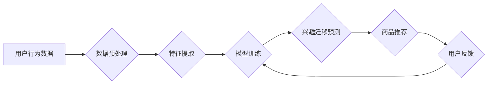

                 

## 电商平台中的用户兴趣迁移轨迹分析

> 关键词：用户兴趣迁移、电商平台、数据挖掘、推荐系统、机器学习、关联规则、聚类分析

## 1. 背景介绍

在当今数据爆炸的时代，电商平台积累了海量用户行为数据，其中用户兴趣迁移轨迹蕴藏着丰富的商业价值。用户兴趣迁移是指用户在一段时间内，其关注商品、浏览页面、购买行为等方面的变化趋势。分析用户兴趣迁移轨迹可以帮助电商平台：

* **精准推荐商品:**  根据用户的兴趣迁移趋势，推荐更符合用户当前需求的商品，提升用户购物体验和转化率。
* **个性化营销:**  针对不同兴趣迁移阶段的用户，制定个性化的营销策略，提高营销精准度和效果。
* **产品开发:**  了解用户兴趣迁移规律，为产品开发提供参考，开发更符合用户需求的新产品。
* **用户画像:**  构建更精准的用户画像，深入了解用户需求和行为模式。

然而，用户兴趣迁移轨迹分析面临着诸多挑战：

* **数据复杂性:** 用户行为数据通常是高维、稀疏、动态变化的，难以直接分析。
* **兴趣迁移规律复杂:** 用户兴趣迁移受多种因素影响，其规律难以捕捉。
* **隐私保护:** 用户行为数据涉及个人隐私，需要进行安全保护。

## 2. 核心概念与联系

### 2.1 用户兴趣迁移

用户兴趣迁移是指用户在一段时间内，其关注商品、浏览页面、购买行为等方面的变化趋势。它可以表现为：

* **兴趣集中:** 用户对特定商品类别或品牌表现出持续的关注。
* **兴趣扩展:** 用户逐渐扩展其兴趣范围，关注更多新的商品类别或品牌。
* **兴趣转移:** 用户从一个商品类别或品牌转移到另一个，放弃原有的兴趣。

### 2.2 数据挖掘与机器学习

数据挖掘和机器学习是分析用户兴趣迁移轨迹的关键技术。

* **数据挖掘:** 从海量用户行为数据中发现隐藏的模式和规律。常用的数据挖掘技术包括关联规则挖掘、聚类分析、分类算法等。
* **机器学习:** 利用算法学习用户兴趣迁移的规律，预测用户的未来行为。常用的机器学习算法包括决策树、支持向量机、神经网络等。

### 2.3 推荐系统

推荐系统是基于用户兴趣迁移轨迹分析，为用户推荐个性化商品的系统。

**用户兴趣迁移轨迹分析与推荐系统的架构图:**



## 3. 核心算法原理 & 具体操作步骤

### 3.1 算法原理概述

本篇博客将重点介绍基于关联规则挖掘和聚类分析的算法原理，用于分析用户兴趣迁移轨迹。

* **关联规则挖掘:**  发现用户行为数据中频繁出现的商品组合，揭示用户兴趣之间的关联关系。
* **聚类分析:** 将用户根据其兴趣迁移轨迹进行分组，识别不同类型的用户兴趣迁移模式。

### 3.2 算法步骤详解

#### 3.2.1 关联规则挖掘

1. **数据预处理:** 清洗用户行为数据，去除无效数据，并对数据进行格式转换。
2. **频繁项集挖掘:** 使用Apriori算法或FP-Growth算法等，挖掘用户行为数据中频繁出现的商品组合。
3. **关联规则生成:**  根据频繁项集，使用支持度和置信度等指标，生成用户兴趣之间的关联规则。

#### 3.2.2 聚类分析

1. **数据预处理:**  对用户行为数据进行特征提取，例如用户浏览商品的频率、购买商品的种类等。
2. **聚类算法选择:**  根据用户行为数据的特点，选择合适的聚类算法，例如K-Means算法、DBSCAN算法等。
3. **聚类结果分析:**  分析聚类结果，识别不同类型的用户兴趣迁移模式，并为每个模式命名。

### 3.3 算法优缺点

#### 3.3.1 关联规则挖掘

* **优点:**  能够发现用户兴趣之间的隐性关联关系，为个性化推荐提供依据。
* **缺点:**  容易产生大量冗余规则，需要进行规则筛选和优化。

#### 3.3.2 聚类分析

* **优点:**  能够将用户根据兴趣迁移轨迹进行分组，识别不同类型的用户行为模式。
* **缺点:**  需要预先设定聚类数量，难以确定最佳聚类数。

### 3.4 算法应用领域

关联规则挖掘和聚类分析算法广泛应用于电商平台的用户兴趣迁移轨迹分析，以及其他领域，例如：

* **市场营销:**  分析客户购买行为，制定精准营销策略。
* **推荐系统:**  根据用户兴趣，推荐个性化商品或服务。
* **用户画像:**  构建用户画像，了解用户需求和行为模式。

## 4. 数学模型和公式 & 详细讲解 & 举例说明

### 4.1 数学模型构建

#### 4.1.1 关联规则挖掘

关联规则挖掘的核心是频繁项集挖掘。频繁项集是指在用户行为数据中出现的频率高于某个阈值的商品组合。

* **支持度:**  频繁项集在用户行为数据中出现的频率。

$$
Support(I) = \frac{Number of transactions containing I}{Total number of transactions}
$$

* **置信度:**  给定一个项集A，另一个项集B在A出现的条件下出现的概率。

$$
Confidence(A \rightarrow B) = \frac{Support(A \cup B)}{Support(A)}
$$

#### 4.1.2 聚类分析

聚类分析的目标是将用户根据其兴趣迁移轨迹进行分组。常用的聚类算法包括K-Means算法和DBSCAN算法。

* **K-Means算法:**  将用户数据划分为K个簇，每个簇的中心点是该簇中所有用户的平均值。

* **DBSCAN算法:**  将用户数据划分为簇，簇中的用户彼此距离较近，而簇之间的用户距离较远。

### 4.2 公式推导过程

* **K-Means算法:**  

1.  随机选择K个用户作为初始簇中心。
2.  将每个用户分配到距离其最近的簇中心。
3.  重新计算每个簇的中心点。
4.  重复步骤2和3，直到簇中心不再变化。

* **DBSCAN算法:**

1.  定义一个距离阈值ε和最小样本数MinPts。
2.  对于每个用户，找到其ε-邻域内的用户数量。
3.  如果用户ε-邻域内的用户数量大于MinPts，则该用户属于一个核心点，并将其作为簇的中心。
4.  将所有与核心点距离小于ε的用户添加到该簇中。
5.  重复步骤3和4，直到所有用户都被分配到一个簇中。

### 4.3 案例分析与讲解

#### 4.3.1 关联规则挖掘案例

假设电商平台的用户行为数据中，频繁出现的商品组合是“手机+耳机”。

* **支持度:**  如果“手机+耳机”组合出现在1000个用户交易中，而总交易数为10000，则支持度为0.1。
* **置信度:**  如果“手机”出现在10000个用户交易中，而“手机+耳机”组合出现在1000个用户交易中，则置信度为0.1。

#### 4.3.2 聚类分析案例

将电商平台的用户根据其浏览商品的频率和购买商品的种类进行聚类分析，可以识别出以下用户类型：

* **高频购物者:**  浏览商品频率高，购买商品种类多。
* **忠诚用户:**  对特定商品类别或品牌表现出持续的关注。
* **偶尔购物者:**  浏览商品频率低，购买商品种类少。

## 5. 项目实践：代码实例和详细解释说明

### 5.1 开发环境搭建

本项目使用Python语言进行开发，所需的库包括pandas、scikit-learn等。

### 5.2 源代码详细实现

```python
# 导入必要的库
import pandas as pd
from sklearn.cluster import KMeans

# 加载用户行为数据
data = pd.read_csv('user_behavior.csv')

# 特征提取
data['浏览商品数量'] = data.groupby('用户ID')['商品ID'].transform('count')
data['购买商品数量'] = data.groupby('用户ID')['商品ID'].transform('count')

# 数据预处理
X = data[['浏览商品数量', '购买商品数量']]

# 聚类分析
kmeans = KMeans(n_clusters=3)
kmeans.fit(X)

# 将聚类结果添加到数据中
data['用户类型'] = kmeans.labels_

# 保存结果
data.to_csv('user_behavior_clustered.csv', index=False)
```

### 5.3 代码解读与分析

* **数据加载:**  使用pandas库加载用户行为数据。
* **特征提取:**  提取用户浏览商品数量和购买商品数量作为聚类特征。
* **数据预处理:**  将特征数据存储在X变量中。
* **聚类分析:**  使用KMeans算法进行聚类分析，将用户分为3个簇。
* **结果保存:**  将聚类结果添加到数据中，并保存到新的CSV文件中。

### 5.4 运行结果展示

运行代码后，将生成一个新的CSV文件，其中包含用户行为数据和用户类型信息。

## 6. 实际应用场景

### 6.1 个性化商品推荐

根据用户兴趣迁移轨迹，为用户推荐更符合其当前需求的商品。例如，如果用户最近频繁浏览运动鞋，则可以推荐相关的运动服、运动配件等商品。

### 6.2 个性化营销

针对不同兴趣迁移阶段的用户，制定个性化的营销策略。例如，可以针对新用户提供优惠券，针对忠诚用户提供会员积分等。

### 6.3 产品开发

了解用户兴趣迁移规律，为产品开发提供参考，开发更符合用户需求的新产品。例如，如果发现用户对智能家居产品的兴趣越来越高，则可以开发新的智能家居产品。

### 6.4 未来应用展望

随着数据量的不断增长和算法的不断发展，用户兴趣迁移轨迹分析将在电商平台等领域发挥更重要的作用。未来，用户兴趣迁移轨迹分析可以应用于：

* **更精准的个性化推荐:**  利用深度学习等先进算法，对用户兴趣进行更细粒度的分析，提供更精准的个性化推荐。
* **更有效的营销策略:**  根据用户兴趣迁移轨迹，制定更有效的营销策略，提高营销精准度和效果。
* **更智能的产品开发:**  利用用户兴趣迁移轨迹数据，预测未来用户需求，为产品开发提供更智能的参考。

## 7. 工具和资源推荐

### 7.1 学习资源推荐

* **书籍:**  《数据挖掘：概念与技术》
* **在线课程:**  Coursera上的数据挖掘课程
* **博客:**  机器学习与数据挖掘博客

### 7.2 开发工具推荐

* **Python:**  数据分析和机器学习的常用编程语言
* **pandas:**  数据分析和处理库
* **scikit-learn:**  机器学习库
* **TensorFlow:**  深度学习库

### 7.3 相关论文推荐

* **Association Rule Mining: A Data Mining Perspective:**  https://www.researchgate.net/publication/228924476_Association_Rule_Mining_A_Data_Mining_Perspective
* **K-Means Clustering:**  https://en.wikipedia.org/wiki/K-means_clustering

## 8. 总结：未来发展趋势与挑战

### 8.1 研究成果总结

本篇博客介绍了电商平台中用户兴趣迁移轨迹分析的原理、算法和应用场景。通过关联规则挖掘和聚类分析等技术，可以发现用户兴趣之间的关联关系，识别不同类型的用户兴趣迁移模式，为电商平台提供个性化推荐、营销策略和产品开发等方面的参考。

### 8.2 未来发展趋势

* **更精准的兴趣迁移预测:**  利用深度学习等先进算法，对用户兴趣进行更细粒度的分析，提高兴趣迁移预测的准确性。
* **更个性化的用户体验:**  根据用户兴趣迁移轨迹，提供更个性化的商品推荐、营销策略和用户体验。
* **更智能的产品开发:**  利用用户兴趣迁移轨迹数据，预测未来用户需求，为产品开发提供更智能的参考。

### 8.3 面临的挑战

* **数据质量:**  用户行为数据通常是高维、稀疏、动态变化的，需要进行有效的数据清洗和预处理。
* **隐私保护:**  用户行为数据涉及个人隐私，需要进行安全保护。
* **算法复杂度:**  一些用户兴趣迁移分析算法的复杂度较高，需要进行优化和改进。

### 8.4 研究展望

未来，用户兴趣迁移轨迹分析将是一个充满挑战和机遇的领域。随着数据量的不断增长和算法的不断发展，用户兴趣迁移轨迹分析将为电商平台和其他领域带来更多价值。

## 9. 附录：常见问题与解答

### 9.1 如何处理用户行为数据中的缺失值？

可以采用以下方法处理用户行为数据中的缺失值：

* **删除缺失值:**  如果缺失值较少，可以删除包含缺失值的记录。
* **用平均值填充缺失值:**  如果缺失值较多，可以将缺失值填充为该特征的平均值。
* **用其他特征预测缺失值:**  可以使用机器学习算法，根据其他特征预测缺失值。

### 9.2 如何选择合适的聚类算法？

选择合适的聚类算法需要考虑以下因素：

* **数据类型:**  不同的聚类算法适用于不同的数据类型。
* **数据规模:**  一些聚类算法的复杂度较高，不适合处理大规模数据。
* **聚类目标:**  不同的聚类算法具有不同的聚类效果，需要根据具体的聚类目标选择合适的算法。


作者：禅与计算机程序设计艺术 / Zen and the Art of Computer Programming<end_of_turn>

