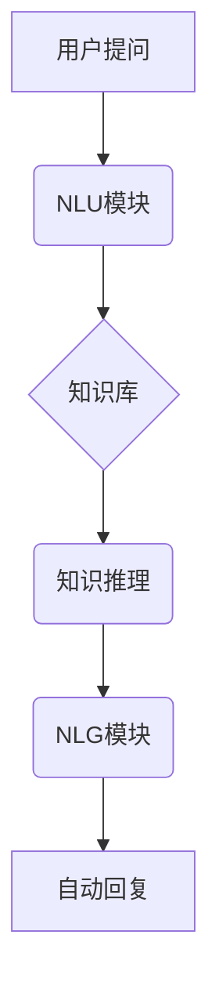

                 

## 电商平台中的自动问答：大模型的创新应用

> 关键词：电商平台、自动问答、大模型、自然语言处理、知识图谱、机器学习、对话系统

## 1. 背景介绍

随着电商平台的蓬勃发展，用户对商品信息的需求日益增长。传统的客服模式难以满足用户快速获取信息的需求，自动问答系统应运而生。自动问答系统能够利用人工智能技术，自动理解用户的问题，并提供准确、高效的答案，从而提升用户体验，降低客服成本。

大模型的出现为自动问答系统带来了新的机遇。大模型拥有强大的语义理解和文本生成能力，能够处理更复杂、更灵活的用户问题，并提供更自然、更人性化的回复。

## 2. 核心概念与联系

### 2.1 自动问答系统

自动问答系统是一种能够自动理解用户问题并提供答案的计算机系统。它通常由以下几个模块组成：

* **自然语言理解 (NLU)**：负责理解用户的问题，提取关键信息，例如问题类型、实体、意图等。
* **知识库**：存储着丰富的商品信息、政策法规、常见问题解答等知识。
* **知识推理**：根据用户问题和知识库中的信息，进行逻辑推理，找到最合适的答案。
* **自然语言生成 (NLG)**：将推理结果转化为自然语言，生成流畅、易懂的回复。

### 2.2 大模型

大模型是指在海量数据上训练的深度学习模型，拥有庞大的参数量和强大的泛化能力。大模型能够学习到复杂的语言模式和知识关系，在自然语言处理、计算机视觉、语音识别等领域取得了突破性进展。

### 2.3 核心架构

大模型在自动问答系统中的应用主要体现在以下几个方面：

* **NLU模块增强**: 大模型可以用于构建更强大的NLU模型，提升用户问题的理解能力，例如识别更复杂的语义关系、理解用户隐含意图等。
* **知识库构建**: 大模型可以用于自动构建知识库，例如从文本数据中提取商品信息、关系等，并进行知识图谱构建。
* **知识推理**: 大模型可以用于构建更智能的知识推理模型，例如利用图神经网络进行知识推理，找到更准确、更全面的答案。
* **NLG模块增强**: 大模型可以用于生成更自然、更流畅的回复，例如利用文本生成模型生成更符合语境的答案。



## 3. 核心算法原理 & 具体操作步骤

### 3.1 算法原理概述

大模型在自动问答系统中的应用主要基于以下核心算法：

* **Transformer模型**: Transformer模型是一种基于注意力机制的深度学习模型，能够有效地捕捉文本序列中的长距离依赖关系，在自然语言理解和生成任务中取得了优异的性能。
* **BERT模型**: BERT模型是一种基于Transformer的预训练语言模型，通过在大量的文本数据上进行预训练，学习到丰富的语言表示和知识，可以用于各种自然语言处理任务，包括自动问答。
* **图神经网络**: 图神经网络是一种能够处理图结构数据的深度学习模型，可以用于构建知识图谱，并进行知识推理，例如找到用户问题与知识库中实体之间的关系。

### 3.2 算法步骤详解

1. **数据预处理**: 收集并预处理电商平台相关的文本数据，例如商品描述、用户评论、常见问题解答等，并将其转换为模型可理解的格式。
2. **模型训练**: 使用预训练的Transformer模型或BERT模型，对预处理后的数据进行训练，学习到电商领域相关的语言表示和知识。
3. **模型评估**: 使用测试集评估模型的性能，例如准确率、召回率、F1-score等，并根据评估结果进行模型调优。
4. **部署与应用**: 将训练好的模型部署到电商平台，并将其集成到自动问答系统中，用于处理用户问题。

### 3.3 算法优缺点

**优点**:

* **准确率高**: 大模型能够学习到复杂的语言模式和知识关系，提高自动问答系统的准确率。
* **泛化能力强**: 大模型在海量数据上进行预训练，具有较强的泛化能力，能够适应不同的电商平台和用户需求。
* **可扩展性强**: 大模型的架构灵活，可以根据实际需求进行扩展，例如添加新的知识库、改进知识推理模型等。

**缺点**:

* **计算资源需求高**: 大模型的训练和部署需要大量的计算资源，成本较高。
* **数据依赖性强**: 大模型的性能取决于训练数据的质量和数量，如果训练数据不足或质量较低，模型性能会受到影响。
* **解释性差**: 大模型的决策过程较为复杂，难以解释模型的 reasoning 过程，这可能会导致用户对自动回复的信任度降低。

### 3.4 算法应用领域

大模型在自动问答系统中的应用领域非常广泛，例如：

* **电商客服**: 自动回答用户关于商品信息、订单状态、退换货政策等常见问题。
* **商品推荐**: 根据用户的历史购买记录和浏览记录，推荐相关的商品。
* **个性化营销**: 根据用户的兴趣爱好和购买行为，提供个性化的商品推荐和促销信息。
* **用户体验提升**: 提供更便捷、更智能的购物体验，提升用户满意度。

## 4. 数学模型和公式 & 详细讲解 & 举例说明

### 4.1 数学模型构建

自动问答系统中的核心数学模型主要包括：

* **词嵌入模型**: 将单词映射到低维向量空间，捕捉单词之间的语义关系。常用的词嵌入模型包括Word2Vec、GloVe、FastText等。
* **注意力机制**: 允许模型关注输入序列中重要的部分，提高模型对上下文信息的理解能力。
* **Transformer模型**: 基于注意力机制的深度学习模型，能够有效地捕捉文本序列中的长距离依赖关系。

### 4.2 公式推导过程

Transformer模型的核心是多头注意力机制，其计算公式如下：

$$
Attention(Q, K, V) = softmax(\frac{QK^T}{\sqrt{d_k}})V
$$

其中：

* $Q$：查询矩阵
* $K$：键矩阵
* $V$：值矩阵
* $d_k$：键向量的维度
* $softmax$：softmax函数

### 4.3 案例分析与讲解

假设用户提问：“这款手机的屏幕尺寸是多少？”，我们可以将问题分解成以下词语：

* “这款”
* “手机”
* “屏幕”
* “尺寸”
* “是多少”

使用词嵌入模型将这些词语映射到向量空间，然后利用多头注意力机制计算每个词语之间的关系，最终得到一个表示整个问题的向量。

## 5. 项目实践：代码实例和详细解释说明

### 5.1 开发环境搭建

* Python 3.7+
* TensorFlow 2.0+
* PyTorch 1.0+
* CUDA Toolkit 10.2+

### 5.2 源代码详细实现

```python
# 使用BERT模型进行自动问答
from transformers import AutoModelForQuestionAnswering, AutoTokenizer

# 加载预训练模型和分词器
model_name = "bert-base-uncased"
model = AutoModelForQuestionAnswering.from_pretrained(model_name)
tokenizer = AutoTokenizer.from_pretrained(model_name)

# 定义用户问题和上下文
question = "这款手机的屏幕尺寸是多少？"
context = "这款手机采用6.5英寸AMOLED屏幕，分辨率为1080x2400像素。"

# 将问题和上下文转换为模型输入格式
inputs = tokenizer(question, context, return_tensors="pt")

# 使用模型进行预测
outputs = model(**inputs)

# 获取模型预测的答案
answer_start = outputs.start_logits.argmax().item()
answer_end = outputs.end_logits.argmax().item()

# 将预测的答案转换为文本
answer = tokenizer.decode(inputs["input_ids"][0][answer_start:answer_end+1])

# 打印预测结果
print(f"预测答案: {answer}")
```

### 5.3 代码解读与分析

* 首先，我们使用transformers库加载预训练的BERT模型和分词器。
* 然后，我们定义用户问题和上下文信息。
* 使用tokenizer将问题和上下文转换为模型输入格式。
* 使用模型进行预测，获取答案的起始位置和结束位置。
* 最后，使用tokenizer将预测的答案转换为文本，并打印结果。

### 5.4 运行结果展示

```
预测答案: 6.5英寸
```

## 6. 实际应用场景

### 6.1 电商客服

自动问答系统可以帮助电商平台客服人员处理大量重复性的用户问题，例如商品信息查询、订单状态查询、退换货政策查询等，从而提高客服人员的工作效率，并提升用户体验。

### 6.2 商品推荐

自动问答系统可以根据用户的提问，理解用户的需求，并推荐相关的商品。例如，用户提问“想买一款适合户外运动的手机”，自动问答系统可以推荐一些防水、防摔、续航能力强的手机。

### 6.3 个性化营销

自动问答系统可以根据用户的历史购买记录、浏览记录、用户画像等信息，提供个性化的商品推荐和促销信息，提高用户转化率。

### 6.4 未来应用展望

随着大模型技术的不断发展，自动问答系统将会有更广泛的应用场景，例如：

* **多模态问答**: 能够理解用户通过文本、图像、语音等多种方式提出的问题。
* **个性化对话**: 能够根据用户的个性化需求，进行更自然、更人性化的对话。
* **跨语言问答**: 能够理解和回复不同语言的用户问题。

## 7. 工具和资源推荐

### 7.1 学习资源推荐

* **斯坦福大学自然语言处理课程**: https://web.stanford.edu/class/cs224n/
* **深度学习 Specialization**: https://www.deeplearning.ai/
* **Hugging Face Transformers 文档**: https://huggingface.co/docs/transformers/index

### 7.2 开发工具推荐

* **TensorFlow**: https://www.tensorflow.org/
* **PyTorch**: https://pytorch.org/
* **Hugging Face Transformers**: https://huggingface.co/transformers/

### 7.3 相关论文推荐

* **BERT: Pre-training of Deep Bidirectional Transformers for Language Understanding**: https://arxiv.org/abs/1810.04805
* **Attention Is All You Need**: https://arxiv.org/abs/1706.03762

## 8. 总结：未来发展趋势与挑战

### 8.1 研究成果总结

大模型在自动问答系统中的应用取得了显著的成果，例如准确率大幅提升、泛化能力增强等。

### 8.2 未来发展趋势

* **多模态问答**: 将文本、图像、语音等多种模态信息融合到自动问答系统中，提升系统的理解能力和应用场景。
* **个性化对话**: 利用用户画像、行为数据等信息，构建个性化的对话系统，提供更精准、更人性化的服务。
* **跨语言问答**: 突破语言障碍，实现跨语言的自动问答，满足全球用户的需求。

### 8.3 面临的挑战

* **数据质量**: 大模型的性能依赖于训练数据的质量，如何获取高质量的电商数据仍然是一个挑战。
* **计算资源**: 大模型的训练和部署需要大量的计算资源，成本较高，如何降低成本仍然是一个难题。
* **解释性**: 大模型的决策过程较为复杂，难以解释模型的 reasoning 过程，这可能会导致用户对自动回复的信任度降低。

### 8.4 研究展望

未来，我们将继续探索大模型在自动问答系统中的应用，例如：

* 研究更有效的训练方法，提升大模型的性能和效率。
* 开发更易于解释的模型，提高用户对自动回复的信任度。
* 将自动问答系统与其他人工智能技术融合，构建更智能、更全面的电商服务平台。

## 9. 附录：常见问题与解答

### 9.1 如何选择合适的自动问答系统？

选择合适的自动问答系统需要根据电商平台的具体需求进行评估，例如：

* **用户规模**: 平台的用户规模越大，需要选择更强大的自动问答系统。
* **问题类型**: 平台的用户问题类型复杂程度越高，需要选择更智能的自动问答系统。
* **预算**: 平台的预算有限，需要选择性价比更高的自动问答系统。

### 9.2 自动问答系统如何保证准确性？

自动问答系统的准确性取决于以下几个因素：

* **训练数据**: 训练数据的质量直接影响模型的性能，需要使用高质量的电商数据进行训练。
* **模型架构**: 选择合适的模型架构，例如Transformer模型，能够有效地捕捉文本序列中的语义关系。
* **模型参数**: 模型参数的设置也会影响模型的性能，需要进行调优。

### 9.3 自动问答系统如何处理用户提出的新问题？

自动问答系统可以通过以下方式处理用户提出的新问题：

* **知识库更新**: 定期更新知识库，添加新的商品信息、政策法规等。
* **模型微调**: 使用新的用户问题进行模型微调，提升模型对新问题的理解能力。
* **人工干预**: 当模型无法理解用户问题时，可以人工干预，提供准确的答案。


作者：禅与计算机程序设计艺术 / Zen and the Art of Computer Programming 
<end_of_turn>

