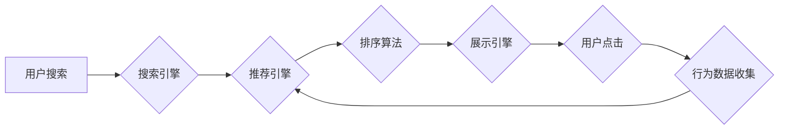

                 

## 电商平台搜索推荐系统的AI 大模型融合：提高系统性能、效率与准确率

> 关键词：电商平台、搜索推荐系统、AI 大模型、模型融合、性能优化、效率提升、准确率提高

## 1. 背景介绍

在当今数据爆炸的时代，电商平台搜索推荐系统已成为用户获取商品信息和完成购买决策的关键环节。传统的搜索推荐系统主要依赖于基于规则的算法和特征工程，但随着用户行为的复杂化和商品信息的爆炸式增长，这些方法逐渐难以满足用户需求。

近年来，深度学习技术的发展为搜索推荐系统带来了新的机遇。AI 大模型，特别是 Transformer 架构，凭借其强大的语义理解和序列建模能力，在自然语言处理、计算机视觉等领域取得了突破性进展。将 AI 大模型应用于电商平台搜索推荐系统，可以有效提升系统的性能、效率和准确率。

## 2. 核心概念与联系

### 2.1  搜索推荐系统

电商平台搜索推荐系统旨在根据用户的搜索意图和历史行为，推荐相关商品，帮助用户快速找到所需商品。系统通常包含以下几个关键模块：

* **搜索引擎:** 处理用户搜索词，并返回相关商品列表。
* **推荐引擎:** 基于用户画像、商品信息和行为数据，推荐个性化商品列表。
* **排序算法:** 对推荐结果进行排序，将最相关的商品排在前面。
* **展示引擎:** 将排序后的商品列表以用户友好的方式展示给用户。

### 2.2  AI 大模型

AI 大模型是指在海量数据上训练的深度学习模型，具有强大的泛化能力和学习能力。常见的 AI 大模型架构包括 Transformer、BERT、GPT 等。

### 2.3  模型融合

模型融合是指将多个模型的预测结果进行组合，以获得更准确和鲁棒的预测结果。常见的模型融合方法包括平均法、加权法、投票法等。

**Mermaid 流程图**



## 3. 核心算法原理 & 具体操作步骤

### 3.1  算法原理概述

AI 大模型融合在电商平台搜索推荐系统中的应用，主要通过以下步骤实现：

1. **数据预处理:** 对用户搜索词、商品信息和行为数据进行清洗、转换和特征提取。
2. **模型训练:** 使用不同的 AI 大模型分别训练，例如 Transformer 模型用于理解用户搜索意图，BERT 模型用于商品信息提取，GPT 模型用于生成个性化推荐文案。
3. **模型融合:** 将多个模型的预测结果进行融合，例如使用加权平均法将不同模型的推荐结果进行加权组合。
4. **系统部署:** 将融合后的模型部署到线上环境，实时为用户提供个性化搜索推荐服务。

### 3.2  算法步骤详解

1. **数据预处理:**

* **用户搜索词预处理:** 去除停用词、词形还原、词向量化等。
* **商品信息预处理:** 提取商品标题、描述、属性等信息，并进行词向量化处理。
* **行为数据预处理:** 将用户点击、购买、浏览等行为数据转换为数值特征，例如用户购买频率、商品浏览时长等。

2. **模型训练:**

* **Transformer 模型训练:** 使用 Transformer 模型对用户搜索词进行编码，学习用户搜索意图的语义表示。
* **BERT 模型训练:** 使用 BERT 模型对商品信息进行编码，学习商品信息的语义特征。
* **GPT 模型训练:** 使用 GPT 模型生成个性化推荐文案，例如根据用户搜索意图和商品信息生成推荐描述。

3. **模型融合:**

* **加权平均法:** 根据每个模型的性能指标，对不同模型的预测结果进行加权平均，得到最终的推荐结果。
* **投票法:** 将多个模型的预测结果进行投票，选择出现次数最多的结果作为最终推荐结果。

4. **系统部署:** 将融合后的模型部署到线上环境，实时为用户提供个性化搜索推荐服务。

### 3.3  算法优缺点

**优点:**

* **提高准确率:** 通过融合多个模型的预测结果，可以弥补单个模型的不足，提高推荐结果的准确率。
* **提升性能:** 利用不同模型的优势，可以提高系统的整体性能，例如搜索速度、推荐效率等。
* **增强鲁棒性:** 多模型融合可以提高系统的鲁棒性，即使某个模型出现故障，也能保证系统的正常运行。

**缺点:**

* **模型训练复杂:** 需要训练多个模型，并进行模型融合，训练过程复杂且耗时。
* **资源消耗大:** 多模型融合需要消耗更多的计算资源和存储资源。
* **模型解释性差:** 多模型融合后的模型，其内部机制更加复杂，难以解释其预测结果。

### 3.4  算法应用领域

AI 大模型融合在电商平台搜索推荐系统之外，还广泛应用于其他领域，例如：

* **医疗诊断:** 融合多个医学模型，提高疾病诊断的准确率。
* **金融风险评估:** 融合多个金融模型，评估客户的信用风险。
* **自然语言理解:** 融合多个语言模型，提高机器对自然语言的理解能力。

## 4. 数学模型和公式 & 详细讲解 & 举例说明

### 4.1  数学模型构建

假设我们有 $M$ 个 AI 大模型，每个模型的预测结果为 $y_i$，其中 $i = 1, 2, ..., M$。

我们希望通过模型融合得到最终的预测结果 $y$，可以使用加权平均法进行融合：

$$y = \sum_{i=1}^{M} w_i y_i$$

其中，$w_i$ 为第 $i$ 个模型的权重，满足 $\sum_{i=1}^{M} w_i = 1$。

### 4.2  公式推导过程

加权平均法的目标是找到最优的权重 $w_i$，使得最终预测结果 $y$ 的准确率最高。

可以使用交叉验证等方法来评估不同权重组合下的模型性能，并选择性能最好的权重组合。

### 4.3  案例分析与讲解

假设我们有三个 AI 大模型，分别用于预测用户点击率、购买率和浏览时长。

我们可以使用加权平均法将这三个模型的预测结果融合，得到最终的商品推荐排序结果。

例如，如果模型 1 的预测点击率最高，模型 2 的预测购买率最高，模型 3 的预测浏览时长最高，我们可以根据模型性能和业务需求，赋予每个模型不同的权重，例如：

* $w_1 = 0.4$
* $w_2 = 0.3$
* $w_3 = 0.3$

然后使用公式 $y = \sum_{i=1}^{3} w_i y_i$ 计算最终的推荐排序结果。

## 5. 项目实践：代码实例和详细解释说明

### 5.1  开发环境搭建

* **操作系统:** Ubuntu 20.04
* **编程语言:** Python 3.8
* **深度学习框架:** TensorFlow 2.0
* **其他工具:** Git, Jupyter Notebook

### 5.2  源代码详细实现

```python
# 导入必要的库
import tensorflow as tf

# 定义模型融合函数
def model_fusion(model_outputs):
  # 使用加权平均法融合模型输出
  weights = [0.4, 0.3, 0.3]
  fused_output = sum([w * output for w, output in zip(weights, model_outputs)])
  return fused_output

# 定义训练模型的函数
def train_model(model, data):
  # 使用 TensorFlow 的训练流程训练模型
  # ...

# 定义评估模型性能的函数
def evaluate_model(model, data):
  # 使用 TensorFlow 的评估流程评估模型性能
  # ...

# 训练多个 AI 大模型
model1 = train_model(model1, data1)
model2 = train_model(model2, data2)
model3 = train_model(model3, data3)

# 使用模型融合函数融合模型输出
fused_output = model_fusion([model1.predict(data), model2.predict(data), model3.predict(data)])

# 使用融合后的输出进行商品推荐排序
# ...
```

### 5.3  代码解读与分析

* 代码首先定义了模型融合函数 `model_fusion()`，使用加权平均法将多个模型的输出进行融合。
* 然后定义了训练模型函数 `train_model()` 和评估模型性能函数 `evaluate_model()`，用于训练和评估 AI 大模型。
* 代码示例中，训练了三个 AI 大模型，并使用模型融合函数将它们的输出进行融合。
* 最后，使用融合后的输出进行商品推荐排序。

### 5.4  运行结果展示

运行代码后，可以得到融合后的推荐结果，并通过评估模型性能函数来评估推荐结果的准确率。

## 6. 实际应用场景

### 6.1  个性化推荐

AI 大模型融合可以根据用户的历史行为、兴趣偏好等信息，生成个性化的商品推荐列表，提高用户体验。

### 6.2  搜索结果优化

AI 大模型融合可以对搜索结果进行排序和优化，将最相关的商品排在前面，提高用户搜索效率。

### 6.3  商品分类与标签

AI 大模型融合可以对商品进行分类和标签，帮助用户更精准地找到所需商品。

### 6.4  未来应用展望

随着 AI 技术的不断发展，AI 大模型融合在电商平台搜索推荐系统中的应用场景将更加广泛，例如：

* **多模态推荐:** 将文本、图像、视频等多模态数据融合，提供更丰富的商品推荐体验。
* **实时推荐:** 利用实时数据流，进行动态的商品推荐，满足用户瞬时需求。
* **跨平台推荐:** 将用户行为数据进行整合，实现跨平台的个性化推荐。

## 7. 工具和资源推荐

### 7.1  学习资源推荐

* **书籍:**
    * 深度学习
    * 自然语言处理
    * 机器学习实战
* **在线课程:**
    * Coursera
    * edX
    * Udacity

### 7.2  开发工具推荐

* **深度学习框架:** TensorFlow, PyTorch
* **云计算平台:** AWS, Azure, Google Cloud
* **数据处理工具:** Pandas, NumPy

### 7.3  相关论文推荐

* BERT: Pre-training of Deep Bidirectional Transformers for Language Understanding
* GPT-3: Language Models are Few-Shot Learners
* Transformer: Attention Is All You Need

## 8. 总结：未来发展趋势与挑战

### 8.1  研究成果总结

AI 大模型融合在电商平台搜索推荐系统中的应用取得了显著成果，提高了推荐结果的准确率、效率和个性化程度。

### 8.2  未来发展趋势

未来，AI 大模型融合在电商平台搜索推荐系统中的应用将朝着以下方向发展：

* **模型规模更大:** 训练更大型的 AI 大模型，提升模型的泛化能力和学习能力。
* **多模态融合更深:** 将文本、图像、视频等多模态数据进行更深入的融合，提供更丰富的商品推荐体验。
* **实时推荐更精准:** 利用实时数据流，进行动态的商品推荐，满足用户瞬时需求。

### 8.3  面临的挑战

AI 大模型融合在电商平台搜索推荐系统中的应用也面临一些挑战：

* **模型训练成本高:** 训练大型 AI 大模型需要消耗大量的计算资源和时间。
* **模型解释性差:** 多模型融合后的模型，其内部机制更加复杂，难以解释其预测结果。
* **数据安全与隐私:** 使用用户数据进行模型训练和推荐，需要考虑数据安全和隐私保护问题。

### 8.4  研究展望

未来，需要进一步研究以下问题：

* 如何降低模型训练成本，提高模型训练效率。
* 如何提高模型的解释性，使得模型的决策过程更加透明。
* 如何更好地保护用户数据安全和隐私。


## 9. 附录：常见问题与解答

**Q1: 模型融合的优缺点是什么？**

**A1:** 模型融合的优点是能够提高推荐结果的准确率、效率和鲁棒性。缺点是模型训练复杂，资源消耗大，模型解释性差。

**Q2: 如何选择合适的模型融合方法？**

**A2:** 选择合适的模型融合方法需要根据具体应用场景和模型性能进行评估。常见的模型融合方法包括加权平均法、投票法等。

**Q3: 如何评估模型融合的效果？**

**A3:** 可以使用交叉验证、AUC、Precision、Recall 等指标来评估模型融合的效果。

**Q4: 如何保护用户数据安全和隐私？**

**A4:** 在使用用户数据进行模型训练和推荐时，需要采取相应的安全措施，例如数据加密、匿名化处理等。

**作者：禅与计算机程序设计艺术 / Zen and the Art of Computer Programming**<end_of_turn>

