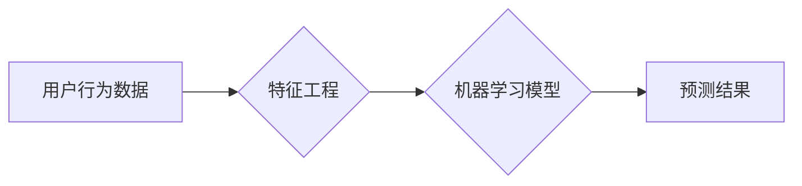

                 

## 电商搜索中的AI用户行为预测技术

> 关键词：电商搜索、用户行为预测、推荐系统、机器学习、深度学习、自然语言处理、AI

## 1. 背景介绍

在当今数据爆炸的时代，电商平台面临着巨大的用户行为数据挑战。用户行为数据蕴藏着丰富的商业价值，能够帮助电商平台更好地理解用户需求，提供更精准的商品推荐，提升用户体验，最终促进销售额增长。然而，用户行为数据往往是复杂、多变、高维的，传统的统计分析方法难以有效挖掘其内在规律。

因此，人工智能技术应运而生，为电商搜索中的用户行为预测提供了强大的工具。通过机器学习和深度学习等算法，电商平台可以从海量用户行为数据中学习用户偏好、搜索模式、购买习惯等信息，并预测用户的未来行为，例如：

* **搜索意图预测:** 预测用户搜索的商品类别、品牌、属性等信息，帮助电商平台优化搜索结果排名和推荐商品。
* **点击率预测:** 预测用户点击特定商品的概率，帮助电商平台优化商品展示位置和排序。
* **转化率预测:** 预测用户购买特定商品的概率，帮助电商平台制定精准的营销策略和促销活动。
* **用户画像构建:** 构建用户画像，了解用户的兴趣爱好、消费习惯等信息，为个性化推荐提供支持。

## 2. 核心概念与联系

用户行为预测的核心是建立用户行为与目标变量之间的映射关系。

**2.1 核心概念**

* **用户行为数据:** 包括用户在电商平台上的所有活动记录，例如搜索历史、浏览记录、购买记录、评价记录、收藏记录等。
* **目标变量:** 需要预测的用户行为，例如点击率、转化率、购买商品类别等。
* **特征工程:** 从用户行为数据中提取有价值的特征，用于训练预测模型。
* **机器学习模型:** 用于学习用户行为数据和目标变量之间的映射关系，并进行预测。

**2.2 架构图**



## 3. 核心算法原理 & 具体操作步骤

### 3.1 算法原理概述

常用的用户行为预测算法包括：

* **线性回归:**  一种简单的线性模型，用于预测连续型目标变量。
* **逻辑回归:**  一种用于预测分类型目标变量的模型，例如用户是否会点击商品。
* **支持向量机 (SVM):**  一种强大的分类模型，能够处理高维数据。
* **决策树:**  一种树形结构的模型，用于进行分类或回归预测。
* **随机森林:**  一种基于多个决策树的集成学习模型，具有较高的预测精度。
* **神经网络:**  一种能够学习复杂非线性关系的模型，近年来在用户行为预测领域取得了显著成果。

### 3.2 算法步骤详解

以随机森林算法为例，详细说明其操作步骤：

1. **数据预处理:** 对用户行为数据进行清洗、转换、编码等操作，使其适合模型训练。
2. **特征选择:** 从预处理后的数据中选择最相关的特征，用于训练模型。
3. **数据划分:** 将数据划分为训练集、验证集和测试集。
4. **模型训练:** 使用训练集训练随机森林模型，并通过验证集进行模型调参。
5. **模型评估:** 使用测试集评估模型的预测精度，例如准确率、召回率、F1-score等。
6. **模型部署:** 将训练好的模型部署到线上环境，用于预测用户行为。

### 3.3 算法优缺点

**随机森林算法的优点:**

* 能够处理高维数据。
* 对异常值鲁棒性强。
* 具有较高的预测精度。

**随机森林算法的缺点:**

* 训练时间较长。
* 模型解释性较差。

### 3.4 算法应用领域

随机森林算法广泛应用于以下领域：

* **电商搜索:** 用户搜索意图预测、点击率预测、转化率预测。
* **推荐系统:** 商品推荐、用户画像构建。
* **广告投放:** 广告点击率预测、广告转化率预测。
* **金融领域:** 欺诈检测、信用评分。

## 4. 数学模型和公式 & 详细讲解 & 举例说明

### 4.1 数学模型构建

随机森林算法是一种基于集成学习的决策树算法。其核心思想是构建多个决策树，并通过投票机制进行预测。

假设我们有N个样本数据，每个样本包含M个特征。每个决策树在训练过程中，会随机选择K个特征进行划分，并选择最佳的划分阈值，将样本数据分成子集。

### 4.2 公式推导过程

随机森林算法的预测过程可以表示为：

$$
\hat{y} = \frac{1}{N_T} \sum_{t=1}^{N_T} f_t(x)
$$

其中：

* $\hat{y}$ 是预测结果。
* $N_T$ 是决策树的数量。
* $f_t(x)$ 是第t棵决策树对样本x的预测结果。

### 4.3 案例分析与讲解

假设我们有一个电商平台，想要预测用户是否会点击某个商品。我们可以使用随机森林算法进行预测。

* **特征:** 用户的搜索历史、浏览记录、购买记录、性别、年龄、地理位置等。
* **目标变量:** 用户是否点击商品。

通过训练随机森林模型，我们可以得到每个特征对用户点击行为的影响程度。例如，如果用户的搜索历史中包含与该商品相关的关键词，则该特征对用户点击行为的影响程度较高。

## 5. 项目实践：代码实例和详细解释说明

### 5.1 开发环境搭建

* Python 3.6+
* scikit-learn
* pandas
* numpy

### 5.2 源代码详细实现

```python
from sklearn.ensemble import RandomForestClassifier
from sklearn.model_selection import train_test_split
from sklearn.metrics import accuracy_score

# 加载数据
data = pd.read_csv('user_behavior_data.csv')

# 划分特征和目标变量
X = data.drop('click', axis=1)
y = data['click']

# 划分训练集和测试集
X_train, X_test, y_train, y_test = train_test_split(X, y, test_size=0.2, random_state=42)

# 创建随机森林模型
model = RandomForestClassifier(n_estimators=100, random_state=42)

# 训练模型
model.fit(X_train, y_train)

# 预测测试集
y_pred = model.predict(X_test)

# 计算模型精度
accuracy = accuracy_score(y_test, y_pred)
print(f'模型精度: {accuracy}')
```

### 5.3 代码解读与分析

* **数据加载:** 使用pandas库加载用户行为数据。
* **特征和目标变量划分:** 将数据分为特征和目标变量两部分。
* **数据划分:** 使用train_test_split函数将数据划分为训练集和测试集。
* **模型创建:** 使用RandomForestClassifier类创建随机森林模型。
* **模型训练:** 使用fit函数训练模型。
* **模型预测:** 使用predict函数对测试集进行预测。
* **模型评估:** 使用accuracy_score函数计算模型精度。

### 5.4 运行结果展示

运行上述代码后，会输出模型的精度值。精度值越高，模型的预测效果越好。

## 6. 实际应用场景

### 6.1 搜索结果排序

电商平台可以利用用户行为预测技术，对搜索结果进行排序，将与用户搜索意图更匹配的商品排在前面，提高用户搜索体验。

### 6.2 个性化推荐

电商平台可以根据用户的历史行为数据，预测用户可能感兴趣的商品，并进行个性化推荐，提升用户购买意愿。

### 6.3 营销策略优化

电商平台可以利用用户行为预测技术，分析用户的购买习惯和偏好，制定更精准的营销策略和促销活动，提高营销效果。

### 6.4 未来应用展望

随着人工智能技术的不断发展，用户行为预测技术将在电商领域得到更广泛的应用，例如：

* **更精准的商品推荐:** 利用深度学习技术，构建更复杂的模型，实现更精准的商品推荐。
* **更个性化的用户体验:** 根据用户的行为数据，提供更个性化的购物体验，例如个性化商品展示、个性化促销活动等。
* **更有效的营销策略:** 利用用户行为预测技术，分析用户的购买习惯和偏好，制定更有效的营销策略，提高营销效果。

## 7. 工具和资源推荐

### 7.1 学习资源推荐

* **书籍:**
    * 《Python机器学习》
    * 《深度学习》
* **在线课程:**
    * Coursera: 机器学习
    * edX: 深度学习
* **博客:**
    * Towards Data Science
    * Machine Learning Mastery

### 7.2 开发工具推荐

* **Python:** 
    * scikit-learn
    * TensorFlow
    * PyTorch

### 7.3 相关论文推荐

* **《Random Forests》**
* **《Gradient Boosting Machines》**
* **《Deep Learning for Recommender Systems》**

## 8. 总结：未来发展趋势与挑战

### 8.1 研究成果总结

用户行为预测技术在电商领域取得了显著成果，能够帮助电商平台提高用户体验、提升销售额。

### 8.2 未来发展趋势

未来，用户行为预测技术将朝着以下方向发展：

* **模型更加精准:** 利用深度学习技术，构建更复杂的模型，实现更精准的预测。
* **个性化程度更高:** 根据用户的行为数据，提供更个性化的购物体验。
* **应用场景更加广泛:** 将用户行为预测技术应用到更多电商领域，例如物流配送、客户服务等。

### 8.3 面临的挑战

用户行为预测技术也面临着一些挑战：

* **数据质量:** 用户行为数据往往是复杂、多变、高维的，需要进行有效的清洗和预处理。
* **模型 interpretability:** 许多深度学习模型的内部机制难以理解，这使得模型的应用受到限制。
* **隐私保护:** 用户行为数据包含了用户的隐私信息，需要采取有效的措施保护用户的隐私。

### 8.4 研究展望

未来，我们需要继续研究如何提高用户行为预测模型的精度、个性化程度和应用场景，同时也要关注数据质量、模型 interpretability 和隐私保护等问题。


## 9. 附录：常见问题与解答

**Q1: 如何选择合适的特征？**

A1: 可以使用特征选择算法，例如信息增益、互信息等，选择与目标变量相关性较高的特征。

**Q2: 如何处理缺失值？**

A2: 可以使用多种方法处理缺失值，例如删除样本、填充平均值、使用KNN等算法进行填充。

**Q3: 如何评估模型性能？**

A3: 可以使用多种指标评估模型性能，例如准确率、召回率、F1-score、AUC等。

**Q4: 如何防止过拟合？**

A4: 可以使用正则化技术、交叉验证等方法防止过拟合。


作者：禅与计算机程序设计艺术 / Zen and the Art of Computer Programming 
<end_of_turn>

