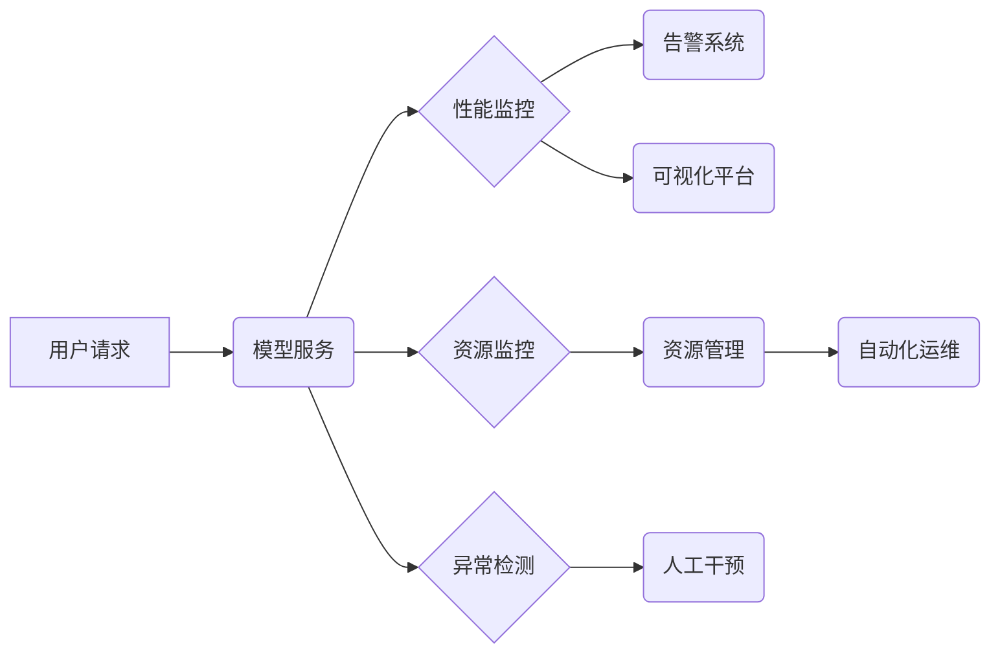

                 

## 电商搜索推荐场景下的AI大模型模型部署监控平台功能优化与扩展

> 关键词：AI大模型、模型部署、监控平台、电商搜索推荐、性能指标、异常检测、可视化分析、自动化运维

## 1. 背景介绍

随着人工智能技术的飞速发展，大模型在电商搜索推荐场景中扮演着越来越重要的角色。大模型能够学习用户行为、商品特征等海量数据，提供更精准、个性化的推荐结果，从而提升用户体验和商家收益。然而，大模型的部署和运行也面临着诸多挑战，例如模型性能波动、资源消耗过高、异常情况难以及时发现等。因此，构建一个功能完善、高效可靠的模型部署监控平台至关重要。

传统的模型监控平台往往侧重于单个模型的性能指标监控，缺乏对大模型复杂架构的理解和管理能力。针对电商搜索推荐场景，需要构建一个专门针对大模型的监控平台，能够全面监控模型的性能、资源消耗、运行状态等关键指标，并提供异常检测、可视化分析、自动化运维等功能，以确保大模型的稳定运行和持续优化。

## 2. 核心概念与联系

### 2.1  AI大模型

AI大模型是指在海量数据上训练的具有强大泛化能力的深度学习模型，通常拥有数十亿甚至数千亿的参数。大模型能够处理复杂的任务，例如自然语言理解、图像识别、文本生成等，在电商搜索推荐场景中可以用于用户画像构建、商品推荐、搜索结果排序等。

### 2.2  模型部署

模型部署是指将训练好的AI大模型部署到生产环境中，使其能够接入实际应用场景。电商搜索推荐场景的大模型部署通常涉及以下步骤：

* 模型打包：将训练好的模型参数和依赖库打包成可部署的格式。
* 部署环境搭建：搭建模型运行所需的硬件和软件环境，例如服务器、GPU、框架等。
* 模型服务化：将模型封装成可供外部调用服务的接口。
* 监控与管理：部署后对模型的性能、资源消耗、运行状态等进行持续监控和管理。

### 2.3  模型部署监控平台

模型部署监控平台是一个用于监控和管理模型部署状态的系统，其主要功能包括：

* **性能监控:** 监控模型的预测准确率、召回率、F1-score等关键指标，及时发现性能下降趋势。
* **资源监控:** 监控模型的内存使用、CPU占用、网络流量等资源消耗情况，确保模型运行效率和稳定性。
* **异常检测:** 利用机器学习算法检测模型运行过程中的异常情况，例如模型崩溃、数据异常等，并及时报警。
* **可视化分析:** 提供直观的图表和数据可视化工具，帮助用户快速了解模型运行状态和性能趋势。
* **自动化运维:** 实现模型部署、更新、回滚等自动化操作，提高运维效率和可靠性。

### 2.4  架构图



## 3. 核心算法原理 & 具体操作步骤

### 3.1  算法原理概述

模型部署监控平台的核心算法主要包括：

* **性能指标计算:** 利用统计学方法计算模型的预测准确率、召回率、F1-score等关键指标，并进行趋势分析。
* **异常检测:** 利用机器学习算法，例如异常值检测、时间序列分析等，检测模型运行过程中的异常情况。
* **可视化分析:** 利用数据可视化技术，例如图表、仪表盘等，将模型运行状态和性能趋势以直观的方式呈现给用户。

### 3.2  算法步骤详解

#### 3.2.1  性能指标计算

1. 收集模型预测结果和真实标签数据。
2. 计算模型的预测准确率、召回率、F1-score等指标。
3. 将指标数据存储到数据库中，并进行时间序列分析。
4. 根据分析结果，生成性能指标报告和图表。

#### 3.2.2  异常检测

1. 收集模型运行过程中的各种数据，例如预测结果、资源消耗、系统日志等。
2. 利用机器学习算法，例如异常值检测、时间序列分析等，对数据进行异常检测。
3. 当检测到异常情况时，触发告警机制，并记录异常信息。

#### 3.2.3  可视化分析

1. 将模型运行状态和性能指标数据转换为可视化图表，例如折线图、柱状图、仪表盘等。
2. 提供用户交互式可视化平台，方便用户查询、分析和监控模型运行情况。

### 3.3  算法优缺点

#### 3.3.1  性能指标计算

* **优点:** 能够准确地评估模型的性能，并及时发现性能下降趋势。
* **缺点:** 仅能反映模型预测准确性，无法全面反映模型的运行状态和潜在问题。

#### 3.3.2  异常检测

* **优点:** 能够及时发现模型运行过程中的异常情况，避免潜在风险。
* **缺点:** 需要大量的训练数据，且容易受到噪声数据的影响。

#### 3.3.3  可视化分析

* **优点:** 能够直观地展示模型运行状态和性能趋势，方便用户理解和分析。
* **缺点:** 需要专业的可视化设计和开发能力。

### 3.4  算法应用领域

* **电商搜索推荐:** 监控模型的预测准确率、召回率、点击率等指标，优化推荐结果。
* **金融风险控制:** 监控模型的异常检测结果，及时发现潜在的欺诈行为。
* **医疗诊断辅助:** 监控模型的诊断准确率、误诊率等指标，提高诊断效率和准确性。

## 4. 数学模型和公式 & 详细讲解 & 举例说明

### 4.1  数学模型构建

模型部署监控平台的数学模型主要用于性能指标计算和异常检测。

#### 4.1.1  性能指标计算

常用的性能指标包括准确率、召回率、F1-score等。

* **准确率:**  正确预测的样本数 / 总样本数
* **召回率:**  正确预测的正样本数 / 所有正样本数
* **F1-score:**  2 * (准确率 * 召回率) / (准确率 + 召回率)

#### 4.1.2  异常检测

常用的异常检测算法包括均值差分法、标准差法、K近邻算法等。

* **均值差分法:** 计算样本值与均值的差值，如果差值超过一定阈值，则认为该样本为异常值。
* **标准差法:** 计算样本值与均值的标准差，如果标准差超过一定阈值，则认为该样本为异常值。
* **K近邻算法:** 计算样本与最近K个邻居的距离，如果距离超过一定阈值，则认为该样本为异常值。

### 4.2  公式推导过程

#### 4.2.1  准确率

假设模型预测结果为 $y_i$，真实标签为 $t_i$，则准确率公式为：

$$Accuracy = \frac{\sum_{i=1}^{n} I(y_i = t_i)}{n}$$

其中，$I(y_i = t_i)$ 为指示函数，当 $y_i = t_i$ 时取值为1，否则取值为0。

#### 4.2.2  异常值检测

均值差分法公式为：

$$Deviation = |x_i - \mu|$$

其中，$x_i$ 为样本值，$\mu$ 为样本均值。

### 4.3  案例分析与讲解

#### 4.3.1  电商搜索推荐

假设电商平台的搜索推荐模型预测用户点击商品的概率，并将其作为推荐排序的依据。通过监控模型的准确率、召回率等指标，可以评估模型的推荐效果，并及时发现模型性能下降趋势。例如，如果模型的准确率持续下降，则需要重新训练模型或调整推荐算法。

#### 4.3.2  金融风险控制

金融机构可以使用模型部署监控平台监控模型的异常检测结果，及时发现潜在的欺诈行为。例如，如果模型检测到用户交易行为异常，则可以触发人工审核或冻结账户，降低风险。

## 5. 项目实践：代码实例和详细解释说明

### 5.1  开发环境搭建

* 操作系统: Ubuntu 20.04
* 编程语言: Python 3.8
* 框架: Flask
* 数据库: MySQL
* 可视化工具: Grafana

### 5.2  源代码详细实现

```python
from flask import Flask, request, jsonify
from sklearn.metrics import accuracy_score

app = Flask(__name__)

# 模拟模型预测结果
def predict(data):
    # 模型预测逻辑
    # ...
    return 0.8

@app.route('/predict', methods=['POST'])
def predict_api():
    data = request.get_json()
    prediction = predict(data)
    return jsonify({'prediction': prediction})

# 模拟性能指标计算
def calculate_accuracy(predictions, true_labels):
    return accuracy_score(true_labels, predictions)

# ... 其他代码实现 ...

if __name__ == '__main__':
    app.run(debug=True)
```

### 5.3  代码解读与分析

* 该代码示例是一个简单的Flask应用程序，用于模拟模型预测和性能指标计算。
* `predict()`函数模拟模型预测逻辑，实际应用中需要替换为真实模型的预测代码。
* `calculate_accuracy()`函数计算模型的准确率，实际应用中需要根据具体场景选择合适的性能指标计算函数。
* 该代码示例仅展示了部分功能，实际应用中需要根据具体需求进行扩展和完善。

### 5.4  运行结果展示

* 启动应用程序后，可以通过API接口发送数据请求，获取模型预测结果。
* 应用程序会记录模型预测结果和真实标签数据，并计算相应的性能指标。
* 通过Grafana等可视化工具，可以将性能指标数据进行可视化展示，方便用户监控模型运行状态。

## 6. 实际应用场景

### 6.1  电商搜索推荐

* **个性化推荐:** 利用大模型学习用户行为和商品特征，提供个性化的商品推荐，提升用户体验和转化率。
* **搜索结果排序:** 利用大模型对搜索结果进行排序，提升用户搜索效率和满意度。
* **商品画像构建:** 利用大模型分析用户行为和商品特征，构建商品画像，帮助商家进行精准营销。

### 6.2  金融风险控制

* **欺诈检测:** 利用大模型分析用户交易行为，识别潜在的欺诈行为，降低金融风险。
* **信用评估:** 利用大模型分析用户信用信息，评估用户的信用风险，为贷款审批提供参考。
* **反洗钱:** 利用大模型分析用户交易行为，识别潜在的反洗钱行为，协助金融机构合规运营。

### 6.3  医疗诊断辅助

* **疾病诊断:** 利用大模型分析患者症状和病历信息，辅助医生进行疾病诊断。
* **药物推荐:** 利用大模型分析患者病情和药物信息，推荐合适的药物方案。
* **医疗影像分析:** 利用大模型分析医疗影像数据，辅助医生进行疾病诊断和治疗方案制定。

### 6.4  未来应用展望

随着大模型技术的不断发展，其在更多领域将发挥重要作用，例如智能客服、自动驾驶、自然语言处理等。模型部署监控平台也将随着大模型应用场景的扩展而不断完善和进化，为大模型的稳定运行和持续优化提供更强大的支持。

## 7. 工具和资源推荐

### 7.1  学习资源推荐

* **书籍:**
    * 深度学习
    * 人工智能：一种现代方法
    * 自然语言处理

* **在线课程:**
    * Coursera: 深度学习
    * edX: 人工智能
    * fast.ai: 深度学习

### 7.2  开发工具推荐

* **框架:** TensorFlow, PyTorch, Keras
* **数据库:** MySQL, PostgreSQL, MongoDB
* **可视化工具:** Grafana, Kibana, Tableau

### 7.3  相关论文推荐

* Attention Is All You Need
* BERT: Pre-training of Deep Bidirectional Transformers for Language Understanding
* GPT-3: Language Models are Few-Shot Learners

## 8. 总结：未来发展趋势与挑战

### 8.1  研究成果总结

模型部署监控平台在电商搜索推荐场景下发挥着越来越重要的作用，能够帮助商家提升推荐效果、降低运营成本、提高用户体验。

### 8.2  未来发展趋势

* **模型复杂度提升:** 未来大模型的规模和复杂度将不断提升，模型部署监控平台需要能够应对更复杂的模型架构和运行环境。
* **自动化运维:** 模型部署监控平台将更加注重自动化运维，例如自动模型更新、回滚、故障恢复等。
* **多模态数据融合:** 未来模型将处理多种数据类型，例如文本、图像、音频等，模型部署监控平台需要能够支持多模态数据融合和分析。

### 8.3  面临的挑战

* **数据安全与隐私保护:** 模型部署监控平台需要确保收集和处理的用户数据安全和隐私。
* **模型可解释性:** 大模型的决策过程往往难以理解，模型部署监控平台需要提供更有效的模型可解释性分析工具。
* **算法效率:** 模型部署监控平台需要高效地处理海量数据，并提供实时监控和分析能力。

### 8.4  研究展望

未来研究方向包括：

* 开发更智能、更自动化、更易于使用的模型部署监控平台。
* 研究更有效的模型可解释性分析方法。
* 开发针对大模型的专用监控算法和工具。


## 9. 附录：常见问题与解答

### 9.1  常见问题

* **如何选择合适的性能指标？**

选择合适的性能指标需要根据具体应用场景和业务目标进行确定。例如，对于电商搜索推荐场景，准确率、召回率、点击率等指标都是重要的参考指标。

* **如何应对模型性能波动？**

模型性能波动可能是由于数据变化、模型参数更新等因素导致的。可以通过监控模型性能指标、分析数据变化趋势、调整模型参数等方式来应对模型性能波动。

* **如何保障模型数据安全和隐私？**

模型部署监控平台需要采取相应的安全措施，例如数据加密、访问控制等，保障模型数据安全和隐私。

### 9.2  解答

* **如何选择合适的性能指标？**

选择合适的性能指标需要根据具体应用场景和业务目标进行确定。例如，对于电商搜索推荐场景，准确率、召回率、点击率等指标都是重要的参考指标。

* **如何应对模型性能波动？**

模型性能波动可能是由于数据变化、模型参数更新等因素导致的。可以通过监控模型性能指标、分析数据变化趋势、调整模型参数等方式来应对模型性能波动。

* **如何保障模型数据安全和隐私？**

模型部署监控平台需要采取相应的安全措施，例如数据加密、访问控制等，保障模型数据安全和隐私。


作者：禅与计算机程序设计艺术 / Zen and the Art of Computer Programming<end_of_turn>

