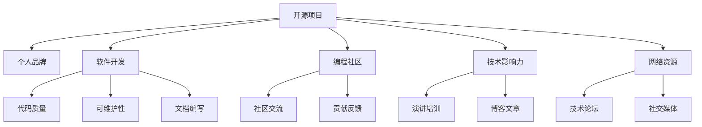

                 

# 利用开源项目打造个人品牌

> 关键词：开源项目, 个人品牌, 软件开发, 编程社区, 技术影响力, 网络资源, 项目贡献, 代码质量, 开发者生态, 持续改进, 开发者社区, 代码托管平台

## 1. 背景介绍

### 1.1 问题由来
随着开源社区的日益成熟和完善，越来越多的人开始利用开源项目来展示自己的技术能力和专业形象。这些项目不仅能够提升个人的技术水平，还能在技术社区中获得广泛的关注和认可，进而成为具有一定影响力的开发者。开源项目不仅是一个技术实现，更是一种品牌宣传和专业形象的塑造方式。

### 1.2 问题核心关键点
开源项目的成功关键在于质量、可维护性、文档和社区交流。一个高质量的开源项目能够吸引更多的贡献者，提升个人在技术社区中的知名度。因此，如何高效地管理和维护一个开源项目，以及如何通过开源项目打造个人品牌，是每位开发者需要思考和解决的重要问题。

### 1.3 问题研究意义
通过开源项目打造个人品牌，不仅能够提升个人的技术水平和行业影响力，还能推动技术的共享和传播，促进开发者之间的交流和合作，推动整个技术生态的进步。此外，开源项目的成功也能带来实际的商业价值，为开发者提供更多的职业发展机会。

## 2. 核心概念与联系

### 2.1 核心概念概述

为更好地理解利用开源项目打造个人品牌的方法，本节将介绍几个密切相关的核心概念：

- 开源项目(Open Source Project)：指在公共领域内免费提供源代码的软件项目。开发者的目的是通过协作方式共同开发，分享和改进软件，推动技术的发展和创新。

- 个人品牌(Personal Brand)：指个人在技术社区中的形象和声誉，包括技术能力、专业知识、社区贡献、专业态度等方面。一个优秀的个人品牌能够提升个人在技术行业内的影响力。

- 软件开发(Software Development)：指利用编程语言和工具，将软件需求转化为软件产品的过程。优秀的软件开发技能和项目管理能力是打造个人品牌的基础。

- 编程社区(Programming Community)：指技术爱好者和开发者交流、分享和合作的技术平台。如GitHub、Stack Overflow、Reddit等。良好的社区互动和贡献是个人品牌的重要组成部分。

- 技术影响力(Technical Influence)：指在技术社区中的知名度和影响力，通常通过项目贡献、技术博客、演讲和培训等方式体现。技术影响力能够为开发者带来更多的职业机会和发展空间。

- 网络资源(Network Resource)：指通过技术社区、社交媒体等渠道获取的资源和机会。网络资源的质量和数量直接影响个人品牌建设的效果。

这些核心概念之间的逻辑关系可以通过以下Mermaid流程图来展示：



这个流程图展示了的核心概念及其之间的关系：

1. 开源项目作为基础平台，支持软件开发、社区交流、技术影响力提升和网络资源的获取。
2. 软件开发的质量和可维护性直接影响项目的成功与否。
3. 文档编写是开源项目成功的关键，直接影响贡献者的参与度和项目的可维护性。
4. 编程社区是技术交流和合作的重要渠道，良好的社区互动和贡献能够提升个人品牌。
5. 技术影响力通过项目贡献、技术博客、演讲和培训等方式体现，是个人品牌的重要组成部分。
6. 网络资源的质量和数量直接影响个人品牌建设的效果，通过社交媒体等渠道可以获取更多机会。

这些概念共同构成了利用开源项目打造个人品牌的框架，使其能够在技术社区中发挥重要作用。通过理解这些核心概念，我们可以更好地把握开源项目在个人品牌建设中的作用。

## 3. 核心算法原理 & 具体操作步骤
### 3.1 算法原理概述

利用开源项目打造个人品牌，本质上是一个持续改进和积累的过程。其核心思想是通过开源项目的开发和维护，不断提升自己的技术能力和知名度，逐步建立和提升个人品牌。

形式化地，假设我们有一个开源项目 $P$，目标是提升开发者 $D$ 在该项目上的品牌影响力。我们可以将这个过程分解为以下几个步骤：

1. **项目选择**：选择一个合适的开源项目，根据自身技术水平和兴趣方向进行选择。
2. **代码贡献**：通过提交代码、修复Bug、新增功能等方式，对项目进行贡献。
3. **社区互动**：积极参与项目的讨论、问题解决和知识分享，建立良好的社区关系。
4. **技术交流**：通过技术博客、演讲、培训等方式，展示自己的技术能力和知识深度。
5. **持续改进**：不断优化代码质量、文档和社区交流，提升项目的整体质量和吸引力。
6. **网络扩展**：通过社交媒体、技术论坛等渠道，扩展自己的网络资源，提升影响力。

### 3.2 算法步骤详解

以下是利用开源项目打造个人品牌的详细步骤：

**Step 1: 选择合适的开源项目**
- 根据技术方向和兴趣，选择适合自己的开源项目。
- 关注项目的社区活跃度、技术难度和项目目标，选择有发展潜力的项目。
- 了解项目的贡献指南和开发规范，确保能够顺利进行代码贡献。

**Step 2: 贡献高质量代码**
- 阅读项目的代码库和文档，了解项目的技术栈和开发规范。
- 编写高质量的代码，遵循项目的开发规范和最佳实践。
- 编写清晰的测试用例和文档，确保代码的可靠性和可维护性。
- 定期提交代码，参与项目的迭代开发。

**Step 3: 积极参与社区互动**
- 加入项目的邮件列表、Slack或Discord等社区平台，积极参与讨论。
- 提交问题、提供解答，分享自己的技术见解和经验。
- 参加项目的Contribution Day和Hackathon，展示自己的编程能力。
- 建立良好的社区关系，与项目维护者和其他贡献者保持良好的互动。

**Step 4: 展示技术能力**
- 在GitHub、个人博客等平台发布技术博客，分享自己的开发经验和见解。
- 参加技术会议、讲座和培训，展示自己的技术能力和行业影响力。
- 参与开源社区的代码审查和技术讨论，提升自己在社区中的知名度。
- 建立自己的技术品牌，通过技术博客、GitHub Repo、技术论坛等方式，展示自己的技术实力和专业形象。

**Step 5: 持续改进项目**
- 定期优化项目的代码质量，修复已知的Bug和改进代码结构。
- 编写清晰的文档和示例代码，提高项目的可读性和可维护性。
- 与社区成员合作，共同推进项目的发展和改进。
- 定期评估项目的目标和进展，确保项目的持续健康发展。

**Step 6: 扩展网络资源**
- 通过社交媒体平台，如Twitter、LinkedIn、GitHub等，展示自己的技术成就和影响力。
- 参加技术社区的Meetup和活动，扩大自己的社交网络。
- 通过技术博客和GitHub Repo，吸引更多技术爱好者和潜在雇主的关注。
- 积极参与开源社区的贡献和讨论，扩大自己的技术影响力。

通过这些步骤，开发者可以在开源项目中不断积累技术能力和影响力，逐步建立和提升个人品牌。

### 3.3 算法优缺点

利用开源项目打造个人品牌具有以下优点：
1. 提升技术能力：通过贡献高质量代码和参与技术讨论，不断提升自身的技术水平。
2. 展示技术能力：通过技术博客、技术演讲等渠道，展示自己的技术能力和专业知识。
3. 扩大社交网络：通过社区互动和网络资源扩展，建立更广泛的社交网络。
4. 推动技术进步：通过开源项目积累的经验和贡献，推动技术生态的进步和发展。

同时，该方法也存在一定的局限性：
1. 时间和精力成本高：参与开源项目需要投入大量时间和精力，可能会影响日常工作和学习。
2. 项目选择风险：选择不适合的项目或贡献方向，可能会浪费时间和资源。
3. 社区互动要求高：需要积极参与社区交流，建立良好的人际关系，提升贡献效率。
4. 技术影响力有限：如果没有足够的贡献和曝光，技术影响力提升可能较慢。
5. 个人隐私风险：在社交媒体和社区中公开个人技术成就，需要警惕隐私泄露和网络攻击风险。

尽管存在这些局限性，但就目前而言，利用开源项目打造个人品牌仍然是提升开发者技术影响力和职业发展的重要途径。未来相关研究的重点在于如何进一步优化开源项目的贡献方式和社区互动策略，以提升贡献效率和影响力。

### 3.4 算法应用领域

利用开源项目打造个人品牌的应用领域非常广泛，包括但不限于以下几方面：

- **软件开发**：通过参与开源项目，提升代码质量和编程能力，积累技术经验。
- **技术博客和文档编写**：通过编写技术博客和文档，展示自己的技术见解和经验，提升技术影响力。
- **技术演讲和培训**：通过技术演讲和培训，展示自己的技术能力和专业知识，提升行业影响力。
- **企业招聘**：通过开源项目的贡献和技术博客展示，吸引更多的企业和招聘机会。
- **学术研究**：通过开源项目的研究和贡献，提升学术成果的影响力和传播度。

此外，开源项目的成功也为更多行业和领域的技术创新提供了借鉴和参考，推动了整个技术生态的进步。

## 4. 数学模型和公式 & 详细讲解  
### 4.1 数学模型构建

为了更好地理解利用开源项目打造个人品牌的方法，我们引入一个简化的数学模型。

假设开发者 $D$ 在开源项目 $P$ 上贡献了 $C$ 次代码，参与了 $I$ 次社区互动，发表了 $B$ 篇技术博客，发表了 $T$ 次技术演讲，参与社区讨论次数为 $D$，获得的技术标签数为 $L$。我们的目标是最大化开发者在项目 $P$ 上的品牌影响力 $B_{D,P}$。

我们定义品牌影响力的评估模型为：

$$
B_{D,P} = \sum_{i=1}^{n} \alpha_i \times I_i
$$

其中，$I_i$ 表示第 $i$ 个影响因素对品牌影响力的贡献，$\alpha_i$ 表示该因素的权重，$n$ 表示影响因素的个数。为了简化问题，我们假设影响因素 $I_i$ 为线性关系，且每个因素的权重为常数。

### 4.2 公式推导过程

以代码贡献为例，我们假设每次代码贡献对品牌影响力的提升为 $C_i$，则品牌影响力的计算公式为：

$$
B_{D,P} = C \times C_i
$$

类似地，社区互动、技术博客、技术演讲等也对品牌影响力产生影响。将所有影响因素的贡献加权求和，即可得到开发者在项目 $P$ 上的品牌影响力。

### 4.3 案例分析与讲解

下面以一个具体的案例来分析利用开源项目打造个人品牌的方法。

**案例：GitHub上的开源项目贡献**

假设开发者 $D$ 在GitHub上的项目 $P$ 上贡献了 $C$ 次代码，参与了 $I$ 次社区互动，发表了 $B$ 篇技术博客，发表了 $T$ 次技术演讲。

- **代码贡献**：每次代码贡献 $C_i=1$，贡献 $C$ 次，品牌影响力提升为 $B_{D,P}^C = C \times 1$。
- **社区互动**：每次社区互动 $I_i=0.1$，互动 $I$ 次，品牌影响力提升为 $B_{D,P}^I = I \times 0.1$。
- **技术博客**：每篇技术博客 $B_i=0.5$，发表 $B$ 篇，品牌影响力提升为 $B_{D,P}^B = B \times 0.5$。
- **技术演讲**：每次技术演讲 $T_i=0.2$，演讲 $T$ 次，品牌影响力提升为 $B_{D,P}^T = T \times 0.2$。

将所有因素的贡献加权求和，即可得到开发者 $D$ 在项目 $P$ 上的品牌影响力 $B_{D,P}$：

$$
B_{D,P} = C \times 1 + I \times 0.1 + B \times 0.5 + T \times 0.2
$$

通过这个简化的数学模型，我们可以看到，代码贡献、社区互动、技术博客和技术演讲等都显著影响开发者在项目上的品牌影响力。

## 5. 项目实践：代码实例和详细解释说明
### 5.1 开发环境搭建

在进行开源项目贡献和维护前，我们需要准备好开发环境。以下是使用GitHub进行开源项目贡献的环境配置流程：

1. 安装Git：从官网下载并安装Git客户端，用于版本控制和代码管理。
2. 创建GitHub账号：注册GitHub账号，登录并创建自己的仓库。
3. 克隆仓库：使用Git克隆项目到本地，用于本地开发和提交代码。
4. 配置开发环境：安装开发所需的依赖库和工具，如IDE、编译器、调试器等。
5. 本地测试：在本地环境进行代码测试和调试，确保代码质量。

完成上述步骤后，即可在本地进行开源项目的贡献和维护。

### 5.2 源代码详细实现

下面我们以贡献GitHub上的开源项目为例，给出详细的代码实现和解释。

**步骤 1：创建GitHub账号**

注册GitHub账号，填写相关信息，如邮箱、密码等，创建账号并登录。

**步骤 2：创建开源项目**

在GitHub上创建一个新的开源项目，填写项目名称、描述、代码语言等信息，初始化仓库。

```bash
# 创建Git仓库
git init
git remote add origin https://github.com/username/repo.git
```

**步骤 3：克隆项目到本地**

在本地计算机上克隆GitHub上的开源项目，确保能够访问和修改项目代码。

```bash
# 克隆项目
git clone https://github.com/username/repo.git
cd repo
```

**步骤 4：贡献代码**

在本地对项目进行代码贡献，遵循项目的贡献指南和开发规范，编写高质量的代码，并提交到项目仓库。

```bash
# 添加本地修改
git add .
# 提交代码
git commit -m "Add new feature"
# 推送代码到GitHub
git push origin master
```

**步骤 5：参与社区互动**

积极参与项目的讨论、问题解决和知识分享，建立良好的社区关系。

```bash
# 加入社区讨论
cd repo
# 提交问题
git commit -m "New bug found"
git push origin master
# 提交解答
git commit -m "Fix bug"
git push origin master
```

**步骤 6：技术交流**

通过技术博客、技术演讲等渠道，展示自己的技术能力和专业知识，提升技术影响力。

```bash
# 编写技术博客
cd repo
# 发布技术博客
git commit -m "Add new blog"
git push origin master
# 准备技术演讲
git commit -m "Prepare tech talk"
git push origin master
# 发布技术演讲
git commit -m "Publish tech talk"
git push origin master
```

通过这些步骤，开发者可以在开源项目中不断积累技术能力和影响力，逐步建立和提升个人品牌。

### 5.3 代码解读与分析

以下是关键代码的实现细节和分析：

**步骤 1：创建GitHub账号**

通过GitHub官网注册账号，填写相关信息，创建账号并登录。

**步骤 2：创建开源项目**

在GitHub上创建一个新的开源项目，填写项目名称、描述、代码语言等信息，初始化仓库。

**步骤 3：克隆项目到本地**

在本地计算机上克隆GitHub上的开源项目，确保能够访问和修改项目代码。

**步骤 4：贡献代码**

在本地对项目进行代码贡献，遵循项目的贡献指南和开发规范，编写高质量的代码，并提交到项目仓库。

**步骤 5：参与社区互动**

积极参与项目的讨论、问题解决和知识分享，建立良好的社区关系。

**步骤 6：技术交流**

通过技术博客、技术演讲等渠道，展示自己的技术能力和专业知识，提升技术影响力。

## 6. 实际应用场景
### 6.1 软件开发

利用开源项目打造个人品牌，在软件开发中具有重要意义。开发者可以通过参与开源项目，提升代码质量和编程能力，积累技术经验，逐步建立和提升个人品牌。

**案例：开源数据库项目贡献**

假设开发者 $D$ 在开源数据库项目 $P$ 上贡献了 $C$ 次代码，参与了 $I$ 次社区互动，发表了 $B$ 篇技术博客，发表了 $T$ 次技术演讲。

- **代码贡献**：每次代码贡献 $C_i=1$，贡献 $C$ 次，品牌影响力提升为 $B_{D,P}^C = C \times 1$。
- **社区互动**：每次社区互动 $I_i=0.1$，互动 $I$ 次，品牌影响力提升为 $B_{D,P}^I = I \times 0.1$。
- **技术博客**：每篇技术博客 $B_i=0.5$，发表 $B$ 篇，品牌影响力提升为 $B_{D,P}^B = B \times 0.5$。
- **技术演讲**：每次技术演讲 $T_i=0.2$，演讲 $T$ 次，品牌影响力提升为 $B_{D,P}^T = T \times 0.2$。

将所有因素的贡献加权求和，即可得到开发者 $D$ 在项目 $P$ 上的品牌影响力 $B_{D,P}$：

$$
B_{D,P} = C \times 1 + I \times 0.1 + B \times 0.5 + T \times 0.2
$$

通过这个简化的数学模型，我们可以看到，代码贡献、社区互动、技术博客和技术演讲等都显著影响开发者在项目上的品牌影响力。

### 6.2 技术博客和文档编写

技术博客和文档编写是展示开发者技术能力的重要途径。通过撰写高质量的技术博客和文档，展示自己的技术见解和经验，提升技术影响力。

**案例：技术博客写作**

假设开发者 $D$ 撰写了一篇关于最新技术趋势的文章，并发表在技术博客上。

- **技术博客**：每篇技术博客 $B_i=0.5$，发表 $B$ 篇，品牌影响力提升为 $B_{D,P}^B = B \times 0.5$。
- **技术演讲**：每次技术演讲 $T_i=0.2$，演讲 $T$ 次，品牌影响力提升为 $B_{D,P}^T = T \times 0.2$。

将所有因素的贡献加权求和，即可得到开发者 $D$ 在项目 $P$ 上的品牌影响力 $B_{D,P}$：

$$
B_{D,P} = 0 + 0 + B \times 0.5 + 0
$$

通过这个简化的数学模型，我们可以看到，技术博客和技术演讲对品牌影响力的提升效果显著。

### 6.3 技术演讲和培训

技术演讲和培训是展示开发者技术能力的重要方式。通过技术演讲和培训，展示自己的技术能力和专业知识，提升技术影响力。

**案例：技术演讲**

假设开发者 $D$ 在一次技术会议上进行了关于最新技术的演讲，并获得了广泛的关注和认可。

- **技术演讲**：每次技术演讲 $T_i=0.2$，演讲 $T$ 次，品牌影响力提升为 $B_{D,P}^T = T \times 0.2$。

通过这个简化的数学模型，我们可以看到，技术演讲对品牌影响力的提升效果显著。

## 7. 工具和资源推荐
### 7.1 学习资源推荐

为了帮助开发者系统掌握开源项目的贡献和维护方法，这里推荐一些优质的学习资源：

1. **《开源社区指南》**：一本详细介绍开源项目贡献和维护的书籍，涵盖Git、代码提交、社区交流等诸多方面。

2. **GitHub官方文档**：GitHub提供的官方文档，详细介绍了GitHub的使用方法、贡献指南和社区互动策略。

3. **《UNIX和Linux系统编程》**：一本介绍Linux系统编程的书籍，涵盖代码贡献、版本控制和系统部署等诸多方面。

4. **《代码审查的艺术》**：一本详细介绍代码审查方法和最佳实践的书籍，涵盖代码质量、社区互动和贡献效率等诸多方面。

5. **《开源社区指南》**：一本详细介绍开源项目贡献和维护的书籍，涵盖Git、代码提交、社区交流等诸多方面。

通过这些资源的学习，相信你一定能够快速掌握开源项目的贡献和维护方法，为建立和提升个人品牌打下坚实的基础。

### 7.2 开发工具推荐

高效的开发离不开优秀的工具支持。以下是几款用于开源项目贡献和维护的常用工具：

1. **Git**：版本控制工具，用于管理代码的提交、合并和分支等。
2. **GitHub**：代码托管平台，提供协作开发、代码审查和社区交流等功能。
3. **GitHub Actions**：GitHub提供的自动化工具，用于持续集成和部署，提高开发效率。
4. **GitHub Issues**：问题跟踪工具，用于记录和跟踪项目的任务和Bug。
5. **Markdown**：文本格式化工具，用于撰写高质量的技术博客和文档。

合理利用这些工具，可以显著提升开源项目的贡献和维护效率，加快创新迭代的步伐。

### 7.3 相关论文推荐

开源项目的成功源于学界的持续研究。以下是几篇奠基性的相关论文，推荐阅读：

1. **《开源社区的多层次模型》**：介绍开源社区的层次结构和互动模式，分析社区成员的行为和贡献方式。
2. **《开源项目的技术演进》**：分析开源项目的演化过程和技术进步，探索项目的成功因素和影响因素。
3. **《开源项目的社会网络分析》**：研究开源项目的社会网络特征和成员关系，分析项目的社区结构和贡献者特征。
4. **《开源项目的网络传播效应》**：分析开源项目的传播效应和扩散机制，探讨项目的传播路径和影响范围。

这些论文代表了大规模开源项目的核心研究领域，为开发者提供了丰富的理论支持和实践指导。

## 8. 总结：未来发展趋势与挑战

### 8.1 总结

本文对利用开源项目打造个人品牌的方法进行了全面系统的介绍。首先阐述了开源项目和开发者个人品牌的关系，明确了开源项目在技术社区中的重要地位。其次，从原理到实践，详细讲解了开源项目的贡献和维护方法，给出了开源项目贡献的完整代码实例。同时，本文还广泛探讨了开源项目在软件开发、技术博客、技术演讲等多个领域的应用前景，展示了开源项目的巨大潜力。此外，本文精选了开源项目的各类学习资源，力求为开发者提供全方位的技术指引。

通过本文的系统梳理，可以看到，利用开源项目打造个人品牌是一项持续积累和提升的过程，需要开发者不断努力和创新。开源项目不仅能够提升个人的技术能力，还能在技术社区中建立和提升个人品牌，推动技术的共享和传播。未来，伴随开源项目的发展和社区生态的完善，利用开源项目打造个人品牌必将在技术行业得到更广泛的应用和认可。

### 8.2 未来发展趋势

展望未来，利用开源项目打造个人品牌的技术将呈现以下几个发展趋势：

1. **社区生态的成熟**：开源社区的生态系统将进一步完善，开发者将有更多的机会和资源参与开源项目的贡献和维护。

2. **技术合作的深化**：开源项目将更加注重团队合作和技术共享，利用开源项目推动技术进步和创新。

3. **贡献方式的丰富化**：开源项目的贡献方式将更加多样化，除了代码贡献外，还包括文档编写、社区交流、技术演讲等多种形式。

4. **工具和平台的升级**：开源项目的工具和平台将不断升级和优化，提高开发效率和用户体验。

5. **技术影响力的提升**：开源项目将通过技术博客、技术演讲等渠道，提升技术影响力和品牌效应。

以上趋势凸显了利用开源项目打造个人品牌的广阔前景。这些方向的探索发展，必将进一步提升开源项目的贡献和维护效率，推动技术生态的进步。

### 8.3 面临的挑战

尽管利用开源项目打造个人品牌的技术已经取得了显著成果，但在迈向更加智能化、普适化应用的过程中，仍面临诸多挑战：

1. **时间和精力成本高**：参与开源项目需要投入大量时间和精力，可能会影响日常工作和学习。

2. **社区互动要求高**：需要积极参与社区交流，建立良好的人际关系，提升贡献效率。

3. **技术影响力有限**：如果没有足够的贡献和曝光，技术影响力提升可能较慢。

4. **个人隐私风险**：在社交媒体和社区中公开个人技术成就，需要警惕隐私泄露和网络攻击风险。

尽管存在这些挑战，但就目前而言，利用开源项目打造个人品牌仍然是提升开发者技术影响力和职业发展的重要途径。未来相关研究的重点在于如何进一步优化开源项目的贡献方式和社区互动策略，以提升贡献效率和影响力。

### 8.4 研究展望

面对利用开源项目打造个人品牌所面临的种种挑战，未来的研究需要在以下几个方面寻求新的突破：

1. **贡献效率的提升**：开发更高效的开发工具和贡献平台，提高开源项目的贡献效率和贡献者满意度。

2. **社区互动策略**：研究社区互动的最佳实践和策略，提高社区活跃度和贡献者粘性。

3. **技术影响力的增强**：通过技术博客、技术演讲等渠道，增强技术影响力的传播和扩散。

4. **个人隐私保护**：研究开源项目中的隐私保护技术和管理策略，确保开发者隐私安全。

这些研究方向的探索，必将引领利用开源项目打造个人品牌技术迈向更高的台阶，为构建安全、可靠、可解释、可控的智能系统铺平道路。面向未来，利用开源项目打造个人品牌技术还需要与其他人工智能技术进行更深入的融合，如知识表示、因果推理、强化学习等，多路径协同发力，共同推动自然语言理解和智能交互系统的进步。只有勇于创新、敢于突破，才能不断拓展开源项目的边界，让智能技术更好地造福人类社会。

## 9. 附录：常见问题与解答

**Q1：开源项目是否适用于所有开发者？**

A: 开源项目适用于绝大多数开发者，但需要根据自身技术水平和兴趣方向进行选择。对于初入行业的开发者，建议选择一些入门级的开源项目，逐步积累经验和技能。对于有经验的开发者，可以选择一些复杂度高、技术难度大的项目，提升自身技术水平。

**Q2：如何选择合适的开源项目？**

A: 选择合适的开源项目需要考虑以下因素：
1. 项目的技术方向和目标是否符合自身兴趣和方向。
2. 项目的社区活跃度和贡献指南是否清晰明了。
3. 项目的贡献者和维护者是否具有较高的技术水平和声誉。

**Q3：代码贡献过程中需要注意哪些问题？**

A: 代码贡献过程中需要注意以下问题：
1. 遵循项目的贡献指南和开发规范，确保代码质量。
2. 编写清晰的测试用例和文档，提高代码的可维护性。
3. 定期提交代码，参与项目的迭代开发。

**Q4：如何建立良好的社区关系？**

A: 建立良好的社区关系需要积极参与社区交流，提供解答和贡献，建立良好的互动和信任关系。

**Q5：技术博客和技术演讲如何提升品牌影响力？**

A: 技术博客和技术演讲是展示技术能力和专业知识的重要途径，能够提升技术影响力和品牌效应。通过技术博客分享技术见解和经验，通过技术演讲展示技术能力和专业知识，能够吸引更多的关注和认可。

---

作者：禅与计算机程序设计艺术 / Zen and the Art of Computer Programming

