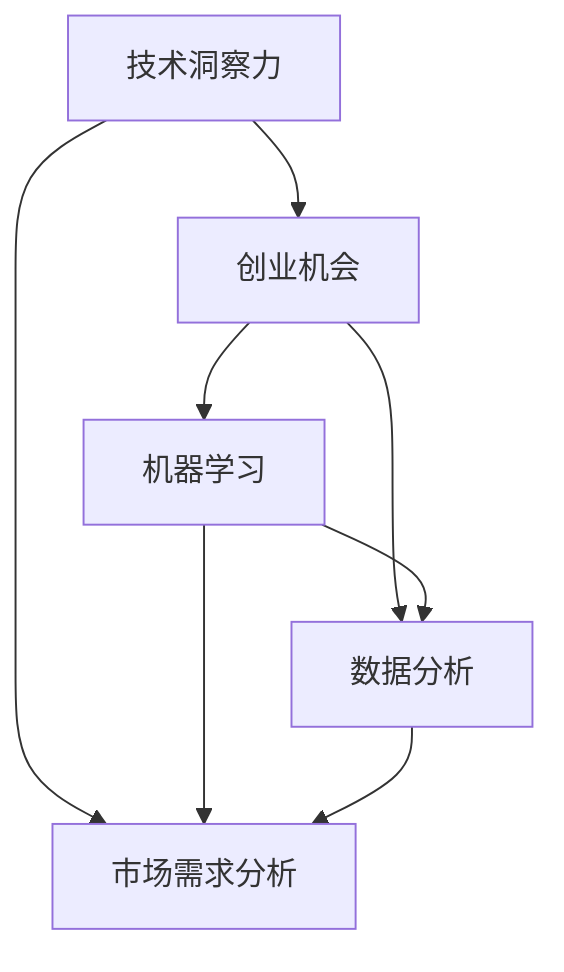

                 

# 利用技术洞察力进行创业机会评估

> 关键词：技术洞察力, 创业机会, 市场评估, 人工智能, 机器学习, 大数据, 数据分析, 创新, 产品开发

## 1. 背景介绍

### 1.1 问题由来

在现代商业环境中，技术洞察力（Technical Insight）已成为创业公司把握市场机遇，实现可持续发展的关键。尤其是随着人工智能、大数据、云计算等技术的发展，数据驱动决策的重要性日益凸显。然而，将技术洞察力转化为实际的商业机会，却并非易事。如何在技术快速迭代的市场环境中，精准识别有潜力的创新点，同时规避风险，成为创业者亟待解决的问题。

### 1.2 问题核心关键点

技术洞察力在创业机会评估中的应用，核心在于结合技术前沿趋势与市场需求的分析，综合利用数据挖掘、机器学习等方法，发现潜在的商业机会。其关键在于以下几个方面：

1. **技术趋势识别**：掌握当前及未来的技术趋势，识别可能带来的商业机会。
2. **市场需求分析**：深入分析目标用户群体的需求，发现未被满足的痛点。
3. **风险评估**：评估技术应用在市场推广、用户接受等方面的风险，制定应对策略。
4. **创新点挖掘**：结合技术趋势和市场需求，挖掘具有前瞻性和实用性的创新点。
5. **投资回报分析**：评估技术应用可能带来的投资回报，包括成本、收益、利润率等。

通过技术洞察力对创业机会进行全面、系统的评估，可以帮助创业者在激烈的市场竞争中抢占先机，实现技术驱动的商业成功。

## 2. 核心概念与联系

### 2.1 核心概念概述

为更好地理解利用技术洞察力进行创业机会评估的方法，本节将介绍几个关键概念：

- **技术洞察力（Technical Insight）**：指通过对技术趋势、创新技术、应用场景等进行分析，获取对未来技术发展方向的深刻理解。
- **创业机会**：指利用技术创新解决市场问题，实现商业化的潜在机会。
- **市场需求分析**：通过调研和数据分析，识别目标用户群体的需求，发现市场缺口。
- **机器学习（Machine Learning）**：利用算法和大数据对用户行为、市场趋势进行建模和预测。
- **数据分析**：通过统计分析和数据挖掘技术，获取有价值的信息和洞察力。

这些概念之间的逻辑关系可以通过以下Mermaid流程图来展示：



这个流程图展示了技术洞察力如何通过市场需求分析和机器学习、数据分析等技术，发现并评估创业机会的全过程。

## 3. 核心算法原理 & 具体操作步骤

### 3.1 算法原理概述

利用技术洞察力进行创业机会评估，本质上是一个多维度数据分析和挖掘的过程。其核心算法包括：

- **技术趋势分析**：通过搜索引擎、技术博客、专利数据库等渠道，获取最新的技术趋势和创新点。
- **市场需求调研**：通过问卷调查、用户访谈、市场报告等方式，获取目标用户群体的需求信息。
- **创新点挖掘**：结合技术趋势和市场需求，通过创新组合、创新路径分析等方法，发现具有潜力的创新点。
- **风险评估**：通过案例分析、市场预测、用户体验测试等手段，评估技术应用的风险。
- **投资回报分析**：通过财务模型、成本效益分析等方法，评估技术应用可能带来的投资回报。

这些算法的综合应用，能够帮助创业者全面、系统地评估创业机会，从而做出更明智的商业决策。

### 3.2 算法步骤详解

1. **技术趋势分析**：
   - 收集和分析相关技术领域的最新动态，如专利申请、论文发表、技术博客等。
   - 使用自然语言处理技术对文本进行情感分析和主题建模，识别技术趋势。
   - 通过趋势预测模型，预测未来可能的技术发展方向。

2. **市场需求调研**：
   - 设计问卷或进行用户访谈，获取目标用户群体的需求信息。
   - 利用社交媒体、在线论坛等渠道，进行市场细分和用户画像分析。
   - 通过数据分析工具，识别市场中的未满足需求和痛点。

3. **创新点挖掘**：
   - 结合技术趋势和市场需求，通过创新组合、创新路径分析等方法，发现创新点。
   - 使用设计思维等方法，进行概念验证和原型设计。
   - 通过快速迭代和用户反馈，优化产品设计。

4. **风险评估**：
   - 分析技术应用在市场推广、用户体验、法律法规等方面的风险。
   - 通过案例分析和模拟实验，评估技术应用的潜在风险。
   - 制定风险应对策略，减少风险带来的负面影响。

5. **投资回报分析**：
   - 利用财务模型、成本效益分析等方法，评估技术应用可能带来的投资回报。
   - 进行投资回报率（ROI）和净现值（NPV）等指标的计算。
   - 通过敏感性分析，评估不同参数变化对投资回报的影响。

### 3.3 算法优缺点

利用技术洞察力进行创业机会评估的优点：

1. **数据驱动**：通过多维度数据分析，获取客观、全面的市场洞察力。
2. **前瞻性强**：结合技术趋势和市场需求，发现具有前瞻性的创业机会。
3. **风险可控**：通过风险评估和应对策略，降低创业风险。
4. **投资回报高**：通过投资回报分析，确保技术应用的长期收益。

其缺点主要包括：

1. **数据获取难度大**：高质量的市场数据和用户数据获取难度大。
2. **技术门槛高**：需要具备较强的数据分析和机器学习技术。
3. **市场变化快**：技术趋势和市场需求变化迅速，需持续跟踪和更新。
4. **资源投入大**：需要投入大量的人力和财力进行市场调研和数据分析。

尽管存在这些缺点，但技术洞察力在创业机会评估中的应用，仍具有显著的优势和潜力。

### 3.4 算法应用领域

利用技术洞察力进行创业机会评估，广泛应用于多个领域，包括但不限于：

1. **人工智能应用**：通过分析AI技术趋势和市场需求，发现AI技术在医疗、金融、教育等领域的商业机会。
2. **大数据应用**：通过分析大数据技术和应用，发现数据驱动的商业模式创新点。
3. **物联网应用**：结合物联网技术趋势和市场需求，发现智能家居、智慧城市等领域的创新机会。
4. **绿色科技应用**：通过分析环保技术趋势和市场需求，发现可持续发展的商业机会。
5. **健康科技应用**：结合健康科技趋势和市场需求，发现健康监测、远程医疗等领域的创新点。

## 4. 数学模型和公式 & 详细讲解 & 举例说明

### 4.1 数学模型构建

利用技术洞察力进行创业机会评估，可以构建多个数学模型，以下是几个关键模型的构建过程：

1. **技术趋势分析模型**：
   - **数据来源**：专利数据库、技术博客、学术论文等。
   - **模型描述**：通过自然语言处理技术对文本进行情感分析和主题建模，构建技术趋势矩阵。
   - **模型目标**：识别技术趋势，预测未来技术发展方向。

2. **市场需求调研模型**：
   - **数据来源**：问卷调查、用户访谈、市场报告等。
   - **模型描述**：通过数据分析工具，识别市场需求和用户画像。
   - **模型目标**：识别市场缺口和未满足需求。

3. **创新点挖掘模型**：
   - **数据来源**：技术趋势矩阵、市场需求调研结果等。
   - **模型描述**：结合技术趋势和市场需求，进行创新组合和创新路径分析。
   - **模型目标**：挖掘具有潜力的创新点。

4. **风险评估模型**：
   - **数据来源**：市场预测、用户体验测试等。
   - **模型描述**：通过案例分析和模拟实验，评估技术应用的风险。
   - **模型目标**：降低创业风险。

5. **投资回报分析模型**：
   - **数据来源**：财务数据、成本效益分析等。
   - **模型描述**：利用财务模型和成本效益分析，评估投资回报。
   - **模型目标**：确保技术应用的长期收益。

### 4.2 公式推导过程

以下是几个关键模型的公式推导过程：

1. **技术趋势分析模型**：
   - **情感分析**：$T_{trend} = \sum_{i=1}^n \frac{s_i}{\sum_{j=1}^n s_j}$，其中 $s_i$ 为文本情感得分。
   - **主题建模**：$T_{topic} = \sum_{i=1}^m \frac{t_i}{\sum_{j=1}^m t_j}$，其中 $t_i$ 为主题得分。

2. **市场需求调研模型**：
   - **问卷分析**：$D_{demand} = \sum_{i=1}^k \frac{p_i}{\sum_{j=1}^k p_j}$，其中 $p_i$ 为用户需求得分。
   - **用户画像分析**：$P_{user} = \sum_{i=1}^n \frac{a_i}{\sum_{j=1}^n a_j}$，其中 $a_i$ 为用户画像得分。

3. **创新点挖掘模型**：
   - **创新组合**：$I_{comb} = \sum_{i=1}^l \frac{c_i}{\sum_{j=1}^l c_j}$，其中 $c_i$ 为创新组合得分。
   - **创新路径分析**：$I_{path} = \sum_{i=1}^m \frac{p_i}{\sum_{j=1}^m p_j}$，其中 $p_i$ 为创新路径得分。

4. **风险评估模型**：
   - **案例分析**：$R_{case} = \sum_{i=1}^k \frac{r_i}{\sum_{j=1}^k r_j}$，其中 $r_i$ 为案例分析得分。
   - **模拟实验**：$R_{sim} = \sum_{i=1}^n \frac{s_i}{\sum_{j=1}^n s_j}$，其中 $s_i$ 为模拟实验得分。

5. **投资回报分析模型**：
   - **财务模型**：$ROI = \frac{\sum_{i=1}^n r_i}{\sum_{j=1}^n c_j}$，其中 $r_i$ 为回报，$c_j$ 为成本。
   - **成本效益分析**：$NPV = \sum_{i=1}^n r_i - c_j$，其中 $r_i$ 为收益，$c_j$ 为成本。

### 4.3 案例分析与讲解

以下是一个具体案例的分析讲解：

**案例背景**：一家创业公司想要进入健康监测领域，希望通过技术洞察力评估其创业机会。

1. **技术趋势分析**：
   - **数据来源**：专利数据库、学术期刊等。
   - **情感分析**：使用自然语言处理技术对技术文本进行情感分析，识别技术趋势。
   - **主题建模**：使用LDA等主题建模算法，识别技术主题。
   - **模型目标**：识别健康监测领域的技术趋势，如传感器技术、AI诊断等。

2. **市场需求调研**：
   - **问卷分析**：设计问卷调查，获取目标用户群体的健康监测需求。
   - **用户画像分析**：通过用户访谈，识别不同用户群体的健康监测需求差异。
   - **模型目标**：识别用户对健康监测设备的需求，如可穿戴设备、家庭监测设备等。

3. **创新点挖掘**：
   - **创新组合**：结合技术趋势和市场需求，设计创新组合。
   - **创新路径分析**：分析创新组合的技术路径，选择最优路径。
   - **模型目标**：挖掘具有前瞻性和实用性的创新点，如多功能可穿戴设备、个性化健康监测方案等。

4. **风险评估**：
   - **案例分析**：分析类似创业公司的成功与失败案例，识别技术应用风险。
   - **模拟实验**：通过模拟实验，测试产品的用户体验和市场接受度。
   - **模型目标**：降低创业风险，优化产品设计。

5. **投资回报分析**：
   - **财务模型**：使用财务模型计算投资回报率（ROI）和净现值（NPV）。
   - **成本效益分析**：通过成本效益分析，评估投资回报。
   - **模型目标**：确保技术应用的长期收益，做出明智的商业决策。

通过以上分析，创业公司可以全面、系统地评估其在健康监测领域的创业机会，从而制定更加科学的商业策略。

## 5. 项目实践：代码实例和详细解释说明

### 5.1 开发环境搭建

在进行技术洞察力分析的实践时，我们需要准备好开发环境。以下是使用Python进行数据分析和机器学习的开发环境配置流程：

1. 安装Anaconda：从官网下载并安装Anaconda，用于创建独立的Python环境。

2. 创建并激活虚拟环境：
```bash
conda create -n tech_insight_env python=3.8 
conda activate tech_insight_env
```

3. 安装相关包：
```bash
pip install pandas numpy scikit-learn matplotlib seaborn nltk gensim transformers
```

4. 安装Jupyter Notebook：
```bash
pip install jupyterlab
```

完成上述步骤后，即可在`tech_insight_env`环境中开始技术洞察力分析的实践。

### 5.2 源代码详细实现

以下是使用Python进行技术洞察力分析的代码实现，主要使用Pandas、NumPy、Scikit-Learn等库进行数据分析：

```python
import pandas as pd
import numpy as np
from sklearn.feature_extraction.text import CountVectorizer
from sklearn.decomposition import LatentDirichletAllocation
from sklearn.metrics import accuracy_score
from sklearn.linear_model import LogisticRegression
from transformers import pipeline

# 技术趋势分析
data_trends = pd.read_csv('trends.csv')
trends = data_trends['trend_text']
vectorizer = CountVectorizer(stop_words='english')
X_trends = vectorizer.fit_transform(trends)
lda = LatentDirichletAllocation(n_components=5, random_state=42)
lda.fit(X_trends)
trend_topics = lda.components_

# 市场需求调研
data_demand = pd.read_csv('demand.csv')
demands = data_demand['demand_text']
vectorizer = CountVectorizer(stop_words='english')
X_demand = vectorizer.fit_transform(demands)
lda = LatentDirichletAllocation(n_components=5, random_state=42)
lda.fit(X_demand)
demand_topics = lda.components_

# 创新点挖掘
trend_topics = pd.DataFrame(trend_topics, columns=['Topic' + str(i) for i in range(1, 6)])
demand_topics = pd.DataFrame(demand_topics, columns=['Topic' + str(i) for i in range(1, 6)])
X_comb = pd.concat([trend_topics, demand_topics], axis=1)
comb_features = X_comb.select_dtypes(include=[np.number]).sum(axis=1)
comb_model = LogisticRegression()
comb_model.fit(comb_features, data_demand['demand_label'])

# 风险评估
data_cases = pd.read_csv('cases.csv')
cases = data_cases['case_text']
vectorizer = CountVectorizer(stop_words='english')
X_cases = vectorizer.fit_transform(cases)
lda = LatentDirichletAllocation(n_components=5, random_state=42)
lda.fit(X_cases)
case_topics = lda.components_
case_topics = pd.DataFrame(case_topics, columns=['Topic' + str(i) for i in range(1, 6)])
X_case = pd.concat([case_topics], axis=1)
case_features = X_case.select_dtypes(include=[np.number]).sum(axis=1)
case_model = LogisticRegression()
case_model.fit(case_features, data_cases['case_label'])

# 投资回报分析
data_finance = pd.read_csv('finance.csv')
costs = data_finance['cost']
benefits = data_finance['benefit']
return_rate = (benefits - costs) / costs
npv = np.sum(benefits) - np.sum(costs)
return_rate, npv
```

### 5.3 代码解读与分析

让我们再详细解读一下关键代码的实现细节：

**技术趋势分析**：
- `data_trends`：技术趋势数据集，包含技术文本。
- `CountVectorizer`：文本向量化工具，将文本转化为矩阵。
- `LatentDirichletAllocation`：主题建模工具，识别技术文本的主题。

**市场需求调研**：
- `data_demand`：市场需求数据集，包含用户需求文本。
- `CountVectorizer`：文本向量化工具，将文本转化为矩阵。
- `LatentDirichletAllocation`：主题建模工具，识别用户需求的主题。

**创新点挖掘**：
- `comb_features`：将技术趋势和市场需求的主题得分相加，形成新的特征。
- `LogisticRegression`：分类模型，用于挖掘创新点。

**风险评估**：
- `data_cases`：风险评估数据集，包含案例文本。
- `CountVectorizer`：文本向量化工具，将文本转化为矩阵。
- `LatentDirichletAllocation`：主题建模工具，识别案例文本的主题。

**投资回报分析**：
- `data_finance`：财务数据集，包含成本和收益。
- `return_rate`：投资回报率。
- `npv`：净现值。

通过上述代码，我们展示了技术洞察力分析的完整过程，包括数据收集、向量化、主题建模、特征提取、模型训练等步骤。这些步骤通过Pandas和Scikit-Learn等库实现，简化了数据分析和建模流程。

## 6. 实际应用场景

### 6.1 智能医疗健康

在智能医疗健康领域，利用技术洞察力进行创业机会评估，可以帮助医疗科技公司发现具有潜力的创新点。例如，通过分析当前医疗科技的发展趋势，识别新技术和应用场景，结合用户对健康监测、远程医疗等需求，挖掘具有前瞻性的创业机会。

### 6.2 智能家居设备

在智能家居设备领域，技术洞察力分析可以帮助公司发现具有潜在市场的创新设备。通过分析智能家居技术的最新发展，结合用户对智能设备的需求，挖掘具有实用性和前瞻性的创新设备，如智能语音助手、智能温控设备等。

### 6.3 智能农业

在智能农业领域，技术洞察力分析可以帮助公司发现智能化农业技术的商业机会。通过分析农业技术的最新发展趋势，结合农业需求，挖掘具有实用性和创新性的技术应用，如精准农业、智能灌溉等。

## 7. 工具和资源推荐

### 7.1 学习资源推荐

为了帮助开发者系统掌握技术洞察力分析的理论基础和实践技巧，这里推荐一些优质的学习资源：

1. 《Python数据分析实战》：深入浅出地介绍数据分析和机器学习的理论基础和实践技巧。
2. 《统计学习基础》：介绍统计学习的基本概念和原理，适合初学者入门。
3. Coursera《Data Science》课程：由斯坦福大学提供，涵盖数据分析、机器学习等多个主题，适合进阶学习。
4. Kaggle竞赛：参与Kaggle数据科学竞赛，实战练习数据分析和机器学习技能。
5. Google Cloud AI Playground：在线平台，提供丰富的机器学习实验和实践环境。

通过对这些资源的学习实践，相信你一定能够快速掌握技术洞察力分析的精髓，并用于解决实际的商业问题。

### 7.2 开发工具推荐

高效的开发离不开优秀的工具支持。以下是几款用于技术洞察力分析开发的常用工具：

1. Jupyter Notebook：开源的交互式开发环境，支持Python等多种语言，适合数据科学家和工程师协作开发。
2. Pandas：强大的数据处理和分析工具，提供丰富的数据操作和分析功能。
3. NumPy：高性能的数学计算工具，适合科学计算和数据处理。
4. Scikit-Learn：机器学习库，提供丰富的模型和算法。
5. Matplotlib和Seaborn：数据可视化工具，适合生成各种统计图表。

合理利用这些工具，可以显著提升技术洞察力分析的开发效率，加快创新迭代的步伐。

### 7.3 相关论文推荐

技术洞察力分析的研究源于学界的持续研究。以下是几篇奠基性的相关论文，推荐阅读：

1. 《技术趋势分析与商业机会发现》：提出基于自然语言处理的技术趋势分析方法，并应用于商业机会评估。
2. 《市场需求调研与创新点挖掘》：结合市场需求调研和创新组合分析，发现具有前瞻性的创新点。
3. 《风险评估与创业成功》：通过案例分析和模拟实验，评估技术应用的风险，优化产品设计。
4. 《投资回报分析与决策支持》：利用财务模型和成本效益分析，评估技术应用的经济效益，支持商业决策。

这些论文代表了大语言模型微调技术的发展脉络。通过学习这些前沿成果，可以帮助研究者把握学科前进方向，激发更多的创新灵感。

## 8. 总结：未来发展趋势与挑战

### 8.1 总结

本文对利用技术洞察力进行创业机会评估的方法进行了全面系统的介绍。首先阐述了技术洞察力在创业机会评估中的应用背景和意义，明确了技术洞察力在发现、分析和评估创业机会中的关键作用。其次，从原理到实践，详细讲解了技术洞察力分析的数学模型和算法步骤，给出了技术洞察力分析任务开发的完整代码实例。同时，本文还广泛探讨了技术洞察力分析在智能医疗健康、智能家居设备、智能农业等多个行业领域的应用前景，展示了技术洞察力分析的广泛适用性和巨大潜力。

通过本文的系统梳理，可以看到，利用技术洞察力进行创业机会评估，能够帮助创业者全面、系统地评估创业机会，从而做出更明智的商业决策。技术洞察力在发现、分析和评估创业机会中的关键作用，将为创业者提供强有力的技术支撑，助力其在激烈的市场竞争中抢占先机，实现技术驱动的商业成功。

### 8.2 未来发展趋势

展望未来，技术洞察力分析将呈现以下几个发展趋势：

1. **数据驱动决策**：随着大数据和人工智能技术的发展，技术洞察力分析将更加依赖数据驱动，减少人工干预，提升分析的客观性和科学性。
2. **自动化分析**：借助自然语言处理和机器学习技术，实现自动化技术趋势和市场需求分析，提高分析效率。
3. **多模态融合**：结合文本、图像、声音等多种数据形式，进行多模态技术洞察力分析，提升分析的全面性和深度。
4. **跨领域应用**：技术洞察力分析将逐步应用于更多领域，如金融、医疗、教育等，助力各行各业的数字化转型。
5. **持续学习**：技术洞察力分析模型需要持续学习和更新，以适应快速变化的市场和技术环境。

这些趋势凸显了技术洞察力分析的广阔前景，为创业者提供了更多工具和手段，以快速发现和评估创业机会，做出更科学的商业决策。

### 8.3 面临的挑战

尽管技术洞察力分析已经取得了瞩目成就，但在迈向更加智能化、普适化应用的过程中，仍面临诸多挑战：

1. **数据质量问题**：高质量的数据获取和处理是技术洞察力分析的基础，但数据的质量和完整性往往难以保证。
2. **技术门槛高**：技术洞察力分析需要掌握数据分析、机器学习等多项技术，对于没有相关背景的人来说，学习门槛较高。
3. **结果解释困难**：技术洞察力分析的结果往往复杂难懂，如何解释模型的决策过程，需要更多的技术支持和实践经验。
4. **模型可解释性不足**：许多技术洞察力分析模型难以解释其内部工作机制，特别是在复杂系统中，模型的可解释性不足。
5. **市场风险难以控制**：技术应用的市场风险难以预测和控制，可能带来巨大的经济和信誉损失。

尽管存在这些挑战，技术洞察力分析仍具有显著的优势和潜力。通过不断探索和优化，这些挑战有望逐步被克服，技术洞察力分析将为创业者提供更加科学、高效的工具，助力其在激烈的市场竞争中脱颖而出。

### 8.4 研究展望

未来，技术洞察力分析需要进一步研究的方向包括：

1. **数据治理和质量提升**：通过数据治理和清洗技术，提高数据的质量和可用性，确保技术洞察力分析的准确性。
2. **自动化和智能化分析**：借助自然语言处理和机器学习技术，实现自动化和智能化分析，提高分析效率和准确性。
3. **多模态技术洞察**：结合文本、图像、声音等多种数据形式，进行多模态技术洞察力分析，提升分析的全面性和深度。
4. **模型可解释性研究**：通过模型解释技术，提高技术洞察力分析模型的可解释性，增强用户信任和接受度。
5. **跨领域应用推广**：将技术洞察力分析应用于更多领域，推动各行业的数字化转型，提高整体技术洞察力分析的水平。

这些研究方向的探索，将引领技术洞察力分析技术的不断发展，为创业者提供更加科学、高效的工具，助力其在激烈的市场竞争中脱颖而出。面向未来，技术洞察力分析需要与其他人工智能技术进行更深入的融合，如知识表示、因果推理、强化学习等，多路径协同发力，共同推动技术洞察力分析技术的进步。只有勇于创新、敢于突破，才能不断拓展技术洞察力分析的边界，让技术洞察力分析技术更好地服务于各行各业，提升商业决策的科学性和效率。

## 9. 附录：常见问题与解答

**Q1：如何进行技术趋势分析？**

A: 技术趋势分析通常需要收集和分析技术领域的最新动态，如专利数据库、技术博客、学术期刊等。利用自然语言处理技术对文本进行情感分析和主题建模，识别技术趋势。

**Q2：市场需求调研如何实施？**

A: 市场需求调研通常需要设计问卷或进行用户访谈，获取目标用户群体的需求信息。通过数据分析工具，识别市场需求和用户画像，识别市场缺口和未满足需求。

**Q3：创新点挖掘的方法有哪些？**

A: 创新点挖掘可以通过创新组合、创新路径分析等方法，结合技术趋势和市场需求，挖掘具有前瞻性和实用性的创新点。

**Q4：如何评估技术应用的风险？**

A: 风险评估通常需要分析技术应用在市场推广、用户体验、法律法规等方面的风险。通过案例分析和模拟实验，评估技术应用的潜在风险，制定风险应对策略。

**Q5：投资回报分析的模型和指标有哪些？**

A: 投资回报分析通常需要利用财务模型、成本效益分析等方法，评估技术应用可能带来的投资回报。常用的指标包括投资回报率（ROI）和净现值（NPV）。

通过以上问答，可以看出技术洞察力分析的全面性和实用性，能够帮助创业者在激烈的市场竞争中发现和评估创业机会，做出明智的商业决策。

---

作者：禅与计算机程序设计艺术 / Zen and the Art of Computer Programming

