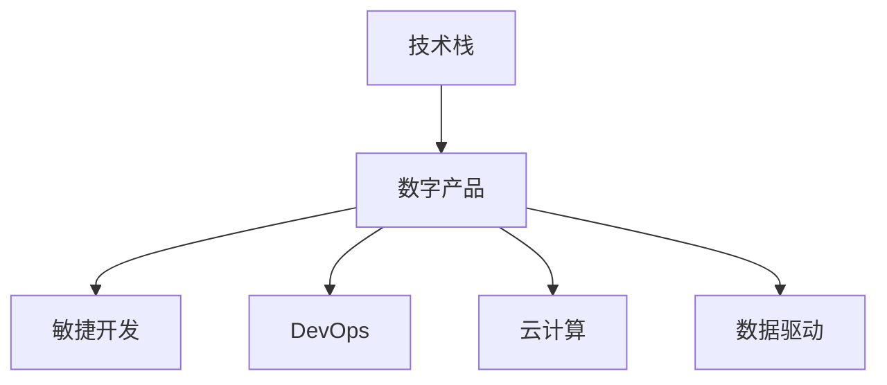

                 

# 利用技术能力创建数字产品

## 1. 背景介绍

在信息化时代，技术的演进推动了各行各业的变革。从个人到企业，从教育到医疗，无不渗透着技术的身影。利用技术能力创建数字产品，已经成为企业和个人在数字化转型过程中不可或缺的战略举措。本文将系统介绍如何利用技术能力，构建具有竞争力的数字产品，涵盖产品策略、技术选型、开发流程、市场推广等关键环节。

## 2. 核心概念与联系

### 2.1 核心概念概述

为更好理解利用技术能力创建数字产品的全过程，本节将介绍几个关键概念及其相互关系。

- **技术栈（Tech Stack）**：技术栈是指用于构建数字产品所需的各类技术组件的集合，包括编程语言、开发框架、数据库、中间件等。一个完整且高效的技术栈是构建高质量数字产品的基石。

- **数字产品（Digital Product）**：数字产品是利用软件技术开发出来的，可以满足用户需求、解决用户问题、创造用户价值的产品。它涵盖了从需求分析到产品设计、从开发部署到运营维护的整个生命周期。

- **敏捷开发（Agile Development）**：敏捷开发是一种迭代、增量的开发方法，强调灵活性、适应性，通过快速迭代和反馈循环，提高产品开发的效率和质量。

- **DevOps**：DevOps是软件开发（Dev）和运维（Ops）的结合体，旨在实现软件开发和运维的高效协作，提升产品交付速度和稳定性。

- **云计算（Cloud Computing）**：云计算是利用互联网提供计算资源和服务的方式，实现资源的按需分配、弹性伸缩和高效管理。

- **数据驱动（Data-Driven）**：数据驱动是指通过数据收集、分析和应用，优化产品设计、运营策略和用户交互，提高产品的个性化和智能化程度。

这些核心概念之间的逻辑关系可以通过以下Mermaid流程图来展示：



这个流程图展示了一系列概念之间的关系：

1. 技术栈为构建数字产品提供支持。
2. 敏捷开发和DevOps方法论提升产品开发和运维的效率。
3. 云计算提供弹性的计算资源。
4. 数据驱动则通过数据分析优化产品策略。

## 3. 核心算法原理 & 具体操作步骤
### 3.1 算法原理概述

在数字化产品开发中，算法原理是构建高效、智能产品的核心。利用算法和技术，可以提升产品的用户体验、优化资源使用、提高运营效率等。

以推荐系统为例，推荐算法通过分析用户的历史行为数据和兴趣偏好，为用户推荐个性化内容。这一过程通常包括数据预处理、特征提取、模型训练和预测等多个步骤。

### 3.2 算法步骤详解

基于推荐系统的构建过程，接下来详细介绍推荐算法的主要步骤：

**Step 1: 数据预处理**
- 收集和清洗用户行为数据，如浏览历史、点击记录、评分等。
- 对数据进行标准化、归一化等预处理，确保数据的质量和一致性。

**Step 2: 特征提取**
- 从原始数据中提取有意义的特征，如时间戳、地理位置、浏览时长等。
- 使用降维、编码等技术，将高维稀疏特征转化为模型可处理的低维密集特征。

**Step 3: 模型训练**
- 选择合适的推荐算法，如协同过滤、基于内容的推荐、深度学习等。
- 划分训练集、验证集和测试集，进行模型训练和参数调优。

**Step 4: 预测与评估**
- 使用训练好的模型对新数据进行预测，生成推荐结果。
- 在测试集上评估模型的准确率、召回率、覆盖率等指标，评估模型性能。

**Step 5: 持续优化**
- 根据用户反馈和业务需求，不断更新模型和特征，提升推荐效果。
- 利用A/B测试等手段，验证新模型和策略的有效性。

### 3.3 算法优缺点

推荐算法具有以下优点：
1. 个性化推荐：通过分析用户历史行为，提供符合用户兴趣的推荐内容。
2. 提高用户满意度：提升用户体验，增加用户黏性。
3. 商业价值提升：提高转化率，增加收入。

同时，推荐算法也存在以下缺点：
1. 数据依赖性强：推荐效果高度依赖于用户数据的完整性和准确性。
2. 隐私问题：在数据收集和处理过程中，可能涉及用户隐私问题。
3. 冷启动问题：对于新用户或新内容，推荐效果不佳。

### 3.4 算法应用领域

推荐算法在多个领域中得到了广泛应用：

- **电商推荐**：推荐用户可能感兴趣的商品，增加销售量。
- **新闻推荐**：为用户推荐可能感兴趣的新闻，提高点击率和阅读量。
- **社交媒体推荐**：为用户推荐可能感兴趣的内容和用户，增加用户互动。
- **音乐推荐**：推荐用户可能喜欢的音乐，提升用户体验。

## 4. 数学模型和公式 & 详细讲解 & 举例说明

### 4.1 数学模型构建

在推荐系统中，通常使用协同过滤算法。协同过滤可以分为基于用户的协同过滤和基于物品的协同过滤。

- **基于用户的协同过滤**：通过计算用户间的相似度，为用户推荐其他用户喜欢的物品。
- **基于物品的协同过滤**：通过计算物品间的相似度，为用户推荐与已喜欢的物品相似的物品。

以基于用户的协同过滤为例，数学模型可以表示为：

$$
\hat{r}_{ui} = \mathbf{e}_u^T \mathbf{A} \mathbf{e}_i
$$

其中，$r_{ui}$表示用户$u$对物品$i$的评分，$\mathbf{e}_u$和$\mathbf{e}_i$分别表示用户$u$和物品$i$的特征向量，$\mathbf{A}$表示用户-物品相似度矩阵。

### 4.2 公式推导过程

基于上述模型，我们可以推导出用户$i$对物品$j$的预测评分：

$$
\hat{r}_{ij} = \sum_k a_{ik} e_{uj}
$$

其中，$a_{ik}$和$e_{uj}$分别为用户$i$和物品$j$的特征向量的相似度。

### 4.3 案例分析与讲解

假设我们有两个用户$u_1$和$u_2$，他们分别对物品$j$的评分如表所示：

| User | Item | Rating |
| ---- | ---- | ------ |
| $u_1$ | $i_1$ | 4.5    |
| $u_1$ | $i_2$ | 3.0    |
| $u_2$ | $i_1$ | 4.0    |
| $u_2$ | $i_2$ | 2.5    |

我们首先需要构建用户-物品相似度矩阵$\mathbf{A}$：

|        | $i_1$  | $i_2$  |
|--------|--------|--------|
| $u_1$  | 0.8    | 0.6    |
| $u_2$  | 0.7    | 0.5    |

接下来，计算用户$u_1$对物品$j$的预测评分：

$$
\hat{r}_{u_1j} = 0.8 \times 4.5 + 0.6 \times 4.0 = 6.9
$$

## 5. 项目实践：代码实例和详细解释说明

### 5.1 开发环境搭建

要进行推荐系统的开发，首先需要搭建开发环境。以下是使用Python和TensorFlow进行推荐系统开发的环境配置流程：

1. 安装Anaconda：从官网下载并安装Anaconda，用于创建独立的Python环境。

2. 创建并激活虚拟环境：
```bash
conda create -n recommendation-env python=3.8 
conda activate recommendation-env
```

3. 安装TensorFlow：
```bash
conda install tensorflow
```

4. 安装其他工具包：
```bash
pip install numpy pandas sklearn tqdm jupyter notebook ipython
```

完成上述步骤后，即可在`recommendation-env`环境中开始推荐系统开发。

### 5.2 源代码详细实现

下面以基于用户的协同过滤为例，给出使用TensorFlow和Keras构建推荐系统的代码实现：

```python
import tensorflow as tf
import numpy as np
from sklearn.metrics import mean_squared_error

# 生成模拟数据
n_users = 1000
n_items = 1000
n_features = 5
ratings = np.random.rand(n_users, n_items) * 5 - 2.5

# 特征提取
users = ratings.mean(axis=1)
items = ratings.mean(axis=0)

# 构建用户-物品相似度矩阵
A = np.dot(users.reshape(-1, 1), items.reshape(1, -1)) / (np.sqrt((users ** 2).sum()) * np.sqrt((items ** 2).sum()))

# 用户i对物品j的预测评分
def predict_ratings(A, u, i):
    return u.dot(A[i])

# 模型评估
def evaluate(A, u, ratings):
    pred_ratings = np.array([predict_ratings(A, u, i) for i in range(n_items)])
    mse = mean_squared_error(ratings, pred_ratings)
    rmse = np.sqrt(mse)
    return rmse

# 计算模型RMSE
rmse = evaluate(A, users, ratings)
print(f"RMSE: {rmse:.2f}")
```

### 5.3 代码解读与分析

让我们再详细解读一下关键代码的实现细节：

**数据生成**：
- 生成模拟数据，包含用户对物品的评分。

**特征提取**：
- 计算用户和物品的平均评分，得到用户和物品的特征向量。

**相似度计算**：
- 使用余弦相似度计算用户和物品的相似度矩阵$\mathbf{A}$。

**预测评分**：
- 使用预测评分公式，计算用户$i$对物品$j$的预测评分。

**模型评估**：
- 使用均方误差（MSE）计算预测评分与真实评分之间的差异，并计算均方根误差（RMSE）。

可以看到，TensorFlow和Keras的使用使得推荐系统的代码实现变得简洁高效。开发者可以将更多精力放在数据处理、模型改进等高层逻辑上，而不必过多关注底层的实现细节。

## 6. 实际应用场景

### 6.1 电商推荐

电商平台需要为用户提供个性化推荐，提升用户体验和销售额。基于协同过滤的推荐系统可以快速计算出用户对未购买物品的评分预测，从而生成推荐列表。用户点击推荐商品的行为数据，又可以进一步训练和优化推荐模型。

在技术实现上，电商推荐系统需要处理海量用户行为数据，进行实时推荐和更新。为了应对这些挑战，推荐系统通常采用分布式计算框架，如Apache Spark和Hadoop，进行数据处理和模型训练。同时，采用缓存技术，如Redis，提高推荐速度和系统稳定性。

### 6.2 新闻推荐

新闻聚合平台需要为用户推荐个性化的新闻内容，提高用户停留时间和阅读量。推荐算法可以根据用户的历史阅读记录和兴趣标签，推荐相关新闻。推荐系统还可以实时分析新闻点击率、阅读时间等数据，动态调整推荐策略。

在技术实现上，新闻推荐系统可以利用机器学习库，如Scikit-learn和TensorFlow，进行用户兴趣预测和新闻推荐。同时，采用流式数据处理框架，如Apache Kafka和Apache Flink，实现实时数据流分析和处理。

### 6.3 社交媒体推荐

社交媒体平台需要为用户推荐个性化的内容和用户，增加用户互动和粘性。推荐算法可以根据用户的历史互动记录和兴趣标签，推荐相关的内容和用户。推荐系统还可以实时分析用户互动数据，动态调整推荐策略。

在技术实现上，社交媒体推荐系统可以利用深度学习模型，如循环神经网络（RNN）和卷积神经网络（CNN），进行内容推荐和用户推荐。同时，采用分布式计算框架，如Apache Spark和Apache Mesos，处理大规模用户数据和推荐计算。

### 6.4 未来应用展望

随着技术的发展，推荐系统将在更多领域得到应用，为数字化转型带来新的机遇。

在智慧城市建设中，推荐系统可以为用户推荐旅游、出行等个性化服务，提高城市管理的智能化水平。在智慧健康领域，推荐系统可以为用户推荐健康资讯、医疗服务，提升用户健康水平和医疗体验。

未来，推荐系统还将融合更多技术手段，如区块链、边缘计算、自然语言处理等，实现更加智能和安全的推荐效果。

## 7. 工具和资源推荐

### 7.1 学习资源推荐

为帮助开发者系统掌握推荐系统的理论基础和实践技巧，这里推荐一些优质的学习资源：

1. 《推荐系统实战》一书：由推荐系统专家撰写，详细介绍了推荐系统的工作原理和工程实践。

2. 《Deep Learning for Recommender Systems》课程：由Coursera提供，介绍了基于深度学习的推荐系统。

3. 《TensorFlow实战推荐系统》一书：由TensorFlow官方发布，介绍了TensorFlow在推荐系统中的应用。

4. Kaggle：一个数据科学竞赛平台，提供丰富的推荐系统竞赛数据集和模型，适合实践和比较。

5. ACM RecSys会议论文集：收录了推荐系统领域的最新研究成果，适合理论学习。

通过对这些资源的学习实践，相信你一定能够快速掌握推荐系统的精髓，并用于解决实际的推荐问题。

### 7.2 开发工具推荐

高效的开发离不开优秀的工具支持。以下是几款用于推荐系统开发的常用工具：

1. TensorFlow：基于Python的开源深度学习框架，灵活易用，适合构建复杂的推荐模型。

2. PyTorch：基于Python的开源深度学习框架，性能优异，适合处理大规模推荐数据。

3. Apache Spark：分布式计算框架，支持大规模数据处理和机器学习。

4. Apache Kafka：流式数据处理框架，适合实时数据流分析。

5. Redis：内存数据库，适合推荐系统的缓存和实时推荐。

合理利用这些工具，可以显著提升推荐系统的开发效率，加快创新迭代的步伐。

### 7.3 相关论文推荐

推荐系统的发展得益于学界的持续研究。以下是几篇奠基性的相关论文，推荐阅读：

1. Recommender Systems Handbook：推荐系统领域的经典手册，涵盖了推荐系统的各个方面。

2. Deep Collaborative Filtering：介绍深度学习在协同过滤中的应用，取得了很好的效果。

3. Fast Matrix Factorization for Recommender Systems：提出矩阵分解方法，提升了推荐系统的计算效率和精度。

4. Matrix Factorization Techniques for Recommender Systems：介绍了矩阵分解方法，是推荐系统中的经典算法。

5. Hybrid Recommender Systems：提出混合推荐系统，融合多种推荐方法，提升了推荐效果。

这些论文代表了大语言模型微调技术的发展脉络。通过学习这些前沿成果，可以帮助研究者把握学科前进方向，激发更多的创新灵感。

## 8. 总结：未来发展趋势与挑战

### 8.1 总结

本文对利用技术能力创建数字产品进行了全面系统的介绍。首先阐述了数字化产品的构建背景和重要性，明确了推荐系统在产品开发中的核心地位。其次，从原理到实践，详细讲解了推荐算法的数学模型和关键步骤，给出了推荐系统开发的完整代码实例。同时，本文还广泛探讨了推荐系统在电商、新闻、社交媒体等多个行业领域的应用前景，展示了推荐范式的巨大潜力。此外，本文精选了推荐系统的各类学习资源，力求为读者提供全方位的技术指引。

通过本文的系统梳理，可以看到，利用技术能力创建数字产品已经成为数字化转型的重要手段。推荐系统在提升用户体验、优化资源利用、增加商业价值等方面展现了巨大的价值，是数字化产品开发中不可或缺的核心技术。未来，伴随推荐技术的持续演进，数字化产品将实现更广泛的落地应用，为社会经济发展注入新的动力。

### 8.2 未来发展趋势

展望未来，推荐系统将呈现以下几个发展趋势：

1. 多模态融合：推荐系统将融合图像、语音、视频等多种模态数据，实现更加全面和准确的推荐效果。

2. 个性化推荐：推荐系统将更加注重个性化推荐，通过多维度的用户画像，实现千人千面的推荐服务。

3. 实时推荐：推荐系统将实现实时推荐，通过流式数据处理和分布式计算，提升推荐的时效性和准确性。

4. 跨领域推荐：推荐系统将跨领域协同推荐，通过融合不同领域的知识，实现更广泛的推荐应用。

5. 自动化推荐：推荐系统将利用自动化技术，实现自动化的策略优化和模型训练，提高推荐效率和质量。

这些趋势凸显了推荐系统的广阔前景。这些方向的探索发展，必将进一步提升推荐系统的性能和应用范围，为数字化产品开发带来更多的创新机会。

### 8.3 面临的挑战

尽管推荐系统已经取得了瞩目成就，但在迈向更加智能化、普适化应用的过程中，它仍面临着诸多挑战：

1. 数据隐私问题：推荐系统需要处理大量的用户数据，数据隐私和安全问题亟需解决。

2. 冷启动问题：对于新用户或新物品，推荐效果不佳，需要更高效的方法解决冷启动问题。

3. 推荐准确性：推荐系统需要实时调整模型参数，以应对数据分布的变化，保持推荐效果。

4. 资源消耗问题：推荐系统需要处理大规模数据，计算资源消耗较大，需要更高效的计算和存储技术。

5. 模型复杂性问题：推荐系统的模型越来越复杂，需要更先进的模型压缩和优化技术。

这些挑战需要在技术、管理和伦理等多个层面进行综合解决，才能实现推荐系统的长期稳定发展。

### 8.4 研究展望

面对推荐系统面临的挑战，未来的研究需要在以下几个方面寻求新的突破：

1. 融合更多先验知识：将符号化的先验知识，如知识图谱、逻辑规则等，与神经网络模型进行巧妙融合，引导推荐过程学习更准确、合理的用户画像。

2. 引入更多数据源：除了历史行为数据，还需要引入更多实时数据源，如社交媒体、地理位置等，提高推荐的时效性和准确性。

3. 引入自动化技术：利用自动化技术，实现自动化的策略优化和模型训练，提高推荐效率和质量。

4. 引入更多推荐模型：结合多种推荐模型，如协同过滤、深度学习、强化学习等，提升推荐的全面性和鲁棒性。

5. 引入跨领域推荐：通过跨领域的协同推荐，实现更广泛的推荐应用，拓展推荐系统的边界。

这些研究方向的探索，必将引领推荐系统技术迈向更高的台阶，为构建智能推荐系统提供新的技术路径。

## 9. 附录：常见问题与解答

**Q1：推荐系统如何处理数据隐私问题？**

A: 推荐系统在处理数据隐私问题时，可以采用以下方法：

1. 匿名化处理：将用户数据匿名化，去除敏感信息，如姓名、地址等。

2. 数据加密：对敏感数据进行加密处理，防止数据泄露。

3. 联邦学习：在本地设备上进行模型训练，不将数据上传至中央服务器，保护用户隐私。

4. 差分隐私：在数据处理过程中，加入噪声，保护个体隐私。

5. 用户授权：在推荐过程中，需要获得用户授权，并在推荐结果中去除用户身份信息。

**Q2：推荐系统如何处理冷启动问题？**

A: 推荐系统在处理冷启动问题时，可以采用以下方法：

1. 基于内容的推荐：对于新用户，可以使用基于内容的推荐方法，根据物品的属性特征进行推荐。

2. 基于用户兴趣的推荐：对于新物品，可以使用基于用户兴趣的推荐方法，根据用户的兴趣标签进行推荐。

3. 基于协同过滤的推荐：对于新用户和新物品，可以使用基于协同过滤的推荐方法，利用相似用户和物品的推荐数据进行推荐。

4. 混合推荐方法：综合多种推荐方法，提高推荐效果。

**Q3：推荐系统如何处理推荐准确性问题？**

A: 推荐系统在处理推荐准确性问题时，可以采用以下方法：

1. 实时数据更新：通过实时更新用户行为数据，动态调整推荐模型，保持推荐效果的稳定性。

2. 多模型融合：结合多种推荐模型，提升推荐的全面性和鲁棒性。

3. 多维度特征融合：综合多种特征，如时间、地点、设备等，提高推荐效果。

4. 推荐系统评估：通过评估指标（如准确率、召回率、覆盖率等），评估推荐效果，并不断优化模型。

**Q4：推荐系统如何处理资源消耗问题？**

A: 推荐系统在处理资源消耗问题时，可以采用以下方法：

1. 分布式计算：使用分布式计算框架，如Apache Spark和Hadoop，处理大规模数据和模型训练。

2. 模型压缩：采用模型压缩技术，如剪枝、量化等，减少模型参数量，提高计算效率。

3. 硬件加速：利用GPU、TPU等硬件加速，提升计算速度和模型推理效率。

4. 数据压缩：采用数据压缩技术，如LZ77、Huffman等，减少存储消耗。

5. 缓存技术：利用缓存技术，如Redis，提高推荐速度和系统稳定性。

**Q5：推荐系统如何处理模型复杂性问题？**

A: 推荐系统在处理模型复杂性问题时，可以采用以下方法：

1. 模型压缩：采用模型压缩技术，如剪枝、量化等，减少模型参数量，提高计算效率。

2. 分布式训练：使用分布式训练框架，如Horovod和TensorFlow，提高模型训练效率。

3. 模型融合：结合多种模型，如深度学习模型和协同过滤模型，提高推荐的全面性和鲁棒性。

4. 自动化调参：利用自动化调参技术，如Hyperopt和Bayesian优化，提高模型训练效率和效果。

**Q6：推荐系统如何处理用户个性化问题？**

A: 推荐系统在处理用户个性化问题时，可以采用以下方法：

1. 用户画像：通过多维度用户特征，构建用户画像，实现个性化推荐。

2. 行为分析：分析用户行为数据，预测用户兴趣，实现个性化推荐。

3. 内容推荐：根据用户历史行为，推荐相关内容，提高用户满意度。

4. 上下文推荐：结合用户上下文信息，如时间、地点、设备等，实现更准确的推荐。

通过以上方法，推荐系统可以更好地满足用户个性化需求，提升用户体验和满意度。

---

作者：禅与计算机程序设计艺术 / Zen and the Art of Computer Programming

