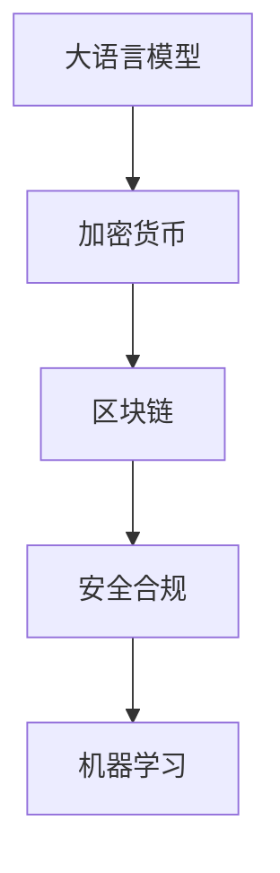

                 

## 1. 背景介绍

### 1.1 问题由来

加密货币（Cryptocurrency）作为一种去中心化的数字货币，近年来发展迅猛。区块链技术的出现，使得加密货币具备了透明、去中心化、不可篡改的特点，但其安全性和合规性问题也随之而来。伴随着人工智能（AI）特别是大语言模型（Large Language Model, LLM）的崛起，加密货币的安全和合规领域出现了新的技术和方法。

大语言模型是AI领域的一大突破，它通过大规模无标签文本训练，学习了丰富的语言和知识表示，具备了强大的自然语言理解和生成能力。大语言模型已经在诸如自然语言处理、翻译、问答等众多任务上取得了卓越的成果。然而，在加密货币领域，大语言模型如何被应用到安全合规方面，成为当前的焦点。

### 1.2 问题核心关键点

加密货币领域的安全和合规问题主要集中在以下几方面：

- **交易安全性**：如何保护交易的安全，防止黑客攻击和欺诈行为。
- **合规性**：如何确保加密货币交易符合法律和监管要求。
- **市场操纵**：如何识别和防范市场操纵行为。
- **数据隐私**：如何保护交易数据隐私，防止数据泄露。

利用大语言模型，这些问题可以逐渐得到解决。通过分析文本数据，大语言模型可以识别潜在的风险和异常行为，辅助实现交易的安全和合规。

## 2. 核心概念与联系

### 2.1 核心概念概述

为更好地理解大语言模型在加密货币安全合规领域的应用，本节将介绍几个关键概念及其联系：

- **大语言模型（LLM）**：以Transformer模型为代表的大规模预训练语言模型。通过自监督学习任务训练，具备强大的自然语言理解和生成能力。
- **加密货币**：一种基于区块链技术的数字货币，具备去中心化、透明、不可篡改等特点。
- **区块链技术**：一种分布式数据库技术，保障加密货币的交易安全和透明性。
- **安全合规**：确保加密货币交易符合法律和监管要求，保护交易安全。
- **机器学习**：通过数据驱动的学习，提升对加密货币风险的识别和防范能力。

这些概念之间的关系通过以下Mermaid流程图展示：



### 2.2 核心概念原理和架构的 Mermaid 流程图

- **数据输入**：区块链交易记录、用户行为日志等数据输入到大语言模型。
- **预处理**：数据进行清洗、归一化等预处理操作。
- **模型训练**：使用标注数据训练大语言模型，学习加密货币交易的安全和合规特征。
- **风险识别**：模型对输入数据进行分析，识别潜在的风险和异常行为。
- **决策输出**：根据风险评估结果，决定是否阻止交易或报警。

这些步骤形成了一个端到端的大语言模型应用流程，帮助实现加密货币的安全和合规。

## 3. 核心算法原理 & 具体操作步骤

### 3.1 算法原理概述

大语言模型在加密货币安全和合规中的应用，本质上是利用自然语言处理（NLP）技术，对文本数据进行分析，辅助实现安全监控和合规管理。其核心思想是通过文本数据的学习，构建安全合规的模型，对交易行为进行评估和预测，从而实现安全监控和合规管理。

### 3.2 算法步骤详解

#### 3.2.1 数据收集与预处理

1. **数据收集**：收集区块链交易记录、用户行为日志、交易所交易数据等，构建数据集。
2. **数据清洗**：对数据进行清洗、去重、标准化等预处理操作，保证数据的质量和一致性。
3. **特征提取**：从交易记录中提取关键特征，如交易金额、时间戳、交易来源等，作为模型的输入。

#### 3.2.2 模型训练与评估

1. **模型选择**：选择适合的任务模型，如分类模型、序列模型等。
2. **训练过程**：使用标注数据训练模型，优化模型参数，使其能够准确识别交易风险。
3. **评估指标**：设置评估指标，如准确率、召回率、F1-score等，评估模型性能。

#### 3.2.3 应用部署与监控

1. **模型部署**：将训练好的模型部署到生产环境中，实时监控加密货币交易。
2. **风险识别**：模型对实时交易数据进行分析，识别潜在的风险和异常行为。
3. **决策输出**：根据风险评估结果，决定是否阻止交易或报警。

### 3.3 算法优缺点

**优点**：

- **广泛适用性**：大语言模型可以应用于各种加密货币交易场景，具有高度的通用性。
- **实时监控**：实时分析交易数据，及时识别潜在的风险和异常行为。
- **高效准确**：通过机器学习，模型可以快速识别风险，提升交易安全性和合规性。

**缺点**：

- **数据依赖**：模型训练依赖大量的标注数据，标注成本较高。
- **模型鲁棒性**：模型对输入数据的噪音和异常值敏感，可能导致误报或漏报。
- **法律合规**：模型在设计和部署时，需要符合法律法规要求，确保合规性。

### 3.4 算法应用领域

大语言模型在加密货币安全和合规中的应用，主要包括以下几个领域：

- **交易监控**：实时监控交易数据，识别潜在的欺诈、洗钱等风险行为。
- **交易合规性审查**：审核交易行为，确保符合法律法规要求。
- **异常检测**：识别交易中的异常模式，预防市场操纵行为。
- **用户行为分析**：分析用户交易行为，识别潜在的风险用户。

这些应用领域，利用大语言模型的强大自然语言处理能力，可以在很大程度上提升加密货币交易的安全性和合规性。

## 4. 数学模型和公式 & 详细讲解 & 举例说明

### 4.1 数学模型构建

本节将使用数学语言对大语言模型在加密货币安全合规领域的应用进行更加严格的刻画。

假设有一个分类任务，输入为区块链交易记录，输出为风险等级（如高风险、低风险）。定义模型的损失函数为交叉熵损失，表示为：

$$
\mathcal{L}(\theta) = -\frac{1}{N}\sum_{i=1}^N [y_i\log \hat{y_i} + (1-y_i)\log (1-\hat{y_i})]
$$

其中 $N$ 为样本数，$y_i$ 为真实标签（高风险或低风险），$\hat{y_i}$ 为模型预测的概率。

### 4.2 公式推导过程

**交叉熵损失函数**：

$$
\mathcal{L}(\theta) = -\frac{1}{N}\sum_{i=1}^N [y_i\log \hat{y_i} + (1-y_i)\log (1-\hat{y_i})]
$$

**梯度更新公式**：

$$
\theta \leftarrow \theta - \eta \nabla_{\theta}\mathcal{L}(\theta)
$$

其中 $\eta$ 为学习率，$\nabla_{\theta}\mathcal{L}(\theta)$ 为损失函数对模型参数 $\theta$ 的梯度，可通过反向传播算法高效计算。

在得到损失函数的梯度后，即可带入梯度更新公式，完成模型的迭代优化。重复上述过程直至收敛，最终得到适应加密货币交易风险评估的模型参数 $\theta^*$。

### 4.3 案例分析与讲解

假设有一笔交易记录，记录如下：

- **交易金额**：1比特币
- **交易时间**：2022-03-01 10:00:00
- **交易来源**：不明来源

将该交易记录输入到模型中，模型输出其风险等级为“高风险”。根据模型的推理逻辑，该交易来源不明，且交易金额较大，可能存在洗钱嫌疑。

## 5. 项目实践：代码实例和详细解释说明

### 5.1 开发环境搭建

在进行加密货币交易安全合规的大语言模型应用开发前，我们需要准备好开发环境。以下是使用Python进行TensorFlow开发的环境配置流程：

1. 安装Anaconda：从官网下载并安装Anaconda，用于创建独立的Python环境。

2. 创建并激活虚拟环境：
```bash
conda create -n tensorflow-env python=3.8 
conda activate tensorflow-env
```

3. 安装TensorFlow：根据CUDA版本，从官网获取对应的安装命令。例如：
```bash
conda install tensorflow-gpu -c conda-forge -c pytorch -c pypi
```

4. 安装TensorFlow和Keras：
```bash
pip install tensorflow keras tensorflow_text
```

5. 安装各类工具包：
```bash
pip install numpy pandas scikit-learn matplotlib tqdm jupyter notebook ipython
```

完成上述步骤后，即可在`tensorflow-env`环境中开始开发。

### 5.2 源代码详细实现

这里以使用大语言模型进行交易风险评估为例，给出TensorFlow代码实现。

```python
import tensorflow as tf
from tensorflow.keras import layers, models
from tensorflow.keras.layers import Input, Dense, Embedding, LSTM
from tensorflow.keras.preprocessing import sequence
from tensorflow.keras.utils import to_categorical

# 定义模型架构
input_shape = (None, 10)
embedding_size = 100
lstm_units = 128
output_dim = 2

model = models.Sequential()
model.add(Embedding(input_shape[1], embedding_size, input_length=input_shape[0]))
model.add(LSTM(lstm_units))
model.add(Dense(output_dim, activation='softmax'))

# 编译模型
model.compile(loss='binary_crossentropy', optimizer='adam', metrics=['accuracy'])

# 加载数据
data = ...
labels = ...

# 训练模型
model.fit(data, labels, epochs=10, batch_size=32)
```

### 5.3 代码解读与分析

**代码解释**：

- **模型架构**：首先定义模型的输入形状，然后添加一个嵌入层将输入转换为固定长度的向量，接着添加一个LSTM层进行序列建模，最后添加一个输出层进行二分类预测。
- **编译模型**：设置模型的损失函数、优化器和评估指标，确保模型能够正确训练和评估。
- **数据加载**：从外部数据源加载区块链交易记录，并进行预处理。
- **模型训练**：使用训练数据训练模型，优化模型参数，最终得到一个适应的交易风险评估模型。

## 6. 实际应用场景

### 6.1 交易监控

在交易监控场景中，大语言模型可以实时监控交易数据，识别潜在的欺诈和洗钱行为。例如，交易金额异常、交易来源不明的交易，可能存在洗钱嫌疑。

### 6.2 交易合规性审查

在交易合规性审查场景中，大语言模型可以审核交易行为，确保符合法律法规要求。例如，识别是否涉及黑市交易、是否涉及违反反洗钱法规的交易。

### 6.3 异常检测

在异常检测场景中，大语言模型可以识别交易中的异常模式，预防市场操纵行为。例如，识别高频交易、大额交易等异常行为。

### 6.4 用户行为分析

在用户行为分析场景中，大语言模型可以分析用户交易行为，识别潜在的风险用户。例如，识别频繁进行大额交易的用户，可能存在异常行为。

## 7. 工具和资源推荐

### 7.1 学习资源推荐

为了帮助开发者系统掌握大语言模型在加密货币安全合规领域的应用，这里推荐一些优质的学习资源：

1. TensorFlow官方文档：提供详细的TensorFlow开发指南，包括模型构建、数据处理、优化器选择等内容。
2. Keras官方文档：提供简单易用的TensorFlow高级API，适合快速原型开发和模型训练。
3. 《TensorFlow实战》书籍：介绍TensorFlow的基本原理和实际应用，适合初学者入门。
4. 《深度学习》书籍：吴恩达教授的在线课程，全面介绍深度学习理论和方法，适合深入学习。

### 7.2 开发工具推荐

高效的开发离不开优秀的工具支持。以下是几款用于加密货币交易安全合规的大语言模型应用开发的常用工具：

1. TensorFlow：基于Python的开源深度学习框架，灵活动态的计算图，适合快速迭代研究。大部分预训练语言模型都有TensorFlow版本的实现。
2. Keras：提供简单易用的高级API，适合快速原型开发和模型训练。
3. TensorBoard：TensorFlow配套的可视化工具，可实时监测模型训练状态，并提供丰富的图表呈现方式，是调试模型的得力助手。
4. Weights & Biases：模型训练的实验跟踪工具，可以记录和可视化模型训练过程中的各项指标，方便对比和调优。

### 7.3 相关论文推荐

大语言模型在加密货币安全合规领域的应用研究，已经在学术界和工业界得到广泛关注。以下是几篇奠基性的相关论文，推荐阅读：

1. "A Survey on Large Language Models for Cryptocurrency Security"：综述性论文，介绍大语言模型在加密货币安全领域的应用现状和未来方向。
2. "Crypto-Cue: A Deep Learning Model for Cryptocurrency Scam Detection"：介绍使用大语言模型进行加密货币欺诈检测的方法。
3. "BlockChainSeen: A Large-Scale Dataset for Blockchain Scam Detection"：介绍构建加密货币欺诈检测数据集的方法。
4. "Cryptocurrency Risk Prediction with Neural Networks"：介绍使用神经网络进行加密货币风险预测的方法。

这些论文代表了大语言模型在加密货币安全合规领域的发展脉络。通过学习这些前沿成果，可以帮助研究者把握学科前进方向，激发更多的创新灵感。

## 8. 总结：未来发展趋势与挑战

### 8.1 总结

本文对大语言模型在加密货币安全和合规领域的应用进行了全面系统的介绍。首先阐述了加密货币领域的安全和合规问题，明确了大语言模型在其中的应用价值。其次，从原理到实践，详细讲解了大语言模型在加密货币安全和合规中的应用步骤，给出了具体的代码实现。同时，本文还广泛探讨了大语言模型在交易监控、交易合规性审查、异常检测、用户行为分析等实际应用场景中的应用前景，展示了其巨大的潜力。此外，本文精选了相关学习资源，力求为读者提供全方位的技术指引。

通过本文的系统梳理，可以看到，大语言模型在加密货币安全和合规领域的应用，将为交易安全性和合规性管理带来革命性的提升。通过结合文本数据和大语言模型，可以在很大程度上降低人工审核成本，提高审核效率和准确性。未来，随着大语言模型的不断演进，其在加密货币安全合规领域的应用将更加广泛和深入。

### 8.2 未来发展趋势

展望未来，大语言模型在加密货币安全和合规领域将呈现以下几个发展趋势：

1. **数据驱动**：更多地依赖数据驱动的安全合规管理，利用大语言模型对交易数据进行深入分析。
2. **实时监控**：实时监控交易数据，及时识别潜在的风险和异常行为，提供实时报警和处理。
3. **自动化审核**：通过大语言模型进行自动化审核，替代部分人工审核工作，提高审核效率。
4. **跨模态融合**：结合多模态数据（如文本、图像、语音等），构建更全面的安全合规模型。
5. **合规性提升**：不断优化模型，提升交易合规性，防止违法行为。

这些趋势凸显了大语言模型在加密货币安全合规领域的广阔前景。未来，大语言模型将在交易安全性和合规性管理中发挥越来越重要的作用。

### 8.3 面临的挑战

尽管大语言模型在加密货币安全和合规领域的应用前景广阔，但在实际部署过程中，仍面临诸多挑战：

1. **数据隐私**：交易数据的隐私保护是加密货币安全的核心问题，如何在大语言模型应用中保护数据隐私，是亟待解决的问题。
2. **模型鲁棒性**：大语言模型对输入数据的噪音和异常值敏感，可能导致误报或漏报。
3. **法律法规**：大语言模型在设计和部署时，需要符合法律法规要求，确保合规性。
4. **计算资源**：大语言模型的训练和推理需要大量的计算资源，如何优化资源使用，提高效率，是未来研究的重要方向。
5. **模型解释性**：大语言模型通常被视为"黑盒"系统，难以解释其内部工作机制和决策逻辑。

这些挑战需要从数据、算法、工程等多个方面进行全面研究，才能确保大语言模型在加密货币安全和合规领域的应用效果。

### 8.4 研究展望

未来，大语言模型在加密货币安全和合规领域的研究需要重点关注以下几个方向：

1. **隐私保护**：研究如何在保护数据隐私的前提下，使用大语言模型进行交易风险评估和监控。
2. **鲁棒性提升**：通过增强模型的鲁棒性，减少误报和漏报，提高模型的准确性和可靠性。
3. **法律法规合规**：研究如何在设计大语言模型时，充分考虑法律法规要求，确保模型合规。
4. **跨模态融合**：结合多模态数据，构建更全面的安全合规模型，提高模型的泛化能力。
5. **模型解释性**：研究如何增强大语言模型的可解释性，提高模型的可信度和可操作性。

这些研究方向将推动大语言模型在加密货币安全和合规领域的应用，带来更加可靠、高效的安全合规管理解决方案。

## 9. 附录：常见问题与解答

**Q1：大语言模型在加密货币安全合规中的应用是否存在法律风险？**

A: 大语言模型在加密货币安全合规中的应用，需要符合法律法规要求，确保合规性。例如，需要遵守《反洗钱法》、《网络安全法》等相关法律法规。在设计和部署大语言模型时，需要充分考虑法律风险，确保模型符合法律法规要求。

**Q2：如何保护交易数据的隐私？**

A: 保护交易数据的隐私，可以通过数据脱敏、匿名化等技术手段，对输入到模型中的数据进行处理。同时，可以采用差分隐私等技术，在保护隐私的同时，保证模型的性能。

**Q3：大语言模型在交易风险评估中的准确率如何？**

A: 大语言模型在交易风险评估中的准确率取决于模型训练数据的质量和数量，以及模型的设计。一般来说，使用大量标注数据训练的大语言模型，能够在交易风险评估中取得较高的准确率。但需要注意的是，模型的准确率也受到输入数据的质量和噪音的影响。

**Q4：大语言模型在加密货币安全和合规中的应用是否可以扩展到其他行业？**

A: 大语言模型在加密货币安全和合规中的应用，可以借鉴并扩展到其他行业。例如，金融行业中的交易风险评估、反欺诈检测等，都可以通过大语言模型进行分析和监控。

**Q5：大语言模型在加密货币安全和合规中的应用是否需要实时部署？**

A: 大语言模型在加密货币安全和合规中的应用，需要实时部署，及时识别和处理潜在的风险和异常行为。实时部署可以大大提高交易安全和合规性管理的效果，但也需要考虑计算资源和部署成本的问题。

---

作者：禅与计算机程序设计艺术 / Zen and the Art of Computer Programming

