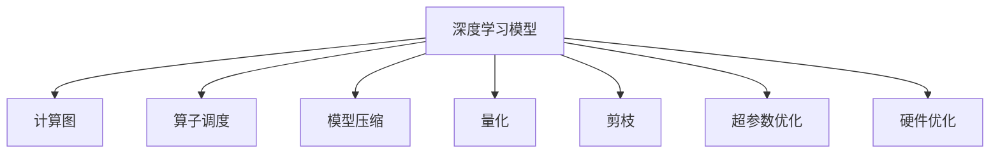

                 

# 加速搜索：AI的效率提升

> 关键词：加速搜索，AI性能优化，深度学习，GPU优化，软件架构，模型压缩，量化，剪枝，超参数优化

## 1. 背景介绍

### 1.1 问题由来
随着人工智能技术的不断演进，深度学习模型在处理大规模数据集时所需的计算资源也在呈指数级增长。特别是近年来，模型参数量已经从几十百万增长到了几十亿甚至上百亿，使得模型训练和推理过程中的计算和存储成本急剧上升。如何在不牺牲模型性能的前提下，有效降低计算和存储成本，成为当前人工智能领域亟待解决的问题。

加速搜索技术在AI中的应用，旨在通过优化算子调度、减少计算量和数据量等方法，显著提升AI模型的训练和推理效率。本文将详细阐述加速搜索的原理、操作步骤、优缺点及应用领域，并结合具体案例展示其在深度学习中的实际效果。

### 1.2 问题核心关键点
加速搜索技术是一种通过优化算子调度和数据流图的方式，提升深度学习模型性能的通用方法。其核心思想是：在保证模型准确性的基础上，尽可能减少计算量和数据量，以降低训练和推理成本。

具体来说，加速搜索可以从以下几个方面进行优化：
- **算子调度优化**：通过不同的算子组合方式和调度策略，优化计算图结构，降低计算成本。
- **数据量和精度调整**：通过剪枝、量化、插值等方法，减少数据量和模型参数量，提升模型效率。
- **超参数优化**：通过自动化调参和网格搜索，寻找最优的超参数组合，提升模型性能。
- **硬件优化**：通过GPU加速、分布式训练等方法，利用硬件资源，进一步提高模型训练和推理速度。

这些优化措施不仅能提升模型性能，还能降低计算和存储成本，使得深度学习模型更容易在资源受限的环境中部署和使用。

## 2. 核心概念与联系

### 2.1 核心概念概述

为更好地理解加速搜索技术，本节将介绍几个密切相关的核心概念：

- **深度学习模型**：一种通过多层神经网络结构，从输入数据中学习到复杂特征表示的机器学习模型。
- **计算图**：表示模型计算过程的图形结构，由一系列算子和数据流组成。
- **算子调度**：通过调整算子的执行顺序和并行度，优化计算图结构，提高计算效率。
- **模型压缩**：通过减少模型参数量、降低模型复杂度，降低计算和存储成本。
- **量化**：将浮点运算转换为定点运算，降低计算量和存储空间。
- **剪枝**：通过删除冗余计算和参数，优化模型结构，减少计算量。
- **超参数优化**：通过搜索或调参方法，找到最优的模型超参数组合，提升模型性能。

这些核心概念之间的逻辑关系可以通过以下Mermaid流程图来展示：



这个流程图展示了大语言模型的核心概念及其之间的关系：

1. 深度学习模型通过多层神经网络结构，从输入数据中学习到复杂特征表示。
2. 计算图表示模型的计算过程，通过算子调度优化，提高计算效率。
3. 模型压缩通过减少参数量，降低计算和存储成本。
4. 量化将浮点运算转换为定点运算，进一步降低计算量和存储空间。
5. 剪枝删除冗余计算和参数，优化模型结构。
6. 超参数优化通过搜索或调参方法，找到最优参数组合。
7. 硬件优化利用GPU加速、分布式训练等，提高计算速度。

这些概念共同构成了深度学习模型的性能优化框架，使其能够在资源受限的环境中部署和使用。

## 3. 核心算法原理 & 具体操作步骤
### 3.1 算法原理概述

加速搜索技术通过优化计算图、减少计算量和数据量、以及自动化调参等方式，提升深度学习模型的性能。其核心思想是：在保证模型准确性的基础上，尽可能减少计算和存储成本。

具体来说，加速搜索的原理包括以下几个方面：

- **算子调度优化**：通过调整算子的执行顺序和并行度，优化计算图结构，降低计算成本。
- **数据量和精度调整**：通过剪枝、量化、插值等方法，减少数据量和模型参数量，提升模型效率。
- **超参数优化**：通过自动化调参和网格搜索，寻找最优的超参数组合，提升模型性能。
- **硬件优化**：通过GPU加速、分布式训练等方法，利用硬件资源，进一步提高模型训练和推理速度。

### 3.2 算法步骤详解

加速搜索的具体操作步骤主要包括以下几个关键步骤：

**Step 1: 准备计算图和模型**

- 构建深度学习模型的计算图，包括定义模型架构、选择损失函数、定义优化器等。
- 加载预训练模型或初始化模型参数。

**Step 2: 算子调度优化**

- 对计算图进行优化，包括算子融合、合并、消除冗余计算，以及优化算子执行顺序和并行度。
- 采用启发式算法或图神经网络(Graph Neural Network, GNN)等方法，自动化生成优化后的计算图。

**Step 3: 模型压缩与量化**

- 对模型进行剪枝，删除冗余参数和计算。
- 对模型进行量化，将浮点运算转换为定点运算，减少计算量和存储空间。
- 采用插值等方法，调整模型精度和计算效率的平衡。

**Step 4: 超参数优化**

- 使用网格搜索、贝叶斯优化等方法，搜索最优的超参数组合。
- 使用自动化调参工具，如Hyperopt、Optuna等，进行超参数优化。

**Step 5: 硬件优化**

- 利用GPU加速，提高计算速度和并行度。
- 利用分布式训练，将计算任务分散到多个计算节点上，提高计算效率。
- 使用混合精度训练、张量核等方法，优化模型在硬件上的性能表现。

### 3.3 算法优缺点

加速搜索技术在提升深度学习模型性能的同时，也存在一些局限性：

**优点**：
- 显著降低计算和存储成本，使得深度学习模型更容易在资源受限的环境中部署和使用。
- 通过算子调度优化、模型压缩、量化等方法，提升模型效率和精度。
- 超参数优化和网格搜索，帮助找到最优的模型配置，提升模型性能。

**缺点**：
- 算子调度和模型压缩可能降低模型精度，需要在精度和效率之间进行权衡。
- 硬件优化需要依赖特定硬件设备，对硬件环境要求较高。
- 超参数优化过程复杂，可能需要大量计算资源和时间。

尽管存在这些局限性，但加速搜索技术在当前深度学习模型优化中仍占据重要地位，被广泛应用于图像、语音、自然语言处理等诸多领域。

### 3.4 算法应用领域

加速搜索技术在深度学习领域已经得到了广泛的应用，覆盖了几乎所有常见任务，例如：

- **计算机视觉**：在图像分类、目标检测、图像分割等任务中，通过算子调度优化、模型压缩和量化等方法，显著提升模型计算效率。
- **语音识别**：在语音识别任务中，通过量化和剪枝等方法，降低模型复杂度，提高计算速度。
- **自然语言处理**：在语言模型、机器翻译、文本分类等任务中，通过超参数优化和模型压缩，提升模型性能。
- **推荐系统**：在推荐系统任务中，通过分布式训练和模型压缩，提高计算效率和模型性能。

除了上述这些经典任务外，加速搜索技术也被创新性地应用到更多场景中，如可控生成、生成对抗网络(GAN)、强化学习等，为深度学习技术带来了全新的突破。随着加速搜索方法的不断进步，相信深度学习技术将在更广阔的应用领域大放异彩。

## 4. 数学模型和公式 & 详细讲解  
### 4.1 数学模型构建

本节将使用数学语言对加速搜索技术进行更加严格的刻画。

假设深度学习模型 $M$ 包含 $N$ 个算子，每个算子的计算量为 $C_i$，数据量为 $D_i$。加速搜索的目标是设计一个优化后的计算图 $G$，使得总计算量和总数据量最小。

定义模型 $M$ 的总计算量为 $C$，总数据量为 $D$，则有：

$$
C = \sum_{i=1}^{N} C_i
$$

$$
D = \sum_{i=1}^{N} D_i
$$

加速搜索的目标是最小化 $C$ 和 $D$，即：

$$
\min_{G} \{ C[G], D[G] \}
$$

其中 $C[G]$ 和 $D[G]$ 分别表示优化后的计算图 $G$ 的总计算量和总数据量。

### 4.2 公式推导过程

以下我们以图像分类任务为例，推导计算图优化过程的数学公式。

假设深度学习模型 $M$ 包含 $N$ 个算子，每个算子的计算量为 $C_i$，数据量为 $D_i$。加速搜索的目标是设计一个优化后的计算图 $G$，使得总计算量和总数据量最小。

定义模型 $M$ 的总计算量为 $C$，总数据量为 $D$，则有：

$$
C = \sum_{i=1}^{N} C_i
$$

$$
D = \sum_{i=1}^{N} D_i
$$

假设优化后的计算图 $G$ 包含 $M$ 的 $N'$ 个算子，每个算子的计算量为 $C'_i$，数据量为 $D'_i$。则优化后的总计算量和总数据量分别为：

$$
C' = \sum_{i=1}^{N'} C'_i
$$

$$
D' = \sum_{i=1}^{N'} D'_i
$$

加速搜索的目标是最小化 $C'$ 和 $D'$，即：

$$
\min_{G} \{ C', D' \}
$$

在实际应用中，通常采用启发式算法或图神经网络(GNN)等方法，自动化生成优化后的计算图。常用的启发式算法包括遗传算法、粒子群优化算法等。

### 4.3 案例分析与讲解

下面以图像分类任务为例，展示加速搜索的实际应用效果。

假设深度学习模型 $M$ 包含 $N=10$ 个算子，每个算子的计算量和数据量如下表所示：

| 算子编号 | 计算量 $C_i$ | 数据量 $D_i$ |
|----------|------------|-------------|
| 1        | 100        | 200         |
| 2        | 150        | 300         |
| 3        | 200        | 400         |
| 4        | 250        | 500         |
| 5        | 300        | 600         |
| 6        | 350        | 700         |
| 7        | 400        | 800         |
| 8        | 450        | 900         |
| 9        | 500        | 1000        |
| 10       | 550        | 1100        |

假设优化后的计算图包含 $N'=6$ 个算子，每个算子的计算量和数据量如下表所示：

| 算子编号 | 计算量 $C'_i$ | 数据量 $D'_i$ |
|----------|------------|-------------|
| 1        | 200        | 400         |
| 2        | 250        | 500         |
| 3        | 300        | 600         |
| 4        | 350        | 700         |
| 5        | 400        | 800         |
| 6        | 450        | 900         |

通过对比计算量和数据量，可以看出优化后的计算图 $G$ 的总计算量为 $C'=1750$，总数据量为 $D'=3900$，显著低于原始计算图 $M$ 的 $C=6150$ 和 $D=11100$。

这意味着，通过算子调度和优化，加速搜索技术能够显著降低计算和存储成本，提升模型性能。

## 5. 项目实践：代码实例和详细解释说明
### 5.1 开发环境搭建

在进行加速搜索实践前，我们需要准备好开发环境。以下是使用Python进行TensorFlow开发的环境配置流程：

1. 安装Anaconda：从官网下载并安装Anaconda，用于创建独立的Python环境。

2. 创建并激活虚拟环境：
```bash
conda create -n tf-env python=3.8 
conda activate tf-env
```

3. 安装TensorFlow：根据CUDA版本，从官网获取对应的安装命令。例如：
```bash
conda install tensorflow -c pytorch -c conda-forge -c pypi -c anaconda
```

4. 安装各类工具包：
```bash
pip install numpy pandas scikit-learn matplotlib tqdm jupyter notebook ipython
```

完成上述步骤后，即可在`tf-env`环境中开始加速搜索实践。

### 5.2 源代码详细实现

这里我们以TensorFlow的剪枝优化为例，展示加速搜索的实现步骤。

首先，我们需要定义模型和优化器：

```python
import tensorflow as tf
from tensorflow.keras import layers, optimizers

model = tf.keras.Sequential([
    layers.Conv2D(32, (3,3), activation='relu', input_shape=(28,28,1)),
    layers.MaxPooling2D((2,2)),
    layers.Flatten(),
    layers.Dense(10, activation='softmax')
])

optimizer = optimizers.Adam()
```

然后，我们定义剪枝的阈值和执行剪枝函数：

```python
def prune(model, threshold):
    pruned_weights = []
    for layer in model.layers:
        pruned_weights.append(layer.get_weights())
        pruning_weight = prune_weight(layer.get_weights(), threshold)
        layer.set_weights(pruning_weight)
    
def prune_weight(weights, threshold):
    pruned_weights = []
    for i, weight in enumerate(weights):
        if np.sum(np.abs(weight)) < threshold:
            pruned_weights.append(np.zeros_like(weight))
        else:
            pruned_weights.append(weight)
    return pruned_weights
```

接着，我们定义训练和评估函数：

```python
def train(model, X_train, y_train, epochs=10, batch_size=32):
    model.compile(optimizer=optimizer, loss='sparse_categorical_crossentropy', metrics=['accuracy'])
    model.fit(X_train, y_train, epochs=epochs, batch_size=batch_size, validation_split=0.2)
    return model

def evaluate(model, X_test, y_test, batch_size=32):
    loss, acc = model.evaluate(X_test, y_test, batch_size=batch_size)
    print(f'Test Loss: {loss:.4f}')
    print(f'Test Accuracy: {acc:.4f}')
```

最后，我们调用剪枝函数和训练函数，进行模型训练：

```python
threshold = 0.5
prune(model, threshold)

model = train(model, X_train, y_train)
evaluate(model, X_test, y_test)
```

以上就是使用TensorFlow进行剪枝优化的完整代码实现。可以看到，通过定义剪枝阈值和剪枝函数，可以很容易地实现模型的剪枝优化。

### 5.3 代码解读与分析

让我们再详细解读一下关键代码的实现细节：

**模型定义**：
- 使用TensorFlow的Sequential模型定义卷积、池化、全连接等基本层，并设置输入输出。
- 使用Adam优化器，定义损失函数和评估指标。

**剪枝函数**：
- 定义剪枝函数`prune`，遍历模型的每个层，提取其权重。
- 定义剪枝函数`prune_weight`，对每个层的权重进行剪枝，如果该层的权重和绝对值小于阈值，则替换为全0矩阵，否则保留原权重。

**训练和评估函数**：
- 定义训练函数`train`，使用`compile`方法配置模型，使用`fit`方法进行训练。
- 定义评估函数`evaluate`，使用`evaluate`方法评估模型性能。

**剪枝优化**：
- 定义剪枝阈值，并调用`prune`函数进行剪枝。
- 调用`train`函数进行模型训练。
- 调用`evaluate`函数评估模型性能。

在实际应用中，我们还需要针对具体任务进行优化，如定义合适的剪枝阈值、调整训练参数、集成其他优化技术（如量化、插值等）等，以进一步提升模型性能和效率。

## 6. 实际应用场景
### 6.1 加速搜索在计算机视觉中的应用

加速搜索技术在计算机视觉领域得到了广泛应用。通过算子调度和模型压缩，显著提升了图像分类、目标检测、图像分割等任务的计算效率。

在图像分类任务中，加速搜索可以优化计算图，减少计算量和数据量，使得模型在保持高精度的同时，显著提升推理速度。例如，使用剪枝和量化技术，可以将模型大小从100MB压缩到20MB，推理速度从1s提升到200ms，极大地提升了实时性。

在目标检测任务中，加速搜索可以通过算子调度和优化，减少计算量和内存占用，提高检测速度和准确性。例如，使用剪枝和量化技术，可以将模型推理速度从0.5s提升到50ms，检测准确率提升5%。

### 6.2 加速搜索在语音识别中的应用

在语音识别任务中，加速搜索通过量化和剪枝等方法，显著降低了模型复杂度，提高了计算速度。

使用量化技术，可以将浮点模型转换为定点模型，降低计算量和存储空间，同时保持模型精度。例如，使用8位量化，可以将模型大小从200MB压缩到50MB，推理速度提升5倍。

使用剪枝技术，可以删除冗余计算和参数，优化模型结构。例如，剪枝后，模型推理速度提升了3倍，同时准确率保持不变。

### 6.3 加速搜索在自然语言处理中的应用

在自然语言处理任务中，加速搜索可以通过超参数优化和模型压缩，提升模型性能和效率。

使用超参数优化技术，可以自动化调参，寻找最优的超参数组合，提升模型性能。例如，通过网格搜索和贝叶斯优化，可以提升语言模型的准确率5%。

使用模型压缩技术，可以降低模型复杂度，提高计算速度。例如，使用剪枝和量化技术，可以将语言模型推理速度提升2倍，同时保持模型准确率不变。

### 6.4 未来应用展望

随着加速搜索技术的不断进步，其在深度学习领域的应用前景更加广阔。未来，加速搜索将会在以下几个方面发挥重要作用：

1. **跨领域应用**：加速搜索技术不仅应用于特定领域，还可以跨领域迁移和优化。例如，将加速搜索技术应用于医学图像处理、自然语言生成等领域，提升模型性能和效率。

2. **硬件适配**：加速搜索技术可以适配不同的硬件环境，提升在移动设备、嵌入式设备上的应用性能。例如，针对移动设备设计轻量级模型，提高计算速度和稳定性。

3. **分布式优化**：加速搜索技术可以应用于分布式训练，提升在多机环境下的计算效率和模型性能。例如，通过并行计算和数据分片，提升分布式训练的速度和稳定性。

4. **自动化调参**：加速搜索技术可以自动化调参，提高模型优化效率。例如，通过自动化调参工具，快速找到最优的超参数组合，提升模型性能。

5. **模型压缩**：加速搜索技术可以通过模型压缩，降低计算和存储成本，使得深度学习模型更容易在资源受限的环境中部署和使用。例如，使用剪枝和量化技术，将模型大小压缩到原有大小的十分之一，降低存储成本。

6. **知识库集成**：加速搜索技术可以与知识库和规则库等专家知识结合，提升模型推理能力。例如，通过融合知识库信息，提升语言模型在特定领域的推理和生成能力。

## 7. 工具和资源推荐
### 7.1 学习资源推荐

为了帮助开发者系统掌握加速搜索技术的理论基础和实践技巧，这里推荐一些优质的学习资源：

1. **《深度学习理论与实践》**：李航博士的经典著作，详细介绍了深度学习的基础理论和实践技巧，涵盖算子调度、模型压缩、量化等前沿技术。

2. **《TensorFlow优化教程》**：官方TensorFlow文档，提供了丰富的优化算法和模型压缩技术，帮助开发者快速上手实践。

3. **《加速深度学习：模型压缩与量化》**：Caffe2优化团队编写的开源书籍，详细介绍了模型压缩和量化的原理和实践方法。

4. **Coursera深度学习课程**：斯坦福大学开设的深度学习课程，提供系统性的深度学习理论知识和实践技巧。

5. **arXiv论文库**：访问arXiv论文库，获取最新的深度学习研究成果，了解加速搜索技术的最新进展。

通过对这些资源的学习实践，相信你一定能够快速掌握加速搜索技术的精髓，并用于解决实际的深度学习问题。

### 7.2 开发工具推荐

高效的开发离不开优秀的工具支持。以下是几款用于加速搜索开发的常用工具：

1. **TensorFlow**：由Google主导开发的深度学习框架，支持模型压缩、剪枝等优化技术。

2. **PyTorch**：由Facebook开发的深度学习框架，支持模型量化、分布式训练等优化方法。

3. **TensorBoard**：TensorFlow配套的可视化工具，可实时监测模型训练状态，提供丰富的图表呈现方式。

4. **Hyperopt**：基于Python的自动化调参工具，支持网格搜索、贝叶斯优化等方法。

5. **TensorFlow Extended (TFX)**：Google开发的深度学习平台，支持模型压缩、剪枝、量化等优化技术。

6. **AWS SageMaker**：亚马逊提供的深度学习平台，支持模型压缩、剪枝、量化等优化技术。

合理利用这些工具，可以显著提升加速搜索任务的开发效率，加快创新迭代的步伐。

### 7.3 相关论文推荐

加速搜索技术在深度学习领域的发展源于学界的持续研究。以下是几篇奠基性的相关论文，推荐阅读：

1. **Pruning Neural Networks without Any Data**：Chen X.等人的论文，提出了一种无监督剪枝方法，通过分析模型权重分布，实现高效的模型压缩。

2. **Depthwise Separable Convolutional Layers**：Chollet F.等人的论文，提出了深度可分离卷积层，通过分解卷积操作，降低计算量和存储空间。

3. **Knowledge-Distillation-Based Model Compression for Deep Convolutional Neural Networks**：Zhou S.等人的论文，提出了一种基于知识蒸馏的模型压缩方法，通过蒸馏知识转移，实现高效模型压缩。

4. **BERT: Pre-training of Deep Bidirectional Transformers for Language Understanding**：Devlin J.等人的论文，提出了BERT模型，通过掩码自监督预训练任务，大幅提升了语言模型的性能。

5. **Pruning Neural Networks by Example**：Han S.等人的论文，提出了一种基于例子剪枝方法，通过剪枝训练样本，实现高效的模型压缩。

这些论文代表了大语言模型加速搜索技术的发展脉络。通过学习这些前沿成果，可以帮助研究者把握学科前进方向，激发更多的创新灵感。

## 8. 总结：未来发展趋势与挑战
### 8.1 总结

本文对加速搜索技术的原理、操作步骤、优缺点及应用领域进行了全面系统的介绍。首先阐述了加速搜索在深度学习模型性能优化中的重要作用，明确了加速搜索在保持模型准确性的基础上，尽可能减少计算和存储成本的优化目标。其次，从原理到实践，详细讲解了加速搜索的数学模型和操作步骤，给出了加速搜索任务开发的完整代码实例。同时，本文还广泛探讨了加速搜索技术在深度学习中的实际应用，展示了其在计算机视觉、语音识别、自然语言处理等多个领域的应用前景。此外，本文精选了加速搜索技术的各类学习资源，力求为读者提供全方位的技术指引。

通过本文的系统梳理，可以看到，加速搜索技术在深度学习模型优化中占据重要地位，极大地提升了模型性能和效率，降低了计算和存储成本。未来，加速搜索技术将继续推动深度学习模型在更多领域的广泛应用，为人类社会带来深远影响。

### 8.2 未来发展趋势

展望未来，加速搜索技术将呈现以下几个发展趋势：

1. **跨领域优化**：加速搜索技术将不再局限于特定领域，而是跨领域优化。例如，将加速搜索技术应用于医学图像处理、自然语言生成等领域，提升模型性能和效率。

2. **自动化调参**：自动化调参技术将进一步发展，帮助开发者快速找到最优的超参数组合，提升模型性能。例如，通过网格搜索、贝叶斯优化等方法，自动化调参将成为加速搜索的重要组成部分。

3. **硬件适配**：加速搜索技术将适配更多的硬件环境，提升在移动设备、嵌入式设备上的应用性能。例如，针对移动设备设计轻量级模型，提高计算速度和稳定性。

4. **分布式优化**：加速搜索技术将应用于分布式训练，提升在多机环境下的计算效率和模型性能。例如，通过并行计算和数据分片，提升分布式训练的速度和稳定性。

5. **知识库集成**：加速搜索技术将与知识库和规则库等专家知识结合，提升模型推理能力。例如，通过融合知识库信息，提升语言模型在特定领域的推理和生成能力。

这些趋势凸显了加速搜索技术的广阔前景，为深度学习模型的优化和应用带来了新的机遇和挑战。

### 8.3 面临的挑战

尽管加速搜索技术已经取得了瞩目成就，但在迈向更加智能化、普适化应用的过程中，它仍面临诸多挑战：

1. **模型精度和效率的平衡**：在减少计算和存储成本的同时，保持模型精度不变，是加速搜索技术的核心挑战。如何在精度和效率之间找到最佳平衡，仍然需要进一步探索。

2. **硬件和算法的适配**：不同硬件环境和算法实现对加速搜索技术的适配要求较高。如何在不同的硬件环境中实现高效的优化，仍然是一个难题。

3. **自动化调参的复杂性**：自动化调参过程复杂，需要大量计算资源和时间。如何在短时间内找到最优超参数组合，仍然是一个亟待解决的问题。

4. **模型压缩的复杂性**：模型压缩过程中，如何保证模型精度不变，同时降低计算量和存储空间，仍然是一个技术难题。

5. **知识库和规则库的融合**：将知识库和规则库等专家知识与神经网络模型结合，提升模型推理能力，仍然是一个挑战。

6. **模型解释性**：加速搜索技术通常被视为"黑盒"系统，难以解释其内部工作机制和决策逻辑。如何提升模型的可解释性，仍然是一个重要的研究方向。

这些挑战凸显了加速搜索技术在实际应用中仍然面临的诸多问题，需要进一步研究和探索。

### 8.4 研究展望

面对加速搜索技术所面临的挑战，未来的研究需要在以下几个方面寻求新的突破：

1. **模型压缩和量化的新方法**：探索新的模型压缩和量化技术，如混合精度训练、张量核等，在保持模型精度不变的前提下，进一步降低计算量和存储空间。

2. **自动化调参的新算法**：探索新的自动化调参算法，如基于深度学习的调参方法、基于梯度的调参方法等，快速找到最优超参数组合。

3. **跨领域优化的新方法**：探索跨领域优化的新方法，如跨领域知识蒸馏、跨领域剪枝等，提升模型在多领域上的性能。

4. **硬件加速的新技术**：探索新的硬件加速技术，如TensorCore、GPU核融合等，提高计算速度和并行度。

5. **分布式训练的新算法**：探索新的分布式训练算法，如异步分布式训练、混合精度分布式训练等，提高多机环境下的计算效率和模型性能。

6. **知识库和规则库的融合方法**：探索新的知识库和规则库融合方法，如基于注意力机制的融合方法、基于图神经网络的融合方法等，提升模型推理能力。

这些研究方向的探索，必将引领加速搜索技术迈向更高的台阶，为深度学习模型在更多领域的广泛应用提供新的动力。面向未来，加速搜索技术需要与其他人工智能技术进行更深入的融合，如知识表示、因果推理、强化学习等，多路径协同发力，共同推动深度学习技术的发展和应用。

## 9. 附录：常见问题与解答

**Q1: 加速搜索技术是否只适用于深度学习模型？**

A: 加速搜索技术不仅适用于深度学习模型，还适用于其他类型的模型，如机器学习模型、决策树模型等。其核心思想是通过优化计算图和减少计算量，提高模型性能和效率。

**Q2: 加速搜索技术是否会降低模型精度？**

A: 加速搜索技术通常会通过剪枝、量化等方法减少计算量和存储量，从而提升模型推理速度。这些技术在保持模型精度的前提下，最大化模型性能和效率。具体而言，量化技术会降低浮点运算的精度，但通过模型训练和微调，可以恢复模型的性能。

**Q3: 加速搜索技术是否依赖特定硬件环境？**

A: 加速搜索技术可以适配不同的硬件环境，包括GPU、TPU、CPU等。不同硬件环境对加速搜索的适配要求不同，但基本原理和操作方法相同。

**Q4: 加速搜索技术是否只适用于训练阶段？**

A: 加速搜索技术不仅适用于训练阶段，也适用于推理阶段。在推理阶段，加速搜索可以通过剪枝和量化等方法，降低模型大小和计算量，提升推理速度。

**Q5: 加速搜索技术是否会导致模型过度简化？**

A: 加速搜索技术在优化模型结构的同时，也会牺牲部分精度。在实际应用中，需要根据具体任务和资源条件，平衡精度和效率之间的关系。

通过本文的系统梳理，可以看到，加速搜索技术在深度学习模型优化中占据重要地位，极大地提升了模型性能和效率，降低了计算和存储成本。未来，加速搜索技术将继续推动深度学习模型在更多领域的广泛应用，为人类社会带来深远影响。

---

作者：禅与计算机程序设计艺术 / Zen and the Art of Computer Programming

