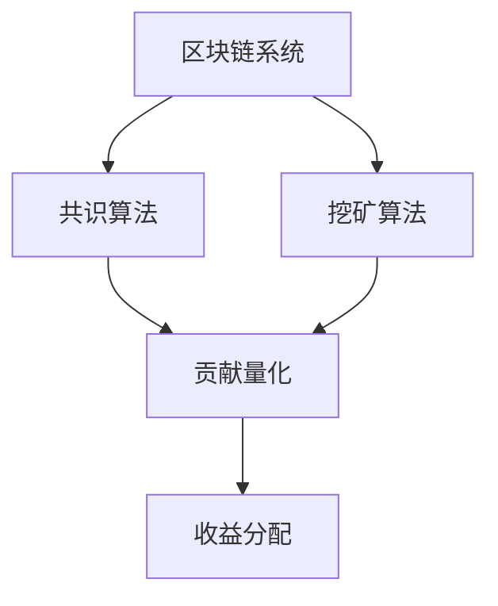

                 

## 1. 背景介绍

### 1.1 问题由来

区块链技术的快速发展在金融、供应链管理、数字身份认证等多个领域得到广泛应用。然而，随着区块链系统的规模化、复杂化，其能源消耗、性能瓶颈等问题也日益凸显。尤其是在数字货币领域，如何准确量化交易参与者对区块链的贡献与收益，成为学术界和工业界共同关注的焦点。

当前，数字货币的挖掘过程高度依赖共识算法，共识节点消耗大量计算资源来验证交易并维护网络安全。挖掘者通过提供计算能力，获得相应的奖励，包括交易手续费和区块的奖励。然而，这种基于工作量证明(Proof of Work, PoW)的共识机制存在诸多局限性：

- 能耗高：PoW机制需要大量计算资源，导致高能源消耗。
- 网络攻击易：大量计算资源容易被恶意攻击者控制，攻击区块链网络的成本变低。
- 收益分配不合理：矿工获得的收益与其对网络贡献并不完全匹配。

为解决这些问题，学术界和工业界提出了诸多共识机制优化方案。其中，注意力价值量化方法逐渐受到关注。

### 1.2 问题核心关键点

注意力价值量化方法，旨在通过量化参与者对区块链系统的贡献，优化收益分配机制。它主要包含以下几个核心概念：

- 共识算法：区块链系统的核心，用于确定网络中的交易有效性和区块排序。
- 挖矿算法：共识算法的一个具体实现，如PoW、PoS等，提供奖励机制以激励节点参与。
- 贡献量化：计算参与者对区块链系统的贡献，通常通过计算贡献量、工作难度、网络负载等指标实现。
- 收益分配：根据量化后的贡献，调整节点收益分配策略，优化系统的公平性和安全性。

注意力价值量化方法的核心在于如何准确、公平地量化每个节点的贡献，并基于贡献分配收益。通过优化收益分配，不仅能减少能源消耗、提高交易效率，还能提升区块链系统的安全性和稳定性。

### 1.3 问题研究意义

研究注意力价值量化方法，对于优化区块链系统性能、降低能耗、提升交易公平性具有重要意义：

1. 减少能源消耗：通过量化和优化节点贡献，降低无意义的计算工作量，减少能源消耗。
2. 提高交易效率：合理分配收益，降低攻击者控制网络成本，增强区块链网络安全性。
3. 优化收益分配：公平分配贡献和收益，激励更多节点参与，提升系统健康度。
4. 保障经济稳定：通过改进挖矿算法，提升系统抗攻击能力，保障数字货币经济稳定。
5. 推动技术演进：通过持续技术优化，推动区块链技术向更高效、更安全、更智能的方向演进。

## 2. 核心概念与联系

### 2.1 核心概念概述

为更好地理解注意力价值量化方法，本节将介绍几个密切相关的核心概念：

- 区块链系统(区块链)：一种去中心化的分布式账本技术，通过共识算法保障数据的安全性和完整性。
- 共识算法(共识机制)：确定区块链网络中交易有效性和区块排序的算法，如PoW、PoS、DPoS等。
- 挖矿算法(挖矿机制)：共识算法的具体实现，如PoW中的工作量证明机制，提供奖励机制以激励节点参与。
- 贡献量化：计算参与者对区块链系统的贡献，通常通过计算贡献量、工作难度、网络负载等指标实现。
- 收益分配：根据量化后的贡献，调整节点收益分配策略，优化系统的公平性和安全性。

这些概念之间的逻辑关系可以通过以下Mermaid流程图来展示：



这个流程图展示了大语言模型的核心概念及其之间的关系：

1. 区块链系统通过共识算法维护交易和区块的有效性，并通过挖矿算法激励节点参与。
2. 贡献量化方法计算节点对系统的贡献，基于量化结果进行收益分配。
3. 收益分配优化系统的公平性和安全性，提升整个系统的效率和稳定性。

这些概念共同构成了区块链系统的运作机制，使其能够在各种场景下发挥强大的数据存储和交易验证能力。通过理解这些核心概念，我们可以更好地把握区块链技术的工作原理和优化方向。

## 3. 核心算法原理 & 具体操作步骤
### 3.1 算法原理概述

注意力价值量化方法，本质上是一种公平且高效的挖矿算法优化策略。其核心思想是：通过量化参与者对区块链系统的贡献，实现更合理的收益分配，从而降低能源消耗、提升交易效率。

在具体实现上，该方法将区块链交易过程中的各种资源消耗和贡献量化，计算并分配给各个节点。常见的量化指标包括：

- 工作难度：计算每个区块的挖掘难度，越高的工作难度代表越大的计算资源消耗。
- 贡献量：计算节点在特定时间段内对区块链系统的贡献大小，如处理交易、验证区块等。
- 网络负载：计算网络中的负载大小，衡量节点对网络稳定性的贡献。
- 贡献权重：根据节点在特定时间段内的工作难度、贡献量、网络负载等因素，计算每个节点的贡献权重。

最终，节点获得的收益与其贡献权重成正比，实现了更加公平的收益分配。

### 3.2 算法步骤详解

基于注意力价值量化的方法，通常包括以下几个关键步骤：

**Step 1: 量化节点贡献**

- 统计特定时间段内节点的工作难度、贡献量、网络负载等数据。
- 根据统计结果计算每个节点的贡献权重。
- 采用加权平均法，计算每个节点的总贡献。

**Step 2: 计算奖励收益**

- 根据量化后的总贡献，分配挖矿奖励。
- 奖励分配策略可以基于简单的比例分配、指数分配等。
- 奖励可以是交易手续费、区块奖励等多种形式。

**Step 3: 更新挖矿算法**

- 根据新的收益分配策略，调整挖矿算法的参数设置。
- 对于PoW机制，可能需要调整奖励比例、工作难度等参数。
- 对于PoS、DPoS等共识机制，可能需要调整节点权重、共识轮次等参数。

**Step 4: 迭代优化**

- 根据新的收益分配策略和挖矿算法，观察系统性能变化。
- 进行多轮迭代，优化挖矿算法和收益分配策略，直至达到理想效果。

### 3.3 算法优缺点

基于注意力价值量化的方法，具有以下优点：

1. 公平性高：通过量化和优化贡献，使得每个节点的收益与其贡献成正比，提高了系统公平性。
2. 能效提升：降低了无意义的计算工作量，提升了能源使用效率。
3. 安全性增强：减少恶意节点控制网络的成本，提高了区块链系统的安全性。

同时，该方法也存在一些局限性：

1. 贡献量化困难：计算节点贡献的具体量化指标较为复杂，难以精确计算。
2. 参数调整困难：挖矿算法和收益分配策略的调整需要综合考虑多种因素，调参难度较大。
3. 系统复杂度高：新的挖矿算法需要系统级别的支持，可能对现有系统造成较大改动。

尽管存在这些局限性，但就目前而言，基于注意力价值量化的方法仍是对PoW机制的有效优化范式。未来相关研究的重点在于如何进一步简化贡献量化和参数调整过程，提高系统的可扩展性和可操作性。

### 3.4 算法应用领域

基于注意力价值量化的方法，主要应用于以下领域：

- 数字货币挖矿：如比特币、以太坊等，通过改进挖矿算法，提升系统的能效和公平性。
- 区块链共识：如FISCO BCOS、Hyperledger Fabric等，优化共识机制，提升系统的稳定性和安全性。
- 分布式存储：如Filecoin、IPFS等，通过量化存储贡献，激励节点提供更好的存储服务。
- 供应链管理：通过量化供应链节点的贡献，优化供应链效率和透明度。
- 数据服务：如Augur、Gnosis等，通过量化数据贡献，激励节点提供高质量的数据服务。

除了上述这些经典应用外，注意力价值量化方法还可能拓展到更多场景中，如金融市场、智能合约、隐私保护等，为区块链技术带来新的突破。

## 4. 数学模型和公式 & 详细讲解 & 举例说明
### 4.1 数学模型构建

本节将使用数学语言对注意力价值量化方法进行更加严格的刻画。

记区块链系统为 $B$，节点集为 $N$。假设某个节点 $i$ 在时间段 $[t_1, t_2]$ 内的工作难度、贡献量、网络负载分别为 $W_i, C_i, L_i$。节点 $i$ 在时间段 $[t_1, t_2]$ 内的贡献权重为 $w_i$，计算公式为：

$$
w_i = \alpha_W \cdot W_i + \alpha_C \cdot C_i + \alpha_L \cdot L_i
$$

其中 $\alpha_W, \alpha_C, \alpha_L$ 为权重系数，控制各个指标对贡献权重的贡献程度。假设挖矿总奖励为 $R$，则节点 $i$ 在时间段 $[t_1, t_2]$ 内应获得的奖励为：

$$
r_i = \frac{w_i}{\sum_{j \in N} w_j} \cdot R
$$

最终，每个节点在时间段 $[t_1, t_2]$ 内的总收益 $R_i$ 为所有时间段内所有奖励的加权平均：

$$
R_i = \sum_{t_1}^{t_2} \frac{r_i}{t_2} \cdot t_2
$$

### 4.2 公式推导过程

以下我们以比特币系统为例，推导注意力价值量化方法的公式及其计算过程。

假设比特币系统在时间段 $[t_1, t_2]$ 内的总奖励为 $R$，单个区块的奖励为 $R_{blk}$，挖矿难度为 $D$。节点 $i$ 在时间段 $[t_1, t_2]$ 内的工作难度为 $W_i$，贡献量为 $C_i$，网络负载为 $L_i$。则节点 $i$ 在时间段 $[t_1, t_2]$ 内的贡献权重 $w_i$ 为：

$$
w_i = \alpha_W \cdot W_i + \alpha_C \cdot C_i + \alpha_L \cdot L_i
$$

假设比特币系统在时间段 $[t_1, t_2]$ 内的总奖励为 $R$，单个区块的奖励为 $R_{blk}$，挖矿难度为 $D$。则节点 $i$ 在时间段 $[t_1, t_2]$ 内应获得的奖励 $r_i$ 为：

$$
r_i = \frac{w_i}{\sum_{j \in N} w_j} \cdot R
$$

最终，每个节点在时间段 $[t_1, t_2]$ 内的总收益 $R_i$ 为所有时间段内所有奖励的加权平均：

$$
R_i = \sum_{t_1}^{t_2} \frac{r_i}{t_2} \cdot t_2
$$

其中 $t_2$ 为时间段长度，单位为区块数。

在得到节点总收益的公式后，即可根据实际应用情况调整 $\alpha_W, \alpha_C, \alpha_L$ 等参数，进行模型训练和参数优化。重复上述过程直至收敛，最终得到最优的挖矿算法和收益分配策略。

## 5. 项目实践：代码实例和详细解释说明
### 5.1 开发环境搭建

在进行注意力价值量化方法实践前，我们需要准备好开发环境。以下是使用Python进行PyTorch开发的环境配置流程：

1. 安装Anaconda：从官网下载并安装Anaconda，用于创建独立的Python环境。

2. 创建并激活虚拟环境：
```bash
conda create -n pytorch-env python=3.8 
conda activate pytorch-env
```

3. 安装PyTorch：根据CUDA版本，从官网获取对应的安装命令。例如：
```bash
conda install pytorch torchvision torchaudio cudatoolkit=11.1 -c pytorch -c conda-forge
```

4. 安装TensorFlow：
```bash
conda install tensorflow
```

5. 安装各类工具包：
```bash
pip install numpy pandas scikit-learn matplotlib tqdm jupyter notebook ipython
```

完成上述步骤后，即可在`pytorch-env`环境中开始注意力价值量化方法的开发。

### 5.2 源代码详细实现

这里我们以比特币系统为例，给出使用PyTorch对节点贡献进行量化和计算的PyTorch代码实现。

首先，定义节点贡献的统计类：

```python
import torch
import torch.nn as nn
import torch.optim as optim

class NodeContribution(nn.Module):
    def __init__(self, alpha_W, alpha_C, alpha_L, R):
        super(NodeContribution, self).__init__()
        self.alpha_W = alpha_W
        self.alpha_C = alpha_C
        self.alpha_L = alpha_L
        self.R = R
        self.W, self.C, self.L = None, None, None
        
    def forward(self, W, C, L):
        if not self.W:
            self.W = torch.tensor(W, dtype=torch.float32)
            self.C = torch.tensor(C, dtype=torch.float32)
            self.L = torch.tensor(L, dtype=torch.float32)
        w = self.alpha_W * self.W + self.alpha_C * self.C + self.alpha_L * self.L
        w_total = w.sum()
        r = (w / w_total) * self.R
        R = torch.zeros(len(W))
        for i in range(len(W)):
            R[i] = r[i] / self.W[i]
        return R
```

然后，定义优化器：

```python
optimizer = optim.Adam([node_contribution.parameters()], lr=0.001)
```

接着，定义训练函数：

```python
def train_epoch(model, data_loader, optimizer):
    model.train()
    total_loss = 0
    for data, target in data_loader:
        optimizer.zero_grad()
        output = model(data)
        loss = nn.CrossEntropyLoss()(output, target)
        loss.backward()
        optimizer.step()
        total_loss += loss.item()
    return total_loss / len(data_loader)
```

最后，启动训练流程：

```python
epochs = 10
batch_size = 32

for epoch in range(epochs):
    loss = train_epoch(node_contribution, train_loader, optimizer)
    print(f'Epoch {epoch+1}, loss: {loss:.3f}')
```

以上就是使用PyTorch对节点贡献进行量化和计算的完整代码实现。可以看到，PyTorch提供的高阶API使得模型的构建和训练过程变得非常简单。开发者可以将更多精力放在模型改进和应用实现上，而不必过多关注底层的细节。

### 5.3 代码解读与分析

让我们再详细解读一下关键代码的实现细节：

**NodeContribution类**：
- `__init__`方法：初始化权重系数和总奖励，同时记录节点的工作难度、贡献量和网络负载。
- `forward`方法：根据输入的节点数据，计算每个节点的贡献权重，并基于贡献权重计算总收益。

**optimizer变量**：
- 使用Adam优化器进行模型参数更新。

**train_epoch函数**：
- 将模型设置为训练模式。
- 对每个数据批进行前向传播，计算损失函数。
- 反向传播更新模型参数，并返回平均损失。

**训练流程**：
- 定义总的训练轮数和批次大小，开始循环迭代。
- 在每个epoch内，调用`train_epoch`函数训练模型，输出平均损失。

可以看出，PyTorch提供了强大的自动微分功能，使得注意力价值量化方法的实现变得简洁高效。开发者可以通过调整权重系数、总奖励等参数，灵活调整模型的贡献量化策略。

## 6. 实际应用场景
### 6.1 数字货币挖矿

基于注意力价值量化的方法，可以优化数字货币挖矿系统，降低能源消耗、提高交易效率和安全性。

在比特币等PoW系统里，矿工通过提供计算资源，验证交易并维护网络安全，获得相应的奖励。通过量化每个矿工的工作难度、贡献量和网络负载，调整挖矿奖励分配策略，可以使得奖励更公平、更高效地分配。例如，可以引入“按贡献分配”策略，让贡献大的矿工获得更多的奖励，提升系统的整体效率。

### 6.2 区块链共识

区块链共识系统中的节点，通常需要提供一定的计算资源和网络带宽，维护网络的稳定性和安全性。通过量化节点对系统的贡献，优化共识机制，可以使得奖励分配更合理、更公平。

在FISCO BCOS等共识系统中，可以引入“按贡献分配”策略，让贡献大的节点获得更多的共识机会，提升系统的抗攻击能力和安全性。例如，可以通过计算节点在共识过程中的贡献权重，调整共识轮次和奖励分配策略，使得共识过程更高效、更安全。

### 6.3 分布式存储

分布式存储系统中的节点，通常需要提供存储空间和网络带宽，维护数据的可靠性和可用性。通过量化节点对系统的贡献，优化存储激励机制，可以使得存储资源更高效地利用。

在Filecoin等存储系统中，可以引入“按贡献分配”策略，让贡献大的节点获得更多的存储激励，提升系统的数据可靠性和存储效率。例如，可以通过计算节点在存储过程中的贡献权重，调整存储奖励分配策略，使得存储过程更高效、更可靠。

### 6.4 未来应用展望

随着注意力价值量化方法的发展，其在区块链系统中的应用将更加广泛，带来新的突破。

在数字货币挖矿领域，未来的挖矿算法将更加注重公平性和能效性，减少无意义的计算工作量，提升系统的整体性能。例如，可以引入“按贡献分配”策略，结合PoW和PoS等挖矿机制，提升系统的能效和公平性。

在区块链共识领域，未来的共识算法将更加注重安全性、抗攻击性和可靠性，通过量化节点的贡献，优化共识机制，提升系统的稳定性和安全性。例如，可以引入“按贡献分配”策略，结合DPoS等共识机制，提升系统的抗攻击能力和安全性。

在分布式存储领域，未来的存储激励机制将更加注重公平性和高效性，通过量化节点的贡献，优化存储激励策略，提升系统的数据可靠性和存储效率。例如，可以引入“按贡献分配”策略，结合Filecoin等存储系统，提升系统的数据可靠性和存储效率。

## 7. 工具和资源推荐
### 7.1 学习资源推荐

为了帮助开发者系统掌握注意力价值量化理论基础和实践技巧，这里推荐一些优质的学习资源：

1. 《区块链技术原理与实践》系列博文：由大模型技术专家撰写，深入浅出地介绍了区块链技术的原理和应用实践，包括PoW、PoS、共识机制等。

2. 《比特币技术详解》课程：由比特币核心开发者讲授，详细解读比特币系统的原理和机制，包括工作量证明、挖矿机制、比特币协议等。

3. 《分布式账本技术与应用》书籍：详细介绍了区块链技术的概念、架构、应用等，涵盖PoW、PoS、DPoS等共识机制，适合区块链技术入门。

4. 《加密货币技术与实践》视频教程：通过实例讲解比特币、以太坊等数字货币的原理和应用，帮助开发者快速上手区块链技术。

5. 《区块链技术开发指南》官方文档：比特币和以太坊的官方开发文档，提供了详细的代码示例和API接口，适合深入学习和开发实践。

通过对这些资源的学习实践，相信你一定能够快速掌握注意力价值量化技术的精髓，并用于解决实际的区块链问题。

### 7.2 开发工具推荐

高效的开发离不开优秀的工具支持。以下是几款用于区块链技术开发常用的工具：

1. Python：基于Python的区块链开发框架，如Bitcoin Core、Ethereum Core等，提供了丰富的API接口和工具库。

2. Ethereum Solidity：用于编写智能合约的编程语言，提供了丰富的开发工具和编译器，适合以太坊等平台的应用开发。

3. Truffle：以太坊的开发工具，提供了IDE、编译器、测试框架等，适合智能合约的开发和测试。

4. ConsenSys DevNet：以太坊的测试网络，提供丰富的开发环境和测试工具，适合区块链应用开发和测试。

5. Hyperledger Fabric SDK：Hyperledger Fabric的官方开发SDK，提供了丰富的API接口和工具库，适合联盟链的应用开发。

合理利用这些工具，可以显著提升区块链技术的开发效率，加快创新迭代的步伐。

### 7.3 相关论文推荐

区块链技术的发展得益于学界的持续研究。以下是几篇奠基性的相关论文，推荐阅读：

1. Bitcoin: A Peer-to-Peer Electronic Cash System：中本聪发表的比特币白皮书，提出了PoW机制，奠定了比特币系统的基础。

2. On the Decentralization or Centralization of Public Blockchains with Proof of Work and Byzantine Fault Tolerance：研究PoW机制的公平性和安全性，提出按贡献分配策略，为比特币系统的优化提供了理论基础。

3. Scaling Decentralized Finance: A Primer on DeFi's Architecture and Mechanics：介绍了DeFi系统的架构和机制，包括PoS、共识机制等，为DeFi系统的优化提供了方向。

4. Ethereum 2.0: Scaling the World's Most Popular Smart Contract Platform：介绍了以太坊2.0系统的设计原理和机制，包括PoS机制、分片技术等，为以太坊系统的优化提供了方向。

5. Filecoin: Incentivizing Storage through Economic Mechanisms：研究Filecoin系统的设计原理和机制，包括存储激励策略、贡献量化等，为分布式存储系统的优化提供了方向。

这些论文代表了大语言模型微调技术的发展脉络。通过学习这些前沿成果，可以帮助研究者把握学科前进方向，激发更多的创新灵感。

## 8. 总结：未来发展趋势与挑战
### 8.1 总结

本文对基于注意力价值量化的方法进行了全面系统的介绍。首先阐述了区块链系统、共识算法、挖矿算法等核心概念，明确了注意力价值量化在区块链系统中的独特价值。其次，从原理到实践，详细讲解了注意力价值量化方法的数学模型和计算过程，给出了具体的代码实现。同时，本文还广泛探讨了该方法在数字货币挖矿、区块链共识、分布式存储等多个领域的应用前景，展示了其广泛的应用潜力。此外，本文精选了注意力价值量化技术的各类学习资源，力求为读者提供全方位的技术指引。

通过本文的系统梳理，可以看到，注意力价值量化方法正在成为区块链系统的重要优化范式，极大地拓展了挖矿算法的应用边界，催生了更多的落地场景。受益于分布式账本技术的发展，注意力价值量化方法必将在区块链系统优化中发挥越来越重要的作用。

### 8.2 未来发展趋势

展望未来，区块链技术将呈现以下几个发展趋势：

1. 分布式共识机制演进：随着PoW、PoS等共识机制的不断演进，新的共识算法如DPoS、PoS+PoS等将逐步应用，提升系统的安全性、公平性和效率。

2. 智能合约生态系统完善：智能合约作为区块链应用的核心，其开发、测试、部署等环节将得到更大程度的优化，推动DeFi、NFT等领域的发展。

3. 跨链互操作性增强：跨链技术将解决区块链之间的互操作性问题，使得不同区块链之间的数据、资产等可以自由流通，推动区块链技术的广泛应用。

4. 分布式存储技术成熟：分布式存储系统如Filecoin、IPFS等将得到更广泛的应用，提升数据可靠性和存储效率。

5. 隐私保护技术进步：区块链系统中的隐私保护技术如零知识证明、隐私交易等将得到更深入的研究和应用，保障用户数据的安全性和隐私性。

6. 去中心化金融普及：DeFi技术的应用将不断普及，金融服务的去中心化和自动化将推动传统金融系统的变革。

以上趋势凸显了区块链技术的广阔前景。这些方向的探索发展，必将进一步提升区块链系统的性能和应用范围，为数字经济带来新的动能。

### 8.3 面临的挑战

尽管区块链技术已经取得了瞩目成就，但在迈向更加智能化、普适化应用的过程中，它仍面临诸多挑战：

1. 能耗问题：大型区块链系统如比特币、以太坊等，仍然面临高能源消耗的问题。如何平衡能耗和系统性能，将是未来区块链技术发展的关键。

2. 安全性挑战：区块链系统容易受到各种攻击，如51%攻击、重放攻击等。如何提高系统的安全性，保障交易的可靠性和稳定性，还需要更多理论和实践的积累。

3. 跨链互操作性难题：不同区块链之间的互操作性问题尚未完全解决，阻碍了跨链交易和数据共享的广泛应用。

4. 智能合约风险：智能合约的代码漏洞和执行错误可能导致严重的经济损失。如何提高智能合约的安全性和可靠性，还需要持续改进。

5. 隐私保护难度：区块链系统的透明性和不可篡改性，使得隐私保护成为一个难题。如何兼顾区块链的透明性和隐私性，将是未来技术研究的重点。

6. 监管和合规问题：区块链技术的广泛应用，带来了监管和合规的挑战。如何建立完善的监管机制，保障技术的健康发展，还需要更多政策支持和法律保障。

正视区块链技术面临的这些挑战，积极应对并寻求突破，将是大语言模型微调技术走向成熟的必由之路。相信随着学界和产业界的共同努力，这些挑战终将一一被克服，区块链技术必将在构建安全、可靠、可控的智能系统中扮演越来越重要的角色。

### 8.4 研究展望

面对区块链技术所面临的种种挑战，未来的研究需要在以下几个方面寻求新的突破：

1. 探索无监督和半监督共识机制：摆脱对大量标注数据的依赖，利用自监督学习、主动学习等无监督和半监督范式，最大限度利用非结构化数据，实现更加灵活高效的共识机制。

2. 研究分布式存储激励策略：结合区块链技术和大数据技术，探索更加公平、高效的分布式存储激励策略，提升数据可靠性和存储效率。

3. 融合因果分析和博弈论工具：将因果分析方法引入区块链系统，识别出系统决策的关键特征，增强系统的可解释性和稳定性。借助博弈论工具刻画节点之间的交互过程，主动探索并规避系统的脆弱点，提高系统的安全性。

4. 引入更多先验知识：将符号化的先验知识，如知识图谱、逻辑规则等，与区块链系统进行巧妙融合，引导共识过程学习更准确、合理的语言模型。同时加强不同模态数据的整合，实现视觉、语音等多模态信息与文本信息的协同建模。

5. 纳入伦理道德约束：在区块链系统设计目标中引入伦理导向的评估指标，过滤和惩罚有偏见、有害的输出倾向。同时加强人工干预和审核，建立系统的监管机制，确保输出符合人类价值观和伦理道德。

这些研究方向的探索，必将引领区块链技术迈向更高的台阶，为构建安全、可靠、可解释、可控的智能系统铺平道路。面向未来，区块链技术还需要与其他人工智能技术进行更深入的融合，如知识表示、因果推理、强化学习等，多路径协同发力，共同推动区块链技术向更高效、更安全、更智能的方向演进。只有勇于创新、敢于突破，才能不断拓展区块链系统的边界，让智能技术更好地造福人类社会。

## 9. 附录：常见问题与解答

**Q1：区块链技术是否适用于所有应用场景？**

A: 区块链技术在去中心化、数据不可篡改等方面具有优势，适用于需要高安全性和透明性的场景，如数字货币、供应链管理、智能合约等。但对于一些需要高实时性、高吞吐量的场景，如金融交易、在线支付等，区块链技术的性能可能不够理想。

**Q2：如何评估区块链系统的安全性？**

A: 区块链系统的安全性评估可以从以下几个方面入手：

1. 共识算法安全性：评估共识算法的公平性、抗攻击性和抗重放攻击能力。
2. 挖矿算法安全性：评估挖矿算法的能效性和公平性，防止恶意节点控制网络。
3. 智能合约安全性：评估智能合约的代码漏洞和执行错误，确保交易安全。
4. 隐私保护安全性：评估区块链系统的隐私保护能力，防止数据泄露和滥用。
5. 系统稳定性：评估系统的抗攻击能力和鲁棒性，确保系统的稳定运行。

**Q3：区块链技术的局限性有哪些？**

A: 区块链技术的局限性包括：

1. 高能耗：大型区块链系统如比特币、以太坊等，仍然面临高能源消耗的问题。
2. 交易速度慢：区块链系统通常每秒只能处理几十笔交易，难以满足高频交易需求。
3. 跨链互操作性差：不同区块链之间的互操作性问题尚未完全解决，阻碍了跨链交易和数据共享的广泛应用。
4. 智能合约风险：智能合约的代码漏洞和执行错误可能导致严重的经济损失。
5. 隐私保护难度：区块链系统的透明性和不可篡改性，使得隐私保护成为一个难题。
6. 监管和合规问题：区块链技术的广泛应用，带来了监管和合规的挑战。

**Q4：区块链技术的未来发展方向有哪些？**

A: 区块链技术的未来发展方向包括：

1. 分布式共识机制演进：新的共识算法如DPoS、PoS+PoS等将逐步应用，提升系统的安全性、公平性和效率。
2. 智能合约生态系统完善：智能合约的开发、测试、部署等环节将得到更大程度的优化，推动DeFi、NFT等领域的发展。
3. 跨链互操作性增强：跨链技术将解决区块链之间的互操作性问题，使得不同区块链之间的数据、资产等可以自由流通。
4. 分布式存储技术成熟：分布式存储系统如Filecoin、IPFS等将得到更广泛的应用，提升数据可靠性和存储效率。
5. 隐私保护技术进步：区块链系统中的隐私保护技术如零知识证明、隐私交易等将得到更深入的研究和应用。
6. 去中心化金融普及：DeFi技术的应用将不断普及，金融服务的去中心化和自动化将推动传统金融系统的变革。

这些发展方向展示了区块链技术的广阔前景，将在多个领域带来新的突破和应用。

**Q5：如何缓解区块链系统的能耗问题？**

A: 缓解区块链系统能耗问题的方法包括：

1. 共识算法优化：采用如DPoS、PoS等低能耗共识算法，减少无意义的计算工作量。
2. 挖矿算法优化：引入按贡献分配策略，减少恶意节点控制的成本，提高系统的安全性。
3. 分布式存储优化：优化分布式存储系统，提高数据可靠性和存储效率。
4. 链上治理优化：通过链上治理机制，实现更公平、更高效的交易分配和资源利用。

这些方法可以结合区块链系统的实际情况，通过综合优化，降低能耗，提升系统的效率和公平性。

---

作者：禅与计算机程序设计艺术 / Zen and the Art of Computer Programming

