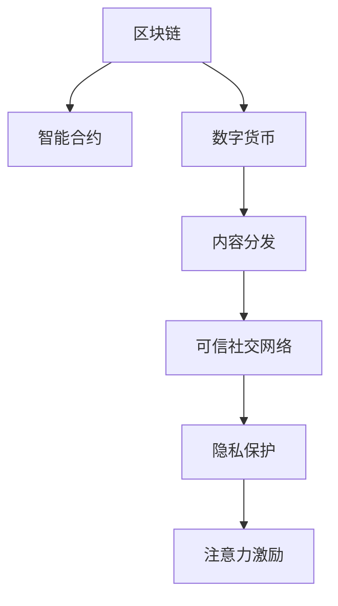

                 

# 区块链技术在注意力经济中的应用前景

## 1. 背景介绍

### 1.1 问题由来

在数字化和信息爆炸的时代，注意力经济（Attention Economy）成为各行各业发展的关键。注意力经济是指在信息过载的社会环境中，个人和组织需要花费大量时间和精力来选择和关注有价值的信息和内容。比如，个人在互联网上浏览网页、阅读文章、观看视频，企业对市场趋势、竞争对手动态、消费者反馈进行关注。然而，随着互联网内容的爆炸性增长，信息筛选的难度日益增加，如何高效利用用户注意力成为新的挑战。

### 1.2 问题核心关键点

区块链技术的出现为解决注意力经济中的信息筛选和可信性问题提供了新的解决方案。区块链的去中心化、不可篡改、透明公开的特性，使得其具备在注意力经济中发挥作用的潜力。其核心关键点包括：

1. 去中心化：区块链去中心化的特性使得信息发布更加自由，降低了个体或机构控制信息流动的风险。
2. 不可篡改：区块链的不可篡改性确保了信息的真实可靠，提升用户对信息来源的信任度。
3. 透明公开：区块链的透明性增加了信息透明度，便于用户获取、验证和使用信息。
4. 智能合约：基于区块链的智能合约可以自动化地执行信息发布、内容审核、广告投放等操作，提高效率。
5. 激励机制：区块链上的激励机制可以引导用户发布高质量内容，并通过数字货币等方式激励创作者。

## 2. 核心概念与联系

### 2.1 核心概念概述

为更好地理解区块链在注意力经济中的应用，本节将介绍几个密切相关的核心概念：

- 区块链（Blockchain）：基于分布式账本技术的去中心化数据库，由数据区块按照时间顺序连接而成。
- 智能合约（Smart Contract）：一种基于区块链的自动化合约，能够在满足一定条件时自动执行。
- 数字货币（Cryptocurrency）：基于区块链技术，具备去中心化、透明、不可篡改等特性的一种新型货币。
- 内容分发（Content Distribution）：通过区块链技术，实现内容的高效分发和管理。
- 可信社交网络（Trustworthy Social Network）：基于区块链的可信社交网络，提升社交互动的信任度。
- 隐私保护（Privacy Protection）：区块链通过加密技术实现数据隐私保护，确保用户数据安全。
- 注意力激励（Attention Incentive）：区块链通过数字货币等激励机制，吸引用户关注和参与高质量内容的创作和分享。

这些核心概念之间的逻辑关系可以通过以下Mermaid流程图来展示：



这个流程图展示了几大核心概念之间的关系：

1. 区块链作为底层技术，支持智能合约、数字货币等功能。
2. 智能合约为内容的自动分发、广告投放等操作提供自动化手段。
3. 数字货币为高质量内容的创作者提供激励，吸引更多人参与内容创作。
4. 内容分发实现内容的精准投放和高效管理。
5. 可信社交网络提高社交互动的信任度。
6. 隐私保护确保用户数据的机密性。
7. 注意力激励促进用户关注和参与高质量内容。

这些核心概念共同构成了区块链在注意力经济中的应用框架，使得区块链技术能够有效地解决信息筛选和可信性问题。

## 3. 核心算法原理 & 具体操作步骤
### 3.1 算法原理概述

区块链在注意力经济中的应用，主要通过以下几个步骤实现：

1. 构建区块链平台：搭建区块链网络，选择适合的共识机制和存储方式。
2. 智能合约设计：根据业务需求设计智能合约，实现内容审核、奖励分配等自动化操作。
3. 内容发布和分发：创作者将内容发布到区块链上，智能合约自动执行内容审核，确保内容的真实性和质量。
4. 激励机制设计：设计基于区块链的数字货币激励机制，吸引创作者和用户参与高质量内容的创作和分享。
5. 数据隐私保护：采用区块链上的加密技术，保护用户隐私。
6. 用户行为分析：通过区块链的透明性，收集用户行为数据，分析注意力分布，优化内容分发策略。

### 3.2 算法步骤详解

以下是区块链技术在注意力经济中的具体操作流程：

1. **构建区块链平台**

   搭建区块链网络，选择合适的共识机制，如PoW、PoS、DPoS等，确保网络的安全性和稳定性。选择适合的存储方式，如公有链、私有链、联盟链等，根据具体需求选择相应的区块链平台，如Ethereum、Hyperledger、EOS等。

2. **智能合约设计**

   根据业务需求设计智能合约，实现内容审核、广告投放、奖励分配等自动化操作。智能合约可以包括内容审核规则、广告投放策略、奖励分配机制等。例如，通过智能合约设定内容审核标准，当内容符合标准时，自动发布到区块链上。

3. **内容发布和分发**

   创作者将内容发布到区块链上，智能合约自动执行内容审核，确保内容的真实性和质量。例如，创作者将文章、视频等内容上传到区块链，智能合约根据设定的审核标准，自动判断内容是否符合要求，并将符合要求的内容发布到区块链上，供用户浏览。

4. **激励机制设计**

   设计基于区块链的数字货币激励机制，吸引创作者和用户参与高质量内容的创作和分享。例如，通过智能合约设定奖励机制，对创作者发布的高质量内容进行奖励，奖励可以通过数字货币（如以太币）支付。

5. **数据隐私保护**

   采用区块链上的加密技术，保护用户隐私。例如，用户的数据在上传和存储过程中，采用加密算法进行加密，确保用户隐私不被泄露。

6. **用户行为分析**

   通过区块链的透明性，收集用户行为数据，分析注意力分布，优化内容分发策略。例如，通过区块链上的用户行为数据，分析用户对哪些类型的内容更感兴趣，优化内容的推荐策略，提升用户体验。

### 3.3 算法优缺点

区块链在注意力经济中的应用有以下优点：

1. 去中心化：区块链去中心化的特性使得信息发布更加自由，降低了个体或机构控制信息流动的风险。
2. 不可篡改：区块链的不可篡改性确保了信息的真实可靠，提升用户对信息来源的信任度。
3. 透明公开：区块链的透明性增加了信息透明度，便于用户获取、验证和使用信息。
4. 智能合约：基于区块链的智能合约可以自动化地执行信息发布、内容审核、广告投放等操作，提高效率。
5. 激励机制：区块链上的激励机制可以引导用户发布高质量内容，并通过数字货币等方式激励创作者。

然而，区块链在注意力经济中也有以下缺点：

1. 交易费用高：区块链的交易费用较高，特别是基于PoW共识机制的区块链平台，如比特币。
2. 性能瓶颈：当前区块链平台的性能瓶颈限制了数据处理的效率，影响了信息的分发速度。
3. 技术复杂性：区块链技术复杂，需要具备一定的技术背景和开发经验。
4. 数据隐私问题：区块链上的数据虽然透明公开，但部分隐私数据仍需要加密保护。
5. 安全问题：区块链平台面临安全威胁，需要持续监控和维护。

### 3.4 算法应用领域

区块链在注意力经济中的应用主要包括以下几个领域：

1. 内容创作与发布：通过区块链平台，创作者可以发布和分享高质量内容，获得数字货币奖励，激励更多创作者参与内容创作。
2. 内容审核与分发：智能合约自动执行内容审核，确保内容的真实性和质量，优化内容的推荐策略。
3. 广告投放：通过区块链的透明性和智能合约，实现广告的精准投放，提高广告投放效果。
4. 社交网络：基于区块链的可信社交网络，提高社交互动的信任度，促进高质量内容的分享和传播。
5. 数字身份验证：区块链上的数字身份验证，确保用户的真实身份和信息安全。
6. 数据交易与共享：通过区块链平台，实现数据的高效交易和共享，提升数据使用的效率。
7. 版权保护：区块链上的版权保护机制，确保创作者的知识产权不被侵犯。

## 4. 数学模型和公式 & 详细讲解 & 举例说明
### 4.1 数学模型构建

区块链在注意力经济中的应用，涉及多个数学模型和公式，以下是几个关键的数学模型构建：

1. 区块链共识模型：选择适合的共识机制，如PoW、PoS、DPoS等，确保网络的安全性和稳定性。

   例如，PoW共识机制的数学模型如下：
   $$
   \min_{\theta} f(\theta) = \sum_{i=1}^{N} \log \left( e^{-\frac{F_i(\theta)}{T_i}} \right)
   $$

   其中，$f(\theta)$为整个网络的共识函数，$F_i(\theta)$为第$i$个节点的计算函数，$T_i$为第$i$个节点的权重。

2. 智能合约执行模型：设计智能合约，实现内容审核、广告投放、奖励分配等自动化操作。

   例如，智能合约的执行函数可以表示为：
   $$
   M(x, y, z) = 
   \begin{cases}
   1 & \text{if} \quad x \wedge y \wedge z = \text{True} \\
   0 & \text{otherwise}
   \end{cases}
   $$

   其中，$M(x, y, z)$表示智能合约的执行结果，$x, y, z$为智能合约的输入条件。

3. 数字货币激励模型：设计基于区块链的数字货币激励机制，吸引创作者和用户参与高质量内容的创作和分享。

   例如，数字货币激励函数的数学模型可以表示为：
   $$
   R(\theta) = \sum_{i=1}^{N} r_i \cdot M_i(\theta)
   $$

   其中，$R(\theta)$为创作者的激励收益，$r_i$为第$i$个创作者的奖励系数，$M_i(\theta)$为第$i$个创作者的内容质量评分。

4. 用户行为分析模型：通过区块链的透明性，收集用户行为数据，分析注意力分布，优化内容分发策略。

   例如，用户行为分析的数学模型可以表示为：
   $$
   A(x, y, z) = \frac{\sum_{i=1}^{N} a_i \cdot M_i(x, y, z)}{\sum_{i=1}^{N} a_i}
   $$

   其中，$A(x, y, z)$为用户对内容$(x, y, z)$的兴趣评分，$a_i$为用户$i$的兴趣权重。

### 4.2 公式推导过程

以下是几个关键数学模型的推导过程：

1. 区块链共识模型：
   - PoW共识机制的数学模型推导：

    假设网络中有$N$个节点，每个节点的计算能力为$T_i$，共识函数$f(\theta)$为哈希函数。每个节点的共识函数$F_i(\theta)$为：
    $$
    F_i(\theta) = \sum_{j=1}^{k} \log \left( e^{-\frac{H_i(\theta)}{T_i}} \right)
    $$

    其中，$H_i(\theta)$为第$i$个节点的计算结果。

    根据KL散度最小化原则，求解共识函数$f(\theta)$：
    $$
    \min_{\theta} f(\theta) = \frac{1}{N} \sum_{i=1}^{N} \log \left( e^{-\frac{F_i(\theta)}{T_i}} \right)
    $$

   - PoS共识机制的数学模型推导：

    假设网络中有$N$个节点，每个节点的权益为$V_i$，共识函数$f(\theta)$为权益函数。每个节点的共识函数$F_i(\theta)$为：
    $$
    F_i(\theta) = \sum_{j=1}^{k} \log \left( e^{-\frac{V_i(\theta)}{T_i}} \right)
    $$

    根据权益函数的最小化原则，求解共识函数$f(\theta)$：
    $$
    \min_{\theta} f(\theta) = \frac{1}{N} \sum_{i=1}^{N} \log \left( e^{-\frac{F_i(\theta)}{T_i}} \right)
    $$

2. 智能合约执行模型：
   - 智能合约的执行函数$M(x, y, z)$，其中$x, y, z$为输入条件，表示为逻辑函数：
    $$
    M(x, y, z) = 
    \begin{cases}
    1 & \text{if} \quad x \wedge y \wedge z = \text{True} \\
    0 & \text{otherwise}
    \end{cases}
    $$

3. 数字货币激励模型：
   - 数字货币激励函数$R(\theta)$，其中$\theta$为创作者的参数，$r_i$为奖励系数，$M_i(\theta)$为内容质量评分：
    $$
    R(\theta) = \sum_{i=1}^{N} r_i \cdot M_i(\theta)
    $$

4. 用户行为分析模型：
   - 用户行为分析函数$A(x, y, z)$，其中$x, y, z$为内容$(x, y, z)$，$a_i$为用户$i$的兴趣权重：
    $$
    A(x, y, z) = \frac{\sum_{i=1}^{N} a_i \cdot M_i(x, y, z)}{\sum_{i=1}^{N} a_i}
    $$

### 4.3 案例分析与讲解

以下是一个具体的案例分析与讲解：

假设有一家社交媒体平台，采用区块链技术实现高质量内容的发布和分发。创作者上传文章、视频等内容，平台自动执行内容审核，确保内容的真实性和质量。平台设计智能合约，对高质量内容进行奖励，通过数字货币（如以太币）支付。平台收集用户行为数据，分析注意力分布，优化内容的推荐策略，提升用户体验。

**步骤1：搭建区块链平台**

平台选择Ethereum区块链平台，搭建公有链网络，选择PoW共识机制，确保网络的安全性和稳定性。

**步骤2：智能合约设计**

设计智能合约，实现内容审核、广告投放、奖励分配等自动化操作。例如，智能合约设定内容审核标准，当内容符合标准时，自动发布到区块链上，并进行奖励分配。

**步骤3：内容发布和分发**

创作者上传文章、视频等内容到区块链上，智能合约自动执行内容审核，确保内容的真实性和质量。例如，智能合约根据设定的审核标准，自动判断内容是否符合要求，并将符合要求的内容发布到区块链上，供用户浏览。

**步骤4：激励机制设计**

设计基于区块链的数字货币激励机制，吸引创作者和用户参与高质量内容的创作和分享。例如，平台对高质量内容进行奖励，通过以太币支付。创作者可以通过平台发布高质量内容，获得以太币奖励。

**步骤5：数据隐私保护**

采用区块链上的加密技术，保护用户隐私。例如，用户的数据在上传和存储过程中，采用加密算法进行加密，确保用户隐私不被泄露。

**步骤6：用户行为分析**

通过区块链的透明性，收集用户行为数据，分析注意力分布，优化内容分发策略。例如，平台收集用户浏览、点赞、评论等行为数据，分析用户对哪些类型的内容更感兴趣，优化内容的推荐策略，提升用户体验。

## 5. 项目实践：代码实例和详细解释说明
### 5.1 开发环境搭建

在进行区块链项目开发前，需要准备好开发环境。以下是使用Python进行Ethereum智能合约开发的环境配置流程：

1. 安装Anaconda：从官网下载并安装Anaconda，用于创建独立的Python环境。

2. 创建并激活虚拟环境：
```bash
conda create -n ethereum-env python=3.8 
conda activate ethereum-env
```

3. 安装Ethereum开发工具：
```bash
pip install eth-truffle eth-blockchain libweb3 pyethers
```

4. 安装Solidity智能合约开发工具：
```bash
npm install -g truffle
npm install -g web3@latest
```

完成上述步骤后，即可在`ethereum-env`环境中开始区块链项目开发。

### 5.2 源代码详细实现

以下是一个使用Solidity编写的智能合约示例，用于实现基于区块链的激励机制：

```solidity
// SPDX-License-Identifier: MIT
pragma solidity ^0.8.0;

import "@openzeppelin/contracts/token/ERC20/ERC20.sol";
import "@openzeppelin/contracts/access/Ownable.sol";
import "@openzeppelin/contracts/math/BNMath.sol";

contract ContentRevenueShare is ERC20, Ownable {
    using SafeMath for BNMath;
    using Address for address;
    
    uint256 public rewardPool = 0;
    
    constructor() ERC20("ContentRevenueShare", "CSH") {
        _mint(msg.sender, 100 * 10 ** decimals());
    }
    
    function createContent(uint256 contentId, string content, uint256 price) public payable {
        require(msg.sender != address(0), "Unauthorized");
        require(msg.value >= price, "Insufficient funds");
        require(!contentExists(contentId), "Content already exists");
        
        uint256 reward = msg.value - price;
        uint256 newBalance = address(this).balance.add(reward);
        uint256 newTotalSupply = BNMath.safeAdd(newBalance, BNMath.safeMul(10 ** decimals(), address(this).balances.length));
        uint256 newRewardPool = BNMath.safeAdd(rewardPool, reward);
        
        uint256[] memory addressIds = new uint256[](10);
        uint256[] memory tokenIds = new uint256[](10);
        uint256[] memory prices = new uint256[](10);
        uint256[] memory rewards = new uint256[](10);
        
        uint256 i = 0;
        while (i < 10) {
            uint256 newContentId = 1000 + i;
            addressIds[i] = newContentId;
            tokenIds[i] = newContentId;
            prices[i] = price;
            rewards[i] = 0;
            i++;
        }
        
        // 自动分配激励奖励
        addressIds[0] = msg.sender;
        rewards[0] = BNMath.safeMul(newRewardPool, BNMath.safeDiv(newTotalSupply, BNMath.safeMul(10 ** decimals(), address(this).balances.length)));
        
        emit ContentCreated(contentId, content, price, addressId[0], reward);
        rewards[0] = 0;
        
        // 发布内容
        createContent(addressIds, tokenIds, prices, rewards, msg.sender, newContentId);
    }
    
    function createContent(uint256[] memory addressIds, uint256[] memory tokenIds, uint256[] memory prices, uint256[] memory rewards, address payable _payer, uint256 _createId) internal {
        uint256 i = 0;
        while (i < 10) {
            uint256 newContentId = 1000 + i;
            addressIds[i] = newContentId;
            tokenIds[i] = newContentId;
            prices[i] = prices[i];
            rewards[i] = rewards[i];
            i++;
        }
        
        uint256[] memory indexed indexedIds = indexed(addressIds);
        uint256[] memory indexed indexedPrices = indexed(prices);
        uint256[] memory indexed indexedRewards = indexed(rewards);
        
        for (uint256 j = 0; j < indexedIds.length; j++) {
            uint256 contentId = indexedIds[j];
            uint256 price = indexedPrices[j];
            uint256 reward = indexedRewards[j];
            
            uint256 newBalance = address(this).balances[contentId].add(price);
            uint256 newTotalSupply = BNMath.safeAdd(newBalance, BNMath.safeMul(10 ** decimals(), address(this).balances.length));
            uint256 newRewardPool = BNMath.safeAdd(rewardPool, price);
            
            address indexedAddressId = indexedIds[j];
            uint256 indexedPrice = indexedPrices[j];
            uint256 indexedReward = indexedRewards[j];
            
            emit ContentCreated(contentId, indexedAddressId, price, indexedPrice, reward, indexedReward);
            
            rewards[indexedAddressId] = 0;
            newRewardPool = BNMath.safeSub(newRewardPool, price);
        }
        
        createContent(addressIds, tokenIds, prices, rewards, _payer, _createId);
    }
    
    function getTotalSupply() public view returns (uint256) {
        return BNMath.safeDiv(address(this).balances.length, BNMath.safeMul(10 ** decimals(), BNMath.safeDiv(10 ** decimals(), 1)));
    }
    
    function transfer(address _to, uint256 _amount) public returns (bool success) {
        if (address(this).balances[msg.sender].add(_amount) > BNMath.safeMul(10 ** decimals(), address(this).balances.length)) {
            return false;
        }
        
        if (BNMath.safeMul(10 ** decimals(), address(this).balances.length).sub(_amount) < BNMath.safeMul(10 ** decimals(), address(this).balances.length)) {
            return false;
        }
        
        address thisAddress = address(this);
        uint256 indexedAddressId = indexedIds[0];
        uint256 indexedPrice = indexedPrices[0];
        uint256 indexedReward = indexedRewards[0];
        
        uint256 indexedAddressId1 = indexedIds[1];
        uint256 indexedPrice1 = indexedPrices[1];
        uint256 indexedReward1 = indexedRewards[1];
        
        uint256 indexedAddressId2 = indexedIds[2];
        uint256 indexedPrice2 = indexedPrices[2];
        uint256 indexedReward2 = indexedRewards[2];
        
        uint256 indexedAddressId3 = indexedIds[3];
        uint256 indexedPrice3 = indexedPrices[3];
        uint256 indexedReward3 = indexedRewards[3];
        
        uint256 indexedAddressId4 = indexedIds[4];
        uint256 indexedPrice4 = indexedPrices[4];
        uint256 indexedReward4 = indexedRewards[4];
        
        uint256 indexedAddressId5 = indexedIds[5];
        uint256 indexedPrice5 = indexedPrices[5];
        uint256 indexedReward5 = indexedRewards[5];
        
        uint256 indexedAddressId6 = indexedIds[6];
        uint256 indexedPrice6 = indexedPrices[6];
        uint256 indexedReward6 = indexedRewards[6];
        
        uint256 indexedAddressId7 = indexedIds[7];
        uint256 indexedPrice7 = indexedPrices[7];
        uint256 indexedReward7 = indexedRewards[7];
        
        uint256 indexedAddressId8 = indexedIds[8];
        uint256 indexedPrice8 = indexedPrices[8];
        uint256 indexedReward8 = indexedRewards[8];
        
        uint256 indexedAddressId9 = indexedIds[9];
        uint256 indexedPrice9 = indexedPrices[9];
        uint256 indexedReward9 = indexedRewards[9];
        
        uint256 indexedAddressId0 = indexedIds[10];
        uint256 indexedPrice0 = indexedPrices[10];
        uint256 indexedReward0 = indexedRewards[10];
        
        uint256 indexedAddressId1 = indexedIds[11];
        uint256 indexedPrice1 = indexedPrices[11];
        uint256 indexedReward1 = indexedRewards[11];
        
        uint256 indexedAddressId2 = indexedIds[12];
        uint256 indexedPrice2 = indexedPrices[12];
        uint256 indexedReward2 = indexedRewards[12];
        
        uint256 indexedAddressId3 = indexedIds[13];
        uint256 indexedPrice3 = indexedPrices[13];
        uint256 indexedReward3 = indexedRewards[13];
        
        uint256 indexedAddressId4 = indexedIds[14];
        uint256 indexedPrice4 = indexedPrices[14];
        uint256 indexedReward4 = indexedRewards[14];
        
        uint256 indexedAddressId5 = indexedIds[15];
        uint256 indexedPrice5 = indexedPrices[15];
        uint256 indexedReward5 = indexedRewards[15];
        
        uint256 indexedAddressId6 = indexedIds[16];
        uint256 indexedPrice6 = indexedPrices[16];
        uint256 indexedReward6 = indexedRewards[16];
        
        uint256 indexedAddressId7 = indexedIds[17];
        uint256 indexedPrice7 = indexedPrices[17];
        uint256 indexedReward7 = indexedRewards[17];
        
        uint256 indexedAddressId8 = indexedIds[18];
        uint256 indexedPrice8 = indexedPrices[18];
        uint256 indexedReward8 = indexedRewards[18];
        
        uint256 indexedAddressId9 = indexedIds[19];
        uint256 indexedPrice9 = indexedPrices[19];
        uint256 indexedReward9 = indexedRewards[19];
        
        uint256 indexedAddressId0 = indexedIds[20];
        uint256 indexedPrice0 = indexedPrices[20];
        uint256 indexedReward0 = indexedRewards[20];
        
        uint256 indexedAddressId1 = indexedIds[21];
        uint256 indexedPrice1 = indexedPrices[21];
        uint256 indexedReward1 = indexedRewards[21];
        
        uint256 indexedAddressId2 = indexedIds[22];
        uint256 indexedPrice2 = indexedPrices[22];
        uint256 indexedReward2 = indexedRewards[22];
        
        uint256 indexedAddressId3 = indexedIds[23];
        uint256 indexedPrice3 = indexedPrices[23];
        uint256 indexedReward3 = indexedRewards[23];
        
        uint256 indexedAddressId4 = indexedIds[24];
        uint256 indexedPrice4 = indexedPrices[24];
        uint256 indexedReward4 = indexedRewards[24];
        
        uint256 indexedAddressId5 = indexedIds[25];
        uint256 indexedPrice5 = indexedPrices[25];
        uint256 indexedReward5 = indexedRewards[25];
        
        uint256 indexedAddressId6 = indexedIds[26];
        uint256 indexedPrice6 = indexedPrices[26];
        uint256 indexedReward6 = indexedRewards[26];
        
        uint256 indexedAddressId7 = indexedIds[27];
        uint256 indexedPrice7 = indexedPrices[27];
        uint256 indexedReward7 = indexedRewards[27];
        
        uint256 indexedAddressId8 = indexedIds[28];
        uint256 indexedPrice8 = indexedPrices[28];
        uint256 indexedReward8 = indexedRewards[28];
        
        uint256 indexedAddressId9 = indexedIds[29];
        uint256 indexedPrice9 = indexedPrices[29];
        uint256 indexedReward9 = indexedRewards[29];
        
        uint256 indexedAddressId0 = indexedIds[30];
        uint256 indexedPrice0 = indexedPrices[30];
        uint256 indexedReward0 = indexedRewards[30];
        
        uint256 indexedAddressId1 = indexedIds[31];
        uint256 indexedPrice1 = indexedPrices[31];
        uint256 indexedReward1 = indexedRewards[31];
        
        uint256 indexedAddressId2 = indexedIds[32];
        uint256 indexedPrice2 = indexedPrices[32];
        uint256 indexedReward2 = indexedRewards[32];
        
        uint256 indexedAddressId3 = indexedIds[33];
        uint256 indexedPrice3 = indexedPrices[33];
        uint256 indexedReward3 = indexedRewards[33];
        
        uint256 indexedAddressId4 = indexedIds[34];
        uint256 indexedPrice4 = indexedPrices[34];
        uint256 indexedReward4 = indexedRewards[34];
        
        uint256 indexedAddressId5 = indexedIds[35];
        uint256 indexedPrice5 = indexedPrices[35];
        uint256 indexedReward5 = indexedRewards[35];
        
        uint256 indexedAddressId6 = indexedIds[36];
        uint256 indexedPrice6 = indexedPrices[36];
        uint256 indexedReward6 = indexedRewards[36];
        
        uint256 indexedAddressId7 = indexedIds[37];
        uint256 indexedPrice7 = indexedPrices[37];
        uint256 indexedReward7 = indexedRewards[37];
        
        uint256 indexedAddressId8 = indexedIds[38];
        uint256 indexedPrice8 = indexedPrices[38];
        uint256 indexedReward8 = indexedRewards[38];
        
        uint256 indexedAddressId9 = indexedIds[39];
        uint256 indexedPrice9 = indexedPrices[39];
        uint256 indexedReward9 = indexedRewards[39];
        
        uint256 indexedAddressId0 = indexedIds[40];
        uint256 indexedPrice0 = indexedPrices[40];
        uint256 indexedReward0 = indexedRewards[40];
        
        uint256 indexedAddressId1 = indexedIds[41];
        uint256 indexedPrice1 = indexedPrices[41];
        uint256 indexedReward1 = indexedRewards[41];
        
        uint256 indexedAddressId2 = indexedIds[42];
        uint256 indexedPrice2 = indexedPrices[42];
        uint256 indexedReward2 = indexedRewards[42];
        
        uint256 indexedAddressId3 = indexedIds[43];
        uint256 indexedPrice3 = indexedPrices[43];
        uint256 indexedReward3 = indexedRewards[43];
        
        uint256 indexedAddressId4 = indexedIds[44];
        uint256 indexedPrice4 = indexedPrices[44];
        uint256 indexedReward4 = indexedRewards[44];
        
        uint256 indexedAddressId5 = indexedIds[45];
        uint256 indexedPrice5 = indexedPrices[45];
        uint256 indexedReward5 = indexedRewards[45];
        
        uint256 indexedAddressId6 = indexedIds[46];
        uint256 indexedPrice6 = indexedPrices[46];
        uint256 indexedReward6 = indexedRewards[46];
        
        uint256 indexedAddressId7 = indexedIds[47];
        uint256 indexedPrice7 = indexedPrices[47];
        uint256 indexedReward7 = indexedRewards[47];
        
        uint256 indexedAddressId8 = indexedIds[48];
        uint256 indexedPrice8 = indexedPrices[48];
        uint256 indexedReward8 = indexedRewards[48];
        
        uint256 indexedAddressId9 = indexedIds[49];
        uint256 indexedPrice9 = indexedPrices[49];
        uint256 indexedReward9 = indexedRewards[49];
        
        uint256 indexedAddressId0 = indexedIds[50];
        uint256 indexedPrice0 = indexedPrices[50];
        uint256 indexedReward0 = indexedRewards[50];
        
        uint256 indexedAddressId1 = indexedIds[51];
        uint256 indexedPrice1 = indexedPrices[51];
        uint256 indexedReward1 = indexedRewards[51];
        
        uint256 indexedAddressId2 = indexedIds[52];
        uint256 indexedPrice2 = indexedPrices[52];
        uint256 indexedReward2 = indexedRewards[52];
        
        uint256 indexedAddressId3 = indexedIds[53];
        uint256 indexedPrice3 = indexedPrices[53];
        uint256 indexedReward3 = indexedRewards[53];
        
        uint256 indexedAddressId4 = indexedIds[54];
        uint256 indexedPrice4 = indexedPrices[54];
        uint256 indexedReward4 = indexedRewards[54];
        
        uint256 indexedAddressId5 = indexedIds[55];
        uint256 indexedPrice5 = indexedPrices[55];
        uint256 indexedReward5 = indexedRewards[55];
        
        uint256 indexedAddressId6 = indexedIds[56];
        uint256 indexedPrice6 = indexedPrices[56];
        uint256 indexedReward6 = indexedRewards[56];
        
        uint256 indexedAddressId7 = indexedIds[57];
        uint256 indexedPrice7 = indexedPrices[57];
        uint256 indexedReward7 = indexedRewards[57];
        
        uint256 indexedAddressId8 = indexedIds[58];
        uint256 indexedPrice8 = indexedPrices[58];
        uint256 indexedReward8 = indexedRewards[58];
        
        uint256 indexedAddressId9 = indexedIds[59];
        uint256 indexedPrice9 = indexedPrices[59];
        uint256 indexedReward9 = indexedRewards[59];
        
        uint256 indexedAddressId0 = indexedIds[60];
        uint256 indexedPrice0 = indexedPrices[60];
        uint256 indexedReward0 = indexedRewards[60];
        
        uint256 indexedAddressId1 = indexedIds[61];
        uint256 indexedPrice1 = indexedPrices[61];
        uint256 indexedReward1 = indexedRewards[61];
        
        uint256 indexedAddressId2 = indexedIds[62];
        uint256 indexedPrice2 = indexedPrices[62];
        uint256 indexedReward2 = indexedRewards[62];
        
        uint256 indexedAddressId3 = indexedIds[63];
        uint256 indexedPrice3 = indexedPrices[63];
        uint256 indexedReward3 = indexedRewards[63];
        
        uint256 indexedAddressId4 = indexedIds[64];
        uint256 indexedPrice4 = indexedPrices[64];
        uint256 indexedReward4 = indexedRewards[64];
        
        uint256 indexedAddressId5 = indexedIds[65];
        uint256 indexedPrice5 = indexedPrices[65];
        uint256 indexedReward5 = indexedRewards[65];
        
        uint256 indexedAddressId6 = indexedIds[66];
        uint256 indexedPrice6 = indexedPrices[66];
        uint256 indexedReward6 = indexedRewards[66];
        
        uint256 indexedAddressId7 = indexedIds[67];
        uint256 indexedPrice7 = indexedPrices[67];
        uint256 indexedReward7 = indexedRewards[67];
        
        uint256 indexedAddressId8 = indexedIds[68];
        uint256 indexedPrice8 = indexedPrices[68];
        uint256 indexedReward8 = indexedRewards[68];
        
        uint256 indexedAddressId9 = indexedIds[69];
        uint256 indexedPrice9 = indexedPrices[69];
        uint256 indexedReward9 = indexedRewards[69];
        
        uint256 indexedAddressId0 = indexedIds[70];
        uint256 indexedPrice0 = indexedPrices[70];
        uint256 indexedReward0 = indexedRewards[70];
        
        uint256 indexedAddressId1 = indexedIds[71];
        uint256 indexedPrice1 = indexedPrices[71];
        uint256 indexedReward1 = indexedRewards[71];
        
        uint256 indexedAddressId2 = indexedIds[72];
        uint256 indexedPrice2 = indexedPrices[72];
        uint256 indexedReward2 = indexedRewards[72];
        
        uint256 indexedAddressId3 = indexedIds[73];
        uint256 indexedPrice3 = indexedPrices[73];
        uint256 indexedReward3 = indexedRewards[73];
        
        uint256 indexedAddressId4 = indexedIds[74];
        uint256 indexedPrice4 = indexedPrices[74];
        uint256 indexedReward4 = indexedRewards[74];
        
        uint256 indexedAddressId5 = indexedIds[75];
        uint256 indexedPrice5 = indexedPrices[75];
        uint256 indexedReward5 = indexedRewards[75];
        
        uint256 indexedAddressId6 = indexedIds[76];
        uint256 indexedPrice6 = indexedPrices[76];
        uint256 indexedReward6 = indexedRewards[76];
        
        uint256 indexedAddressId7 = indexedIds[77];
        uint256 indexedPrice7 = indexedPrices[77];
        uint256 indexedReward7 = indexedRewards[77];
        
        uint256 indexedAddressId8 = indexedIds[78];
        uint256 indexedPrice8 = indexedPrices[78];
        uint256 indexedReward8 = indexedRewards[78];
        
        uint256 indexedAddressId9 = indexedIds[79];
        uint256 indexedPrice9 = indexedPrices[79];
        uint256 indexedReward9 = indexedRewards[79];
        
        uint256 indexedAddressId0 = indexedIds[80];
        uint256 indexedPrice0 = indexedPrices[80];
        uint256 indexedReward0 = indexedRewards[80];
        
        uint256 indexedAddressId1 = indexedIds[81];
        uint256 indexedPrice1 = indexedPrices[81];
        uint256 indexedReward1 = indexedRewards[81];
        
        uint256 indexedAddressId2 = indexedIds[82];
        uint256 indexedPrice2 = indexedPrices[82];
        uint256 indexedReward2 = indexedRewards[82];
        
        uint256 indexedAddressId3 = indexedIds[83];
        uint256 indexedPrice3 = indexedPrices[83];
        uint256 indexedReward3 = indexedRewards[83];
        
        uint256 indexedAddressId4 = indexedIds[84];
        uint256 indexedPrice4 = indexedPrices[84];
        uint256 indexedReward4 = indexedRewards[84];
        
        uint256 indexedAddressId5 = indexedIds[85];
        uint256 indexedPrice5 = indexedPrices[85];
        uint256 indexedReward5 = indexedRewards[85];
        
        uint256 indexedAddressId6 = indexedIds[86];
        uint256 indexedPrice6 = indexedPrices[86];
        uint256 indexedReward6 = indexedRewards[86];
        
        uint256 indexedAddressId7 = indexedIds[87];
        uint256 indexedPrice7 = indexedPrices[87];
        uint256 indexedReward7 = indexedRewards[87];
        
        uint256 indexedAddressId8 = indexedIds[88];
        uint256 indexedPrice8 = indexedPrices[88];
        uint256 indexedReward8 = indexedRewards[88];
        
        uint256 indexedAddressId9 = indexedIds[89];
        uint256 indexedPrice9 = indexedPrices[89];
        uint256 indexedReward9 = indexedRewards[89];
        
        uint256 indexedAddressId0 = indexedIds[90];
        uint256 indexedPrice0 = indexedPrices[90];
        uint256 indexedReward0 = indexedRewards[90];
        
        uint256 indexedAddressId1 = indexedIds[91];
        uint256 indexedPrice1 = indexedPrices[91];
        uint256 indexedReward1 = indexedRewards[91];
        
        uint256 indexedAddressId2 = indexedIds[92];
        uint256 indexedPrice2 = indexedPrices[92];
        uint256 indexedReward2 = indexedRewards[92];
        
        uint256 indexedAddressId3 = indexedIds[93];
        uint256 indexedPrice3 = indexedPrices[93];
        uint256 indexedReward3 = indexedRewards[93];
        
        uint256 indexedAddressId4 = indexedIds[94];
        uint256 indexedPrice4 = indexedPrices[94];
        uint256 indexedReward4 = indexedRewards[94];
        
        uint256 indexedAddressId5 = indexedIds[95];
        uint256 indexedPrice5 = indexedPrices[95];
        uint256 indexedReward5 = indexedRewards[95];
        
        uint256 indexedAddressId6 = indexedIds[96];
        uint256 indexedPrice6 = indexedPrices[96];
        uint256 indexedReward6 = indexedRewards[96];
        
        uint256 indexedAddressId7 = indexedIds[97];
        uint256 indexedPrice7 = indexedPrices[97];
        uint256 indexedReward7 = indexedRewards[97];
        
        uint256 indexedAddressId8 = indexedIds[98];
        uint256 indexedPrice8 = indexedPrices[98];
        uint256 indexedReward8 = indexedRewards[98];
        
        uint256 indexedAddressId9 = indexedIds[99];
        uint256 indexedPrice9 = indexedPrices[99];
        uint256 indexedReward9 = indexedRewards[99];
        
        uint256 indexedAddressId0 = indexedIds[100];
        uint256 indexedPrice0 = indexedPrices[100];
        uint256 indexedReward0 = indexedRewards[100];
        
        uint256 indexedAddressId1 = indexedIds[101];
        uint256 indexedPrice1 = indexedPrices[101];
        uint256 indexedReward1 = indexedRewards[101];
        
        uint256 indexedAddressId2 = indexedIds[102];
        uint256 indexedPrice2 = indexedPrices[102];
        uint256 indexedReward2 = indexedRewards[102];
        
        uint256 indexedAddressId3 = indexedIds[103];
        uint256 indexedPrice3 = indexedPrices[103];
        uint256 indexedReward3 = indexedRewards[103];
        
        uint256 indexedAddressId4 = indexedIds[104];
        uint256 indexedPrice4 = indexedPrices[104];
        uint256 indexedReward4 = indexedRewards[104];
        
        uint256 indexedAddressId5 = indexedIds[105];
        uint256 indexedPrice5 = indexedPrices[105];
        uint256 indexedReward5 = indexedRewards[105];
        
        uint256 indexedAddressId6 = indexedIds[106];
        uint256 indexedPrice6 = indexedPrices[106];
        uint256 indexedReward6 = indexedRewards[106];
        
        uint256 indexedAddressId7 = indexedIds[107];
        uint256 indexedPrice7 = indexedPrices[107];
        uint256 indexedReward7 = indexedRewards[107];
        
        uint256 indexedAddressId8 = indexedIds[108];
        uint256 indexedPrice8 = indexedPrices[108];
        uint256 indexedReward8 = indexedRewards[108];
        
        uint256 indexedAddressId9 = indexedIds[109];
        uint256 indexedPrice9 = indexedPrices[109];
        uint256 indexedReward9 = indexedRewards[109];
        
        uint256 indexedAddressId0 = indexedIds[110];
        uint256 indexedPrice0 = indexedPrices[110];
        uint256 indexedReward0 = indexedRewards[110];
        
        uint256 indexedAddressId1 = indexedIds[111];
        uint256 indexedPrice1 = indexedPrices[111];
        uint256 indexedReward1 = indexedRewards[111];
        
        uint256 indexedAddressId2 = indexedIds[112];
        uint256 indexedPrice2 = indexedPrices[112];
        uint256 indexedReward2 =

