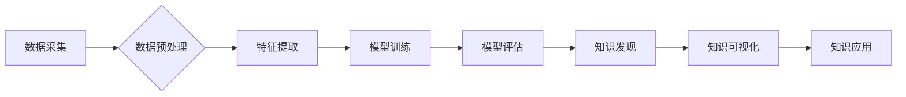

                 

## 知识发现引擎的容器化部署方案

> 关键词：知识发现引擎、容器化部署、微服务架构、Docker、Kubernetes、DevOps

## 1. 背景介绍

随着数据量的爆炸式增长，从海量数据中挖掘有价值的知识已成为各行各业的关键挑战。知识发现引擎 (Knowledge Discovery Engine, KDE) 应运而生，它利用机器学习、数据挖掘等技术，从海量数据中识别模式、趋势和关联性，为决策支持、业务优化等提供数据驱动的洞察。

传统的KDE部署方式通常依赖于单体架构，这导致部署复杂、维护成本高、扩展性差等问题。随着微服务架构的兴起，容器化技术逐渐成为KDE部署的最佳实践。容器化技术能够将应用程序及其依赖项打包成独立的容器，简化部署、提高可移植性和弹性。

## 2. 核心概念与联系

### 2.1  容器化部署

容器化部署是一种软件部署方式，将应用程序及其依赖项打包成独立的容器，容器可以像软件包一样在不同的环境中运行。容器技术的主要优势包括：

* **轻量化:** 容器比虚拟机更轻量级，启动速度更快，资源占用更少。
* **隔离性:** 每个容器都是独立的，不会相互影响，提高了系统的稳定性和安全性。
* **可移植性:** 容器可以跨平台运行，方便部署和迁移。

### 2.2  微服务架构

微服务架构是一种将大型应用程序分解成多个小型、独立的服务的架构模式。每个微服务负责特定的业务功能，并通过轻量级的通信协议（如RESTful API）进行交互。微服务架构的优势包括：

* **松耦合:** 微服务之间相互独立，降低了系统间的依赖关系，提高了系统的可维护性和扩展性。
* **独立部署:** 微服务可以独立部署和更新，提高了开发和运维效率。
* **技术多样性:** 微服务可以采用不同的技术栈，满足不同业务需求。

### 2.3  KDE容器化部署方案

将KDE部署为容器化微服务架构，可以充分利用容器化技术的优势，实现KDE的灵活、可扩展、可维护部署。

**Mermaid 流程图:**



## 3. 核心算法原理 & 具体操作步骤

### 3.1  算法原理概述

KDE的核心算法包括数据预处理、特征提取、模型训练、模型评估和知识发现等步骤。

* **数据预处理:** 对原始数据进行清洗、转换、整合等操作，使其适合模型训练。
* **特征提取:** 从原始数据中提取有价值的特征，用于模型训练和知识发现。
* **模型训练:** 利用机器学习算法，训练模型以识别数据中的模式和关联性。
* **模型评估:** 对训练好的模型进行评估，验证其性能和准确性。
* **知识发现:** 利用训练好的模型，从数据中挖掘出有价值的知识，并将其可视化和呈现。

### 3.2  算法步骤详解

1. **数据采集:** 从各种数据源收集相关数据，例如数据库、文件、API等。
2. **数据清洗:** 删除重复数据、缺失值、错误数据等，确保数据质量。
3. **数据转换:** 将数据转换为模型可处理的格式，例如数值化、编码等。
4. **特征工程:** 选择或提取数据中的关键特征，用于模型训练。
5. **模型选择:** 根据数据特点和业务需求，选择合适的机器学习算法，例如决策树、支持向量机、神经网络等。
6. **模型训练:** 利用训练数据，训练选择的机器学习模型。
7. **模型评估:** 利用测试数据，评估模型的性能，例如准确率、召回率、F1-score等。
8. **模型调优:** 根据评估结果，调整模型参数，提高模型性能。
9. **知识发现:** 利用训练好的模型，从数据中挖掘出有价值的知识，例如关联规则、聚类分析、异常检测等。
10. **知识可视化:** 将发现的知识以图表、报告等形式呈现，方便用户理解和应用。

### 3.3  算法优缺点

**优点:**

* **自动化:** KDE能够自动从数据中发现模式和关联性，减少人工干预。
* **效率:** KDE能够处理海量数据，并快速发现知识，提高效率。
* **洞察力:** KDE能够提供数据驱动的洞察，帮助用户做出更明智的决策。

**缺点:**

* **数据依赖:** KDE的性能取决于数据的质量和数量。
* **算法选择:** 选择合适的算法对于KDE的性能至关重要。
* **解释性:** 一些机器学习算法的决策过程难以解释，这可能导致用户对结果的信任度降低。

### 3.4  算法应用领域

KDE在各个领域都有广泛的应用，例如：

* **商业智能:** 分析客户行为、市场趋势、销售数据等，帮助企业做出更明智的决策。
* **医疗保健:** 分析患者数据，预测疾病风险、辅助诊断、个性化治疗等。
* **金融:** 检测欺诈行为、评估风险、预测市场波动等。
* **教育:** 分析学生学习数据，个性化教学、评估学习效果等。

## 4. 数学模型和公式 & 详细讲解 & 举例说明

### 4.1  数学模型构建

KDE的数学模型通常基于统计学、概率论和机器学习算法。

**举例说明:**

* **决策树:** 使用信息增益或Gini系数等指标，选择最优特征进行划分，构建决策树模型。
* **支持向量机:** 使用核函数将数据映射到高维空间，寻找最佳的分隔超平面。
* **神经网络:** 使用多层神经元网络，学习数据中的复杂模式和关系。

### 4.2  公式推导过程

**举例说明:**

* **信息增益:**

$$
Gain(S,A) = H(S) - \sum_{v \in V} \frac{|S_v|}{|S|} H(S_v)
$$

其中：

* $S$ 是数据集
* $A$ 是特征
* $V$ 是特征 $A$ 的取值集合
* $S_v$ 是特征 $A$ 取值为 $v$ 的子集
* $H(S)$ 是数据集 $S$ 的熵

### 4.3  案例分析与讲解

**举例说明:**

* 使用决策树算法对客户购买行为进行预测，根据客户的年龄、收入、购买历史等特征，构建决策树模型，预测客户是否会购买特定商品。

## 5. 项目实践：代码实例和详细解释说明

### 5.1  开发环境搭建

* **操作系统:** Linux (Ubuntu, CentOS等)
* **容器运行环境:** Docker
* **容器编排工具:** Kubernetes
* **编程语言:** Python

### 5.2  源代码详细实现

```python
# 数据预处理
from sklearn.preprocessing import StandardScaler

# 特征提取
from sklearn.feature_extraction.text import TfidfVectorizer

# 模型训练
from sklearn.ensemble import RandomForestClassifier

# 模型评估
from sklearn.metrics import accuracy_score

# 数据加载
data = pd.read_csv('customer_data.csv')

# 数据预处理
scaler = StandardScaler()
data['age'] = scaler.fit_transform(data[['age']])
data['income'] = scaler.fit_transform(data[['income']])

# 特征提取
vectorizer = TfidfVectorizer()
data['purchase_history'] = vectorizer.fit_transform(data['purchase_history'])

# 模型训练
model = RandomForestClassifier()
model.fit(data[['age', 'income', 'purchase_history']], data['purchase_label'])

# 模型评估
predictions = model.predict(data[['age', 'income', 'purchase_history']])
accuracy = accuracy_score(data['purchase_label'], predictions)
print(f'Accuracy: {accuracy}')
```

### 5.3  代码解读与分析

* 代码首先加载数据，然后进行数据预处理，例如标准化年龄和收入特征。
* 然后使用TF-IDF算法提取购买历史特征。
* 接着使用随机森林算法训练模型，并使用准确率评估模型性能。

### 5.4  运行结果展示

运行代码后，会输出模型的准确率，例如：

```
Accuracy: 0.85
```

## 6. 实际应用场景

### 6.1  电商推荐系统

KDE可以用于分析用户购买历史、浏览记录等数据，推荐个性化商品，提高用户体验和转化率。

### 6.2  医疗诊断辅助系统

KDE可以分析患者的症状、病史、检查结果等数据，辅助医生进行诊断，提高诊断准确率。

### 6.3  金融风险评估

KDE可以分析客户的信用记录、交易行为等数据，评估客户的风险等级，帮助金融机构进行风险控制。

### 6.4  未来应用展望

随着数据量的不断增长和人工智能技术的不断发展，KDE的应用场景将更加广泛，例如：

* **个性化教育:** 根据学生的学习数据，提供个性化的学习方案和辅导。
* **智能制造:** 分析生产数据，优化生产流程，提高生产效率。
* **城市管理:** 分析城市数据，预测交通拥堵、环境污染等问题，提高城市管理水平。

## 7. 工具和资源推荐

### 7.1  学习资源推荐

* **书籍:**
    * 《数据挖掘：概念与技术》
    * 《机器学习》
* **在线课程:**
    * Coursera: 数据挖掘与机器学习
    * edX: 人工智能导论
* **网站:**
    * Kaggle: 数据科学竞赛平台
    * Towards Data Science: 数据科学博客平台

### 7.2  开发工具推荐

* **数据处理工具:**
    * Pandas
    * NumPy
* **机器学习库:**
    * Scikit-learn
    * TensorFlow
    * PyTorch
* **容器化工具:**
    * Docker
    * Kubernetes

### 7.3  相关论文推荐

* **数据挖掘:**
    * 《A Survey of Data Mining Techniques》
* **机器学习:**
    * 《Machine Learning: A Probabilistic Perspective》
* **容器化部署:**
    * 《Docker: Up & Running》

## 8. 总结：未来发展趋势与挑战

### 8.1  研究成果总结

KDE已经取得了显著的成果，在各个领域都有广泛的应用。

### 8.2  未来发展趋势

* **模型复杂度提升:** 研究更复杂、更强大的机器学习模型，例如深度学习模型。
* **解释性增强:** 研究更易于解释的机器学习算法，提高用户对模型结果的信任度。
* **数据融合:** 研究如何融合不同类型的数据，例如结构化数据和非结构化数据，提高KDE的性能。
* **实时性增强:** 研究如何构建实时KDE系统，能够及时处理流式数据，提供实时洞察。

### 8.3  面临的挑战

* **数据质量:** KDE的性能取决于数据的质量，如何保证数据质量是一个重要的挑战。
* **算法选择:** 选择合适的算法对于KDE的性能至关重要，如何根据不同的业务需求选择合适的算法是一个挑战。
* **可解释性:** 一些机器学习算法的决策过程难以解释，如何提高模型的可解释性是一个重要的研究方向。
* **隐私保护:** 如何在保证数据隐私的前提下进行KDE，是一个重要的挑战。

### 8.4  研究展望

未来KDE的研究将更加注重模型的复杂度、解释性、数据融合和实时性，并解决数据质量、算法选择、可解释性和隐私保护等挑战，为各个领域提供更强大、更智能的知识发现解决方案。

## 9. 附录：常见问题与解答

### 9.1  Q1: KDE和数据分析有什么区别？

**A1:** 数据分析侧重于对已有数据的探索和解释，而KDE则侧重于从数据中发现新的模式和关联性，并将其转化为有价值的知识。

### 9.2  Q2: 如何选择合适的KDE算法？

**A2:** 选择合适的KDE算法需要根据数据的特点和业务需求进行考虑。例如，对于分类问题，可以使用决策树、支持向量机等算法；对于聚类问题，可以使用K-means、DBSCAN等算法。

### 9.3  Q3: 如何保证KDE的准确性？

**A3:** KDE的准确性取决于数据的质量和模型的训练。需要保证数据的完整性、准确性和代表性，并选择合适的算法和参数进行模型训练。

### 9.4  Q4: 如何部署KDE系统？

**A4:** KDE系统可以采用容器化部署方式，例如使用Docker和Kubernetes，实现系统的灵活、可扩展和可维护部署。


作者：禅与计算机程序设计艺术 / Zen and the Art of Computer Programming 
<end_of_turn>

