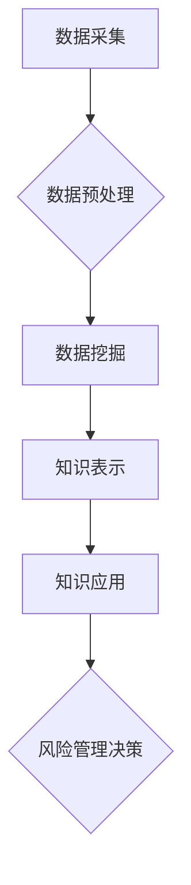

                 

## 知识发现引擎：助力金融行业的风险管理

> 关键词：知识发现引擎、风险管理、金融科技、机器学习、数据挖掘、模式识别、预测分析、异常检测

## 1. 背景介绍

金融行业作为经济发展的重要支柱，其稳定性和安全性至关重要。然而，金融市场日益复杂，风险类型多样化，传统风险管理方法难以有效应对新兴风险。随着大数据、人工智能等技术的快速发展，知识发现引擎（KDE）应运而生，为金融风险管理提供了新的思路和方法。

KDE是一种能够从海量数据中自动发现隐藏的知识和模式的智能系统。它通过数据挖掘、机器学习等技术，识别出潜在的风险信号，并提供可操作的风险预警和决策支持。

## 2. 核心概念与联系

**2.1  知识发现引擎 (KDE)**

KDE是一种基于数据分析和模式识别的智能系统，旨在从海量数据中自动发现隐藏的知识和模式。它通常包含以下几个核心模块：

* **数据采集:** 从各种数据源收集相关数据，包括交易记录、客户信息、市场数据等。
* **数据预处理:** 对收集到的数据进行清洗、转换、整合等处理，使其符合KDE的分析需求。
* **数据挖掘:** 利用各种数据挖掘算法，从预处理后的数据中发现潜在的模式、关联和异常。
* **知识表示:** 将发现的知识以可理解的形式表示出来，例如规则、图表、模型等。
* **知识应用:** 将发现的知识应用于实际问题，例如风险预警、决策支持、策略优化等。

**2.2  金融风险管理**

金融风险是指金融机构在经营活动中可能面临的各种损失风险。常见的金融风险类型包括：

* **信用风险:** 借款人违约或无法偿还贷款的风险。
* **市场风险:** 由于市场价格波动而导致的损失风险。
* **操作风险:** 内部控制失误、系统故障等导致的损失风险。
* **流动性风险:** 无法及时获得足够的资金来满足支付义务的风险。

**2.3  KDE与金融风险管理的联系**

KDE可以帮助金融机构有效识别和管理各种风险，其主要作用包括：

* **风险识别:** 通过分析历史数据和市场趋势，识别潜在的风险因素和模式。
* **风险评估:** 量化风险的程度和可能性，为风险管理决策提供依据。
* **风险预警:** 及时发现风险信号，发出预警提示，帮助金融机构采取预防措施。
* **风险控制:** 建立风险控制模型，优化风险管理策略，降低风险损失。

**2.4  KDE架构**



## 3. 核心算法原理 & 具体操作步骤

**3.1  算法原理概述**

KDE的核心算法主要包括：

* **关联规则挖掘:** 发现数据中频繁出现的项集和关联关系，例如哪些客户同时购买了哪些产品。
* **分类算法:** 将数据分类到不同的类别，例如判断客户是否会违约。
* **聚类算法:** 将数据聚类到不同的组别，例如将客户根据他们的消费习惯进行分组。
* **异常检测算法:** 识别数据中的异常值，例如发现可疑的交易行为。

**3.2  算法步骤详解**

以关联规则挖掘为例，其具体步骤如下：

1. **数据预处理:** 清洗、转换、整合数据，例如去除重复数据、处理缺失值等。
2. **频繁项集挖掘:** 使用Apriori算法或FP-Growth算法等，找出数据中频繁出现的项集。
3. **关联规则生成:** 根据频繁项集，生成关联规则，例如“购买牛奶的人也经常购买面包”。
4. **规则评估:** 使用支持度、置信度等指标评估规则的质量和实用性。
5. **知识表示:** 将发现的关联规则以可理解的形式表示出来，例如规则列表、关联图等。

**3.3  算法优缺点**

* **优点:** 能够发现隐藏的知识和模式，提供新的视角和洞察力。
* **缺点:** 算法复杂度高，对数据量和数据质量要求较高。

**3.4  算法应用领域**

* **金融风险管理:** 识别欺诈交易、预测客户违约、评估市场风险等。
* **客户关系管理:** 发现客户的消费习惯和偏好，提供个性化服务。
* **市场营销:** 分析市场趋势，制定精准的营销策略。

## 4. 数学模型和公式 & 详细讲解 & 举例说明

**4.1  数学模型构建**

在金融风险管理中，KDE常使用统计模型和机器学习模型来构建风险评估和预测模型。

* **统计模型:** 例如，使用线性回归模型预测客户违约概率，或使用GARCH模型预测市场波动率。
* **机器学习模型:** 例如，使用决策树模型分类客户风险等级，或使用支持向量机模型识别欺诈交易。

**4.2  公式推导过程**

以线性回归模型为例，其目标是找到一条直线，使得预测值与实际值之间的误差最小。

* **模型公式:** $y = \beta_0 + \beta_1x_1 + \beta_2x_2 + ... + \beta_nx_n + \epsilon$

其中：

* $y$ 是预测值
* $x_1, x_2, ..., x_n$ 是输入特征
* $\beta_0, \beta_1, ..., \beta_n$ 是模型参数
* $\epsilon$ 是误差项

* **损失函数:** $Loss = \sum_{i=1}^{n}(y_i - \hat{y}_i)^2$

其中：

* $y_i$ 是实际值
* $\hat{y}_i$ 是预测值

* **参数估计:** 使用最小二乘法估计模型参数，使得损失函数最小。

**4.3  案例分析与讲解**

假设我们想要预测客户的违约概率，可以使用线性回归模型。输入特征可以包括客户的收入、信用评分、贷款金额等。通过训练模型，我们可以得到一个预测违约概率的公式。

## 5. 项目实践：代码实例和详细解释说明

**5.1  开发环境搭建**

* **操作系统:** Linux/Windows/macOS
* **编程语言:** Python
* **数据处理库:** Pandas
* **机器学习库:** Scikit-learn
* **可视化库:** Matplotlib/Seaborn

**5.2  源代码详细实现**

```python
import pandas as pd
from sklearn.linear_model import LogisticRegression
from sklearn.model_selection import train_test_split
from sklearn.metrics import accuracy_score

# 加载数据
data = pd.read_csv('credit_data.csv')

# 划分训练集和测试集
X = data.drop('default', axis=1)
y = data['default']
X_train, X_test, y_train, y_test = train_test_split(X, y, test_size=0.2, random_state=42)

# 训练模型
model = LogisticRegression()
model.fit(X_train, y_train)

# 预测结果
y_pred = model.predict(X_test)

# 评估模型性能
accuracy = accuracy_score(y_test, y_pred)
print('模型准确率:', accuracy)
```

**5.3  代码解读与分析**

* 首先，加载数据并划分训练集和测试集。
* 然后，使用LogisticRegression模型训练模型。
* 最后，使用测试集评估模型性能，并输出模型准确率。

**5.4  运行结果展示**

运行代码后，会输出模型的准确率。

## 6. 实际应用场景

KDE在金融风险管理领域有广泛的应用场景：

* **欺诈检测:** 分析交易数据，识别异常交易行为，例如重复交易、高额交易等。
* **信用风险评估:** 评估客户的信用风险，例如预测客户是否会违约。
* **市场风险管理:** 分析市场数据，预测市场波动和风险，例如股票价格波动、利率变化等。
* **运营风险管理:** 分析内部数据，识别运营风险，例如系统故障、员工违规等。

**6.4  未来应用展望**

随着人工智能技术的不断发展，KDE在金融风险管理领域的应用将更加广泛和深入。例如：

* **个性化风险管理:** 基于客户的个人特征和行为数据，提供个性化的风险管理方案。
* **实时风险监测:** 利用实时数据流，实时监测风险变化，及时发出预警。
* **智能决策支持:** 基于KDE发现的知识和模式，为风险管理决策提供智能支持。

## 7. 工具和资源推荐

**7.1  学习资源推荐**

* **书籍:**
    * 《数据挖掘：概念与技术》
    * 《机器学习》
    * 《人工智能：现代方法》
* **在线课程:**
    * Coursera: 数据挖掘与机器学习
    * edX: 人工智能导论
    * Udemy: 数据科学与机器学习

**7.2  开发工具推荐**

* **Python:** 广泛应用于数据科学和机器学习领域。
* **R:** 专注于统计计算和数据可视化。
* **Spark:** 用于大规模数据处理和分析。

**7.3  相关论文推荐**

* **Knowledge Discovery in Financial Data: A Survey**
* **Fraud Detection Using Machine Learning: A Review**
* **Credit Risk Assessment Using Machine Learning Techniques**

## 8. 总结：未来发展趋势与挑战

**8.1  研究成果总结**

KDE在金融风险管理领域取得了显著的成果，能够有效识别和管理各种风险，提高金融机构的风险管理水平。

**8.2  未来发展趋势**

* **更精准的风险预测:** 利用更先进的机器学习算法和更丰富的特征数据，提高风险预测的准确性和时效性。
* **更个性化的风险管理:** 基于客户的个人特征和行为数据，提供个性化的风险管理方案。
* **更智能的决策支持:** 基于KDE发现的知识和模式，为风险管理决策提供更智能的支持。

**8.3  面临的挑战**

* **数据质量问题:** 金融数据往往复杂、不完整、不一致，需要进行有效的数据清洗和预处理。
* **算法解释性问题:** 一些机器学习算法的决策过程难以解释，需要开发更可解释的算法模型。
* **监管合规问题:** 金融行业受到严格的监管，KDE的应用需要符合相关法律法规和行业标准。

**8.4  研究展望**

未来，KDE的研究将继续深入，探索更先进的算法、更丰富的应用场景和更有效的解决方案，为金融风险管理提供更强大的支持。

## 9. 附录：常见问题与解答

* **Q1: KDE与传统风险管理方法有什么区别？**

A1: KDE利用数据挖掘和机器学习技术，能够自动发现隐藏的风险模式，而传统风险管理方法主要依赖于经验和规则，难以发现新兴风险。

* **Q2: KDE的应用场景有哪些？**

A2: KDE在金融风险管理领域有广泛的应用场景，例如欺诈检测、信用风险评估、市场风险管理等。

* **Q3: 如何评估KDE的性能？**

A3: 可以使用准确率、召回率、F1-score等指标评估KDE的性能。

* **Q4: KDE的应用需要哪些技术技能？**

A4: 需要掌握数据处理、机器学习、统计建模等技术技能。


作者：禅与计算机程序设计艺术 / Zen and the Art of Computer Programming 
<end_of_turn>

