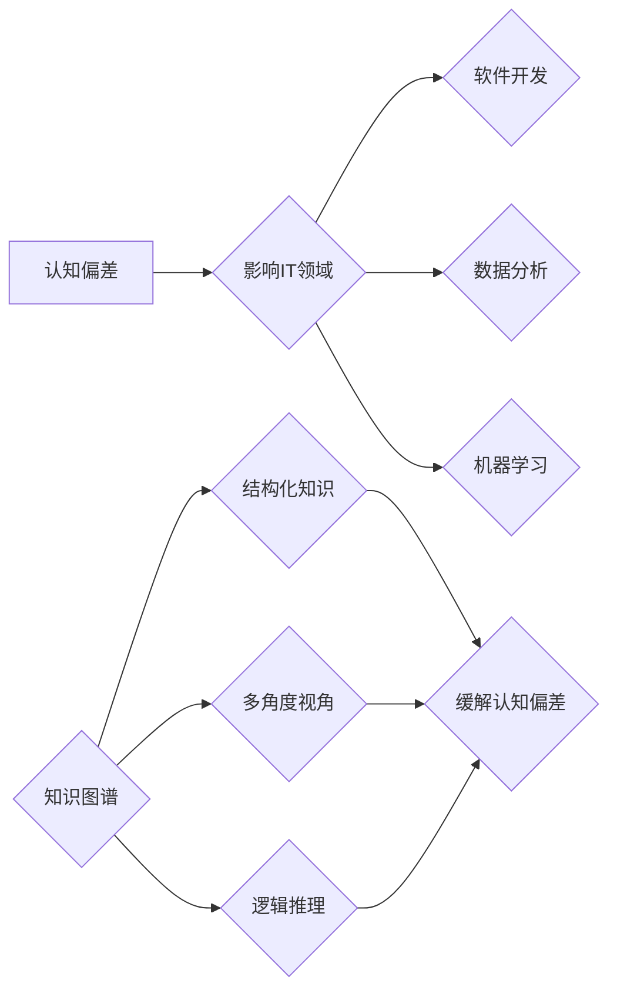

                 

## 知识的认知偏差：思维陷阱与解决之道

> 关键词：认知偏差、思维陷阱、知识图谱、机器学习、深度学习、数据分析、逻辑推理、解决之道

## 1. 背景介绍

在信息爆炸的时代，我们每天接触着海量的信息，从新闻报道到社交媒体，从学术论文到技术博客。这些信息看似丰富多彩，却也潜藏着许多认知偏差，这些偏差会影响我们的判断、决策和理解世界的方式。

认知偏差是指人们在处理信息时，由于心理机制的影响，而产生的系统性错误。这些错误并非源于恶意或缺乏智慧，而是人类大脑在有限的认知能力下，试图快速高效地理解世界的一种本能机制。然而，这些机制也可能导致我们陷入思维陷阱，误判形势，做出错误的决定。

对于IT领域而言，认知偏差的影响尤为显著。从软件开发到数据分析，从机器学习到人工智能，我们都需要依赖于对信息的正确理解和处理。如果我们被认知偏差所困扰，就会难以做出明智的决策，最终影响到项目的成功与否。

## 2. 核心概念与联系

### 2.1 认知偏差的类型

认知偏差的类型繁多，一些常见的类型包括：

* **确认偏误:** 倾向于搜索和接受支持自己现有观点的信息，而忽略或淡化与之相悖的信息。
* **锚定效应:** 在做出判断时，过度依赖第一个获得的信息（锚点），即使该信息并不完全准确。
* ** Verfügbarkeitsheuristik:** 倾向于高估那些容易被回忆起的信息，即使其发生概率并不高。
* **群体思维:** 在群体决策中，为了迎合群体，而压抑个人异议，导致群体做出错误的判断。

### 2.2 认知偏差与IT领域的联系

认知偏差在IT领域的影响体现在多个方面：

* **软件开发:** 开发人员可能因为确认偏误，而难以识别代码中的缺陷，导致软件出现bug。
* **数据分析:** 数据分析师可能因为锚定效应，而对数据进行错误的解读，导致分析结果不准确。
* **机器学习:** 机器学习模型的训练数据可能存在偏差，导致模型产生偏见，无法公平地处理所有数据。

### 2.3 知识图谱与认知偏差的缓解

知识图谱是一种数据结构，它可以将知识表示为实体和关系，并通过推理和查询来获取新的知识。知识图谱可以帮助我们缓解认知偏差，因为：

* **结构化知识:** 知识图谱将知识结构化，避免了信息散乱和理解困难。
* **多角度视角:** 知识图谱可以从多个角度展现知识，帮助我们打破单一视角的认知局限。
* **逻辑推理:** 知识图谱支持逻辑推理，可以帮助我们发现隐藏的关联和模式，避免了基于直觉的判断。

**Mermaid 流程图**



## 3. 核心算法原理 & 具体操作步骤

### 3.1 算法原理概述

知识图谱构建的核心算法主要包括：

* **实体识别:** 从文本中识别出实体，例如人名、地名、机构名等。
* **关系抽取:** 从文本中识别出实体之间的关系，例如“工作于”、“居住在”等。
* **知识表示:** 将实体和关系表示为知识图谱的节点和边。

### 3.2 算法步骤详解

1. **数据预处理:** 对文本数据进行清洗、分词、去停用词等预处理操作，以便于后续算法的执行。
2. **实体识别:** 使用命名实体识别（NER）算法识别文本中的实体。NER算法通常基于机器学习模型，例如条件随机场（CRF）或深度学习模型，例如BERT。
3. **关系抽取:** 使用关系抽取算法识别文本中的实体关系。关系抽取算法通常基于规则匹配、机器学习或深度学习模型。
4. **知识表示:** 将识别出的实体和关系表示为知识图谱的节点和边。节点代表实体，边代表实体之间的关系。

### 3.3 算法优缺点

**优点:**

* 可以有效地提取文本中的知识，构建知识图谱。
* 能够支持逻辑推理和知识发现。

**缺点:**

* 实体识别和关系抽取算法的准确率仍然存在提升空间。
* 知识图谱的构建需要大量的计算资源和时间。

### 3.4 算法应用领域

* **搜索引擎:** 知识图谱可以帮助搜索引擎更好地理解用户查询意图，并提供更精准的搜索结果。
* **问答系统:** 知识图谱可以作为问答系统的知识库，帮助系统回答用户的问题。
* **推荐系统:** 知识图谱可以帮助推荐系统更好地理解用户的兴趣，并推荐更相关的商品或服务。

## 4. 数学模型和公式 & 详细讲解 & 举例说明

### 4.1 数学模型构建

知识图谱的构建可以看作是一个图论问题。

* **节点:** 实体，用符号 $e_i$ 表示，其中 $i$ 为实体的唯一标识符。
* **边:** 关系，用符号 $r_{ij}$ 表示，其中 $i$ 和 $j$ 分别为边的起点和终点实体的标识符。

知识图谱可以表示为一个三元组集合：

$$
G = \{ (e_i, r_{ij}, e_j) \}
$$

其中，$e_i$ 和 $e_j$ 为实体，$r_{ij}$ 为关系。

### 4.2 公式推导过程

实体之间的关系可以表示为一个二元函数：

$$
f: E \times R \times E \rightarrow \{true, false\}
$$

其中，$E$ 为实体集合，$R$ 为关系集合。

如果实体 $e_i$ 和 $e_j$ 之间存在关系 $r_{ij}$，则 $f(e_i, r_{ij}, e_j) = true$，否则 $f(e_i, r_{ij}, e_j) = false$。

### 4.3 案例分析与讲解

例如，知识图谱中包含以下三元组：

* (张三, 工作于, 公司A)
* (李四, 工作于, 公司B)

我们可以使用上述公式表示：

* $f(张三, 工作于, 公司A) = true$
* $f(李四, 工作于, 公司B) = true$

## 5. 项目实践：代码实例和详细解释说明

### 5.1 开发环境搭建

* Python 3.x
* spaCy
* NetworkX

### 5.2 源代码详细实现

```python
import spacy
import networkx as nx

# 加载 spaCy 模型
nlp = spacy.load("en_core_web_sm")

# 定义实体识别和关系抽取函数
def extract_entities(text):
    doc = nlp(text)
    entities = [(ent.text, ent.label_) for ent in doc.ents]
    return entities

def extract_relations(text):
    doc = nlp(text)
    relations = []
    for token in doc:
        if token.dep_ == "nsubj" and token.head.dep_ == "ROOT":
            subject = token.text
            verb = token.head.text
            object = token.head.children[0].text
            relations.append((subject, verb, object))
    return relations

# 示例文本
text = "张三 工作于 公司A"

# 实体识别
entities = extract_entities(text)
print("实体:", entities)

# 关系抽取
relations = extract_relations(text)
print("关系:", relations)

# 构建知识图谱
graph = nx.Graph()
for entity in entities:
    graph.add_node(entity[0])
for relation in relations:
    graph.add_edge(relation[0], relation[2], relation=relation[1])

# 显示知识图谱
nx.draw(graph, with_labels=True)
plt.show()
```

### 5.3 代码解读与分析

* 代码首先加载 spaCy 模型，并定义了实体识别和关系抽取函数。
* 实体识别函数使用 spaCy 的命名实体识别功能，从文本中识别出实体。
* 关系抽取函数使用 spaCy 的依存句法分析功能，从文本中识别出实体之间的关系。
* 代码示例使用一个简单的文本，演示了实体识别和关系抽取的过程。
* 最后，代码使用 NetworkX 库构建了知识图谱，并使用 matplotlib 库绘制了知识图谱的图形表示。

### 5.4 运行结果展示

运行代码后，会生成一个知识图谱的图形表示，其中节点代表实体，边代表实体之间的关系。

## 6. 实际应用场景

### 6.1 知识图谱在IT领域的应用

* **软件开发:** 知识图谱可以帮助开发人员更好地理解软件系统的结构和功能，从而提高软件开发效率。
* **数据分析:** 知识图谱可以帮助数据分析师更好地理解数据之间的关系，从而发现隐藏的模式和趋势。
* **人工智能:** 知识图谱可以作为人工智能模型的知识库，帮助模型更好地理解和处理信息。

### 6.2 知识图谱的未来应用展望

* **个性化推荐:** 知识图谱可以帮助提供更个性化的商品、服务和内容推荐。
* **智能问答:** 知识图谱可以帮助构建更智能的问答系统，能够理解用户的复杂问题并提供更准确的答案。
* **虚拟助手:** 知识图谱可以帮助构建更智能的虚拟助手，能够更好地理解用户的需求并提供帮助。

## 7. 工具和资源推荐

### 7.1 学习资源推荐

* **Stanford Knowledge Graph:** https://web.stanford.edu/class/cs224n/
* **Knowledge Graph Embedding:** https://arxiv.org/abs/1703.01735
* **Deep Learning for Knowledge Graphs:** https://arxiv.org/abs/1806.04286

### 7.2 开发工具推荐

* **Neo4j:** https://neo4j.com/
* **GraphDB:** https://www.ontotext.com/products/graphdb/
* **Amazon Neptune:** https://aws.amazon.com/neptune/

### 7.3 相关论文推荐

* **A Survey on Knowledge Graph Embedding:** https://arxiv.org/abs/1703.01735
* **TransE: Embedding Entities and Relations for Learning and Inference in Knowledge Bases:** https://arxiv.org/abs/1301.2576
* **RotatE: Knowledge Graph Embedding by Relational Rotation in Complex Space:** https://arxiv.org/abs/1902.06832

## 8. 总结：未来发展趋势与挑战

### 8.1 研究成果总结

近年来，知识图谱技术取得了显著进展，在实体识别、关系抽取、知识表示等方面取得了突破性进展。

### 8.2 未来发展趋势

* **知识图谱规模化构建:** 随着数据量的不断增长，知识图谱的规模化构建将成为一个重要的研究方向。
* **知识图谱的动态更新:** 知识是动态变化的，知识图谱需要能够实时更新和维护。
* **跨语言知识图谱:** 构建跨语言的知识图谱，能够更好地理解和处理不同语言的信息。

### 8.3 面临的挑战

* **数据质量:** 知识图谱的构建依赖于高质量的数据，而现实世界的数据往往存在噪声、不完整等问题。
* **知识表示:** 如何更好地表示复杂的关系和知识结构仍然是一个挑战。
* **推理能力:** 知识图谱的推理能力仍然有限，需要进一步提升。

### 8.4 研究展望

未来，知识图谱技术将继续发展，并在更多领域发挥重要作用。

## 9. 附录：常见问题与解答

### 9.1 知识图谱与数据库的区别

知识图谱和数据库都是用于存储和管理数据的结构，但它们在数据模型和应用场景上存在差异。

* **数据库:** 以表结构存储数据，主要用于管理结构化数据，例如商品信息、用户数据等。
* **知识图谱:** 以实体和关系表示知识，主要用于存储和管理非结构化数据，例如文本、图像、音频等。

### 9.2 知识图谱的构建方法有哪些？

知识图谱的构建方法主要包括：

* **人工构建:** 由专家手动构建知识图谱。
* **自动构建:** 使用机器学习算法自动从文本数据中提取知识构建知识图谱。
* **半自动构建:** 结合人工和自动方法构建知识图谱。

### 9.3 知识图谱的应用领域有哪些？

知识图谱的应用领域非常广泛，包括：

* **搜索引擎:** 帮助搜索引擎更好地理解用户查询意图，并提供更精准的搜索结果。
* **问答系统:** 作为问答系统的知识库，帮助系统回答用户的问题。
* **推荐系统:** 帮助提供更个性化的商品、服务和内容推荐。
* **医疗保健:** 帮助医生诊断疾病、制定治疗方案。
* **金融服务:** 帮助金融机构进行风险评估、欺诈检测。


作者：禅与计算机程序设计艺术 / Zen and the Art of Computer Programming 
<end_of_turn>

