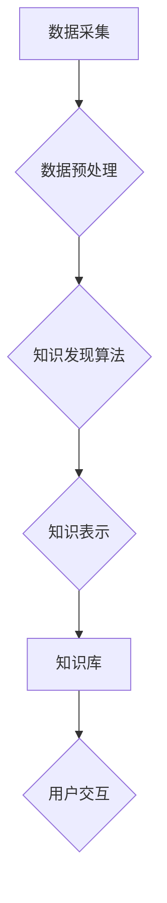

                 

## 知识管理人才：驾驭知识发现引擎的专家

> 关键词：知识管理、知识发现、人工智能、机器学习、数据挖掘、知识图谱、专家系统

### 1. 背景介绍

在当今数据爆炸的时代，信息获取和知识发现已成为企业和个人发展的重要驱动力。海量数据蕴藏着丰富的知识，但如何有效地挖掘和利用这些知识，成为了一个亟待解决的难题。知识管理人才应运而生，他们具备独特的技能和知识，能够驾驭知识发现引擎，从海量数据中提取有价值的知识，并将其转化为可操作的洞察和决策支持。

传统知识管理主要依赖于人工整理和归档，效率低下且难以应对海量数据的挑战。随着人工智能、机器学习和数据挖掘技术的快速发展，知识发现引擎逐渐成为知识管理的新引擎。这些引擎利用算法和模型，自动从数据中识别模式、发现关系和生成知识，极大地提高了知识发现效率和准确性。

### 2. 核心概念与联系

**2.1 知识管理**

知识管理是指组织内部知识的创建、共享、应用和维护的过程。它旨在将知识作为一种资源进行管理，以提高组织的竞争力。

**2.2 知识发现**

知识发现是指从数据中自动提取有价值的知识的过程。它利用数据挖掘、机器学习和人工智能等技术，从海量数据中识别模式、发现关系和生成知识。

**2.3 知识发现引擎**

知识发现引擎是一种基于人工智能和数据挖掘技术的软件系统，能够自动从数据中发现知识。它通常包含以下核心组件：

* 数据预处理模块：对原始数据进行清洗、转换和格式化，使其适合知识发现算法的处理。
* 知识发现算法模块：利用各种算法和模型，从数据中提取有价值的知识，例如关联规则、分类模型、聚类模型等。
* 知识表示模块：将发现的知识以可理解的形式表示出来，例如知识图谱、规则库、文本摘要等。
* 用户交互模块：提供用户界面，方便用户浏览、查询和交互知识。

**2.4 知识管理人才**

知识管理人才是指具备知识管理理论、方法和实践经验，能够有效地管理和利用知识的专业人员。他们需要具备以下技能：

* 知识领域专业知识
* 知识管理理论和方法
* 数据分析和挖掘能力
* 人工智能和机器学习基础
* 沟通和协作能力

**2.5 知识管理人才与知识发现引擎**

知识管理人才是知识发现引擎的使用者和维护者。他们需要了解知识发现引擎的工作原理，能够选择合适的算法和模型，并对发现的知识进行评估和应用。同时，他们还需要与业务部门合作，将知识转化为可操作的洞察和决策支持。

**2.6 知识发现引擎架构**



### 3. 核心算法原理 & 具体操作步骤

**3.1 算法原理概述**

知识发现算法主要分为以下几类：

* **关联规则挖掘算法**: 发现数据中频繁出现的项集和它们的关联关系，例如Apriori算法、FP-Growth算法。
* **分类算法**: 将数据分类到预定义的类别中，例如决策树算法、支持向量机算法、神经网络算法。
* **聚类算法**: 将数据按照相似性聚类到不同的组中，例如K-Means算法、层次聚类算法。
* **异常检测算法**: 识别数据中与众不同的数据点，例如基于统计的异常检测算法、基于机器学习的异常检测算法。

**3.2 算法步骤详解**

以关联规则挖掘算法为例，其基本步骤如下：

1. **数据预处理**: 对原始数据进行清洗、转换和格式化，例如删除缺失值、转换数据类型等。
2. **频繁项集挖掘**: 使用Apriori算法或FP-Growth算法等，找出数据中频繁出现的项集。
3. **关联规则生成**: 根据频繁项集，计算支持度和置信度，生成关联规则。
4. **规则过滤**: 根据预设的阈值，过滤掉不满足条件的关联规则。
5. **规则可视化**: 将生成的关联规则以可视化的形式展示出来，例如规则列表、关联网络图等。

**3.3 算法优缺点**

* **优点**: 能够自动从数据中发现隐藏的知识，提高知识发现效率和准确性。
* **缺点**: 算法的性能和效果取决于数据的质量和算法的选择，需要专业人员进行算法调优和结果评估。

**3.4 算法应用领域**

知识发现算法广泛应用于各个领域，例如：

* **商业**: 市场分析、客户关系管理、产品推荐等。
* **医疗**: 疾病诊断、药物研发、患者风险预测等。
* **金融**: 欺诈检测、风险管理、投资决策等。
* **教育**: 个性化学习、学生行为分析、教学效果评估等。

### 4. 数学模型和公式 & 详细讲解 & 举例说明

**4.1 数学模型构建**

关联规则挖掘算法通常使用支持度和置信度来衡量规则的质量。

* **支持度**: 规则在数据集中的出现频率，表示规则的普遍性。
* **置信度**: 规则的条件概率，表示规则的可靠性。

**4.2 公式推导过程**

* **支持度**:  $$Support(A \rightarrow B) = \frac{Count(A \cup B)}{Total Count}$$
* **置信度**: $$Confidence(A \rightarrow B) = \frac{Count(A \cap B)}{Count(A)}$$

其中：

* $A$ 和 $B$ 分别表示两个项集。
* $Count(A \cup B)$ 表示项集 $A \cup B$ 在数据集中的出现次数。
* $Total Count$ 表示数据集的总记录数。
* $Count(A \cap B)$ 表示项集 $A \cap B$ 在数据集中的出现次数。
* $Count(A)$ 表示项集 $A$ 在数据集中的出现次数。

**4.3 案例分析与讲解**

假设我们有一个数据集，包含以下交易记录：

* {牛奶, 面包}
* {牛奶, 鸡蛋}
* {牛奶, 牛奶, 鸡蛋}
* {面包, 鸡蛋}
* {牛奶, 面包, 鸡蛋}

我们可以使用关联规则挖掘算法，发现以下关联规则：

* **规则**: {牛奶} $\rightarrow$ {面包}
* **支持度**: 3/5 = 0.6
* **置信度**: 3/4 = 0.75

这个规则表示，如果购买了牛奶，那么购买面包的概率为 75%。

### 5. 项目实践：代码实例和详细解释说明

**5.1 开发环境搭建**

* Python 3.x
* pandas
* scikit-learn

**5.2 源代码详细实现**

```python
import pandas as pd
from sklearn.feature_extraction.text import TfidfVectorizer
from sklearn.metrics.pairwise import cosine_similarity

# 数据加载
data = pd.read_csv('data.csv')

# 文本预处理
vectorizer = TfidfVectorizer()
tfidf_matrix = vectorizer.fit_transform(data['text'])

# 余弦相似度计算
cosine_sim = cosine_similarity(tfidf_matrix, tfidf_matrix)

# 相似度排序
indices = [i for i in range(len(data))]
sim_scores = list(enumerate(cosine_sim[0]))
sim_scores = sorted(sim_scores, key=lambda x: x[1], reverse=True)

# 相似文档输出
print("Top 10 similar documents:")
for i in sim_scores[1:11]:
    print(data['title'][i[0]])
```

**5.3 代码解读与分析**

* 该代码示例使用 TF-IDF 向量化技术，将文本数据转换为数字向量，并使用余弦相似度计算文档之间的相似度。
* 首先，使用 `TfidfVectorizer` 类将文本数据转换为 TF-IDF 向量矩阵。
* 然后，使用 `cosine_similarity` 函数计算向量矩阵之间的余弦相似度。
* 最后，根据相似度排序，输出与给定文档最相似的文档。

**5.4 运行结果展示**

运行该代码后，将输出与给定文档最相似的 10 篇文档的标题。

### 6. 实际应用场景

知识发现引擎在各个领域都有广泛的应用场景，例如：

* **商业**: 通过分析客户购买行为，推荐个性化商品，提高销售额。
* **医疗**: 通过分析患者病历数据，预测疾病风险，辅助医生诊断。
* **金融**: 通过分析市场数据，识别投资机会，降低风险。
* **教育**: 通过分析学生学习数据，个性化教学，提高学习效率。

**6.4 未来应用展望**

随着人工智能和机器学习技术的不断发展，知识发现引擎将更加智能化、自动化和个性化。未来，知识发现引擎将能够：

* 更准确地发现隐藏的知识。
* 更智能地解释和解读知识。
* 更个性化地提供知识服务。

### 7. 工具和资源推荐

**7.1 学习资源推荐**

* **书籍**:
    * 《数据挖掘：概念与技术》
    * 《机器学习》
    * 《知识发现与数据挖掘》
* **在线课程**:
    * Coursera: 数据挖掘
    * edX: 机器学习
    * Udemy: 数据科学

**7.2 开发工具推荐**

* **Python**: 广泛应用于数据挖掘和机器学习领域，拥有丰富的库和工具。
* **R**: 专注于统计分析和数据可视化，也支持数据挖掘和机器学习。
* **Weka**: 一个开源的机器学习工具包，提供各种算法和数据处理工具。

**7.3 相关论文推荐**

* 《A Survey of Association Rule Mining Algorithms》
* 《Introduction to Machine Learning》
* 《Knowledge Discovery and Data Mining: Concepts, Methods, Tools, and Applications》

### 8. 总结：未来发展趋势与挑战

**8.1 研究成果总结**

知识发现引擎已经取得了显著的成果，能够有效地从海量数据中发现有价值的知识，并将其转化为可操作的洞察和决策支持。

**8.2 未来发展趋势**

未来，知识发现引擎将朝着以下方向发展：

* **更智能化**: 利用深度学习等先进算法，提高知识发现的准确性和智能化程度。
* **更自动化**: 自动化知识发现流程，降低人工干预，提高效率。
* **更个性化**: 根据用户的需求和偏好，提供个性化的知识服务。

**8.3 面临的挑战**

知识发现引擎也面临着一些挑战：

* **数据质量**: 知识发现引擎的性能取决于数据的质量，如何处理不完整、不一致和噪声数据是一个难题。
* **算法复杂度**: 一些知识发现算法非常复杂，需要大量的计算资源和时间。
* **知识解释**: 如何解释和解读发现的知识，使其能够被人类理解和应用，是一个重要的挑战。

**8.4 研究展望**

未来，我们需要继续研究和探索新的知识发现算法和技术，提高知识发现的效率、准确性和智能化程度。同时，还需要关注知识解释和可视化，使知识发现更加易于理解和应用。

### 9. 附录：常见问题与解答

**9.1 如何选择合适的知识发现算法？**

选择合适的知识发现算法取决于具体的应用场景和数据特点。例如，如果需要发现频繁出现的项集，可以使用Apriori算法或FP-Growth算法；如果需要分类数据，可以使用决策树算法、支持向量机算法或神经网络算法。

**9.2 如何评估知识发现算法的性能？**

常用的评估指标包括支持度、置信度、准确率、召回率和F1-score等。

**9.3 如何处理不完整和不一致的数据？**

可以使用数据清洗和预处理技术，例如删除缺失值、转换数据类型、标准化数据等，来处理不完整和不一致的数据。


作者：禅与计算机程序设计艺术 / Zen and the Art of Computer Programming 
<end_of_turn>

