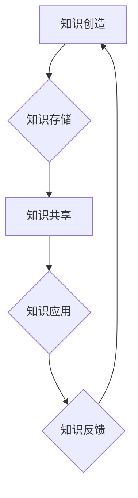

                 

## 知识管理：驾驭人类知识的航船

> 关键词：知识管理、知识图谱、人工智能、机器学习、数据挖掘、知识表示、知识共享

### 1. 背景介绍

在信息爆炸的时代，人类知识的积累和传播速度前所未有。然而，海量的知识碎片分散在各个角落，难以有效地组织、存储、检索和利用。如何有效地管理和利用人类知识，已成为当今社会面临的重大挑战。知识管理 (Knowledge Management，KM) 应运而生，旨在帮助组织收集、存储、共享和应用知识，从而提高效率、创新能力和竞争力。

传统的知识管理方法主要依赖于人工整理和分类，效率低下，难以应对知识的爆炸式增长。随着人工智能 (Artificial Intelligence，AI) 和机器学习 (Machine Learning，ML) 技术的快速发展，知识管理迎来了新的机遇。AI 和 ML 算法能够自动识别、提取、组织和关联知识，为知识管理提供强大的工具和手段。

### 2. 核心概念与联系

知识管理的核心概念包括：

* **知识：** 包括事实、经验、技能、观点和创造力等，是人类认知和理解世界的基础。
* **知识创造：** 通过学习、研究、实践等方式产生新的知识。
* **知识共享：** 将知识传播和交流给其他人，促进知识的积累和传播。
* **知识应用：** 将知识应用于实际问题，解决问题、创造价值。

**知识管理流程图**



### 3. 核心算法原理 & 具体操作步骤

#### 3.1  算法原理概述

知识管理的核心算法原理主要包括：

* **数据挖掘：** 从海量数据中提取有价值的知识和模式。
* **机器学习：** 利用算法从数据中学习，自动识别和分类知识。
* **自然语言处理：** 处理和理解人类语言，提取知识和关系。
* **知识图谱：** 建立知识的结构化表示，方便知识的存储、检索和推理。

#### 3.2  算法步骤详解

**数据挖掘算法步骤：**

1. 数据收集：从各种数据源收集相关数据。
2. 数据预处理：清洗、转换和格式化数据，使其适合挖掘。
3. 数据分析：使用数据挖掘算法，例如关联规则挖掘、分类和聚类，发现数据中的模式和规律。
4. 结果可视化：将挖掘结果以图表、报告等形式呈现，方便理解和分析。

**机器学习算法步骤：**

1. 数据准备：收集、清洗和预处理数据，并将其分为训练集、验证集和测试集。
2. 模型选择：根据任务类型选择合适的机器学习算法，例如分类、回归或聚类。
3. 模型训练：使用训练集训练模型，调整模型参数，使其能够准确地预测或分类数据。
4. 模型评估：使用验证集和测试集评估模型的性能，例如准确率、召回率和F1-score。
5. 模型部署：将训练好的模型部署到实际应用场景中，用于预测或分类新数据。

#### 3.3  算法优缺点

**数据挖掘算法：**

* **优点：** 可以从海量数据中发现隐藏的模式和规律，为知识发现提供新的视角。
* **缺点：** 需要大量的计算资源和专业知识，结果的解释性可能较弱。

**机器学习算法：**

* **优点：** 可以自动学习和改进，提高知识发现的效率和准确性。
* **缺点：** 需要大量的训练数据，对数据质量要求较高，模型的解释性可能较弱。

#### 3.4  算法应用领域

* **科学研究：** 从实验数据中发现新的科学规律和知识。
* **商业分析：** 分析市场趋势、客户行为和竞争对手，为决策提供支持。
* **医疗诊断：** 从患者数据中识别疾病的特征，辅助医生进行诊断。
* **教育教学：** 个性化学习推荐、自动批改作业等。

### 4. 数学模型和公式 & 详细讲解 & 举例说明

#### 4.1  数学模型构建

知识管理中的数学模型通常用于描述知识的结构、关系和演化过程。例如，知识图谱可以表示为图结构，其中节点代表知识实体，边代表知识关系。

#### 4.2  公式推导过程

在知识图谱构建过程中，可以使用一些数学公式来计算知识实体之间的相似度或相关性。例如，余弦相似度公式：

$$
\text{相似度} = \frac{\mathbf{A} \cdot \mathbf{B}}{||\mathbf{A}|| ||\mathbf{B}||}
$$

其中，$\mathbf{A}$ 和 $\mathbf{B}$ 代表两个知识实体的向量表示，$\cdot$ 表示向量点积，$||\mathbf{A}||$ 和 $||\mathbf{B}||$ 分别表示两个向量的模长。

#### 4.3  案例分析与讲解

假设有两个知识实体：

* **实体 A：** 编程语言 Python
* **实体 B：** 数据科学

我们可以使用文本数据训练两个实体的词向量表示，然后使用余弦相似度公式计算它们的相似度。如果两个实体的词向量表示相似，则它们之间的知识关系可能更紧密。

### 5. 项目实践：代码实例和详细解释说明

#### 5.1  开发环境搭建

* Python 3.x
* Jupyter Notebook
* 必要的库，例如：

    * NetworkX：用于构建和分析知识图谱
    * Gensim：用于训练词向量

#### 5.2  源代码详细实现

```python
import networkx as nx
from gensim.models import Word2Vec

# 训练词向量模型
sentences = [["Python", "编程语言", "数据科学"], ["Java", "编程语言", "企业级应用"]]
model = Word2Vec(sentences, vector_size=100, window=5, min_count=1)

# 创建知识图谱
graph = nx.Graph()
graph.add_node("Python")
graph.add_node("Java")
graph.add_node("数据科学")
graph.add_edge("Python", "数据科学")
graph.add_edge("Java", "企业级应用")

# 计算知识实体之间的相似度
python_vector = model.wv["Python"]
datascience_vector = model.wv["数据科学"]
similarity = nx.cosine_similarity(python_vector, datascience_vector)
print(f"Python 和 数据科学 的相似度：{similarity}")

# 可视化知识图谱
nx.draw(graph, with_labels=True)
plt.show()
```

#### 5.3  代码解读与分析

* 首先，我们使用 Gensim 库训练一个词向量模型，将编程语言和相关概念映射到向量空间。
* 然后，我们使用 NetworkX 库构建一个知识图谱，其中节点代表知识实体，边代表知识关系。
* 接着，我们使用余弦相似度公式计算 Python 和 数据科学 之间的相似度，结果表明它们之间的关系密切。
* 最后，我们使用 NetworkX 库可视化知识图谱，直观地展示知识之间的关系。

#### 5.4  运行结果展示

运行代码后，将生成一个可视化的知识图谱，展示 Python 和 数据科学 之间的连接关系，以及其他知识实体之间的关系。

### 6. 实际应用场景

知识管理技术在各个领域都有广泛的应用场景：

* **企业知识管理：** 帮助企业收集、存储、共享和应用内部知识，提高员工效率和创新能力。
* **教育领域：** 建立知识库，提供个性化学习资源，辅助教师教学。
* **医疗保健：** 建立患者知识图谱，辅助医生诊断和治疗。
* **科研领域：** 帮助科学家发现新的知识和规律，加速科研成果转化。

### 6.4  未来应用展望

随着人工智能和机器学习技术的不断发展，知识管理技术将更加智能化、自动化和个性化。未来，知识管理将更加深入地融入到人们的工作、学习和生活之中，帮助我们更好地理解和驾驭人类知识的海洋。

### 7. 工具和资源推荐

#### 7.1  学习资源推荐

* **书籍：**

    * 《知识管理：理论与实践》
    * 《知识管理：从概念到应用》

* **在线课程：**

    * Coursera：知识管理课程
    * edX：知识管理课程

#### 7.2  开发工具推荐

* **知识图谱构建工具：**

    * Protégé
    * GraphDB

* **机器学习库：**

    * scikit-learn
    * TensorFlow

#### 7.3  相关论文推荐

* **知识图谱：**

    * "A Survey on Knowledge Graph Embedding"
    * "Knowledge Graph Completion via Relational Reasoning"

* **知识管理：**

    * "Knowledge Management: A Review"
    * "The Future of Knowledge Management"

### 8. 总结：未来发展趋势与挑战

#### 8.1  研究成果总结

知识管理技术取得了显著的进展，为组织和个人提供了更有效地管理和利用知识的方法。

#### 8.2  未来发展趋势

* **智能化：** 利用人工智能和机器学习技术，实现知识管理的自动化和智能化。
* **个性化：** 根据用户的需求和偏好，提供个性化的知识服务。
* **跨领域融合：** 将知识管理与其他领域，例如数据分析、大数据、云计算等融合，形成更强大的知识管理体系。

#### 8.3  面临的挑战

* **数据质量：** 知识管理依赖于高质量的数据，如何保证数据准确性和完整性是一个挑战。
* **知识表示：** 如何将复杂、多样的知识有效地表示和组织是一个难题。
* **知识共享：** 如何鼓励和促进知识的共享和传播是一个关键问题。

#### 8.4  研究展望

未来，知识管理研究将继续探索新的算法、模型和技术，以更好地解决知识管理面临的挑战，推动知识管理技术的发展和应用。

### 9. 附录：常见问题与解答

* **什么是知识管理？**

知识管理是指组织收集、存储、共享和应用知识的过程，旨在提高组织的效率、创新能力和竞争力。

* **知识管理有哪些方法？**

常见的知识管理方法包括：

* **文档管理：** 收集、存储和管理组织的文档和文件。
* **知识库：** 建立知识库，存储和组织组织的知识。
* **协作平台：** 建立协作平台，方便员工共享和交流知识。
* **知识培训：** 提供知识培训，帮助员工学习和掌握新的知识。

* **知识管理有哪些工具？**

常见的知识管理工具包括：

* **文档管理系统：** SharePoint、Confluence
* **知识库系统：** Protégé、GraphDB
* **协作平台：** Slack、Microsoft Teams
* **知识管理软件：** IBM Knowledge Center、SAP Knowledge Management


作者：禅与计算机程序设计艺术 / Zen and the Art of Computer Programming 
<end_of_turn>

