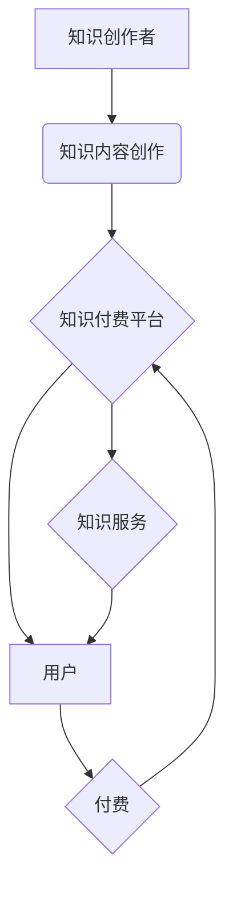

                 

## 知识经济时代下的知识付费创新商业模式运营

> 关键词：知识付费、商业模式、创新、在线教育、内容平台、用户体验、数据驱动、人工智能

### 1. 背景介绍

进入21世纪，知识已成为经济发展和社会进步的 primary driver。知识经济时代，信息爆炸、技术迭代加速，知识的获取、传播和应用方式发生了深刻变化。传统商业模式面临挑战，新的商业模式不断涌现，其中知识付费模式作为一种创新模式，迅速崛起，成为知识经济发展的重要驱动力。

知识付费是指以知识、技能、经验等为核心内容，通过付费的方式获取和学习。它打破了传统教育模式的时空限制，为用户提供了更加灵活、便捷、个性化的学习体验。随着互联网技术的普及和移动互联网的兴起，知识付费市场呈现出爆发式增长趋势。

### 2. 核心概念与联系

**2.1 知识付费的核心概念**

知识付费的核心概念包括：

* **知识产权：** 知识付费模式的核心是知识的价值体现，需要建立完善的知识产权保护机制，保障知识创作者的权益。
* **付费机制：** 知识付费模式需要建立合理的付费机制，例如订阅制、课程购买、会员体系等，以确保知识创作者的收益和平台的运营。
* **用户体验：** 知识付费平台需要提供优质的用户体验，包括内容质量、学习互动、技术支持等，以吸引和留住用户。

**2.2 知识付费与商业模式的联系**

知识付费模式与商业模式的联系主要体现在以下几个方面：

* **价值创造：** 知识付费模式的核心是创造价值，通过提供优质的知识内容和服务，满足用户的学习需求，从而实现商业价值。
* **收入模式：** 知识付费模式的收入模式主要通过付费获取知识内容的方式实现，例如课程购买、会员订阅等。
* **用户关系：** 知识付费模式需要建立良好的用户关系，通过提供优质的学习体验和服务，增强用户粘性，促进用户复购。

**2.3 知识付费商业模式架构**



### 3. 核心算法原理 & 具体操作步骤

**3.1 算法原理概述**

知识付费平台的运营需要依赖于一系列算法，例如推荐算法、内容分发算法、用户画像算法等，这些算法可以帮助平台更好地理解用户需求，提供个性化的服务，提高用户体验。

**3.2 算法步骤详解**

* **推荐算法：** 基于用户的学习历史、兴趣偏好、行为数据等，推荐相关知识内容，提高用户获取优质内容的效率。
* **内容分发算法：** 根据内容质量、用户活跃度、平台策略等因素，对知识内容进行排序和分发，确保优质内容得到曝光。
* **用户画像算法：** 通过分析用户的学习行为、兴趣爱好、社交关系等数据，构建用户画像，以便平台提供更精准的个性化服务。

**3.3 算法优缺点**

* **优点：** 提高用户体验、提升内容质量、促进平台运营效率。
* **缺点：** 算法的准确性依赖于数据质量，算法的调整需要不断迭代优化，存在算法偏差和公平性问题。

**3.4 算法应用领域**

* **在线教育平台：** 推荐课程、个性化学习路径、智能答疑等。
* **内容平台：** 内容推荐、用户分群、广告投放等。
* **社交平台：** 内容推荐、兴趣匹配、用户关系分析等。

### 4. 数学模型和公式 & 详细讲解 & 举例说明

**4.1 数学模型构建**

知识付费平台的运营可以构建数学模型来分析用户行为、内容价值、平台收益等因素。例如，可以构建用户价值模型，用公式表示用户对平台的价值贡献：

$$
User Value = \alpha * Engagement + \beta * Purchase + \gamma * Retention
$$

其中：

* **User Value:** 用户价值
* **Engagement:** 用户参与度，例如学习时长、互动次数等
* **Purchase:** 用户付费行为，例如课程购买、会员订阅等
* **Retention:** 用户留存率，例如复购率、活跃度等
* **α, β, γ:** 各个因素的权重系数

**4.2 公式推导过程**

用户价值模型的构建需要根据平台的具体情况和业务目标，确定各个因素的权重系数。例如，对于一个注重用户学习体验的平台，可以将 Engagement 的权重系数设置较高，而对于一个注重用户付费行为的平台，可以将 Purchase 的权重系数设置较高。

**4.3 案例分析与讲解**

假设一个在线教育平台，通过用户数据分析发现：

* 用户学习时长与用户付费行为呈正相关
* 用户复购率与用户学习时长呈正相关

根据以上分析，可以推断出：

* Engagement 和 Purchase 两个因素对用户价值贡献较大
* Retention 因素也对用户价值有重要影响

因此，平台可以将 User Value 模型中的权重系数设置如下：

$$
User Value = 0.6 * Engagement + 0.3 * Purchase + 0.1 * Retention
$$

### 5. 项目实践：代码实例和详细解释说明

**5.1 开发环境搭建**

* 语言：Python
* 框架：Django
* 数据库：MySQL
* 云平台：AWS

**5.2 源代码详细实现**

```python
# models.py
from django.db import models

class Course(models.Model):
    title = models.CharField(max_length=255)
    description = models.TextField()
    price = models.DecimalField(max_digits=10, decimal_places=2)

class User(models.Model):
    username = models.CharField(max_length=255)
    email = models.EmailField()
    # ... other user attributes

# views.py
from django.shortcuts import render
from .models import Course

def course_list(request):
    courses = Course.objects.all()
    return render(request, 'course_list.html', {'courses': courses})

# course_list.html
<h1>课程列表</h1>
<ul>
    
        <li>
            <h2>{{ course.title }}</h2>
            <p>{{ course.description }}</p>
            <p>价格: {{ course.price }}</p>
        </li>
    
</ul>
```

**5.3 代码解读与分析**

* models.py 文件定义了课程和用户两个模型，分别对应数据库中的课程表和用户表。
* views.py 文件定义了课程列表页面的视图函数，从数据库中获取所有课程数据，并将其传递给模板文件。
* course_list.html 文件是课程列表页面的模板文件，使用 Django 模板语法循环遍历课程数据，并将其渲染到页面上。

**5.4 运行结果展示**

运行以上代码，可以访问 localhost:8000/course_list，查看课程列表页面。

### 6. 实际应用场景

**6.1 在线教育平台**

知识付费模式在在线教育平台的应用非常广泛，例如 Coursera、Udemy、网易云课堂等平台都采用知识付费模式运营。

**6.2 内容平台**

一些内容平台，例如知乎、微信公众号、Bilibili等，也开始采用知识付费模式，通过付费会员、付费专栏等方式，为用户提供更优质的内容和服务。

**6.3 个人知识分享**

一些个人知识创作者，例如博主、专家学者等，也通过知识付费平台，将自己的知识和经验分享给用户，并获得收益。

**6.4 未来应用展望**

随着人工智能、虚拟现实等技术的不断发展，知识付费模式将更加创新和多元化。例如，可以利用人工智能技术，为用户提供个性化的学习推荐和智能答疑服务；利用虚拟现实技术，打造沉浸式的学习体验。

### 7. 工具和资源推荐

**7.1 学习资源推荐**

* **书籍：** 《知识经济》、《互联网思维》
* **课程：** Coursera、Udemy上的知识付费课程
* **网站：** 知乎、微信公众号

**7.2 开发工具推荐**

* **编程语言：** Python、Java、Node.js
* **框架：** Django、Flask、Spring Boot
* **数据库：** MySQL、MongoDB、PostgreSQL

**7.3 相关论文推荐**

* **知识经济与知识付费：** 
* **人工智能在知识付费领域的应用：** 

### 8. 总结：未来发展趋势与挑战

**8.1 研究成果总结**

知识付费模式在知识经济时代具有重要的发展意义，它为知识创作者提供了新的收入来源，为用户提供了更加便捷、个性化的学习体验。

**8.2 未来发展趋势**

* **个性化定制：** 利用人工智能技术，为用户提供更加个性化的学习内容和服务。
* **沉浸式体验：** 利用虚拟现实、增强现实等技术，打造更加沉浸式的学习体验。
* **跨界融合：** 与其他行业融合，例如游戏、娱乐、医疗等，拓展知识付费的应用场景。

**8.3 面临的挑战**

* **知识产权保护：** 知识付费平台需要建立完善的知识产权保护机制，保障知识创作者的权益。
* **用户信任问题：** 知识付费平台需要建立良好的用户信任关系，确保用户获得优质的知识内容和服务。
* **算法伦理问题：** 知识付费平台的算法需要遵循伦理原则，避免算法偏差和公平性问题。

**8.4 研究展望**

未来，需要进一步研究知识付费模式的商业模式创新、技术应用、用户体验优化等方面，推动知识付费模式的健康发展。

### 9. 附录：常见问题与解答

* **Q1：知识付费平台如何保证知识内容的质量？**

* **A1：** 知识付费平台可以通过建立严格的审核机制、邀请专业领域专家进行内容评审、鼓励用户评价和反馈等方式，保证知识内容的质量。

* **Q2：知识付费平台如何吸引用户付费？**

* **A2：** 知识付费平台可以通过提供优质的知识内容、个性化的学习体验、优惠的付费方案等方式，吸引用户付费。

* **Q3：知识付费模式的未来发展趋势是什么？**

* **A3：** 知识付费模式的未来发展趋势是更加个性化、更加沉浸式、更加跨界融合。


作者：禅与计算机程序设计艺术 / Zen and the Art of Computer Programming 
<end_of_turn>

