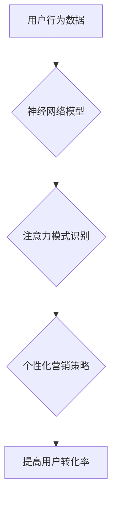

                 

## 神经营销学：注意力经济的科学基础

> 关键词：注意力经济、神经网络、深度学习、用户行为、营销策略、数据分析、可解释性

## 1. 背景介绍

在当今信息爆炸的时代，人们面临着前所未有的信息过载。每天我们接触的海量信息中，只有极少部分能够真正获得我们的关注。如何有效地获取和利用用户有限的注意力，成为了企业和个人都面临的重大挑战。

注意力经济的概念应运而生，它将注意力视为一种稀缺资源，并强调了在竞争激烈的市场环境中，获取和保持用户注意力至关重要。传统的营销策略往往依赖于广告投放和促销活动，但随着用户对广告的免疫力增强，这些方法的有效性逐渐下降。

神经网络和深度学习技术的快速发展为注意力经济提供了新的工具和方法。通过分析用户行为数据，我们可以更好地理解用户的注意力模式，并开发出更精准、更有效的营销策略。

## 2. 核心概念与联系

### 2.1 注意力经济

注意力经济的核心概念是将注意力视为一种稀缺资源，并强调了在信息过载的时代，获取和保持用户注意力至关重要。

用户注意力是有限的，他们每天只能集中精力处理一小部分信息。因此，企业需要找到有效的方法来吸引用户的注意力，并将其转化为商业价值。

### 2.2 神经网络与深度学习

神经网络是一种模仿人脑神经元结构的计算模型，能够学习和处理复杂的数据模式。深度学习是基于神经网络的一种机器学习方法，通过堆叠多个神经网络层，能够学习更深层次的特征表示。

### 2.3 用户行为分析

用户行为分析是指通过收集和分析用户在使用产品或服务时的行为数据，以了解用户的需求、偏好和行为模式。

用户行为数据可以包括用户访问网站的页面、点击的链接、停留的时间、搜索的关键词等。通过分析这些数据，我们可以了解用户的兴趣、需求和行为模式，并将其应用于营销策略的制定。

**Mermaid 流程图**



## 3. 核心算法原理 & 具体操作步骤

### 3.1 算法原理概述

注意力机制是一种模仿人类注意力机制的机器学习技术，它能够帮助模型专注于输入数据中最重要的部分，从而提高模型的性能。

注意力机制的核心思想是通过一个注意力权重来分配输入数据中的不同部分的关注度。这些权重可以根据输入数据的特征和模型的学习目标进行动态调整。

### 3.2 算法步骤详解

1. **输入数据处理:** 将输入数据转换为模型可以理解的格式。
2. **编码器:** 使用编码器网络对输入数据进行编码，生成隐藏状态表示。
3. **注意力计算:** 计算每个隐藏状态与所有输入数据元素之间的注意力权重。
4. **解码器:** 使用解码器网络和注意力权重对隐藏状态进行解码，生成输出结果。

### 3.3 算法优缺点

**优点:**

* 能够提高模型的性能，特别是对于长序列数据。
* 可以帮助模型理解输入数据中的重要信息。
* 可以解释模型的决策过程。

**缺点:**

* 计算复杂度较高。
* 需要大量的训练数据。
* 训练过程可能比较困难。

### 3.4 算法应用领域

注意力机制在许多领域都有广泛的应用，包括：

* **自然语言处理:** 机器翻译、文本摘要、问答系统等。
* **计算机视觉:** 图像识别、目标检测、图像 Captioning 等。
* **语音识别:** 语音转文本、语音合成等。
* **推荐系统:** 商品推荐、内容推荐等。

## 4. 数学模型和公式 & 详细讲解 & 举例说明

### 4.1 数学模型构建

注意力机制的数学模型可以概括为以下公式：

$$
\text{Attention}(Q, K, V) = \text{softmax}\left(\frac{Q K^T}{\sqrt{d_k}}\right) V
$$

其中：

* $Q$：查询矩阵
* $K$：键矩阵
* $V$：值矩阵
* $d_k$：键向量的维度
* $\text{softmax}$：softmax 函数

### 4.2 公式推导过程

该公式的核心是计算查询向量 $Q$ 与键向量 $K$ 之间的相似度，并将其作为注意力权重。

* $QK^T$：计算查询向量与键向量的点积，得到一个得分矩阵。
* $\frac{QK^T}{\sqrt{d_k}}$：对得分矩阵进行归一化，以确保注意力权重的总和为1。
* $\text{softmax}$：对归一化后的得分矩阵应用 softmax 函数，得到注意力权重向量。
* $\text{Attention}(Q, K, V)$：将注意力权重向量与值向量 $V$ 进行加权求和，得到最终的输出。

### 4.3 案例分析与讲解

假设我们有一个句子 "The cat sat on the mat"，我们想要使用注意力机制来识别句子中最重要的词语。

我们可以将句子中的每个词语作为一个向量，并将其作为查询向量 $Q$、键向量 $K$ 和值向量 $V$ 的输入。

通过计算注意力权重，我们可以发现 "cat" 和 "sat" 两个词语的注意力权重较高，这意味着它们是句子中最重要的词语。

## 5. 项目实践：代码实例和详细解释说明

### 5.1 开发环境搭建

* Python 3.6+
* TensorFlow 或 PyTorch

### 5.2 源代码详细实现

```python
import tensorflow as tf

# 定义注意力机制层
class AttentionLayer(tf.keras.layers.Layer):
    def __init__(self, units):
        super(AttentionLayer, self).__init__()
        self.Wq = tf.keras.layers.Dense(units)
        self.Wk = tf.keras.layers.Dense(units)
        self.Wv = tf.keras.layers.Dense(units)
        self.fc = tf.keras.layers.Dense(units)

    def call(self, inputs):
        Q = self.Wq(inputs)
        K = self.Wk(inputs)
        V = self.Wv(inputs)
        attention_scores = tf.matmul(Q, K, transpose_b=True) / tf.math.sqrt(tf.cast(tf.shape(Q)[-1], tf.float32))
        attention_weights = tf.nn.softmax(attention_scores, axis=-1)
        output = tf.matmul(attention_weights, V)
        return self.fc(output)

# 定义一个简单的模型
model = tf.keras.Sequential([
    tf.keras.layers.Embedding(input_dim=10000, output_dim=128),
    AttentionLayer(128),
    tf.keras.layers.Dense(10, activation='softmax')
])

# 编译模型
model.compile(optimizer='adam', loss='sparse_categorical_crossentropy', metrics=['accuracy'])

# 训练模型
model.fit(x_train, y_train, epochs=10)
```

### 5.3 代码解读与分析

* `AttentionLayer` 类定义了一个注意力机制层，它包含三个稠密层 (`Wq`, `Wk`, `Wv`) 用于计算查询、键和值向量的表示，以及一个稠密层 (`fc`) 用于将加权求和后的输出进行最终的映射。
* `call` 方法实现注意力机制的计算过程，包括计算注意力权重和加权求和。
* `model` 是一个简单的序列模型，它包含一个嵌入层、一个注意力层和一个输出层。
* `compile` 方法配置模型的训练参数，包括优化器、损失函数和指标。
* `fit` 方法训练模型，使用训练数据 `x_train` 和标签 `y_train`。

### 5.4 运行结果展示

训练完成后，我们可以使用模型对测试数据进行预测，并评估模型的性能。

## 6. 实际应用场景

### 6.1 个性化推荐

注意力机制可以用于个性化推荐系统，通过分析用户的历史行为数据，识别用户的兴趣和偏好，并推荐更符合用户需求的商品或内容。

### 6.2 内容摘要

注意力机制可以用于自动生成文本摘要，通过识别文本中最重要的句子或段落，生成简洁准确的摘要。

### 6.3 机器翻译

注意力机制可以用于机器翻译，通过关注源语言句子中与目标语言句子相关的词语，提高翻译的准确性和流畅度。

### 6.4 未来应用展望

注意力机制在未来将有更广泛的应用，例如：

* **医疗诊断:** 分析患者的病历和检查结果，识别潜在的疾病风险。
* **金融风险管理:** 分析市场数据和交易记录，识别潜在的金融风险。
* **自动驾驶:** 分析周围环境的图像和传感器数据，帮助车辆做出更安全的决策。

## 7. 工具和资源推荐

### 7.1 学习资源推荐

* **书籍:**
    * "Deep Learning" by Ian Goodfellow, Yoshua Bengio, and Aaron Courville
    * "Attention Is All You Need" by Vaswani et al.
* **在线课程:**
    * Coursera: Deep Learning Specialization
    * Udacity: Deep Learning Nanodegree

### 7.2 开发工具推荐

* **TensorFlow:** https://www.tensorflow.org/
* **PyTorch:** https://pytorch.org/

### 7.3 相关论文推荐

* "Attention Is All You Need" (https://arxiv.org/abs/1706.03762)
* "BERT: Pre-training of Deep Bidirectional Transformers for Language Understanding" (https://arxiv.org/abs/1810.04805)

## 8. 总结：未来发展趋势与挑战

### 8.1 研究成果总结

注意力机制在近年来取得了显著的进展，并在许多领域取得了成功应用。

### 8.2 未来发展趋势

* **更有效的注意力机制:** 研究更有效的注意力机制，例如自注意力机制、多头注意力机制等。
* **可解释性:** 提高注意力机制的可解释性，以便更好地理解模型的决策过程。
* **效率:** 提高注意力机制的效率，使其能够应用于更大规模的数据集。

### 8.3 面临的挑战

* **数据依赖:** 注意力机制依赖于大量的训练数据，在数据稀缺的情况下，模型性能可能下降。
* **计算复杂度:** 注意力机制的计算复杂度较高，在处理大规模数据时，可能会导致训练时间过长。
* **可解释性:** 注意力机制的决策过程相对复杂，难以解释模型的决策依据。

### 8.4 研究展望

未来，注意力机制的研究将继续朝着更有效、更可解释、更高效的方向发展，并将在更多领域得到应用。


## 9. 附录：常见问题与解答

**Q1: 注意力机制与传统机器学习模型有什么区别？**

**A1:** 传统机器学习模型通常将输入数据视为一个整体，而注意力机制能够关注输入数据中最重要的部分，从而提高模型的性能。

**Q2: 注意力机制的计算复杂度如何？**

**A2:** 注意力机制的计算复杂度较高，特别是对于长序列数据。

**Q3: 如何解释注意力机制的决策过程？**

**A3:** 提高注意力机制的可解释性是一个重要的研究方向，目前有一些方法可以帮助我们理解模型的决策过程，例如可视化注意力权重。


作者：禅与计算机程序设计艺术 / Zen and the Art of Computer Programming 
<end_of_turn>

