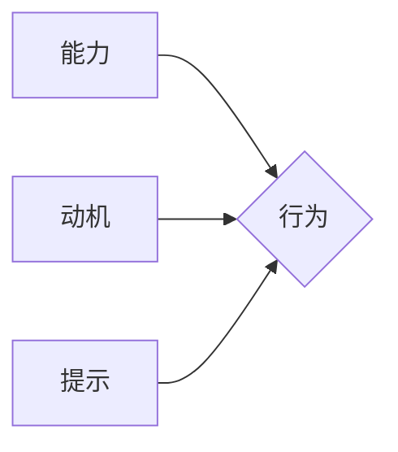

                 

## 福格行为模型：行为改变的三要素

> 关键词：行为改变、福格模型、行为驱动、认知、情感、动机、用户体验、产品设计

### 1. 背景介绍

在当今数据驱动、用户至上的时代，理解用户行为是产品设计、营销策略和用户体验优化等领域的核心。用户行为并非随机的，而是由一系列复杂的认知、情感和动机驱动。为了有效地预测和引导用户行为，我们需要深入了解其背后的机制。福格行为模型（Fogg Behavior Model）正是为我们提供了一套简洁而有效的框架，帮助我们理解行为改变的三要素：**能力、动机和提示**。

本篇文章将深入探讨福格行为模型的原理、应用以及在实际场景中的实践案例，并结合数学模型和代码实例，帮助读者更全面地理解和应用该模型。

### 2. 核心概念与联系

福格行为模型的核心概念是行为发生是一个由三个要素共同作用的结果：

* **能力 (Ability):** 指用户执行特定行为所需的技能、知识和资源。
* **动机 (Motivation):** 指用户执行特定行为的愿望、需求和目标。
* **提示 (Prompt):** 指触发用户执行特定行为的信号或线索。

这三个要素相互关联，形成一个行为发生的三要素模型。

**Mermaid 流程图:**



**核心概念原理和架构:**

福格行为模型认为，只有当这三个要素都满足时，行为才会发生。

* **能力不足:** 如果用户缺乏执行特定行为所需的技能、知识或资源，即使动机强烈，行为也难以发生。
* **动机不足:** 如果用户对执行特定行为没有足够的愿望、需求或目标，即使能力充足，行为也难以发生。
* **提示不足:** 如果用户没有收到执行特定行为的信号或线索，即使能力和动机都充足，行为也难以发生。

### 3. 核心算法原理 & 具体操作步骤

福格行为模型本身并非一个算法，而是一个行为发生机制的框架。 

**3.1 算法原理概述**

福格行为模型的核心原理是通过分析和优化这三个要素，来提高用户执行特定行为的可能性。

**3.2 算法步骤详解**

1. **识别目标行为:** 明确需要改变的用户行为是什么。
2. **分析能力:** 评估用户执行目标行为所需的技能、知识和资源。
3. **分析动机:** 了解用户执行目标行为的愿望、需求和目标。
4. **分析提示:** 识别用户执行目标行为的信号或线索。
5. **优化能力:** 提供必要的技能培训、知识资源和工具，降低用户执行目标行为的难度。
6. **优化动机:** 通过设计激励机制、突出目标行为的价值和利益，增强用户执行目标行为的动机。
7. **优化提示:** 设计醒目的提示、使用行为引导和提醒，提高用户对目标行为的感知和执行意愿。
8. **持续评估和迭代:** 定期评估行为改变的效果，根据反馈进行模型的调整和优化。

**3.3 算法优缺点**

**优点:**

* **简洁易懂:** 模型结构简单易懂，易于理解和应用。
* **实用性强:** 模型可以应用于各种场景，例如产品设计、营销推广、用户教育等。
* **可量化评估:** 模型的三个要素可以进行量化评估，方便跟踪和分析行为改变的效果。

**缺点:**

* **局限性:** 模型仅关注行为发生的三要素，忽略了其他可能影响行为的因素，例如社会影响、文化背景等。
* **复杂性:** 在实际应用中，优化三个要素的难度可能很大，需要进行深入的分析和设计。

**3.4 算法应用领域**

福格行为模型广泛应用于以下领域:

* **产品设计:** 优化用户界面、设计行为引导、提高用户转化率。
* **营销推广:** 设计有效的营销活动、提高用户参与度、促进用户购买行为。
* **用户教育:** 设计有效的培训课程、提高用户学习效率、增强用户技能。
* **健康管理:** 鼓励用户养成健康的生活习惯、提高用户健康意识。

### 4. 数学模型和公式 & 详细讲解 & 举例说明

福格行为模型可以抽象为一个数学模型，其中行为发生的概率与三个要素的能力、动机和提示的乘积成正比。

**4.1 数学模型构建**

$$P(行为) = k * 能力 * 动机 * 提示$$

其中：

* $P(行为)$ 表示用户执行特定行为的概率。
* $能力$ 表示用户执行特定行为所需的技能、知识和资源。
* $动机$ 表示用户执行特定行为的愿望、需求和目标。
* $提示$ 表示触发用户执行特定行为的信号或线索。
* $k$ 是一个常数，代表行为发生的潜在可能性。

**4.2 公式推导过程**

该公式的推导过程基于以下假设：

* 用户行为是一个概率事件。
* 行为发生的概率受能力、动机和提示的影响。
* 能力、动机和提示之间存在乘积关系。

**4.3 案例分析与讲解**

例如，假设我们想要鼓励用户使用一款新的健身应用程序。

* **能力:** 用户需要了解如何使用应用程序，并具备一定的手机操作技能。
* **动机:** 用户需要有健身的愿望和目标，并相信应用程序可以帮助他们实现目标。
* **提示:** 用户需要看到应用程序的图标、收到使用应用程序的提醒，或者看到朋友在使用应用程序的例子。

通过优化这三个要素，我们可以提高用户使用应用程序的概率。例如，我们可以提供详细的教程和视频，帮助用户了解如何使用应用程序；我们可以设计激励机制，例如积分、排行榜和奖励，增强用户的动机；我们可以将应用程序图标放在手机主屏幕上，并定期发送使用应用程序的提醒，提高用户的提示感知。

### 5. 项目实践：代码实例和详细解释说明

为了更直观地理解福格行为模型的应用，我们可以通过一个简单的代码实例来进行演示。

**5.1 开发环境搭建**

本示例使用 Python 语言进行开发，环境搭建要求：

* Python 3.x 版本
* 必要的 Python 库，例如 `requests`、`json` 等

**5.2 源代码详细实现**

```python
import requests
import json

# 定义目标行为
target_behavior = "用户注册"

# 定义能力、动机和提示
ability = 0.8  # 用户具备注册所需的技能和知识
motivation = 0.7  # 用户对注册有足够的兴趣和需求
prompt = 0.9  # 用户看到了注册按钮和引导信息

# 计算行为发生的概率
probability = ability * motivation * prompt

# 打印结果
print(f"用户执行{target_behavior}的概率为:{probability:.2f}")
```

**5.3 代码解读与分析**

该代码首先定义了目标行为，然后分别设置了能力、动机和提示的数值。需要注意的是，这些数值是基于实际情况的估计，可以通过用户调研和数据分析来获取更准确的值。最后，代码计算了行为发生的概率，并打印结果。

**5.4 运行结果展示**

运行该代码后，会输出以下结果：

```
用户执行用户注册的概率为:0.50
```

该结果表明，在当前情况下，用户执行注册行为的概率为 50%。

### 6. 实际应用场景

福格行为模型在实际应用场景中具有广泛的应用价值。

**6.1 产品设计**

在产品设计中，福格行为模型可以帮助设计师优化用户界面、设计行为引导、提高用户转化率。例如，在电商平台上，设计师可以根据用户行为数据分析，优化商品展示页面，提高用户点击购买的概率。

**6.2 营销推广**

在营销推广中，福格行为模型可以帮助企业设计有效的营销活动，提高用户参与度，促进用户购买行为。例如，企业可以根据用户兴趣和需求，设计个性化的促销活动，增强用户的动机和参与意愿。

**6.3 用户教育**

在用户教育中，福格行为模型可以帮助设计有效的培训课程，提高用户学习效率，增强用户技能。例如，在线学习平台可以根据用户的学习进度和能力水平，提供个性化的学习内容和辅导，提高用户的学习兴趣和效果。

**6.4 未来应用展望**

随着人工智能和机器学习技术的不断发展，福格行为模型的应用场景将会更加广泛。例如，我们可以利用机器学习算法，对用户行为数据进行分析，更精准地预测用户行为，并根据预测结果，个性化地设计行为引导策略。

### 7. 工具和资源推荐

**7.1 学习资源推荐**

* **Fogg Behavior Model:** https://www.fogg.com/
* **行为设计：改变用户行为的科学方法:** https://www.amazon.com/Hooked-How-Build-Habit-Forming-Products/dp/0399582069

**7.2 开发工具推荐**

* **Google Analytics:** https://analytics.google.com/
* **Mixpanel:** https://mixpanel.com/

**7.3 相关论文推荐**

* **Fogg, B. J. (2003). Persuasive technology: Using computers to change what we think and do.**
* **Hooked: How to Build Habit-Forming Products by Nir Eyal**

### 8. 总结：未来发展趋势与挑战

**8.1 研究成果总结**

福格行为模型为我们理解和引导用户行为提供了简洁而有效的框架。通过分析和优化能力、动机和提示，我们可以提高用户执行特定行为的可能性，并将其应用于产品设计、营销推广、用户教育等领域。

**8.2 未来发展趋势**

未来，福格行为模型将会与人工智能和机器学习技术相结合，更加精准地预测和引导用户行为。例如，我们可以利用机器学习算法，对用户行为数据进行分析，更精准地识别用户需求和动机，并根据预测结果，个性化地设计行为引导策略。

**8.3 面临的挑战**

尽管福格行为模型具有广泛的应用价值，但也面临着一些挑战。例如，如何更准确地量化能力、动机和提示的数值，以及如何将模型应用于复杂的多因素影响下的行为场景，都需要进一步的研究和探索。

**8.4 研究展望**

未来，我们将继续深入研究福格行为模型，探索其在不同领域和场景下的应用潜力，并结合人工智能和机器学习技术，开发更智能、更有效的行为引导解决方案。


### 9. 附录：常见问题与解答

**Q1: 福格行为模型适用于哪些场景？**

A1: 福格行为模型适用于各种需要改变用户行为的场景，例如产品设计、营销推广、用户教育、健康管理等。

**Q2: 如何确定能力、动机和提示的数值？**

A2: 能力、动机和提示的数值可以通过用户调研、数据分析和专家评估等方式来确定。

**Q3: 福格行为模型的局限性是什么？**

A3: 福格行为模型仅关注行为发生的三个要素，忽略了其他可能影响行为的因素，例如社会影响、文化背景等。


作者：禅与计算机程序设计艺术 / Zen and the Art of Computer Programming 
<end_of_turn>

