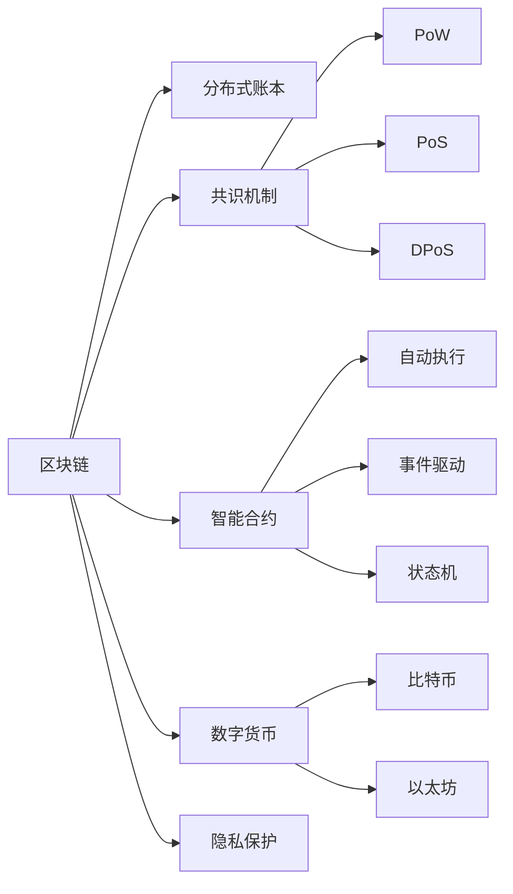

                 

# 区块链技术：去中心化应用开发

## 1. 背景介绍

区块链技术自2008年由中本聪提出以来，已经在金融、供应链、智能合约等多个领域实现了初步应用。它通过去中心化、不可篡改、透明公开等特点，为解决信任、共识等问题提供了全新的思路和方案。本文将从区块链技术的基础概念出发，探讨其核心原理、核心算法、实际应用，并展望未来发展趋势与挑战。

## 2. 核心概念与联系

### 2.1 核心概念概述

在深入探讨区块链技术之前，首先需要了解几个核心概念：

- **区块链**：一种去中心化的分布式账本技术，基于共识机制、加密技术和分布式网络构建。区块链中的每个区块都包含一定时间段内的交易记录，并通过密码学手段确保安全性。

- **共识机制**：区块链网络中，所有节点达成一致的算法或规则，用于验证交易和生成区块。常见的共识机制有PoW、PoS、DPoS等。

- **智能合约**：一种在区块链上运行的脚本程序，实现自动化的合约执行。智能合约通常包括事件触发条件、执行逻辑、资金流动等部分。

- **数字货币**：区块链上的原生资产，如比特币(Bitcoin)、以太坊(Ethereum)等。数字货币的生成、流通、储存均基于区块链技术。

- **隐私保护**：区块链强调数据透明，但也存在隐私泄露的问题。常见的隐私保护技术包括零知识证明、同态加密等。

这些核心概念之间通过加密、分布式、共识等机制相互联系，共同构建了区块链技术的基本框架。

### 2.2 核心概念原理和架构的 Mermaid 流程图



## 3. 核心算法原理 & 具体操作步骤

### 3.1 算法原理概述

区块链的核心算法原理基于密码学、分布式网络、共识机制等技术，涵盖以下关键环节：

1. **哈希函数**：将任意长度的数据映射为固定长度的哈希值，保证数据唯一性。常见的哈希算法有SHA-256、RIPEMD-160等。

2. **数字签名**：保证数据传输的安全性，防止篡改。数字签名基于非对称加密技术，通过公钥加密，私钥解密来实现。

3. **共识算法**：维护网络中的交易和区块的合法性，防止双重支付等问题。常见的共识算法有工作量证明(PoW)、权益证明(PoS)、委托权益证明(DPoS)等。

4. **分布式网络**：通过节点间去中心化的通信和数据交换，实现区块链的透明性和不可篡改性。

5. **智能合约**：通过脚本语言编写的自动化程序，实现区块链上的逻辑和操作。

这些算法和技术相互交织，构建了区块链的完整生态系统。

### 3.2 算法步骤详解

区块链的去中心化应用开发一般包括以下几个步骤：

1. **部署区块链平台**：选择合适的区块链平台，如Ethereum、Hyperledger Fabric等，搭建区块链网络环境。

2. **设计智能合约**：根据具体应用场景，设计智能合约的逻辑和操作，编写Solidity、Go等脚本语言代码。

3. **部署智能合约**：将编写的智能合约代码上传到区块链平台，进行编译和部署。

4. **发起交易和调用合约**：通过区块链平台提供的接口，发起交易、调用智能合约，执行相应的操作。

5. **维护和升级合约**：根据实际需求，对智能合约进行维护和升级，确保其功能和性能。

6. **安全性验证**：通过安全测试和审计，确保智能合约的安全性和稳定性。

### 3.3 算法优缺点

区块链技术的优点包括：

- **去中心化**：不需要中心化机构，减少信任风险，提高数据透明性。
- **不可篡改**：通过加密和共识机制，保证数据的一致性和不可篡改性。
- **高安全性**：数字签名和哈希函数等技术保证了交易的安全性。
- **可追溯性**：所有交易和操作都有记录，便于追踪和审计。

同时，区块链技术也存在以下缺点：

- **交易速度慢**：由于去中心化和共识机制，区块链的交易速度较慢。
- **存储成本高**：每个区块都需要存储所有交易记录，占用大量存储空间。
- **扩展性有限**：现有的区块链平台面临扩展性和性能瓶颈。

### 3.4 算法应用领域

区块链技术已经在金融、供应链、医疗、投票、版权等多个领域实现了实际应用。例如：

- **金融**：比特币和以太坊等数字货币的交易，智能合约的自动执行等。
- **供应链**：物流追踪、溯源认证等。
- **医疗**：电子健康记录、药品追踪等。
- **投票**：去中心化的电子投票系统。
- **版权**：版权登记和版权交易等。

未来，随着区块链技术的不断演进，其应用场景将更加广泛，可能涉及身份认证、物联网、隐私保护等领域。

## 4. 数学模型和公式 & 详细讲解 & 举例说明

### 4.1 数学模型构建

区块链的数学模型基于密码学算法，涵盖以下几个方面：

1. **哈希函数**：$h:\{0,1\}^* \rightarrow \{0,1\}^n$，将任意长度的数据映射为固定长度的哈希值。

2. **数字签名**：基于公钥加密、私钥解密的非对称加密算法，保证交易的安全性。

3. **共识算法**：通过共识机制达成网络中的交易和区块合法性，如PoW中的工作量证明机制：
   $$
   \text{Proof of Work} = \sum_{i=1}^{N} h(x_i)
   $$

4. **智能合约**：通过脚本语言编写的自动化程序，实现区块链上的逻辑和操作。

### 4.2 公式推导过程

以数字签名算法为例，推导其基本流程：

1. 生成密钥对：生成一对公钥$P$和私钥$S$。
2. 签名生成：使用私钥$S$对原始数据$M$进行加密，得到签名值$S_M$。
3. 验证签名：使用公钥$P$对签名值$S_M$进行解密，得到原始数据$M$，验证其是否与原始数据一致。

推导过程如下：
$$
S_M = S^{-1}(H(M) \oplus A)
$$
$$
M' = D(S_M, P)
$$
其中$H$为哈希函数，$\oplus$为异或运算。

### 4.3 案例分析与讲解

以智能合约为例，分析其工作流程：

1. **合约部署**：将智能合约代码上传区块链平台，进行编译和部署。
2. **事件触发**：用户通过接口触发智能合约中的事件，如转账。
3. **执行逻辑**：智能合约根据事件触发条件，执行相应的操作，如转移资金。
4. **状态更新**：更新区块链中的状态，确保数据一致性。

## 5. 项目实践：代码实例和详细解释说明

### 5.1 开发环境搭建

在进行区块链项目开发之前，需要搭建相应的开发环境。以下是使用以太坊进行智能合约开发的Python开发环境配置：

1. 安装Python：从官网下载并安装Python，建议使用3.8及以上版本。
2. 安装ethereum库：通过pip安装ethereum库，支持Python3和以太坊智能合约开发。
3. 安装Solidity编译器：从官网下载安装Solidity编译器，用于编译智能合约代码。
4. 安装Truffle框架：通过npm安装Truffle框架，支持智能合约测试和部署。

完成上述步骤后，即可在本地搭建以太坊开发环境，开始智能合约的开发和测试。

### 5.2 源代码详细实现

以下是一个简单的以太坊智能合约，实现转账功能：

```python
from eth import EVM
from eth.abi import abi_encode
from eth.abi import abi_decode

def send_eth(to_address, amount):
    abi = """
    function transfer(address payable _to) public returns (bool)
    """
    f = EVM.construct_function_abi(abi)
    encoded_abi = abi_encode([None], [to_address, amount])
    result = EVM.execute(abi)
    tx_hash = EVM.encode_transaction(to_address, encoded_abi)
    return tx_hash
```

该代码使用eth库实现以太坊智能合约的部署和执行。具体步骤包括：

1. 定义智能合约的ABI(应用二进制接口)，实现转账函数。
2. 通过EVM库构建函数ABI，生成编码后的ABI。
3. 使用ABI和编码后的ABI，生成以太坊交易哈希。

### 5.3 代码解读与分析

**ABI定义**：
智能合约的ABI定义了函数调用的参数和返回值。在本例中，转账函数的ABI定义为：

```
function transfer(address payable _to) public returns (bool)
```

**编码和解码**：
智能合约的参数和返回值需要通过编码和解码来实现。在本例中，发送以太币的参数为接收地址和金额，返回值为交易状态。

**交易哈希**：
以太坊的交易哈希是由接收地址和编码后的ABI生成的。在本例中，通过调用EVM库的`encode_transaction`方法，生成交易哈希。

## 6. 实际应用场景

### 6.1 智能合约融资平台

基于区块链技术的智能合约融资平台，通过自动化执行合约，降低了融资双方的信任风险，简化了操作流程。用户可以创建智能合约，设定融资规则、利率、期限等参数，并通过以太坊智能合约实现自动放贷、还款等功能。

### 6.2 供应链金融

区块链技术可以应用于供应链金融，通过智能合约实现货物的追踪和认证，确保交易的透明性和不可篡改性。例如，物流公司可以将货物信息上传区块链，供下游企业查询和验证，防止假冒伪劣商品流入市场。

### 6.3 版权登记与交易

区块链技术可以用于版权登记和版权交易，通过智能合约实现版权信息的上传和查询，版权交易的自动执行等功能。用户可以在区块链上登记版权信息，通过智能合约实现自动交易和支付。

### 6.4 未来应用展望

随着区块链技术的不断演进，未来区块链的应用场景将更加广泛，可能涉及身份认证、物联网、隐私保护等领域。以下是一些可能的未来应用：

- **身份认证**：基于区块链技术，实现去中心化的身份认证，提高身份信息的可信度。
- **物联网**：通过区块链技术实现设备间的去中心化通信，增强物联网系统的安全性。
- **隐私保护**：利用区块链的加密技术，保护用户数据隐私，防止数据泄露和滥用。

## 7. 工具和资源推荐

### 7.1 学习资源推荐

为了帮助开发者系统掌握区块链技术，以下是一些优质的学习资源：

1. **《区块链原理与技术》书籍**：详细介绍了区块链技术的原理、算法和应用，适合初学者和进阶学习者。
2. **Ethereum官方文档**：以太坊官方提供的文档，涵盖智能合约开发、网络搭建、交易处理等内容，是学习以太坊智能合约开发的必备资料。
3. **Truffle框架**：Truffle框架提供了智能合约开发的集成开发环境，支持编译、测试和部署，是开发以太坊智能合约的常用工具。
4. **Solidity官方文档**：Solidity官方提供的文档，详细介绍了Solidity语言的语法和用法，是开发以太坊智能合约的重要参考。

### 7.2 开发工具推荐

以下是几款用于区块链项目开发的常用工具：

1. **Ganache**：以太坊本地测试网络，支持快速搭建测试环境和智能合约测试。
2. **Remix IDE**：以太坊智能合约开发集成开发环境，提供丰富的工具和插件。
3. **Node.js**：支持智能合约的编译、测试和部署，是开发以太坊智能合约的重要工具。
4. **Truffle TruffleBox**：Truffle提供的快速搭建区块链项目环境的工具，方便开发者快速上手。

### 7.3 相关论文推荐

区块链技术的研究文献丰富，以下是一些具有代表性的论文：

1. **比特币：一种点对点的电子现金系统**：中本聪的经典论文，首次提出了比特币系统。
2. **以太坊白皮书**：以太坊的创始团队发布的白皮书，详细介绍了以太坊的技术架构和应用前景。
3. **Hyperledger Fabric技术白皮书**：Hyperledger Fabric的创始团队发布的文档，详细介绍了Hyperledger Fabric的技术细节和应用场景。
4. **区块链的可扩展性研究**：探讨区块链的可扩展性问题，提出了一系列解决方案，如分片、链上链下等。

## 8. 总结：未来发展趋势与挑战

### 8.1 总结

本文从区块链技术的基础概念出发，探讨了其核心原理、核心算法、实际应用，并展望了未来发展趋势与挑战。通过详细讲解区块链的数学模型、实际应用和开发实践，帮助读者系统掌握区块链技术。

区块链技术作为一种去中心化的分布式账本技术，已经应用于金融、供应链、智能合约等多个领域。未来，随着技术的不断演进，区块链的应用场景将更加广泛，可能涉及身份认证、物联网、隐私保护等领域。

### 8.2 未来发展趋势

未来区块链技术的发展趋势包括：

1. **可扩展性**：通过分片、链上链下、状态通道等技术，解决区块链的扩展性问题。
2. **互操作性**：实现不同区块链平台之间的互操作性，打破数据孤岛，实现数据的互联互通。
3. **去中心化身份认证**：利用区块链技术实现去中心化的身份认证，提高身份信息的可信度。
4. **跨链交易**：实现不同区块链平台之间的跨链交易，提高交易效率和安全性。
5. **隐私保护**：利用区块链的加密技术，保护用户数据隐私，防止数据泄露和滥用。

### 8.3 面临的挑战

区块链技术在发展过程中面临以下挑战：

1. **扩展性问题**：当前区块链的扩展性仍存在瓶颈，交易速度慢、存储成本高。
2. **安全性问题**：区块链面临51%攻击、双花攻击等安全威胁。
3. **互操作性问题**：不同区块链平台之间的互操作性尚未完全解决，数据共享和交易复杂。
4. **隐私保护问题**：区块链的透明性带来隐私保护问题，如何平衡隐私保护和数据透明性是一大挑战。
5. **开发者门槛高**：区块链技术复杂，入门门槛高，需要掌握密码学、分布式系统等专业知识。

### 8.4 研究展望

未来区块链技术的研究方向包括：

1. **可扩展性研究**：通过分片、链上链下、状态通道等技术，解决区块链的扩展性问题。
2. **安全性研究**：研究51%攻击、双花攻击等安全问题，提出新的安全机制和算法。
3. **互操作性研究**：实现不同区块链平台之间的互操作性，打破数据孤岛，实现数据的互联互通。
4. **隐私保护研究**：利用区块链的加密技术，保护用户数据隐私，防止数据泄露和滥用。
5. **开发者友好性研究**：降低区块链技术的入门门槛，提供更易用的开发工具和框架。

## 9. 附录：常见问题与解答

**Q1：区块链的扩展性问题如何解决？**

A: 区块链的扩展性问题可以通过以下技术来解决：

1. **分片**：将区块链划分为多个分片，并行处理交易，提高交易速度。
2. **链上链下**：将交易和数据存储在链下，链上只存储关键信息，减少存储成本。
3. **状态通道**：通过状态通道技术，实现链下交易，提高交易效率。
4. **二层协议**：通过二层协议，如Plasma、Rollup等，实现更高效的交易和数据处理。

**Q2：区块链的互操作性问题如何解决？**

A: 区块链的互操作性问题可以通过以下技术来解决：

1. **跨链桥**：实现不同区块链平台之间的跨链交易，提高互操作性。
2. **跨链协议**：通过跨链协议，实现不同区块链平台之间的数据共享和通信。
3. **共识机制**：研究新的共识机制，实现不同区块链平台之间的共识。
4. **标准化**：制定区块链的标准化协议和接口，促进不同区块链平台之间的互操作性。

**Q3：如何保护区块链的隐私？**

A: 区块链的隐私保护可以通过以下技术来实现：

1. **零知识证明**：通过零知识证明技术，实现数据的隐私保护。
2. **同态加密**：通过同态加密技术，实现数据的隐私保护。
3. **数据脱敏**：对敏感数据进行脱敏处理，保护用户隐私。
4. **匿名交易**：通过匿名交易技术，保护交易主体的隐私。

**Q4：区块链技术的入门门槛如何降低？**

A: 区块链技术的入门门槛可以通过以下方法来降低：

1. **提供易用的开发工具和框架**：提供易用的区块链开发工具和框架，降低开发者入门门槛。
2. **提供丰富的学习资源**：提供丰富的学习资源，如书籍、文档、教程等，帮助开发者系统掌握区块链技术。
3. **降低学习成本**：通过社区和平台，提供免费的区块链学习资源和开发工具，降低学习成本。
4. **提供实战项目**：提供实际的区块链项目，让开发者在实践中学习和提升。

**Q5：区块链的安全性如何保障？**

A: 区块链的安全性可以通过以下方法来保障：

1. **共识机制**：通过共识机制，实现网络中的交易和区块合法性。
2. **加密技术**：通过加密技术，保证交易和数据的安全性。
3. **多签名机制**：通过多签名机制，提高交易的安全性。
4. **审计和验证**：通过审计和验证，确保智能合约和交易的安全性。

---

作者：禅与计算机程序设计艺术 / Zen and the Art of Computer Programming

