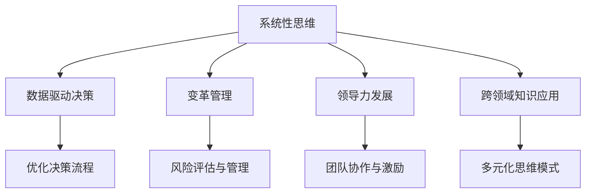

                 

# 卓越管理者的思维修炼之路

## 1. 背景介绍

### 1.1 问题由来
在快速变化的市场环境中，企业竞争日益激烈。卓越的管理者需要具备快速决策、应对复杂多变环境的能力。而传统的管理理论和方法，已难以应对新的挑战，尤其是不确定性因素的增多，使得企业管理面临前所未有的困难。为了适应新环境，管理者需要转变思维方式，构建新型的领导力模型。

### 1.2 问题核心关键点
为了应对新环境下的管理挑战，卓越管理者的思维修炼需要关注以下几个核心关键点：

1. **系统性思维**：理解组织内外系统的复杂关系，掌握系统性分析方法。
2. **数据驱动决策**：利用数据进行科学决策，提升决策的准确性和前瞻性。
3. **变革管理**：有效管理变革，确保组织在快速变化的市场环境中持续成长。
4. **领导力发展**：培养和提升领导力，构建高效团队和企业文化。
5. **跨领域知识应用**：结合管理学、心理学、经济学等多学科知识，提升综合管理能力。

这些关键点构成了卓越管理者思维修炼的核心内容，帮助管理者在复杂多变的环境中，做出高质量的决策，带领组织实现持续发展。

### 1.3 问题研究意义
卓越管理者的思维修炼，对于提升企业管理水平、增强组织竞争力具有重要意义：

1. **提升决策质量**：数据驱动决策帮助管理者避免经验主义，提升决策的科学性和前瞻性。
2. **促进组织变革**：变革管理能力使管理者能够有效应对环境变化，推动组织持续创新。
3. **培养高效团队**：领导力发展使管理者能够构建高效团队，提升组织整体效能。
4. **强化跨领域知识**：跨领域知识的应用使管理者能够应对复杂的组织挑战，实现综合管理。

通过系统的思维修炼，卓越管理者能够更好地理解和管理组织，提升整体绩效和长期发展能力。

## 2. 核心概念与联系

### 2.1 核心概念概述

为了更好地理解卓越管理者的思维修炼，本节将介绍几个密切相关的核心概念：

1. **系统性思维**：以系统的视角来分析问题，理解系统内各要素间的相互作用关系，寻找最优解决方案。
2. **数据驱动决策**：利用数据分析进行决策，提升决策的科学性和可靠性。
3. **变革管理**：通过科学的方法，管理组织的变革过程，确保变革顺利进行。
4. **领导力发展**：通过学习和实践，提升领导力，成为高效的领导者。
5. **跨领域知识应用**：将管理学、心理学、经济学等不同领域的知识应用于企业管理中，提升综合管理能力。

这些核心概念之间的逻辑关系可以通过以下Mermaid流程图来展示：



这个流程图展示出各个核心概念之间的联系：

1. **系统性思维**是基础，帮助管理者理解复杂的组织系统。
2. **数据驱动决策**建立在系统分析基础上，提升决策的科学性。
3. **变革管理**关注组织在动态环境中的适应性，确保变革的平稳进行。
4. **领导力发展**培养管理者在团队和组织中的领导能力。
5. **跨领域知识应用**使管理者具备更宽广的视野，应对多领域挑战。

这些概念共同构成了卓越管理者思维修炼的基本框架，帮助管理者在不同场景下做出明智决策。

## 3. 核心算法原理 & 具体操作步骤
### 3.1 算法原理概述

卓越管理者的思维修炼，本质上是一种系统化、数据驱动、变革导向的领导力提升过程。其核心思想是通过科学的方法，构建高效的管理体系，提升组织绩效。

形式化地，假设管理者 $M$ 需要管理的组织系统为 $S$，其目标函数为 $F(S)$。管理的目的是最大化 $F(S)$。通过系统性思维、数据驱动决策、变革管理、领导力发展和跨领域知识应用，管理者 $M$ 优化组织系统 $S$，最终达到目标 $F(S)$ 的最大化。

### 3.2 算法步骤详解

卓越管理者的思维修炼，通常包括以下几个关键步骤：

**Step 1: 数据收集与分析**
- 收集组织内外的相关数据，包括财务数据、客户反馈、员工绩效等。
- 利用统计分析、可视化工具等，对数据进行整理和分析，发现问题和趋势。

**Step 2: 系统性思维**
- 构建组织系统的模型，识别系统内各要素间的相互作用关系。
- 应用系统动力学等方法，分析系统行为和变化规律。
- 识别系统的关键控制点，寻找改进策略。

**Step 3: 数据驱动决策**
- 利用数据分析工具（如Python、R、Tableau等），构建预测模型，支持决策。
- 结合专家经验和数据结果，做出科学合理的决策。

**Step 4: 变革管理**
- 识别变革的驱动因素和阻力点。
- 制定变革计划，实施变革管理策略，确保变革顺利进行。
- 实时监控变革进展，及时调整策略。

**Step 5: 领导力发展**
- 通过培训、实践和反思，提升领导者的沟通、激励、协调等能力。
- 建立高效的领导团队，推动组织变革和创新。

**Step 6: 跨领域知识应用**
- 结合管理学、心理学、经济学等领域的知识，提升综合管理能力。
- 学习跨领域案例，借鉴成功经验，解决组织挑战。

### 3.3 算法优缺点

卓越管理者的思维修炼方法具有以下优点：

1. **科学性**：利用数据和系统分析，提升决策的科学性和可靠性。
2. **前瞻性**：通过系统思维和跨领域知识，提升决策的前瞻性和战略性。
3. **适应性**：通过变革管理，确保组织在快速变化的市场环境中持续成长。
4. **执行力**：领导力发展使管理者能够构建高效团队，推动决策执行。

同时，该方法也存在一定的局限性：

1. **数据质量依赖**：数据驱动决策依赖于高质量的数据，数据收集和处理成本较高。
2. **复杂性高**：系统思维和变革管理需要较高的专业知识和经验，实施难度较大。
3. **文化变革难**：变革管理涉及组织文化和制度的调整，短期内难以见效。
4. **个体差异**：领导力发展需要个体的持续努力和实践，效果因人而异。

尽管存在这些局限性，但就目前而言，数据驱动和系统化思维是卓越管理者思维修炼的主流范式。未来相关研究的重点在于如何进一步降低数据收集成本，提高系统的易用性，同时兼顾文化变革和个体差异等因素。

### 3.4 算法应用领域

卓越管理者的思维修炼方法，在各种管理场景中已经得到了广泛的应用，例如：

1. **组织战略规划**：利用系统性思维和数据驱动决策，制定科学的组织战略。
2. **运营管理**：通过系统性思维和变革管理，优化运营流程，提升效率。
3. **人力资源管理**：通过领导力发展和变革管理，优化人力资源配置，提升员工满意度。
4. **市场营销**：利用数据驱动决策和跨领域知识，制定有效的市场策略。
5. **财务管理**：通过系统性思维和数据驱动决策，优化财务流程，提升财务绩效。

除了上述这些经典场景外，卓越管理者的思维修炼还被创新性地应用到更多领域中，如创新管理、项目管理和风险管理等，为管理者的职业生涯发展提供新的工具和方法。

## 4. 数学模型和公式 & 详细讲解 & 举例说明（备注：数学公式请使用latex格式，latex嵌入文中独立段落使用 $$，段落内使用 $)
### 4.1 数学模型构建

本节将使用数学语言对卓越管理者的思维修炼过程进行更加严格的刻画。

假设组织系统为 $S$，其目标函数为 $F(S)$。管理者的决策过程为 $D$，系统状态为 $X$，管理者可控变量为 $U$。则管理者的目标可以表示为：

$$
\max_{D} F(S) = \max_{D} \int_{0}^T f(X(t),D(t),U(t))dt + g(X(T),D(T),U(T))
$$

其中 $f$ 为目标函数的时间导数，$g$ 为边界条件。

管理者的决策过程 $D$ 可以表示为：

$$
D = D(X(t),U(t),D(t-1))
$$

其中 $X(t)$ 为系统状态，$U(t)$ 为管理者可控变量，$D(t-1)$ 为历史决策。

管理者的目标函数 $F(S)$ 可以表示为：

$$
F(S) = \sum_{i=1}^N p_i f_i(X_i(t),D(t),U(t)) + g_i(X_i(T),D(T),U(T))
$$

其中 $p_i$ 为权重系数，$f_i$ 和 $g_i$ 为各目标函数的分量。

### 4.2 公式推导过程

以下我们以组织战略规划为例，推导数据驱动决策和系统性思维的数学模型。

假设组织在当前时间点的系统状态为 $X_0$，管理者可控变量为 $U_0$，历史决策为 $D_0$。目标函数为 $F(S)$，其分为短期和长期目标。则目标函数可以表示为：

$$
F(S) = F_{short}(X(t),D(t),U(t)) + \lambda F_{long}(X(t+\Delta t),D(t+\Delta t),U(t+\Delta t))
$$

其中 $\lambda$ 为长期目标的权重系数。

管理者的决策过程 $D$ 可以表示为：

$$
D = D(X(t),U(t),D(t-1))
$$

将上述公式代入目标函数，得：

$$
\max_{D} F(S) = \max_{D} \int_{0}^T f(X(t),D(t),U(t))dt + g(X(T),D(T),U(T))
$$

其中 $f$ 为目标函数的时间导数，$g$ 为边界条件。

利用系统动力学等方法，可以进一步分析系统行为和变化规律，识别系统的关键控制点，寻找改进策略。

### 4.3 案例分析与讲解

假设某公司需要制定未来五年的战略规划。其短期目标为提升销售增长率，长期目标为实现可持续发展。则目标函数可以表示为：

$$
F(S) = f_{sales}(x_{sales},d_{sales},u_{sales}) + \lambda f_{sustain}(x_{sustain},d_{sustain},u_{sustain})
$$

其中 $f_{sales}$ 和 $f_{sustain}$ 为销售增长率和可持续发展的目标函数，$x_{sales}$ 和 $x_{sustain}$ 为对应的系统状态，$d_{sales}$ 和 $d_{sustain}$ 为对应的决策变量，$u_{sales}$ 和 $u_{sustain}$ 为对应的可控变量。

利用系统动力学方法，可以构建系统的因果关系图，识别关键变量和控制点。例如，通过分析销售和市场的关系，可以发现价格、广告支出、产品创新等关键因素，从而制定有效的销售策略。

在实际应用中，管理者还需要结合数据驱动决策，利用历史销售数据和市场调研数据，构建预测模型，支持战略规划决策。同时，通过变革管理，推动组织文化和管理体系的调整，确保战略规划的顺利实施。

## 5. 项目实践：代码实例和详细解释说明
### 5.1 开发环境搭建

在进行思维修炼实践前，我们需要准备好开发环境。以下是使用Python进行Pandas和NumPy开发的环境配置流程：

1. 安装Anaconda：从官网下载并安装Anaconda，用于创建独立的Python环境。

2. 创建并激活虚拟环境：
```bash
conda create -n management-env python=3.8 
conda activate management-env
```

3. 安装Pandas和NumPy：
```bash
conda install pandas numpy
```

4. 安装Scikit-learn和其他相关库：
```bash
conda install scikit-learn matplotlib seaborn jupyter notebook ipython
```

完成上述步骤后，即可在`management-env`环境中开始思维修炼实践。

### 5.2 源代码详细实现

下面我们以组织战略规划为例，给出使用Pandas和NumPy对数据进行系统性分析和预测的Python代码实现。

首先，准备数据集：

```python
import pandas as pd
import numpy as np

# 加载数据
data = pd.read_csv('strategy_data.csv')

# 清洗数据
data.dropna(inplace=True)

# 特征工程
X = data[['market_size', 'competition_level', 'innovation_rate']]
y = data['sales_growth_rate']
```

然后，构建模型进行系统性分析：

```python
from sklearn.ensemble import RandomForestRegressor
from sklearn.model_selection import train_test_split

# 划分训练集和测试集
X_train, X_test, y_train, y_test = train_test_split(X, y, test_size=0.2, random_state=42)

# 构建模型
model = RandomForestRegressor(n_estimators=100, random_state=42)

# 训练模型
model.fit(X_train, y_train)

# 预测并评估
y_pred = model.predict(X_test)
r2_score = model.score(X_test, y_test)

print(f'R^2 score: {r2_score:.2f}')
```

接着，利用预测结果进行数据驱动决策：

```python
# 绘制预测结果
plt.scatter(y_test, y_pred)
plt.xlabel('Actual Sales Growth Rate')
plt.ylabel('Predicted Sales Growth Rate')
plt.title('Sales Growth Rate Prediction')
plt.show()

# 绘制误差分布
plt.hist((y_pred - y_test), bins=20, edgecolor='black')
plt.xlabel('Error')
plt.ylabel('Frequency')
plt.title('Error Distribution')
plt.show()
```

### 5.3 代码解读与分析

让我们再详细解读一下关键代码的实现细节：

**数据处理**：
- 使用Pandas加载和清洗数据集，构建特征矩阵和目标变量。
- 利用Scikit-learn库进行模型训练和评估。

**模型构建**：
- 使用随机森林模型进行回归预测，构建预测模型。
- 通过训练集训练模型，并在测试集上进行预测。
- 计算预测结果的R^2分数，评估模型性能。

**预测结果可视化**：
- 使用Matplotlib库绘制预测结果的散点图和误差分布图，直观展示模型效果。

通过上述代码实现，我们可以看到，数据驱动决策和系统性分析的具体流程和工具。管理者可以利用这些工具，科学地分析和预测组织未来发展方向。

## 6. 实际应用场景
### 6.1 组织战略规划

卓越管理者的思维修炼方法，在组织战略规划中具有广泛应用。战略规划需要系统地分析内外部环境，识别关键变量和决策点，制定科学的战略方向。

在实践中，可以通过系统动力学方法，构建组织的因果关系图，识别关键变量和控制点。例如，利用市场规模、竞争水平和创新能力等关键指标，预测未来销售增长率，制定相应的市场推广策略。同时，通过数据驱动决策，结合历史数据和市场调研，制定更加科学合理的战略规划。

### 6.2 运营管理

运营管理中，卓越管理者的思维修炼可以提升流程优化和效率提升。通过系统性思维，识别关键流程和瓶颈，优化运营流程，提升组织效率。

例如，在制造企业中，可以通过系统动力学方法，分析生产流程中的关键变量和控制点，优化生产计划和库存管理。利用数据驱动决策，结合历史数据和实时监控，动态调整生产策略，确保生产效率和质量。

### 6.3 人力资源管理

人力资源管理中，卓越管理者的思维修炼可以帮助管理者有效配置人力资源，提升员工满意度和绩效。

例如，在绩效管理中，可以通过系统性思维，分析绩效评估中的关键因素和决策点，制定科学的绩效考核体系。利用数据驱动决策，结合员工历史绩效和实时表现，动态调整绩效考核策略，提升员工满意度和绩效表现。

### 6.4 未来应用展望

随着技术的不断进步，卓越管理者的思维修炼方法将在更多领域得到应用，为管理实践带来新的变革。

在智慧医疗领域，利用系统性思维和数据驱动决策，可以优化医疗资源配置，提升医疗服务质量。在智能制造领域，结合跨领域知识应用，推动制造自动化和智能化，提升生产效率和质量。在公共管理领域，利用系统性思维和变革管理，优化公共服务流程，提升社会治理效能。

## 7. 工具和资源推荐
### 7.1 学习资源推荐

为了帮助管理者系统掌握思维修炼的理论基础和实践技巧，这里推荐一些优质的学习资源：

1. 《系统思维导论》系列博文：由系统思维专家撰写，深入浅出地介绍了系统思维的理论基础和应用方法。

2. 《数据驱动决策：实践指南》书籍：系统介绍数据驱动决策的方法和工具，适合企业管理者学习参考。

3. 《变革管理：理论与实践》课程：提供变革管理的理论和方法，帮助管理者有效应对组织变革。

4. 《领导力发展：理论与实践》书籍：系统介绍领导力的理论和方法，帮助管理者提升领导能力。

5. 《跨领域知识应用：案例与实践》系列文章：结合管理学、心理学、经济学等不同领域的知识，提供跨领域应用案例。

通过对这些资源的学习实践，相信管理者一定能够系统掌握思维修炼的核心内容，并应用于实际管理中。

### 7.2 开发工具推荐

高效的开发离不开优秀的工具支持。以下是几款用于思维修炼开发的常用工具：

1. Python：开源编程语言，灵活动态，适合数据分析和系统建模。

2. Pandas：Python数据处理库，提供高效的数据分析和处理功能。

3. NumPy：Python数学库，提供高性能的数值计算能力。

4. Matplotlib：Python绘图库，提供丰富的图表展示功能。

5. Scikit-learn：Python机器学习库，提供各类模型和算法支持。

6. TensorFlow：开源机器学习框架，支持深度学习和系统建模。

合理利用这些工具，可以显著提升思维修炼的开发效率，加快创新迭代的步伐。

### 7.3 相关论文推荐

卓越管理者的思维修炼技术的发展源于学界的持续研究。以下是几篇奠基性的相关论文，推荐阅读：

1. 《系统动力学：原理与方法》（Ludwig von Bertalanffy）：系统动力学方法的基础，详细介绍了系统动力学的理论和方法。

2. 《数据驱动决策：理论与实践》（Fazlul Shahab）：系统介绍数据驱动决策的理论和方法，提供实际案例。

3. 《变革管理：理论与实践》（John P. Kotter）：详细介绍了变革管理的理论和方法，提供实践指导。

4. 《领导力发展：理论与实践》（David A. Nadler）：系统介绍领导力的理论和方法，提供实践指导。

5. 《跨领域知识应用：理论与实践》（John S. Hammond）：结合管理学、心理学、经济学等不同领域的知识，提供跨领域应用案例。

这些论文代表了大管理者思维修炼技术的发展脉络。通过学习这些前沿成果，可以帮助管理者把握学科前进方向，激发更多的创新灵感。

## 8. 总结：未来发展趋势与挑战
### 8.1 总结

本文对卓越管理者的思维修炼方法进行了全面系统的介绍。首先阐述了系统性思维、数据驱动决策、变革管理、领导力发展和跨领域知识应用等核心概念，明确了思维修炼在提升企业管理水平、增强组织竞争力方面的独特价值。其次，从原理到实践，详细讲解了思维修炼的数学模型和操作步骤，给出了思维修炼任务开发的完整代码实例。同时，本文还广泛探讨了思维修炼方法在组织战略规划、运营管理、人力资源管理等多个管理场景中的应用前景，展示了思维修炼方法在管理实践中的巨大潜力。此外，本文精选了思维修炼技术的各类学习资源，力求为管理者提供全方位的技术指引。

通过本文的系统梳理，可以看到，卓越管理者的思维修炼方法正在成为企业管理的重要范式，极大地提升组织决策的科学性和前瞻性，推动组织的持续创新和发展。未来，伴随思维修炼方法的不断演进，相信管理技术将更加智能化、科学化和系统化，助力企业在激烈的市场竞争中脱颖而出。

### 8.2 未来发展趋势

展望未来，卓越管理者的思维修炼技术将呈现以下几个发展趋势：

1. **智能化升级**：随着AI技术的进步，思维修炼方法将更加智能化，利用AI辅助分析和决策，提升效率和准确性。

2. **数据平台化**：思维修炼方法将更加注重数据平台建设，构建统一的数据治理体系，支持跨部门、跨系统的数据共享和协作。

3. **模型自动化**：通过自动化工具和算法，将思维修炼的流程和模型自动化，提升管理者的工作效率。

4. **场景定制化**：思维修炼方法将更加注重场景定制化，根据不同行业的特点，构建特定的思维模型和决策工具。

5. **知识协同化**：思维修炼方法将更加注重跨领域知识整合，利用知识图谱和专家系统，提升综合管理能力。

以上趋势凸显了思维修炼技术的广阔前景。这些方向的探索发展，必将进一步提升企业管理水平，实现组织的高质量发展和转型升级。

### 8.3 面临的挑战

尽管思维修炼技术已经取得了瞩目成就，但在迈向更加智能化、系统化应用的过程中，它仍面临着诸多挑战：

1. **数据质量瓶颈**：思维修炼方法依赖于高质量的数据，数据收集和处理成本较高，数据质量难以保证。

2. **模型复杂性**：系统性思维和数据驱动决策需要复杂的模型和算法，实施难度较大，模型解释性差。

3. **组织文化差异**：变革管理和领导力发展涉及组织文化的调整，短期内难以见效，面临较大阻力。

4. **技术门槛高**：思维修炼方法需要管理者具备较高的技术水平和跨领域知识，实施成本较高。

5. **知识整合难**：跨领域知识的整合需要深入理解和应用，知识图谱和专家系统建设难度大。

正视思维修炼面临的这些挑战，积极应对并寻求突破，将是思维修炼走向成熟的必由之路。相信随着学界和产业界的共同努力，这些挑战终将一一被克服，思维修炼方法必将在企业管理中发挥更大的作用。

### 8.4 研究展望

面对思维修炼所面临的挑战，未来的研究需要在以下几个方面寻求新的突破：

1. **提升数据质量**：探索数据自动获取和清洗技术，降低数据收集成本，提高数据质量。

2. **简化模型算法**：开发更加易用和高效的模型算法，降低技术门槛，提升模型解释性。

3. **优化变革管理**：研究科学的管理变革方法，降低变革阻力，确保变革顺利进行。

4. **强化跨领域整合**：利用知识图谱和专家系统，提升跨领域知识的整合能力，增强综合管理能力。

5. **加强技术支持**：开发辅助工具和平台，降低技术实施难度，提高管理者工作效率。

这些研究方向的探索，必将引领思维修炼技术迈向更高的台阶，为企业管理带来新的创新和发展。总之，思维修炼需要管理者根据具体场景，不断迭代和优化模型、数据和算法，方能得到理想的效果。

---

作者：禅与计算机程序设计艺术 / Zen and the Art of Computer Programming

