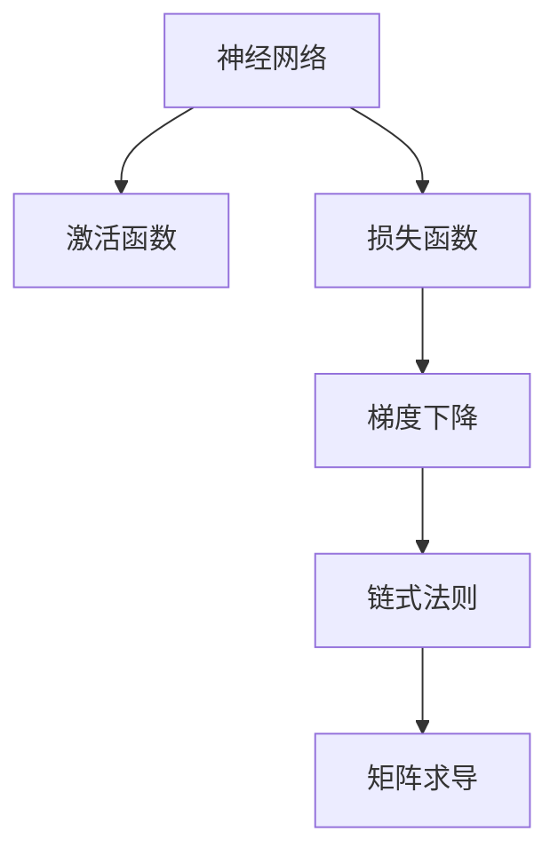

                 

# 反向传播算法详解：深度学习的核心

> 关键词：反向传播算法,深度学习,神经网络,梯度下降,误差传播,参数更新,链式法则,矩阵求导

## 1. 背景介绍

### 1.1 问题由来
深度学习（Deep Learning）是当前人工智能领域的前沿技术，广泛应用于图像识别、语音识别、自然语言处理、推荐系统等众多领域。其核心在于构建多层神经网络（Neural Network），通过复杂非线性映射实现对数据的拟合和分类。而反向传播（Backpropagation）算法作为深度学习中最关键的核心算法，其作用是计算神经网络各层参数的梯度，从而进行参数更新，不断优化模型性能。

### 1.2 问题核心关键点
反向传播算法原理的核心在于通过误差传播的方式，反向计算每一层神经元的梯度，以更新参数。该算法的核心思想基于链式法则（Chain Rule）和矩阵求导，通过逐层累积误差信号，实现对模型参数的高效更新。

## 2. 核心概念与联系

### 2.1 核心概念概述

为了更好地理解反向传播算法的原理，本节将介绍几个与反向传播紧密相关的核心概念：

- **神经网络（Neural Network）**：由多个神经元（Neuron）按照层次结构组成的计算模型。每一层神经元接收上一层神经元的输出，并通过激活函数计算输出，再将结果传递给下一层。
- **激活函数（Activation Function）**：用于决定神经元是否激活的关键函数，常见包括Sigmoid、ReLU、Tanh等，用于引入非线性特征。
- **损失函数（Loss Function）**：用于衡量模型输出与真实标签之间的差距，常见包括均方误差（MSE）、交叉熵（Cross-Entropy）等。
- **梯度下降（Gradient Descent）**：一种基于一阶导数信息（即梯度）的优化算法，通过不断调整参数，使得损失函数最小化。
- **链式法则（Chain Rule）**：数学中用于计算复合函数导数的一种法则，在反向传播算法中用于逐层计算误差。
- **矩阵求导**：在神经网络中，梯度下降需要频繁进行矩阵求导操作，用于计算参数的偏导数。

这些核心概念之间的逻辑关系可以通过以下Mermaid流程图来展示：



这个流程图展示了大语言模型的核心概念及其之间的关系：

1. 神经网络通过激活函数进行非线性映射。
2. 损失函数衡量模型输出与真实标签之间的差距。
3. 梯度下降算法通过误差信号对模型参数进行更新。
4. 链式法则用于逐层计算误差。
5. 矩阵求导用于高效计算参数梯度。

这些概念共同构成了深度学习模型的基本计算框架，使得模型能够通过反向传播算法进行高效参数更新。

## 3. 核心算法原理 & 具体操作步骤
### 3.1 算法原理概述

反向传播算法的核心思想是利用链式法则，逐层计算误差，并通过梯度下降算法对模型参数进行更新。其具体流程如下：

1. 前向传播：输入数据从网络的第一层开始，通过激活函数进行非线性映射，逐层传递直到输出层，得到模型对样本的预测结果。
2. 计算误差：使用损失函数计算预测结果与真实标签之间的误差，并将误差信号从输出层逐层反向传播回输入层。
3. 反向传播：根据误差信号，计算每一层神经元的梯度，并通过链式法则计算出上一层的误差信号。
4. 参数更新：利用梯度下降算法，根据误差信号更新模型参数，不断优化模型性能。

### 3.2 算法步骤详解

以下是反向传播算法的详细步骤：

**Step 1: 初始化模型参数**
- 设定激活函数和损失函数。
- 初始化所有可调参数，如权重矩阵、偏置向量等。

**Step 2: 前向传播**
- 将输入数据从网络的第一层开始，逐层进行非线性映射，直到输出层。
- 每层神经元的输出作为下一层的输入，经过激活函数计算后传递给下一层。
- 最终输出层得到模型的预测结果。

**Step 3: 计算误差**
- 使用损失函数计算预测结果与真实标签之间的误差，得到误差信号。
- 误差信号通常为标量值，代表了模型的整体表现。

**Step 4: 反向传播**
- 根据误差信号，从输出层开始，逐层计算每一层神经元的梯度。
- 使用链式法则计算每一层误差信号，并将其传递给上一层。
- 计算参数的偏导数，通过梯度下降算法更新模型参数。

**Step 5: 参数更新**
- 使用优化算法（如Adam、SGD等）更新模型参数，最小化损失函数。
- 更新参数后，继续进行前向传播和反向传播，直到收敛或达到预设迭代次数。

### 3.3 算法优缺点

反向传播算法具有以下优点：
1. 高效性：利用链式法则和矩阵求导，逐层计算误差，使得参数更新过程高效。
2. 广泛适用：适用于各种深度学习模型，如卷积神经网络（CNN）、循环神经网络（RNN）等。
3. 可解释性：链式法则的推导过程清晰，易于理解。

同时，反向传播算法也存在一定的局限性：
1. 梯度消失或爆炸：当网络层数较多时，梯度在反向传播过程中可能消失或爆炸，导致模型训练困难。
2. 计算复杂度高：对于大型神经网络，反向传播的计算复杂度较高，需要高效算法优化。
3. 参数敏感：参数的初始化方式和更新策略对模型的性能有重要影响，需要进行调参优化。

尽管存在这些局限性，反向传播算法仍是当前深度学习中最为广泛应用的算法之一，其高效和广泛适用的特点使得其在实际应用中得以广泛应用。

### 3.4 算法应用领域

反向传播算法广泛应用于深度学习模型训练过程中，特别是神经网络的参数更新和优化。具体应用领域包括：

- 图像识别：通过反向传播算法训练卷积神经网络（CNN），实现对图像的分类和识别。
- 语音识别：利用反向传播算法训练循环神经网络（RNN），实现对语音信号的转录和识别。
- 自然语言处理：通过反向传播算法训练长短期记忆网络（LSTM）和Transformer等模型，实现对文本的生成、分类和理解。
- 推荐系统：利用反向传播算法训练深度神经网络，实现对用户行为和物品特征的建模，提升推荐精度。
- 游戏AI：通过反向传播算法训练深度强化学习模型，实现游戏中的智能决策和策略优化。

## 4. 数学模型和公式 & 详细讲解  
### 4.1 数学模型构建

为了更好地理解反向传播算法的数学原理，本节将使用数学语言对算法进行更加严格的刻画。

记神经网络模型为 $f(x; \theta)$，其中 $x$ 为输入数据，$\theta$ 为可调参数。假设训练数据集为 $D = \{(x_i, y_i)\}_{i=1}^N$，其中 $y_i$ 为真实标签。

定义损失函数为 $J(\theta) = \frac{1}{N} \sum_{i=1}^N \ell(f(x_i; \theta), y_i)$，其中 $\ell$ 为损失函数。

### 4.2 公式推导过程

以下是反向传播算法的详细数学推导：

**Step 1: 前向传播**

设网络中共有 $L$ 层，第一层输入为 $x$，最后一输出为 $y$。则前向传播过程可表示为：

$$
z_0 = x, \quad a_0 = z_0, \quad h_1 = \sigma(W_1 z_0 + b_1), \quad a_1 = h_1, \quad z_2 = W_2 h_1 + b_2, \quad \dots, \quad z_L = W_L z_{L-1} + b_L, \quad y = \sigma(z_L)
$$

其中 $z_i$ 为第 $i$ 层的输入，$a_i$ 为第 $i$ 层的输出，$h_i$ 为第 $i$ 层的激活函数输出，$W_i$ 和 $b_i$ 分别为第 $i$ 层的权重和偏置向量。

**Step 2: 计算误差**

设输出层预测结果为 $\hat{y}$，则误差信号 $\delta_L$ 为：

$$
\delta_L = \ell'(y, \hat{y}) \cdot \frac{\partial y}{\partial z_L}
$$

其中 $\ell'$ 为损失函数的导数，$\frac{\partial y}{\partial z_L}$ 为误差信号对输出层输入的偏导数，可通过链式法则计算。

**Step 3: 反向传播**

误差信号从输出层开始，逐层向后传播。第 $i$ 层的误差信号 $\delta_i$ 可表示为：

$$
\delta_i = \frac{\partial J}{\partial z_i} = \frac{\partial J}{\partial z_{i+1}} \cdot \frac{\partial z_{i+1}}{\partial h_i} \cdot \frac{\partial h_i}{\partial z_i} = \delta_{i+1} \cdot W_{i+1}^T \cdot \sigma'(h_i) \cdot \frac{\partial z_i}{\partial h_i}
$$

其中 $\sigma'$ 为激活函数的导数，$\frac{\partial z_i}{\partial h_i}$ 为第 $i$ 层的激活函数输出对输入的偏导数，可通过链式法则计算。

**Step 4: 参数更新**

使用梯度下降算法，根据误差信号更新模型参数。以第 $i$ 层的权重矩阵 $W_i$ 为例，其梯度为：

$$
\frac{\partial J}{\partial W_i} = \frac{\partial J}{\partial z_i} \cdot \frac{\partial z_i}{\partial z_{i-1}} = \delta_i \cdot \frac{\partial z_i}{\partial z_{i-1}}
$$

其中 $\frac{\partial z_i}{\partial z_{i-1}}$ 为第 $i$ 层的输入对前一层输入的偏导数，可通过链式法则计算。

### 4.3 案例分析与讲解

为了更好地理解反向传播算法的实际应用，下面以一个简单的多层感知机（MLP）为例进行讲解：

假设神经网络模型如下：

$$
z_0 = x, \quad a_0 = z_0, \quad h_1 = \sigma(W_1 z_0 + b_1), \quad a_1 = h_1, \quad z_2 = W_2 h_1 + b_2, \quad \dots, \quad z_L = W_L z_{L-1} + b_L, \quad y = \sigma(z_L)
$$

其中 $x$ 为输入，$y$ 为输出，$z_i$ 为第 $i$ 层的输入，$a_i$ 为第 $i$ 层的输出，$h_i$ 为第 $i$ 层的激活函数输出，$W_i$ 和 $b_i$ 分别为第 $i$ 层的权重和偏置向量。

假设损失函数为均方误差（MSE），则误差信号 $\delta_L$ 为：

$$
\delta_L = \frac{\partial J}{\partial y} = \frac{\partial}{\partial y} \frac{1}{N} \sum_{i=1}^N (y_i - \hat{y})^2 = \frac{1}{N} \sum_{i=1}^N 2(y_i - \hat{y}) \cdot \frac{\partial \hat{y}}{\partial z_L}
$$

其中 $\frac{\partial \hat{y}}{\partial z_L}$ 为误差信号对输出层输入的偏导数，可通过链式法则计算。

然后，逐层计算误差信号 $\delta_i$，更新模型参数。以更新第 $i$ 层的权重矩阵 $W_i$ 为例，其梯度为：

$$
\frac{\partial J}{\partial W_i} = \delta_i \cdot \frac{\partial z_i}{\partial z_{i-1}} = \delta_i \cdot \frac{\partial}{\partial z_i} (W_{i+1} h_i + b_{i+1}) = \delta_i \cdot W_{i+1}^T \cdot \sigma'(h_i)
$$

其中 $\sigma'$ 为激活函数的导数，$\frac{\partial z_i}{\partial z_{i-1}}$ 为第 $i$ 层的激活函数输出对输入的偏导数，可通过链式法则计算。

通过上述推导，可以看出反向传播算法能够高效计算每一层神经元的梯度，从而进行参数更新，优化模型性能。

## 5. 项目实践：代码实例和详细解释说明
### 5.1 开发环境搭建

在进行反向传播算法实践前，我们需要准备好开发环境。以下是使用Python进行TensorFlow开发的环境配置流程：

1. 安装Anaconda：从官网下载并安装Anaconda，用于创建独立的Python环境。

2. 创建并激活虚拟环境：
```bash
conda create -n tf-env python=3.8 
conda activate tf-env
```

3. 安装TensorFlow：根据CUDA版本，从官网获取对应的安装命令。例如：
```bash
pip install tensorflow tensorflow-addons
```

4. 安装各类工具包：
```bash
pip install numpy pandas scikit-learn matplotlib tqdm jupyter notebook ipython
```

完成上述步骤后，即可在`tf-env`环境中开始反向传播算法的实践。

### 5.2 源代码详细实现

下面以一个简单的多层感知机（MLP）为例，给出使用TensorFlow进行反向传播算法的PyTorch代码实现。

首先，定义模型的结构：

```python
import tensorflow as tf

class MLP(tf.keras.Model):
    def __init__(self, input_size, hidden_size, output_size):
        super(MLP, self).__init__()
        self.dense1 = tf.keras.layers.Dense(hidden_size, activation='relu')
        self.dense2 = tf.keras.layers.Dense(output_size)
        
    def call(self, x):
        x = self.dense1(x)
        x = self.dense2(x)
        return x
```

然后，定义损失函数和优化器：

```python
learning_rate = 0.001
optimizer = tf.keras.optimizers.Adam(learning_rate)
loss_fn = tf.keras.losses.MeanSquaredError()

def train_step(x, y):
    with tf.GradientTape() as tape:
        y_pred = model(x)
        loss = loss_fn(y, y_pred)
    grads = tape.gradient(loss, model.trainable_variables)
    optimizer.apply_gradients(zip(grads, model.trainable_variables))
    return loss
```

接着，定义训练和评估函数：

```python
def train_epoch(model, dataset, batch_size, epochs):
    for epoch in range(epochs):
        for batch in dataset.batch(batch_size):
            x, y = batch
            loss = train_step(x, y)
            print(f"Epoch {epoch+1}, loss: {loss.numpy():.4f}")
        
def evaluate(model, dataset, batch_size):
    correct_predictions = 0
    total_predictions = 0
    for batch in dataset.batch(batch_size):
        x, y = batch
        y_pred = model(x)
        predicted = tf.argmax(y_pred, axis=1)
        correct_predictions += tf.reduce_sum(tf.cast(tf.equal(y, predicted), tf.float32))
        total_predictions += y.shape[0]
    accuracy = correct_predictions / total_predictions
    print(f"Test accuracy: {accuracy.numpy():.4f}")
```

最后，启动训练流程并在测试集上评估：

```python
input_size = 10
hidden_size = 20
output_size = 3
epochs = 100
batch_size = 64

model = MLP(input_size, hidden_size, output_size)
dataset = tf.data.Dataset.from_tensor_slices((x_train, y_train)).shuffle(buffer_size=10000).batch(batch_size)
evaluate(model, dataset, batch_size)
train_epoch(model, dataset, batch_size, epochs)
```

以上就是使用TensorFlow进行反向传播算法训练的完整代码实现。可以看到，得益于TensorFlow的强大封装，我们可以用相对简洁的代码完成模型的定义和训练过程。

### 5.3 代码解读与分析

让我们再详细解读一下关键代码的实现细节：

**MLP类**：
- `__init__`方法：初始化模型的层结构和激活函数。
- `call`方法：定义模型的前向传播过程，每一层输出经过激活函数后传递给下一层。

**train_step函数**：
- 使用梯度自动记录器记录前向传播的损失，并计算梯度。
- 使用Adam优化器更新模型参数。

**train_epoch函数**：
- 循环迭代训练集，每个批次进行一次训练。
- 打印每个epoch的平均损失。

**evaluate函数**：
- 在测试集上评估模型预测的准确率。

**训练流程**：
- 定义模型的输入和输出尺寸，初始化模型。
- 使用TensorFlow的Dataset对训练集进行批处理，供模型训练和推理使用。
- 定义损失函数和优化器。
- 在每个epoch内循环训练集，打印每个epoch的损失。
- 在测试集上评估模型性能，给出最终测试结果。

可以看到，TensorFlow提供了强大的API和工具，使得反向传播算法的代码实现变得简洁高效。开发者可以将更多精力放在模型结构设计、超参数调优等高层逻辑上，而不必过多关注底层实现细节。

当然，工业级的系统实现还需考虑更多因素，如模型的保存和部署、超参数的自动搜索、更灵活的任务适配层等。但核心的反向传播范式基本与此类似。

## 6. 实际应用场景
### 6.1 图像识别

反向传播算法在图像识别领域得到了广泛应用。通过构建卷积神经网络（CNN），反向传播算法能够高效地学习图像的特征表示，实现对图像的高效分类和识别。

在实际应用中，可以使用反向传播算法训练卷积神经网络，对图像进行预处理和特征提取，最终输出分类结果。典型的应用场景包括物体检测、人脸识别、医学影像分析等。

### 6.2 语音识别

语音识别也是反向传播算法的应用之一。通过构建循环神经网络（RNN），反向传播算法能够学习语音信号的特征表示，实现对语音信号的转录和识别。

在实际应用中，可以使用反向传播算法训练RNN模型，对语音信号进行预处理和特征提取，最终输出转录结果。典型的应用场景包括自动语音识别、语音合成、语音情感识别等。

### 6.3 自然语言处理

自然语言处理（NLP）是反向传播算法的另一大应用领域。通过构建长短期记忆网络（LSTM）或Transformer等模型，反向传播算法能够学习语言的特征表示，实现对文本的生成、分类和理解。

在实际应用中，可以使用反向传播算法训练LSTM或Transformer模型，对文本进行预处理和特征提取，最终输出分类、生成或翻译结果。典型的应用场景包括机器翻译、情感分析、文本摘要、问答系统等。

### 6.4 未来应用展望

随着反向传播算法的不断发展，其在深度学习中的应用将更加广泛。未来，反向传播算法可能会在以下领域得到更深入的应用：

1. 计算机视觉：通过反向传播算法训练生成对抗网络（GAN），实现图像生成和图像增强。
2. 语音处理：通过反向传播算法训练基于自回归的生成模型，实现语音生成和语音合成。
3. 自然语言生成：通过反向传播算法训练语言模型，实现文本生成和对话生成。
4. 强化学习：通过反向传播算法训练深度强化学习模型，实现智能决策和策略优化。
5. 医疗领域：通过反向传播算法训练医学影像分析模型，提高医学诊断的准确性。

以上趋势凸显了反向传播算法的发展前景，随着算法的不断演进和应用场景的拓展，反向传播算法将在更多领域发挥重要作用。

## 7. 工具和资源推荐
### 7.1 学习资源推荐

为了帮助开发者系统掌握反向传播算法的理论基础和实践技巧，这里推荐一些优质的学习资源：

1. 《深度学习》系列书籍：由多位深度学习领域的专家编写，深入浅出地介绍了深度学习的基本原理和核心算法。
2. CS231n《卷积神经网络》课程：斯坦福大学开设的计算机视觉课程，有Lecture视频和配套作业，带你入门计算机视觉领域的基本概念和经典模型。
3. CS224n《神经语言模型》课程：斯坦福大学开设的自然语言处理课程，有Lecture视频和配套作业，带你入门NLP领域的基本概念和经典模型。
4. 《TensorFlow深度学习入门》书籍：介绍如何使用TensorFlow进行深度学习模型的训练和部署，涵盖了反向传播算法的基本原理和实践技巧。
5. 《PyTorch深度学习入门》书籍：介绍如何使用PyTorch进行深度学习模型的训练和部署，涵盖了反向传播算法的基本原理和实践技巧。

通过对这些资源的学习实践，相信你一定能够快速掌握反向传播算法的精髓，并用于解决实际的深度学习问题。

### 7.2 开发工具推荐

高效的开发离不开优秀的工具支持。以下是几款用于反向传播算法开发的常用工具：

1. TensorFlow：由Google主导开发的开源深度学习框架，生产部署方便，适合大规模工程应用。
2. PyTorch：由Facebook主导开发的开源深度学习框架，灵活高效，适合快速迭代研究。
3. Keras：高层次的神经网络API，易于使用，适合快速原型设计和模型构建。
4. Jupyter Notebook：免费的开源Jupyter Notebook环境，方便开发者进行交互式实验和代码共享。
5. Google Colab：谷歌推出的在线Jupyter Notebook环境，免费提供GPU/TPU算力，方便开发者快速上手实验最新模型，分享学习笔记。

合理利用这些工具，可以显著提升反向传播算法的开发效率，加快创新迭代的步伐。

### 7.3 相关论文推荐

反向传播算法作为深度学习中最关键的核心算法，其研究仍在不断深入。以下是几篇奠基性的相关论文，推荐阅读：

1. Delving Deep into Rectifiers：探讨了ReLU激活函数的优势及其在深度学习中的应用。
2. Batch Normalization：介绍了批量归一化技术，能够加速深度神经网络的收敛过程。
3. Deep Residual Learning for Image Recognition：提出了残差网络（ResNet），解决了深度神经网络训练过程中的梯度消失问题。
4. Improving Generalization with Loss Function Regularization：探讨了损失函数的正则化技术，能够提高深度神经网络的泛化能力。
5. Dropout: A Simple Way to Prevent Neural Networks from Overfitting：介绍了Dropout技术，能够有效防止深度神经网络的过拟合问题。

这些论文代表了大语言模型微调技术的发展脉络。通过学习这些前沿成果，可以帮助研究者把握学科前进方向，激发更多的创新灵感。

## 8. 总结：未来发展趋势与挑战

### 8.1 总结

本文对反向传播算法的原理和应用进行了全面系统的介绍。首先阐述了反向传播算法的背景和核心思想，明确了其在深度学习中的重要地位。其次，从原理到实践，详细讲解了反向传播算法的数学原理和详细步骤，给出了模型训练的完整代码实现。同时，本文还广泛探讨了反向传播算法在图像识别、语音识别、自然语言处理等多个领域的应用前景，展示了其在实际应用中的强大能力。此外，本文精选了反向传播算法的各类学习资源，力求为读者提供全方位的技术指引。

通过本文的系统梳理，可以看到，反向传播算法是深度学习中最为关键的核心算法之一，其高效和广泛适用的特点使得其在实际应用中得以广泛应用。未来，随着算法的不断演进和应用场景的拓展，反向传播算法将在更多领域发挥重要作用，推动深度学习技术的进一步发展。

### 8.2 未来发展趋势

展望未来，反向传播算法的不断发展将呈现以下几个趋势：

1. 模型规模持续增大：随着算力成本的下降和数据规模的扩张，反向传播算法将构建更加复杂的深度学习模型，提升模型的性能和效果。
2. 参数高效优化：为了在有限资源下优化模型性能，反向传播算法将进一步探索参数高效优化方法，如稀疏化、量化、知识蒸馏等。
3. 自动化超参数优化：反向传播算法将结合自动机器学习（AutoML）技术，自动搜索最优超参数组合，提高模型训练效率和性能。
4. 融合更多先验知识：反向传播算法将结合符号化知识、领域专家经验等，引入更多先验信息，提升模型的可靠性和泛化能力。
5. 引入更多可解释性技术：反向传播算法将结合可解释性技术，如注意力机制、可视化工具等，提高模型的可解释性和可理解性。

这些趋势将推动反向传播算法在深度学习中发挥更大的作用，推动深度学习技术的进一步发展。

### 8.3 面临的挑战

尽管反向传播算法已经取得了显著成果，但其在实际应用中也面临着诸多挑战：

1. 计算复杂度高：对于大规模深度学习模型，反向传播算法的计算复杂度较高，需要高效的计算资源和优化算法。
2. 模型泛化能力有限：反向传播算法需要大量的标注数据进行训练，难以应对数据分布变化较大的情况。
3. 模型鲁棒性不足：反向传播算法训练的模型在面对对抗样本和噪声数据时，鲁棒性较弱。
4. 模型训练时间较长：反向传播算法需要大量的计算资源和时间进行训练，难以应对实时应用场景的需求。
5. 模型可解释性不足：反向传播算法训练的模型往往是"黑盒"系统，难以解释其内部工作机制和决策逻辑。

这些挑战限制了反向传播算法在实际应用中的进一步普及和推广。未来，研究者需要不断探索新的优化算法和模型结构，提升反向传播算法的计算效率和泛化能力，增强其可解释性和可控性。

### 8.4 研究展望

面对反向传播算法面临的挑战，未来的研究需要在以下几个方面寻求新的突破：

1. 探索高效计算技术：结合GPU、TPU等硬件加速技术，优化反向传播算法的计算复杂度，提高模型训练速度。
2. 提升模型泛化能力：引入迁移学习、多任务学习等技术，提高模型的泛化能力和鲁棒性。
3. 增强模型可解释性：结合可解释性技术，如可视化、注意力机制等，提高模型的可解释性和可控性。
4. 结合符号化知识：引入符号化知识、领域专家经验等，提高模型的可靠性和泛化能力。
5. 引入自动化学习技术：结合自动化机器学习技术，自动化搜索最优超参数组合，提高模型训练效率和性能。

这些研究方向的探索，必将引领反向传播算法在深度学习中发挥更大的作用，推动深度学习技术的进一步发展。面向未来，反向传播算法还需要与其他人工智能技术进行更深入的融合，如知识表示、因果推理、强化学习等，多路径协同发力，共同推动深度学习技术的进步。只有勇于创新、敢于突破，才能不断拓展反向传播算法的边界，让深度学习技术更好地造福人类社会。

## 9. 附录：常见问题与解答

**Q1：反向传播算法是否适用于所有深度学习模型？**

A: 反向传播算法适用于大多数深度学习模型，包括卷积神经网络（CNN）、循环神经网络（RNN）、长短期记忆网络（LSTM）等。但某些特殊模型，如对抗网络（GAN），反向传播算法可能不适用。

**Q2：反向传播算法中的链式法则如何计算？**

A: 链式法则用于计算复合函数的导数，通过逐层计算误差信号，将误差信号从输出层逐层向后传播回输入层。具体计算方式如下：

$$
\frac{\partial J}{\partial z_i} = \frac{\partial J}{\partial z_{i+1}} \cdot \frac{\partial z_{i+1}}{\partial h_i} \cdot \frac{\partial h_i}{\partial z_i}
$$

其中 $\frac{\partial J}{\partial z_{i+1}}$ 为上一层的误差信号，$\frac{\partial z_{i+1}}{\partial h_i}$ 为上一层输出对当前层输入的偏导数，$\frac{\partial h_i}{\partial z_i}$ 为当前层输出对输入的偏导数。

**Q3：反向传播算法中的梯度消失或爆炸问题如何解决？**

A: 梯度消失或爆炸问题可以通过以下方法解决：

1. 使用激活函数：如ReLU、Leaky ReLU等非饱和激活函数，可以有效避免梯度消失问题。
2. 批量归一化：对每一层的输入进行归一化，加速深度神经网络的收敛过程。
3. 残差连接：如ResNet等残差网络结构，能够缓解梯度消失问题。
4. 权重初始化：使用合适的权重初始化方法，如Xavier、He等，可以有效避免梯度爆炸问题。
5. 学习率衰减：在训练过程中逐步降低学习率，避免梯度爆炸问题。

**Q4：反向传播算法中的优化器如何选择？**

A: 反向传播算法中常用的优化器包括SGD、Adam、Adagrad等。不同的优化器有不同的优缺点，需要根据具体情况选择：

1. SGD：简单易用，但需要手动调整学习率。
2. Adam：自适应学习率，性能稳定，适用于大多数情况。
3. Adagrad：自适应学习率，能够快速收敛，但可能出现“学习率衰减”问题。

**Q5：反向传播算法中的超参数如何调优？**

A: 反向传播算法中的超参数包括学习率、批大小、迭代次数等，需要根据具体情况进行调优：

1. 学习率：通常从0.001开始，逐步减小，直到收敛。
2. 批大小：通常从32开始，逐步增加，直到模型性能不再提升。
3. 迭代次数：通常从100开始，逐步增加，直到收敛。

通过合理设置超参数，可以显著提升反向传播算法的性能和效果。

---

作者：禅与计算机程序设计艺术 / Zen and the Art of Computer Programming

