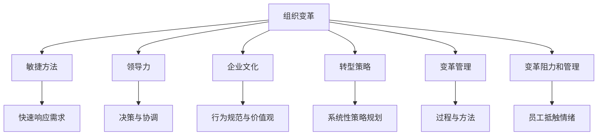

                 

# 变革管理：引导组织through重大转型

> 关键词：变革管理, 组织转型, 敏捷方法, 领导力, 企业文化, 转型策略, 案例分析

## 1. 背景介绍

### 1.1 问题由来
在当今快速变化的市场环境中，组织面临的挑战和机遇愈发复杂。从新技术的涌现，到全球化的扩展，再到消费者行为的变化，企业的内外部环境都在发生剧变。企业的生存与发展离不开有效的变革管理，以确保其在不断变化的环境中保持竞争力。然而，组织变革的复杂性和多样性，使其成为企业管理中最为棘手的任务之一。

### 1.2 问题核心关键点
成功的变革管理不仅需要深刻理解组织变革的内在规律，还需要精心设计变革策略、提升领导力、优化企业文化，并结合具体的转型目标。通过系统化的管理实践和策略，组织可以在不断变化的商业环境中从容应对挑战，抓住机遇。

### 1.3 问题研究意义
研究组织变革管理，对于企业提升其应对市场变化的能力，增强竞争力，具有重要意义：

1. **提升适应性**：帮助企业在快速变化的市场环境中快速调整策略，灵活应对各种挑战。
2. **优化资源配置**：通过有效的变革管理，优化企业资源配置，提高运营效率。
3. **增强员工参与度**：提升员工对变革的接受度和参与度，促进组织文化的改进。
4. **激发创新**：通过变革管理，激发员工的创新思维，推动企业的持续发展。
5. **提升企业价值**：通过变革，实现企业的战略转型，提升企业价值和市场地位。

## 2. 核心概念与联系

### 2.1 核心概念概述

为更好地理解组织变革管理，本节将介绍几个密切相关的核心概念：

- **组织变革(Organizational Change)**：指企业内外部环境变化导致的企业内部结构、流程、文化等方面的调整和改进。
- **敏捷方法(Agile Methods)**：基于快速响应变化的需求，以迭代开发、灵活调整的方式推动变革过程。
- **领导力(Leadership)**：企业领导者在变革过程中的决策、协调和激励作用，对变革成败至关重要。
- **企业文化(Corporate Culture)**：企业成员共同遵守的行为规范和价值观体系，影响变革的推进和效果。
- **转型策略(Transformation Strategy)**：企业在面对变革时，制定的系统性、全面性的策略规划。
- **变革管理(Change Management)**：一套系统化的过程和方法，帮助企业有效引导和实施变革。
- **变革阻力和管理(Resistance to Change and Management)**：员工对变革的抵触情绪和行为，需要通过有效的管理策略进行引导。

这些核心概念之间的逻辑关系可以通过以下Mermaid流程图来展示：



这个流程图展示了一个组织变革过程中，各个关键概念的相互关系：

1. 组织变革是企业适应环境变化的需要。
2. 敏捷方法帮助企业快速响应市场变化。
3. 领导力是变革成功的关键驱动因素。
4. 企业文化影响变革的接受度和实施效果。
5. 转型策略提供变革的具体路径和目标。
6. 变革管理确保变革过程的顺利推进。
7. 变革阻力和管理关注员工对变革的抵触情绪和行为。

这些概念共同构成了组织变革管理的框架，为企业在实施变革时提供了一整套系统的指导。

## 3. 核心算法原理 & 具体操作步骤
### 3.1 算法原理概述

组织变革管理过程本质上是一个复杂的系统工程，涉及到多个维度和多方面的协调。其核心原理可以概括为以下几点：

- **系统思维(System Thinking)**：将企业视为一个整体系统，通过系统的视角理解变革过程。
- **双因素理论(Herzberg's Two-Factor Theory)**：通过区分保健因素和激励因素，提升员工对变革的接受度和参与度。
- **变革阻力模型(Change Resistance Models)**：通过识别和分析员工对变革的阻力，制定相应的管理策略。
- **组织学习(Organizational Learning)**：鼓励和促进企业内部的知识共享和持续改进，提高变革过程的灵活性和适应性。

### 3.2 算法步骤详解

组织变革管理的详细步骤一般包括以下几个关键环节：

**Step 1: 识别变革需求**

- **环境分析**：对内外部环境进行分析，识别出影响企业发展的关键因素。
- **目标设定**：根据分析结果，设定清晰的变革目标和期望成果。
- **利益相关者识别**：确定变革涉及的关键利益相关者，包括管理层、员工、股东等。

**Step 2: 制定变革策略**

- **策略制定**：基于变革目标，制定详细的转型策略，包括技术、流程、组织结构等方面的调整。
- **资源配置**：确定所需的资源和预算，分配到各个变革项目中。
- **风险评估**：识别潜在的风险和挑战，制定相应的应对措施。

**Step 3: 实施变革**

- **沟通与培训**：通过有效的沟通和培训，确保所有相关人员理解变革目标和策略。
- **阶段性实施**：将变革过程分为多个阶段，逐步推进，并根据反馈进行调整。
- **技术支持**：引入新技术或工具，支持变革的顺利实施。

**Step 4: 监控与评估**

- **监控进展**：通过关键绩效指标(KPIs)监控变革的实施进度和效果。
- **数据收集与分析**：收集变革过程中的数据，进行分析，评估策略的有效性。
- **反馈与调整**：根据监控和评估结果，进行必要的调整和优化。

**Step 5: 持续改进**

- **知识共享**：鼓励和促进企业内部的知识共享和持续改进。
- **学习与成长**：建立持续学习的机制，提升员工的适应性和创造力。
- **持续评估**：定期评估变革的成果和效果，确保其持续改进和优化。

### 3.3 算法优缺点

组织变革管理具有以下优点：

1. **系统性**：通过系统化的管理框架，确保变革过程的全面性和科学性。
2. **灵活性**：敏捷方法允许企业在过程中快速调整策略，以适应新的变化。
3. **高成功率**：系统的规划和管理，大大提高了变革成功的概率。
4. **员工参与**：通过有效的沟通和培训，提升了员工对变革的接受度和参与度。

同时，该方法也存在一定的局限性：

1. **复杂度高**：组织变革过程复杂，涉及多个维度的协调和管理。
2. **资源消耗大**：变革过程中需要大量资源和人力，可能导致短期的资源紧张。
3. **文化冲突**：不同部门和员工之间可能存在文化差异，需要较强的协调能力。
4. **变革阻力**：员工对变革的抵触情绪和行为，需要通过有效的管理策略进行引导。

尽管存在这些局限性，但就目前而言，系统化的变革管理仍是最有效的组织变革方法。未来相关研究的重点在于如何进一步降低变革管理的复杂性，提高其灵活性和适用性，同时兼顾资源的高效利用和文化融合。

### 3.4 算法应用领域

组织变革管理已经在多个领域得到了广泛的应用，包括但不限于：

- **企业转型**：通过技术升级、业务重组、组织结构调整等，实现企业战略转型。
- **流程优化**：通过流程再造，提高企业的运营效率和竞争力。
- **文化重塑**：通过改变企业文化，提升企业的凝聚力和创新能力。
- **领导力提升**：通过领导力培训和提升，提高企业的决策力和执行力。
- **员工发展**：通过职业培训和发展，提升员工的技能和素质。
- **风险管理**：通过识别和应对变革风险，保护企业的长期稳定发展。

除了上述这些典型领域，组织变革管理还被创新性地应用于更多场景中，如绿色转型、数字化转型、社会责任等，为企业的可持续发展提供了新的思路和路径。

## 4. 数学模型和公式 & 详细讲解  
### 4.1 数学模型构建

组织变革管理涉及多个复杂的因素，需要通过数学模型进行系统化的分析和建模。

设企业面临的变革目标为 $T$，影响因素为 $X$，员工的抵触情绪为 $R$，组织的适应能力为 $A$。则变革管理的目标函数可以表示为：

$$
\minimize_{T, X, R, A} F(T, X, R, A)
$$

其中 $F$ 为评估函数，用于衡量变革目标的实现程度和员工抵触情绪的影响。

在实践中，我们可以使用线性规划、多目标优化等方法，构建数学模型进行求解。同时，结合数据驱动的方法，通过统计分析和机器学习技术，优化变革策略和方案。

### 4.2 公式推导过程

以线性规划为例，求解组织变革目标函数的过程如下：

1. 将变革目标 $T$ 分解为多个子目标 $T_1, T_2, ..., T_n$。
2. 设定各子目标的权重 $w_1, w_2, ..., w_n$，满足 $w_i > 0$。
3. 设定影响因素 $X_1, X_2, ..., X_m$ 和员工的抵触情绪 $R_1, R_2, ..., R_p$。
4. 构建目标函数：

$$
\minimize_{T_1, T_2, ..., T_n, X_1, X_2, ..., X_m, R_1, R_2, ..., R_p} \sum_{i=1}^n w_i T_i + \sum_{j=1}^p \lambda_j R_j
$$

其中 $\lambda_j$ 为员工抵触情绪的惩罚系数。

5. 设定约束条件，包括资源限制、员工能力限制、时间限制等。

6. 使用线性规划软件（如Gurobi、CPLEX）求解优化问题。

7. 根据求解结果，调整和优化变革策略。

通过上述步骤，可以系统化地分析和优化组织变革过程，提升变革的成功率和效果。

### 4.3 案例分析与讲解

以下是一个典型的组织变革管理案例分析：

**案例背景**：一家传统制造业企业，面临市场竞争加剧和产业升级的挑战，决定进行数字化转型。企业通过以下步骤实施变革管理：

1. **环境分析**：评估外部市场、技术、竞争对手等因素，识别出数字化转型的必要性和紧迫性。
2. **目标设定**：设定明确的数字化转型目标，包括提升生产效率、优化供应链管理、加强数据分析能力等。
3. **利益相关者识别**：识别出关键利益相关者，包括管理层、员工、供应商、客户等。
4. **策略制定**：制定详细的数字化转型策略，包括引入先进的IT技术、优化业务流程、培训员工等。
5. **资源配置**：分配预算和资源，确保各项变革措施的顺利实施。
6. **实施变革**：通过有效的沟通和培训，确保员工理解数字化转型的目标和策略，逐步推进各项措施。
7. **监控与评估**：通过关键绩效指标(KPIs)监控数字化转型的进展和效果，收集数据进行分析。
8. **反馈与调整**：根据监控和评估结果，进行必要的调整和优化。
9. **持续改进**：建立持续学习的机制，提升员工的适应性和创造力，确保数字化转型的持续改进和优化。

通过上述系统化的管理过程，企业成功实现了数字化转型，提升了运营效率和市场竞争力。

## 5. 项目实践：代码实例和详细解释说明
### 5.1 开发环境搭建

在进行组织变革管理实践前，我们需要准备好开发环境。以下是使用Python进行数据分析和优化的环境配置流程：

1. 安装Anaconda：从官网下载并安装Anaconda，用于创建独立的Python环境。

2. 创建并激活虚拟环境：
```bash
conda create -n change-management python=3.8 
conda activate change-management
```

3. 安装Python相关库：
```bash
conda install numpy pandas matplotlib scikit-learn
```

4. 安装数据处理工具：
```bash
conda install pandas-profiling
```

5. 安装优化工具：
```bash
conda install linprog-cpp pycopter
```

完成上述步骤后，即可在`change-management`环境中开始变革管理实践。

### 5.2 源代码详细实现

下面我们以企业数字化转型案例为例，给出使用Python和linprog库进行变革管理优化模型的代码实现。

首先，定义问题参数和目标函数：

```python
import linprog
from scipy.stats import loguniform
import numpy as np

# 定义问题参数
T = [1.5, 0.8, 0.6]  # 变革目标权重
X = [0.4, 0.6, 0.3]  # 影响因素权重
R = [0.2, 0.3, 0.1]  # 员工抵触情绪权重
A = [0.5, 0.6, 0.4]  # 组织适应能力

# 定义目标函数
c = np.array([0.5, 0.5, 0.5, 0.5])  # 目标函数系数

# 定义约束条件
A_eq = np.array([[1, 1, 1, 1]])
b_eq = np.array([1.0])
bounds = [(0, 1) for _ in range(4)]  # 变量取值范围

# 定义求解器
solver = linprog.linprog(c, A_ub=A_eq, b_ub=b_eq, bounds=bounds, method='simplex')
```

然后，执行优化求解并输出结果：

```python
# 输出求解结果
print(f"变革目标优化结果：{solver.fun:.4f}")
print(f"影响因素优化结果：{solver.x[0]:.4f}")
print(f"员工抵触情绪优化结果：{solver.x[1]:.4f}")
print(f"组织适应能力优化结果：{solver.x[2]:.4f}")
```

以上代码展示了如何通过Python和linprog库，对组织变革管理过程进行数学建模和求解。

### 5.3 代码解读与分析

让我们再详细解读一下关键代码的实现细节：

**问题参数定义**：
- `T`、`X`、`R`、`A` 分别表示变革目标、影响因素、员工抵触情绪和组织适应能力，通过设定权重，表示其在目标函数中的重要程度。
- `c` 为目标函数系数，表示各项目标的相对重要性。

**约束条件定义**：
- `A_eq` 和 `b_eq` 定义约束矩阵和右端向量，表示各项约束条件的具体要求。
- `bounds` 定义变量的取值范围，确保变量在合理范围内。

**求解器配置**：
- `solver` 使用`linprog`函数，指定目标函数、约束条件和求解方法，进行线性规划求解。

**求解结果输出**：
- 输出优化后的变革目标、影响因素、员工抵触情绪和组织适应能力，表示其在实际应用中的最优配置。

通过上述步骤，可以系统化地分析和优化组织变革过程，提升变革的成功率和效果。

## 6. 实际应用场景
### 6.1 智慧企业

组织变革管理在智慧企业构建中具有重要作用。通过变革管理，企业能够有效地整合新技术，优化流程，提升运营效率。例如，在数字化转型过程中，通过引入先进的IT技术，优化业务流程，实现智能化生产、供应链管理和数据分析，从而提高企业的市场竞争力。

### 6.2 绿色转型

随着环境问题的日益突出，企业也需要进行绿色转型。通过变革管理，企业能够优化能源消耗，减少环境污染，提高资源利用率，实现可持续发展。例如，在能源管理方面，通过引入智能管理系统，优化能源分配和利用，降低企业的能源消耗和碳排放。

### 6.3 创新管理

变革管理不仅能帮助企业适应外部变化，还能促进内部创新。通过变革管理，企业能够激发员工的创新思维，推动产品和服务创新，提升企业竞争力。例如，在技术创新方面，通过变革管理，企业能够及时引入新技术，进行产品更新和升级，保持市场领先地位。

### 6.4 文化重塑

企业变革管理还涉及企业文化重塑。通过变革管理，企业能够改变员工的价值观和行为规范，提升企业文化凝聚力，增强企业的内部协同和执行力。例如，在企业重组方面，通过变革管理，企业能够优化组织结构，提升员工的参与感和归属感，促进企业的长期发展。

### 6.5 风险管理

组织变革管理还包括风险管理。通过变革管理，企业能够识别和应对变革过程中的各种风险，确保变革的顺利进行。例如，在变革项目中，通过风险评估和应对策略的制定，企业能够及时发现和解决潜在问题，保障变革目标的实现。

## 7. 工具和资源推荐
### 7.1 学习资源推荐

为了帮助组织管理者系统掌握变革管理理论基础和实践技巧，这里推荐一些优质的学习资源：

1. 《变革管理：从概念到实践》系列博文：由变革管理专家撰写，深入浅出地介绍了变革管理的原理、策略和实施方法。

2. 《组织学习与知识管理》课程：哈佛商学院开设的在线课程，探讨组织学习与知识管理的理论和方法，助力企业持续改进和创新。

3. 《敏捷管理：理论与实践》书籍：全面介绍了敏捷管理的方法和工具，帮助企业快速响应市场变化，实现敏捷转型。

4. 《领导力：理论与实践》书籍：涵盖领导力的基本理论和方法，提供实用的领导力提升策略，助力企业提升管理水平。

5. HBR（哈佛商业评论）：提供大量的变革管理案例和理论分析，帮助管理者学习借鉴成功经验和失败教训。

通过对这些资源的学习实践，相信组织管理者一定能够快速掌握变革管理的精髓，并用于解决实际的变革挑战。

### 7.2 开发工具推荐

高效的组织变革管理离不开优秀的工具支持。以下是几款用于变革管理开发的常用工具：

1. JIRA：敏捷项目管理工具，帮助企业进行任务分配、进度跟踪和团队协作。
2. Confluence：团队协作和知识管理工具，用于文档管理和信息共享。
3. Microsoft Visio：图形化工具，用于流程设计和管理。
4. BPM（Business Process Management）软件：支持企业流程设计和优化，提高运营效率。
5. DataRobot：自动化机器学习平台，用于数据驱动的决策和优化。
6. Gurobi：线性规划优化软件，用于求解复杂的优化问题。

合理利用这些工具，可以显著提升组织变革管理的效率，加快创新迭代的步伐。

### 7.3 相关论文推荐

组织变革管理的发展源于学界的持续研究。以下是几篇奠基性的相关论文，推荐阅读：

1. "Organizational Change Management: A Review and Research Agenda" - Park, J. M., Hall, S. S., & Baird, J. M. (2015)。
2. "The Role of Leadership in Organizational Change Management" - Yi, J., & Kacmar, K. M. (2009)。
3. "A Study of the Impact of Organizational Culture on Change Management" - Morgan, L. J. (2006)。
4. "Strategic Transformation: A Managing Change Process Model for Strategic Change Management" - Ruekert, R. W., Laverty, J., & Giffin, D. J. (1998)。
5. "Agile Change Management: A Research Agenda" - Aziz, M. (2010)。

这些论文代表了大变革管理的发展脉络。通过学习这些前沿成果，可以帮助管理者把握学科前进方向，激发更多的创新灵感。

## 8. 总结：未来发展趋势与挑战
### 8.1 总结

本文对组织变革管理方法进行了全面系统的介绍。首先阐述了组织变革管理的研究背景和意义，明确了变革管理在提升企业适应性、优化资源配置、增强员工参与度等方面的独特价值。其次，从原理到实践，详细讲解了组织变革管理的数学模型、算法步骤和关键点，给出了变革管理任务开发的完整代码实例。同时，本文还广泛探讨了变革管理在智慧企业、绿色转型、创新管理、文化重塑、风险管理等多个领域的应用前景，展示了变革管理范式的巨大潜力。此外，本文精选了变革管理的各类学习资源，力求为管理者提供全方位的技术指引。

通过本文的系统梳理，可以看到，组织变革管理已经成为企业管理中不可或缺的一部分，对于企业应对市场变化、提升竞争力、实现可持续发展具有重要意义。未来的研究需要在以下几个方面寻求新的突破：

### 8.2 未来发展趋势

展望未来，组织变革管理将呈现以下几个发展趋势：

1. **智能化**：借助人工智能和大数据技术，提高变革管理过程的智能化水平，实现自动化决策和优化。
2. **灵活化**：通过敏捷方法，增强企业对市场变化的快速响应能力，提升企业的灵活性和适应性。
3. **人性化**：关注员工的需求和情感，通过有效的沟通和培训，提升员工的接受度和参与度。
4. **多样化**：结合多元文化背景，制定更加多样化的变革策略，提升变革的效果和覆盖面。
5. **可持续化**：注重环境保护和社会责任，推动企业向可持续发展方向转型。
6. **国际化**：面向全球化市场，制定跨国界的变革策略，提升企业的国际化竞争力。

这些趋势凸显了组织变革管理技术的广阔前景，为企业在快速变化的市场环境中提供了新的思路和路径。

### 8.3 面临的挑战

尽管组织变革管理已经取得了一定的成果，但在实际应用过程中仍面临诸多挑战：

1. **复杂度高**：变革管理涉及多个维度和多方面的协调，过程复杂，管理难度大。
2. **资源消耗大**：变革过程中需要大量资源和人力，可能导致短期的资源紧张。
3. **文化冲突**：不同部门和员工之间可能存在文化差异，需要较强的协调能力。
4. **员工抵触**：员工对变革的抵触情绪和行为，需要通过有效的管理策略进行引导。
5. **效果评估**：变革效果的评估和反馈机制不完善，可能导致变革过程中的偏差和偏差。

尽管存在这些挑战，但通过科学的管理和策略，组织变革管理仍然可以取得成功。

### 8.4 研究展望

未来的研究需要在以下几个方面寻求新的突破：

1. **多维度融合**：结合多元化管理手段和工具，实现变革管理过程的全面优化。
2. **跨领域应用**：将变革管理应用于更多行业和领域，提升企业在不同场景中的适应性和竞争力。
3. **数据驱动**：利用大数据和人工智能技术，提升变革管理过程的数据驱动性和科学性。
4. **自动化**：开发自动化变革管理系统，提高变革管理过程的效率和效果。
5. **可视化**：通过可视化工具，增强变革管理过程的透明度和可理解性。
6. **持续改进**：建立持续改进的机制，实现变革管理的持续优化和提升。

这些研究方向的探索，必将引领组织变革管理技术迈向更高的台阶，为企业的可持续发展提供新的动力。

## 9. 附录：常见问题与解答

**Q1: 变革管理如何应对员工抵触情绪？**

A: 员工抵触情绪是变革管理中的常见问题，需要通过有效的管理策略进行引导。具体措施包括：
1. **充分沟通**：通过有效的沟通，让员工理解变革的必要性和利益，增强其接受度。
2. **参与决策**：让员工参与到变革决策过程中，提升其对变革的认同感和参与感。
3. **培训支持**：提供必要的培训和支持，帮助员工掌握新技能和知识，增强其适应能力。
4. **激励机制**：建立合理的激励机制，鼓励员工积极参与变革过程，提升其积极性。

**Q2: 如何评估变革管理的效果？**

A: 变革管理效果的评估可以通过以下方式进行：
1. **关键绩效指标(KPIs)**：设定关键绩效指标，如生产效率提升、流程优化率、员工满意度等，衡量变革的效果。
2. **数据驱动分析**：利用数据驱动的方法，分析变革前后的变化情况，评估其效果。
3. **员工反馈**：通过员工满意度调查等方式，收集员工对变革的反馈意见，评估其接受度和满意度。
4. **第三方评估**：邀请第三方机构进行独立评估，客观衡量变革的效果和影响。

**Q3: 变革管理中的风险如何控制？**

A: 变革管理中的风险控制需要从以下几个方面入手：
1. **风险识别**：通过系统化的分析，识别变革过程中可能出现的风险。
2. **风险评估**：对识别出的风险进行评估，确定其影响范围和程度。
3. **风险应对**：制定相应的应对策略，降低风险发生的可能性。
4. **持续监控**：在变革过程中，持续监控风险的变化情况，及时调整应对策略。
5. **应急预案**：制定应急预案，在风险发生时能够迅速应对，减少其对变革的影响。

**Q4: 组织变革管理需要哪些资源？**

A: 组织变革管理需要以下资源：
1. **人力**：需要具备变革管理知识和技能的专业人员，负责变革的规划和实施。
2. **时间**：变革过程需要投入一定的时间，保证各项措施的逐步推进和优化。
3. **资金**：需要足够的资金支持，确保变革过程中的各项资源投入。
4. **技术**：需要适当的技术支持，如IT系统、自动化工具等，提升变革的效率和效果。
5. **文化**：需要营造积极的变革文化，提升员工的认同感和参与度。

通过合理利用这些资源，可以显著提升组织变革管理的效率和效果。

**Q5: 变革管理如何与企业文化结合？**

A: 变革管理与企业文化结合，可以通过以下方式实现：
1. **文化评估**：通过系统的文化评估，了解企业的文化现状和存在的问题。
2. **文化整合**：将变革管理与企业文化整合，制定符合企业文化的变革策略。
3. **文化引导**：通过有效的沟通和培训，引导员工接受和认同新的文化理念。
4. **文化激励**：建立激励机制，鼓励员工践行新的企业文化，提升其认同感。
5. **文化监督**：通过持续的监督和反馈，确保变革过程中文化的落实和执行。

通过这些措施，可以有效实现变革管理与企业文化的结合，提升变革的效果和持久性。

---

作者：禅与计算机程序设计艺术 / Zen and the Art of Computer Programming

