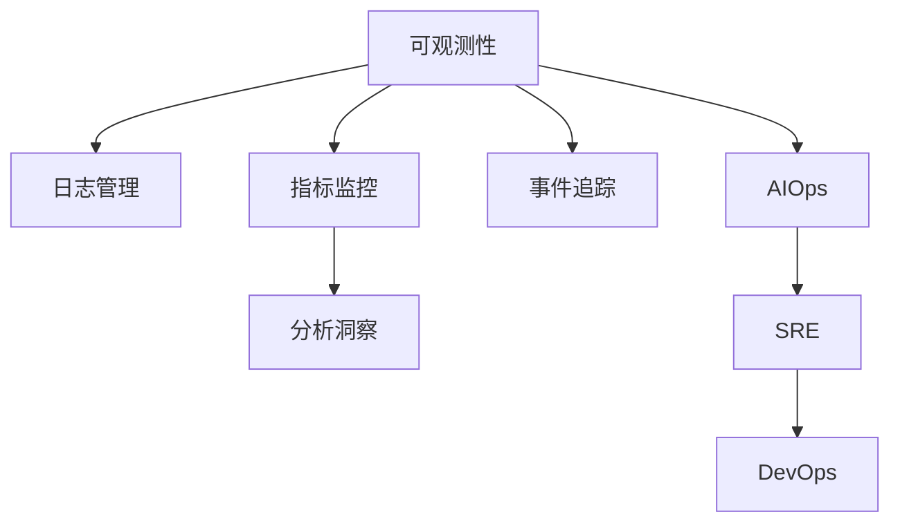

                 

# 可观测性工具链：日志、指标与追踪

> 关键词：可观测性工具链、日志、指标、追踪、AIOps、SRE、DevOps

## 1. 背景介绍

### 1.1 问题由来

随着云计算、大数据、人工智能等新兴技术在各行各业的深入应用，系统的复杂度和规模不断增长。在如此复杂的系统环境中，如何实时监控、分析和排障，以确保系统的稳定运行，成为了IT运维的一大挑战。传统的日志和监控工具已无法满足现代系统的需求，必须引入更加全面、智能化的可观测性工具链。

### 1.2 问题核心关键点

现代可观测性工具链的核心在于实现对系统多维度数据的实时监控和分析，以支撑业务连续性和效率提升。其主要包括以下几个关键点：

- **日志管理**：收集、存储和查询系统生成的日志信息，以便进行问题定位和根本原因分析。
- **指标监控**：收集和分析系统运行中的关键性能指标，如请求响应时间、错误率、CPU利用率等，以评估系统性能和健康状况。
- **事件追踪**：记录和关联系统的各种事件，如请求处理、故障告警、异常日志等，构建完整的业务流程视图，支持问题的端到端排查。
- **分析洞察**：通过数据可视化和智能分析，提供对系统运行状态的深入洞察，辅助业务决策。
- **自动化运维**：结合自动化脚本和机器学习算法，实现快速故障诊断和问题修复。

这些功能相互协作，构建了一个全面的可观测性框架，为系统的可靠性和性能保障提供了强有力的支持。

### 1.3 问题研究意义

研究和实践可观测性工具链，对提升系统运维效率、优化资源利用、降低故障影响具有重要意义：

1. **提升运维效率**：通过集中管理和分析日志、指标、事件数据，系统运维人员可以更快速、准确地定位问题，减少排查时间和人力成本。
2. **优化资源利用**：实时监控系统的各项指标，可以及时发现资源瓶颈，进行优化调整，提高系统利用率和性能。
3. **降低故障影响**：通过全面的追踪和分析，可以预判潜在故障，实施预防措施，减小故障对业务的影响。
4. **支持业务决策**：提供系统的运行洞察和趋势预测，辅助业务决策，提升业务竞争力和用户体验。
5. **促进运维自动化**：结合自动化脚本和智能算法，实现问题的快速诊断和修复，缩短故障响应时间。

## 2. 核心概念与联系

### 2.1 核心概念概述

为更好地理解可观测性工具链，本节将介绍几个核心概念：

- **可观测性**：指通过收集和分析系统运行中的各项数据，获取系统运行状态和性能的可视化视图，从而对系统进行全面监控和分析。
- **日志**：记录系统运行过程中的各种信息，包括程序日志、错误日志、审计日志等，是问题定位和根本原因分析的重要依据。
- **指标**：系统运行中的关键性能数据，如CPU使用率、内存使用量、请求响应时间等，用于评估系统性能和健康状况。
- **事件追踪**：记录和关联系统中的各项事件，如请求处理、故障告警、异常日志等，构建完整的业务流程视图，支持端到端问题排查。
- **AIOps**：结合自动化和智能化技术，提升传统运维的效率和质量，是现代可观测性工具链的核心。
- **SRE**：Site Reliability Engineering，强调通过工程化手段提升系统可靠性，与DevOps、AIOps紧密相关。
- **DevOps**：开发和运维的协同融合，通过持续交付和自动化运维，提升系统开发效率和可靠性。

这些核心概念之间的逻辑关系可以通过以下Mermaid流程图来展示：



这个流程图展示了一些核心概念及其之间的关系：

1. 可观测性是整个系统的监控和分析基础，通过日志、指标和事件数据的收集和分析，获取系统的可视化视图。
2. 日志管理是可观测性的数据来源之一，记录系统运行中的各种信息，用于问题定位和根本原因分析。
3. 指标监控用于评估系统性能和健康状况，是可观测性的重要组成部分。
4. 事件追踪记录和关联系统中的各项事件，构建完整的业务流程视图，支持端到端问题排查。
5. AIOps结合自动化和智能化技术，提升运维效率和质量，是可观测性的高级形态。
6. SRE强调通过工程化手段提升系统可靠性，与AIOps、DevOps紧密相关。
7. DevOps注重开发和运维的协同融合，通过持续交付和自动化运维，提升系统开发效率和可靠性。

这些概念共同构成了现代系统运维的全面框架，帮助运维团队实现系统的稳定、高效和可靠。

## 3. 核心算法原理 & 具体操作步骤
### 3.1 算法原理概述

现代可观测性工具链的核心算法原理包括日志处理、指标计算和事件追踪等。这些算法通过数据收集、存储和分析，实现对系统运行状态的全面监控和分析。

**日志处理**：
- 通过日志代理将日志信息收集到中央日志存储系统，如ELK Stack、Splunk等。
- 利用日志解析工具对日志进行格式转换和过滤，提取有用信息。
- 利用日志分析工具对日志进行查询和分析，生成图表和报告。

**指标计算**：
- 通过收集系统中的各项性能数据，如CPU使用率、内存使用量、请求响应时间等。
- 利用数据可视化工具生成图表和报告，实时监控系统性能和健康状况。

**事件追踪**：
- 记录系统中的各种事件，如请求处理、故障告警、异常日志等。
- 利用事件关联工具将事件数据关联起来，构建完整的业务流程视图。
- 利用事件分析工具对事件数据进行查询和分析，支持端到端问题排查。

### 3.2 算法步骤详解

现代可观测性工具链的实施步骤包括数据收集、存储和分析三个阶段：

**Step 1: 数据收集**
- 安装日志代理，如Fluentd、Logstash等，收集系统生成的各种日志信息。
- 配置性能数据收集工具，如Prometheus、Grafana等，收集系统中的各项性能数据。
- 配置事件追踪工具，如Kibana、Splunk等，记录和关联系统中的各项事件。

**Step 2: 数据存储**
- 将收集到的数据存储在中央日志存储系统，如Elasticsearch、Splunk等。
- 配置数据仓库，如MySQL、PostgreSQL等，存储结构化数据。

**Step 3: 数据分析**
- 利用日志分析工具，如Kibana、Elasticsearch等，对日志数据进行查询和分析。
- 利用性能监控工具，如Grafana、Prometheus等，对指标数据进行实时监控和分析。
- 利用事件追踪工具，如Kibana、Splunk等，对事件数据进行关联和分析。

### 3.3 算法优缺点

现代可观测性工具链具有以下优点：
1. **全面覆盖**：能够覆盖系统运行中的各种数据，包括日志、指标、事件等，提供全面的系统视图。
2. **实时监控**：能够实时监控系统的各项指标和事件，及时发现和解决问题。
3. **智能分析**：利用机器学习算法和数据可视化工具，提供深度的系统洞察，辅助业务决策。
4. **自动运维**：结合自动化脚本和智能算法，实现快速故障诊断和问题修复。

同时，这些工具链也存在以下局限性：
1. **数据量大**：系统生成的数据量巨大，需要强大的存储和计算能力。
2. **配置复杂**：配置和部署工具链需要较高的技术门槛。
3. **隐私问题**：大规模数据收集和存储，可能带来隐私和安全问题。
4. **昂贵成本**：高级工具链和数据仓库通常需要较高的投入成本。

尽管存在这些局限性，但现代可观测性工具链在提升系统运维效率、优化资源利用、降低故障影响等方面具有显著优势，是现代IT运维的重要基础设施。

### 3.4 算法应用领域

现代可观测性工具链在多个领域得到了广泛应用，以下是几个典型应用场景：

- **金融行业**：实时监控交易系统的性能和故障，保障金融交易的稳定和安全。
- **电商行业**：实时监控交易和库存系统的性能和事件，提升用户体验和运营效率。
- **医疗行业**：实时监控医院信息系统和患者数据的性能和事件，保障医疗服务的稳定和可靠。
- **电信行业**：实时监控网络设备和通信系统的性能和事件，保障通信网络的稳定和安全。
- **交通行业**：实时监控交通管理和调度系统的性能和事件，提升交通管理和调度效率。

除了这些应用场景外，现代可观测性工具链还广泛应用于政府、教育、能源等多个领域，为系统的高效、可靠和稳定运行提供了重要保障。

## 4. 数学模型和公式 & 详细讲解 & 举例说明

### 4.1 数学模型构建

可观测性工具链的数学模型主要涉及日志分析、指标计算和事件追踪等方面。这里以指标监控为例，展示数学模型的构建过程。

假设系统中的请求响应时间为指标 $y$，CPU使用率为指标 $x_1$，内存使用量为指标 $x_2$，则指标监控的数学模型可以表示为：

$$
y = f(x_1, x_2) + \epsilon
$$

其中 $f(x_1, x_2)$ 为模型函数，$\epsilon$ 为随机误差项。

在实践中，我们通常使用多元线性回归模型来建模指标 $y$ 和自变量 $x_1, x_2$ 之间的关系：

$$
y = \beta_0 + \beta_1 x_1 + \beta_2 x_2 + \epsilon
$$

其中 $\beta_0, \beta_1, \beta_2$ 为模型的回归系数，$\epsilon$ 为随机误差项。

### 4.2 公式推导过程

以最简单的多元线性回归模型为例，推导其最小二乘估计公式：

设样本集为 $(x_1, x_2, y)$，模型参数为 $\beta_0, \beta_1, \beta_2$，则最小二乘估计的公式为：

$$
\hat{\beta} = (X^TX)^{-1}X^Ty
$$

其中 $X$ 为自变量矩阵，$y$ 为目标变量向量。

### 4.3 案例分析与讲解

以监控网站系统为例，展示如何使用指标监控模型进行性能评估和优化。

假设有一个网站系统，我们需要监控其请求响应时间、CPU使用率和内存使用量。首先，收集系统中的各项数据，建立指标监控模型：

$$
y = \beta_0 + \beta_1 x_1 + \beta_2 x_2 + \epsilon
$$

其中 $y$ 为请求响应时间，$x_1$ 为CPU使用率，$x_2$ 为内存使用量。利用历史数据进行模型训练，得到回归系数 $\beta_0, \beta_1, \beta_2$，然后将模型应用于实时数据，实时监控系统的性能：

1. 收集系统的CPU使用率和内存使用量。
2. 将收集到的数据代入模型，计算预测的请求响应时间。
3. 实时监控预测值与实际值之间的差距，及时发现异常情况，进行优化调整。

例如，当CPU使用率突然增加，内存使用量也随之上升，模型的预测值会显著提高。此时，运维人员可以及时排查问题，采取优化措施，如调整服务器配置、优化代码性能等，从而提升系统的稳定性。

## 5. 项目实践：代码实例和详细解释说明
### 5.1 开发环境搭建

在进行可观测性工具链的开发实践前，我们需要准备好开发环境。以下是使用Python进行ELK Stack开发的环境配置流程：

1. 安装Elasticsearch：
```bash
sudo apt-get update
sudo apt-get install elasticsearch
```

2. 安装Logstash：
```bash
sudo apt-get install logstash
```

3. 安装Kibana：
```bash
sudo apt-get install kibana
```

4. 配置Fluentd：
```bash
sudo apt-get install fluentd
```

完成上述步骤后，即可在Linux环境下搭建ELK Stack，开始可观测性工具链的开发实践。

### 5.2 源代码详细实现

这里我们以监控服务器的CPU使用率和内存使用量为例，展示如何使用Logstash进行日志收集和Kibana进行数据可视化。

首先，安装并配置Logstash：

```bash
# 安装Logstash
sudo apt-get install logstash

# 下载并解压Logstash配置文件
wget https://artifacts.elastic.co/downloads/logstash/logstash-8.2.0.tar.gz
tar -zxvf logstash-8.2.0.tar.gz

# 启动Logstash
sudo logstash -f /etc/logstash/logstash.yml
```

然后，在Kibana中创建数据索引和可视化面板：

```bash
# 启动Kibana
sudo systemctl start kibana

# 打开Kibana控制台
http://localhost:5601

# 创建数据索引
http://localhost:5601/app/kibana#/dev/indices?tab=indexPatterns

# 配置可视化面板
http://localhost:5601/app/kibana#/dashboard/elasticsearch%20server?tab=visualize
```

最后，配置Fluentd进行日志收集：

```bash
# 安装Fluentd
sudo apt-get install fluentd

# 配置Fluentd
sudo nano /etc/fluent/fluent.conf

# 添加日志收集配置
<source>
  @type log
  port 5000
</source>

<match **>
  fluent(nil) {
    fluent.logger.failed => es
  }
</match>
```

完成上述步骤后，即可通过Logstash收集服务器的日志信息，并通过Kibana进行数据可视化。

### 5.3 代码解读与分析

这里我们进一步解读一下关键代码的实现细节：

**Logstash配置文件**：
- `input`：定义日志收集端口和格式。
- `filter`：定义日志解析和过滤规则。
- `output`：定义日志输出目标，如Elasticsearch。

**Kibana可视化配置**：
- `Time Filter`：定义时间范围，限制数据可视化的时间窗口。
- `Chart`：定义图表类型和展示内容。
- `Metrics`：定义指标展示方式和计算公式。

**Fluentd配置文件**：
- `source`：定义日志收集端口。
- `match`：定义日志匹配规则。
- `sink`：定义日志输出目标，如Elasticsearch。

通过以上配置和实践，可以有效地收集、存储和分析服务器的日志数据，实时监控系统性能，辅助故障排查和性能优化。

## 6. 实际应用场景

### 6.1 金融行业

金融行业的核心业务系统需要实时监控交易系统的性能和故障，保障金融交易的稳定和安全。现代可观测性工具链能够实时监控交易系统的各项指标和事件，及时发现和解决问题。

例如，某金融交易系统在高峰期交易量激增，导致系统响应时间变慢。通过配置ELK Stack监控系统性能，能够实时发现交易系统的性能下降，及时进行优化调整，保障交易系统的稳定和安全。

### 6.2 电商行业

电商行业需要实时监控交易和库存系统的性能和事件，提升用户体验和运营效率。现代可观测性工具链能够实时监控交易和库存系统的各项指标和事件，及时发现和解决问题。

例如，某电商平台的订单处理系统在高峰期订单量激增，导致系统响应时间变慢。通过配置ELK Stack监控订单处理系统的性能，能够实时发现系统性能下降，及时进行优化调整，提升用户体验和运营效率。

### 6.3 医疗行业

医疗行业需要实时监控医院信息系统和患者数据的性能和事件，保障医疗服务的稳定和可靠。现代可观测性工具链能够实时监控医院信息系统和患者数据的各项指标和事件，及时发现和解决问题。

例如，某医院的病人信息管理系统在高峰期数据量激增，导致系统响应时间变慢。通过配置ELK Stack监控病人信息管理系统的性能，能够实时发现系统性能下降，及时进行优化调整，保障医疗服务的稳定和可靠。

### 6.4 未来应用展望

随着技术的发展，未来可观测性工具链将呈现以下几个发展趋势：

1. **智能化增强**：利用机器学习和大数据分析技术，提供更智能的性能预测和优化建议。
2. **自动化运维**：结合自动化脚本和智能算法，实现快速故障诊断和问题修复。
3. **多维数据融合**：将日志、指标、事件等不同维度的数据进行全面融合，提供更加全面的系统视图。
4. **实时监控增强**：利用流式计算和大数据技术，实现对系统性能的实时监控和分析。
5. **云原生支持**：支持云原生环境下的系统部署和监控，提升云环境的可靠性和稳定性。
6. **跨平台应用**：支持多种操作系统和应用环境下的系统监控和分析，提升系统的可扩展性和灵活性。

## 7. 工具和资源推荐

### 7.1 学习资源推荐

为了帮助开发者系统掌握可观测性工具链的理论基础和实践技巧，这里推荐一些优质的学习资源：

1. **《AIOps：自动化运维指南》**：介绍AIOps的基本概念、关键技术和实施方法，是可观测性工具链学习的必备书籍。
2. **《SRE：网站可靠性工程》**：介绍SRE的核心理念、实践方法和工具链，是运维工程师必读之书。
3. **《DevOps：持续交付和自动化运维》**：介绍DevOps的基本概念、实践方法和工具链，是开发人员和运维人员的必备书籍。
4. **《ELK Stack实战》**：详细介绍ELK Stack的安装、配置和应用，是可观测性工具链实践的重要参考资料。
5. **《Kibana实战》**：详细介绍Kibana的安装、配置和应用，是数据可视化的重要参考资料。

通过对这些资源的学习实践，相信你一定能够快速掌握可观测性工具链的精髓，并用于解决实际的IT运维问题。

### 7.2 开发工具推荐

高效的开发离不开优秀的工具支持。以下是几款用于可观测性工具链开发的常用工具：

1. **Elasticsearch**：强大的分布式搜索引擎，支持海量数据的实时存储和查询。
2. **Logstash**：开源的日志收集和处理工具，支持多源数据收集和过滤。
3. **Kibana**：开源的数据可视化工具，支持丰富的图表和报告展示。
4. **Fluentd**：开源的日志收集和传输工具，支持多种数据源和输出目标。
5. **Prometheus**：开源的监控和报警系统，支持实时的性能数据收集和告警。
6. **Grafana**：开源的数据可视化工具，支持丰富的图表和报告展示。

合理利用这些工具，可以显著提升可观测性工具链的开发效率，加快创新迭代的步伐。

### 7.3 相关论文推荐

可观测性工具链的发展源于学界的持续研究。以下是几篇奠基性的相关论文，推荐阅读：

1. **"Prometheus: A System for Highly Available Monitoring of Time Series Data"**：介绍Prometheus的架构和设计思想，是可观测性工具链的经典论文。
2. **"Elasticsearch: A Distributed Real-Time File System with a Fetch-Your-Own-Data Model"**：介绍Elasticsearch的架构和设计思想，是可观测性工具链的重要参考资料。
3. **"Grafana: An Interactive and Real-Time Tool for Explore Your Time-Series Data"**：介绍Grafana的架构和设计思想，是数据可视化的经典论文。
4. **"Logstash: Making the Streaming Log Search Possible for Log Entries"**：介绍Logstash的架构和设计思想，是日志收集和处理的重要参考资料。
5. **"Kibana: A data visualization tool for Logstash, Elasticsearch and more"**：介绍Kibana的架构和设计思想，是数据可视化的重要参考资料。

这些论文代表了大规模数据监控和分析技术的发展脉络。通过学习这些前沿成果，可以帮助研究者把握学科前进方向，激发更多的创新灵感。

## 8. 总结：未来发展趋势与挑战

### 8.1 总结

本文对可观测性工具链进行了全面系统的介绍。首先阐述了可观测性工具链的研究背景和意义，明确了其对于提升系统运维效率、优化资源利用、降低故障影响等方面的重要作用。其次，从原理到实践，详细讲解了可观测性工具链的核心算法和操作步骤，给出了可观测性工具链的完整代码实例。同时，本文还广泛探讨了可观测性工具链在多个行业领域的应用前景，展示了其在提升系统可靠性和性能方面的巨大潜力。此外，本文精选了可观测性工具链的学习资源、开发工具和相关论文，力求为读者提供全方位的技术指引。

通过本文的系统梳理，可以看到，可观测性工具链在提升系统运维效率、优化资源利用、降低故障影响等方面具有重要意义。其通过日志、指标和事件等数据，实现对系统运行状态的全面监控和分析，为系统的稳定运行提供了强有力的保障。未来，伴随技术的持续演进，可观测性工具链必将在更多的应用场景中发挥重要作用，推动系统运维智能化、自动化的发展。

### 8.2 未来发展趋势

展望未来，可观测性工具链将呈现以下几个发展趋势：

1. **智能化增强**：利用机器学习和大数据分析技术，提供更智能的性能预测和优化建议。
2. **自动化运维**：结合自动化脚本和智能算法，实现快速故障诊断和问题修复。
3. **多维数据融合**：将日志、指标、事件等不同维度的数据进行全面融合，提供更加全面的系统视图。
4. **实时监控增强**：利用流式计算和大数据技术，实现对系统性能的实时监控和分析。
5. **云原生支持**：支持云原生环境下的系统部署和监控，提升云环境的可靠性和稳定性。
6. **跨平台应用**：支持多种操作系统和应用环境下的系统监控和分析，提升系统的可扩展性和灵活性。

这些趋势凸显了可观测性工具链在提升系统可靠性和性能方面的巨大潜力。这些方向的探索发展，必将进一步提升系统运维效率和质量，为业务连续性和效率提升提供强有力的保障。

### 8.3 面临的挑战

尽管可观测性工具链已经取得了一定的进展，但在迈向更加智能化、自动化的过程中，仍面临诸多挑战：

1. **数据量大**：系统生成的数据量巨大，需要强大的存储和计算能力。
2. **配置复杂**：配置和部署工具链需要较高的技术门槛。
3. **隐私问题**：大规模数据收集和存储，可能带来隐私和安全问题。
4. **昂贵成本**：高级工具链和数据仓库通常需要较高的投入成本。

尽管存在这些挑战，但通过技术进步和实践优化，可观测性工具链必将在未来变得更加普及和高效。相信随着技术的不断突破和应用，可观测性工具链必将在系统运维中发挥更大的作用，推动IT运维的智能化和自动化发展。

### 8.4 研究展望

面对可观测性工具链面临的诸多挑战，未来的研究需要在以下几个方面寻求新的突破：

1. **大数据处理**：研究高效的大数据处理算法，优化存储和计算能力，提升数据处理的效率。
2. **智能分析**：利用机器学习和大数据分析技术，提供更智能的性能预测和优化建议。
3. **隐私保护**：研究隐私保护技术，如数据加密、差分隐私等，保护数据安全和隐私。
4. **成本优化**：研究成本优化算法，如数据压缩、缓存优化等，降低工具链的投入成本。
5. **跨平台应用**：研究跨平台应用技术，提升工具链的可扩展性和灵活性。

这些研究方向的探索，必将引领可观测性工具链技术迈向更高的台阶，为系统的高效、可靠和稳定运行提供强有力的保障。面向未来，可观测性工具链还需要与其他人工智能技术进行更深入的融合，如知识表示、因果推理、强化学习等，多路径协同发力，共同推动系统运维智能化、自动化的发展。只有勇于创新、敢于突破，才能不断拓展系统运维的边界，让系统运维更加高效、可靠和智能。

## 9. 附录：常见问题与解答

**Q1：可观测性工具链是否适用于所有系统？**

A: 可观测性工具链适用于大多数系统，尤其是那些需要实时监控、分析和排障的系统。但对于一些特定领域或特定类型的系统，可能需要根据具体情况进行调整和优化。

**Q2：如何选择合适的日志收集工具？**

A: 选择合适的日志收集工具需要考虑系统的需求和特点，以下是一些常见选择：
1. **ELK Stack**：适合大规模分布式系统的日志收集和分析。
2. **Graylog**：适合中小规模系统的日志收集和分析。
3. **Logstash**：适合快速处理和过滤日志。
4. **Fluentd**：适合实时流式日志收集。

**Q3：如何优化日志收集和存储的性能？**

A: 优化日志收集和存储的性能需要考虑以下几个方面：
1. **日志收集**：使用异步收集方式，减少对应用的影响。
2. **日志存储**：使用分布式存储系统，如Elasticsearch，提升存储性能。
3. **日志解析**：使用高效的解析工具，如Logstash，快速解析日志数据。
4. **日志压缩**：使用日志压缩技术，减少存储成本。

**Q4：如何利用指标监控提升系统性能？**

A: 利用指标监控提升系统性能需要考虑以下几个方面：
1. **选择合适的指标**：选择与系统性能和健康状况相关的指标，如CPU使用率、内存使用量、请求响应时间等。
2. **实时监控**：使用实时监控工具，如Grafana、Prometheus，实时监控系统性能。
3. **问题排查**：利用指标分析工具，如Elasticsearch、Kibana，分析问题根源，进行优化调整。

**Q5：事件追踪如何支持端到端问题排查？**

A: 事件追踪通过记录和关联系统的各项事件，构建完整的业务流程视图，支持端到端问题排查：
1. **事件记录**：记录系统中的各项事件，如请求处理、故障告警、异常日志等。
2. **事件关联**：将事件数据关联起来，构建完整的业务流程视图。
3. **事件分析**：利用事件分析工具，如Kibana、Splunk，对事件数据进行查询和分析，支持端到端问题排查。

通过以上方法，可以更加全面地监控系统运行状态，及时发现和解决问题，提升系统可靠性和性能。

---

作者：禅与计算机程序设计艺术 / Zen and the Art of Computer Programming

