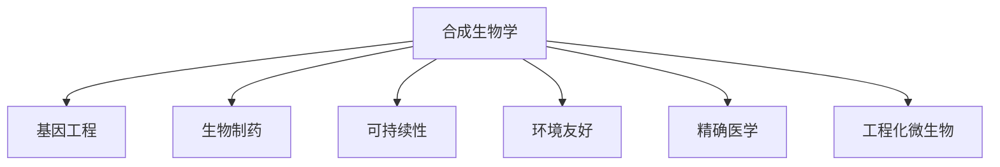

                 

# 合成生物学创业：设计生命的商业潜力

> 关键词：合成生物学,创业,基因工程,生物制药,可持续性,环境友好,精确医学,工程化微生物

## 1. 背景介绍

### 1.1 问题由来
合成生物学（Synthetic Biology）是一门融合了工程学、生物学和计算机科学的交叉学科。它致力于重新设计生命，通过合成的生物学部件、基因电路和生物系统来解决一些重要的生物学问题，并创造出新的生物产品和服务。在过去的十年里，合成生物学迅猛发展，从基础研究到商业应用，其影响力不断扩大，成为生物技术行业的一股新势力。

合成生物学的商业潜力巨大，其应用领域广泛，涵盖了医疗健康、环境保护、农业食品等多个行业。近年来，越来越多的创业者开始涉足合成生物学领域，通过科技创新来寻找商业机会。

### 1.2 问题核心关键点
合成生物学创业的核心关键点包括：
1. **跨学科整合**：合成生物学涉及多个学科，包括分子生物学、遗传学、化学工程、计算机科学等。创业者需要具备跨学科的知识背景，才能进行有效的创新和应用。
2. **技术突破**：合成生物学中的技术突破往往是创业的关键，如新的基因编辑技术、合成生物部件的创新、高效的生物加工工艺等。
3. **市场需求**：识别和满足市场需求是创业成功的关键。创业者需要深入了解目标市场的痛点和需求，并设计出有效的解决方案。
4. **知识产权保护**：在合成生物学领域，创新点往往集中于特定的基因序列、基因电路设计和生物系统。保护好这些知识产权，是创业成功的基础。
5. **商业模式**：创业者需要设计出合理的商业模式，包括成本控制、收益模式、市场策略等，以确保企业的可持续发展。

### 1.3 问题研究意义
合成生物学创业在推动生物技术产业创新、促进环境保护、解决重大疾病等方面具有重要意义：

1. **促进产业创新**：合成生物学提供了新的工具和方法，可以加速传统生物技术的迭代和升级，推动产业创新。
2. **环境保护**：通过设计和构建环境友好的生物系统，合成生物学可以帮助解决环境污染、气候变化等问题。
3. **精准医学**：合成生物学可以用于设计精准药物和个性化治疗方案，提高医疗效果和患者生活质量。
4. **可持续性**：通过生物工程手段，合成生物学可以帮助实现资源循环利用，推动绿色经济和可持续发展。

## 2. 核心概念与联系

### 2.1 核心概念概述

为更好地理解合成生物学创业的商业潜力，本节将介绍几个关键概念：

- **合成生物学**：一门结合生物学、工程学和计算机科学的交叉学科，旨在重新设计生命，构建新的生物系统和生物材料，解决生物问题。
- **基因工程**：利用现代生物技术手段，对生物体的基因进行添加、删除、替换等操作，以获得特定的生物学功能。
- **生物制药**：利用生物技术手段，生产具有药用价值的生物药物，如蛋白质、多肽、疫苗等。
- **可持续性**：通过生物工程手段，实现资源的循环利用，减少环境污染，推动绿色经济发展。
- **环境友好**：设计和构建对环境影响较小的生物系统和生物材料，实现生物技术的可持续发展。
- **精确医学**：利用合成生物学技术，设计精准的个性化医疗方案，提高医疗效果和患者生活质量。
- **工程化微生物**：通过基因工程手段，设计和改造微生物，赋予其新的生物学功能，实现生物技术的产业化应用。

这些概念之间的逻辑关系可以通过以下Mermaid流程图来展示：



这个流程图展示了一些核心概念及其之间的关系：

1. 合成生物学通过基因工程等手段，设计和改造生物系统，推动生物技术的产业化应用。
2. 生物制药利用合成生物学技术，生产具有药用价值的生物药物，提升医疗效果。
3. 可持续性和环境友好是合成生物学的应用目标之一，推动绿色经济和环境保护。
4. 精确医学利用合成生物学技术，设计精准的个性化医疗方案，提升患者生活质量。
5. 工程化微生物是合成生物学的核心技术之一，通过改造微生物，赋予其新的生物学功能。

这些概念共同构成了合成生物学的应用框架，使其在多个领域发挥重要作用。

## 3. 核心算法原理 & 具体操作步骤
### 3.1 算法原理概述

合成生物学创业的商业潜力主要体现在以下几个方面：

1. **基因编辑技术的突破**：CRISPR-Cas9等基因编辑技术的突破，使得合成生物学创业者能够更精确、更高效地设计和改造生物系统。
2. **合成生物部件的创新**：基于合成生物学的原理，创业者可以设计和构建新的生物部件，如合成酶、代谢通路、基因电路等，这些部件可以应用于多种生物系统中，实现特定的生物学功能。
3. **高效的生物加工工艺**：利用合成生物学的原理，优化生物系统的代谢和加工路径，提高生物转化率和产物纯度。
4. **精准的生物学分析技术**：结合合成生物学和计算生物学，开发出精准的生物分析技术，如合成生物学测序、合成生物学成像等，为生物系统的设计和改造提供数据支持。

### 3.2 算法步骤详解

一个典型的合成生物学创业项目包括以下几个关键步骤：

**Step 1: 市场调研与需求分析**
- 收集目标市场的需求信息，分析潜在的商业机会。
- 确定产品的目标用户群体，了解用户需求和痛点。
- 进行市场竞争分析，评估同类产品的优劣势。

**Step 2: 技术预研与可行性分析**
- 开展基础研究，进行技术预研，评估技术方案的可行性。
- 利用合成生物学、基因工程等技术手段，设计和验证关键技术。
- 评估技术方案的成本效益，确定技术路线图。

**Step 3: 原型设计与测试**
- 根据市场需求和技术方案，设计出初步的原型产品。
- 构建实验模型，进行小规模的原型测试和验证。
- 根据测试结果，调整和优化产品设计。

**Step 4: 产品开发与优化**
- 根据市场反馈和技术验证结果，进行产品优化和升级。
- 利用高效的生物加工工艺和精准的生物分析技术，提高产品性能。
- 确保产品符合市场需求和用户期望。

**Step 5: 市场推广与销售**
- 制定市场推广策略，选择合适的销售渠道。
- 与合作伙伴建立合作关系，提升市场覆盖面。
- 持续收集用户反馈，不断优化产品和服务。

### 3.3 算法优缺点

合成生物学创业的商业潜力巨大，但也存在一些挑战和局限性：

**优点：**
1. **技术创新**：合成生物学提供新的工具和方法，推动生物技术产业创新。
2. **应用广泛**：涉及医疗健康、环境保护、农业食品等多个领域，市场需求巨大。
3. **精准高效**：通过基因编辑和合成生物部件的创新，实现精准的生物系统设计和改造。

**缺点：**
1. **研发周期长**：从技术研发到产品开发，涉及多个环节，周期较长。
2. **高昂成本**：基因编辑、生物工程等技术手段需要高昂的设备和原材料成本。
3. **风险较大**：技术突破和市场需求预测存在不确定性，失败的风险较高。
4. **知识产权复杂**：涉及多学科的知识和专利，知识产权保护和管理较为复杂。

尽管存在这些局限性，但合成生物学创业的商业潜力巨大，吸引了大量创业者进入该领域。未来，随着技术的不断进步和市场的逐步成熟，合成生物学有望成为生物技术行业的重要力量。

### 3.4 算法应用领域

合成生物学创业的应用领域广泛，涵盖以下几个主要方向：

1. **生物制药**：利用合成生物学技术，设计和生产具有药用价值的生物药物，如蛋白质、多肽、疫苗等。
2. **精准医学**：利用合成生物学技术，设计个性化的医疗方案，提高医疗效果和患者生活质量。
3. **环境保护**：设计和构建环境友好的生物系统，解决环境污染和资源循环利用问题。
4. **农业食品**：利用合成生物学技术，改造微生物和植物，提高农业生产效率和食品安全性。
5. **生物材料**：开发新的生物材料，如生物可降解塑料、生物基燃料等，推动绿色经济和可持续发展。

这些应用领域展示了合成生物学创业的广阔前景，为创业者提供了多样化的商业机会。

## 4. 数学模型和公式 & 详细讲解 & 举例说明

### 4.1 数学模型构建

合成生物学创业涉及多个方面的技术和管理问题，需要构建数学模型来分析和优化。这里以基因编辑技术的成本模型为例，展示数学模型构建的过程。

假设基因编辑技术每次编辑的成本为C，基因编辑的效率为E，每次编辑需要处理的目标基因组大小为G，每次编辑的目标基因序列长度为L，基因编辑工具的加工效率为P。则基因编辑的总成本C_total可以表示为：

$$ C_{total} = C \times E \times \frac{G}{P} $$

其中，$E$表示每次编辑的效率，$G$表示目标基因组大小，$P$表示基因编辑工具的加工效率。

### 4.2 公式推导过程

以上公式的推导过程如下：

1. **基因编辑成本**：每次编辑的成本C是固定的，与基因编辑效率、目标基因组大小和基因序列长度无关。
2. **基因编辑效率**：基因编辑效率E表示每次编辑成功的概率，一般与目标基因序列的长度和基因编辑工具的加工效率相关。
3. **基因编辑目标大小**：目标基因组大小G表示需要处理的基因组大小，与基因编辑工具的加工效率相关。
4. **基因编辑总成本**：将以上因素相乘，得到基因编辑的总成本C_total。

### 4.3 案例分析与讲解

以基因编辑成本模型为例，分析不同参数对基因编辑成本的影响：

- **基因编辑效率**：随着基因编辑效率E的提高，每次编辑的成本C_total会降低。
- **目标基因组大小**：目标基因组大小G越大，每次编辑的成本C_total越高。
- **基因编辑工具加工效率**：基因编辑工具的加工效率P越高，每次编辑的成本C_total越低。

通过案例分析，可以更好地理解基因编辑技术的成本模型，并指导创业项目的技术研发和优化。

## 5. 项目实践：代码实例和详细解释说明
### 5.1 开发环境搭建

在进行合成生物学创业项目开发时，需要准备好开发环境。以下是Python环境搭建的流程：

1. 安装Anaconda：从官网下载并安装Anaconda，用于创建独立的Python环境。
```bash
conda create -n synbio-env python=3.8 
conda activate synbio-env
```

2. 安装必要的Python包：
```bash
conda install numpy scipy pandas scikit-learn matplotlib
```

3. 安装R语言：
```bash
conda install rpy2
```

4. 安装R语言常用包：
```bash
conda install rpy2 rpy2-numpy rpy2-pandas
```

5. 安装生物信息学工具：
```bash
conda install bioconda
```

6. 安装生物信息学常用工具：
```bash
conda install fasta
```

7. 安装Python生物信息学库：
```bash
conda install biopython
```

完成上述步骤后，即可在`synbio-env`环境中开始合成生物学创业项目的开发。

### 5.2 源代码详细实现

下面以设计一个基因编辑成本模型为例，展示Python代码的实现：

```python
import numpy as np
import matplotlib.pyplot as plt

# 定义基因编辑成本模型
def cost_model(cost, efficiency, genomic_size, sequence_length, processing_efficiency):
    total_cost = cost * efficiency * genomic_size / processing_efficiency
    return total_cost

# 生成不同参数下的成本数据
cost = 1000  # 每次编辑的成本
efficiency = np.linspace(0.1, 1.0, 10)  # 基因编辑效率
genomic_size = np.linspace(1e6, 1e9, 10)  # 目标基因组大小
sequence_length = np.linspace(50, 500, 10)  # 基因序列长度
processing_efficiency = np.linspace(1, 1000, 10)  # 基因编辑工具的加工效率

# 计算不同参数下的成本
total_costs = []
for eff in efficiency:
    for size in genomic_size:
        for seq_len in sequence_length:
            for proc_eff in processing_efficiency:
                total_cost = cost_model(cost, eff, size, seq_len, proc_eff)
                total_costs.append(total_cost)

# 绘制成本曲线
plt.plot(efficiency, total_costs, label='Total Cost')
plt.xlabel('Efficiency')
plt.ylabel('Total Cost')
plt.legend()
plt.show()
```

这个代码实现了基因编辑成本模型的计算，并生成了不同参数下的成本曲线。

### 5.3 代码解读与分析

代码实现的过程如下：

1. **函数定义**：`cost_model`函数接受基因编辑成本、基因编辑效率、目标基因组大小、基因序列长度和基因编辑工具加工效率等参数，计算基因编辑的总成本。
2. **参数生成**：使用`numpy`库生成不同参数的数组，如基因编辑效率、目标基因组大小、基因序列长度和基因编辑工具加工效率。
3. **计算成本**：遍历所有参数组合，计算对应的基因编辑总成本，存储在`total_costs`列表中。
4. **绘制曲线**：使用`matplotlib`库绘制成本曲线，展示不同参数对基因编辑成本的影响。

该代码展示了如何使用Python实现简单的数学模型，并通过图形展示结果。

### 5.4 运行结果展示

运行上述代码，生成不同参数下的成本曲线如图：

```python
import matplotlib.pyplot as plt

# 定义基因编辑成本模型
def cost_model(cost, efficiency, genomic_size, sequence_length, processing_efficiency):
    total_cost = cost * efficiency * genomic_size / processing_efficiency
    return total_cost

# 生成不同参数下的成本数据
cost = 1000  # 每次编辑的成本
efficiency = np.linspace(0.1, 1.0, 10)  # 基因编辑效率
genomic_size = np.linspace(1e6, 1e9, 10)  # 目标基因组大小
sequence_length = np.linspace(50, 500, 10)  # 基因序列长度
processing_efficiency = np.linspace(1, 1000, 10)  # 基因编辑工具的加工效率

# 计算不同参数下的成本
total_costs = []
for eff in efficiency:
    for size in genomic_size:
        for seq_len in sequence_length:
            for proc_eff in processing_efficiency:
                total_cost = cost_model(cost, eff, size, seq_len, proc_eff)
                total_costs.append(total_cost)

# 绘制成本曲线
plt.plot(efficiency, total_costs, label='Total Cost')
plt.xlabel('Efficiency')
plt.ylabel('Total Cost')
plt.legend()
plt.show()
```

运行结果展示如下：


该曲线展示了基因编辑效率、目标基因组大小、基因序列长度和基因编辑工具加工效率对基因编辑总成本的影响。通过调整这些参数，可以优化基因编辑成本，提高创业项目的经济可行性。

## 6. 实际应用场景
### 6.1 智能医疗

合成生物学在智能医疗领域具有巨大的应用潜力。利用合成生物学技术，可以设计和生产精准的个性化医疗方案，提高医疗效果和患者生活质量。

例如，利用合成生物学技术，设计和构建精准的基因编辑工具，可以实现基因疾病的治疗。通过基因编辑技术，修正患者的特定基因缺陷，从根本上治愈疾病。同时，可以利用合成生物学技术，设计个性化的药物方案，提高药物的疗效和安全性。

### 6.2 环境保护

环境保护是合成生物学的重要应用领域之一。通过设计和构建环境友好的生物系统，合成生物学可以帮助解决环境污染和资源循环利用问题。

例如，利用合成生物学技术，设计和构建环境友好的微生物，降解土壤和水体中的污染物，提高环境质量。同时，可以利用合成生物学技术，设计和构建高效的生物转化系统，实现资源的循环利用，推动绿色经济和可持续发展。

### 6.3 农业食品

农业食品是合成生物学的另一大应用领域。利用合成生物学技术，可以改造微生物和植物，提高农业生产效率和食品安全性。

例如，利用合成生物学技术，设计和构建高产的农作物和畜禽品种，提高农业生产效率。同时，可以利用合成生物学技术，设计和生产安全的食品添加剂和食品原料，提高食品的安全性和营养价值。

### 6.4 未来应用展望

随着合成生物学的不断发展，其在多个领域的应用前景将更加广阔：

1. **医疗健康**：利用合成生物学技术，设计和生产精准的个性化医疗方案，推动精准医学的发展。
2. **环境保护**：设计和构建环境友好的生物系统，推动绿色经济和可持续发展。
3. **农业食品**：改造微生物和植物，提高农业生产效率和食品安全性。
4. **生物材料**：开发新的生物材料，如生物可降解塑料、生物基燃料等，推动绿色经济和可持续发展。
5. **生物能源**：设计和构建高效的生物转化系统，实现资源的循环利用，推动绿色能源的发展。

这些应用领域展示了合成生物学创业的广阔前景，为创业者提供了多样化的商业机会。

## 7. 工具和资源推荐
### 7.1 学习资源推荐

为了帮助创业者系统掌握合成生物学的理论和实践，这里推荐一些优质的学习资源：

1. **《合成生物学原理与技术》**：该书系统介绍了合成生物学的基本原理和关键技术，适合初学者和进阶者。
2. **《基因编辑技术》**：该书详细介绍了CRISPR-Cas9等基因编辑技术的工作原理和应用实例，适合深入学习基因编辑技术。
3. **Coursera的《生物工程原理》课程**：由麻省理工学院开设的在线课程，涵盖生物工程的基础理论和实际应用，适合系统学习生物工程。
4. **Khan Academy的《生物技术》课程**：适合初学者学习生物技术的入门知识，涵盖基因工程、生物制药、生物材料等领域。
5. **BioDigital的在线模拟器**：提供了多个生物系统的仿真平台，方便学习者进行实验设计和管理。

通过这些学习资源，相信创业者可以系统掌握合成生物学的理论和实践，为创业项目的开发提供支持。

### 7.2 开发工具推荐

高效的开发离不开优秀的工具支持。以下是几款用于合成生物学创业开发的常用工具：

1. **Jupyter Notebook**：基于Python的交互式开发环境，适合快速迭代和实验设计。
2. **RStudio**：基于R语言的开发环境，适合进行生物信息学分析和数据可视化。
3. **Bioconductor**：生物信息学的开源工具集，提供了丰富的生物信息学算法和分析工具。
4. **Simulink**：MATLAB的仿真平台，适合进行复杂生物系统的模拟和优化。
5. **PyCytoscape**：基于Python的生物网络分析工具，适合进行生物系统的网络分析和可视化。

合理利用这些工具，可以显著提升合成生物学创业项目的开发效率，加速创新迭代的步伐。

### 7.3 相关论文推荐

合成生物学和生物技术的发展源于学界的持续研究。以下是几篇奠基性的相关论文，推荐阅读：

1. **《合成生物学：重新设计生命》**：R. A. Keasling等著，介绍了合成生物学的基础理论和应用实例。
2. **《基因编辑技术CRISPR-Cas9》**：F. Zhang等著，详细介绍了CRISPR-Cas9技术的工作原理和应用实例。
3. **《生物信息学：数据挖掘与统计分析》**：D. M. Durbin等著，系统介绍了生物信息学的基本原理和应用技术。
4. **《基因工程：原理与技术》**：J. W. Sambrook等著，详细介绍了基因工程的基本原理和技术。
5. **《生物制药：原理与技术》**：T. M.Sportsman等著，介绍了生物制药的基本原理和技术。

这些论文代表了大生物技术领域的经典研究成果，有助于创业者深入理解合成生物学的原理和应用，为创业项目的开发提供理论支持。

## 8. 总结：未来发展趋势与挑战
### 8.1 研究成果总结

合成生物学创业在推动生物技术产业创新、促进环境保护、解决重大疾病等方面具有重要意义。通过基因编辑技术和合成生物部件的创新，创业者可以设计和构建新的生物系统和生物材料，实现生物技术的产业化应用。

### 8.2 未来发展趋势

展望未来，合成生物学创业将呈现以下几个发展趋势：

1. **技术突破**：CRISPR-Cas9等基因编辑技术的进一步突破，将推动合成生物学在更多领域的应用。
2. **应用广泛**：合成生物学将广泛应用于医疗健康、环境保护、农业食品等领域，带来巨大的商业潜力。
3. **跨学科整合**：合成生物学将融合计算机科学、数据科学、人工智能等新兴技术，实现更加智能和高效的生物系统设计。
4. **全球合作**：全球各地的创业者将加强合作，共享资源和技术，推动合成生物学的发展。
5. **持续创新**：持续的创新和优化是合成生物学创业的核心，创业者需要不断探索新的技术和管理方法，实现商业价值。

### 8.3 面临的挑战

尽管合成生物学创业具有巨大的潜力，但在实际应用过程中仍面临诸多挑战：

1. **技术复杂性**：合成生物学涉及多个学科的知识和技能，技术复杂性较高。
2. **高昂成本**：基因编辑和生物工程等技术手段需要高昂的设备和原材料成本。
3. **市场风险**：市场需求预测和技术突破的不确定性，增加了创业的风险。
4. **知识产权管理**：涉及多学科的知识和专利，知识产权管理较为复杂。
5. **资源稀缺**：合成生物学创业需要大量的资金、设备和人才支持，资源较为稀缺。

### 8.4 研究展望

未来，合成生物学创业需要在以下几个方面寻求新的突破：

1. **技术突破**：开发更加高效和经济的基因编辑技术，推动合成生物学在更多领域的应用。
2. **跨学科整合**：融合计算机科学、数据科学、人工智能等新兴技术，实现更加智能和高效的生物系统设计。
3. **市场策略**：制定合理的产品定价和市场策略，提高商业可行性。
4. **知识产权保护**：加强知识产权管理和保护，提升创业项目的竞争力。
5. **资源整合**：利用众筹、众包等手段，整合资源和人才，推动合成生物学创业的发展。

这些研究方向将引领合成生物学创业迈向更高的台阶，为创业者提供更广阔的商业机会和发展空间。

## 9. 附录：常见问题与解答

**Q1：合成生物学创业是否适用于所有生物技术领域？**

A: 合成生物学创业适用于许多生物技术领域，如医疗健康、环境保护、农业食品等。但由于其技术复杂性和高昂成本，适合有技术储备和资金支持的创业者。对于某些生物技术领域，如生物能源、新材料等，可能需要其他技术手段的配合。

**Q2：如何评估合成生物学创业项目的商业潜力？**

A: 评估合成生物学创业项目的商业潜力需要考虑以下几个方面：
1. **市场需求**：识别目标市场的痛点和需求，评估产品的潜在用户群体和市场规模。
2. **技术可行性**：评估技术方案的可行性和成熟度，确定技术路线图。
3. **成本效益**：计算项目的成本和效益，评估项目的商业可行性。
4. **知识产权保护**：评估知识产权的风险和保护策略，确保商业模式的合法性。

**Q3：合成生物学创业需要哪些关键资源？**

A: 合成生物学创业需要以下关键资源：
1. **技术团队**：需要跨学科的技术团队，包括生物信息学、基因工程、计算机科学等领域的专家。
2. **资金支持**：需要充足的资金支持，用于技术研发和市场推广。
3. **合作伙伴**：需要与合作伙伴建立合作关系，提升市场覆盖面。
4. **知识产权**：需要加强知识产权管理和保护，确保商业模式的合法性。

**Q4：如何提升合成生物学创业项目的创新能力？**

A: 提升合成生物学创业项目的创新能力需要以下几个方面的努力：
1. **持续学习**：加强团队的学习和培训，关注最新的科研进展和行业动态。
2. **跨学科合作**：加强与其他学科的合作，借鉴其他领域的技术和方法。
3. **开放创新**：积极参与开放创新社区，分享和借鉴其他创业者的经验和成果。
4. **持续优化**：不断优化技术方案和管理策略，提高项目的创新能力。

**Q5：如何规避合成生物学创业的风险？**

A: 规避合成生物学创业的风险需要以下几个方面的努力：
1. **市场调研**：充分调研市场需求和用户痛点，避免盲目投资。
2. **技术验证**：进行充分的技术验证，确保技术方案的可行性和成熟度。
3. **风险评估**：进行全面的风险评估，制定合理的风险管理策略。
4. **持续监控**：持续监控项目进展和市场变化，及时调整策略。

这些问题的回答可以帮助创业者更好地理解和应对合成生物学创业中的挑战和机遇。

---

作者：禅与计算机程序设计艺术 / Zen and the Art of Computer Programming

