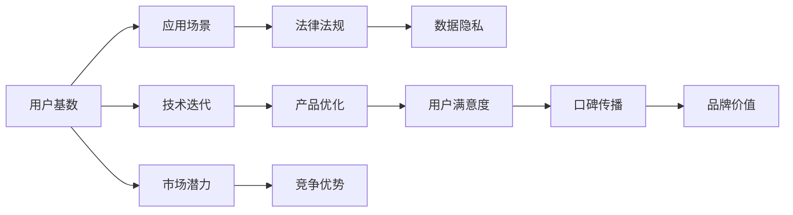

                 

# 国内AI优势：庞大用户基数，积极尝试新事物利于产品迭代

> 关键词：国内AI优势，用户基数，技术迭代，AI产品优化，AI应用场景

## 1. 背景介绍

### 1.1 问题由来

随着人工智能技术的飞速发展，AI在医疗、教育、金融、制造等多个领域的应用逐渐深入人心。尤其是在中国，巨大的市场潜力和丰富的应用场景为AI产业的发展提供了得天独厚的条件。与一些AI技术起步较早的西方国家相比，国内在AI领域的表现可谓后来居上。

国内庞大的互联网用户基数和高速增长的数字经济发展，为AI技术的落地应用提供了丰富的数据资源。加之国内企业对于新技术的积极尝试和快速迭代，使得国内AI产品在诸多领域取得了显著的突破。然而，国内AI的发展也面临着诸多挑战，如数据隐私保护、技术伦理、法律法规等。

本文旨在通过探讨国内AI产业的优势，分析技术迭代和产品优化背后的因素，为国内AI行业的发展提供一些有益的参考。

### 1.2 问题核心关键点

1. **用户基数**：超过10亿的互联网用户为AI提供了丰富的数据资源。
2. **技术迭代**：快速迭代的产品策略和积极尝试新技术的氛围。
3. **应用场景**：多样化的应用场景为AI落地提供了丰富的实践机会。
4. **法律法规**：逐步完善的法律法规体系为AI应用提供了保障。
5. **数据隐私**：数据隐私保护意识的提升为AI的发展带来了新的挑战。

## 2. 核心概念与联系

### 2.1 核心概念概述

本节将对核心概念进行简单介绍，并分析它们之间的联系：

- **用户基数**：指互联网用户的数量，反映了潜在用户市场的规模。
- **技术迭代**：指快速更新和优化产品功能的策略。
- **应用场景**：指AI技术可以应用的具体领域。
- **法律法规**：指与AI技术相关的法律和政策。
- **数据隐私**：指保护用户隐私不被泄露的重要原则。

### 2.2 Mermaid 流程图

以下是概念之间的联系示意图：



这个流程图展示了用户基数、技术迭代、应用场景、法律法规和数据隐私之间的相互关系。用户基数直接推动了技术迭代和产品优化，而技术迭代和产品优化又提升了用户体验和满意度，进而影响了品牌价值和市场潜力。法律法规和数据隐私则是保护这些关系健康发展的重要保障。

## 3. 核心算法原理 & 具体操作步骤

### 3.1 算法原理概述

AI产品的快速迭代和优化，其核心在于算法原理和具体操作步骤的不断优化。本文将介绍几个关键算法及其原理：

1. **强化学习（Reinforcement Learning, RL）**：通过试错机制，不断调整模型参数以优化输出结果。
2. **迁移学习（Transfer Learning）**：利用预训练模型，通过微调适应新的应用场景。
3. **生成对抗网络（Generative Adversarial Network, GAN）**：通过两个对抗模型之间的博弈，生成更加逼真的数据。

### 3.2 算法步骤详解

以强化学习为例，其基本步骤包括：

1. **环境设定**：定义AI产品需要处理的环境和任务。
2. **策略选择**：选择一种策略（如随机策略、Q-learning等）来探索环境。
3. **动作执行**：执行策略产生的动作，观察环境的反馈。
4. **奖惩机制**：根据环境的反馈，调整策略的奖励机制。
5. **参数更新**：通过梯度下降等优化算法更新模型参数，以提高策略的性能。

### 3.3 算法优缺点

强化学习的优点包括：
- 能够处理连续型任务和不确定性问题。
- 适用于无监督学习和在线学习。

缺点包括：
- 训练过程需要大量计算资源和数据。
- 容易陷入局部最优解。

### 3.4 算法应用领域

强化学习在以下领域有广泛应用：
- **游戏AI**：如AlphaGo。
- **机器人控制**：如无人驾驶。
- **推荐系统**：如电商推荐。

## 4. 数学模型和公式 & 详细讲解 & 举例说明

### 4.1 数学模型构建

强化学习的数学模型通常由以下几个部分组成：

- **状态空间**：$S$，表示环境的当前状态。
- **动作空间**：$A$，表示可以采取的动作。
- **状态转移概率**：$P(s_{t+1}|s_t,a_t)$，表示在状态$s_t$下，执行动作$a_t$后状态转移到$s_{t+1}$的概率。
- **奖惩机制**：$R(s_t,a_t)$，表示在状态$s_t$下，执行动作$a_t$后获得的奖励。

### 4.2 公式推导过程

以Q-learning为例，其核心公式为：

$$ Q(s_t,a_t) \leftarrow Q(s_t,a_t) + \alpha [R(s_t,a_t) + \gamma \max Q(s_{t+1},a_{t+1}) - Q(s_t,a_t)] $$

其中，$\alpha$为学习率，$\gamma$为折扣因子，$Q(s_t,a_t)$为在状态$s_t$下执行动作$a_t$的Q值。

### 4.3 案例分析与讲解

假设一个电商推荐系统，用户通过浏览商品进行消费行为。系统需要学习在用户浏览商品后，推荐哪些商品最能激发用户购买欲望。强化学习可以通过不断试验不同的推荐策略，根据用户的点击和购买行为，调整策略，最大化推荐效果。

## 5. 项目实践：代码实例和详细解释说明

### 5.1 开发环境搭建

本节将介绍如何进行开发环境搭建，以便后续代码实现。

1. **安装Python**：确保Python 3.8或以上版本已经安装。
2. **安装TensorFlow**：
```bash
pip install tensorflow
```
3. **安装PyTorch**：
```bash
pip install torch
```

### 5.2 源代码详细实现

以下是一个简单的强化学习示例代码：

```python
import tensorflow as tf
import numpy as np

class QLearningAgent:
    def __init__(self, env, learning_rate=0.1, discount_factor=0.99):
        self.env = env
        self.learning_rate = learning_rate
        self.discount_factor = discount_factor
        self.q_table = np.zeros([env.observation_space.n, env.action_space.n])

    def choose_action(self, state):
        return np.random.choice(env.action_space.n)

    def train(self, episode_count):
        for episode in range(episode_count):
            state = env.reset()
            done = False
            while not done:
                action = self.choose_action(state)
                next_state, reward, done, _ = env.step(action)
                max_next_q = np.max(self.q_table[next_state])
                current_q = self.q_table[state, action]
                new_q = (1 - self.learning_rate) * current_q + self.learning_rate * (reward + self.discount_factor * max_next_q)
                self.q_table[state, action] = new_q
                state = next_state
```

### 5.3 代码解读与分析

该示例代码实现了一个简单的Q-learning代理，用于训练一个在环境中获取奖励的代理。

**主函数**：
- 定义学习率、折扣因子和Q表格。
- 在每个周期内，重置环境，并执行Q-learning算法。
- 在每个周期结束时，输出Q表格的当前状态。

**Q-learning算法**：
- 选择当前状态下的动作。
- 执行动作，并观察环境的下一步状态和奖励。
- 计算当前状态和下一步状态之间的Q值。
- 根据Q-learning公式更新Q表格。

### 5.4 运行结果展示

运行代码后，输出的Q表格显示了在每个状态下选择不同动作的Q值。这可以帮助我们理解模型在不同状态下的偏好，并据此调整策略。

## 6. 实际应用场景

### 6.1 电商推荐

电商推荐系统通过强化学习，可以在不断反馈中优化推荐策略，提高用户满意度。例如，Amazon的推荐系统利用强化学习算法，不断调整商品的推荐顺序和推荐模型，实现了个性化推荐和用户转化率的提升。

### 6.2 无人驾驶

无人驾驶中的导航和决策问题可以通过强化学习解决。系统通过感知环境，选择合适的驾驶策略，最大化到达目的地的效率和安全性。

### 6.3 金融交易

金融交易系统利用强化学习进行交易策略的优化。例如，基于历史交易数据的强化学习算法，可以预测股票价格走势，辅助投资决策。

## 7. 工具和资源推荐

### 7.1 学习资源推荐

为了深入了解强化学习，可以参考以下学习资源：

1. **《Reinforcement Learning: An Introduction》**：由Richard S. Sutton和Andrew G. Barto合著的经典教材。
2. **Coursera上的《强化学习》课程**：由David Silver主讲，涵盖强化学习的理论和应用。
3. **Kaggle上的强化学习竞赛**：通过实际问题，提升强化学习的应用能力。

### 7.2 开发工具推荐

- **TensorFlow**：灵活高效的深度学习框架。
- **PyTorch**：动态计算图，适合快速原型开发。
- **Jupyter Notebook**：交互式编程环境，便于实验和调试。

### 7.3 相关论文推荐

- **Playing Atari with Deep Reinforcement Learning**：David Silver等。
- **Deep Reinforcement Learning for Cheat Detection**：Ian Goodfellow等。
- **Human-level Control through Deep Reinforcement Learning**：Volodymyr Mnih等。

## 8. 总结：未来发展趋势与挑战

### 8.1 研究成果总结

强化学习等AI技术在国内已经取得了显著进展，并在多个领域展示了其巨大潜力。通过不断优化算法和迭代产品，AI应用在国内市场获得了广泛认可。

### 8.2 未来发展趋势

未来AI的发展趋势包括：
- **跨领域应用**：AI将更多地应用于医疗、金融、制造等领域，推动各行各业智能化升级。
- **自动化与智能化**：自动化和智能化技术将不断进步，推动更多行业实现智能化转型。
- **数据安全与隐私保护**：随着数据量的增长，数据安全和隐私保护将成为AI发展的关键。

### 8.3 面临的挑战

尽管国内AI发展迅速，但也面临一些挑战：
- **数据隐私**：如何在数据利用和隐私保护之间找到平衡，是一个重要的课题。
- **法律法规**：如何构建完善的法律法规体系，规范AI技术的应用。
- **技术伦理**：AI技术的应用需要考虑伦理和道德问题。

### 8.4 研究展望

未来AI的研究方向包括：
- **跨领域学习**：跨学科融合，推动AI技术的发展。
- **模型可解释性**：提高模型的可解释性，提升用户信任度。
- **大规模数据集**：构建大规模、高质量的数据集，推动AI技术的进一步发展。

## 9. 附录：常见问题与解答

**Q1: 为什么国内AI能迅速发展？**

A: 国内庞大的互联网用户基数和高速增长的数字经济发展，为AI技术的应用提供了丰富的数据资源。企业对新技术的积极尝试和快速迭代，使得AI产品在多个领域取得了显著的突破。

**Q2: 强化学习如何应用于电商推荐？**

A: 电商推荐系统可以利用强化学习，不断试验不同的推荐策略，根据用户的点击和购买行为，调整策略，最大化推荐效果。

**Q3: 数据隐私保护对AI发展的影响有哪些？**

A: 数据隐私保护意识的提升，为AI的发展带来了新的挑战。如何在数据利用和隐私保护之间找到平衡，是未来AI发展的重要课题。

---

作者：禅与计算机程序设计艺术 / Zen and the Art of Computer Programming

