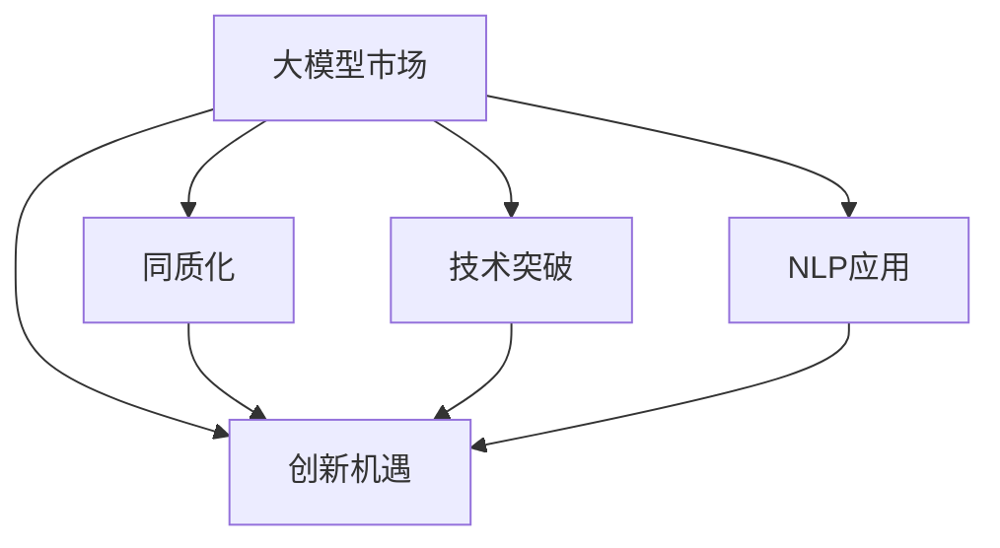

                 

# 国内大模型市场：贾扬清的观点，同质化发展与创新机遇

> 关键词：大模型市场，同质化，创新机遇，贾扬清，NLP应用

## 1. 背景介绍

随着深度学习技术的飞速发展，大语言模型(Large Language Models, LLMs)在自然语言处理(NLP)领域取得了举世瞩目的成绩。这些大模型，如GPT-3、BERT等，通过在海量无标签文本数据上进行预训练，学习到丰富的语言知识和常识，可以用于多种NLP任务，如文本分类、命名实体识别、机器翻译、对话系统等。这些预训练模型的出现，极大地推动了NLP技术的发展，使得NLP应用落地成为可能。

在国内，随着AI产业的蓬勃发展，越来越多的企业开始探索大模型技术的应用。大模型的出现，不仅带来了技术上的突破，也为各行业数字化转型提供了新的机遇。然而，尽管大模型技术取得了显著的进展，但国内大模型市场仍面临着同质化发展的挑战，创新机遇亟待挖掘。

## 2. 核心概念与联系

为了更好地理解国内大模型市场的现状与挑战，我们需要首先明确几个核心概念，并探讨它们之间的联系：

### 2.1 核心概念概述

- **大模型市场**：指以大语言模型为核心的市场，涵盖模型训练、部署、应用等各个环节。大模型市场的发展，推动了NLP技术的广泛应用，带来巨大的商业价值。
- **同质化**：指市场上大模型的技术方案和应用场景高度相似，缺乏差异化创新。这不仅影响了技术的多样性，也可能导致资源浪费和竞争加剧。
- **创新机遇**：指在当前大模型市场同质化趋势下，存在的创新方向和技术突破点。这些机遇将为市场注入新的活力，推动行业持续发展。

### 2.2 核心概念原理和架构的 Mermaid 流程图



以上流程图展示了大模型市场、同质化、创新机遇以及技术突破和大规模NLP应用之间的联系。我们可以看到，技术突破和大规模NLP应用为创新机遇提供了可能性，而同质化则可能抑制这些机遇的实现。

## 3. 核心算法原理 & 具体操作步骤

### 3.1 算法原理概述

国内大模型市场的发展，离不开算法和技术的支持。特别是基于深度学习的预训练和微调技术，极大地推动了模型性能的提升。以下是对大模型算法原理的概述：

- **预训练**：通过在大量无标签数据上训练大模型，使其学习到丰富的语言知识。常见的预训练任务包括自回归语言模型、掩码语言模型等。
- **微调**：在大模型基础上，使用有标签数据进行微调，使其能够适应特定的NLP任务。微调通常采用监督学习方法，通过调整模型参数，最小化任务损失。

### 3.2 算法步骤详解

在大模型市场，从预训练到微调，再到应用，整个流程包含多个步骤。以下是详细的算法步骤：

1. **数据准备**：收集并清洗大量的无标签文本数据，进行预处理和标注，用于模型的预训练。
2. **预训练模型选择**：选择合适的预训练模型作为初始化参数，如GPT-3、BERT等。
3. **微调模型设计**：根据具体应用场景，设计合适的任务适配层和损失函数，如分类任务的线性分类器和交叉熵损失。
4. **训练流程**：使用优化器对微调模型进行训练，通过迭代更新模型参数，最小化损失函数。
5. **应用部署**：将训练好的模型部署到实际应用中，进行推理和预测。

### 3.3 算法优缺点

国内大模型市场在快速发展的同时，也面临着一些问题：

**优点**：

- **性能提升**：通过预训练和微调，大模型在特定任务上通常能取得比从头训练更好的性能。
- **应用广泛**：大模型可用于多种NLP任务，如文本分类、命名实体识别、机器翻译等。
- **开发便捷**：使用开源框架和预训练模型，降低了NLP应用的开发门槛。

**缺点**：

- **同质化严重**：市场上大部分大模型采用相同的预训练和微调技术，缺乏差异化。
- **资源消耗大**：大模型通常需要大量的计算资源，企业需要投入大量资金进行硬件升级。
- **技术壁垒高**：预训练和微调过程复杂，对技术要求高，中小型企业难以独立完成。

### 3.4 算法应用领域

大模型技术已经在多个领域得到了广泛应用，例如：

- **金融领域**：用于舆情分析、金融数据处理等。
- **医疗领域**：用于病历分析、医疗问答等。
- **教育领域**：用于智能教育、智能测评等。
- **智能客服**：用于自然语言理解和对话系统。
- **智能创作**：用于文章生成、代码自动编写等。

## 4. 数学模型和公式 & 详细讲解 & 举例说明

### 4.1 数学模型构建

在实际应用中，大模型通常采用自回归模型进行预训练。以下是一个典型的自回归模型数学模型构建过程：

设模型参数为 $\theta$，输入序列为 $x = (x_1, x_2, ..., x_T)$，目标为 $y = (y_1, y_2, ..., y_T)$。模型的目标是最小化预测序列 $y$ 与真实序列 $y$ 之间的差距，即最小化损失函数 $L$。

假设模型采用注意力机制进行编码，则模型可以表示为：

$$
y_t = \sum_{i=1}^T \alpha_{t,i} x_i + \beta
$$

其中 $\alpha_{t,i}$ 为注意力权重，$\beta$ 为模型偏置项。

### 4.2 公式推导过程

接下来，我们将介绍如何通过优化算法（如梯度下降）对大模型进行微调。假设我们有一个二分类任务，输入序列 $x$ 和输出序列 $y$ 的损失函数为交叉熵损失，可以表示为：

$$
L(x, y) = -\frac{1}{T} \sum_{t=1}^T (y_t \log \hat{y}_t + (1-y_t) \log (1-\hat{y}_t))
$$

其中 $\hat{y}_t$ 为模型在输入 $x$ 下对输出 $y_t$ 的预测。通过梯度下降算法，对模型参数 $\theta$ 进行更新：

$$
\theta \leftarrow \theta - \eta \nabla_{\theta} L(x, y)
$$

其中 $\eta$ 为学习率，$\nabla_{\theta} L(x, y)$ 为损失函数对模型参数 $\theta$ 的梯度。

### 4.3 案例分析与讲解

以文本分类任务为例，假设我们有一个二分类任务，输入为文本 $x$，输出为分类标签 $y$。我们可以使用BERT模型进行微调，模型结构如下：


通过在BERT模型的顶层添加线性分类器和交叉熵损失函数，我们可以使用微调后的模型对新文本进行分类。具体的微调过程如下：

1. **数据准备**：收集并清洗文本数据，将其划分为训练集、验证集和测试集。
2. **模型选择**：选择BERT模型作为初始化参数。
3. **微调设计**：在BERT模型的顶层添加线性分类器和交叉熵损失函数。
4. **训练流程**：使用优化器（如AdamW）对模型进行训练，通过迭代更新模型参数，最小化损失函数。
5. **应用部署**：将训练好的模型部署到实际应用中，进行推理和预测。

## 5. 项目实践：代码实例和详细解释说明

### 5.1 开发环境搭建

为了进行大模型的预训练和微调，我们需要搭建一个良好的开发环境。以下是开发环境的搭建步骤：

1. **安装Anaconda**：
   ```bash
   conda install anaconda -n pytorch-env -c pytorch
   conda activate pytorch-env
   ```

2. **安装PyTorch和Transformer库**：
   ```bash
   pip install torch transformers
   ```

3. **安装其他依赖库**：
   ```bash
   pip install numpy pandas scikit-learn torchtext torchvision
   ```

### 5.2 源代码详细实现

以下是一个基于BERT模型的文本分类任务代码实现：

```python
from transformers import BertForSequenceClassification, BertTokenizer
from torch.utils.data import DataLoader
import torch

# 定义数据集
train_dataset = ...
dev_dataset = ...
test_dataset = ...

# 定义模型
model = BertForSequenceClassification.from_pretrained('bert-base-cased', num_labels=num_classes)

# 定义优化器
optimizer = AdamW(model.parameters(), lr=1e-5)

# 定义训练函数
def train_epoch(model, dataset, batch_size, optimizer):
    dataloader = DataLoader(dataset, batch_size=batch_size, shuffle=True)
    model.train()
    epoch_loss = 0
    for batch in dataloader:
        inputs = batch['input_ids'].to(device)
        attention_mask = batch['attention_mask'].to(device)
        labels = batch['labels'].to(device)
        model.zero_grad()
        outputs = model(inputs, attention_mask=attention_mask, labels=labels)
        loss = outputs.loss
        epoch_loss += loss.item()
        loss.backward()
        optimizer.step()
    return epoch_loss / len(dataloader)

# 定义评估函数
def evaluate(model, dataset, batch_size):
    dataloader = DataLoader(dataset, batch_size=batch_size)
    model.eval()
    preds, labels = [], []
    with torch.no_grad():
        for batch in dataloader:
            inputs = batch['input_ids'].to(device)
            attention_mask = batch['attention_mask'].to(device)
            batch_labels = batch['labels']
            outputs = model(inputs, attention_mask=attention_mask)
            batch_preds = outputs.logits.argmax(dim=1).to('cpu').tolist()
            batch_labels = batch_labels.to('cpu').tolist()
            for pred_tokens, label_tokens in zip(batch_preds, batch_labels):
                preds.append(pred_tokens)
                labels.append(label_tokens)
    
    return classification_report(labels, preds)

# 定义主函数
def main():
    epochs = 5
    batch_size = 16

    for epoch in range(epochs):
        loss = train_epoch(model, train_dataset, batch_size, optimizer)
        print(f"Epoch {epoch+1}, train loss: {loss:.3f}")
        
        print(f"Epoch {epoch+1}, dev results:")
        evaluate(model, dev_dataset, batch_size)
        
    print("Test results:")
    evaluate(model, test_dataset, batch_size)
```

### 5.3 代码解读与分析

以下是代码的详细解读：

- **数据集准备**：
  - `train_dataset`、`dev_dataset` 和 `test_dataset` 分别代表训练集、验证集和测试集。
  - 每个数据集包含输入文本 `input_ids`、注意力掩码 `attention_mask` 和标签 `labels`。

- **模型选择和优化器定义**：
  - `BertForSequenceClassification.from_pretrained` 用于加载BERT模型，并设置分类标签数。
  - `AdamW` 优化器用于最小化损失函数。

- **训练函数实现**：
  - `train_epoch` 函数负责一个epoch的训练，包括前向传播、计算损失、反向传播和参数更新。
  - 使用 `DataLoader` 对数据集进行批次化加载。
  - 使用 `model.train()` 设置模型为训练模式。
  - 在每个batch中，前向传播计算损失函数，并使用 `loss.backward()` 计算梯度。
  - 使用 `optimizer.step()` 更新模型参数。

- **评估函数实现**：
  - `evaluate` 函数负责对模型进行评估，包括计算预测标签和真实标签之间的分类报告。
  - 使用 `DataLoader` 对数据集进行批次化加载。
  - 使用 `model.eval()` 设置模型为评估模式。
  - 在每个batch中，前向传播计算预测标签。
  - 将预测标签和真实标签存储在 `preds` 和 `labels` 中，并返回分类报告。

## 6. 实际应用场景

大模型在实际应用场景中展现了强大的性能，以下是几个典型的应用场景：

### 6.4 金融领域

在金融领域，大模型可以用于舆情分析、金融数据处理等。通过收集和分析金融新闻、报告等文本数据，大模型可以识别出重要的金融事件和趋势，帮助金融机构做出更加明智的投资决策。

### 6.5 医疗领域

在医疗领域，大模型可以用于病历分析、医疗问答等。通过收集和分析医生的病历记录、患者提问等文本数据，大模型可以帮助医生更快地做出诊断，提供更加精准的治疗方案。

### 6.6 智能客服

在智能客服领域，大模型可以用于自然语言理解和对话系统。通过训练大模型，可以构建智能客服系统，提供24/7不间断的客户服务，提升客户体验和满意度。

### 6.7 智能创作

在智能创作领域，大模型可以用于文章生成、代码自动编写等。通过训练大模型，可以构建智能创作系统，辅助人类进行内容创作和编程开发，提高效率和质量。

## 7. 工具和资源推荐

### 7.1 学习资源推荐

为了更好地学习和掌握大模型技术，以下推荐一些优质的学习资源：

- **《Transformer from Understanding to Application》**：由深度学习领域专家撰写，全面介绍Transformer原理、预训练和微调技术。
- **《Natural Language Processing with Transformers》**：由Transformer库的作者所著，详细讲解使用Transformers库进行NLP任务开发。
- **CS224N《Deep Learning for Natural Language Processing》**：斯坦福大学开设的NLP明星课程，涵盖NLP的基本概念和经典模型。
- **《Deep Learning in NLP》**：一本全面介绍深度学习在NLP应用的书籍，适合初学者和进阶者阅读。

### 7.2 开发工具推荐

为了提高大模型开发和部署的效率，以下推荐一些常用的开发工具：

- **PyTorch**：基于Python的开源深度学习框架，灵活动态的计算图，适合快速迭代研究。
- **TensorFlow**：由Google主导开发的开源深度学习框架，生产部署方便，适合大规模工程应用。
- **Weights & Biases**：模型训练的实验跟踪工具，记录和可视化模型训练过程中的各项指标。
- **TensorBoard**：TensorFlow配套的可视化工具，实时监测模型训练状态，提供丰富的图表呈现方式。
- **Jupyter Notebook**：免费在线的交互式笔记本，支持Python代码的开发和展示。

### 7.3 相关论文推荐

大模型技术的发展离不开学界的持续研究，以下推荐一些关键论文：

- **Attention is All You Need**：Transformer原论文，提出Transformer结构，开启预训练大模型时代。
- **BERT: Pre-training of Deep Bidirectional Transformers for Language Understanding**：提出BERT模型，引入基于掩码的自监督预训练任务，刷新多项NLP任务SOTA。
- **Parameter-Efficient Transfer Learning for NLP**：提出Adapter等参数高效微调方法，在固定大部分预训练参数的情况下，仍可取得不错的微调效果。
- **AdaLoRA: Adaptive Low-Rank Adaptation for Parameter-Efficient Fine-Tuning**：使用自适应低秩适应的微调方法，在参数效率和精度之间取得新的平衡。

## 8. 总结：未来发展趋势与挑战

### 8.1 研究成果总结

大模型技术在过去的几年里取得了显著的进展，但也面临诸多挑战。以下是对当前大模型技术的总结：

- **性能提升**：大模型通过预训练和微调，在多种NLP任务上取得了优异的性能，展示了强大的语言理解能力。
- **应用广泛**：大模型技术在金融、医疗、智能客服等多个领域得到了广泛应用，带来了显著的商业价值。
- **技术成熟**：大模型技术的实现已经较为成熟，开源框架和预训练模型提供了丰富的开发资源。

### 8.2 未来发展趋势

展望未来，大模型技术的发展将呈现以下几个趋势：

1. **技术突破**：随着硬件和算力水平的提升，大模型的参数量和性能将不断突破，推动NLP技术的进一步发展。
2. **应用多样化**：大模型将应用于更多领域，如智慧医疗、智能教育、智能创作等，带来更多的创新应用。
3. **数据驱动**：大模型将继续依赖大规模数据进行训练，数据驱动的创新将成为未来发展的关键。
4. **跨领域融合**：大模型技术将与计算机视觉、语音识别等技术进行深度融合，实现多模态智能交互。
5. **算法创新**：未来的算法创新将更多地关注模型鲁棒性、可解释性和伦理安全性，提升大模型的应用价值。

### 8.3 面临的挑战

尽管大模型技术取得了显著进展，但在实际应用中也面临着一些挑战：

1. **数据依赖**：大模型的训练和微调需要大量的标注数据，数据获取和标注成本较高。
2. **模型鲁棒性**：大模型面对未知数据时，泛化性能有限，容易产生过拟合现象。
3. **资源消耗**：大模型的计算和存储需求较大，企业需要投入大量资源进行硬件升级。
4. **技术壁垒**：预训练和微调过程复杂，对技术要求高，中小企业难以独立完成。
5. **伦理问题**：大模型可能学习到有害信息，需要设计合适的评估指标和审核机制，确保输出符合伦理标准。

### 8.4 研究展望

面对大模型技术面临的挑战，未来的研究方向将包括：

1. **无监督和半监督学习**：探索无监督和半监督学习技术，降低大模型对标注数据的依赖。
2. **参数高效微调**：开发更多参数高效微调方法，减少资源消耗，提升微调效率。
3. **跨领域融合**：探索多模态融合技术，实现多模态智能交互。
4. **算法创新**：设计更鲁棒、更可解释、更符合伦理的大模型算法。
5. **伦理和安全**：引入伦理导向的评估指标和审核机制，确保大模型输出符合伦理标准。

## 9. 附录：常见问题与解答

### Q1: 如何选择合适的预训练模型？

**A:** 在选择预训练模型时，应考虑以下几个因素：
- **任务类型**：选择与任务类型匹配的预训练模型，如命名实体识别任务可以选择BERT模型。
- **数据规模**：根据数据规模选择合适的模型，如大规模数据可以选择GPT-3模型。
- **性能要求**：根据性能要求选择合适的模型，如需要高精度可以选择Transformer模型。

### Q2: 如何避免大模型微调过程中的过拟合？

**A:** 为了避免大模型微调过程中的过拟合，可以采用以下策略：
- **数据增强**：通过对训练数据进行回译、近义替换等方式扩充训练集。
- **正则化**：使用L2正则、Dropout等技术，防止模型过度适应训练集。
- **对抗训练**：引入对抗样本，提高模型的鲁棒性。
- **参数高效微调**：只调整少量的模型参数，避免过拟合。

### Q3: 大模型微调时，如何选择学习率？

**A:** 大模型微调时，选择学习率应考虑以下几个因素：
- **预训练模型**：如果微调的是预训练模型，学习率应小于预训练时的学习率。
- **数据规模**：数据规模较小的任务应选择较小的学习率。
- **任务复杂度**：任务复杂度较高的应选择较小的学习率。

### Q4: 大模型微调时，如何优化训练速度？

**A:** 大模型微调时，可以采用以下策略优化训练速度：
- **梯度积累**：将多个小批量梯度合并为一个大批量梯度，减少前向传播次数。
- **混合精度训练**：使用混合精度训练，提高计算效率。
- **模型并行**：使用模型并行技术，分布式训练大模型。

### Q5: 大模型微调时，如何确保模型鲁棒性？

**A:** 大模型微调时，可以采用以下策略确保模型鲁棒性：
- **对抗训练**：引入对抗样本，提高模型的鲁棒性。
- **数据增强**：通过对训练数据进行多样性处理，增强模型的泛化能力。
- **正则化**：使用L2正则、Dropout等技术，防止模型过度适应训练集。

通过上述文章，我们详细介绍了国内大模型市场的现状、同质化发展、创新机遇以及大模型算法的原理和操作步骤。未来，随着技术的不断进步和应用场景的拓展，大模型技术必将在更多领域发挥重要作用，推动人工智能技术的持续发展。

