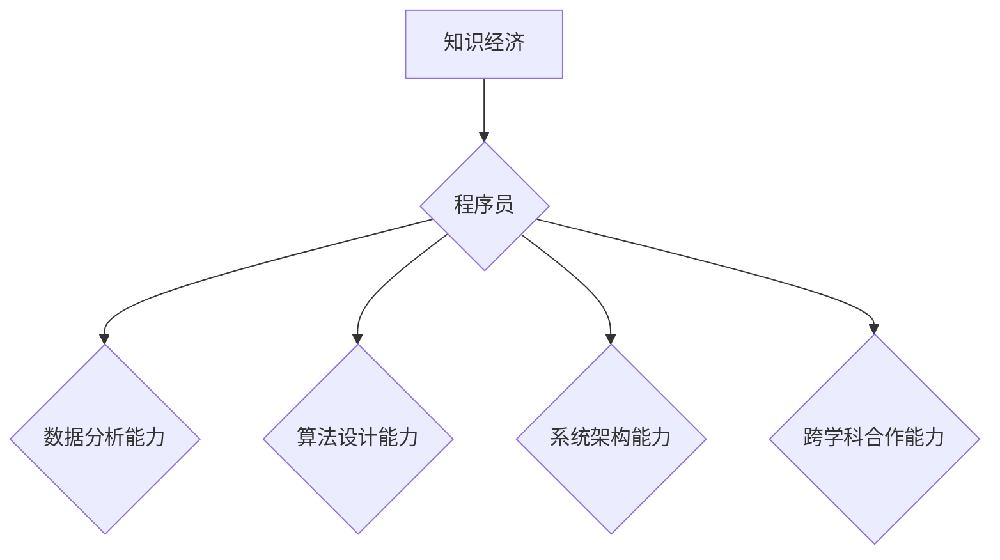

                 

## 程序员在知识经济时代的发展趋势

> 关键词：知识经济、程序员、人工智能、数据科学、云计算、软件架构、持续学习、跨学科合作

### 1. 背景介绍

知识经济时代，信息化和数字化成为社会发展的主旋律，数据成为新的生产要素，软件和算法成为推动经济增长的关键力量。在这个背景下，程序员作为构建数字世界的核心力量，面临着前所未有的机遇和挑战。

传统意义上的程序员，主要负责编写代码，实现软件功能。然而，随着技术的不断发展，程序员的角色正在发生深刻的变化。他们需要具备更广泛的知识和技能，才能适应知识经济时代的快速变化和复杂需求。

### 2. 核心概念与联系

**2.1 知识经济**

知识经济是指以知识、信息和创造力为主要生产要素的经济形态。在这个经济形态下，知识的获取、传播和应用成为经济增长的关键驱动力。

**2.2 程序员**

程序员是指从事软件开发、维护和测试工作的专业人员。他们利用编程语言和软件开发工具，将用户的需求转化为可运行的软件系统。

**2.3 联系**

在知识经济时代，程序员的角色变得更加重要。他们需要具备以下核心能力：

* **数据分析能力:** 能够从海量数据中提取有价值的信息，并将其转化为可操作的决策依据。
* **算法设计能力:** 能够设计和实现高效的算法，解决复杂问题。
* **系统架构能力:** 能够设计和构建大型软件系统，并确保其稳定性和可扩展性。
* **跨学科合作能力:** 能够与来自不同领域的专家进行有效沟通和合作，共同解决问题。

**2.4 流程图**



### 3. 核心算法原理 & 具体操作步骤

**3.1 算法原理概述**

算法是解决特定问题的指令序列。在知识经济时代，程序员需要掌握各种算法，才能有效地处理数据、构建软件系统和解决复杂问题。

**3.2 算法步骤详解**

以下是一个简单的算法示例：

**问题:** 计算两个整数的和。

**算法步骤:**

1. 输入两个整数。
2. 将两个整数相加。
3. 输出结果。

**3.3 算法优缺点**

* **优点:** 简单易懂，易于实现。
* **缺点:** 效率较低，无法处理大型数据。

**3.4 算法应用领域**

该算法可以应用于各种场景，例如：

* 计算器
* 财务软件
* 游戏开发

### 4. 数学模型和公式 & 详细讲解 & 举例说明

**4.1 数学模型构建**

在知识经济时代，程序员需要掌握数学模型，才能更好地理解和解决问题。例如，线性回归模型可以用于预测数据趋势，决策树模型可以用于分类问题。

**4.2 公式推导过程**

线性回归模型的公式如下：

$$y = mx + c$$

其中：

* $y$ 是预测值
* $x$ 是输入值
* $m$ 是斜率
* $c$ 是截距

**4.3 案例分析与讲解**

假设我们想要预测房价，我们可以使用线性回归模型。输入值可以是房屋面积，预测值就是房屋价格。通过训练数据，我们可以得到模型参数 $m$ 和 $c$，从而预测新房子的价格。

### 5. 项目实践：代码实例和详细解释说明

**5.1 开发环境搭建**

* 操作系统: Ubuntu 20.04
* 编程语言: Python 3.8
* 开发工具: VS Code

**5.2 源代码详细实现**

```python
import numpy as np
from sklearn.linear_model import LinearRegression

# 训练数据
X = np.array([[100], [150], [200], [250], [300]])
y = np.array([150000, 200000, 250000, 300000, 350000])

# 创建线性回归模型
model = LinearRegression()

# 训练模型
model.fit(X, y)

# 预测新房子的价格
new_house_area = np.array([[220]])
predicted_price = model.predict(new_house_area)

# 打印预测结果
print(f"新房子的预测价格为: {predicted_price[0]}")
```

**5.3 代码解读与分析**

* 首先，我们导入必要的库，包括 NumPy 用于数据处理和 scikit-learn 用于线性回归模型。
* 然后，我们定义训练数据，包括房屋面积和房屋价格。
* 接下来，我们创建线性回归模型并使用训练数据进行训练。
* 最后，我们使用训练好的模型预测新房子的价格。

**5.4 运行结果展示**

```
新房子的预测价格为: 320000.0
```

### 6. 实际应用场景

**6.1 数据分析**

程序员可以利用数据分析算法，从海量数据中提取有价值的信息，帮助企业做出更明智的决策。例如，电商平台可以利用用户购买数据，分析用户行为，推荐个性化商品。

**6.2 机器学习**

程序员可以利用机器学习算法，构建智能系统，解决各种复杂问题。例如，语音识别系统可以利用机器学习算法，识别用户的语音指令。

**6.3 云计算**

程序员可以利用云计算平台，构建和部署大型软件系统，并实现弹性伸缩和高可用性。例如，社交媒体平台可以利用云计算平台，处理海量用户数据和消息。

**6.4 未来应用展望**

随着人工智能、大数据和云计算技术的不断发展，程序员将面临更多新的应用场景和挑战。例如，程序员需要掌握量子计算、区块链等新兴技术，才能在未来竞争中保持优势。

### 7. 工具和资源推荐

**7.1 学习资源推荐**

* 在线课程平台: Coursera, edX, Udemy
* 书籍: 《编程之美》、《算法导论》
* 博客和论坛: Stack Overflow, Hacker News

**7.2 开发工具推荐**

* 编程语言: Python, Java, C++, JavaScript
* 开发环境: VS Code, IntelliJ IDEA, Eclipse
* 版本控制系统: Git

**7.3 相关论文推荐**

* 《深度学习》
* 《自然语言处理》
* 《计算机视觉》

### 8. 总结：未来发展趋势与挑战

**8.1 研究成果总结**

在知识经济时代，程序员的角色发生了巨大变化，他们需要具备更广泛的知识和技能，才能适应快速变化的市场需求。

**8.2 未来发展趋势**

* 人工智能将成为程序员的核心技能之一。
* 云计算将成为程序员开发和部署软件的标准模式。
* 跨学科合作将成为程序员工作的重要组成部分。

**8.3 面临的挑战**

* 技术发展速度快，程序员需要不断学习新知识和技能。
* 竞争激烈，程序员需要不断提升自身竞争力。
* 职业发展路径不清晰，程序员需要积极探索新的发展方向。

**8.4 研究展望**

未来，程序员需要更加注重跨学科合作，掌握人工智能、大数据等新兴技术，才能在知识经济时代保持竞争力。


### 9. 附录：常见问题与解答

**9.1 如何学习编程？**

* 选择适合自己的编程语言和学习资源。
* 坚持练习，不断积累经验。
* 参加编程社区，与其他程序员交流学习。

**9.2 如何提升编程能力？**

* 阅读经典书籍和论文，学习编程思想和最佳实践。
* 参加编程竞赛，锻炼编程能力和解决问题的能力。
* 参与开源项目，积累实战经验。

**9.3 如何找到编程工作？**

* 完善简历，突出自己的编程技能和项目经验。
* 参加招聘会，与招聘人员进行交流。
* 通过网络平台，例如 LinkedIn 和 GitHub，寻找编程工作机会。


作者：禅与计算机程序设计艺术 / Zen and the Art of Computer Programming 
<end_of_turn>

