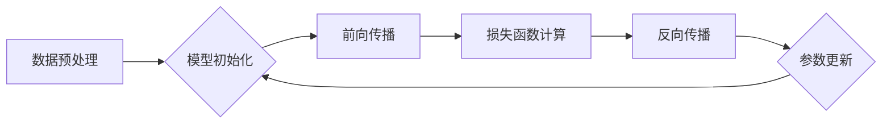

                 

## 第七章：初始化、优化和 AdamW 算法

> 关键词：深度学习、模型训练、优化算法、初始化、AdamW、学习率、梯度下降

### 1. 背景介绍

深度学习的蓬勃发展离不开高效的训练方法。模型训练的核心在于找到最优的模型参数，使模型在给定数据上表现最佳。而优化算法是实现这一目标的关键工具。

传统的梯度下降算法虽然有效，但存在一些局限性，例如学习率的调整困难、训练过程可能陷入局部最优等。为了克服这些问题，近年来出现了许多改进的优化算法，其中 AdamW 算法凭借其高效性和稳定性，在深度学习领域获得了广泛应用。

本章将深入探讨深度学习模型训练中的初始化、优化算法以及 AdamW 算法的原理、步骤、优缺点和应用场景。

### 2. 核心概念与联系

#### 2.1 模型训练流程

深度学习模型训练是一个迭代的过程，主要包括以下步骤：

1. **数据预处理:** 将原始数据转换为模型可理解的形式。
2. **模型初始化:** 为模型参数赋予初始值。
3. **前向传播:** 将输入数据通过模型层级传递，得到输出结果。
4. **损失函数计算:** 计算模型输出与真实值的差异。
5. **反向传播:** 计算损失函数对每个参数的梯度。
6. **参数更新:** 根据梯度信息更新模型参数。
7. **迭代:** 重复上述步骤，直到模型性能达到预期水平。

#### 2.2 优化算法的作用

优化算法的作用是根据梯度信息更新模型参数，引导模型朝着损失函数最小值的方向进行调整。

#### 2.3 AdamW 算法的优势

AdamW 算法结合了 Adam 算法的优点，并通过权重衰减机制进一步提高了模型的泛化能力。

**Mermaid 流程图:**



### 3. 核心算法原理 & 具体操作步骤

#### 3.1 算法原理概述

AdamW 算法是一种基于梯度下降的优化算法，它结合了 Adam 算法的动量更新和自适应学习率机制，并引入了权重衰减项来防止模型过拟合。

#### 3.2 算法步骤详解

1. **初始化:** 为每个参数设置初始学习率、动量项和梯度累积值。
2. **前向传播:** 将输入数据通过模型层级传递，得到输出结果。
3. **损失函数计算:** 计算模型输出与真实值的差异。
4. **反向传播:** 计算损失函数对每个参数的梯度。
5. **参数更新:** 根据梯度信息、动量项和自适应学习率更新每个参数的值。
6. **权重衰减:** 对每个参数应用权重衰减项，以防止模型过拟合。
7. **迭代:** 重复上述步骤，直到模型性能达到预期水平。

#### 3.3 算法优缺点

**优点:**

* **自适应学习率:** AdamW 算法可以根据每个参数的梯度信息自适应地调整学习率，从而加速训练过程。
* **动量更新:** AdamW 算法利用动量项来加速梯度下降，避免陷入局部最优。
* **权重衰减:** AdamW 算法通过权重衰减项来防止模型过拟合，提高模型的泛化能力。

**缺点:**

* **参数设置:** AdamW 算法需要设置一些超参数，例如学习率、动量项和权重衰减系数，这些超参数需要根据具体任务进行调整。
* **计算复杂度:** AdamW 算法的计算复杂度相对较高，对于大型模型训练可能需要较长的训练时间。

#### 3.4 算法应用领域

AdamW 算法广泛应用于各种深度学习任务，例如图像分类、目标检测、自然语言处理等。

### 4. 数学模型和公式 & 详细讲解 & 举例说明

#### 4.1 数学模型构建

AdamW 算法的核心思想是结合动量更新和自适应学习率机制，并引入权重衰减项。

#### 4.2 公式推导过程

AdamW 算法的更新公式如下：

$$
\theta_t = \theta_{t-1} - \beta_1 \cdot \frac{m_t}{1 - \beta_1^t} - \beta_2 \cdot \frac{v_t}{1 - \beta_2^t} + \lambda \cdot \theta_{t-1}
$$

其中：

* $\theta_t$ 是第 $t$ 次迭代的参数值。
* $\theta_{t-1}$ 是第 $t-1$ 次迭代的参数值。
* $m_t$ 是第 $t$ 次迭代的梯度平均值。
* $v_t$ 是第 $t$ 次迭代的梯度方差平均值。
* $\beta_1$ 是动量项系数，通常设置为 0.9。
* $\beta_2$ 是自适应学习率系数，通常设置为 0.999。
* $\lambda$ 是权重衰减系数。

#### 4.3 案例分析与讲解

假设我们有一个简单的线性回归模型，目标是预测房价。我们使用 AdamW 算法训练模型，并观察模型参数的更新过程。

在训练过程中，AdamW 算法会根据梯度信息自适应地调整学习率，并利用动量项加速梯度下降。同时，权重衰减项会逐渐减小参数值，防止模型过拟合。

### 5. 项目实践：代码实例和详细解释说明

#### 5.1 开发环境搭建

本项目使用 Python 语言和 TensorFlow 库进行开发。

#### 5.2 源代码详细实现

```python
import tensorflow as tf

# 定义模型
model = tf.keras.models.Sequential([
    tf.keras.layers.Dense(units=64, activation='relu', input_shape=(10,)),
    tf.keras.layers.Dense(units=1)
])

# 定义损失函数和优化器
optimizer = tf.keras.optimizers.AdamW(learning_rate=0.001, weight_decay=0.01)
loss_fn = tf.keras.losses.MeanSquaredError()

# 训练模型
for epoch in range(10):
    for batch in dataset:
        with tf.GradientTape() as tape:
            predictions = model(batch)
            loss = loss_fn(batch, predictions)
        gradients = tape.gradient(loss, model.trainable_variables)
        optimizer.apply_gradients(zip(gradients, model.trainable_variables))

# 保存模型
model.save('house_price_model.h5')
```

#### 5.3 代码解读与分析

* 我们首先定义了一个简单的线性回归模型，包含两个全连接层。
* 然后，我们使用 AdamW 优化器和均方误差损失函数进行模型训练。
* 在训练过程中，我们使用梯度下降算法更新模型参数。
* 最后，我们保存训练好的模型。

#### 5.4 运行结果展示

训练完成后，我们可以使用保存的模型对新的数据进行预测。

### 6. 实际应用场景

AdamW 算法在深度学习领域广泛应用，例如：

* **图像分类:** 在 ImageNet 等大型图像分类任务中，AdamW 算法可以有效提高模型的准确率。
* **目标检测:** 在目标检测任务中，AdamW 算法可以帮助模型更快地收敛，并提高检测精度。
* **自然语言处理:** 在机器翻译、文本摘要等自然语言处理任务中，AdamW 算法可以有效提高模型的性能。

#### 6.4 未来应用展望

随着深度学习技术的不断发展，AdamW 算法的应用场景将会更加广泛。例如，它可以应用于强化学习、推荐系统等领域。

### 7. 工具和资源推荐

#### 7.1 学习资源推荐

* **深度学习书籍:** 《深度学习》 (Ian Goodfellow, Yoshua Bengio, Aaron Courville)
* **在线课程:** Coursera, edX, Udacity 等平台提供深度学习相关的课程。
* **博客和论坛:** TensorFlow, PyTorch 等深度学习框架的官方博客和论坛提供丰富的学习资源。

#### 7.2 开发工具推荐

* **TensorFlow:** Google 开发的开源深度学习框架。
* **PyTorch:** Facebook 开发的开源深度学习框架。
* **Keras:** TensorFlow 上的深度学习 API，易于使用。

#### 7.3 相关论文推荐

* **Adam: A Method for Stochastic Optimization** (Kingma & Ba, 2014)
* **Decoupled Weight Decay Regularization** (Loshchilov & Hutter, 2017)

### 8. 总结：未来发展趋势与挑战

#### 8.1 研究成果总结

AdamW 算法是深度学习领域的重要成果，它有效地解决了传统梯度下降算法的一些局限性，提高了模型训练的效率和效果。

#### 8.2 未来发展趋势

未来，AdamW 算法可能会朝着以下方向发展：

* **更有效的自适应学习率机制:** 研究更精确、更鲁棒的自适应学习率机制，进一步提高模型训练的效率。
* **更复杂的动量更新策略:** 探索更复杂的动量更新策略，例如基于变分推理的动量更新，以更好地应对复杂的任务。
* **结合其他优化技术:** 将 AdamW 算法与其他优化技术相结合，例如正则化、迁移学习等，以进一步提高模型的性能。

#### 8.3 面临的挑战

AdamW 算法也面临一些挑战：

* **超参数设置:** AdamW 算法需要设置一些超参数，例如学习率、动量项和权重衰减系数，这些超参数需要根据具体任务进行调整，这可能会增加模型训练的难度。
* **计算复杂度:** AdamW 算法的计算复杂度相对较高，对于大型模型训练可能需要较长的训练时间。

#### 8.4 研究展望

未来，我们将继续研究 AdamW 算法及其改进方法，以更好地解决深度学习模型训练中的挑战，推动深度学习技术的进一步发展。

### 9. 附录：常见问题与解答

**问题 1:** AdamW 算法的学习率应该设置为多少？

**答案:** AdamW 算法的学习率需要根据具体任务和模型进行调整。通常，可以从一个较小的学习率开始，例如 0.001，然后根据模型训练的进度进行调整。

**问题 2:** AdamW 算法的动量项应该设置为多少？

**答案:** AdamW 算法的动量项通常设置为 0.9。

**问题 3:** AdamW 算法的权重衰减系数应该设置为多少？

**答案:** AdamW 算法的权重衰减系数通常设置为 0.01。


作者：禅与计算机程序设计艺术 / Zen and the Art of Computer Programming 
<end_of_turn>

