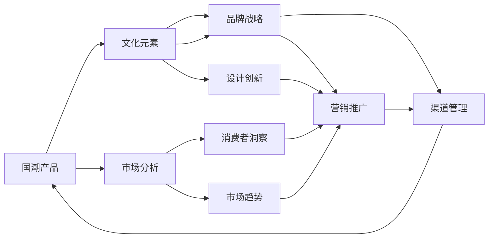

                 

# 国潮创业：中国文化元素的商业价值

> 关键词：国潮、文化元素、商业价值、文化消费、品牌战略、市场分析

## 1. 背景介绍

### 1.1 问题由来

近年来，“国潮”成为国内消费市场的新宠。越来越多的年轻人开始追求带有传统文化元素的商品，如汉服、国风首饰、传统手工艺品等。国潮产品的热销，不仅满足了年轻人对独特文化身份的认同需求，也预示着中国传统文化与现代商业的有机结合。

然而，国潮创业仍面临诸多挑战，如缺乏规范化的市场运作模式、文化元素与现代商业的契合度不高等。本文旨在探讨国潮创业的核心要素，包括文化元素的商业价值，以及如何通过有效的品牌战略和市场分析，实现文化元素的商业化。

### 1.2 问题核心关键点

国潮创业的核心关键点包括：

- 如何识别和发掘具有商业价值的中国文化元素。
- 如何通过品牌战略和市场营销，将文化元素有效融入产品中。
- 如何评估国潮产品的市场接受度和销售潜力。
- 如何在国潮市场中避免同质化竞争，实现差异化定位。

理解这些关键点，有助于揭示国潮创业的商业价值，并制定有效的策略和路径。

### 1.3 问题研究意义

国潮创业的兴起，为中国传统文化注入了新的活力，同时也为现代商业提供了新的发展契机。通过系统地探讨国潮创业的商业价值，本文旨在：

- 揭示国潮产品成功的关键因素，为创业者提供实用参考。
- 分析国潮市场的潜在机会和风险，帮助企业制定科学的决策。
- 推动中国文化与现代商业的融合，提升中国文化的国际影响力。

## 2. 核心概念与联系

### 2.1 核心概念概述

为更好地理解国潮创业的商业价值，本节将介绍几个核心概念：

- **国潮**：指具有中国传统文化元素的产品或服务，如国风服饰、传统手工艺品、国风音乐、传统美食等。国潮不仅仅是文化符号，更是连接传统与现代的桥梁。
- **文化元素**：指能够代表中国传统文化特点的符号、图案、色彩、语言等。文化元素是国潮产品差异化的关键。
- **商业价值**：指文化元素通过市场运作获得的经济回报。商业价值需要通过有效的品牌和市场营销策略来实现。
- **品牌战略**：指企业在市场竞争中，通过构建独特的品牌形象，实现产品差异化和市场占有率提升的战略。
- **市场分析**：指对市场环境、消费者需求、竞争态势等进行深入分析，为制定合理的营销策略提供依据。

这些核心概念之间通过国潮产品的市场运作和品牌战略实施建立了联系，共同构成了国潮创业的完整框架。

### 2.2 核心概念原理和架构的 Mermaid 流程图



这个流程图展示了国潮产品的市场运作流程和关键环节：

1. 国潮产品开发基于文化元素的注入。
2. 品牌战略设计影响文化元素的应用和推广。
3. 市场分析为品牌战略和产品开发提供数据支持。
4. 设计创新和营销推广共同塑造产品形象，提升品牌知名度。
5. 渠道管理确保产品从生产到销售的全过程顺畅进行。

## 3. 核心算法原理 & 具体操作步骤

### 3.1 算法原理概述

国潮创业的商业价值分析，本质上是将文化元素与现代市场运作机制相结合的过程。其核心算法原理可以概括为以下几个步骤：

1. **文化元素识别与分析**：识别具有商业潜力的文化元素，分析其文化内涵和市场需求。
2. **品牌定位与设计**：基于文化元素，确定品牌定位和产品设计方案。
3. **市场调研与分析**：通过市场调研和数据分析，评估国潮产品的潜在市场接受度和销售潜力。
4. **营销策略制定与实施**：制定有效的营销策略，并根据市场反馈进行动态调整。
5. **渠道管理与优化**：选择合适的销售渠道，并根据市场变化进行优化调整。

### 3.2 算法步骤详解

#### 3.2.1 文化元素识别与分析

1. **数据收集与分类**：收集与国潮相关的历史文献、文化符号、传统工艺等数据，并按照文化元素类别进行分类。
2. **趋势分析**：利用数据挖掘技术，分析文化元素的市场趋势，如流行度和需求变化。
3. **文化内涵解读**：专家解读文化元素的深层含义，分析其文化价值和商业潜力。
4. **案例研究**：研究已成功商业化的文化元素案例，提取成功经验。

#### 3.2.2 品牌定位与设计

1. **品牌故事构建**：基于文化元素，构建品牌故事，赋予产品文化内涵。
2. **产品设计**：将文化元素融入产品设计中，如服饰、包装等，使其与品牌形象相契合。
3. **品牌形象塑造**：通过品牌标识、口号等，强化品牌形象。

#### 3.2.3 市场调研与分析

1. **消费者洞察**：通过问卷调查、焦点小组等方式，获取目标消费者的需求和偏好。
2. **市场趋势分析**：利用大数据和市场分析工具，评估国潮市场的发展趋势。
3. **竞争态势分析**：分析竞争对手的市场策略和产品定位，找出国潮市场的差异化机会。

#### 3.2.4 营销策略制定与实施

1. **渠道选择与合作**：选择合适的线上线下销售渠道，建立合作关系。
2. **营销推广**：利用社交媒体、广告投放等方式，推广国潮产品。
3. **销售促进**：设计促销活动，吸引消费者购买。

#### 3.2.5 渠道管理与优化

1. **渠道评估**：根据销售数据和市场反馈，评估渠道效果。
2. **渠道优化**：根据渠道评估结果，调整和优化销售渠道。

### 3.3 算法优缺点

国潮创业的商业价值分析算法具有以下优点：

1. **综合性**：融合文化元素分析、品牌战略设计、市场调研和渠道管理等多个方面，提供系统的商业价值评估。
2. **实用性**：通过数据驱动的方法，帮助创业者制定科学的决策，提升产品市场竞争力。
3. **灵活性**：根据市场变化和反馈，动态调整策略，适应快速变化的商业环境。

同时，该算法也存在一些局限性：

1. **数据依赖**：分析结果依赖于数据质量和数据的全面性。
2. **复杂度**：涉及多学科知识和技能，对参与者的综合素质要求较高。
3. **主观性**：文化元素的解读和价值评估具有一定的个人主观性，可能影响结果的客观性。

### 3.4 算法应用领域

国潮创业的商业价值分析算法在多个领域有广泛的应用：

1. **时尚设计**：在时尚设计中融入传统元素，提升产品的文化价值和市场竞争力。
2. **文化旅游**：分析文化景点和活动的商业价值，制定有效的营销策略，提升旅游产品的吸引力。
3. **文化艺术**：评估艺术品的市场潜力和文化价值，制定合适的营销和拍卖策略。
4. **非遗保护**：分析非物质文化遗产的市场潜力和保护策略，推动非遗产品的发展。

## 4. 数学模型和公式 & 详细讲解 & 举例说明

### 4.1 数学模型构建

国潮创业的商业价值分析可以通过建立以下数学模型来量化：

设国潮产品 $P$ 的市场接受度为 $M$，销售潜力为 $S$，商业价值为 $V$。则模型可表示为：

$$ V = f(M, S, C) $$

其中 $C$ 为文化元素的质量和独特性。

### 4.2 公式推导过程

1. **市场接受度 $M$**：通过消费者调查和市场反馈，计算消费者对国潮产品的认可度，记为 $M = g(D, F)$，其中 $D$ 为产品设计质量，$F$ 为市场营销效果。
2. **销售潜力 $S$**：通过市场调研和历史数据，计算产品的销售潜力和增长速度，记为 $S = h(D, C, P)$，其中 $P$ 为生产成本。
3. **文化元素质量 $C$**：通过专家评估和市场分析，计算文化元素的独特性和商业潜力，记为 $C = i(I, V)$，其中 $I$ 为文化元素的知名度，$V$ 为文化元素的商业价值。

### 4.3 案例分析与讲解

以汉服品牌“十二序”为例，其商业价值分析如下：

1. **文化元素识别与分析**：
   - 收集汉服的历史资料和图案，分析其文化内涵和市场需求。
   - 利用大数据分析，识别汉服的流行趋势和消费者偏好。

2. **品牌定位与设计**：
   - 基于汉服的历史故事，构建品牌故事，赋予产品文化内涵。
   - 将汉服的传统图案和颜色融入设计中，形成独特的品牌形象。

3. **市场调研与分析**：
   - 通过问卷调查和焦点小组，获取目标消费者的需求和偏好。
   - 利用市场分析工具，评估汉服市场的潜在发展趋势和竞争态势。

4. **营销策略制定与实施**：
   - 选择合适的线上线下销售渠道，建立合作关系。
   - 通过社交媒体和广告投放，推广汉服产品，设计促销活动吸引消费者。

5. **渠道管理与优化**：
   - 根据销售数据和市场反馈，评估渠道效果。
   - 根据评估结果，调整和优化销售渠道，提升产品销售量。

## 5. 项目实践：代码实例和详细解释说明

### 5.1 开发环境搭建

要进行国潮创业的商业价值分析，首先需要搭建一个开发环境。以下是使用Python进行数据分析和可视化开发的流程：

1. 安装Python环境：建议使用Anaconda，可以从官网下载并安装。
2. 创建虚拟环境：在Anaconda中使用`conda create --name [env_name] python=3.8`创建虚拟环境。
3. 安装必要的库：使用`pip install [library_name]`安装所需的数据分析和可视化库，如pandas、numpy、matplotlib、seaborn等。

### 5.2 源代码详细实现

以下是国潮创业商业价值分析的Python代码实现示例：

```python
import pandas as pd
import numpy as np
import matplotlib.pyplot as plt
from sklearn.decomposition import PCA
from sklearn.cluster import KMeans

# 数据准备
data = pd.read_csv('cultural_elements.csv')
cultural_elements = data[['name', 'culture', 'popularity', 'cost']]

# 文化元素分析
pca = PCA(n_components=2)
cultural_elements_pca = pca.fit_transform(cultural_elements[['popularity', 'cost']])
kmeans = KMeans(n_clusters=3).fit(cultural_elements_pca)
cultural_elements['cluster'] = kmeans.labels_

# 市场调研
market_data = pd.read_csv('market_data.csv')
market_analysis = market_data[['demand', 'trend', 'competition']]

# 计算商业价值
commercial_value = market_analysis.join(cultural_elements, on='name')
commercial_value['value'] = commercial_value['demand'] * commercial_value['trend'] * commercial_value['competition'] * commercial_value['cluster'] / (commercial_value['cost'] ** 0.5)

# 可视化结果
commercial_value.groupby('cluster').mean().plot(kind='bar')
plt.title('Commercial Value of Cultural Elements')
plt.xlabel('Cluster')
plt.ylabel('Value')
plt.show()
```

### 5.3 代码解读与分析

这个示例代码展示了如何使用Python进行国潮创业的商业价值分析：

1. **数据准备**：导入必要的库，读取数据集，进行数据预处理。
2. **文化元素分析**：利用PCA和KMeans算法，对文化元素进行聚类分析，识别出不同的文化元素类别。
3. **市场调研**：读取市场数据，进行市场分析，获取市场需求、趋势和竞争情况。
4. **计算商业价值**：将文化元素和市场数据结合，计算每个文化元素的商业价值。
5. **可视化结果**：使用matplotlib库，对商业价值进行可视化，分析不同文化元素类别的商业价值分布。

## 6. 实际应用场景

### 6.1 国风服饰

国风服饰是国潮创业的主要应用场景之一。传统汉服、改良旗袍等服饰不仅具有文化特色，还能满足年轻人对个性化服装的需求。品牌如“十二序”通过将汉服文化元素融入设计中，推出一系列具有现代感的汉服产品，受到了年轻人的热烈追捧。

### 6.2 文化旅游

文化旅游是国潮创业的另一重要方向。通过挖掘和利用本地文化资源，开发具有地方特色的旅游项目。例如，推出基于江南水乡文化的旅游线路，结合传统戏曲、手工艺等文化元素，吸引游客体验和消费。

### 6.3 非遗保护

非遗保护是国潮创业的社会责任和商业机遇并存的项目。通过对非遗工艺进行现代化改造，推出符合现代审美和生活方式的产品，如手工制作的传统文创产品。这些产品在满足市场需求的同时，也起到了传承非遗文化的作用。

### 6.4 未来应用展望

未来，国潮创业的商业价值分析将进一步深化和扩展，主要趋势包括：

1. **数字化转型**：通过大数据和人工智能技术，提升市场分析和消费者洞察的精度和效率。
2. **跨文化融合**：结合国际市场的需求，将国潮文化元素融入全球化产品设计中，扩大市场影响力。
3. **可持续发展**：推动国潮产品采用环保材料和可持续生产方式，符合绿色发展趋势。
4. **多渠道营销**：利用社交媒体、直播电商等新兴渠道，拓展国潮产品的市场覆盖面。

## 7. 工具和资源推荐

### 7.1 学习资源推荐

为了帮助国潮创业者提升商业价值分析能力，推荐以下学习资源：

1. **《国潮崛起：中国传统文化与现代商业的结合》**：全面介绍国潮市场的发展现状、机会和挑战，适合初入行者的阅读。
2. **《商业数据分析入门》**：讲解数据分析的基础知识和常用工具，如Python、R语言、SQL等，适合数据驱动的商业决策者。
3. **《品牌战略与营销管理》**：系统讲解品牌战略和营销管理的理论和方法，适合国潮创业的品牌经理。

### 7.2 开发工具推荐

国潮创业的商业价值分析涉及多学科知识，推荐以下开发工具：

1. **Python**：具有强大的数据分析和可视化能力，是国潮创业商业价值分析的主流工具。
2. **R语言**：以其丰富的统计分析和可视化库著称，适合复杂的数据分析任务。
3. **SQL**：用于数据管理和查询，适合处理大规模的数据集。
4. **Tableau**：数据可视化工具，帮助将复杂的数据结果呈现为直观的图表。

### 7.3 相关论文推荐

国潮创业的商业价值分析是一个多学科交叉的研究领域，推荐以下相关论文：

1. **《国潮产品市场分析与消费者行为研究》**：分析国潮市场的发展趋势和消费者行为，提出有效的市场策略。
2. **《中国传统文化元素的市场潜力和商业价值分析》**：研究文化元素的市场接受度和商业价值，为国潮产品设计提供数据支持。
3. **《品牌战略与文化元素的协同效应》**：探讨品牌战略和文化元素的结合方式，提升品牌竞争力。

## 8. 总结：未来发展趋势与挑战

### 8.1 研究成果总结

国潮创业的商业价值分析已经取得了一些初步成果，主要表现在以下几个方面：

1. **文化元素的商业化**：通过文化元素识别和分析，成功实现了部分国潮产品的商业化。
2. **市场分析方法的提升**：利用大数据和机器学习技术，提升了市场调研和分析的精确度。
3. **品牌战略的优化**：通过科学的市场分析和品牌定位，提高了国潮产品的市场竞争力。

### 8.2 未来发展趋势

未来国潮创业的商业价值分析将朝着以下几个方向发展：

1. **数据驱动**：利用更多维度的数据和先进分析技术，提升市场分析的准确性和效率。
2. **跨文化融合**：将国潮文化元素融入国际市场，推动文化产品的全球化。
3. **可持续发展**：倡导绿色生产和消费，推动国潮产品的可持续发展。
4. **技术创新**：引入人工智能、区块链等新技术，提升国潮产品的附加值。

### 8.3 面临的挑战

尽管国潮创业的商业价值分析取得了一些进展，但仍然面临以下挑战：

1. **数据获取难度**：高质量的数据获取成本高，且文化元素的多样性和复杂性增加了数据收集的难度。
2. **文化元素解读**：文化元素的内涵丰富，不同的解读方式可能影响分析结果。
3. **市场波动性**：市场需求和竞争环境变化快，需要快速适应和调整策略。
4. **跨学科整合**：国潮创业需要跨学科知识，团队的多样性和协作能力是一个挑战。

### 8.4 研究展望

未来国潮创业的商业价值分析需要在以下几个方面进行深入研究：

1. **数据治理**：建立标准化的数据治理框架，确保数据质量和一致性。
2. **文化元素模型**：构建文化元素的评估模型，系统化地评估其商业潜力。
3. **市场仿真**：建立市场仿真模型，预测不同策略下的市场变化。
4. **道德与责任**：研究国潮创业中的道德和责任问题，推动文化传承和可持续发展。

## 9. 附录：常见问题与解答

**Q1：如何判断一个文化元素是否具有商业价值？**

A: 判断一个文化元素是否具有商业价值，可以从以下几个方面进行评估：
1. **文化内涵**：分析文化元素的历史背景和深层含义，判断其文化价值。
2. **市场需求**：通过市场调研，了解目标消费者对文化元素的需求和偏好。
3. **竞争态势**：分析市场中类似文化元素的表现和市场占有率，评估其独特性和竞争力。

**Q2：国潮创业如何避免同质化竞争？**

A: 国潮创业避免同质化竞争，可以从以下几个方面入手：
1. **品牌定位**：明确品牌定位，突出品牌特色，建立独特的品牌形象。
2. **产品差异化**：通过设计创新，将文化元素融入产品中，形成差异化的产品形态。
3. **市场细分**：根据市场需求，细分市场，针对不同细分市场推出定制化产品。
4. **渠道优化**：选择适合的销售渠道，避免与竞争品牌冲突，提升渠道效率。

**Q3：国潮创业如何实现可持续发展？**

A: 国潮创业实现可持续发展，可以从以下几个方面进行考虑：
1. **环保材料**：选择环保材料，减少生产过程中的环境污染。
2. **生产流程优化**：优化生产流程，提高资源利用率，降低能耗。
3. **产品设计**：设计可回收或可再生的产品，延长产品生命周期。
4. **市场推广**：推广环保理念，引导消费者形成绿色消费习惯。

**Q4：国潮创业如何进行市场调研？**

A: 国潮创业进行市场调研，可以采取以下方法：
1. **问卷调查**：设计问卷，获取目标消费者的需求和偏好。
2. **焦点小组**：组织焦点小组讨论，深入了解消费者的反馈和意见。
3. **市场分析工具**：利用大数据和市场分析工具，进行市场需求和趋势分析。
4. **竞争对手分析**：分析竞争对手的市场策略和产品定位，找出差异化机会。

**Q5：国潮创业如何进行品牌战略设计？**

A: 国潮创业进行品牌战略设计，可以采取以下步骤：
1. **品牌故事构建**：挖掘文化元素的历史背景，构建有内涵的品牌故事。
2. **品牌形象设计**：设计独特的品牌标识、口号和形象，形成鲜明的品牌形象。
3. **品牌定位**：明确品牌定位，确定目标市场和目标消费者。
4. **品牌传播**：制定品牌传播策略，通过多种渠道进行品牌宣传和推广。

---

作者：禅与计算机程序设计艺术 / Zen and the Art of Computer Programming

