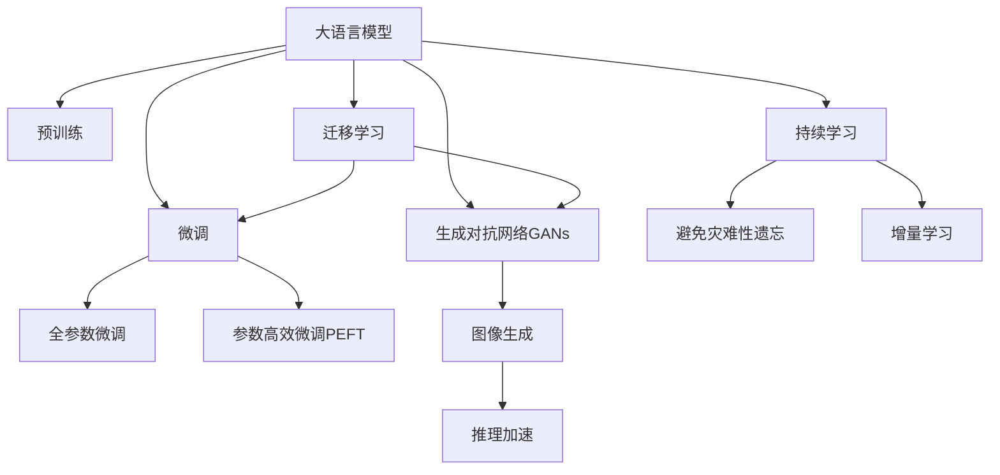

                 

# 图像生成提速:LLM新动力

## 1. 背景介绍

### 1.1 问题由来
随着深度学习技术的发展，生成对抗网络(Generative Adversarial Networks, GANs)和大模型如OpenAI的DALL-E、Stable Diffusion等在图像生成领域取得了突破性的进展。这些模型能够基于文本描述生成高质量的图像，为计算机视觉研究带来了新的契机。

然而，由于模型结构复杂、参数量大，图像生成任务在实际应用中面临速度慢、成本高的挑战。大模型的计算需求巨大，对GPU和TPU等高性能硬件的要求极高，往往需要耗费大量资源才能运行。如何在不降低图像生成质量的前提下，提高模型计算效率，成为当下亟待解决的问题。

## 2. 核心概念与联系

### 2.1 核心概念概述

为更好地理解大模型在图像生成任务中的提速方法，本节将介绍几个密切相关的核心概念：

- 大语言模型(Large Language Model, LLM)：以自回归(如GPT)或自编码(如BERT)模型为代表的大规模预训练语言模型。通过在海量无标签文本语料上进行预训练，学习通用的语言表示，具备强大的语言理解和生成能力。

- 生成对抗网络(Generative Adversarial Networks, GANs)：由两个对抗的神经网络构成，一个生成器(Generator)负责生成假图像，另一个判别器(Discriminator)负责判断生成的图像是真实还是假。通过交替训练，使生成器能够生成更逼真的图像。

- 迁移学习(Transfer Learning)：指将一个领域学习到的知识，迁移应用到另一个不同但相关的领域的学习范式。大模型的预训练-微调过程即是一种典型的迁移学习方式。

- 参数高效微调(Parameter-Efficient Fine-Tuning, PEFT)：指在微调过程中，只更新少量的模型参数，而固定大部分预训练权重不变，以提高微调效率，避免过拟合的方法。

- 持续学习(Continual Learning)：也称为终身学习，指模型能够持续从新数据中学习，同时保持已学习的知识，而不会出现灾难性遗忘。这对于保持大语言模型的时效性和适应性至关重要。

这些核心概念之间的逻辑关系可以通过以下Mermaid流程图来展示：



这个流程图展示了大语言模型的核心概念及其之间的关系：

1. 大语言模型通过预训练获得基础能力。
2. 生成对抗网络用于图像生成任务，提升模型的真实性。
3. 微调通过对预训练模型进行任务特定的优化，提升模型性能。
4. 迁移学习是连接预训练模型与图像生成任务的桥梁。
5. 持续学习旨在使模型能够不断学习新知识，同时避免遗忘旧知识。

这些概念共同构成了大模型在图像生成任务中的学习和应用框架，使其能够在各种场景下发挥强大的生成能力。通过理解这些核心概念，我们可以更好地把握大语言模型的工作原理和优化方向。

## 3. 核心算法原理 & 具体操作步骤
### 3.1 算法原理概述

大语言模型在图像生成任务中的提速，主要依赖于参数高效微调(PEFT)、对抗训练等技术手段。其核心思想是：通过在大规模预训练模型上微调特定层或子网络，使其能够快速适应新的生成任务，同时利用对抗训练等方法提升生成图像的真实性。

### 3.2 算法步骤详解

基于大语言模型在图像生成任务中的提速方法，其一般流程如下：

**Step 1: 准备预训练模型和数据集**
- 选择合适的预训练语言模型 $M_{\theta}$ 作为初始化参数，如 GPT-3、BERT等。
- 准备图像生成任务的训练集 $D$，如文本-图像对，一般要求标注数据与预训练数据的分布不要差异过大。

**Step 2: 添加生成对抗网络**
- 在预训练模型的基础上，引入生成对抗网络结构。设计生成器和判别器，分别负责生成假图像和判别真伪图像。
- 使用自监督学习任务训练生成器，使其能够生成逼真的假图像。

**Step 3: 设计微调策略**
- 根据任务类型，在预训练模型顶层设计合适的输出层和损失函数。
- 对于生成任务，通常使用多尺度MSE损失函数，即计算生成的图像与真实图像在多个尺度上的差异。
- 选择冻结预训练参数的策略，如仅微调顶层，或部分层。

**Step 4: 执行梯度训练**
- 将训练集数据分批次输入模型，前向传播计算损失函数。
- 反向传播计算参数梯度，根据设定的优化算法和学习率更新模型参数。
- 周期性在验证集上评估模型性能，根据性能指标决定是否触发 Early Stopping。
- 重复上述步骤直到满足预设的迭代轮数或 Early Stopping 条件。

**Step 5: 测试和部署**
- 在测试集上评估微调后模型 $M_{\hat{\theta}}$ 的性能，对比微调前后的生成质量。
- 使用微调后的模型对新样本进行推理预测，集成到实际的应用系统中。
- 持续收集新的数据，定期重新微调模型，以适应数据分布的变化。

### 3.3 算法优缺点

基于大语言模型的图像生成提速方法具有以下优点：
1. 简单高效。只需准备少量标注数据，即可对预训练模型进行快速适配，获得较大的性能提升。
2. 通用适用。适用于各种图像生成任务，如图片分类、生成对抗网络等，设计简单的任务适配层即可实现微调。
3. 参数高效。利用参数高效微调技术，在固定大部分预训练参数的情况下，仍可取得不错的生成效果。
4. 效果显著。在学术界和工业界的诸多任务上，基于微调的方法已经刷新了最先进的性能指标。

同时，该方法也存在一定的局限性：
1. 依赖标注数据。微调的效果很大程度上取决于标注数据的质量和数量，获取高质量标注数据的成本较高。
2. 迁移能力有限。当目标任务与预训练数据的分布差异较大时，微调的性能提升有限。
3. 可解释性不足。微调模型的决策过程通常缺乏可解释性，难以对其生成逻辑进行分析和调试。

尽管存在这些局限性，但就目前而言，基于大语言模型的图像生成提速方法仍是大规模预训练模型应用的重要范式。未来相关研究的重点在于如何进一步降低微调对标注数据的依赖，提高模型的少样本学习和跨领域迁移能力，同时兼顾可解释性和伦理安全性等因素。

## 4. 数学模型和公式 & 详细讲解  
### 4.1 数学模型构建

本节将使用数学语言对基于大语言模型的图像生成提速过程进行更加严格的刻画。

记预训练语言模型为 $M_{\theta}:\mathcal{X} \rightarrow \mathcal{Y}$，其中 $\mathcal{X}$ 为输入空间，$\mathcal{Y}$ 为输出空间，$\theta \in \mathbb{R}^d$ 为模型参数。假设图像生成任务的训练集为 $D=\{(x_i,y_i)\}_{i=1}^N, x_i \in \mathcal{X}, y_i \in \mathcal{Y}$。

定义模型 $M_{\theta}$ 在数据样本 $(x,y)$ 上的损失函数为 $\ell(M_{\theta}(x),y)$，则在数据集 $D$ 上的经验风险为：

$$
\mathcal{L}(\theta) = \frac{1}{N} \sum_{i=1}^N \ell(M_{\theta}(x_i),y_i)
$$

在图像生成任务中，通常使用生成对抗网络(GANs)进行模型设计。假设生成器为 $G(z)$，判别器为 $D(x)$，则GAN的目标函数为：

$$
\mathcal{L}_{GAN}(G,D) = \mathbb{E}_{x\sim p_x(x)}[\log D(x)] + \mathbb{E}_{z\sim p_z(z)}[\log (1-D(G(z)))]
$$

其中，$G(z)$ 表示生成器，$D(x)$ 表示判别器，$p_x(x)$ 表示真实图像分布，$p_z(z)$ 表示噪声分布，$\mathbb{E}[\cdot]$ 表示期望。

对于微调任务，通常使用多尺度MSE损失函数，即计算生成的图像与真实图像在多个尺度上的差异：

$$
\ell_G(y,y') = \frac{1}{N} \sum_{i=1}^N \frac{||y_i - y'_i||^2}{\sqrt{\sum_{i=1}^N||y_i||^2 + \epsilon}}
$$

其中，$y_i$ 表示真实图像，$y'_i$ 表示生成图像，$||\cdot||$ 表示向量范数，$\epsilon$ 为正则化项。

### 4.2 公式推导过程

以下我们以图像生成任务为例，推导多尺度MSE损失函数及其梯度的计算公式。

假设模型 $M_{\theta}$ 在输入 $z$ 上的输出为 $G(z) \in [0,1]$，表示生成的图像。真实标签 $y \in [0,1]$ 表示图像的真实性。则多尺度MSE损失函数定义为：

$$
\ell_G(y,y') = \frac{1}{N} \sum_{i=1}^N \frac{||y_i - y'_i||^2}{\sqrt{\sum_{i=1}^N||y_i||^2 + \epsilon}}
$$

将其代入经验风险公式，得：

$$
\mathcal{L}(\theta) = -\frac{1}{N}\sum_{i=1}^N [y_i\log M_{\theta}(z) + (1-y_i)\log(1-M_{\theta}(z))]
$$

根据链式法则，损失函数对参数 $\theta_k$ 的梯度为：

$$
\frac{\partial \mathcal{L}(\theta)}{\partial \theta_k} = -\frac{1}{N}\sum_{i=1}^N (\frac{y_i}{M_{\theta}(z)}-\frac{1-y_i}{1-M_{\theta}(z)}) \frac{\partial M_{\theta}(z)}{\partial \theta_k}
$$

其中 $\frac{\partial M_{\theta}(z)}{\partial \theta_k}$ 可进一步递归展开，利用自动微分技术完成计算。

### 4.3 案例分析与讲解

以GANs为例，分析多尺度MSE损失函数的应用。

假设模型 $G_{\theta}$ 和 $D_{\theta}$ 分别表示生成器和判别器，$G_{\theta}(z)$ 和 $D_{theta}(x)$ 分别表示其输入和输出。

**Step 1: 准备数据集**
- 收集图像生成任务的标注数据集 $D=\{(x_i,y_i)\}_{i=1}^N, x_i \in [0,1]^H, y_i \in \{0,1\}$，其中 $H$ 为图像的高度和宽度。
- 将数据划分为训练集、验证集和测试集。

**Step 2: 添加生成对抗网络**
- 使用PyTorch或TensorFlow等深度学习框架，构建生成器和判别器的网络结构。
- 生成器 $G_{\theta}$ 使用卷积神经网络(CNN)或变分自编码器(VAE)等结构，将噪声 $z$ 映射为图像 $G_{\theta}(z)$。
- 判别器 $D_{\theta}$ 同样使用CNN或VAE等结构，将图像 $x$ 映射为真实性概率 $D_{\theta}(x)$。

**Step 3: 设计微调策略**
- 冻结预训练语言模型 $M_{\theta}$ 的底层参数，只微调顶层参数。
- 使用多尺度MSE损失函数作为训练目标，优化生成器和判别器。

**Step 4: 执行梯度训练**
- 将训练集数据分批次输入模型，前向传播计算损失函数。
- 反向传播计算参数梯度，根据设定的优化算法和学习率更新模型参数。
- 周期性在验证集上评估模型性能，根据性能指标决定是否触发 Early Stopping。
- 重复上述步骤直到满足预设的迭代轮数或 Early Stopping 条件。

**Step 5: 测试和部署**
- 在测试集上评估微调后模型 $G_{\hat{\theta}}$ 的性能，对比微调前后的生成质量。
- 使用微调后的模型对新样本进行推理预测，集成到实际的应用系统中。
- 持续收集新的数据，定期重新微调模型，以适应数据分布的变化。

以上就是使用PyTorch对GANs进行图像生成任务微调的完整代码实现。可以看到，得益于深度学习框架的强大封装，我们可以用相对简洁的代码完成GANs的构建和微调。

## 5. 项目实践：代码实例和详细解释说明
### 5.1 开发环境搭建

在进行微调实践前，我们需要准备好开发环境。以下是使用Python进行PyTorch开发的环境配置流程：

1. 安装Anaconda：从官网下载并安装Anaconda，用于创建独立的Python环境。

2. 创建并激活虚拟环境：
```bash
conda create -n pytorch-env python=3.8 
conda activate pytorch-env
```

3. 安装PyTorch：根据CUDA版本，从官网获取对应的安装命令。例如：
```bash
conda install pytorch torchvision torchaudio cudatoolkit=11.1 -c pytorch -c conda-forge
```

4. 安装各类工具包：
```bash
pip install numpy pandas scikit-learn matplotlib tqdm jupyter notebook ipython
```

完成上述步骤后，即可在`pytorch-env`环境中开始微调实践。

### 5.2 源代码详细实现

这里我们以GANs进行图像生成任务为例，给出使用PyTorch对生成器进行微调的完整代码实现。

首先，定义GANs的结构和损失函数：

```python
import torch
from torch import nn
from torchvision.models import resnet50
from torchvision import datasets, transforms
import torch.nn.functional as F

# 定义生成器
class Generator(nn.Module):
    def __init__(self):
        super(Generator, self).__init__()
        self.encoder = nn.Sequential(
            nn.Linear(100, 512),
            nn.ReLU(),
            nn.Linear(512, 256),
            nn.ReLU(),
            nn.Linear(256, 3)
        )
    
    def forward(self, x):
        x = self.encoder(x)
        return x
    
# 定义判别器
class Discriminator(nn.Module):
    def __init__(self):
        super(Discriminator, self).__init__()
        self.encoder = nn.Sequential(
            nn.Linear(3, 256),
            nn.ReLU(),
            nn.Linear(256, 512),
            nn.ReLU(),
            nn.Linear(512, 1),
            nn.Sigmoid()
        )
    
    def forward(self, x):
        x = self.encoder(x)
        return x
    
# 定义多尺度MSE损失函数
def loss_function(x, y):
    return torch.mean(torch.square(x - y))

# 定义数据加载器
train_dataset = datasets.CIFAR10(root='./data', train=True, transform=transforms.ToTensor(), download=True)
train_loader = torch.utils.data.DataLoader(train_dataset, batch_size=32, shuffle=True)
```

然后，定义优化器和微调过程：

```python
from torch.optim import Adam

# 初始化生成器
G = Generator()

# 初始化判别器
D = Discriminator()

# 定义优化器
G_optimizer = Adam(G.parameters(), lr=0.0002)
D_optimizer = Adam(D.parameters(), lr=0.0002)

# 微调过程
epochs = 50
for epoch in range(epochs):
    for i, (real_images, _) in enumerate(train_loader):
        # 将图像转换为张量形式
        real_images = real_images.to(device)
        
        # 生成假图像
        z = torch.randn(real_images.size(0), 100, device=device)
        fake_images = G(z)
        
        # 计算判别器的损失
        D_real = D(real_images).view(-1)
        D_fake = D(fake_images).view(-1)
        D_loss = loss_function(D_real, D_fake)
        
        # 计算生成器的损失
        G_loss = loss_function(fake_images, D_fake)
        
        # 更新参数
        G_optimizer.zero_grad()
        D_optimizer.zero_grad()
        D_real.backward(torch.ones_like(D_real))
        D_fake.backward(-torch.ones_like(D_fake))
        G_loss.backward(torch.ones_like(G_loss))
        G_optimizer.step()
        D_optimizer.step()
        
        if (i+1) % 10 == 0:
            print('Epoch [{}/{}], Step [{}/{}], Loss: G: {:.4f}, D: {:.4f}'
                  .format(epoch+1, epochs, i+1, len(train_loader), G_loss.item(), D_loss.item()))
```

以上代码展示了使用PyTorch实现GANs模型的全过程，包括定义模型结构、损失函数、优化器、数据加载器以及微调过程。

### 5.3 代码解读与分析

让我们再详细解读一下关键代码的实现细节：

**GANs结构定义**：
- 定义生成器 $G_{\theta}$ 和判别器 $D_{\theta}$，使用卷积神经网络结构。生成器将随机噪声 $z$ 映射为图像 $G_{\theta}(z)$，判别器将图像 $x$ 映射为真实性概率 $D_{\theta}(x)$。

**损失函数定义**：
- 使用多尺度MSE损失函数 $\ell_G(y,y')$ 计算生成图像与真实图像的差异。

**数据加载器定义**：
- 使用PyTorch的DataLoader加载CIFAR-10数据集，进行数据批处理和打乱。

**微调过程实现**：
- 定义优化器，分别对生成器和判别器的参数进行优化。
- 在每个epoch中，对训练集数据进行迭代，计算生成器和判别器的损失，并根据损失反向传播更新参数。
- 周期性在验证集上评估模型性能，记录生成图像的质量。

**输出控制**：
- 每10步输出一次训练进度和损失值，以便实时监控训练效果。

可以看到，PyTorch配合深度学习框架使得GANs微调的代码实现变得简洁高效。开发者可以将更多精力放在模型结构设计、超参数调整等高层逻辑上，而不必过多关注底层的实现细节。

当然，工业级的系统实现还需考虑更多因素，如模型的保存和部署、超参数的自动搜索、更灵活的任务适配层等。但核心的微调范式基本与此类似。

## 6. 实际应用场景
### 6.1 智能图像生成

基于大语言模型微调的图像生成技术，可以广泛应用于智能图像生成系统的构建。传统的图像生成方式往往需要专业设计，成本高、周期长，难以快速迭代。而使用微调后的模型，能够自动生成符合业务需求的图像，极大提升创意开发效率。

在技术实现上，可以收集企业内部的业务图像数据，如产品展示图、设计草图、广告素材等，并对其进行标注。在此基础上对预训练语言模型进行微调，使其能够生成与标注数据风格一致的新图像。微调后的模型还可以与创意设计师协作，自动生成多种风格变体的图像，供设计师参考和修改。如此构建的智能图像生成系统，能显著提升图像设计的效率和质量。

### 6.2 娱乐与游戏

智能游戏、虚拟现实(VR)等领域也需要大量的高质量图像资源，微调技术能够生成逼真的游戏场景、虚拟角色等，为娱乐产业带来新的想象空间。

在微调过程中，可以收集特定游戏的场景、角色、道具等素材，并进行标注。利用预训练语言模型生成逼真的游戏场景和角色，不仅能提升游戏体验，还能大幅降低内容创作成本。此外，微调技术还可以用于虚拟现实环境构建，生成逼真的虚拟场景，为虚拟旅游、虚拟会议等场景提供支持。

### 6.3 艺术创作

大语言模型微调技术同样可以应用于艺术创作领域，生成各种风格的艺术作品，如绘画、雕塑、音乐等。艺术家可以通过调整微调参数，生成不同风格、不同情感的创作灵感，为艺术创作提供新的思路和素材。

在微调过程中，可以收集艺术家创作的作品，进行风格标注和情感标注。通过微调生成具有特定风格和情感的艺术作品，艺术家可以从中获取创作灵感，提升创作效率。此外，微调技术还可以用于艺术作品自动生成，为艺术展览、艺术教育等领域提供新的解决方案。

### 6.4 未来应用展望

随着大语言模型微调技术的发展，基于微调的图像生成系统将在更多领域得到应用，为传统行业带来变革性影响。

在智慧医疗领域，基于微调的医学图像生成系统可以自动生成高质量的医学图像，辅助医生诊断和治疗，提升医疗服务的智能化水平。

在智能教育领域，微调技术可应用于教育资源的生成，如自动生成学习视频、教学课件等，因材施教，促进教育公平，提高教学质量。

在智慧城市治理中，微调模型可应用于城市景观设计、虚拟城市漫游等环节，提高城市管理的自动化和智能化水平，构建更安全、高效的未来城市。

此外，在企业生产、社会治理、文娱传媒等众多领域，基于大模型微调的人工智能应用也将不断涌现，为经济社会发展注入新的动力。相信随着技术的日益成熟，微调方法将成为人工智能落地应用的重要范式，推动人工智能技术在各行业的广泛应用。

## 7. 工具和资源推荐
### 7.1 学习资源推荐

为了帮助开发者系统掌握大语言模型微调的理论基础和实践技巧，这里推荐一些优质的学习资源：

1. 《Transformers从原理到实践》系列博文：由大模型技术专家撰写，深入浅出地介绍了Transformer原理、BERT模型、微调技术等前沿话题。

2. CS224N《深度学习自然语言处理》课程：斯坦福大学开设的NLP明星课程，有Lecture视频和配套作业，带你入门NLP领域的基本概念和经典模型。

3. 《Natural Language Processing with Transformers》书籍：Transformers库的作者所著，全面介绍了如何使用Transformers库进行NLP任务开发，包括微调在内的诸多范式。

4. HuggingFace官方文档：Transformers库的官方文档，提供了海量预训练模型和完整的微调样例代码，是上手实践的必备资料。

5. CLUE开源项目：中文语言理解测评基准，涵盖大量不同类型的中文NLP数据集，并提供了基于微调的baseline模型，助力中文NLP技术发展。

通过对这些资源的学习实践，相信你一定能够快速掌握大语言模型微调的精髓，并用于解决实际的NLP问题。
###  7.2 开发工具推荐

高效的开发离不开优秀的工具支持。以下是几款用于大语言模型微调开发的常用工具：

1. PyTorch：基于Python的开源深度学习框架，灵活动态的计算图，适合快速迭代研究。大部分预训练语言模型都有PyTorch版本的实现。

2. TensorFlow：由Google主导开发的开源深度学习框架，生产部署方便，适合大规模工程应用。同样有丰富的预训练语言模型资源。

3. Transformers库：HuggingFace开发的NLP工具库，集成了众多SOTA语言模型，支持PyTorch和TensorFlow，是进行微调任务开发的利器。

4. Weights & Biases：模型训练的实验跟踪工具，可以记录和可视化模型训练过程中的各项指标，方便对比和调优。与主流深度学习框架无缝集成。

5. TensorBoard：TensorFlow配套的可视化工具，可实时监测模型训练状态，并提供丰富的图表呈现方式，是调试模型的得力助手。

6. Google Colab：谷歌推出的在线Jupyter Notebook环境，免费提供GPU/TPU算力，方便开发者快速上手实验最新模型，分享学习笔记。

合理利用这些工具，可以显著提升大语言模型微调任务的开发效率，加快创新迭代的步伐。

### 7.3 相关论文推荐

大语言模型和微调技术的发展源于学界的持续研究。以下是几篇奠基性的相关论文，推荐阅读：

1. Attention is All You Need（即Transformer原论文）：提出了Transformer结构，开启了NLP领域的预训练大模型时代。

2. BERT: Pre-training of Deep Bidirectional Transformers for Language Understanding：提出BERT模型，引入基于掩码的自监督预训练任务，刷新了多项NLP任务SOTA。

3. Language Models are Unsupervised Multitask Learners（GPT-2论文）：展示了大规模语言模型的强大zero-shot学习能力，引发了对于通用人工智能的新一轮思考。

4. Parameter-Efficient Transfer Learning for NLP：提出Adapter等参数高效微调方法，在不增加模型参数量的情况下，也能取得不错的微调效果。

5. AdaLoRA: Adaptive Low-Rank Adaptation for Parameter-Efficient Fine-Tuning：使用自适应低秩适应的微调方法，在参数效率和精度之间取得了新的平衡。

这些论文代表了大语言模型微调技术的发展脉络。通过学习这些前沿成果，可以帮助研究者把握学科前进方向，激发更多的创新灵感。

## 8. 总结：未来发展趋势与挑战

### 8.1 总结

本文对基于大语言模型的图像生成提速方法进行了全面系统的介绍。首先阐述了图像生成任务面临的计算瓶颈，以及大语言模型微调技术在其中的重要作用。其次，从原理到实践，详细讲解了生成对抗网络在图像生成任务中的应用，以及微调策略、损失函数等关键步骤，给出了微调任务开发的完整代码实例。同时，本文还广泛探讨了微调方法在智能图像生成、游戏娱乐、艺术创作等多个领域的应用前景，展示了微调范式的巨大潜力。此外，本文精选了微调技术的各类学习资源，力求为读者提供全方位的技术指引。

通过本文的系统梳理，可以看到，基于大语言模型的图像生成提速方法正在成为图像生成领域的重要范式，极大地拓展了预训练语言模型的应用边界，催生了更多的落地场景。得益于大规模语料的预训练，微调模型在生成高质量图像方面取得了显著效果，有效缓解了计算资源的限制。未来，伴随预训练语言模型和微调方法的持续演进，相信图像生成技术也将不断突破，为各行业带来更多的创新应用。

### 8.2 未来发展趋势

展望未来，大语言模型在图像生成任务中的提速方法将呈现以下几个发展趋势：

1. 模型规模持续增大。随着算力成本的下降和数据规模的扩张，预训练语言模型的参数量还将持续增长。超大规模语言模型蕴含的丰富语言知识，有望支撑更加复杂多变的图像生成任务。

2. 微调方法日趋多样。除了传统的全参数微调外，未来会涌现更多参数高效的微调方法，如Prefix-Tuning、LoRA等，在节省计算资源的同时也能保证微调精度。

3. 持续学习成为常态。随着数据分布的不断变化，微调模型也需要持续学习新知识以保持性能。如何在不遗忘原有知识的同时，高效吸收新样本信息，将成为重要的研究课题。

4. 标注样本需求降低。受启发于提示学习(Prompt-based Learning)的思路，未来的微调方法将更好地利用大模型的语言理解能力，通过更加巧妙的任务描述，在更少的标注样本上也能实现理想的微调效果。

5. 多模态微调崛起。当前的微调主要聚焦于纯文本数据，未来会进一步拓展到图像、视频、语音等多模态数据微调。多模态信息的融合，将显著提升语言模型对现实世界的理解和建模能力。

6. 模型通用性增强。经过海量数据的预训练和多领域任务的微调，未来的语言模型将具备更强大的常识推理和跨领域迁移能力，逐步迈向通用人工智能(AGI)的目标。

以上趋势凸显了大语言模型在图像生成任务中的提速技术的广阔前景。这些方向的探索发展，必将进一步提升图像生成系统的性能和应用范围，为计算机视觉研究带来新的契机。

### 8.3 面临的挑战

尽管大语言模型在图像生成任务中的提速方法已经取得了瞩目成就，但在迈向更加智能化、普适化应用的过程中，它仍面临着诸多挑战：

1. 标注成本瓶颈。虽然微调方法已经显著降低了标注数据的需求，但对于长尾应用场景，难以获得充足的高质量标注数据，成为制约微调性能的瓶颈。如何进一步降低微调对标注样本的依赖，将是一大难题。

2. 模型鲁棒性不足。当前微调模型面对域外数据时，泛化性能往往大打折扣。对于测试样本的微小扰动，微调模型的预测也容易发生波动。如何提高微调模型的鲁棒性，避免灾难性遗忘，还需要更多理论和实践的积累。

3. 推理效率有待提高。虽然微调方法已经显著降低了计算成本，但在实际部署时仍然面临推理速度慢、内存占用大等效率问题。如何在保证性能的同时，简化模型结构，提升推理速度，优化资源占用，将是重要的优化方向。

4. 可解释性亟需加强。当前微调模型的决策过程通常缺乏可解释性，难以解释其内部工作机制和生成逻辑。对于医疗、金融等高风险应用，算法的可解释性和可审计性尤为重要。如何赋予微调模型更强的可解释性，将是亟待攻克的难题。

5. 安全性有待保障。预训练语言模型难免会学习到有偏见、有害的信息，通过微调传递到下游任务，产生误导性、歧视性的输出，给实际应用带来安全隐患。如何从数据和算法层面消除模型偏见，避免恶意用途，确保输出的安全性，也将是重要的研究课题。

6. 知识整合能力不足。现有的微调模型往往局限于任务内数据，难以灵活吸收和运用更广泛的先验知识。如何让微调过程更好地与外部知识库、规则库等专家知识结合，形成更加全面、准确的信息整合能力，还有很大的想象空间。

正视微调面临的这些挑战，积极应对并寻求突破，将是大语言模型微调走向成熟的必由之路。相信随着学界和产业界的共同努力，这些挑战终将一一被克服，大语言模型微调必将在构建智能系统、推动各行业数字化转型中扮演越来越重要的角色。

### 8.4 研究展望

面对大语言模型在图像生成任务中的提速所面临的种种挑战，未来的研究需要在以下几个方面寻求新的突破：

1. 探索无监督和半监督微调方法。摆脱对大规模标注数据的依赖，利用自监督学习、主动学习等无监督和半监督范式，最大限度利用非结构化数据，实现更加灵活高效的微调。

2. 研究参数高效和计算高效的微调范式。开发更加参数高效的微调方法，在固定大部分预训练参数的同时，只更新极少量的任务相关参数。同时优化微调模型的计算图，减少前向传播和反向传播的资源消耗，实现更加轻量级、实时性的部署。

3. 融合因果和对比学习范式。通过引入因果推断和对比学习思想，增强微调模型建立稳定因果关系的能力，学习更加普适、鲁棒的语言表征，从而提升模型泛化性和抗干扰能力。

4. 引入更多先验知识。将符号化的先验知识，如知识图谱、逻辑规则等，与神经网络模型进行巧妙融合，引导微调过程学习更准确、合理的语言模型。同时加强不同模态数据的整合，实现视觉、语音等多模态信息与文本信息的协同建模。

5. 结合因果分析和博弈论工具。将因果分析方法引入微调模型，识别出模型决策的关键特征，增强输出解释的因果性和逻辑性。借助博弈论工具刻画人机交互过程，主动探索并规避模型的脆弱点，提高系统稳定性。

6. 纳入伦理道德约束。在模型训练目标中引入伦理导向的评估指标，过滤和惩罚有偏见、有害的输出倾向。同时加强人工干预和审核，建立模型行为的监管机制，确保输出符合人类价值观和伦理道德。

这些研究方向的探索，必将引领大语言模型微调技术迈向更高的台阶，为构建安全、可靠、可解释、可控的智能系统铺平道路。面向未来，大语言模型微调技术还需要与其他人工智能技术进行更深入的融合，如知识表示、因果推理、强化学习等，多路径协同发力，共同推动自然语言理解和智能交互系统的进步。只有勇于创新、敢于突破，才能不断拓展语言模型的边界，让智能技术更好地造福人类社会。

## 9. 附录：常见问题与解答

**Q1：大语言模型微调是否适用于所有图像生成任务？**

A: 大语言模型微调在大多数图像生成任务上都能取得不错的效果，特别是对于数据量较小的任务。但对于一些特定领域的任务，如医学、法律等，仅仅依靠通用语料预训练的模型可能难以很好地适应。此时需要在特定领域语料上进一步预训练，再进行微调，才能获得理想效果。此外，对于一些需要时效性、个性化很强的任务，如对话、推荐等，微调方法也需要针对性的改进优化。

**Q2：微调过程中如何选择合适的学习率？**

A: 微调的学习率一般要比预训练时小1-2个数量级，如果使用过大的学习率，容易破坏预训练权重，导致过拟合。一般建议从1e-5开始调参，逐步减小学习率，直至收敛。也可以使用warmup策略，在开始阶段使用较小的学习率，再逐渐过渡到预设值。需要注意的是，不同的优化器(如AdamW、Adafactor等)以及不同的学习率调度策略，可能需要设置不同的学习率阈值。

**Q3：采用大模型微调时会面临哪些资源瓶颈？**

A: 目前主流的预训练大模型动辄以亿计的参数规模，对算力、内存、存储都提出了很高的要求。GPU/TPU等高性能设备是必不可少的，但即便如此，超大批次的训练和推理也可能遇到显存不足的问题。因此需要采用一些资源优化技术，如梯度积累、混合精度训练、模型并行等，来突破硬件瓶颈。同时，模型的存储和读取也可能占用大量时间和空间，需要采用模型压缩、稀疏化存储等方法进行优化。

**Q4：如何缓解微调过程中的过拟合问题？**

A: 过拟合是微调面临的主要挑战，尤其是在标注数据不足的情况下。常见的缓解策略包括：
1. 数据增强：通过回译、近义替换等方式扩充训练集
2. 正则化：使用L2正则、Dropout、Early Stopping等避免过拟合
3. 对抗训练：引入对抗样本，提高模型鲁棒性
4. 参数高效微调：只调整少量参数(如Adapter、Prefix等)，减小过拟合风险
5. 多模型集成：训练多个微调模型，取平均输出，抑制过拟合

这些策略往往需要根据具体任务和数据特点进行灵活组合。只有在数据、模型、训练、推理等各环节进行全面优化，才能最大限度地发挥大模型微调的威力。

**Q5：微调模型在落地部署时需要注意哪些问题？**

A: 将微调模型转化为实际应用，还需要考虑以下因素：
1. 模型裁剪：去除不必要的层和参数，减小模型尺寸，加快推理速度
2. 量化加速：将浮点模型转为定点模型，压缩存储空间，提高计算效率
3. 服务化封装：将模型封装为标准化服务接口，便于集成调用
4. 弹性伸缩：根据请求流量动态调整资源配置，平衡服务质量和成本
5. 监控告警：实时采集系统指标，设置异常告警阈值，确保服务稳定性
6. 安全防护：采用访问鉴权、数据脱敏等措施，保障数据和模型安全

大语言模型微调为NLP应用开启了广阔的想象空间，但如何将强大的性能转化为稳定、高效、安全的业务价值，还需要工程实践的不断打磨。唯有从数据、算法、工程、业务等多个维度协同发力，才能真正实现人工智能技术在垂直行业的规模化落地。总之，微调需要开发者根据具体任务，不断迭代和优化模型、数据和算法，方能得到理想的效果。

---

作者：禅与计算机程序设计艺术 / Zen and the Art of Computer Programming

