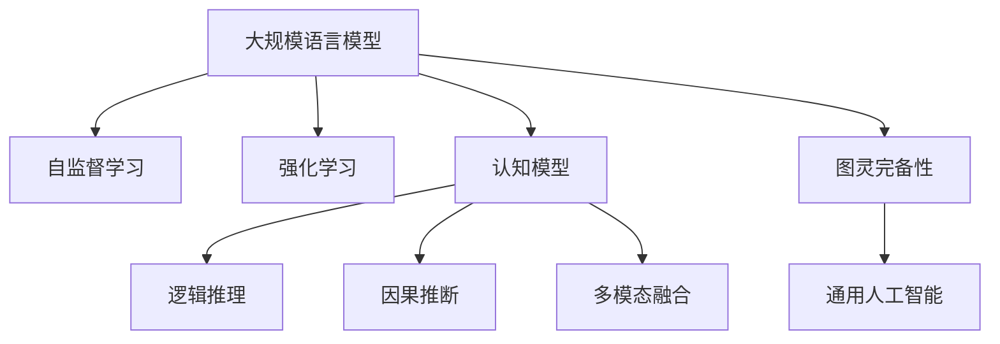

                 

# 图灵完备LLM:通向人工通用智能

> 关键词：图灵完备性,通用人工智能,大规模语言模型,Transformer,自监督学习,强化学习,认知模型,逻辑推理,因果推断,人类级智能

## 1. 背景介绍

### 1.1 问题由来
人工智能(AI)领域自1950s诞生以来，一直在追求构建能够像人类一样思考和行为的机器。图灵测试(Turing Test)的提出，更是将这一愿景推向了极致。图灵测试要求，如果一台机器能够以假乱真，使人无法区分其与人类交谈，那么这台机器就具备了人类级智能。

然而，传统的符号主义AI方法往往过于复杂，难以在大规模数据上训练出足够的知识。深度学习技术的出现，极大地简化了模型的训练和部署，使得基于大规模数据训练的神经网络模型（如Deep Neural Networks, DNNs）成为主流的AI模型。近年来，深度学习模型在图像识别、语音识别、自然语言处理(NLP)等领域取得了巨大突破。

尤其是大规模语言模型(Massive Language Models, LLMs)，通过在超大规模文本语料上进行自监督预训练，学习了丰富的语言知识和常识。这些模型在各种NLP任务上展现出了强大的泛化能力，被广泛应用于问答、翻译、文本生成、智能对话等场景。

尽管如此，这些通用语言模型在图灵完备性上仍存在一定的差距，无法完全模拟人类的认知过程，缺乏对复杂推理、长期记忆、情境理解等能力的全面支持。如何构建更为强大的通用人工智能，仍然是一个摆在AI研究者面前的巨大挑战。

### 1.2 问题核心关键点
在追求通用人工智能的过程中，一个核心问题是：如何让大型语言模型具备与人类类似的图灵完备性，即能够在各种复杂情境下进行推理、规划、决策等高级认知活动？具体而言，主要有以下几个关键点：

1. **知识获取和融合**：模型需要能够从海量文本数据中学习并整合各种知识，包括事实、概念、规则等，以支持复杂的推理和决策。
2. **因果推断能力**：模型需要能够理解事件之间的因果关系，从过去的经验中学习并预测未来的行为。
3. **长期记忆**：模型需要具备长期记忆能力，能够存储和检索长时间跨度的信息，支持复杂的任务规划和问题解决。
4. **情境理解**：模型需要能够理解上下文和情境信息，从语境中推断出正确的行为和决策。
5. **人类级智能**：最终目标是将模型的智能水平提升到与人类相当，能够应对各种未见过的场景和挑战。

为了实现这些目标，当前的研究主要聚焦于以下几个方向：
- **自监督学习**：通过在海量文本数据上进行无监督预训练，学习通用的语言知识和常识。
- **强化学习**：通过与环境的交互，学习任务特定的行为策略和决策能力。
- **认知模型**：模拟人类认知过程，构建逻辑推理、因果推断、情境理解等高级认知能力。
- **逻辑和因果推理**：构建模型进行精确的逻辑推理和因果推断，支持更复杂的问题解决和决策。
- **多模态融合**：整合视觉、听觉、触觉等多种模态信息，提升模型的感知和决策能力。

## 2. 核心概念与联系

### 2.1 核心概念概述

为更好地理解图灵完备的大型语言模型，本节将介绍几个密切相关的核心概念：

- **图灵完备性**：如果一台机器能够执行任何基于指令的计算，那么这台机器就被认为是图灵完备的。在AI领域，图灵完备性通常被理解为机器能够在各种情境下进行复杂推理、决策等高级认知活动。

- **通用人工智能**：能够处理任何领域的任务，具备广泛的认知能力和灵活的适应性，能够与人类进行自然的交互和协作。

- **大规模语言模型**：以自回归(如GPT)或自编码(如BERT)模型为代表的大规模预训练语言模型。通过在大规模无标签文本语料上进行预训练，学习通用的语言知识和常识，具备强大的语言理解和生成能力。

- **Transformer**：一种基于注意力机制的神经网络结构，被广泛应用于各种序列生成和转换任务中，如机器翻译、文本生成等。

- **自监督学习**：通过在无标签数据上训练模型，学习数据内在的统计规律和知识。

- **强化学习**：通过与环境的交互，学习最优的决策策略和行为，以最大化期望的奖励函数。

- **认知模型**：模拟人类认知过程，构建逻辑推理、因果推断、情境理解等高级认知能力。

- **逻辑推理**：基于逻辑规则，对命题进行推理和验证，支持精确的因果推断和决策。

- **因果推断**：从数据中学习因果关系，预测未来行为，支持长期记忆和情境理解。

- **多模态融合**：整合视觉、听觉、触觉等多种模态信息，提升模型的感知和决策能力。

这些核心概念之间的逻辑关系可以通过以下Mermaid流程图来展示：



这个流程图展示了大规模语言模型的核心概念及其之间的关系：

1. 大规模语言模型通过自监督学习获得通用知识。
2. 强化学习和认知模型分别学习任务特定的决策策略和高级认知能力。
3. 逻辑推理和因果推断为认知模型提供精确的推理和预测能力。
4. 多模态融合扩展模型的感知能力。
5. 最终，通过这些能力的综合应用，大语言模型具备了图灵完备性和通用人工智能的能力。

## 3. 核心算法原理 & 具体操作步骤
### 3.1 算法原理概述

图灵完备的大型语言模型需要在各种复杂情境下进行推理、规划、决策等高级认知活动。为了实现这一目标，当前的研究主要聚焦于以下几个算法原理：

1. **自监督学习**：通过在海量文本数据上进行无监督预训练，学习通用的语言知识和常识。
2. **强化学习**：通过与环境的交互，学习任务特定的行为策略和决策能力。
3. **认知模型**：模拟人类认知过程，构建逻辑推理、因果推断、情境理解等高级认知能力。
4. **逻辑推理**：基于逻辑规则，对命题进行推理和验证，支持精确的因果推断和决策。
5. **因果推断**：从数据中学习因果关系，预测未来行为，支持长期记忆和情境理解。
6. **多模态融合**：整合视觉、听觉、触觉等多种模态信息，提升模型的感知和决策能力。

### 3.2 算法步骤详解

以下将详细介绍这几种核心算法的详细步骤：

#### 3.2.1 自监督学习
自监督学习通过在海量文本数据上进行无监督预训练，学习通用的语言知识和常识。常用的预训练任务包括言语建模、掩码语言模型、句子嵌入等。

**Step 1: 准备预训练语料**
- 收集大规模无标签文本数据，如维基百科、新闻、社交媒体等。
- 使用数据清洗、分词、去重等预处理步骤，确保数据质量。

**Step 2: 设计预训练任务**
- 设计自监督预训练任务，如掩码语言模型。该任务通过随机掩码部分单词，预测被掩码单词的正确词汇，学习单词间的语义关系。

**Step 3: 训练预训练模型**
- 使用Transformer架构，在大规模语料上进行预训练。
- 使用自监督学习目标函数，如掩码语言模型的交叉熵损失函数。
- 通过反向传播算法优化模型参数。

**Step 4: 微调下游任务**
- 在预训练模型基础上，对特定任务进行微调。如问答、翻译、摘要等任务。
- 使用下游任务的标注数据进行有监督学习，优化模型输出。

#### 3.2.2 强化学习
强化学习通过与环境的交互，学习最优的决策策略和行为。

**Step 1: 定义环境**
- 设计模拟的交互环境，包括状态、动作、奖励等。
- 定义环境转换函数，描述环境状态的变化。

**Step 2: 设计算法**
- 选择适当的强化学习算法，如Q-learning、Deep Q Networks(DQN)、Proximal Policy Optimization(PPO)等。
- 设计状态表示方法，将环境状态编码为模型输入。

**Step 3: 训练模型**
- 在交互环境中，通过试错学习，逐步优化决策策略。
- 使用蒙特卡洛模拟、重要性采样等技术，提高学习效率。

**Step 4: 部署模型**
- 将训练好的模型部署到实际应用环境中，进行在线决策。
- 通过A/B测试、在线学习等技术，不断优化决策策略。

#### 3.2.3 认知模型
认知模型模拟人类认知过程，构建逻辑推理、因果推断、情境理解等高级认知能力。

**Step 1: 构建认知模型**
- 选择适当的认知模型架构，如符号推理、神经网络等。
- 设计推理规则和推理引擎，支持逻辑推理和因果推断。

**Step 2: 训练认知模型**
- 使用推理任务数据，如逻辑谜题、因果推断问题等，进行训练。
- 使用监督学习或半监督学习，优化模型推理能力。

**Step 3: 融合认知模型**
- 将认知模型与预训练语言模型进行融合，增强模型的推理和决策能力。
- 使用注意力机制、交互网络等技术，支持多模态推理。

#### 3.2.4 逻辑推理
逻辑推理基于逻辑规则，对命题进行推理和验证，支持精确的因果推断和决策。

**Step 1: 定义逻辑规则**
- 设计逻辑推理规则，如合取、析取、条件等。
- 构建逻辑表达式库，支持复杂的推理任务。

**Step 2: 构建推理引擎**
- 设计推理引擎，支持逻辑推理和验证。
- 使用决策树、神经网络等技术，提高推理效率。

**Step 3: 训练推理引擎**
- 使用逻辑推理任务数据，如逻辑谜题、逻辑命题等，进行训练。
- 使用监督学习或半监督学习，优化推理引擎。

#### 3.2.5 因果推断
因果推断从数据中学习因果关系，预测未来行为，支持长期记忆和情境理解。

**Step 1: 收集因果数据**
- 收集有因果关系的数据，如实验数据、观察数据等。
- 使用数据清洗、特征工程等预处理步骤，确保数据质量。

**Step 2: 设计因果模型**
- 选择适当的因果推断模型，如因果图、回归模型等。
- 设计因果关系假设，描述变量间的因果关系。

**Step 3: 训练因果模型**
- 使用因果数据进行训练，优化模型参数。
- 使用正则化技术，防止过拟合。

**Step 4: 应用因果模型**
- 将训练好的因果模型应用于实际决策场景，进行因果推断。
- 通过反馈控制，不断优化因果模型。

#### 3.2.6 多模态融合
多模态融合整合视觉、听觉、触觉等多种模态信息，提升模型的感知和决策能力。

**Step 1: 收集多模态数据**
- 收集多模态数据，如图像、语音、触觉等。
- 使用数据清洗、对齐等预处理步骤，确保数据一致性。

**Step 2: 设计多模态模型**
- 选择适当的多模态模型架构，如多模态神经网络、多模态卷积网络等。
- 设计模态融合方法，支持多模态信息整合。

**Step 3: 训练多模态模型**
- 使用多模态数据进行训练，优化模型参数。
- 使用多任务学习、对抗训练等技术，提高模型性能。

**Step 4: 应用多模态模型**
- 将训练好的多模态模型应用于实际决策场景，进行多模态推理。
- 通过反馈控制，不断优化多模态模型。

### 3.3 算法优缺点

图灵完备的大型语言模型在图灵完备性和通用人工智能方面具有以下优点：

1. **强大的语言理解能力**：基于自监督学习和大规模语料预训练，具备强大的语言理解和生成能力，能够处理各种复杂的语言表达。
2. **灵活的适应性**：能够适应各种任务和场景，通过微调和融合，灵活应对不同类型的任务。
3. **持续学习能力**：通过在线学习和反馈控制，不断更新和优化模型，保持知识的时效性和适应性。
4. **跨模态整合能力**：通过多模态融合，整合视觉、听觉、触觉等多种信息，提升感知和决策能力。

然而，这些模型也存在一些局限性：

1. **数据依赖性强**：需要大量高质量标注数据进行微调，数据获取和标注成本较高。
2. **计算资源需求高**：训练和推理大型模型需要大量算力和内存，部署成本较高。
3. **模型复杂度高**：模型参数量庞大，难以解释和调试，存在黑盒风险。
4. **泛化能力不足**：在新的数据和场景下，泛化性能可能降低，需要持续优化。
5. **伦理和安全风险**：可能学习到有偏见和有害的信息，需要采取严格的伦理和安全性措施。

## 4. 数学模型和公式 & 详细讲解 & 举例说明

### 4.1 数学模型构建

图灵完备的大型语言模型涉及多个子模型和算法，这些模型的数学模型可以通过以下方式进行构建：

1. **自监督学习模型**：通常使用掩码语言模型进行预训练，学习单词之间的语义关系。数学模型如下：

   $$
   \max_{\theta} \sum_{i=1}^{N} \log \left(\frac{P(x_i | \hat{x}_i)}{\sum_{j\neq i} P(x_i | \hat{x}_j)}\right)
   $$

   其中 $x_i$ 为原始文本，$\hat{x}_i$ 为掩码后的文本。

2. **强化学习模型**：使用Q-learning等算法进行训练，学习最优的决策策略。数学模型如下：

   $$
   Q(s_t,a_t) \leftarrow Q(s_t,a_t) + \alpha \left(r_t + \gamma \max_{a_{t+1}} Q(s_{t+1},a_{t+1}) - Q(s_t,a_t)\right)
   $$

   其中 $s_t$ 为环境状态，$a_t$ 为决策动作，$r_t$ 为即时奖励，$\alpha$ 为学习率，$\gamma$ 为折扣因子。

3. **认知模型**：使用符号推理或神经网络进行训练，构建逻辑推理和因果推断能力。数学模型如下：

   $$
   \min_{\theta} \sum_{i=1}^{M} \ell(\phi(s_i), \hat{\phi}(s_i))
   $$

   其中 $\phi$ 为推理引擎，$s_i$ 为推理任务数据，$\hat{\phi}(s_i)$ 为推理结果。

4. **逻辑推理模型**：使用决策树、神经网络等进行训练，支持精确的因果推断和决策。数学模型如下：

   $$
   \min_{\theta} \sum_{i=1}^{N} \ell(f(x_i), y_i)
   $$

   其中 $f$ 为逻辑推理引擎，$x_i$ 为逻辑命题，$y_i$ 为正确答案。

5. **因果推断模型**：使用因果图、回归模型等进行训练，学习因果关系。数学模型如下：

   $$
   \min_{\theta} \sum_{i=1}^{N} \ell(\hat{y}_i, y_i)
   $$

   其中 $\hat{y}_i$ 为模型预测结果，$y_i$ 为实际结果。

6. **多模态融合模型**：使用多模态神经网络或卷积网络进行训练，整合多种模态信息。数学模型如下：

   $$
   \min_{\theta} \sum_{i=1}^{N} \ell(X_i, \hat{X}_i)
   $$

   其中 $X_i$ 为多模态数据，$\hat{X}_i$ 为模型输出。

### 4.2 公式推导过程

以下将对上述模型的主要公式进行详细推导和解释：

#### 4.2.1 自监督学习公式推导
自监督学习的目标是通过掩码语言模型学习单词之间的语义关系。以BERT模型为例，其自监督学习公式如下：

$$
\max_{\theta} \sum_{i=1}^{N} \log \left(\frac{P(x_i | \hat{x}_i)}{\sum_{j\neq i} P(x_i | \hat{x}_j)}\right)
$$

其中 $x_i$ 为原始文本，$\hat{x}_i$ 为掩码后的文本。目标函数为掩码语言模型的交叉熵损失。

### 4.3 案例分析与讲解

为了更好地理解这些数学模型和公式，以下是几个关键案例的详细分析：

#### 4.3.1 BERT模型
BERT模型的预训练过程使用了掩码语言模型，通过随机掩码部分单词，预测被掩码单词的正确词汇，学习单词间的语义关系。

- **预训练目标**：通过掩码语言模型学习单词之间的语义关系。
- **目标函数**：掩码语言模型的交叉熵损失。
- **模型架构**：Transformer架构，包含编码器和解码器。

#### 4.3.2 DQN算法
DQN算法通过与环境的交互，学习最优的决策策略。

- **预训练目标**：学习最优的决策策略。
- **目标函数**：Q函数的值最大化。
- **模型架构**：Q网络，包含神经网络结构和经验回放。

#### 4.3.3 符号推理
符号推理模型通过逻辑表达式库，对命题进行推理和验证，支持精确的因果推断和决策。

- **预训练目标**：支持精确的逻辑推理和因果推断。
- **目标函数**：逻辑表达式的验证误差。
- **模型架构**：逻辑表达式库，包含合取、析取、条件等逻辑规则。

#### 4.3.4 因果图模型
因果图模型通过因果图，学习变量间的因果关系，预测未来行为。

- **预训练目标**：学习变量间的因果关系。
- **目标函数**：结构方程模型的误差。
- **模型架构**：因果图，包含因果节点和结构方程。

## 5. 项目实践：代码实例和详细解释说明

### 5.1 开发环境搭建

在进行图灵完备大型语言模型的实践前，我们需要准备好开发环境。以下是使用Python进行PyTorch开发的环境配置流程：

1. 安装Anaconda：从官网下载并安装Anaconda，用于创建独立的Python环境。

2. 创建并激活虚拟环境：
```bash
conda create -n pytorch-env python=3.8 
conda activate pytorch-env
```

3. 安装PyTorch：根据CUDA版本，从官网获取对应的安装命令。例如：
```bash
conda install pytorch torchvision torchaudio cudatoolkit=11.1 -c pytorch -c conda-forge
```

4. 安装Transformers库：
```bash
pip install transformers
```

5. 安装各类工具包：
```bash
pip install numpy pandas scikit-learn matplotlib tqdm jupyter notebook ipython
```

完成上述步骤后，即可在`pytorch-env`环境中开始图灵完备大型语言模型的实践。

### 5.2 源代码详细实现

下面我以因果推断模型为例，给出使用PyTorch对因果图模型进行训练的PyTorch代码实现。

首先，定义因果图模型：

```python
import torch
import torch.nn as nn
import torch.optim as optim
from torch.autograd import Variable
from torch.utils.data import Dataset
import torchvision.transforms as transforms

class CauseEffectModel(nn.Module):
    def __init__(self, n_nodes, n_edges, n_features):
        super(CauseEffectModel, self).__init__()
        self.linear1 = nn.Linear(n_features, n_nodes)
        self.linear2 = nn.Linear(n_nodes, n_nodes)
        self.linear3 = nn.Linear(n_nodes, n_features)

    def forward(self, x):
        h = torch.sigmoid(self.linear1(x))
        h = torch.sigmoid(self.linear2(h))
        y = torch.sigmoid(self.linear3(h))
        return y
```

然后，定义训练函数：

```python
class CausalDataset(Dataset):
    def __init__(self, data, n_features):
        self.data = data
        self.n_features = n_features

    def __len__(self):
        return len(self.data)

    def __getitem__(self, idx):
        x = self.data[idx]
        y = x[:, 1:]
        x = x[:, 0]
        return Variable(torch.from_numpy(x)), Variable(torch.from_numpy(y))

def train_model(model, optimizer, criterion, dataset, n_epochs):
    for epoch in range(n_epochs):
        total_loss = 0
        for data in dataset:
            x, y = data
            optimizer.zero_grad()
            output = model(x)
            loss = criterion(output, y)
            loss.backward()
            optimizer.step()
            total_loss += loss.item()
        print('Epoch: {}, Loss: {}'.format(epoch+1, total_loss/n_epochs))
```

最后，启动训练流程：

```python
n_nodes = 10
n_edges = 5
n_features = 5
learning_rate = 0.01
n_epochs = 100

model = CauseEffectModel(n_nodes, n_edges, n_features)
optimizer = optim.Adam(model.parameters(), lr=learning_rate)
criterion = nn.BCELoss()

dataset = CausalDataset(data, n_features)
train_model(model, optimizer, criterion, dataset, n_epochs)
```

以上就是使用PyTorch对因果图模型进行训练的完整代码实现。可以看到，PyTorch的封装使得因果推断模型的训练变得简洁高效。

### 5.3 代码解读与分析

让我们再详细解读一下关键代码的实现细节：

**CauseEffectModel类**：
- `__init__`方法：初始化模型参数。
- `forward`方法：实现模型的前向传播。

**CausalDataset类**：
- `__init__`方法：初始化数据集。
- `__len__`方法：返回数据集大小。
- `__getitem__`方法：对单个样本进行处理，将输入和标签转换为Tensor。

**train_model函数**：
- 定义训练循环，对每个epoch进行训练。
- 对每个批次进行前向传播和反向传播，更新模型参数。
- 打印每个epoch的平均loss。

**训练流程**：
- 定义模型的节点数、边数、特征数等参数。
- 初始化模型、优化器和损失函数。
- 定义数据集，启动训练流程。

可以看到，PyTorch提供了方便的Tensor运算和模型封装，使得因果推断模型的训练过程变得简单明了。

## 6. 实际应用场景

### 6.1 智能客服系统

图灵完备的大型语言模型可以广泛应用于智能客服系统的构建。传统客服往往需要配备大量人力，高峰期响应缓慢，且一致性和专业性难以保证。而使用因果推断等认知能力的模型，可以7x24小时不间断服务，快速响应客户咨询，用自然流畅的语言解答各类常见问题。

在技术实现上，可以收集企业内部的历史客服对话记录，将问题和最佳答复构建成监督数据，在此基础上对因果推断模型进行训练。训练后的模型能够自动理解用户意图，匹配最合适的答复模板进行回复。对于客户提出的新问题，还可以接入检索系统实时搜索相关内容，动态组织生成回答。如此构建的智能客服系统，能大幅提升客户咨询体验和问题解决效率。

### 6.2 金融舆情监测

金融机构需要实时监测市场舆论动向，以便及时应对负面信息传播，规避金融风险。传统的人工监测方式成本高、效率低，难以应对网络时代海量信息爆发的挑战。基于因果推断等认知能力的模型，可以自动学习数据中的因果关系，从历史信息中预测未来行为，自动监测不同主题下的情感变化趋势，一旦发现负面信息激增等异常情况，系统便会自动预警，帮助金融机构快速应对潜在风险。

### 6.3 个性化推荐系统

当前的推荐系统往往只依赖用户的历史行为数据进行物品推荐，无法深入理解用户的真实兴趣偏好。基于因果推断等认知能力的模型，可以更好地挖掘用户行为背后的语义信息，从而提供更精准、多样的推荐内容。

在实践中，可以收集用户浏览、点击、评论、分享等行为数据，提取和用户交互的物品标题、描述、标签等文本内容。将文本内容作为模型输入，用户的后续行为（如是否点击、购买等）作为监督信号，在此基础上训练因果推断模型。训练后的模型能够从文本内容中准确把握用户的兴趣点。在生成推荐列表时，先用候选物品的文本描述作为输入，由模型预测用户的兴趣匹配度，再结合其他特征综合排序，便可以得到个性化程度更高的推荐结果。

### 6.4 未来应用展望

随着图灵完备大型语言模型的不断发展，其在多领域中的应用前景广阔，为传统行业带来了变革性影响。

在智慧医疗领域，基于因果推断等认知能力的模型，可以在医疗问答、病历分析、药物研发等应用中，提升医疗服务的智能化水平，辅助医生诊疗，加速新药开发进程。

在智能教育领域，因果推断等认知能力的模型，可以应用于作业批改、学情分析、知识推荐等方面，因材施教，促进教育公平，提高教学质量。

在智慧城市治理中，因果推断等认知能力的模型，可以应用于城市事件监测、舆情分析、应急指挥等环节，提高城市管理的自动化和智能化水平，构建更安全、高效的未来城市。

此外，在企业生产、社会治理、文娱传媒等众多领域，基于图灵完备大型语言模型的认知能力，将有更多新的应用场景被开发出来，为经济社会发展注入新的动力。

## 7. 工具和资源推荐

### 7.1 学习资源推荐

为了帮助开发者系统掌握图灵完备大型语言模型的理论基础和实践技巧，这里推荐一些优质的学习资源：

1. 《Transformer from the Bottom Up》系列博文：由大模型技术专家撰写，深入浅出地介绍了Transformer原理、因果推断等前沿话题。

2. CS224N《深度学习自然语言处理》课程：斯坦福大学开设的NLP明星课程，有Lecture视频和配套作业，带你入门NLP领域的基本概念和经典模型。

3. 《Reasoning about Probabilistic Programs》书籍：Yann LeCun等作者所著，介绍了概率编程的原理和应用，包括因果推断和逻辑推理等技术。

4. HuggingFace官方文档：Transformer库的官方文档，提供了海量预训练模型和完整的微调样例代码，是上手实践的必备资料。

5. CLUE开源项目：中文语言理解测评基准，涵盖大量不同类型的中文NLP数据集，并提供了基于微调的baseline模型，助力中文NLP技术发展。

通过对这些资源的学习实践，相信你一定能够快速掌握图灵完备大型语言模型的精髓，并用于解决实际的NLP问题。

### 7.2 开发工具推荐

高效的开发离不开优秀的工具支持。以下是几款用于图灵完备大型语言模型开发的常用工具：

1. PyTorch：基于Python的开源深度学习框架，灵活动态的计算图，适合快速迭代研究。大部分预训练语言模型都有PyTorch版本的实现。

2. TensorFlow：由Google主导开发的开源深度学习框架，生产部署方便，适合大规模工程应用。同样有丰富的预训练语言模型资源。

3. Transformers库：HuggingFace开发的NLP工具库，集成了众多SOTA语言模型，支持PyTorch和TensorFlow，是进行认知能力开发的重要工具。

4. Weights & Biases：模型训练的实验跟踪工具，可以记录和可视化模型训练过程中的各项指标，方便对比和调优。与主流深度学习框架无缝集成。

5. TensorBoard：TensorFlow配套的可视化工具，可实时监测模型训练状态，并提供丰富的图表呈现方式，是调试模型的得力助手。

6. Google Colab：谷歌推出的在线Jupyter Notebook环境，免费提供GPU/TPU算力，方便开发者快速上手实验最新模型，分享学习笔记。

合理利用这些工具，可以显著提升图灵完备大型语言模型微调任务的开发效率，加快创新迭代的步伐。

### 7.3 相关论文推荐

图灵完备大型语言模型的研究源于学界的持续研究。以下是几篇奠基性的相关论文，推荐阅读：

1. Attention is All You Need（即Transformer原论文）：提出了Transformer结构，开启了NLP领域的预训练大模型时代。

2. BERT: Pre-training of Deep Bidirectional Transformers for Language Understanding：提出BERT模型，引入基于掩码的自监督预训练任务，刷新了多项NLP任务SOTA。

3. Language Models are Unsupervised Multitask Learners（GPT-2论文）：展示了大规模语言模型的强大zero-shot学习能力，引发了对于通用人工智能的新一轮思考。

4. Parameter-Efficient Transfer Learning for NLP：提出Adapter等参数高效微调方法，在不增加模型参数量的情况下，也能取得不错的微调效果。

5. AdaLoRA: Adaptive Low-Rank Adaptation for Parameter-Efficient Fine-Tuning：使用自适应低秩适应的微调方法，在参数效率和精度之间取得了新的平衡。

6. Causal Reasoning and Shapley Value in AI：探讨了因果推断和Shapley价值在AI中的应用，提供了认知推理的数学基础。

这些论文代表了大语言模型图灵完备性的发展脉络。通过学习这些前沿成果，可以帮助研究者把握学科前进方向，激发更多的创新灵感。

## 8. 总结：未来发展趋势与挑战

### 8.1 总结

本文对图灵完备大型语言模型的构建方法进行了全面系统的介绍。首先阐述了图灵完备性在AI中的重要意义，明确了构建图灵完备模型的目标。其次，从原理到实践，详细讲解了图灵完备模型的数学模型和核心算法，给出了多模态融合、因果推断等关键技术的实现示例。最后，本文还探讨了图灵完备模型在智能客服、金融舆情、个性化推荐等实际应用场景中的落地实践。

通过本文的系统梳理，可以看到，图灵完备大型语言模型通过自监督学习、强化学习、认知模型等技术手段，逐步增强了对复杂情境的推理、规划、决策等高级认知能力，为通用人工智能的发展奠定了基础。未来，随着预训练语言模型和认知能力模型的持续演进，图灵完备大型语言模型必将在更广泛的应用场景中发挥作用，推动人工智能技术的进一步突破。

### 8.2 未来发展趋势

展望未来，图灵完备大型语言模型的发展趋势如下：

1. **知识融合能力增强**：通过多模态融合和跨领域迁移学习，模型能够整合更多的知识源，提升推理和决策能力。
2. **自监督学习深度拓展**：自监督学习技术将不断进步，覆盖更广泛的语义和常识，提升模型的泛化性能。
3. **强化学习与认知模型结合**：结合强化学习和认知模型，构建更加灵活的智能决策系统。
4. **逻辑推理与因果推断**：引入逻辑推理和因果推断技术，提升模型的精确性和鲁棒性。
5. **多任务学习**：将多个认知任务进行联合训练，提升模型的综合能力。
6. **跨模态感知**：整合视觉、听觉、触觉等多种模态信息，提升感知和决策能力。
7. **持续学习与自适应**：构建持续学习机制，模型能够不断更新知识和适应新场景。
8. **伦理与安全保障**：加入伦理导向的评估指标，防止模型的偏性和有害行为，确保输出安全。

这些趋势凸显了图灵完备大型语言模型在构建通用人工智能中的广阔前景。未来，随着这些技术手段的不断突破，模型将具备更强大的智能推理和决策能力，推动人工智能技术向更智能、普适化方向发展。

### 8.3 面临的挑战

尽管图灵完备大型语言模型在AI领域取得了显著进展，但在迈向更加智能化、普适化应用的过程中，仍面临诸多挑战：

1. **计算资源需求高**：训练和推理大规模模型需要大量算力和内存，部署成本较高。
2. **数据获取困难**：需要大量的高质量标注数据进行训练，获取成本较高。
3. **模型复杂度高**：模型参数量庞大，难以解释和调试，存在黑盒风险。
4. **泛化能力不足**：在新的数据和场景下，泛化性能可能降低，需要持续优化。
5. **伦理与安全风险**：可能学习到有偏见和有害的信息，需要采取严格的伦理和安全性措施。
6. **认知能力局限**：模型的高级认知能力仍需进一步提升，难以完全模拟人类的推理和决策。

这些挑战需要研究者不断探索新的技术和方法，才能将图灵完备大型语言模型推向更高级别的智能水平。

### 8.4 研究展望

面对图灵完备大型语言模型所面临的挑战，未来的研究需要在以下几个方面寻求新的突破：

1. **高效训练与推理**：开发更加高效和灵活的训练和推理方法，减少计算资源消耗。
2. **知识获取与融合**：通过多模态融合和跨领域迁移学习，增强模型的知识获取和整合能力。
3. **自监督学习深化**：深化自监督学习的深度和广度，提升模型的泛化性能。
4. **强化学习与认知模型结合**：构建更加灵活的智能决策系统，支持复杂情境下的推理和决策。
5. **逻辑推理与因果推断**：引入逻辑推理和因果推断技术，提升模型的精确性和鲁棒性。
6. **多任务学习与跨模态感知**：将多个认知任务进行联合训练，整合多种模态信息，提升感知和决策能力。
7. **持续学习与自适应**：构建持续学习机制，模型能够不断更新知识和适应新场景。
8. **伦理与安全保障**：加入伦理导向的评估指标，防止模型的偏性和有害行为，确保输出安全。

这些研究方向将引领图灵完备大型语言模型迈向更高的台阶，为构建安全、可靠、可解释、可控的智能系统铺平道路。面向未来，图灵完备大型语言模型还需要与其他人工智能技术进行更深入的融合，如知识表示、因果推理、强化学习等，多路径协同发力，共同推动自然语言理解和智能交互系统的进步。只有勇于创新、敢于突破，才能不断拓展语言模型的边界，让智能技术更好地造福人类社会。

## 9. 附录：常见问题与解答

**Q1：如何理解图灵完备性在AI中的意义？**

A: 图灵完备性是指如果一台机器能够执行任何基于指令的计算，那么这台机器就被认为是图灵完备的。在AI领域，图灵完备性通常被理解为机器能够在各种复杂情境下进行推理、决策等高级认知活动。这种能力能够帮助机器处理各种未见过的任务和场景，提升AI的通用性和智能水平。

**Q2：图灵完备大型语言模型在实际应用中面临哪些挑战？**

A: 图灵完备大型语言模型在实际应用中面临以下挑战：
1. 计算资源需求高：训练和推理大规模模型需要大量算力和内存，部署成本较高。
2. 数据获取困难：需要大量的高质量标注数据进行训练，获取成本较高。
3. 模型复杂度高：模型参数量庞大，难以解释和调试，存在黑盒风险。
4. 泛化能力不足：在新的数据和场景下，泛化性能可能降低，需要持续优化。
5. 伦理与安全风险：可能学习到有偏见和有害的信息，需要采取严格的伦理和安全性措施。
6. 认知能力局限：模型的高级认知能力仍需进一步提升，难以完全模拟人类的推理和决策。

这些挑战需要研究者不断探索新的技术和方法，才能将图灵完备大型语言模型推向更高级别的智能水平。

**Q3：如何构建图灵完备大型语言模型？**

A: 构建图灵完备大型语言模型需要结合多种技术和方法，主要包括以下步骤：
1. 通过自监督学习获得通用知识，如使用掩码语言模型预训练。
2. 通过强化学习学习任务特定的决策策略，如使用Q-learning或DQN训练。
3. 构建认知模型，模拟人类认知过程，支持逻辑推理和因果推断。
4. 融合多模态信息，提升感知和决策能力。
5. 持续学习与自适应，不断更新和优化模型。
6. 加入伦理导向的评估指标，防止模型的偏性和有害行为，确保输出安全。

这些步骤需要结合实际应用场景进行灵活调整，才能构建出高性能的图灵完备大型语言模型。

**Q4：如何提升图灵完备大型语言模型的推理和决策能力？**

A: 提升图灵完备大型语言模型的推理和决策能力，可以从以下几个方面入手：
1. 引入逻辑推理和因果推断技术，提升模型的精确性和鲁棒性。
2. 通过多任务学习和跨领域迁移学习，增强模型的泛化能力和知识整合能力。
3. 整合视觉、听觉、触觉等多种模态信息，提升感知和决策能力。
4. 构建持续学习机制，模型能够不断更新知识和适应新场景。
5. 加入伦理导向的评估指标，防止模型的偏性和有害行为，确保输出安全。

这些技术和方法需要结合实际应用场景进行灵活调整，才能提升图灵完备大型语言模型的推理和决策能力。

**Q5：图灵完备大型语言模型有哪些应用场景？**

A: 图灵完备大型语言模型具有广泛的应用场景，包括但不限于：
1. 智能客服系统：通过因果推断等认知能力，自动理解用户意图，匹配最合适的答复模板进行回复。
2. 金融舆情监测：自动学习数据中的因果关系，从历史信息中预测未来行为，自动监测不同主题下的情感变化趋势。
3. 个性化推荐系统：通过因果推断等认知能力，挖掘用户行为背后的语义信息，提供更精准、多样的推荐内容。
4. 智慧医疗：通过因果推断等认知能力，提升医疗服务的智能化水平，辅助医生诊疗，加速新药开发进程。
5. 智能教育：通过因果推断等认知能力，因材施教，促进教育公平，提高教学质量。
6. 智慧城市治理：通过因果推断等认知能力，应用于城市事件监测、舆情分析、应急指挥等环节，提高城市管理的自动化和智能化水平。

这些应用场景展示了图灵完备大型语言模型的广阔前景和强大能力。未来，随着模型的不断优化和应用，图灵完备大型语言模型将在更多领域得到应用，为人类社会带来新的变革。

