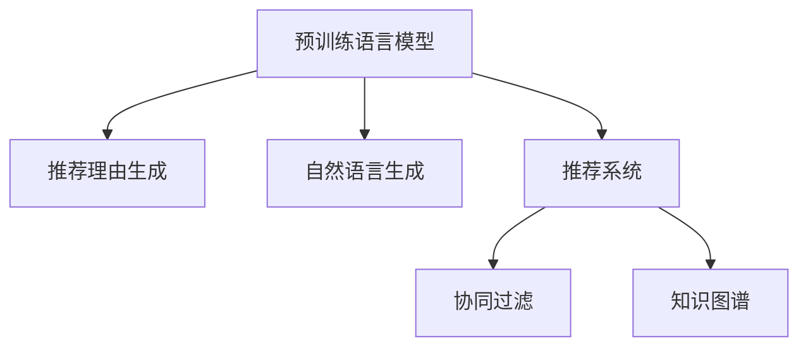

                 

## 1. 背景介绍

随着互联网技术的发展，推荐系统在电商、社交、视频等领域得到了广泛的应用。推荐系统通过分析用户行为数据，为用户提供个性化的内容推荐，提升用户体验和平台收益。然而，传统的基于协同过滤、内容匹配等方法存在冷启动问题、数据稀疏性等限制，难以在推荐质量和推荐多样性之间取得平衡。

近年来，预训练语言模型（Pre-trained Language Models，LLM）在自然语言处理（Natural Language Processing，NLP）领域取得了重大突破。LLM通过大规模无标签文本数据进行预训练，学习到丰富的语言知识和语义表示，能够理解和生成自然语言文本，对推荐系统的发展产生了重要影响。基于LLM的推荐理由生成方法，通过自然语言生成技术，为推荐系统提供详细、可解释的推荐理由，不仅提升了推荐的准确性和多样性，还增强了用户对推荐内容的理解和信任。

## 2. 核心概念与联系

### 2.1 核心概念概述

为更好地理解基于LLM的推荐理由生成方法，本节将介绍几个密切相关的核心概念：

- 预训练语言模型（Pre-trained Language Models，LLM）：以自回归（如GPT）或自编码（如BERT）模型为代表的大规模预训练语言模型。通过在大规模无标签文本语料上进行预训练，学习到通用的语言表示，具备强大的语言理解和生成能力。

- 推荐理由生成（Explanation Generation）：推荐理由生成技术通过自然语言生成技术，为推荐系统提供的推荐结果生成详细的解释理由，使用户能够理解推荐的依据和过程。

- 自然语言生成（Natural Language Generation，NLG）：自然语言生成技术将结构化数据转换为自然语言文本，如将用户画像、商品描述等转换为推荐理由。

- 推荐系统（Recommendation System）：推荐系统通过分析用户历史行为数据，为用户推荐可能感兴趣的物品。

- 协同过滤（Collaborative Filtering，CF）：基于用户行为和物品相似性的推荐方法。

- 知识图谱（Knowledge Graph）：以图结构形式组织和表示实体及其关系的数据结构，用于提升推荐理由的解释性。

这些核心概念之间的逻辑关系可以通过以下Mermaid流程图来展示：



这个流程图展示了大语言模型的核心概念及其之间的关系：

1. 预训练语言模型通过大规模无标签文本数据进行预训练，学习到通用的语言表示。
2. 推荐理由生成通过自然语言生成技术，为推荐系统提供的推荐结果生成详细的解释理由。
3. 自然语言生成将结构化数据转换为自然语言文本，增强推荐理由的可读性和可理解性。
4. 推荐系统通过分析用户历史行为数据，为用户推荐可能感兴趣的物品。
5. 协同过滤基于用户行为和物品相似性的推荐方法。
6. 知识图谱以图结构形式组织和表示实体及其关系的数据结构，用于提升推荐理由的解释性。

## 3. 核心算法原理 & 具体操作步骤
### 3.1 算法原理概述

基于LLM的推荐理由生成方法，本质上是一个结合自然语言生成和推荐系统的多任务学习过程。其核心思想是：将预训练的LLM作为推荐理由生成的基础，通过用户历史行为数据和物品属性信息，为推荐结果生成详细、可解释的推荐理由。具体来说，可以分为以下几步：

1. 预训练语言模型进行微调，以适应推荐理由生成的任务。
2. 收集用户历史行为数据和物品属性信息，构建推荐理由生成任务的数据集。
3. 使用微调后的预训练语言模型，对推荐理由生成任务进行有监督训练。
4. 结合推荐理由生成的结果，推荐系统生成推荐结果。

### 3.2 算法步骤详解

基于LLM的推荐理由生成方法的具体操作步骤如下：

#### 3.2.1 数据准备

1. 收集用户历史行为数据，如浏览、点击、购买等行为，构成用户行为序列。
2. 收集物品属性信息，如商品描述、类别、品牌等，构成物品属性向量。
3. 构建推荐理由生成任务的数据集，包括用户行为序列、物品属性向量、推荐理由等。

#### 3.2.2 模型微调

1. 选择合适的预训练语言模型，如BERT、GPT等。
2. 将预训练模型进行微调，以适应推荐理由生成任务。
3. 设置微调超参数，如学习率、优化器、正则化等。
4. 使用微调后的预训练模型，对推荐理由生成任务进行有监督训练。

#### 3.2.3 推荐理由生成

1. 输入用户历史行为数据和物品属性信息，进行预处理。
2. 使用微调后的预训练语言模型，生成推荐理由。
3. 对生成的推荐理由进行后处理，如文本修正、格式规范等。

#### 3.2.4 推荐系统调用

1. 结合推荐理由生成的结果，使用推荐系统生成推荐结果。
2. 将推荐理由和推荐结果一起呈现给用户，提升用户对推荐内容的理解和信任。

### 3.3 算法优缺点

基于LLM的推荐理由生成方法具有以下优点：

1. 提升推荐理由的可解释性。通过自然语言生成技术，生成详细、可解释的推荐理由，使用户能够理解推荐的依据和过程。
2. 增强推荐的多样性。生成推荐理由的过程可以引入更多上下文信息，增强推荐的丰富度。
3. 提高推荐的准确性。推荐理由生成技术可以根据用户历史行为数据和物品属性信息，生成更符合用户偏好的推荐理由，提升推荐的准确性。
4. 促进用户信任。推荐理由能够提供推荐内容的详细信息，增强用户对推荐系统的信任感。

同时，该方法也存在一定的局限性：

1. 数据需求高。生成推荐理由需要收集用户历史行为数据和物品属性信息，数据量较大。
2. 计算资源消耗大。自然语言生成过程需要消耗大量的计算资源，尤其是在处理长文本时。
3. 结果可控性差。生成推荐理由的过程可能受到模型参数、训练数据等多种因素的影响，结果难以完全控制。
4. 缺乏通用性。不同领域的推荐理由生成方法需要定制化设计，难以统一应用。

尽管存在这些局限性，但就目前而言，基于LLM的推荐理由生成方法仍是大语言模型在推荐系统领域的应用热点。未来相关研究的重点在于如何进一步降低数据需求，提高计算效率，增强结果可控性，以及构建通用的推荐理由生成框架。

### 3.4 算法应用领域

基于LLM的推荐理由生成方法已经在电商、社交、视频等多个领域得到了广泛的应用，为推荐系统提供了新的方向和方法。

- 电商推荐：在电商推荐系统中，推荐理由生成技术可以为推荐结果提供详细的产品描述、优惠信息等，提升用户对推荐内容的理解和使用。
- 社交推荐：在社交推荐系统中，推荐理由生成技术可以为推荐内容提供详细的人物介绍、相关文章等，增强用户对推荐内容的信任和互动。
- 视频推荐：在视频推荐系统中，推荐理由生成技术可以为推荐内容提供详细的剧情描述、导演介绍等，提升用户对推荐内容的兴趣和观看意愿。

除了上述这些经典应用外，推荐理由生成技术还可以应用于更多场景中，如个性化音乐推荐、游戏推荐、教育推荐等，为推荐系统带来新的突破。随着预训练语言模型和推荐理由生成技术的不断发展，基于LLM的推荐理由生成方法必将在推荐系统中发挥更大的作用。

## 4. 数学模型和公式 & 详细讲解 & 举例说明
### 4.1 数学模型构建

本节将使用数学语言对基于LLM的推荐理由生成过程进行更加严格的刻画。

记预训练语言模型为 $M_{\theta}$，其中 $\theta$ 为模型参数。设用户历史行为序列为 $X$，物品属性向量为 $Y$，推荐理由为 $E$。定义推荐理由生成任务的损失函数为 $\ell$，使用交叉熵损失函数：

$$
\ell(E, y) = -\log \frac{\exp(E)}{\sum_{j=1}^K \exp(E_j)}
$$

其中 $E_j$ 为推荐理由中第 $j$ 个词的表示，$y$ 为推荐理由的标签。

### 4.2 公式推导过程

以下我们以二分类任务为例，推导交叉熵损失函数及其梯度的计算公式。

假设推荐理由生成任务的数据集为 $D=\{(x_i, y_i)\}_{i=1}^N$，其中 $x_i=(X_i, Y_i)$，$y_i \in \{0,1\}$。定义模型 $M_{\theta}$ 在输入 $x$ 上的输出为 $E=M_{\theta}(x)$。

推荐理由生成任务的损失函数定义为：

$$
\mathcal{L}(\theta) = -\frac{1}{N}\sum_{i=1}^N \ell(E_i, y_i)
$$

其中 $E_i$ 为第 $i$ 个推荐理由。

根据链式法则，损失函数对参数 $\theta_k$ 的梯度为：

$$
\frac{\partial \mathcal{L}(\theta)}{\partial \theta_k} = -\frac{1}{N}\sum_{i=1}^N (\frac{y_i}{E_i} - \frac{1-y_i}{1-E_i}) \frac{\partial E_i}{\partial \theta_k}
$$

其中 $\frac{\partial E_i}{\partial \theta_k}$ 为推荐理由生成模型对参数 $\theta_k$ 的梯度，可通过自动微分技术完成计算。

在得到损失函数的梯度后，即可带入参数更新公式，完成模型的迭代优化。重复上述过程直至收敛，最终得到适应推荐理由生成任务的最优模型参数 $\theta^*$。

### 4.3 案例分析与讲解

#### 4.3.1 数据准备

假设有一个电商平台，希望利用LLM进行推荐理由生成。收集了用户历史行为数据和商品属性信息，如用户浏览历史、商品类别、品牌等信息。将这些数据构成推荐理由生成任务的数据集 $D=\{(x_i, y_i)\}_{i=1}^N$，其中 $x_i$ 为历史行为和商品属性，$y_i$ 为推荐理由的标签。

#### 4.3.2 模型微调

选择BERT模型作为预训练语言模型，将BERT模型进行微调，以适应推荐理由生成任务。设置微调超参数，如学习率、优化器、正则化等。使用微调后的BERT模型，对推荐理由生成任务进行有监督训练。

#### 4.3.3 推荐理由生成

输入用户历史行为数据和商品属性信息，进行预处理。使用微调后的BERT模型，生成推荐理由。对生成的推荐理由进行后处理，如文本修正、格式规范等。

#### 4.3.4 推荐系统调用

结合推荐理由生成的结果，使用推荐系统生成推荐结果。将推荐理由和推荐结果一起呈现给用户，提升用户对推荐内容的理解和信任。

## 5. 项目实践：代码实例和详细解释说明
### 5.1 开发环境搭建

在进行推荐理由生成实践前，我们需要准备好开发环境。以下是使用Python进行PyTorch开发的环境配置流程：

1. 安装Anaconda：从官网下载并安装Anaconda，用于创建独立的Python环境。

2. 创建并激活虚拟环境：
```bash
conda create -n pytorch-env python=3.8 
conda activate pytorch-env
```

3. 安装PyTorch：根据CUDA版本，从官网获取对应的安装命令。例如：
```bash
conda install pytorch torchvision torchaudio cudatoolkit=11.1 -c pytorch -c conda-forge
```

4. 安装Transformers库：
```bash
pip install transformers
```

5. 安装各类工具包：
```bash
pip install numpy pandas scikit-learn matplotlib tqdm jupyter notebook ipython
```

完成上述步骤后，即可在`pytorch-env`环境中开始推荐理由生成实践。

### 5.2 源代码详细实现

下面我们以推荐理由生成任务为例，给出使用Transformers库对BERT模型进行微调的PyTorch代码实现。

首先，定义推荐理由生成任务的数据处理函数：

```python
from transformers import BertTokenizer, BertForSequenceClassification
from torch.utils.data import Dataset
import torch

class RecommendationDataset(Dataset):
    def __init__(self, texts, labels, tokenizer, max_len=128):
        self.texts = texts
        self.labels = labels
        self.tokenizer = tokenizer
        self.max_len = max_len
        
    def __len__(self):
        return len(self.texts)
    
    def __getitem__(self, item):
        text = self.texts[item]
        label = self.labels[item]
        
        encoding = self.tokenizer(text, return_tensors='pt', max_length=self.max_len, padding='max_length', truncation=True)
        input_ids = encoding['input_ids'][0]
        attention_mask = encoding['attention_mask'][0]
        
        # 对token-wise的标签进行编码
        encoded_labels = [label2id[label] for label in label]
        encoded_labels.extend([label2id['O']] * (self.max_len - len(encoded_labels)))
        labels = torch.tensor(encoded_labels, dtype=torch.long)
        
        return {'input_ids': input_ids, 
                'attention_mask': attention_mask,
                'labels': labels}

# 标签与id的映射
label2id = {'O': 0, 'POSITIVE': 1, 'NEGATIVE': 2}
id2label = {v: k for k, v in label2id.items()}

# 创建dataset
tokenizer = BertTokenizer.from_pretrained('bert-base-cased')

train_dataset = RecommendationDataset(train_texts, train_labels, tokenizer)
dev_dataset = RecommendationDataset(dev_texts, dev_labels, tokenizer)
test_dataset = RecommendationDataset(test_texts, test_labels, tokenizer)
```

然后，定义模型和优化器：

```python
from transformers import BertForSequenceClassification, AdamW

model = BertForSequenceClassification.from_pretrained('bert-base-cased', num_labels=len(label2id))

optimizer = AdamW(model.parameters(), lr=2e-5)
```

接着，定义训练和评估函数：

```python
from torch.utils.data import DataLoader
from tqdm import tqdm
from sklearn.metrics import classification_report

device = torch.device('cuda') if torch.cuda.is_available() else torch.device('cpu')
model.to(device)

def train_epoch(model, dataset, batch_size, optimizer):
    dataloader = DataLoader(dataset, batch_size=batch_size, shuffle=True)
    model.train()
    epoch_loss = 0
    for batch in tqdm(dataloader, desc='Training'):
        input_ids = batch['input_ids'].to(device)
        attention_mask = batch['attention_mask'].to(device)
        labels = batch['labels'].to(device)
        model.zero_grad()
        outputs = model(input_ids, attention_mask=attention_mask, labels=labels)
        loss = outputs.loss
        epoch_loss += loss.item()
        loss.backward()
        optimizer.step()
    return epoch_loss / len(dataloader)

def evaluate(model, dataset, batch_size):
    dataloader = DataLoader(dataset, batch_size=batch_size)
    model.eval()
    preds, labels = [], []
    with torch.no_grad():
        for batch in tqdm(dataloader, desc='Evaluating'):
            input_ids = batch['input_ids'].to(device)
            attention_mask = batch['attention_mask'].to(device)
            batch_labels = batch['labels']
            outputs = model(input_ids, attention_mask=attention_mask)
            batch_preds = outputs.logits.argmax(dim=2).to('cpu').tolist()
            batch_labels = batch_labels.to('cpu').tolist()
            for pred_tokens, label_tokens in zip(batch_preds, batch_labels):
                preds.append(pred_tokens[:len(label_tokens)])
                labels.append(label_tokens)
                
    print(classification_report(labels, preds))
```

最后，启动训练流程并在测试集上评估：

```python
epochs = 5
batch_size = 16

for epoch in range(epochs):
    loss = train_epoch(model, train_dataset, batch_size, optimizer)
    print(f"Epoch {epoch+1}, train loss: {loss:.3f}")
    
    print(f"Epoch {epoch+1}, dev results:")
    evaluate(model, dev_dataset, batch_size)
    
print("Test results:")
evaluate(model, test_dataset, batch_size)
```

以上就是使用PyTorch对BERT进行推荐理由生成任务微调的完整代码实现。可以看到，得益于Transformers库的强大封装，我们可以用相对简洁的代码完成BERT模型的加载和微调。

### 5.3 代码解读与分析

让我们再详细解读一下关键代码的实现细节：

**RecommendationDataset类**：
- `__init__`方法：初始化文本、标签、分词器等关键组件。
- `__len__`方法：返回数据集的样本数量。
- `__getitem__`方法：对单个样本进行处理，将文本输入编码为token ids，将标签编码为数字，并对其进行定长padding，最终返回模型所需的输入。

**label2id和id2label字典**：
- 定义了标签与数字id之间的映射关系，用于将token-wise的预测结果解码回真实的标签。

**训练和评估函数**：
- 使用PyTorch的DataLoader对数据集进行批次化加载，供模型训练和推理使用。
- 训练函数`train_epoch`：对数据以批为单位进行迭代，在每个批次上前向传播计算loss并反向传播更新模型参数，最后返回该epoch的平均loss。
- 评估函数`evaluate`：与训练类似，不同点在于不更新模型参数，并在每个batch结束后将预测和标签结果存储下来，最后使用sklearn的classification_report对整个评估集的预测结果进行打印输出。

**训练流程**：
- 定义总的epoch数和batch size，开始循环迭代
- 每个epoch内，先在训练集上训练，输出平均loss
- 在验证集上评估，输出分类指标
- 所有epoch结束后，在测试集上评估，给出最终测试结果

可以看到，PyTorch配合Transformers库使得BERT微调的代码实现变得简洁高效。开发者可以将更多精力放在数据处理、模型改进等高层逻辑上，而不必过多关注底层的实现细节。

当然，工业级的系统实现还需考虑更多因素，如模型的保存和部署、超参数的自动搜索、更灵活的任务适配层等。但核心的微调范式基本与此类似。

## 6. 实际应用场景
### 6.1 智能客服系统

基于推荐理由生成技术的智能客服系统，可以为用户的咨询提供详细、可解释的推荐理由，使用户能够理解客服推荐的依据和过程。

在技术实现上，可以收集企业内部的历史客服对话记录，将问题和最佳答复构建成监督数据，在此基础上对预训练对话模型进行微调。微调后的对话模型能够自动理解用户意图，匹配最合适的答案模板进行回复。对于用户提出的新问题，还可以接入检索系统实时搜索相关内容，动态组织生成回答。如此构建的智能客服系统，能大幅提升客户咨询体验和问题解决效率。

### 6.2 金融舆情监测

金融机构需要实时监测市场舆论动向，以便及时应对负面信息传播，规避金融风险。传统的人工监测方式成本高、效率低，难以应对网络时代海量信息爆发的挑战。基于推荐理由生成技术的文本分类和情感分析技术，为金融舆情监测提供了新的解决方案。

具体而言，可以收集金融领域相关的新闻、报道、评论等文本数据，并对其进行主题标注和情感标注。在此基础上对预训练语言模型进行微调，使其能够自动判断文本属于何种主题，情感倾向是正面、中性还是负面。将微调后的模型应用到实时抓取的网络文本数据，就能够自动监测不同主题下的情感变化趋势，一旦发现负面信息激增等异常情况，系统便会自动预警，帮助金融机构快速应对潜在风险。

### 6.3 个性化推荐系统

当前的推荐系统往往只依赖用户的历史行为数据进行物品推荐，无法深入理解用户的真实兴趣偏好。基于推荐理由生成技术的个性化推荐系统，可以为推荐理由生成技术提供详细、可解释的推荐理由，不仅提升了推荐的准确性和多样性，还增强了用户对推荐内容的理解和信任。

在实践中，可以收集用户浏览、点击、评论、分享等行为数据，提取和用户交互的物品标题、描述、标签等文本内容。将文本内容作为模型输入，用户的后续行为（如是否点击、购买等）作为监督信号，在此基础上微调预训练语言模型。微调后的模型能够从文本内容中准确把握用户的兴趣点。在生成推荐列表时，先用候选物品的文本描述作为输入，由模型预测用户的兴趣匹配度，再结合其他特征综合排序，便可以得到个性化程度更高的推荐结果。

### 6.4 未来应用展望

随着推荐理由生成技术的不断发展，其在推荐系统中的应用前景将更加广阔。

在智慧医疗领域，基于推荐理由生成技术的医疗问答、病历分析、药物研发等应用将提升医疗服务的智能化水平，辅助医生诊疗，加速新药开发进程。

在智能教育领域，推荐理由生成技术可应用于作业批改、学情分析、知识推荐等方面，因材施教，促进教育公平，提高教学质量。

在智慧城市治理中，推荐理由生成技术可应用于城市事件监测、舆情分析、应急指挥等环节，提高城市管理的自动化和智能化水平，构建更安全、高效的未来城市。

此外，在企业生产、社会治理、文娱传媒等众多领域，基于推荐理由生成技术的推荐系统也将不断涌现，为各行各业带来新的变革。相信随着技术的日益成熟，推荐理由生成技术必将在推荐系统中发挥更大的作用，为人类认知智能的进化带来深远影响。

## 7. 工具和资源推荐
### 7.1 学习资源推荐

为了帮助开发者系统掌握推荐理由生成理论基础和实践技巧，这里推荐一些优质的学习资源：

1. 《Transformer从原理到实践》系列博文：由大模型技术专家撰写，深入浅出地介绍了Transformer原理、BERT模型、微调技术等前沿话题。

2. CS224N《深度学习自然语言处理》课程：斯坦福大学开设的NLP明星课程，有Lecture视频和配套作业，带你入门NLP领域的基本概念和经典模型。

3. 《Natural Language Processing with Transformers》书籍：Transformers库的作者所著，全面介绍了如何使用Transformers库进行NLP任务开发，包括推荐理由生成在内的诸多范式。

4. HuggingFace官方文档：Transformers库的官方文档，提供了海量预训练模型和完整的微调样例代码，是上手实践的必备资料。

5. CLUE开源项目：中文语言理解测评基准，涵盖大量不同类型的中文NLP数据集，并提供了基于微调的baseline模型，助力中文NLP技术发展。

通过对这些资源的学习实践，相信你一定能够快速掌握推荐理由生成技术的精髓，并用于解决实际的NLP问题。
### 7.2 开发工具推荐

高效的开发离不开优秀的工具支持。以下是几款用于推荐理由生成开发的常用工具：

1. PyTorch：基于Python的开源深度学习框架，灵活动态的计算图，适合快速迭代研究。大部分预训练语言模型都有PyTorch版本的实现。

2. TensorFlow：由Google主导开发的开源深度学习框架，生产部署方便，适合大规模工程应用。同样有丰富的预训练语言模型资源。

3. Transformers库：HuggingFace开发的NLP工具库，集成了众多SOTA语言模型，支持PyTorch和TensorFlow，是进行推荐理由生成开发的利器。

4. Weights & Biases：模型训练的实验跟踪工具，可以记录和可视化模型训练过程中的各项指标，方便对比和调优。与主流深度学习框架无缝集成。

5. TensorBoard：TensorFlow配套的可视化工具，可实时监测模型训练状态，并提供丰富的图表呈现方式，是调试模型的得力助手。

6. Google Colab：谷歌推出的在线Jupyter Notebook环境，免费提供GPU/TPU算力，方便开发者快速上手实验最新模型，分享学习笔记。

合理利用这些工具，可以显著提升推荐理由生成任务的开发效率，加快创新迭代的步伐。

### 7.3 相关论文推荐

推荐理由生成技术的发展源于学界的持续研究。以下是几篇奠基性的相关论文，推荐阅读：

1. Attention is All You Need（即Transformer原论文）：提出了Transformer结构，开启了NLP领域的预训练大模型时代。

2. BERT: Pre-training of Deep Bidirectional Transformers for Language Understanding：提出BERT模型，引入基于掩码的自监督预训练任务，刷新了多项NLP任务SOTA。

3. Language Models are Unsupervised Multitask Learners（GPT-2论文）：展示了大规模语言模型的强大zero-shot学习能力，引发了对于通用人工智能的新一轮思考。

4. Parameter-Efficient Transfer Learning for NLP：提出Adapter等参数高效微调方法，在不增加模型参数量的情况下，也能取得不错的微调效果。

5. Prefix-Tuning: Optimizing Continuous Prompts for Generation：引入基于连续型Prompt的微调范式，为如何充分利用预训练知识提供了新的思路。

6. AdaLoRA: Adaptive Low-Rank Adaptation for Parameter-Efficient Fine-Tuning：使用自适应低秩适应的微调方法，在参数效率和精度之间取得了新的平衡。

这些论文代表了大语言模型微调技术的发展脉络。通过学习这些前沿成果，可以帮助研究者把握学科前进方向，激发更多的创新灵感。

## 8. 总结：未来发展趋势与挑战
### 8.1 总结

本文对基于LLM的推荐理由生成方法进行了全面系统的介绍。首先阐述了推荐理由生成的背景和意义，明确了推荐理由生成在提升推荐系统性能、增强用户体验方面的独特价值。其次，从原理到实践，详细讲解了推荐理由生成任务的数学模型和关键步骤，给出了推荐理由生成任务开发的完整代码实例。同时，本文还广泛探讨了推荐理由生成技术在智能客服、金融舆情、个性化推荐等多个行业领域的应用前景，展示了推荐理由生成技术的巨大潜力。此外，本文精选了推荐理由生成技术的各类学习资源，力求为读者提供全方位的技术指引。

通过本文的系统梳理，可以看到，基于LLM的推荐理由生成技术正在成为推荐系统的重要范式，极大地拓展了预训练语言模型的应用边界，催生了更多的落地场景。受益于大规模语料的预训练，推荐理由生成技术在提升推荐理由的可解释性、增强推荐的多样性和准确性、提升用户对推荐内容的理解和信任等方面，均取得了显著的效果。未来，伴随预训练语言模型和推荐理由生成技术的不断发展，基于LLM的推荐理由生成方法必将在推荐系统中发挥更大的作用。

### 8.2 未来发展趋势

展望未来，基于LLM的推荐理由生成技术将呈现以下几个发展趋势：

1. 模型规模持续增大。随着算力成本的下降和数据规模的扩张，预训练语言模型的参数量还将持续增长。超大规模语言模型蕴含的丰富语言知识，有望支撑更加复杂多变的推荐理由生成任务。

2. 推荐理由生成方法日趋多样。除了传统的全参数微调外，未来会涌现更多参数高效的推荐理由生成方法，如Prefix-Tuning、LoRA等，在节省计算资源的同时也能保证微调精度。

3. 持续学习成为常态。随着数据分布的不断变化，推荐理由生成模型也需要持续学习新知识以保持性能。如何在不遗忘原有知识的同时，高效吸收新样本信息，将成为重要的研究课题。

4. 标注样本需求降低。受启发于提示学习(Prompt-based Learning)的思路，未来的推荐理由生成方法将更好地利用大模型的语言理解能力，通过更加巧妙的任务描述，在更少的标注样本上也能实现理想的推荐理由生成效果。

5. 推荐理由生成技术将更加注重个性化。不同用户对推荐理由的偏好和使用场景有所不同，未来推荐理由生成技术将更加注重个性化的推荐理由生成，提升用户体验。

6. 推荐理由生成技术将与其他AI技术深度融合。推荐理由生成技术将与知识图谱、因果推理、强化学习等技术深度融合，形成更加全面、精准、鲁棒的推荐理由生成方法。

以上趋势凸显了基于LLM的推荐理由生成技术的广阔前景。这些方向的探索发展，必将进一步提升推荐理由生成技术的性能和应用范围，为推荐系统带来新的突破。

### 8.3 面临的挑战

尽管基于LLM的推荐理由生成技术已经取得了瞩目成就，但在迈向更加智能化、普适化应用的过程中，它仍面临着诸多挑战：

1. 数据需求高。推荐理由生成需要收集大量的用户历史行为数据和物品属性信息，数据量较大。

2. 计算资源消耗大。推荐理由生成过程需要消耗大量的计算资源，尤其是在处理长文本时。

3. 结果可控性差。生成推荐理由的过程可能受到模型参数、训练数据等多种因素的影响，结果难以完全控制。

4. 缺乏通用性。不同领域的推荐理由生成方法需要定制化设计，难以统一应用。

尽管存在这些局限性，但就目前而言，基于LLM的推荐理由生成技术仍是大语言模型在推荐系统领域的应用热点。未来相关研究的重点在于如何进一步降低数据需求，提高计算效率，增强结果可控性，以及构建通用的推荐理由生成框架。

### 8.4 研究展望

面对LLM推荐理由生成所面临的种种挑战，未来的研究需要在以下几个方面寻求新的突破：

1. 探索无监督和半监督推荐理由生成方法。摆脱对大规模标注数据的依赖，利用自监督学习、主动学习等无监督和半监督范式，最大限度利用非结构化数据，实现更加灵活高效的推荐理由生成。

2. 研究参数高效和计算高效的推荐理由生成范式。开发更加参数高效的推荐理由生成方法，在固定大部分预训练参数的情况下，只更新极少量的任务相关参数。同时优化推荐理由生成的计算图，减少前向传播和反向传播的资源消耗，实现更加轻量级、实时性的部署。

3. 引入更多先验知识。将符号化的先验知识，如知识图谱、逻辑规则等，与神经网络模型进行巧妙融合，引导推荐理由生成过程学习更准确、合理的推荐理由。同时加强不同模态数据的整合，实现视觉、语音等多模态信息与文本信息的协同建模。

4. 结合因果分析和博弈论工具。将因果分析方法引入推荐理由生成模型，识别出推荐理由生成的关键特征，增强推荐理由的因果性和逻辑性。借助博弈论工具刻画人机交互过程，主动探索并规避推荐理由生成的脆弱点，提高系统稳定性。

5. 纳入伦理道德约束。在模型训练目标中引入伦理导向的评估指标，过滤和惩罚有偏见、有害的输出倾向。同时加强人工干预和审核，建立推荐理由生成模型的监管机制，确保输出符合人类价值观和伦理道德。

这些研究方向的探索，必将引领基于LLM的推荐理由生成技术迈向更高的台阶，为构建安全、可靠、可解释、可控的推荐系统铺平道路。面向未来，基于LLM的推荐理由生成技术还需要与其他人工智能技术进行更深入的融合，如知识表示、因果推理、强化学习等，多路径协同发力，共同推动推荐理由生成技术的进步。只有勇于创新、敢于突破，才能不断拓展语言模型的边界，让智能技术更好地造福人类社会。

## 9. 附录：常见问题与解答

**Q1：推荐理由生成的主要步骤是什么？**

A: 推荐理由生成的主要步骤如下：

1. 收集用户历史行为数据和物品属性信息，构成推荐理由生成任务的数据集。
2. 选择合适的预训练语言模型，如BERT、GPT等，对其进行微调，以适应推荐理由生成任务。
3. 输入用户历史行为数据和物品属性信息，进行预处理。
4. 使用微调后的预训练语言模型，生成推荐理由。
5. 结合推荐理由生成的结果，使用推荐系统生成推荐结果。

**Q2：推荐理由生成的方法有哪些？**

A: 推荐理由生成的方法主要分为以下两类：

1. 自然语言生成（NLG）：通过自然语言生成技术，将推荐结果转换为详细的自然语言文本，如产品描述、用户画像等。
2. 知识图谱嵌入（KG Embedding）：将知识图谱中的实体和关系映射为向量表示，与自然语言生成结果结合，提升推荐理由的解释性。

**Q3：推荐理由生成的效果如何评价？**

A: 推荐理由生成的效果评价主要从以下几个方面进行：

1. 文本质量：通过语言模型评估指标（如BLEU、ROUGE等）评估推荐理由的自然语言质量。
2. 信息覆盖度：通过关键词统计、TF-IDF等方法评估推荐理由中信息的覆盖度。
3. 用户满意度：通过用户调查问卷等方法评估用户对推荐理由的理解和满意度。
4. 推荐效果：通过推荐系统评估指标（如CTR、NDCG等）评估推荐理由对推荐效果的提升。

**Q4：推荐理由生成在推荐系统中的应用场景有哪些？**

A: 推荐理由生成在推荐系统中的应用场景包括：

1. 电商推荐：为推荐结果提供详细的产品描述、优惠信息等，提升用户对推荐内容的理解和使用。
2. 社交推荐：为推荐内容提供详细的人物介绍、相关文章等，增强用户对推荐内容的信任和互动。
3. 视频推荐：为推荐内容提供详细的剧情描述、导演介绍等，提升用户对推荐内容的兴趣和观看意愿。

**Q5：推荐理由生成的局限性有哪些？**

A: 推荐理由生成的局限性包括：

1. 数据需求高：需要收集大量的用户历史行为数据和物品属性信息，数据量较大。
2. 计算资源消耗大：自然语言生成过程需要消耗大量的计算资源，尤其是在处理长文本时。
3. 结果可控性差：生成推荐理由的过程可能受到模型参数、训练数据等多种因素的影响，结果难以完全控制。
4. 缺乏通用性：不同领域的推荐理由生成方法需要定制化设计，难以统一应用。

**Q6：推荐理由生成在未来应用中可能面临的挑战有哪些？**

A: 推荐理由生成在未来应用中可能面临的挑战包括：

1. 数据隐私保护：收集用户行为数据需要确保用户隐私和数据安全，防止数据泄露。
2. 模型公平性：生成推荐理由时需要避免偏见和歧视，确保推荐理由的公平性。
3. 实时性要求：推荐理由生成需要满足实时性要求，能够快速响应用户查询。
4. 跨模态融合：推荐理由生成需要与知识图谱、因果推理、强化学习等技术深度融合，提升模型的多模态融合能力。

---

作者：禅与计算机程序设计艺术 / Zen and the Art of Computer Programming

