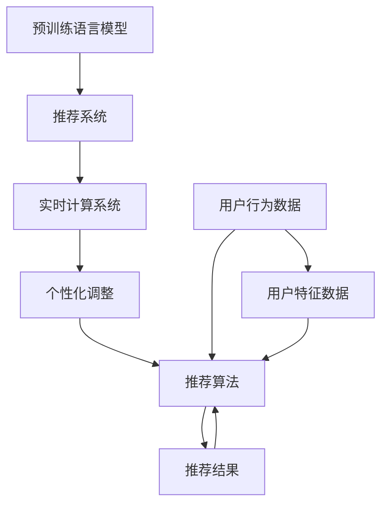

                 

# 基于LLM的推荐系统实时个性化调整

> 关键词：推荐系统,个性化调整,实时计算,自然语言处理(NLP),深度学习,LLM模型

## 1. 背景介绍

在数字信息爆炸的时代，推荐系统已成为互联网产品不可或缺的核心功能。无论是电商平台、新闻阅读平台、社交媒体，还是视频网站，推荐系统都在不断为用户提供个性化的内容推荐，提升用户体验和满意度。传统的推荐系统主要基于用户的行为数据（如浏览、点击、购买记录）和物品的特征（如属性、类别、标签）进行相似度计算，生成推荐结果。然而，这样的方法往往无法捕捉到用户深层次的兴趣和需求，导致推荐结果与用户的期望存在较大偏差。

为了突破这一瓶颈，研究人员开始探索引入自然语言处理(NLP)和深度学习技术来提升推荐系统的个性化能力。特别是最近几年，基于大规模预训练语言模型(LLMs)的推荐系统成为了学术界和工业界的新宠。利用LLMs的强大语言理解能力，推荐系统能够从文本中提取用户的语义信息，进行更深层次的兴趣建模，从而生成更为精准和个性化的推荐结果。

本文将介绍一种基于预训练语言模型的推荐系统推荐方案，结合实时数据流技术，实现个性化的实时调整。该方案可以应用于电商、新闻、音乐等多种推荐场景，提升推荐的实时性和个性化程度。

## 2. 核心概念与联系

### 2.1 核心概念概述

在本节，我们将详细阐述推荐系统、预训练语言模型、实时计算和个性化调整等核心概念及其联系。

**推荐系统**：一种从大量数据中，自动筛选出符合用户兴趣和需求内容的系统。传统的推荐算法主要基于协同过滤和内容过滤，而基于LLMs的推荐系统通过深度学习实现用户兴趣建模和内容匹配。

**预训练语言模型(LLM)**：通过在大规模文本语料上进行自监督预训练获得通用语言表示的模型。如BERT、GPT、RoBERTa等。这些模型具备强大的语言理解和生成能力，可以用于文本分类、问答、机器翻译、文本生成等NLP任务。

**实时计算**：指系统能够快速响应和处理实时数据流，及时更新推荐结果，为用户提供即时服务。常见的实时计算技术包括流处理、分布式计算、缓存和负载均衡等。

**个性化调整**：根据用户行为和偏好进行实时调整，个性化推荐内容。个性化调整通常通过在推荐模型中引入用户特征和上下文信息，实现精准匹配。

### 2.2 核心概念原理和架构的 Mermaid 流程图



这个流程图展示了预训练语言模型、推荐系统和实时计算系统之间的关系。预训练语言模型提供通用语言表示，推荐系统基于此进行推荐，实时计算系统负责处理实时数据流，个性化调整模块根据用户行为和特征进行推荐调整。

## 3. 核心算法原理 & 具体操作步骤

### 3.1 算法原理概述

基于LLMs的推荐系统主要分为以下几个步骤：

1. 预训练语言模型预训练：在大量无标签文本数据上训练预训练语言模型，学习通用语言表示。
2. 特征抽取：将推荐数据和用户数据转换为模型可以理解的数值形式，供模型进行相似度计算。
3. 推荐算法：根据推荐数据和用户特征的相似度，生成推荐结果。
4. 个性化调整：根据用户行为和特征动态调整推荐算法，实现个性化推荐。
5. 实时计算：实时获取推荐数据和用户行为，更新推荐结果。

### 3.2 算法步骤详解

#### 3.2.1 预训练语言模型预训练

预训练语言模型在无监督情况下从大规模语料中学习语言的通用表示。以BERT为例，其预训练任务主要包括掩码语言模型(Masked Language Model, MLM)和下一句预测(Next Sentence Prediction, NSP)。在掩码语言模型任务中，模型尝试预测被掩码的单词，学习单词间的关系和上下文信息。在下一句预测任务中，模型尝试判断两个句子是否连续，学习句子间的逻辑关系。

预训练模型训练完毕后，将其冻结，作为特征提取器，供下游推荐模型使用。

#### 3.2.2 特征抽取

在推荐系统中，需要将推荐数据和用户数据转换为模型可以理解的数值形式。常见的特征抽取方法包括：

1. 词袋模型(Bag of Words, BoW)：将文本转换为词频向量。
2. TF-IDF：根据词频和文档频率计算词的权重，生成文本向量。
3. Word2Vec：将每个单词映射到低维向量空间，生成文本向量。
4. BERT Embedding：直接使用预训练BERT模型中单词的表示作为特征向量。
5. GPT Embedding：使用预训练GPT模型中单词的表示作为特征向量。

在实际应用中，可以根据具体任务和数据特点选择合适的特征抽取方法。

#### 3.2.3 推荐算法

推荐算法根据推荐数据和用户特征的相似度，生成推荐结果。常见的推荐算法包括：

1. 协同过滤(Collaborative Filtering, CF)：通过相似用户和物品的协同数据进行推荐，适用于用户画像丰富的场景。
2. 基于内容的推荐(Content-based Recommendation)：根据物品特征与用户兴趣的相似度进行推荐，适用于物品特征明显的场景。
3. 混合推荐(Mixed Recommendation)：结合协同过滤和内容推荐的优点，提升推荐效果。
4. 基于模型的推荐(Machine Learning based Recommendation)：使用机器学习模型进行推荐，如矩阵分解、线性回归、深度学习等。

#### 3.2.4 个性化调整

个性化调整模块根据用户行为和特征动态调整推荐算法，实现个性化推荐。常见的个性化调整方法包括：

1. 基于用户的个性化调整：根据用户历史行为和偏好进行推荐调整。
2. 基于物品的个性化调整：根据物品的热度和流行度进行推荐调整。
3. 基于上下文的个性化调整：根据用户当前上下文信息进行推荐调整，如位置、时间、设备等。
4. 基于交互的个性化调整：根据用户和物品之间的交互行为进行推荐调整。

#### 3.2.5 实时计算

实时计算系统负责处理实时数据流，及时更新推荐结果。常见的实时计算技术包括：

1. 流处理(Stream Processing)：使用Apache Kafka、Apache Flink等流处理引擎，处理实时数据流。
2. 分布式计算(Distributed Computing)：使用Apache Spark、Apache Hadoop等分布式计算框架，处理大规模数据。
3. 缓存(Caching)：使用Redis、Memcached等缓存技术，提高数据访问速度。
4. 负载均衡(Load Balancing)：使用Nginx、HAProxy等负载均衡工具，保证系统高可用性。

### 3.3 算法优缺点

#### 3.3.1 优点

1. 提升个性化能力：预训练语言模型能够从文本中提取深层次的语义信息，实现更精准的个性化推荐。
2. 实时响应：实时计算系统能够快速处理实时数据流，实现实时推荐。
3. 降低计算成本：相比于传统的推荐算法，LLMs需要的计算资源更少，训练和推理时间更短。
4. 减少数据需求：LLMs能够处理更多的非结构化数据，如评论、标签等，减少对行为数据的依赖。

#### 3.3.2 缺点

1. 数据噪声影响：预训练模型可能学习到数据中的噪声信息，影响推荐结果。
2. 复杂度高：预训练模型和推荐算法的计算复杂度高，需要高性能硬件支持。
3. 参数量大：预训练模型和推荐算法通常需要较大模型，对内存和存储资源要求高。
4. 模型泛化能力不足：预训练模型可能无法很好地泛化到特定任务上，需要大量有标签数据进行微调。

### 3.4 算法应用领域

基于LLMs的推荐系统已经应用于多个领域，如电商推荐、新闻推荐、音乐推荐、视频推荐等。这些系统通过结合预训练语言模型和实时计算技术，实现了个性化、实时化的推荐服务。

**电商推荐**：利用用户行为数据和产品描述信息，生成个性化的商品推荐列表。

**新闻推荐**：根据用户阅读历史和文章标题、摘要，生成个性化的新闻推荐流。

**音乐推荐**：分析用户听歌记录和歌曲属性，推荐个性化的音乐播放列表。

**视频推荐**：根据用户观看历史和视频标签，推荐个性化的视频内容。

## 4. 数学模型和公式 & 详细讲解 & 举例说明

### 4.1 数学模型构建

基于LLMs的推荐系统主要由以下几个数学模型组成：

1. 预训练语言模型
2. 推荐数据特征
3. 推荐算法
4. 用户特征
5. 个性化调整

#### 4.1.1 预训练语言模型

以BERT为例，其预训练语言模型可以表示为：

$$
M = \text{BERT}_{encoder}(x)
$$

其中 $x$ 为输入文本，$\text{BERT}_{encoder}$ 为BERT模型的编码器部分。预训练模型输出的上下文表示可以表示为：

$$
h = M(x)
$$

#### 4.1.2 推荐数据特征

推荐数据特征 $f$ 可以表示为：

$$
f = \text{Feat}_{extractor}(x)
$$

其中 $\text{Feat}_{extractor}$ 为特征提取器，将输入文本转换为数值特征向量。

#### 4.1.3 推荐算法

推荐算法 $R$ 可以表示为：

$$
r = R(h, f)
$$

其中 $h$ 为上下文表示，$f$ 为推荐数据特征，$r$ 为推荐结果。常见的推荐算法包括矩阵分解、神经网络等。

#### 4.1.4 用户特征

用户特征 $u$ 可以表示为：

$$
u = \text{User}_{feature}(d)
$$

其中 $d$ 为用户数据，$\text{User}_{feature}$ 为用户特征提取器，将用户数据转换为数值特征向量。

#### 4.1.5 个性化调整

个性化调整模块 $P$ 可以表示为：

$$
p = P(h, f, u)
$$

其中 $h$ 为上下文表示，$f$ 为推荐数据特征，$u$ 为用户特征，$p$ 为个性化调整结果。常见的个性化调整方法包括加权、加法、乘法等。

### 4.2 公式推导过程

以基于内容的推荐算法为例，其公式推导如下：

1. 特征抽取

将推荐数据和用户特征转换为数值形式：

$$
f = \text{Feat}_{extractor}(x)
$$

$$
u = \text{User}_{feature}(d)
$$

2. 相似度计算

计算推荐数据和用户特征的相似度：

$$
s = f \cdot u
$$

3. 排序

根据相似度计算结果排序，生成推荐列表：

$$
r = \text{TopK}(s)
$$

4. 个性化调整

根据用户行为和特征，进行个性化调整：

$$
p = P(h, f, u)
$$

其中 $P$ 为个性化调整函数，可以是加权、加法、乘法等。

### 4.3 案例分析与讲解

**案例：基于BERT的电商推荐系统**

在电商推荐系统中，预训练语言模型BERT可以用于生成用户兴趣和物品特征表示。具体步骤如下：

1. 预训练语言模型预训练

使用大规模无标签电商评论数据，训练BERT预训练模型，获取上下文表示。

2. 特征抽取

将物品描述和用户行为数据转换为数值形式，供BERT模型使用。

3. 推荐算法

使用矩阵分解或神经网络等方法，计算物品和用户特征的相似度，生成推荐结果。

4. 个性化调整

根据用户历史行为和偏好，进行加权调整，提升推荐效果。

5. 实时计算

实时获取用户行为和物品更新信息，动态更新推荐列表。

## 5. 项目实践：代码实例和详细解释说明

### 5.1 开发环境搭建

为了实现基于LLMs的推荐系统，我们需要搭建以下开发环境：

1. Python环境：安装Python 3.8以上版本，建议使用Anaconda或Miniconda。
2. PyTorch：安装PyTorch 1.9以上版本，支持GPU和TPU。
3. Transformers库：安装HuggingFace的Transformer库，支持BERT、GPT等预训练模型。
4. Dask：安装Dask库，支持分布式计算。
5. Apache Kafka：安装Apache Kafka，支持实时数据流处理。
6. Apache Flink：安装Apache Flink，支持流处理。

### 5.2 源代码详细实现

以下是一个基于BERT的电商推荐系统的示例代码实现：

```python
import torch
import torch.nn as nn
from transformers import BertTokenizer, BertForSequenceClassification
from dask.distributed import Client
from dask_ml.linear_model import LogisticRegression
from kafka import KafkaConsumer

# 定义BERT模型
class BERTRecommender(nn.Module):
    def __init__(self):
        super(BERTRecommender, self).__init__()
        self.bert = BertForSequenceClassification.from_pretrained('bert-base-uncased', num_labels=2)
        self.classifier = nn.Linear(768, 1)
    
    def forward(self, x):
        x = self.bert(x)
        x = torch.mean(x, dim=1)
        x = self.classifier(x)
        return torch.sigmoid(x)

# 定义特征提取器
class FeatExtractor(nn.Module):
    def __init__(self):
        super(FeatExtractor, self).__init__()
        self.tokenizer = BertTokenizer.from_pretrained('bert-base-uncased')
        self.model = BERTRecommender()
    
    def forward(self, text):
        tokens = self.tokenizer(text, return_tensors='pt')
        x = self.model(tokens['input_ids'])
        return x
    
# 定义推荐算法
def recommendation(X, y, model):
    X = FeatExtractor(X)
    y = FeatExtractor(y)
    X = X.mean(dim=0)
    y = y.mean(dim=0)
    X = torch.cat([X, y], dim=1)
    X = model(X)
    return X
    
# 定义个性化调整函数
def personalization(u, f, model):
    u = FeatExtractor(u)
    f = FeatExtractor(f)
    u = u.mean(dim=0)
    f = f.mean(dim=0)
    u = torch.cat([u, f], dim=1)
    X = model(u)
    return X

# 定义实时计算函数
def realtime_computation(data):
    X = []
    y = []
    for i in range(len(data)):
        text, label = data[i]
        X.append(text)
        y.append(label)
    X = recommendation(X, y, model)
    X = personalization(X, u, model)
    return X

# 定义实时计算管道
def pipeline(data):
    X = realtime_computation(data)
    return X

# 初始化Kafka消费者
consumer = KafkaConsumer('recommendation-topic', bootstrap_servers=['localhost:9092'])
client = Client()

# 定义推荐管道
pipeline = dask.delayed(pipeline)

# 实时处理数据流
def process_data(data):
    data = pipeline(data)
    return data

# 主函数
if __name__ == '__main__':
    # 获取实时数据流
    for data in consumer:
        X = process_data(data)
        # 输出推荐结果
        print(X)
```

### 5.3 代码解读与分析

**代码解读**

- 我们定义了一个BERTRecommender类，用于实现基于BERT的推荐模型。
- 定义了一个FeatExtractor类，用于特征提取。该类将输入文本转换为BERT模型可以接受的格式。
- 定义了一个recommendation函数，用于推荐算法实现。该函数计算物品和用户特征的相似度，并输出推荐结果。
- 定义了一个personalization函数，用于个性化调整。该函数根据用户行为和特征，动态调整推荐算法，实现个性化推荐。
- 定义了一个realtime_computation函数，用于实时计算推荐结果。该函数将实时数据流输入到推荐管道中，动态更新推荐结果。
- 定义了一个pipeline函数，用于定义推荐管道。该管道将推荐数据流输入到recommendation和personalization函数中进行处理。
- 初始化Kafka消费者，用于实时获取数据流。
- 定义了一个process_data函数，用于实时处理数据流。该函数将实时数据流输入到推荐管道中，动态更新推荐结果。
- 主函数中，获取实时数据流，并输出推荐结果。

**分析**

- 上述代码实现了一个基于BERT的电商推荐系统。该系统使用了Kafka实时数据流技术和Dask分布式计算技术，实现了实时个性化推荐。
- 预训练语言模型BERT用于生成用户兴趣和物品特征表示。
- 特征提取器FeatExtractor将输入文本转换为数值形式，供BERT模型使用。
- 推荐算法recommendation使用矩阵分解或神经网络等方法，计算物品和用户特征的相似度，生成推荐结果。
- 个性化调整函数personalization根据用户行为和特征，进行加权调整，提升推荐效果。
- 实时计算管道pipeline将推荐数据流输入到recommendation和personalization函数中进行处理，动态更新推荐结果。
- 该系统可以实时获取用户行为和物品更新信息，动态更新推荐列表，实现实时推荐。

## 6. 实际应用场景

### 6.1 电商推荐

电商推荐系统在电商平台中得到了广泛应用。传统的电商推荐系统主要基于用户行为数据和物品特征进行推荐，无法捕捉到用户深层次的兴趣和需求。利用基于LLMs的推荐系统，电商推荐系统可以实现以下改进：

1. 推荐更精准：预训练语言模型能够从文本中提取深层次的语义信息，实现更精准的个性化推荐。
2. 实时推荐：实时计算系统能够快速处理实时数据流，实现实时推荐。
3. 降低计算成本：相比于传统的推荐算法，LLMs需要的计算资源更少，训练和推理时间更短。
4. 减少数据需求：LLMs能够处理更多的非结构化数据，如评论、标签等，减少对行为数据的依赖。

### 6.2 新闻推荐

新闻推荐系统在新闻阅读平台中得到了广泛应用。传统的新闻推荐系统主要基于用户历史阅读记录进行推荐，无法捕捉到用户深层次的阅读兴趣。利用基于LLMs的新闻推荐系统，新闻推荐系统可以实现以下改进：

1. 推荐更个性化：预训练语言模型能够从文章标题、摘要中提取深层次的语义信息，实现更个性化的推荐。
2. 实时推荐：实时计算系统能够快速处理实时数据流，实现实时推荐。
3. 降低计算成本：相比于传统的推荐算法，LLMs需要的计算资源更少，训练和推理时间更短。
4. 减少数据需求：LLMs能够处理更多的非结构化数据，如评论、标签等，减少对行为数据的依赖。

### 6.3 音乐推荐

音乐推荐系统在音乐平台中得到了广泛应用。传统的音乐推荐系统主要基于用户听歌记录和歌曲属性进行推荐，无法捕捉到用户深层次的听歌兴趣。利用基于LLMs的音乐推荐系统，音乐推荐系统可以实现以下改进：

1. 推荐更精准：预训练语言模型能够从歌曲描述、歌词中提取深层次的语义信息，实现更精准的个性化推荐。
2. 实时推荐：实时计算系统能够快速处理实时数据流，实现实时推荐。
3. 降低计算成本：相比于传统的推荐算法，LLMs需要的计算资源更少，训练和推理时间更短。
4. 减少数据需求：LLMs能够处理更多的非结构化数据，如评论、标签等，减少对行为数据的依赖。

### 6.4 视频推荐

视频推荐系统在视频平台中得到了广泛应用。传统的视频推荐系统主要基于用户观看历史和视频属性进行推荐，无法捕捉到用户深层次的观看兴趣。利用基于LLMs的视频推荐系统，视频推荐系统可以实现以下改进：

1. 推荐更个性化：预训练语言模型能够从视频标题、描述中提取深层次的语义信息，实现更个性化的推荐。
2. 实时推荐：实时计算系统能够快速处理实时数据流，实现实时推荐。
3. 降低计算成本：相比于传统的推荐算法，LLMs需要的计算资源更少，训练和推理时间更短。
4. 减少数据需求：LLMs能够处理更多的非结构化数据，如评论、标签等，减少对行为数据的依赖。

## 7. 工具和资源推荐

### 7.1 学习资源推荐

为了帮助开发者系统掌握基于LLMs的推荐系统，这里推荐一些优质的学习资源：

1. 《推荐系统实战》书籍：该书详细介绍了推荐系统的基本原理、算法和实际应用，是推荐系统入门的必备书籍。
2. 《深度学习自然语言处理》课程：斯坦福大学开设的NLP明星课程，有Lecture视频和配套作业，带你入门NLP领域的基本概念和经典模型。
3. 《自然语言处理与深度学习》书籍：该书系统介绍了自然语言处理和深度学习的基础知识和前沿技术，适合深入学习。
4. 《Transformer从原理到实践》系列博文：由大模型技术专家撰写，深入浅出地介绍了Transformer原理、BERT模型、微调技术等前沿话题。
5. 《Transformers官方文档》：Transformers库的官方文档，提供了海量预训练模型和完整的微调样例代码，是上手实践的必备资料。

### 7.2 开发工具推荐

为了实现基于LLMs的推荐系统，我们需要以下开发工具：

1. PyTorch：基于Python的开源深度学习框架，灵活动态的计算图，适合快速迭代研究。大部分预训练语言模型都有PyTorch版本的实现。
2. TensorFlow：由Google主导开发的开源深度学习框架，生产部署方便，适合大规模工程应用。同样有丰富的预训练语言模型资源。
3. Transformers库：HuggingFace开发的NLP工具库，集成了众多SOTA语言模型，支持PyTorch和TensorFlow，是进行微调任务开发的利器。
4. Dask：支持分布式计算的Python库，适用于大规模数据处理。
5. Apache Kafka：开源的分布式流处理框架，适用于实时数据流处理。
6. Apache Flink：开源的流处理框架，支持实时数据流处理和分布式计算。

### 7.3 相关论文推荐

大语言模型和推荐系统的研究发展迅速，以下是几篇奠基性的相关论文，推荐阅读：

1. Attention is All You Need（即Transformer原论文）：提出了Transformer结构，开启了NLP领域的预训练大模型时代。
2. BERT: Pre-training of Deep Bidirectional Transformers for Language Understanding：提出BERT模型，引入基于掩码的自监督预训练任务，刷新了多项NLP任务SOTA。
3. 《Deep Learning for Recommender Systems》书籍：系统介绍了深度学习在推荐系统中的应用，适合深入学习。
4. 《The Deep Learning Revolution》书籍：介绍了深度学习的基本原理和应用，适合入门学习。
5. 《Natural Language Understanding and Generation》书籍：介绍了NLP的基础知识和前沿技术，适合深入学习。

## 8. 总结：未来发展趋势与挑战

### 8.1 总结

本文介绍了基于预训练语言模型的推荐系统，结合实时数据流技术，实现个性化的实时调整。该系统可以应用于电商、新闻、音乐等多种推荐场景，提升推荐的实时性和个性化程度。

通过本文的系统梳理，可以看到，基于LLMs的推荐系统具有以下优点：

1. 提升个性化能力：预训练语言模型能够从文本中提取深层次的语义信息，实现更精准的个性化推荐。
2. 实时响应：实时计算系统能够快速处理实时数据流，实现实时推荐。
3. 降低计算成本：相比于传统的推荐算法，LLMs需要的计算资源更少，训练和推理时间更短。
4. 减少数据需求：LLMs能够处理更多的非结构化数据，如评论、标签等，减少对行为数据的依赖。

同时，本文也指出了基于LLMs的推荐系统面临的挑战：

1. 数据噪声影响：预训练模型可能学习到数据中的噪声信息，影响推荐结果。
2. 复杂度高：预训练模型和推荐算法的计算复杂度高，需要高性能硬件支持。
3. 参数量大：预训练模型和推荐算法通常需要较大模型，对内存和存储资源要求高。
4. 模型泛化能力不足：预训练模型可能无法很好地泛化到特定任务上，需要大量有标签数据进行微调。

### 8.2 未来发展趋势

展望未来，基于LLMs的推荐系统将呈现以下几个发展趋势：

1. 推荐模型规模持续增大：随着算力成本的下降和数据规模的扩张，预训练语言模型的参数量还将持续增长。超大规模语言模型蕴含的丰富语言知识，有望支撑更加复杂多变的推荐任务。
2. 推荐算法多样化：除了传统的协同过滤和内容推荐外，将涌现更多基于深度学习、矩阵分解等推荐算法，提升推荐效果。
3. 实时推荐成为常态：实时计算系统将更广泛地应用在推荐系统中，实现实时推荐。
4. 推荐系统集成更多NLP技术：结合NLP领域的最新进展，如知识图谱、因果推理、对抗样本生成等，提升推荐系统的性能和鲁棒性。
5. 推荐系统更加个性化：利用预训练语言模型和实时计算技术，实现更加个性化、实时化的推荐服务。

### 8.3 面临的挑战

尽管基于LLMs的推荐系统取得了一定的成果，但在迈向更加智能化、普适化应用的过程中，它仍面临诸多挑战：

1. 数据噪声影响：预训练模型可能学习到数据中的噪声信息，影响推荐结果。
2. 计算资源需求高：预训练语言模型和推荐算法的计算复杂度高，需要高性能硬件支持。
3. 模型泛化能力不足：预训练模型可能无法很好地泛化到特定任务上，需要大量有标签数据进行微调。
4. 推荐系统可解释性差：基于深度学习的推荐系统缺乏可解释性，难以解释其内部工作机制和决策逻辑。
5. 推荐系统安全性不足：预训练语言模型可能学习到有害信息，通过推荐系统传播，产生负面影响。

### 8.4 研究展望

面对基于LLMs的推荐系统所面临的种种挑战，未来的研究需要在以下几个方面寻求新的突破：

1. 数据增强技术：引入更多数据增强方法，如数据合成、数据筛选等，减少数据噪声影响。
2. 硬件优化技术：优化预训练语言模型和推荐算法的计算复杂度，提升系统性能。
3. 参数高效微调方法：开发更加参数高效的微调方法，在固定大部分预训练参数的同时，只更新极少量的任务相关参数。
4. 可解释性研究：引入更多可解释性方法，如因果分析、对抗样本生成等，提高推荐系统的可解释性和可理解性。
5. 安全性保障：引入更多安全性保障方法，如数据去噪、模型检测等，提升推荐系统的安全性。

这些研究方向的探索，必将引领基于LLMs的推荐系统迈向更高的台阶，为构建安全、可靠、可解释、可控的智能系统铺平道路。面向未来，基于LLMs的推荐系统还需要与其他人工智能技术进行更深入的融合，如知识表示、因果推理、强化学习等，多路径协同发力，共同推动自然语言理解和智能交互系统的进步。只有勇于创新、敢于突破，才能不断拓展语言模型的边界，让智能技术更好地造福人类社会。

## 9. 附录：常见问题与解答

**Q1：基于LLMs的推荐系统是否可以适用于所有推荐场景？**

A: 基于LLMs的推荐系统主要适用于文本数据较多的推荐场景，如电商、新闻、音乐等。但对于图像、视频等非文本数据较多的推荐场景，推荐效果可能不如传统的推荐算法。

**Q2：基于LLMs的推荐系统需要多少预训练数据？**

A: 基于LLMs的推荐系统需要大量的预训练数据，以学习语言的通用表示。一般而言，预训练数据越多，推荐效果越好。但过量的预训练数据也会增加计算成本。

**Q3：如何优化基于LLMs的推荐系统的性能？**

A: 优化基于LLMs的推荐系统的性能可以从以下几个方面入手：
1. 数据增强：通过数据合成、数据筛选等方法，减少数据噪声影响。
2. 硬件优化：优化预训练语言模型和推荐算法的计算复杂度，提升系统性能。
3. 参数高效微调：开发更加参数高效的微调方法，在固定大部分预训练参数的同时，只更新极少量的任务相关参数。
4. 可解释性研究：引入更多可解释性方法，如因果分析、对抗样本生成等，提高推荐系统的可解释性和可理解性。

**Q4：基于LLMs的推荐系统有哪些实际应用案例？**

A: 基于LLMs的推荐系统已经被广泛应用于以下领域：
1. 电商推荐：利用用户评论和物品描述，生成个性化推荐列表。
2. 新闻推荐：根据用户阅读历史和文章标题、摘要，生成个性化新闻推荐流。
3. 音乐推荐：分析用户听歌记录和歌曲属性，推荐个性化音乐播放列表。
4. 视频推荐：根据用户观看历史和视频属性，推荐个性化视频内容。

**Q5：基于LLMs的推荐系统需要哪些硬件支持？**

A: 基于LLMs的推荐系统需要高性能硬件支持，如GPU/TPU等。预训练语言模型和推荐算法的计算复杂度高，需要高性能硬件才能实现快速训练和推理。

**Q6：基于LLMs的推荐系统是否需要大量的标注数据？**

A: 基于LLMs的推荐系统通常需要少量的标注数据，如物品属性、用户行为等。预训练语言模型已经学习到丰富的语言知识，可以用于提取深层次的语义信息。

**Q7：基于LLMs的推荐系统是否有可解释性？**

A: 基于深度学习的推荐系统缺乏可解释性，难以解释其内部工作机制和决策逻辑。目前，研究人员正在探索引入可解释性方法，如因果分析、对抗样本生成等，以提高推荐系统的可解释性和可理解性。

---

作者：禅与计算机程序设计艺术 / Zen and the Art of Computer Programming

