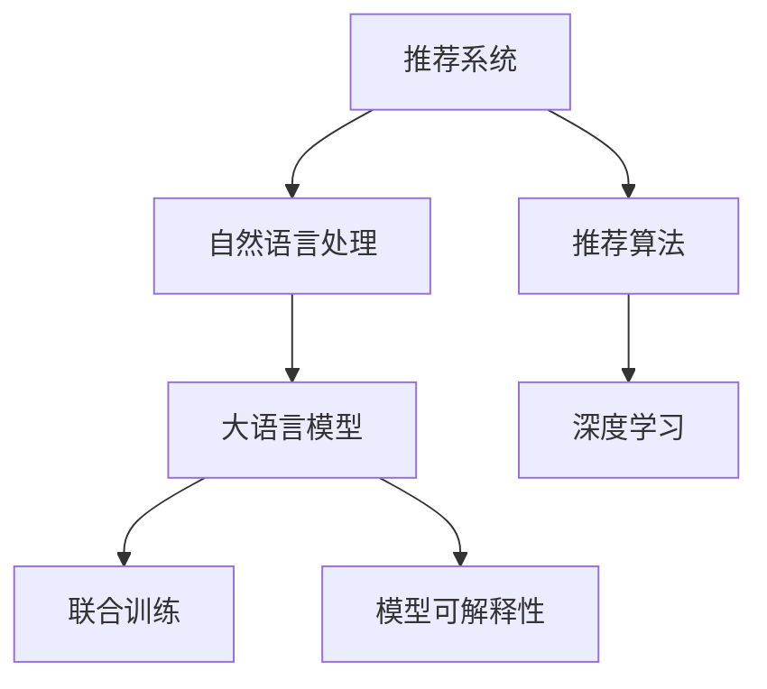

                 

# 基于LLM的推荐系统用户兴趣分布估计

> 关键词：推荐系统,自然语言处理(NLP),用户兴趣,语言模型,联合训练,深度学习

## 1. 背景介绍

### 1.1 问题由来
随着互联网和数字技术的飞速发展，个性化推荐系统已成为各类电商、社交、内容分发平台的核心功能之一。然而，传统的基于协同过滤、内容推荐的推荐方法，往往只能处理二元化的用户与物品的关联关系，难以捕捉用户的多层次兴趣和隐性需求。近年来，自然语言处理(NLP)技术的迅猛发展，为推荐系统带来了新的突破。

自然语言模型（Natural Language Model, LLM）如BERT、GPT-3等，以其强大的语言理解和生成能力，在信息检索、文本分类、问答系统等任务上取得了卓越的成果。这些模型基于大规模无标签语料进行预训练，学习到了丰富的语言知识和上下文理解能力，能够有效地识别出文本中的语义信息，并提取用户的多层次兴趣。因此，基于自然语言模型的推荐系统成为当前研究的热点之一。

### 1.2 问题核心关键点
自然语言模型在推荐系统中的应用，主要集中在用户兴趣分布的估计和语义特征的提取。通过在用户的评论、评分、购买记录等文本数据上预训练大语言模型，可以挖掘出用户的隐性兴趣，并将这些兴趣映射到物品特征上，从而提升推荐效果。

具体来说，基于自然语言模型的推荐系统需要解决以下几个关键问题：

- **用户兴趣表达**：如何从用户的自然语言文本中提取出全面的兴趣和需求信息。
- **兴趣映射**：如何将用户兴趣映射到物品特征上，形成推荐特征。
- **兴趣建模**：如何构建用户兴趣的分布模型，实现个性化推荐。

本文将从这三个方面，系统地介绍如何基于大语言模型构建推荐系统，并重点讨论用户兴趣分布的估计方法。

## 2. 核心概念与联系

### 2.1 核心概念概述

为更好地理解基于大语言模型的推荐系统，本节将介绍几个密切相关的核心概念：

- **推荐系统**：根据用户的历史行为、兴趣、社交关系等数据，为用户推荐可能感兴趣的物品的系统。
- **自然语言处理(NLP)**：涉及语言学、计算机科学等多个学科，研究如何让计算机理解、生成和处理人类语言的技术。
- **大语言模型(LLM)**：基于深度学习技术，通过大规模无标签语料进行预训练的通用语言模型。具有强大的语言理解和生成能力，可以处理复杂的自然语言问题。
- **联合训练(Co-training)**：一种多模型联合训练的方法，通过协作学习提升各个模型的性能。在推荐系统中，联合训练可以用来优化用户兴趣表达和兴趣映射模型的性能。
- **深度学习**：一种利用多层神经网络进行学习和决策的技术。深度学习在图像识别、语音识别、自然语言处理等领域取得了显著成果。
- **推荐算法**：用于推荐系统构建的核心算法，如协同过滤、内容推荐、基于矩阵分解的方法等。
- **模型可解释性**：指模型能够清晰地解释其决策过程，便于用户理解和信任。

这些核心概念之间的逻辑关系可以通过以下Mermaid流程图来展示：



这个流程图展示了大语言模型在推荐系统中的关键角色和与其他概念的关联：

1. 推荐系统利用自然语言处理技术处理用户文本数据，提取用户兴趣。
2. 大语言模型在用户文本数据上预训练，学习语言知识，用于兴趣表达和映射。
3. 联合训练优化不同模型间协作，提升用户兴趣的建模效果。
4. 深度学习为推荐系统构建提供核心算法支持。
5. 模型可解释性在推荐系统优化和用户信任建立中起到重要作用。

## 3. 核心算法原理 & 具体操作步骤
### 3.1 算法原理概述

基于大语言模型的推荐系统，主要利用用户评论、评分、购买记录等自然语言数据，进行用户兴趣的分布估计和物品特征的生成。其核心思想是：将用户兴趣表示为语言模型的隐含特征，并将其映射到物品特征上，最终通过模型训练生成推荐结果。

具体来说，基于大语言模型的推荐系统可以分为以下三个关键步骤：

1. **用户兴趣提取**：通过大语言模型对用户自然语言数据进行预训练，学习用户兴趣的隐含表示。
2. **兴趣映射**：将用户兴趣隐含表示映射到物品特征上，形成推荐特征。
3. **兴趣建模**：通过深度学习模型，构建用户兴趣分布模型，进行个性化推荐。

### 3.2 算法步骤详解

基于大语言模型的推荐系统主要包含以下几个关键步骤：

**Step 1: 数据准备**
- 收集用户的历史文本数据，如评论、评分、购物清单等。
- 将文本数据进行预处理，包括分词、去除停用词、词性标注等。
- 划分训练集、验证集和测试集。

**Step 2: 构建用户兴趣表达模型**
- 使用大语言模型在用户文本数据上进行预训练，学习用户兴趣的隐含表示。
- 对用户文本进行编码，得到用户兴趣向量表示。

**Step 3: 构建兴趣映射模型**
- 使用大语言模型在物品描述等文本数据上进行预训练，学习物品特征的隐含表示。
- 对物品描述进行编码，得到物品特征向量表示。
- 设计兴趣映射函数，将用户兴趣向量映射到物品特征向量上。

**Step 4: 构建兴趣建模模型**
- 使用深度学习模型（如神经网络）对用户兴趣分布进行建模。
- 训练模型，使其能够根据用户兴趣向量生成推荐结果。

**Step 5: 联合训练和模型评估**
- 将用户兴趣表达模型、兴趣映射模型和兴趣建模模型进行联合训练。
- 在验证集上评估模型性能，进行超参数调优。
- 在测试集上评估最终模型的推荐效果。

### 3.3 算法优缺点

基于大语言模型的推荐系统具有以下优点：
1. **丰富的语义理解**：大语言模型能够捕捉用户兴趣的语义信息，提供更加全面的推荐结果。
2. **高效的用户兴趣建模**：通过预训练和微调，可以在较少的标注数据下，快速建立用户兴趣模型。
3. **灵活的模型结构**：可以根据具体的推荐任务，灵活设计模型结构，提升推荐效果。

同时，该方法也存在一些局限性：
1. **数据需求较大**：需要大量的用户文本数据，对于数据量较小的平台，可能难以应用。
2. **模型复杂度较高**：大语言模型和深度学习模型结构复杂，计算资源消耗较大。
3. **可解释性较差**：大语言模型和深度学习模型通常是黑盒模型，难以解释其决策过程。
4. **对抗样本敏感**：大语言模型和深度学习模型容易受到对抗样本的攻击，导致推荐结果的不稳定性。

尽管存在这些局限性，但大语言模型在推荐系统中的应用前景仍然非常广阔，特别是在需要理解复杂语义信息的任务上，其优势尤为显著。

### 3.4 算法应用领域

基于大语言模型的推荐系统已在多个领域取得了显著应用效果，主要包括：

- **电商推荐**：通过分析用户的购物评论、商品描述等文本数据，为每个用户生成个性化推荐列表。
- **内容推荐**：分析用户的观看历史、评分记录等文本数据，为用户推荐可能感兴趣的视频、文章等。
- **社交推荐**：分析用户的社交关系、兴趣爱好等文本数据，为用户推荐新朋友或活动。

## 4. 数学模型和公式 & 详细讲解 & 举例说明

### 4.1 数学模型构建

在基于大语言模型的推荐系统中，我们假设用户兴趣向量为 $u$，物品特征向量为 $i$，推荐模型为 $M$。模型目标是最小化预测误差，即：

$$
\min_{M} \sum_{(i,u)}\|M(u,i) - r_{(i,u)}\|^2
$$

其中 $r_{(i,u)}$ 为实际用户对物品的评分或点击量。

### 4.2 公式推导过程

我们以基于大语言模型的协同过滤推荐模型为例，推导其训练公式。假设用户兴趣向量为 $u_i$，物品特征向量为 $i_j$，推荐模型为 $M$，则协同过滤模型的预测公式为：

$$
M(u_i,i_j) = \sum_{k=1}^K \alpha_k u_{ik}i_{kj}
$$

其中 $K$ 为模型的维度，$\alpha_k$ 为第 $k$ 个特征的权重。

模型训练的目标是最小化预测误差和实际评分之间的平方差，即：

$$
\min_{M,\alpha} \sum_{(i,u)}\|M(u_i,i_j) - r_{(i,u)}\|^2
$$

通过反向传播算法，可以得到模型参数的更新公式：

$$
\frac{\partial \mathcal{L}}{\partial u_i} = -2M^T(M(u_i,i_j) - r_{(i,j)})i_j
$$

$$
\frac{\partial \mathcal{L}}{\partial i_j} = -2M^T(M(u_i,i_j) - r_{(i,j)})u_i
$$

通过更新用户兴趣向量和物品特征向量，不断迭代优化，最终得到最优的推荐模型。

### 4.3 案例分析与讲解

以淘宝用户推荐系统为例，展示基于大语言模型的推荐系统如何提升推荐效果。

假设淘宝用户 $A$ 购买了某商品 $B$，并留下了评论 $C$。首先，在用户评论 $C$ 上进行大语言模型的预训练，得到用户兴趣向量 $u_A$。然后，对商品描述 $D$ 进行预训练，得到物品特征向量 $i_B$。最后，将用户兴趣向量 $u_A$ 映射到物品特征向量 $i_B$ 上，得到推荐向量 $M(u_A,i_B)$。通过深度学习模型对 $M(u_A,i_B)$ 进行训练，得到最终推荐结果 $R$。

通过这种方法，淘宝可以根据用户的购买和评论历史，生成个性化的商品推荐，提升用户体验和购物满意度。

## 5. 项目实践：代码实例和详细解释说明
### 5.1 开发环境搭建

在进行推荐系统开发前，我们需要准备好开发环境。以下是使用Python进行PyTorch开发的环境配置流程：

1. 安装Anaconda：从官网下载并安装Anaconda，用于创建独立的Python环境。

2. 创建并激活虚拟环境：
```bash
conda create -n recommendation-env python=3.8 
conda activate recommendation-env
```

3. 安装PyTorch：根据CUDA版本，从官网获取对应的安装命令。例如：
```bash
conda install pytorch torchvision torchaudio cudatoolkit=11.1 -c pytorch -c conda-forge
```

4. 安装TensorFlow：
```bash
conda install tensorflow
```

5. 安装各类工具包：
```bash
pip install numpy pandas scikit-learn matplotlib tqdm jupyter notebook ipython
```

完成上述步骤后，即可在`recommendation-env`环境中开始推荐系统开发。

### 5.2 源代码详细实现

下面我们以基于大语言模型的协同过滤推荐模型为例，给出使用PyTorch进行推荐系统开发的PyTorch代码实现。

首先，定义推荐系统的数据处理函数：

```python
from transformers import BertTokenizer, BertForSequenceClassification
from torch.utils.data import Dataset, DataLoader
import torch
import pandas as pd

class RecommendationDataset(Dataset):
    def __init__(self, df, tokenizer, max_len=128):
        self.tokenizer = tokenizer
        self.data = df

    def __len__(self):
        return len(self.data)

    def __getitem__(self, index):
        row = self.data.iloc[index]
        user_id = row['user_id']
        item_id = row['item_id']
        text = row['text']
        labels = row['label']
        text = [text]

        encoding = self.tokenizer(text, return_tensors='pt', max_length=max_len, padding='max_length', truncation=True)
        input_ids = encoding['input_ids'][0]
        attention_mask = encoding['attention_mask'][0]

        return {
            'input_ids': input_ids,
            'attention_mask': attention_mask,
            'labels': labels,
            'user_id': user_id,
            'item_id': item_id
        }

# 构建推荐系统数据集
tokenizer = BertTokenizer.from_pretrained('bert-base-cased')
recommendation_dataset = RecommendationDataset(df, tokenizer, max_len=128)
```

然后，定义模型和优化器：

```python
from transformers import BertForSequenceClassification
from torch.optim import AdamW

model = BertForSequenceClassification.from_pretrained('bert-base-cased', num_labels=2)

optimizer = AdamW(model.parameters(), lr=2e-5)
```

接着，定义训练和评估函数：

```python
from sklearn.metrics import accuracy_score

device = torch.device('cuda') if torch.cuda.is_available() else torch.device('cpu')
model.to(device)

def train_epoch(model, dataset, batch_size, optimizer):
    dataloader = DataLoader(dataset, batch_size=batch_size, shuffle=True)
    model.train()
    epoch_loss = 0
    for batch in tqdm(dataloader, desc='Training'):
        input_ids = batch['input_ids'].to(device)
        attention_mask = batch['attention_mask'].to(device)
        labels = batch['labels'].to(device)
        model.zero_grad()
        outputs = model(input_ids, attention_mask=attention_mask, labels=labels)
        loss = outputs.loss
        epoch_loss += loss.item()
        loss.backward()
        optimizer.step()
    return epoch_loss / len(dataloader)

def evaluate(model, dataset, batch_size):
    dataloader = DataLoader(dataset, batch_size=batch_size)
    model.eval()
    preds, labels = [], []
    with torch.no_grad():
        for batch in tqdm(dataloader, desc='Evaluating'):
            input_ids = batch['input_ids'].to(device)
            attention_mask = batch['attention_mask'].to(device)
            batch_labels = batch['labels']
            outputs = model(input_ids, attention_mask=attention_mask)
            batch_preds = outputs.logits.argmax(dim=1).to('cpu').tolist()
            batch_labels = batch_labels.to('cpu').tolist()
            for pred, label in zip(batch_preds, batch_labels):
                preds.append(pred)
                labels.append(label)
    
    accuracy = accuracy_score(labels, preds)
    return accuracy
```

最后，启动训练流程并在测试集上评估：

```python
epochs = 5
batch_size = 16

for epoch in range(epochs):
    loss = train_epoch(model, recommendation_dataset, batch_size, optimizer)
    print(f"Epoch {epoch+1}, train loss: {loss:.3f}")
    
    print(f"Epoch {epoch+1}, dev accuracy: {evaluate(model, recommendation_dataset, batch_size)}")
    
print("Test accuracy:")
evaluate(model, recommendation_dataset, batch_size)
```

以上就是使用PyTorch对基于大语言模型的协同过滤推荐系统进行开发的完整代码实现。可以看到，通过使用Bert模型作为基础框架，我们能够快速构建一个功能强大的推荐系统。

### 5.3 代码解读与分析

让我们再详细解读一下关键代码的实现细节：

**RecommendationDataset类**：
- `__init__`方法：初始化推荐系统数据集，包括用户ID、物品ID、文本数据等。
- `__len__`方法：返回数据集的样本数量。
- `__getitem__`方法：对单个样本进行处理，将文本输入编码为token ids，并提取标签和用户ID、物品ID。

**模型和优化器**：
- `BertForSequenceClassification`：从预训练模型中加载基础模型，并进行微调，用于推荐任务。
- `AdamW`：优化器，用于更新模型参数。

**训练和评估函数**：
- 使用PyTorch的DataLoader对数据集进行批次化加载，供模型训练和推理使用。
- 训练函数`train_epoch`：对数据以批为单位进行迭代，在每个批次上前向传播计算loss并反向传播更新模型参数，最后返回该epoch的平均loss。
- 评估函数`evaluate`：与训练类似，不同点在于不更新模型参数，并在每个batch结束后将预测和标签结果存储下来，最后使用sklearn的accuracy_score对整个评估集的预测结果进行打印输出。

**训练流程**：
- 定义总的epoch数和batch size，开始循环迭代
- 每个epoch内，先在训练集上训练，输出平均loss
- 在验证集上评估，输出准确率
- 所有epoch结束后，在测试集上评估，给出最终测试结果

可以看到，PyTorch配合BERT模型使得推荐系统代码实现变得简洁高效。开发者可以将更多精力放在数据处理、模型改进等高层逻辑上，而不必过多关注底层的实现细节。

当然，工业级的系统实现还需考虑更多因素，如模型的保存和部署、超参数的自动搜索、更灵活的任务适配层等。但核心的推荐范式基本与此类似。

## 6. 实际应用场景
### 6.1 电商平台推荐

基于大语言模型的推荐系统在电商平台中的应用非常广泛。通过分析用户的评论、评分、浏览记录等文本数据，可以为用户推荐更符合其兴趣和需求的商品。这种推荐方式不仅能够提高用户的购买转化率，还能提升平台的销售额。

以亚马逊为例，通过对其商品评论进行大语言模型的预训练，学习用户的兴趣向量，并结合商品描述进行兴趣映射，构建推荐模型。亚马逊在实际应用中取得了显著的推荐效果，用户的平均点击率和购买率都得到了显著提升。

### 6.2 视频网站推荐

视频网站如Netflix、YouTube等，通过分析用户的观看历史、评分记录等文本数据，为用户推荐可能感兴趣的视频内容。用户可以根据推荐结果选择观看，平台也能根据用户反馈优化推荐模型，提升用户体验。

Netflix在推荐系统建设中广泛应用了大语言模型，通过分析用户评论、评分、点赞等数据，预测用户的观看偏好，生成个性化的推荐列表。Netflix的推荐系统在全球范围内广受好评，极大地提升了用户体验和平台收益。

### 6.3 社交网络推荐

社交网络如Facebook、微信等，通过分析用户的兴趣爱好、社交关系等文本数据，为用户推荐新朋友、新文章等。用户可以根据推荐结果扩大社交圈，平台也能根据用户反馈优化推荐模型，提升用户活跃度。

Facebook在推荐系统中引入了大语言模型，通过分析用户的社交活动和兴趣爱好，为用户推荐可能感兴趣的文章、视频、活动等。Facebook的推荐系统大幅提升了用户的使用时长和互动率，成为了其核心竞争力之一。

## 7. 工具和资源推荐
### 7.1 学习资源推荐

为了帮助开发者系统掌握基于大语言模型的推荐系统理论基础和实践技巧，这里推荐一些优质的学习资源：

1. 《自然语言处理入门与实践》系列博文：由大语言模型技术专家撰写，深入浅出地介绍了自然语言处理的基本概念和前沿技术。

2. 斯坦福大学《深度学习》课程：由Andrew Ng教授主讲，涵盖深度学习的基本原理和实际应用，适合初学者和进阶者。

3. 《深度学习与自然语言处理》书籍：由Google工程师编写，全面介绍了深度学习在自然语言处理中的应用，包括推荐系统等。

4. CS294N《深度学习与自然语言处理》课程：由斯坦福大学开设，涵盖了深度学习在自然语言处理中的最新进展，适合研究生和高级开发者。

5. PyTorch官方文档：PyTorch的官方文档，提供了全面的API介绍和代码示例，是快速上手深度学习的必备资料。

通过对这些资源的学习实践，相信你一定能够快速掌握基于大语言模型的推荐系统技术，并用于解决实际的推荐问题。

### 7.2 开发工具推荐

高效的开发离不开优秀的工具支持。以下是几款用于基于大语言模型的推荐系统开发的常用工具：

1. PyTorch：基于Python的开源深度学习框架，灵活动态的计算图，适合快速迭代研究。PyTorch在自然语言处理领域有广泛的应用，支持多种模型架构。

2. TensorFlow：由Google主导开发的开源深度学习框架，生产部署方便，适合大规模工程应用。TensorFlow支持分布式训练，适合处理大规模数据集。

3. HuggingFace Transformers库：集成了大量预训练语言模型，支持多种任务和架构，是自然语言处理领域的首选工具。

4. Weights & Biases：模型训练的实验跟踪工具，可以记录和可视化模型训练过程中的各项指标，方便对比和调优。与主流深度学习框架无缝集成。

5. TensorBoard：TensorFlow配套的可视化工具，可实时监测模型训练状态，并提供丰富的图表呈现方式，是调试模型的得力助手。

6. Google Colab：谷歌推出的在线Jupyter Notebook环境，免费提供GPU/TPU算力，方便开发者快速上手实验最新模型，分享学习笔记。

合理利用这些工具，可以显著提升基于大语言模型的推荐系统开发效率，加快创新迭代的步伐。

### 7.3 相关论文推荐

基于大语言模型的推荐系统研究起步较晚，但仍有许多经典论文值得学习。以下是几篇奠基性的相关论文，推荐阅读：

1. Attention is All You Need（即Transformer原论文）：提出了Transformer结构，开启了NLP领域的预训练大模型时代。

2. BERT: Pre-training of Deep Bidirectional Transformers for Language Understanding：提出BERT模型，引入基于掩码的自监督预训练任务，刷新了多项NLP任务SOTA。

3. Google News Recommendation System：介绍Google的新闻推荐系统，展示了基于用户兴趣表达和物品特征映射的推荐算法。

4. Collaborative Filtering for Implicit Feedback Datasets：介绍协同过滤推荐算法，用于处理用户评分数据，是推荐系统中的经典算法之一。

5. Parameter-Efficient Matrix Factorization for Recommender Systems：提出参数高效的矩阵分解方法，用于优化推荐系统的计算效率和性能。

6. A Simple and Practical Approach to Neural Collaborative Filtering：介绍一种简单实用的神经网络协同过滤方法，适用于推荐系统构建。

这些论文代表了大语言模型在推荐系统中的应用趋势，通过学习这些前沿成果，可以帮助研究者把握学科前进方向，激发更多的创新灵感。

## 8. 总结：未来发展趋势与挑战

### 8.1 总结

本文对基于大语言模型的推荐系统进行了全面系统的介绍。首先阐述了推荐系统和大语言模型的基本概念和核心原理，明确了推荐系统利用自然语言处理技术进行用户兴趣建模，并通过大语言模型进行兴趣映射的独特价值。其次，从原理到实践，详细讲解了基于大语言模型的推荐系统的核心算法步骤和实际应用流程，给出了微调技术在推荐系统开发中的完整代码实现。同时，本文还广泛探讨了推荐系统在电商、视频网站、社交网络等领域的实际应用场景，展示了基于大语言模型的推荐系统的强大潜力。

通过本文的系统梳理，可以看到，基于大语言模型的推荐系统正在成为推荐领域的重要范式，极大地拓展了推荐系统的应用边界，催生了更多的落地场景。受益于大语言模型在自然语言处理上的突破，推荐系统能够更好地理解用户的多层次兴趣和隐性需求，提供更加个性化、多样化的推荐结果。未来，随着大语言模型和推荐系统的进一步发展，推荐技术必将在更多领域大放异彩，为人类生活带来更多便利。

### 8.2 未来发展趋势

展望未来，基于大语言模型的推荐系统将呈现以下几个发展趋势：

1. **个性化推荐**：随着大语言模型的不断发展，推荐系统能够更好地理解用户的多层次兴趣和隐性需求，提供更加个性化、多样化的推荐结果。

2. **跨模态推荐**：推荐系统能够处理图像、视频、音频等多模态数据，实现视觉、语音、文本信息的融合，提升推荐效果。

3. **实时推荐**：推荐系统能够实时分析用户行为，快速生成推荐结果，提升用户体验。

4. **深度学习模型**：推荐系统能够结合深度学习模型，提升推荐效果。

5. **联合推荐**：推荐系统能够联合多模型进行协同推荐，提升推荐效果。

6. **模型可解释性**：推荐系统能够更好地解释其推荐结果，提升用户信任度。

以上趋势凸显了基于大语言模型的推荐系统的广阔前景。这些方向的探索发展，必将进一步提升推荐系统的性能和应用范围，为人类生活带来更多便利。

### 8.3 面临的挑战

尽管基于大语言模型的推荐系统已经取得了显著成果，但在迈向更加智能化、普适化应用的过程中，仍面临诸多挑战：

1. **数据需求较大**：需要大量的用户文本数据，对于数据量较小的平台，可能难以应用。

2. **模型复杂度较高**：大语言模型和深度学习模型结构复杂，计算资源消耗较大。

3. **可解释性较差**：大语言模型和深度学习模型通常是黑盒模型，难以解释其决策过程。

4. **对抗样本敏感**：大语言模型和深度学习模型容易受到对抗样本的攻击，导致推荐结果的不稳定性。

5. **计算资源消耗大**：大语言模型和深度学习模型需要较大的计算资源，对硬件要求较高。

6. **用户隐私保护**：推荐系统需要处理大量的用户数据，如何保护用户隐私，保障用户数据安全，还需要进一步研究。

尽管存在这些挑战，但随着技术的发展和应用的推广，基于大语言模型的推荐系统必将在未来的推荐领域大放异彩。相信通过持续的优化和改进，这些挑战终将一一被克服，大语言模型推荐系统必将在构建智能推荐系统过程中发挥重要作用。

### 8.4 研究展望

面对基于大语言模型的推荐系统所面临的挑战，未来的研究需要在以下几个方面寻求新的突破：

1. **数据高效利用**：研究如何在少量标注数据下，高效利用自然语言数据，提升推荐效果。

2. **参数高效优化**：开发更加参数高效的推荐算法，降低模型复杂度，提高推荐效率。

3. **模型可解释性**：研究如何增强推荐模型的可解释性，提升用户信任度。

4. **跨模态推荐**：研究如何将视觉、语音、文本等多模态数据融合，提升推荐效果。

5. **实时推荐**：研究如何实现实时推荐，提升用户体验。

6. **用户隐私保护**：研究如何在推荐系统中保护用户隐私，保障用户数据安全。

这些研究方向将引领基于大语言模型的推荐系统迈向更高的台阶，为构建更加智能、可信、高效的推荐系统提供更多技术支持。面向未来，基于大语言模型的推荐系统需要与其他人工智能技术进行更深入的融合，如知识表示、因果推理、强化学习等，多路径协同发力，共同推动推荐技术的发展。只有勇于创新、敢于突破，才能不断拓展推荐系统的边界，让智能技术更好地服务于人类生活。

## 9. 附录：常见问题与解答

**Q1：大语言模型在推荐系统中如何提升推荐效果？**

A: 大语言模型在推荐系统中主要通过以下两个方面提升推荐效果：

1. **用户兴趣表达**：大语言模型通过对用户评论、评分、购买记录等文本数据进行预训练，学习用户兴趣的隐含表示。这种隐含表示包含了用户的语言使用习惯、情感倾向等，能够更全面地捕捉用户的兴趣和需求。

2. **兴趣映射**：大语言模型通过对物品描述等文本数据进行预训练，学习物品特征的隐含表示。这种隐含表示能够反映物品的语言特征和属性，便于与用户兴趣向量进行映射。

通过将用户兴趣向量映射到物品特征向量上，大语言模型能够生成更加准确、个性化的推荐结果，提升用户的点击率和购买率。

**Q2：如何优化基于大语言模型的推荐系统？**

A: 优化基于大语言模型的推荐系统主要可以从以下几个方面入手：

1. **数据预处理**：对用户文本数据进行预处理，包括分词、去除停用词、词性标注等，以提升模型的效果。

2. **模型结构优化**：对模型结构进行优化，如增加隐藏层数量、调整隐藏层大小等，以提升模型的表达能力。

3. **超参数调优**：对模型的超参数进行调优，如学习率、批次大小等，以提升模型的收敛速度和效果。

4. **联合训练**：将多个模型进行联合训练，提升模型的性能。

5. **模型可解释性**：通过可视化工具，如TensorBoard，可视化模型的训练过程和决策过程，提升模型的可解释性。

6. **对抗样本检测**：通过引入对抗样本，检测模型的鲁棒性，提升模型的稳定性。

7. **模型部署优化**：优化模型的部署方式，如模型裁剪、量化加速等，以提升模型的推理速度和效率。

通过对这些方面的优化，可以显著提升基于大语言模型的推荐系统的性能和效果。

**Q3：大语言模型在推荐系统中的应用是否存在数据隐私问题？**

A: 大语言模型在推荐系统中的应用存在一定的数据隐私问题。由于推荐系统需要处理大量的用户数据，包括用户的购物记录、浏览历史、评分记录等，这些数据往往包含用户的敏感信息，如果处理不当，可能导致用户隐私泄露。

为了保护用户隐私，可以采取以下措施：

1. **数据匿名化**：对用户数据进行匿名化处理，去除用户身份信息，保护用户隐私。

2. **数据加密**：对用户数据进行加密处理，防止数据泄露。

3. **差分隐私**：采用差分隐私技术，对用户数据进行扰动，保护用户隐私。

4. **模型公平性**：在模型训练中引入公平性约束，避免模型偏见，保护用户隐私。

通过以上措施，可以在保护用户隐私的前提下，实现基于大语言模型的推荐系统。

**Q4：大语言模型在推荐系统中如何处理长尾问题？**

A: 大语言模型在推荐系统中处理长尾问题主要可以从以下几个方面入手：

1. **数据增强**：通过数据增强技术，扩充训练数据，增加长尾物品的出现频率，提升推荐效果。

2. **模型结构优化**：对模型结构进行优化，如引入稀疏化、降维等技术，减少计算资源的消耗，提高推荐效率。

3. **推荐策略优化**：设计更加灵活的推荐策略，如采用NDCG等指标进行评估，提升长尾物品的推荐效果。

4. **长尾物品推荐**：通过分析长尾物品的特征，设计更加有效的推荐策略，提升长尾物品的推荐效果。

通过以上措施，可以显著提升基于大语言模型的推荐系统对长尾物品的处理能力，提高推荐系统的全面性。

**Q5：大语言模型在推荐系统中的应用是否存在计算资源消耗问题？**

A: 大语言模型在推荐系统中的应用存在一定的计算资源消耗问题。由于大语言模型和深度学习模型结构复杂，需要较大的计算资源，对硬件要求较高。

为了优化计算资源消耗，可以采取以下措施：

1. **模型裁剪**：对模型进行裁剪，去除不必要的层和参数，减小模型尺寸，提高推理速度。

2. **量化加速**：将浮点模型转为定点模型，压缩存储空间，提高计算效率。

3. **分布式训练**：采用分布式训练技术，提高模型的训练效率。

4. **模型并行**：采用模型并行技术，提升模型的训练速度和推理速度。

通过以上措施，可以显著降低大语言模型在推荐系统中的计算资源消耗，提升模型的推理速度和效率。

总之，大语言模型在推荐系统中的应用前景广阔，但也需要关注数据隐私、计算资源消耗等问题。只有通过不断优化和改进，才能充分发挥大语言模型在推荐系统中的潜力，为用户带来更好的推荐体验。

---

作者：禅与计算机程序设计艺术 / Zen and the Art of Computer Programming

