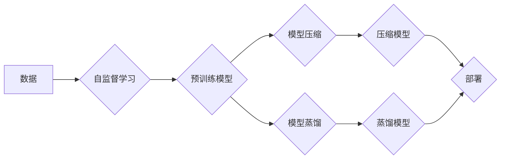

                 

## 自监督学习的应用实践:模型压缩和模型蒸馏

> 关键词：自监督学习、模型压缩、模型蒸馏、知识蒸馏、深度学习、神经网络

## 1. 背景介绍

深度学习模型在图像识别、自然语言处理等领域取得了令人瞩目的成就。然而，这些模型通常体积庞大，计算资源消耗巨大，难以部署在资源受限的设备上。因此，模型压缩和模型蒸馏成为深度学习领域的重要研究方向，旨在减小模型规模，提高模型效率，同时保持模型性能。

自监督学习 (Self-Supervised Learning) 是一种无需人工标注数据就能训练模型的学习方式。它通过设计特殊的预训练任务，利用数据的内在结构和模式进行学习，从而获得强大的表示能力。自监督学习在模型压缩和模型蒸馏中发挥着越来越重要的作用。

## 2. 核心概念与联系

### 2.1 模型压缩

模型压缩是指通过各种技术手段减小深度学习模型的规模，例如减少模型参数数量、降低模型层数、量化模型权重等。

### 2.2 模型蒸馏

模型蒸馏是一种知识迁移技术，通过训练一个小的“学生模型”来模仿一个大的“教师模型”的输出结果，从而实现模型压缩。

### 2.3 自监督学习与模型压缩/蒸馏的联系

自监督学习可以为模型压缩和蒸馏提供强大的预训练模型，这些预训练模型已经学习了数据的丰富特征和模式，可以作为学生模型的初始参数，加速模型训练，提高模型性能。

**Mermaid 流程图**



## 3. 核心算法原理 & 具体操作步骤

### 3.1 算法原理概述

自监督学习的模型压缩和蒸馏主要基于以下原理：

* **特征提取:** 自监督学习预训练模型学习了数据的低层和高层特征，这些特征可以用于压缩和蒸馏。
* **知识迁移:** 蒸馏模型通过模仿教师模型的输出结果，学习到教师模型的知识，从而实现模型压缩。
* **参数量化:** 模型压缩可以通过量化模型权重，减少模型参数数量，从而减小模型规模。

### 3.2 算法步骤详解

**模型压缩:**

1. 使用自监督学习预训练模型进行特征提取。
2. 选择合适的压缩方法，例如剪枝、量化、知识蒸馏等。
3. 对预训练模型进行压缩，减小模型规模。
4. 对压缩后的模型进行微调，恢复模型性能。

**模型蒸馏:**

1. 使用自监督学习预训练模型作为教师模型。
2. 训练一个小的学生模型，模仿教师模型的输出结果。
3. 使用交叉熵损失函数，将学生模型的输出与教师模型的输出进行比较。
4. 通过反向传播算法，更新学生模型的参数。
5. 对蒸馏后的模型进行微调，提高模型性能。

### 3.3 算法优缺点

**模型压缩:**

* **优点:** 可以显著减小模型规模，降低计算资源消耗，提高模型部署效率。
* **缺点:** 压缩过程可能会导致模型性能下降，需要进行微调才能恢复性能。

**模型蒸馏:**

* **优点:** 可以有效地将教师模型的知识迁移到学生模型，提高学生模型的性能，同时减小模型规模。
* **缺点:** 需要一个大的教师模型作为基础，训练过程相对复杂。

### 3.4 算法应用领域

自监督学习的模型压缩和蒸馏技术广泛应用于以下领域：

* **移动设备:** 将大型深度学习模型压缩到移动设备上，实现高效的语音识别、图像识别等功能。
* **嵌入式系统:** 将深度学习模型部署到资源受限的嵌入式系统上，实现智能控制、物联网等应用。
* **边缘计算:** 将深度学习模型部署到边缘设备上，实现实时数据处理和决策。

## 4. 数学模型和公式 & 详细讲解 & 举例说明

### 4.1 数学模型构建

**模型蒸馏:**

假设教师模型的输出为 $T(x)$, 学生模型的输出为 $S(x)$, 则蒸馏损失函数可以定义为：

$$
L_{distillation} = KL(S(x) || T(x))
$$

其中，$KL$ 表示KL散度，衡量两个概率分布之间的差异。

**模型压缩:**

模型压缩的数学模型通常涉及到模型参数的量化、剪枝等操作。

### 4.2 公式推导过程

**蒸馏损失函数推导:**

蒸馏损失函数的目的是让学生模型的输出分布尽可能接近教师模型的输出分布。KL散度可以衡量两个概率分布之间的差异，因此使用KL散度作为蒸馏损失函数是合理的。

**模型压缩公式推导:**

模型压缩的具体公式推导取决于具体的压缩方法。例如，量化模型权重可以使用最小二乘法或均方误差法进行优化。

### 4.3 案例分析与讲解

**案例分析:**

在图像分类任务中，可以使用自监督学习预训练模型作为教师模型，训练一个小型学生模型进行蒸馏。通过蒸馏，可以将教师模型的知识迁移到学生模型，从而实现模型压缩和性能提升。

**讲解:**

自监督学习预训练模型已经学习了大量的图像特征，这些特征可以帮助学生模型更快地学习图像分类任务。蒸馏过程可以看作是将教师模型的知识“注入”到学生模型中，从而提高学生模型的性能。

## 5. 项目实践：代码实例和详细解释说明

### 5.1 开发环境搭建

* Python 3.6+
* PyTorch 1.0+
* CUDA 10.0+

### 5.2 源代码详细实现

```python
# 模型蒸馏代码示例

import torch
import torch.nn as nn

# 定义教师模型
class TeacherModel(nn.Module):
    # ...

# 定义学生模型
class StudentModel(nn.Module):
    # ...

# 加载预训练的教师模型
teacher_model = TeacherModel()
teacher_model.load_state_dict(torch.load('teacher_model.pth'))

# 实例化学生模型
student_model = StudentModel()

# 定义蒸馏损失函数
criterion = nn.KLDivLoss(reduction='batchmean')

# 训练学生模型
optimizer = torch.optim.Adam(student_model.parameters(), lr=0.001)
for epoch in range(num_epochs):
    for data, target in train_loader:
        # 前向传播
        teacher_output = teacher_model(data)
        student_output = student_model(data)

        # 计算蒸馏损失
        loss = criterion(student_output, teacher_output)

        # 反向传播
        optimizer.zero_grad()
        loss.backward()
        optimizer.step()

# 保存学生模型
torch.save(student_model.state_dict(), 'student_model.pth')
```

### 5.3 代码解读与分析

* 代码首先定义了教师模型和学生模型。
* 然后加载预训练的教师模型权重。
* 定义蒸馏损失函数，并使用Adam优化器训练学生模型。
* 训练过程中，将教师模型的输出作为目标，让学生模型的输出尽可能接近教师模型的输出。
* 最后保存训练好的学生模型权重。

### 5.4 运行结果展示

训练完成后，可以将学生模型部署到实际应用场景中，并评估其性能。

## 6. 实际应用场景

### 6.1 语音识别

将大型语音识别模型压缩到移动设备上，实现离线语音识别功能。

### 6.2 图像识别

将图像识别模型部署到嵌入式系统上，实现智能监控、安防等应用。

### 6.3 自然语言处理

将自然语言处理模型压缩到资源受限的设备上，实现智能客服、机器翻译等应用。

### 6.4 未来应用展望

随着自监督学习技术的不断发展，模型压缩和蒸馏技术将应用于更多领域，例如：

* **自动驾驶:** 将深度学习模型压缩到汽车上，实现实时路况感知和决策。
* **医疗诊断:** 将医学图像识别模型部署到医疗设备上，辅助医生进行诊断。
* **个性化推荐:** 将推荐模型压缩到用户设备上，实现个性化商品推荐。

## 7. 工具和资源推荐

### 7.1 学习资源推荐

* **书籍:**
    * 《深度学习》 - Ian Goodfellow, Yoshua Bengio, Aaron Courville
    * 《动手学深度学习》 -  李沐
* **论文:**
    * 《Distilling the Knowledge in a Neural Network》
    * 《Lottery Ticket Hypothesis: Finding Sparse, Trainable Neural Networks》

### 7.2 开发工具推荐

* **PyTorch:** 深度学习框架
* **TensorFlow:** 深度学习框架
* **ONNX:** 开放神经网络交换格式

### 7.3 相关论文推荐

* 《MobileNetV3: Architecting Efficient Convolutional Neural Networks for Mobile Vision Applications》
* 《EfficientNet: Rethinking Model Scaling for Convolutional Neural Networks》
* 《Squeeze-and-Excitation Networks》

## 8. 总结：未来发展趋势与挑战

### 8.1 研究成果总结

自监督学习的模型压缩和蒸馏技术取得了显著进展，能够有效地减小模型规模，提高模型效率，同时保持模型性能。

### 8.2 未来发展趋势

* **更有效的压缩方法:** 研究更有效的模型压缩方法，例如基于神经网络的压缩方法、动态压缩方法等。
* **更强大的自监督学习预训练模型:** 训练更强大的自监督学习预训练模型，例如使用更大的数据集、更复杂的模型架构等。
* **模型压缩与蒸馏的结合:** 将模型压缩和蒸馏技术结合起来，实现更有效的模型压缩和性能提升。

### 8.3 面临的挑战

* **压缩后的模型性能:** 压缩过程可能会导致模型性能下降，需要进一步研究如何提高压缩后的模型性能。
* **模型可解释性:** 压缩后的模型可能难以解释，需要研究如何提高模型可解释性。
* **硬件平台限制:** 某些硬件平台可能无法支持压缩后的模型，需要研究如何针对不同硬件平台进行模型优化。

### 8.4 研究展望

未来，自监督学习的模型压缩和蒸馏技术将继续发展，为深度学习的广泛应用提供更有效的解决方案。


## 9. 附录：常见问题与解答

**常见问题:**

* **模型压缩和蒸馏有什么区别？**

模型压缩是指减小模型规模，而模型蒸馏是指通过模仿教师模型的输出结果来训练学生模型，从而实现模型压缩和性能提升。

* **自监督学习的预训练模型如何获取？**

许多开源平台提供自监督学习预训练模型，例如HuggingFace、TensorFlow Hub等。

* **如何选择合适的模型压缩方法？**

选择合适的模型压缩方法取决于具体的应用场景和模型架构。

**解答:**

* 模型压缩和蒸馏都是为了减小模型规模，但它们的方法不同。模型压缩直接减小模型参数数量，而模型蒸馏通过模仿教师模型的输出结果来训练学生模型。
* 自监督学习预训练模型可以通过开源平台获取。
* 选择合适的模型压缩方法需要考虑模型架构、应用场景、性能要求等因素。


作者：禅与计算机程序设计艺术 / Zen and the Art of Computer Programming 
<end_of_turn>

