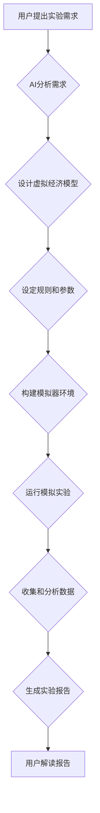

                 

## 虚拟经济模拟器程序员：AI驱动的新型价值交换实验设计师

> 关键词：虚拟经济、AI驱动的模拟、价值交换、实验设计、算法、数学模型、代码实现、应用场景

## 1. 背景介绍

随着人工智能技术的飞速发展，我们正处于一个全新的时代。AI已经开始渗透到各个领域，从医疗保健到金融，从交通运输到娱乐，无处不在。其中，AI驱动的虚拟经济模拟器作为一种强大的工具，为我们提供了探索经济学原理、测试商业策略和预测市场趋势的独特机会。

传统经济学研究往往依赖于理论模型和实地观察，但这些方法存在局限性。理论模型过于抽象，难以完全反映现实经济的复杂性；实地观察则受限于时间、成本和数据获取等因素。而虚拟经济模拟器则可以克服这些局限性，提供一个安全、可控和可重复的实验环境。

## 2. 核心概念与联系

**2.1 虚拟经济模拟器**

虚拟经济模拟器是一种计算机程序，旨在模拟现实经济系统中各种经济行为和相互作用。它可以包含各种经济主体，例如消费者、企业、政府等，以及各种经济要素，例如商品、服务、资金、资源等。通过设定不同的规则和参数，模拟器可以模拟各种不同的经济场景，例如市场竞争、政策影响、经济危机等。

**2.2 AI驱动的价值交换**

AI驱动的价值交换是指利用人工智能技术来优化和自动化价值交换过程。在虚拟经济模拟器中，AI可以扮演各种角色，例如智能代理、交易平台、市场预测引擎等。AI可以根据预设的目标和规则，自主决策、执行交易、调整策略，从而实现更加高效、智能和动态的价值交换。

**2.3 实验设计**

实验设计是虚拟经济模拟器中至关重要的环节。通过精心设计的实验，我们可以测试不同的假设、比较不同的策略、分析不同的结果，从而深入理解经济学原理和市场行为。

**2.4 流程图**



## 3. 核心算法原理 & 具体操作步骤

**3.1 算法原理概述**

虚拟经济模拟器的核心算法通常基于以下几个方面：

* **智能代理算法:** 模拟经济主体，例如消费者、企业等，赋予其决策能力和行为模式。常见的代理算法包括：
    * **有限状态机:** 根据状态和输入，执行预定义的行动。
    * **行为树:** 使用树形结构表示代理的行为决策逻辑。
    * **强化学习:** 通过奖励机制，让代理学习最优的行为策略。
* **市场机制算法:** 模拟商品、服务、资金等经济要素的供求关系，实现价格形成和资源分配。常见的市场机制算法包括：
    * **拍卖机制:** 通过竞价的方式，确定商品或服务的交易价格。
    * **双边市场机制:** 模拟买卖双方之间的博弈和协商，实现交易达成。
    * **市场预测算法:** 利用历史数据和模型预测，预测未来市场趋势和价格变化。

**3.2 算法步骤详解**

1. **初始化:** 设置虚拟经济环境，包括经济主体、经济要素、规则和参数等。
2. **模拟循环:** 按照预设的时间步长，模拟经济主体之间的交互和行为。
3. **决策执行:** 每个经济主体根据其算法和当前状态，做出决策并执行相应的行动。
4. **状态更新:** 根据决策执行的结果，更新虚拟经济环境的状态，例如商品价格、库存量、资金流等。
5. **数据收集:** 收集模拟过程中的数据，例如交易记录、价格变化、经济指标等。
6. **分析评估:** 对收集到的数据进行分析和评估，例如计算经济增长率、市场效率、风险水平等。

**3.3 算法优缺点**

* **优点:**
    * 可重复性强，可以多次运行相同的实验，确保结果的可靠性。
    * 可控性强，可以设定不同的规则和参数，模拟各种不同的经济场景。
    * 安全性高，不会对现实经济造成任何影响。
* **缺点:**
    * 模型复杂度高，需要大量的计算资源和专业知识。
    * 模型的真实性有限，难以完全模拟现实经济的复杂性。
    * 数据的准确性依赖于模型的设定和参数的调整。

**3.4 算法应用领域**

* **经济学研究:** 测试经济学理论、分析市场行为、预测经济趋势。
* **商业策略制定:** 模拟市场竞争、评估商业机会、优化运营策略。
* **政策评估:** 模拟政策影响、预测政策效果、制定最佳政策方案。
* **金融风险管理:** 模拟金融市场波动、评估风险敞口、制定风险控制策略。

## 4. 数学模型和公式 & 详细讲解 & 举例说明

**4.1 数学模型构建**

虚拟经济模拟器的数学模型通常基于微观经济学和宏观经济学理论，描述经济主体之间的交互和行为，以及经济要素的供求关系。常见的数学模型包括：

* **供求模型:** 描述商品或服务的供求关系，并预测价格变化。
* **消费者行为模型:** 描述消费者的消费决策，例如效用最大化、预算约束等。
* **企业行为模型:** 描述企业的生产决策、投资决策、价格策略等。
* **市场竞争模型:** 描述不同企业之间的竞争关系，例如寡头垄断、完美竞争等。

**4.2 公式推导过程**

例如，一个简单的供求模型可以描述为：

* **需求方程:** $Q_d = a - bP$
* **供给方程:** $Q_s = c + dP$

其中：

* $Q_d$ 是需求量
* $Q_s$ 是供给量
* $P$ 是价格
* $a$, $b$, $c$, $d$ 是模型参数

当需求量等于供给量时，市场达到均衡状态，此时价格为均衡价格，可以由以下公式计算：

* **均衡价格:** $P^* = \frac{a-c}{b+d}$

**4.3 案例分析与讲解**

假设一个虚拟经济中，某个商品的需求量随着价格下降而增加，供给量随着价格上升而增加。我们可以设定相应的模型参数，例如：

* $a = 100$
* $b = 10$
* $c = 50$
* $d = 5$

通过公式计算，可以得到该商品的均衡价格为：

* $P^* = \frac{100-50}{10+5} = 10$

这意味着，当该商品的价格为10时，市场需求量等于供给量，达到均衡状态。

## 5. 项目实践：代码实例和详细解释说明

**5.1 开发环境搭建**

虚拟经济模拟器的开发环境通常包括以下软件：

* **编程语言:** Python, Java, C++ 等
* **数据结构和算法库:** NumPy, Pandas, Scikit-learn 等
* **图形界面库:** Tkinter, PyQt, Matplotlib 等
* **虚拟机软件:** VirtualBox, VMware 等

**5.2 源代码详细实现**

以下是一个简单的Python代码示例，模拟一个简单的虚拟经济系统，其中包含两个经济主体：消费者和生产者。

```python
import random

class Consumer:
    def __init__(self, budget):
        self.budget = budget
        self.utility = 0

    def buy(self, price):
        if self.budget >= price:
            self.budget -= price
            self.utility += 1
            print(f"消费者购买商品，剩余预算为{self.budget}")
        else:
            print("消费者没有足够的预算购买商品")

class Producer:
    def __init__(self, cost):
        self.cost = cost
        self.inventory = 10

    def sell(self, price):
        if self.inventory > 0:
            self.inventory -= 1
            print(f"生产者出售商品，剩余库存为{self.inventory}")
            return price
        else:
            print("生产者没有足够的库存出售商品")

# 初始化消费者和生产者
consumer = Consumer(budget=100)
producer = Producer(cost=20)

# 模拟交易
price = random.randint(20, 30)
consumer.buy(price)
producer.sell(price)
```

**5.3 代码解读与分析**

这段代码定义了两个类：`Consumer` 和 `Producer`，分别代表消费者和生产者。每个类都有相应的属性和方法，例如消费者有预算和效用，生产者有成本和库存。

代码模拟了消费者购买商品和生产者出售商品的过程。消费者根据其预算和商品价格决定是否购买，生产者根据其库存和商品价格决定是否出售。

**5.4 运行结果展示**

运行这段代码后，会输出以下类似的日志信息：

```
消费者购买商品，剩余预算为80
生产者出售商品，剩余库存为9
```

## 6. 实际应用场景

**6.1 经济学研究**

虚拟经济模拟器可以帮助经济学家测试各种经济理论，例如供需理论、市场竞争理论、宏观经济理论等。例如，可以模拟不同类型的市场结构，例如完美竞争、垄断、寡头垄断等，并比较不同市场结构下的效率和公平性。

**6.2 商业策略制定**

企业可以使用虚拟经济模拟器来测试不同的商业策略，例如定价策略、营销策略、产品开发策略等。例如，可以模拟不同价格的商品销售情况，并分析不同价格对利润的影响。

**6.3 政策评估**

政府可以使用虚拟经济模拟器来评估不同的政策方案，例如税收政策、财政政策、货币政策等。例如，可以模拟不同税收政策对经济增长的影响，并选择最有利的政策方案。

**6.4 未来应用展望**

随着人工智能技术的不断发展，虚拟经济模拟器的应用场景将会更加广泛。例如，可以模拟更复杂的经济系统，例如全球经济、金融市场等，并预测未来的经济趋势。

## 7. 工具和资源推荐

**7.1 学习资源推荐**

* **书籍:**
    * 《经济学原理》
    * 《微观经济学》
    * 《宏观经济学》
    * 《人工智能导论》
* **在线课程:**
    * Coursera
    * edX
    * Udacity

**7.2 开发工具推荐**

* **编程语言:** Python, Java, C++
* **数据结构和算法库:** NumPy, Pandas, Scikit-learn
* **图形界面库:** Tkinter, PyQt, Matplotlib
* **虚拟机软件:** VirtualBox, VMware

**7.3 相关论文推荐**

* **Agent-Based Modeling in Economics:** https://www.sciencedirect.com/topics/computer-science/agent-based-modeling
* **Artificial Intelligence and Economics:** https://www.jstor.org/stable/43273741

## 8. 总结：未来发展趋势与挑战

**8.1 研究成果总结**

虚拟经济模拟器作为一种强大的工具，为我们提供了探索经济学原理、测试商业策略和预测市场趋势的独特机会。通过精心设计的实验，我们可以深入理解经济学原理和市场行为，并为决策提供科学依据。

**8.2 未来发展趋势**

未来，虚拟经济模拟器将会更加智能化、复杂化和个性化。

* **智能化:** 利用更先进的人工智能技术，例如深度学习、强化学习等，使模拟器能够更加智能地模拟经济主体行为。
* **复杂化:** 模拟更加复杂的经济系统，例如全球经济、金融市场等，并预测未来的经济趋势。
* **个性化:** 根据用户的需求和目标，定制不同的虚拟经济模型和实验方案。

**8.3 面临的挑战**

虚拟经济模拟器的发展也面临着一些挑战：

* **模型复杂度:** 模拟更加复杂的经济系统需要更加复杂的模型，这需要更高的计算资源和专业知识。
* **数据准确性:** 模型的真实性依赖于数据的准确性，而获取高质量的经济数据仍然是一个挑战。
* **伦理问题:** 虚拟经济模拟器可以用来模拟各种社会现象，例如贫富差距、社会不平等等，需要谨慎考虑其伦理问题。

**8.4 研究展望**

未来，我们将继续致力于虚拟经济模拟器的研究和发展，探索其在经济学、商业、政策等领域的应用，并解决其面临的挑战。


## 9. 附录：常见问题与解答

**9.1 如何选择合适的虚拟经济模拟器工具？**

选择虚拟经济模拟器工具需要根据具体的应用场景和需求进行选择。例如，如果需要模拟简单的经济系统，可以使用开源的Python库；如果需要模拟复杂的经济系统，可以使用专业的商业软件。

**9.2 如何设计有效的虚拟经济实验？**

设计有效的虚拟经济实验需要考虑以下几个因素：

* **研究目标:** 明确实验的目标是什么，想要研究什么问题。
* **模型选择:** 选择合适的模型来模拟研究对象。
* **参数设定:** 设定合理的模型参数，确保模型的真实性和可重复性。
* **数据收集:** 收集足够的数据来分析实验结果。
* **结果分析:** 对收集到的数据进行分析和解释，得出实验结论。

**9.3 虚拟经济模拟器的局限性是什么？**

虚拟经济模拟器虽然是一种强大的工具，但它也存在一些局限性：

* **模型的简化:** 虚拟经济模型通常是现实经济的简化版本，无法完全反映现实经济的复杂性。
* **数据的准确性:** 模型的真实性依赖于数据的准确性，而获取高质量的经济数据仍然是一个挑战。
* **伦理问题:** 虚拟经济模拟器可以用来模拟各种社会现象，例如贫富差距、社会不平等等，需要谨慎考虑其伦理问题。


作者：禅与计算机程序设计艺术 / Zen and the Art of Computer Programming 
<end_of_turn>

