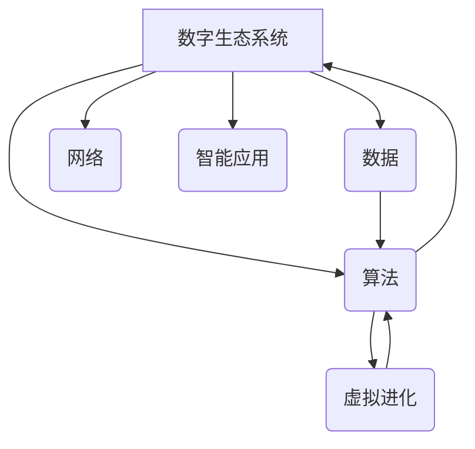

                 

## 虚拟进化：AI驱动的数字生态系统

> 关键词：人工智能、数字生态系统、虚拟进化、机器学习、深度学习、模拟进化、算法优化、应用场景

### 1. 背景介绍

数字时代，信息爆炸和技术飞速发展催生了全新的生态系统——数字生态系统。在这个生态系统中，数据是基础资源，算法是驱动力量，而人工智能（AI）则扮演着至关重要的角色。AI技术的不断进步，特别是深度学习的突破，使得虚拟进化成为可能，为构建更加智能、高效、自适应的数字生态系统提供了新的思路和方法。

传统生态系统遵循自然演化规律，生物通过基因突变和自然选择不断适应环境，最终形成复杂而稳定的生态平衡。虚拟进化借鉴了这一原理，将算法、数据和计算资源作为“基因”，通过模拟进化过程，不断优化算法，使其更好地适应数字环境，从而实现数字生态系统的自我进化和持续发展。

### 2. 核心概念与联系

**2.1 数字生态系统**

数字生态系统是指以数据为基础，以算法为驱动，以网络为连接，以智能应用为核心，形成的复杂、动态、自组织的系统。其特点包括：

* **数据驱动:** 数据是数字生态系统的核心资源，驱动着系统的发展和演化。
* **算法驱动:** 算法是数字生态系统的心脏，负责处理数据、发现规律、提供智能服务。
* **网络连接:** 网络是数字生态系统连接各个节点的纽带，使得数据和算法能够高效地流动和交互。
* **智能应用:** 智能应用是数字生态系统的外在表现，为用户提供个性化、便捷、智能化的服务。

**2.2 虚拟进化**

虚拟进化是指通过模拟自然进化过程，利用算法和计算资源，不断优化算法结构和参数，使其适应特定环境和任务需求的过程。其核心思想是：

* **算法作为“基因”:** 算法的结构和参数可以看作是生物的基因，决定了算法的性能和适应性。
* **数据作为“环境”:** 数据环境决定了算法的生存和发展环境，不同的数据环境会对算法产生不同的选择压力。
* **计算资源作为“生存空间”:** 计算资源为算法提供了生存和演化的空间，算法需要在有限的计算资源内不断优化和进化。

**2.3 核心概念关系图**



### 3. 核心算法原理 & 具体操作步骤

**3.1 算法原理概述**

虚拟进化算法通常基于遗传算法（GA）或进化策略（ES）等进化算法原理，通过模拟自然选择、交叉和变异等机制，不断优化算法参数，使其适应特定环境和任务需求。

**3.2 算法步骤详解**

1. **初始化种群:** 创建一个初始的算法参数集合，称为种群。每个参数集合代表一个候选算法。
2. **评估适应度:** 对每个候选算法进行评估，根据其在特定任务上的表现，计算其适应度值。适应度值越高，表示算法性能越好。
3. **选择操作:** 根据适应度值，选择部分候选算法作为父代，用于下一代的产生。选择策略可以是轮盘赌选择、锦标赛选择等。
4. **交叉操作:** 将两个父代算法进行交叉操作，产生新的子代算法。交叉操作可以模拟自然界生物的基因重组，增加算法的多样性。
5. **变异操作:** 对部分子代算法进行变异操作，随机改变其参数值，增加算法的探索能力。
6. **新一代种群:** 将选择、交叉和变异产生的子代算法组成新的种群，重复步骤2-5，直到达到预设的进化次数或算法性能达到目标水平。

**3.3 算法优缺点**

**优点:**

* **全局搜索能力强:** 虚拟进化算法能够全局搜索算法参数空间，找到最优或近似最优的算法。
* **适应性强:** 虚拟进化算法能够适应不断变化的环境和任务需求，通过进化过程不断优化算法性能。
* **并行化能力强:** 虚拟进化算法可以并行执行，提高算法的效率。

**缺点:**

* **计算资源消耗大:** 虚拟进化算法需要大量的计算资源，特别是对于复杂的任务和大型的种群规模。
* **收敛速度慢:** 虚拟进化算法的收敛速度可能较慢，需要较长的进化时间才能找到最优解。
* **参数设置复杂:** 虚拟进化算法需要设置多个参数，例如种群规模、交叉概率、变异概率等，参数设置对算法性能有重要影响。

**3.4 算法应用领域**

虚拟进化算法在以下领域具有广泛的应用前景：

* **机器学习模型优化:** 优化深度学习模型的结构和参数，提高模型的性能和效率。
* **算法自动生成:** 自动生成新的算法，解决特定问题。
* **网络优化:** 优化网络拓扑结构和路由算法，提高网络性能和可靠性。
* **机器人控制:** 优化机器人控制策略，提高机器人的运动精度和适应性。

### 4. 数学模型和公式 & 详细讲解 & 举例说明

**4.1 数学模型构建**

虚拟进化算法的数学模型主要包括适应度函数、选择策略、交叉策略和变异策略等。

* **适应度函数:** 用于评估候选算法的性能，通常是基于目标任务的指标，例如准确率、召回率、F1值等。

* **选择策略:** 用于选择父代算法，常见的策略包括轮盘赌选择、锦标赛选择等。

* **交叉策略:** 用于产生新的子代算法，常见的策略包括单点交叉、双点交叉等。

* **变异策略:** 用于随机改变子代算法的参数值，常见的策略包括均匀变异、高斯变异等。

**4.2 公式推导过程**

假设适应度函数为 $f(x)$，其中 $x$ 代表算法参数。选择策略为轮盘赌选择，则选择概率为：

$$P(x) = \frac{f(x)}{\sum_{i=1}^{N} f(x_i)}$$

其中 $N$ 为种群规模， $x_i$ 为种群中的每个算法参数。

交叉策略为单点交叉，则子代算法参数为：

$$x_{child} = x_{parent1}[1:p] \oplus x_{parent2}[p+1:end]$$

其中 $p$ 为交叉点， $\oplus$ 为串联操作。

变异策略为均匀变异，则子代算法参数为：

$$x_{child} = x_{parent} + \epsilon$$

其中 $\epsilon$ 为服从均匀分布的随机数。

**4.3 案例分析与讲解**

以机器学习模型优化为例，假设我们使用虚拟进化算法优化深度学习模型的网络结构和参数。

* **适应度函数:** 可以使用模型在测试集上的准确率作为适应度函数。
* **选择策略:** 可以使用轮盘赌选择，选择准确率更高的模型作为父代。
* **交叉策略:** 可以使用单点交叉，将两个父代模型的网络结构和参数进行交叉，产生新的子代模型。
* **变异策略:** 可以使用均匀变异，随机改变子代模型的网络结构和参数，增加模型的探索能力。

通过反复迭代，虚拟进化算法可以找到最优或近似最优的模型结构和参数，从而提高模型的性能。

### 5. 项目实践：代码实例和详细解释说明

**5.1 开发环境搭建**

虚拟进化算法的开发环境可以根据具体需求选择不同的编程语言和工具。例如，可以使用Python语言和TensorFlow、PyTorch等深度学习框架进行开发。

**5.2 源代码详细实现**

以下是一个简单的虚拟进化算法的Python代码示例，用于优化线性回归模型的权重参数：

```python
import numpy as np

# 定义适应度函数
def fitness_function(weights, X, y):
    y_pred = np.dot(X, weights)
    mse = np.mean((y_pred - y)**2)
    return 1 / (mse + 1e-6)

# 定义种群初始化函数
def initialize_population(population_size, input_size):
    return np.random.randn(population_size, input_size)

# 定义选择操作函数
def roulette_wheel_selection(population, fitness_values):
    probabilities = fitness_values / np.sum(fitness_values)
    return np.random.choice(population, size=len(population), p=probabilities)

# 定义交叉操作函数
def single_point_crossover(parent1, parent2):
    crossover_point = np.random.randint(1, len(parent1))
    child1 = np.concatenate((parent1[:crossover_point], parent2[crossover_point:]))
    child2 = np.concatenate((parent2[:crossover_point], parent1[crossover_point:]))
    return child1, child2

# 定义变异操作函数
def uniform_mutation(weights, mutation_rate):
    weights += np.random.randn(len(weights)) * mutation_rate
    return weights

# 主程序
if __name__ == "__main__":
    # 设置参数
    population_size = 100
    input_size = 10
    mutation_rate = 0.1
    generations = 100

    # 初始化种群
    population = initialize_population(population_size, input_size)

    # 进化过程
    for generation in range(generations):
        # 计算适应度
        fitness_values = np.array([fitness_function(weights, X, y) for weights in population])

        # 选择父代
        parents = roulette_wheel_selection(population, fitness_values)

        # 交叉
        children = []
        for i in range(0, len(parents), 2):
            child1, child2 = single_point_crossover(parents[i], parents[i+1])
            children.extend([child1, child2])

        # 变异
        for i in range(len(children)):
            children[i] = uniform_mutation(children[i], mutation_rate)

        # 更新种群
        population = children

    # 输出最优解
    best_index = np.argmax(fitness_values)
    best_weights = population[best_index]
    print("Best weights:", best_weights)
```

**5.3 代码解读与分析**

该代码示例实现了简单的虚拟进化算法，用于优化线性回归模型的权重参数。

* **适应度函数:** 计算模型在测试集上的均方误差 (MSE)，并将其反转，使得 MSE 越小，适应度越高。
* **选择策略:** 使用轮盘赌选择，选择适应度更高的模型作为父代。
* **交叉策略:** 使用单点交叉，将两个父代模型的权重参数进行交叉，产生新的子代模型。
* **变异策略:** 使用均匀变异，随机改变子代模型的权重参数，增加模型的探索能力。

**5.4 运行结果展示**

运行该代码后，会输出最优解的权重参数，这些参数可以用于训练线性回归模型，提高模型的预测精度。

### 6. 实际应用场景

虚拟进化算法在以下实际应用场景中展现出巨大的潜力：

* **药物研发:** 利用虚拟进化算法优化药物分子结构，提高药物的疗效和安全性。
* **材料科学:** 利用虚拟进化算法设计新型材料，具有优异的性能和功能。
* **金融投资:** 利用虚拟进化算法优化投资策略，提高投资收益率。
* **生物信息学:** 利用虚拟进化算法分析基因序列，预测蛋白质结构和功能。

**6.4 未来应用展望**

随着人工智能技术的不断发展，虚拟进化算法的应用场景将会更加广泛，例如：

* **自动驾驶:** 利用虚拟进化算法优化自动驾驶系统的控制策略，提高驾驶安全性。
* **个性化教育:** 利用虚拟进化算法生成个性化的学习方案，提高学习效率。
* **智能制造:** 利用虚拟进化算法优化生产流程，提高生产效率和产品质量。

### 7. 工具和资源推荐

**7.1 学习资源推荐**

* **书籍:**
    * 《进化算法》
    * 《机器学习》
    * 《深度学习》
* **在线课程:**
    * Coursera: Evolutionary Algorithms Specialization
    * edX: Artificial Intelligence
* **开源库:**
    * DEAP
    * PyGAD

**7.2 开发工具推荐**

* **编程语言:** Python
* **深度学习框架:** TensorFlow, PyTorch
* **仿真环境:** OpenAI Gym

**7.3 相关论文推荐**

* **《A Survey of Evolutionary Algorithms for Machine Learning》**
* **《Evolutionary Algorithms for Deep Learning》**
* **《Neuroevolution of Augmenting Topologies》**

### 8. 总结：未来发展趋势与挑战

**8.1 研究成果总结**

虚拟进化算法在人工智能领域取得了显著的成果，为构建更加智能、高效、自适应的数字生态系统提供了新的思路和方法。

**8.2 未来发展趋势**

* **算法融合:** 将虚拟进化算法与其他人工智能算法融合，例如深度学习、强化学习等，提高算法的性能和效率。
* **多目标优化:** 扩展虚拟进化算法，使其能够解决多目标优化问题，例如在提高模型性能的同时，还要考虑模型的复杂度和可解释性。
* **可解释性增强:** 研究虚拟进化算法的决策过程，提高算法的可解释性，使其能够更好地被人类理解和信任。

**8.3 面临的挑战**

* **计算资源消耗:** 虚拟进化算法需要大量的计算资源，特别是对于复杂的任务和大型的种群规模。
* **收敛速度:** 虚拟进化算法的收敛速度可能较慢，需要较长的进化时间才能找到最优解。
* **参数设置:** 虚拟进化算法需要设置多个参数，参数设置对算法性能有重要影响，需要进行大量的实验和调优。

**8.4 研究展望**

未来，虚拟进化算法的研究将继续深入，探索更有效的算法设计、更强大的计算资源和更完善的应用场景，为构建更加智能、高效、自适应的数字生态系统做出更大的贡献。

### 9. 附录：常见问题与解答

**常见问题:**

* **虚拟进化算法与遗传算法有什么区别？**

虚拟进化算法是基于遗传算法的扩展，它更加注重模拟自然进化过程，并结合了深度学习等其他人工智能技术。

* **虚拟进化算法的应用场景有哪些？**

虚拟进化算法的应用场景非常广泛，例如药物研发、材料科学、金融投资、生物信息学等。

* **如何选择虚拟进化算法的参数？**

参数选择是一个重要的步骤，需要根据具体任务和数据进行调整。通常需要进行大量的实验和调优。


作者：禅与计算机程序设计艺术 / Zen and the Art of Computer Programming<end_of_turn>

