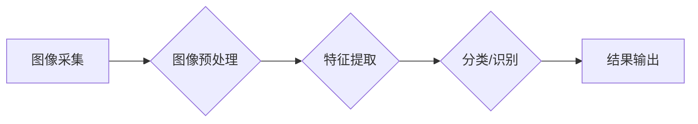

                 

## 计算机视觉创业：视觉智能的商业应用

> 关键词：计算机视觉、深度学习、图像识别、物体检测、场景理解、商业应用、创业

## 1. 背景介绍

计算机视觉（Computer Vision）作为人工智能（Artificial Intelligence）的重要分支，近年来取得了飞速发展。随着深度学习算法的进步和计算能力的提升，计算机视觉技术已经能够实现对图像和视频的精准识别、理解和分析，为各行各业带来了前所未有的机遇。

从自动驾驶、医疗诊断到智能零售、安防监控，计算机视觉正在深刻地改变着我们的生活方式和工作模式。对于创业者来说，计算机视觉技术蕴藏着巨大的商业潜力，可以帮助他们开发出创新产品和服务，解决现实问题，创造新的价值。

## 2. 核心概念与联系

### 2.1 计算机视觉的定义

计算机视觉是指赋予计算机“看”的能力，使其能够像人类一样理解和解释图像和视频信息。它涉及到图像处理、模式识别、机器学习等多个领域，旨在使计算机能够从图像中提取特征、识别物体、理解场景、跟踪运动等。

### 2.2 计算机视觉的应用场景

计算机视觉技术应用广泛，涵盖多个领域，例如：

* **自动驾驶:**  自动驾驶汽车依赖于计算机视觉技术来识别道路、交通信号、行人、车辆等，实现自主导航和避障。
* **医疗诊断:** 计算机视觉可以辅助医生进行病灶检测、肿瘤识别、疾病诊断等，提高诊断效率和准确性。
* **智能零售:**  计算机视觉可以实现商品识别、库存管理、顾客行为分析等，优化零售运营和提升购物体验。
* **安防监控:**  计算机视觉可以用于人脸识别、行为分析、异常检测等，提高安防监控的效率和安全性。

### 2.3 计算机视觉的架构

计算机视觉系统通常由以下几个模块组成：



* **图像采集:**  获取图像数据，例如摄像头、传感器等。
* **图像预处理:**  对图像进行增强、滤波、分割等处理，提高图像质量和特征提取效果。
* **特征提取:**  从图像中提取关键特征，例如颜色、纹理、形状等。
* **分类/识别:**  根据提取的特征，对图像进行分类或识别，例如识别物体、场景、人脸等。
* **结果输出:**  将识别结果以文本、图像、语音等形式输出。

## 3. 核心算法原理 & 具体操作步骤

### 3.1 算法原理概述

深度学习是计算机视觉领域的核心算法之一，它利用多层神经网络来模拟人类大脑的学习过程，能够从海量图像数据中自动学习特征，实现对图像的精准识别和理解。

常见的深度学习算法包括卷积神经网络（CNN）、循环神经网络（RNN）和生成对抗网络（GAN）。

* **卷积神经网络（CNN）:**  CNN擅长于处理图像数据，它利用卷积核对图像进行特征提取，能够自动学习图像的边缘、纹理、形状等特征。
* **循环神经网络（RNN）:**  RNN擅长于处理序列数据，例如文本、语音等，它能够记忆之前的信息，对序列数据进行理解和预测。
* **生成对抗网络（GAN）:**  GAN由生成器和判别器两个网络组成，生成器试图生成逼真的图像数据，判别器试图区分真实图像和生成图像，两者相互竞争，最终生成器能够生成逼真的图像数据。

### 3.2 算法步骤详解

以卷积神经网络为例，其训练步骤如下：

1. **数据准备:**  收集大量的图像数据，并进行标注，例如标注物体的类别、位置等。
2. **模型搭建:**  设计卷积神经网络的结构，包括卷积层、池化层、全连接层等。
3. **模型训练:**  利用训练数据训练卷积神经网络，调整网络参数，使网络能够准确识别图像中的物体。
4. **模型评估:**  使用测试数据评估模型的性能，例如准确率、召回率、F1-score等。
5. **模型部署:**  将训练好的模型部署到实际应用场景中，例如自动驾驶汽车、医疗诊断系统等。

### 3.3 算法优缺点

**优点:**

* **高准确率:** 深度学习算法能够从海量图像数据中自动学习特征，实现对图像的精准识别和理解。
* **鲁棒性强:** 深度学习模型能够对图像噪声、光照变化等因素具有较强的鲁棒性。
* **可扩展性强:** 深度学习模型可以很容易地扩展到处理更高分辨率、更复杂图像数据。

**缺点:**

* **数据依赖性强:** 深度学习算法需要大量的训练数据才能达到较高的准确率。
* **计算资源消耗大:** 训练深度学习模型需要大量的计算资源，例如GPU等。
* **可解释性差:** 深度学习模型的决策过程比较复杂，难以解释模型的决策依据。

### 3.4 算法应用领域

深度学习算法在计算机视觉领域有着广泛的应用，例如：

* **图像分类:**  识别图像中的物体类别，例如猫、狗、汽车等。
* **物体检测:**  定位图像中物体的边界框，并识别物体的类别。
* **场景理解:**  理解图像中的场景内容，例如街道、公园、室内等。
* **图像分割:**  将图像分割成不同的区域，例如分割出前景和背景。
* **人脸识别:**  识别图像中的人脸，并进行身份验证。

## 4. 数学模型和公式 & 详细讲解 & 举例说明

### 4.1 数学模型构建

深度学习模型的数学基础是神经网络，它由多个层组成，每一层包含多个神经元。每个神经元接收来自上一层的输入信号，并通过激活函数进行处理，输出到下一层。

神经网络的权重和偏置是模型的参数，通过训练过程不断调整这些参数，使模型能够学习到图像特征。

### 4.2 公式推导过程

**激活函数:**

激活函数的作用是将神经元的输入信号转换为输出信号，常用的激活函数包括 sigmoid 函数、ReLU 函数、tanh 函数等。

* **sigmoid 函数:**  $f(x) = \frac{1}{1 + e^{-x}}$

* **ReLU 函数:**  $f(x) = max(0, x)$

**损失函数:**

损失函数用于衡量模型预测结果与真实结果之间的差异，常用的损失函数包括均方误差（MSE）、交叉熵损失（Cross-Entropy Loss）等。

* **均方误差:**  $L = \frac{1}{N} \sum_{i=1}^{N} (y_i - \hat{y}_i)^2$

* **交叉熵损失:**  $L = -\frac{1}{N} \sum_{i=1}^{N} y_i \log(\hat{y}_i) + (1-y_i) \log(1-\hat{y}_i)$

**梯度下降:**

梯度下降算法用于优化模型参数，通过计算损失函数的梯度，不断调整参数，使损失函数最小化。

### 4.3 案例分析与讲解

以图像分类为例，假设我们有一个包含猫和狗的图像数据集，目标是训练一个模型能够识别猫和狗。

1. **数据准备:**  收集大量猫和狗的图像数据，并进行标注，例如将猫标记为1，狗标记为0。
2. **模型搭建:**  设计一个卷积神经网络模型，例如LeNet-5、AlexNet等。
3. **模型训练:**  利用训练数据训练模型，计算损失函数，并使用梯度下降算法更新模型参数。
4. **模型评估:**  使用测试数据评估模型的准确率，例如计算正确分类的图像数量占总图像数量的比例。
5. **模型部署:**  将训练好的模型部署到实际应用场景中，例如开发一个手机应用程序，能够识别用户上传的图像中的猫和狗。

## 5. 项目实践：代码实例和详细解释说明

### 5.1 开发环境搭建

* **操作系统:**  Windows、macOS、Linux
* **编程语言:**  Python
* **深度学习框架:**  TensorFlow、PyTorch
* **硬件环境:**  GPU（可选）

### 5.2 源代码详细实现

以下是一个使用TensorFlow框架实现图像分类的简单代码示例：

```python
import tensorflow as tf

# 定义模型结构
model = tf.keras.models.Sequential([
    tf.keras.layers.Conv2D(32, (3, 3), activation='relu', input_shape=(28, 28, 1)),
    tf.keras.layers.MaxPooling2D((2, 2)),
    tf.keras.layers.Conv2D(64, (3, 3), activation='relu'),
    tf.keras.layers.MaxPooling2D((2, 2)),
    tf.keras.layers.Flatten(),
    tf.keras.layers.Dense(10, activation='softmax')
])

# 编译模型
model.compile(optimizer='adam',
              loss='sparse_categorical_crossentropy',
              metrics=['accuracy'])

# 训练模型
model.fit(x_train, y_train, epochs=5)

# 评估模型
loss, accuracy = model.evaluate(x_test, y_test)
print('Test loss:', loss)
print('Test accuracy:', accuracy)
```

### 5.3 代码解读与分析

* **模型结构:**  代码定义了一个简单的卷积神经网络模型，包含两个卷积层、两个池化层、一个全连接层和一个输出层。
* **激活函数:**  模型中使用了ReLU函数作为激活函数，它能够提高模型的表达能力。
* **损失函数:**  模型使用了交叉熵损失函数，它适合于多分类问题。
* **优化器:**  模型使用了Adam优化器，它是一种常用的优化算法。
* **训练过程:**  代码使用训练数据训练模型，并设置了训练轮数（epochs）。
* **评估过程:**  代码使用测试数据评估模型的性能，并打印出测试损失和测试准确率。

### 5.4 运行结果展示

训练完成后，模型能够对图像进行分类，例如识别猫和狗。

## 6. 实际应用场景

### 6.1 自动驾驶

自动驾驶汽车依赖于计算机视觉技术来识别道路、交通信号、行人、车辆等，实现自主导航和避障。

* **道路识别:**  识别道路边界、车道线、交通标志等。
* **物体检测:**  检测行人、车辆、自行车等物体，并预测其运动轨迹。
* **场景理解:**  理解道路场景，例如判断交通灯状态、识别交叉路口等。

### 6.2 医疗诊断

计算机视觉可以辅助医生进行病灶检测、肿瘤识别、疾病诊断等，提高诊断效率和准确性。

* **病灶检测:**  检测图像中的肿瘤、斑块、骨折等病灶。
* **肿瘤识别:**  识别肿瘤的类型、大小、位置等特征。
* **疾病诊断:**  根据图像特征，辅助医生诊断疾病，例如糖尿病、心血管疾病等。

### 6.3 智能零售

计算机视觉可以实现商品识别、库存管理、顾客行为分析等，优化零售运营和提升购物体验。

* **商品识别:**  识别商品的类别、品牌、价格等信息。
* **库存管理:**  自动盘点商品库存，及时补充缺货商品。
* **顾客行为分析:**  分析顾客的购物行为，例如浏览商品、加入购物车、购买商品等，为营销策略提供数据支持。

### 6.4 未来应用展望

计算机视觉技术的发展将带来更多创新应用，例如：

* **虚拟现实/增强现实:**  计算机视觉可以为虚拟现实和增强现实应用提供逼真的图像和场景。
* **机器人技术:**  计算机视觉可以帮助机器人感知周围环境，进行导航和操作。
* **个性化服务:**  计算机视觉可以根据用户的图像特征，提供个性化的产品推荐、服务和体验。

## 7. 工具和资源推荐

### 7.1 学习资源推荐

* **书籍:**
    * 《深度学习》 - Ian Goodfellow, Yoshua Bengio, Aaron Courville
    * 《计算机视觉：算法与应用》 - Richard Szeliski
* **在线课程:**
    * Coursera: 深度学习 Specialization
    * Udacity: 计算机视觉 Nanodegree
* **博客和网站:**
    * TensorFlow Blog: https://blog.tensorflow.org/
    * PyTorch Blog: https://pytorch.org/blog/
    * OpenCV: https://opencv.org/

### 7.2 开发工具推荐

* **深度学习框架:**
    * TensorFlow: https://www.tensorflow.org/
    * PyTorch: https://pytorch.org/
* **图像处理库:**
    * OpenCV: https://opencv.org/
* **数据可视化工具:**
    * Matplotlib: https://matplotlib.org/
    * Seaborn: https://seaborn.pydata.org/

### 7.3 相关论文推荐

* **AlexNet:** Krizhevsky, A., Sutskever, I., & Hinton, G. E. (2012). Imagenet classification with deep convolutional neural networks. In Advances in neural information processing systems (pp. 1097-1105).
* **VGGNet:** Simonyan, K., & Zisserman, A. (2014). Very deep convolutional networks for large-scale image recognition. arXiv preprint arXiv:1409.1556.
* **ResNet:** He, K., Zhang, X., Ren, S., & Sun, J. (2016). Deep residual learning for image recognition. In Proceedings of the IEEE conference on computer vision and pattern recognition (pp. 770-778).

## 8. 总结：未来发展趋势与挑战

### 8.1 研究成果总结

近年来，计算机视觉技术取得了飞速发展，深度学习算法的进步、计算能力的提升、数据量的增加等因素共同推动了计算机视觉的进步。

* **准确率提升:**  深度学习模型的准确率不断提高，能够实现对图像的精准识别和理解。
* **应用场景扩展:**  计算机视觉技术应用场景不断扩展，涵盖多个领域，例如自动驾驶、医疗诊断、智能零售等。
* **算法创新:**  新的深度学习算法不断涌现，例如GAN、Transformer等，为计算机视觉技术的发展提供了新的思路和方向。

### 8.2 未来发展趋势

* **更深层次的网络:**  研究更深层次的网络结构，提高模型的表达能力和泛化能力。
* **自监督学习:**  利用无标签数据进行自监督学习，降低对标注数据的依赖。
* **边缘计算:**  将计算机视觉模型部署到边缘设备，实现实时处理和低延迟响应。
* **跨模态学习:**  将计算机视觉与其他模态数据（例如文本、音频）进行融合，实现更全面的理解和分析。

### 8.3 面临的挑战

* **数据标注:**  深度学习模型需要大量的标注数据，数据标注成本高昂，效率低。
* **模型解释性:**  深度学习模型的决策过程比较复杂，难以解释模型的决策依据。
* **安全性和隐私性:**  计算机视觉技术涉及到图像数据，需要考虑安全性和隐私性问题。

### 8.4 研究展望

未来，计算机视觉技术将继续发展，为我们带来更多创新应用，改变我们的生活方式和工作模式。


## 9. 附录：常见问题与解答

### 9.1 什么是计算机视觉？

计算机视觉是指赋予计算机“看”的能力，使其能够像人类一样理解和解释图像和视频信息。

### 9.2 计算机视觉有哪些应用场景？

计算机视觉应用场景广泛，例如自动驾驶、医疗诊断、智能零售、安防监控等。

### 9.3 深度学习是什么？

深度学习是机器学习的一种，它利用多层神经网络来模拟人类大脑的学习过程，能够从海量数据中自动学习特征。

### 9.4 如何学习计算机视觉？

可以通过阅读书籍、在线课程、博客等方式学习计算机视觉。

### 9.5 计算机视觉的未来发展趋势是什么？

未来，计算机视觉技术将更加智能化、自动化、个性化。


作者：禅与计算机程序设计艺术 / Zen and the Art of Computer Programming<end_of_turn>


