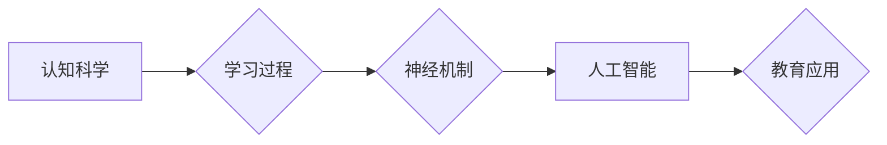

                 

## 认知科学与教育：优化学习的神经基础

> 关键词：认知科学、神经科学、学习、教育、人工智能、神经网络、深度学习

## 1. 背景介绍

教育一直是人类文明进步的基石，而学习则是教育的核心。随着科技的飞速发展，特别是人工智能和神经科学的突破性进展，我们对学习过程的理解不断加深，也为优化学习方法提供了新的思路和工具。

认知科学致力于理解人类思维、学习和决策的过程，而神经科学则探究大脑的结构和功能。近年来，这两门学科的交叉研究取得了显著成果，揭示了学习与大脑神经机制之间的密切联系。

传统教育模式往往注重知识的传授，而忽视了学习者的个体差异和认知特点。而认知科学与神经科学的结合，为我们提供了更深入的理解学习过程的理论基础，可以帮助我们设计更个性化、高效的学习方法。

## 2. 核心概念与联系

**2.1 认知科学与教育的融合**

认知科学的研究成果为教育提供了新的视角和方法。例如，认知心理学揭示了人类记忆、注意力、语言理解等认知过程的运作机制，这些知识可以帮助我们设计更有效的教学策略。

**2.2 神经科学与学习机制**

神经科学研究表明，学习是一个涉及大脑神经元连接和突触可塑性的复杂过程。当我们学习新知识时，大脑会形成新的神经连接，并加强已有连接的强度。

**2.3 人工智能在教育中的应用**

人工智能技术，特别是深度学习，可以模拟大脑的学习机制，为教育提供新的工具和手段。例如，智能辅导系统可以根据学生的学习进度和特点提供个性化的学习建议和帮助。

**Mermaid 流程图**



## 3. 核心算法原理 & 具体操作步骤

**3.1 算法原理概述**

深度学习算法，特别是卷积神经网络（CNN）和循环神经网络（RNN），在模拟大脑学习机制方面取得了显著成果。

CNN擅长处理图像和视觉信息，可以识别图像中的物体、场景和特征。RNN擅长处理序列数据，例如文本和语音，可以理解语言的上下文和语义。

**3.2 算法步骤详解**

1. **数据预处理:** 将学习数据转换为深度学习算法可以理解的格式。例如，图像数据需要进行尺寸调整和归一化处理。
2. **网络结构设计:** 根据学习任务选择合适的深度学习网络结构，例如CNN或RNN。
3. **参数初始化:** 为网络中的参数赋予初始值。
4. **前向传播:** 将输入数据通过网络层级传递，计算输出结果。
5. **反向传播:** 计算输出结果与真实值的误差，并根据误差调整网络参数。
6. **优化算法:** 使用优化算法，例如梯度下降，更新网络参数，降低误差。
7. **模型评估:** 使用测试数据评估模型的性能，例如准确率、召回率和F1-score。

**3.3 算法优缺点**

**优点:**

* 能够自动学习特征，无需人工特征工程。
* 能够处理大规模数据，并取得较高的学习精度。
* 能够应用于多种学习任务，例如图像识别、自然语言处理和机器翻译。

**缺点:**

* 需要大量的训练数据。
* 训练过程耗时和计算资源消耗大。
* 模型解释性较差，难以理解模型的决策过程。

**3.4 算法应用领域**

* **教育领域:** 智能辅导系统、个性化学习平台、自动批改系统。
* **医疗领域:** 疾病诊断、药物研发、患者监测。
* **金融领域:** 风险评估、欺诈检测、投资预测。
* **其他领域:** 语音识别、图像识别、机器翻译等。

## 4. 数学模型和公式 & 详细讲解 & 举例说明

**4.1 数学模型构建**

深度学习模型可以看作是一个复杂的数学函数，其输入是学习数据，输出是学习结果。

**4.2 公式推导过程**

深度学习模型的训练过程基于梯度下降算法，其核心公式是：

$$
\theta = \theta - \alpha \nabla L(\theta)
$$

其中：

* $\theta$ 是模型参数。
* $\alpha$ 是学习率。
* $L(\theta)$ 是损失函数，用于衡量模型预测结果与真实值的误差。
* $\nabla L(\theta)$ 是损失函数对参数 $\theta$ 的梯度。

**4.3 案例分析与讲解**

假设我们训练一个图像分类模型，目标是识别猫和狗的图片。

损失函数可以定义为交叉熵损失函数，用于衡量模型预测类别与真实类别的差异。

梯度下降算法会迭代地更新模型参数，使得损失函数最小化，从而提高模型的分类精度。

## 5. 项目实践：代码实例和详细解释说明

**5.1 开发环境搭建**

可以使用Python语言和深度学习框架，例如TensorFlow或PyTorch，搭建深度学习模型开发环境。

**5.2 源代码详细实现**

```python
import tensorflow as tf

# 定义模型结构
model = tf.keras.models.Sequential([
    tf.keras.layers.Conv2D(32, (3, 3), activation='relu', input_shape=(28, 28, 1)),
    tf.keras.layers.MaxPooling2D((2, 2)),
    tf.keras.layers.Conv2D(64, (3, 3), activation='relu'),
    tf.keras.layers.MaxPooling2D((2, 2)),
    tf.keras.layers.Flatten(),
    tf.keras.layers.Dense(10, activation='softmax')
])

# 编译模型
model.compile(optimizer='adam',
              loss='sparse_categorical_crossentropy',
              metrics=['accuracy'])

# 训练模型
model.fit(x_train, y_train, epochs=10)

# 评估模型
loss, accuracy = model.evaluate(x_test, y_test)
print('Test loss:', loss)
print('Test accuracy:', accuracy)
```

**5.3 代码解读与分析**

这段代码定义了一个简单的卷积神经网络模型，用于识别手写数字。

模型包含两个卷积层、两个最大池化层、一个全连接层和一个输出层。

模型使用Adam优化器、交叉熵损失函数和准确率作为评估指标。

**5.4 运行结果展示**

训练完成后，可以将模型应用于新的图像数据进行预测。

## 6. 实际应用场景

**6.1 个性化学习平台**

深度学习算法可以根据学生的学习进度、知识掌握情况和学习风格，提供个性化的学习内容和学习建议。

**6.2 智能辅导系统**

智能辅导系统可以自动解答学生的疑问，提供学习指导和反馈，帮助学生更好地理解学习内容。

**6.3 自动批改系统**

深度学习算法可以自动批改学生的作业和考试，节省教师的时间和精力，并提供更客观和精准的评分结果。

**6.4 未来应用展望**

随着人工智能技术的不断发展，深度学习在教育领域的应用将更加广泛和深入。

例如，未来可能出现能够模拟真实教师教学的虚拟教师系统，能够提供沉浸式学习体验的虚拟现实学习平台，以及能够个性化定制学习路径的智能学习助手。

## 7. 工具和资源推荐

**7.1 学习资源推荐**

* **书籍:**

    * 《深度学习》
    * 《神经网络与深度学习》
    * 《机器学习》

* **在线课程:**

    * Coursera
    * edX
    * Udacity

**7.2 开发工具推荐**

* **TensorFlow:** https://www.tensorflow.org/
* **PyTorch:** https://pytorch.org/
* **Keras:** https://keras.io/

**7.3 相关论文推荐**

* **AlexNet:** http://papers.nips.cc/paper/4824-imagenet-classification-with-deep-convolutional-neural-networks.pdf
* **VGGNet:** http://arxiv.org/abs/1409.1556
* **ResNet:** http://arxiv.org/abs/1512.03385

## 8. 总结：未来发展趋势与挑战

**8.1 研究成果总结**

认知科学与神经科学的交叉研究为教育提供了新的理论基础和实践方法。深度学习算法在模拟大脑学习机制方面取得了显著成果，为教育领域提供了新的工具和手段。

**8.2 未来发展趋势**

* **更个性化、更智能的学习体验:** 深度学习算法将能够更加精准地识别学生的学习特点和需求，提供更加个性化的学习内容和学习建议。
* **沉浸式学习环境:** 虚拟现实和增强现实技术将为学生提供更加沉浸式的学习体验，提高学习兴趣和效率。
* **跨学科学习:** 深度学习算法将能够帮助学生更好地理解不同学科之间的联系，促进跨学科学习。

**8.3 面临的挑战**

* **数据隐私和安全:** 深度学习算法需要大量的学习数据，如何保护学生的隐私和数据安全是一个重要的挑战。
* **算法解释性和可信度:** 深度学习模型的决策过程往往难以解释，如何提高算法的解释性和可信度是一个重要的研究方向。
* **教育公平性:** 深度学习技术可能加剧教育资源的分配不均，如何确保所有学生都能平等地受益于深度学习技术是一个重要的社会问题。

**8.4 研究展望**

未来，我们将继续探索深度学习在教育领域的应用，努力构建更加个性化、智能化、公平的教育体系，为每个学生提供最佳的学习体验。

## 9. 附录：常见问题与解答

**9.1 如何选择合适的深度学习算法？**

选择合适的深度学习算法取决于具体的学习任务和数据特点。例如，对于图像识别任务，CNN通常是一个不错的选择；对于文本处理任务，RNN通常是一个更好的选择。

**9.2 如何处理深度学习模型过拟合问题？**

过拟合是指模型在训练数据上表现很好，但在测试数据上表现较差。

可以采用以下方法来解决过拟合问题：

* 增加训练数据量。
* 使用正则化技术，例如L1正则化和L2正则化。
* 使用Dropout技术，随机丢弃一部分神经元，防止模型过拟合训练数据。
* 使用交叉验证技术，将数据分成多个子集，分别用于训练和测试模型，选择最优模型。

**9.3 如何评估深度学习模型的性能？**

常用的评估指标包括准确率、召回率、F1-score、AUC等。

选择合适的评估指标取决于具体的学习任务和数据特点。


作者：禅与计算机程序设计艺术 / Zen and the Art of Computer Programming 
<end_of_turn>

