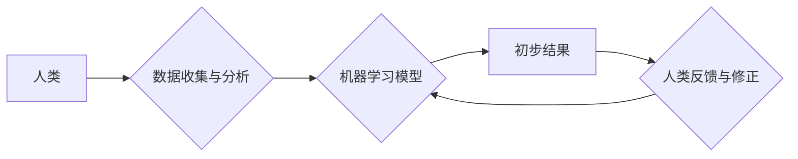

                 

## 释放人类创造力的源泉：人类计算的魅力

> 关键词：人类计算、协同智能、人工智能、计算模型、认知科学、未来趋势、应用场景

### 1. 背景介绍

在信息时代，人工智能（AI）技术蓬勃发展，机器学习算法取得了令人瞩目的成就。然而，AI 仍然局限于处理结构化数据和执行预先定义的任务。面对复杂、模糊、需要创造力和洞察力的问题，AI 显得力不从心。人类计算应运而生，它强调人类和机器的协同合作，充分发挥各自的优势，共同解决复杂问题，释放人类创造力的源泉。

人类计算的概念源于认知科学和计算科学的交叉融合。它认为，人类拥有独特的认知能力，例如抽象思维、批判性思考、情感理解和创造力，而机器擅长处理大量数据、执行重复性任务和进行精确计算。通过将人类的智慧与机器的计算能力相结合，可以构建更强大、更灵活、更具创造力的智能系统。

### 2. 核心概念与联系

人类计算的核心概念是将人类和机器视为一个有机整体，共同完成任务。它强调以下几个关键点：

* **协同智能:** 人类和机器在任务中相互协作，发挥各自的优势，共同完成复杂任务。
* **人类在回路:** 人类参与到整个计算过程中，提供反馈、修正错误、引导决策，确保结果的准确性和合理性。
* **数据驱动:** 人类计算依赖于大量数据，通过数据分析和挖掘，帮助人类更好地理解问题，做出更明智的决策。
* **可解释性:** 人类计算系统需要具备可解释性，以便人类能够理解系统的决策过程，并对其进行信任和监管。

**Mermaid 流程图:**



### 3. 核心算法原理 & 具体操作步骤

#### 3.1  算法原理概述

人类计算的核心算法原理是将人类的认知能力转化为机器可执行的算法。这可以通过以下几种方式实现：

* **模拟人类认知过程:** 通过构建模仿人类思维模式的算法模型，例如专家系统、神经网络等，来解决复杂问题。
* **利用人类知识:** 将人类的经验、知识和技能编码为机器可理解的形式，例如规则库、知识图谱等，帮助机器做出更智能的决策。
* ** crowdsourcing:** 利用互联网平台，将任务分发给大量的人类参与者，通过众包的力量，快速收集数据、进行分析和解决问题。

#### 3.2  算法步骤详解

一个典型的基于人类计算的算法流程如下：

1. **问题定义:** 明确需要解决的问题，并将其转化为机器可理解的形式。
2. **数据收集:** 收集与问题相关的各种数据，包括结构化数据、非结构化数据、文本数据、图像数据等。
3. **数据预处理:** 对收集到的数据进行清洗、转换、格式化等处理，使其能够被机器算法处理。
4. **模型构建:** 选择合适的算法模型，并根据问题特点进行参数调整和训练。
5. **结果输出:** 模型对数据进行分析和处理，输出初步结果。
6. **人类反馈:** 人类对模型的输出结果进行评估、修正和反馈，帮助模型改进。
7. **迭代优化:** 根据人类反馈，对模型进行迭代优化，不断提高模型的准确性和效率。

#### 3.3  算法优缺点

**优点:**

* **解决复杂问题:** 人类计算能够处理复杂、模糊、需要创造力和洞察力的问题，超越了传统AI的局限性。
* **提高决策质量:** 人类参与到决策过程中，能够提供更全面的视角和更合理的判断。
* **增强可解释性:** 人类计算系统需要具备可解释性，能够让人类理解系统的决策过程，提高信任度。

**缺点:**

* **成本高昂:** 人类计算需要大量的人力投入，成本较高。
* **效率较低:** 人类计算的速度相对较慢，难以处理海量数据。
* **数据安全:** 人类计算需要处理大量敏感数据，需要加强数据安全保护。

#### 3.4  算法应用领域

人类计算在各个领域都有广泛的应用，例如：

* **医疗诊断:** 人类医生和AI系统协同合作，提高诊断准确率和效率。
* **金融风险管理:** 人类专家和机器学习模型结合，识别和评估金融风险。
* **法律决策:** 人类律师和AI系统合作，分析法律文件、预测案件结果。
* **科学研究:** 人类科学家和机器学习算法共同探索科学问题，加速科研进展。

### 4. 数学模型和公式 & 详细讲解 & 举例说明

#### 4.1  数学模型构建

人类计算的数学模型通常基于概率论、统计学和信息论等理论。例如，在机器学习领域，常用的模型包括贝叶斯网络、决策树、支持向量机等。这些模型通过数学公式来描述数据之间的关系，并预测未来事件的发生概率。

#### 4.2  公式推导过程

例如，在贝叶斯网络中，一个节点的条件概率可以根据其父节点的概率分布进行计算。假设我们有一个节点 X，其父节点为 Y 和 Z，则 X 的条件概率为：

$$P(X|Y,Z) = \frac{P(X,Y,Z)}{P(Y,Z)}$$

其中，$P(X,Y,Z)$ 是 X、Y 和 Z 同时发生的概率，$P(Y,Z)$ 是 Y 和 Z 同时发生的概率。

#### 4.3  案例分析与讲解

例如，在医疗诊断领域，可以使用贝叶斯网络来预测患者患某种疾病的概率。

假设我们有一个节点表示患者患病的概率，其父节点为患者的症状、年龄、性别等特征。通过收集患者的病历数据，我们可以训练贝叶斯网络模型，并根据患者的特征输入，预测其患病概率。

### 5. 项目实践：代码实例和详细解释说明

#### 5.1  开发环境搭建

人类计算项目通常需要使用多种工具和技术，例如：

* **编程语言:** Python、Java、C++ 等
* **机器学习框架:** TensorFlow、PyTorch、Scikit-learn 等
* **数据存储和处理工具:** Hadoop、Spark、MongoDB 等
* **云计算平台:** AWS、Azure、GCP 等

#### 5.2  源代码详细实现

以下是一个简单的基于Python和Scikit-learn的人类计算代码实例，用于预测房价：

```python
from sklearn.linear_model import LinearRegression
from sklearn.model_selection import train_test_split
import pandas as pd

# 加载房价数据
data = pd.read_csv('house_price.csv')

# 选择特征和目标变量
features = ['size', 'location', 'bedrooms']
target = 'price'

# 将数据分成训练集和测试集
X_train, X_test, y_train, y_test = train_test_split(data[features], data[target], test_size=0.2)

# 创建线性回归模型
model = LinearRegression()

# 训练模型
model.fit(X_train, y_train)

# 预测测试集的房价
y_pred = model.predict(X_test)

# 评估模型性能
print('模型性能:', model.score(X_test, y_test))
```

#### 5.3  代码解读与分析

这段代码首先加载房价数据，然后选择特征和目标变量。接着，将数据分成训练集和测试集，并使用线性回归模型训练模型。最后，使用训练好的模型预测测试集的房价，并评估模型性能。

#### 5.4  运行结果展示

运行这段代码后，会输出模型的性能指标，例如R-squared值。R-squared值表示模型对目标变量的解释能力，值越高表示模型的预测能力越强。

### 6. 实际应用场景

#### 6.1  医疗诊断辅助系统

人类计算可以帮助医生更快、更准确地诊断疾病。例如，AI系统可以分析患者的影像数据，识别潜在的病灶，并提供诊断建议，而医生可以根据AI的建议，结合自身的经验和判断，做出最终的诊断。

#### 6.2  金融风险评估系统

人类计算可以帮助金融机构识别和评估金融风险。例如，AI系统可以分析客户的信用记录、交易行为等数据，识别潜在的欺诈行为或违约风险，而金融专家可以根据AI的分析结果，制定相应的风险控制措施。

#### 6.3  法律案件分析系统

人类计算可以帮助律师更快、更准确地分析法律案件。例如，AI系统可以分析法律文件、判例案例等数据，识别案件的关键信息和法律依据，而律师可以根据AI的分析结果，制定相应的法律策略。

#### 6.4  未来应用展望

随着人工智能技术的不断发展，人类计算将在更多领域得到应用，例如：

* **教育领域:** 人类计算可以个性化定制学习方案，帮助学生更好地掌握知识。
* **艺术创作:** 人类计算可以辅助艺术家创作新的艺术作品，激发艺术灵感。
* **科学研究:** 人类计算可以加速科学研究的进程，帮助科学家解决更复杂的问题。

### 7. 工具和资源推荐

#### 7.1  学习资源推荐

* **书籍:**

    * 《人类计算：人工智能与人类智慧的协同》
    * 《认知计算：从大脑到机器》

* **在线课程:**

    * Coursera: 人工智能与人类计算
    * edX: 人工智能与认知科学

#### 7.2  开发工具推荐

* **编程语言:** Python、Java、C++
* **机器学习框架:** TensorFlow、PyTorch、Scikit-learn
* **数据存储和处理工具:** Hadoop、Spark、MongoDB
* **云计算平台:** AWS、Azure、GCP

#### 7.3  相关论文推荐

* **人类计算的未来:** https://arxiv.org/abs/1908.04876
* **人类计算在医疗诊断中的应用:** https://www.ncbi.nlm.nih.gov/pmc/articles/PMC6472633/

### 8. 总结：未来发展趋势与挑战

#### 8.1  研究成果总结

人类计算是一个新兴的领域，近年来取得了显著的进展。

* **算法模型:** 人类计算算法模型不断发展，更加智能、更加高效。
* **数据分析:** 人类计算利用大数据分析技术，挖掘更深层次的知识和洞察力。
* **应用场景:** 人类计算在各个领域都有广泛的应用，并不断拓展新的应用场景。

#### 8.2  未来发展趋势

未来，人类计算将朝着以下几个方向发展：

* **更智能的算法模型:** 人类计算算法模型将更加智能，能够更好地理解和模拟人类的认知过程。
* **更强大的计算能力:** 人类计算将结合云计算、量子计算等新兴技术，获得更强大的计算能力。
* **更广泛的应用场景:** 人类计算将应用于更多领域，例如教育、艺术、科学研究等。

#### 8.3  面临的挑战

人类计算也面临着一些挑战：

* **数据安全:** 人类计算需要处理大量敏感数据，需要加强数据安全保护。
* **算法可解释性:** 人类计算算法模型需要更加可解释，以便人类能够理解其决策过程。
* **伦理问题:** 人类计算的应用需要考虑伦理问题，例如算法偏见、隐私保护等。

#### 8.4  研究展望

未来，人类计算的研究将更加注重以下几个方面：

* **开发更智能、更可解释的算法模型。**
* **探索人类和机器协同合作的新模式。**
* **解决人类计算带来的伦理问题。**

### 9. 附录：常见问题与解答

**Q1: 人类计算和人工智能有什么区别？**

**A1:** 人工智能是指机器能够模拟人类智能的行为，而人类计算则是强调人类和机器的协同合作，共同解决复杂问题。

**Q2: 人类计算的应用场景有哪些？**

**A2:** 人类计算的应用场景非常广泛，例如医疗诊断、金融风险评估、法律案件分析等。

**Q3: 人类计算的未来发展趋势是什么？**

**A3:** 未来，人类计算将更加智能、更加高效，并应用于更多领域。


作者：禅与计算机程序设计艺术 / Zen and the Art of Computer Programming 
<end_of_turn>

