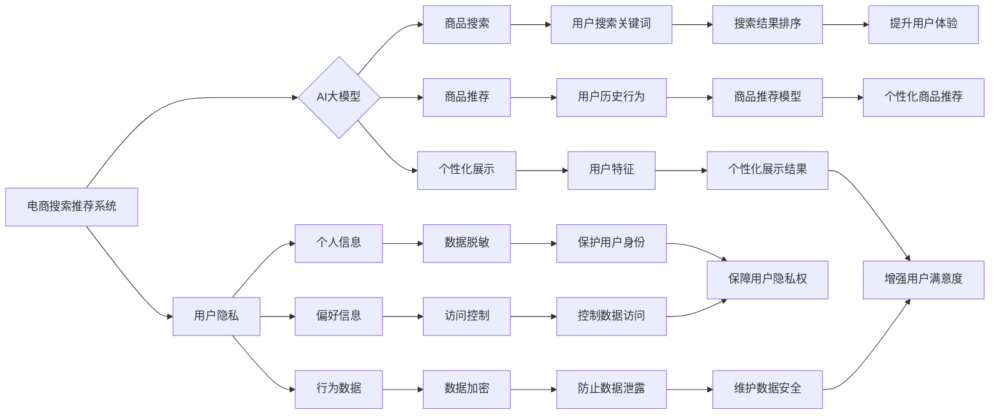

                 

## AI 大模型在电商搜索推荐中的用户隐私保护措施：尊重用户权利与安全

> 关键词：AI大模型、电商搜索推荐、用户隐私、数据安全、联邦学习、差分隐私、同态加密

## 1. 背景介绍

电商平台作为现代商业的重要组成部分，其搜索推荐系统在用户体验和商业运营中扮演着至关重要的角色。近年来，随着人工智能技术的飞速发展，基于深度学习的AI大模型在电商搜索推荐领域取得了显著的成果，能够精准地理解用户需求，提供个性化的商品推荐，从而提升用户满意度和转化率。然而，AI大模型的训练和应用也带来了新的挑战，其中用户隐私保护尤为重要。

AI大模型通常需要海量用户数据进行训练，这些数据包含用户的搜索历史、浏览记录、购买行为等敏感信息。如果这些数据被滥用或泄露，将严重侵犯用户的隐私权和安全权益。因此，在利用AI大模型进行电商搜索推荐时，必须采取有效的隐私保护措施，确保用户数据安全，并尊重用户的隐私权利。

## 2. 核心概念与联系

### 2.1  电商搜索推荐系统

电商搜索推荐系统旨在帮助用户快速找到所需商品，并根据用户的兴趣和偏好提供个性化的商品推荐。其核心功能包括：

* **商品搜索：** 根据用户输入的关键词，从海量商品库中检索出相关商品。
* **商品推荐：** 基于用户的历史行为和偏好，推荐用户可能感兴趣的商品。
* **个性化展示：** 根据用户的特征和上下文信息，个性化展示商品信息和推荐结果。

### 2.2  AI大模型

AI大模型是指参数量巨大、训练数据海量的人工智能模型，能够学习复杂的数据模式，并进行各种高层面的认知任务，例如文本生成、图像识别、语音理解等。在电商搜索推荐领域，AI大模型可以用于：

* **搜索结果排序：** 根据用户的搜索意图和商品信息，对搜索结果进行排序，提升用户体验。
* **商品推荐模型：** 建立基于用户的历史行为和偏好的商品推荐模型，提供个性化的商品推荐。
* **搜索建议：** 根据用户的输入，提供智能的搜索建议，帮助用户更精准地找到所需商品。

### 2.3  用户隐私

用户隐私是指用户个人信息、行为数据等不被未经授权的第三方获取、使用、披露的权利。在电商搜索推荐系统中，用户隐私涉及到以下方面：

* **个人信息：** 用户姓名、地址、联系方式等个人识别信息。
* **行为数据：** 用户的搜索历史、浏览记录、购买行为等。
* **偏好信息：** 用户的兴趣爱好、消费习惯等。

### 2.4  隐私保护

隐私保护是指采取各种技术和措施，保护用户个人信息和行为数据的安全，防止其被滥用或泄露。在电商搜索推荐系统中，隐私保护措施包括：

* **数据脱敏：** 将敏感信息进行匿名化处理，防止直接识别用户身份。
* **数据加密：** 使用加密技术保护用户数据，防止未经授权的访问。
* **访问控制：** 设置严格的访问权限，控制用户数据的访问范围。
* **隐私合规：** 遵守相关法律法规，保障用户隐私权。

**核心概念与联系流程图**



## 3. 核心算法原理 & 具体操作步骤

### 3.1  算法原理概述

在电商搜索推荐系统中，AI大模型通常采用深度学习算法进行训练，例如：

* **神经网络：** 神经网络是一种模仿人脑神经网络结构的算法，能够学习复杂的数据模式。
* **卷积神经网络（CNN）：** CNN擅长处理图像数据，可以用于商品图像识别和推荐。
* **循环神经网络（RNN）：** RNN能够处理序列数据，例如用户搜索历史和浏览记录，可以用于个性化推荐。
* **Transformer：** Transformer是一种新型的深度学习模型，能够处理长序列数据，在自然语言处理领域取得了突破性进展，也逐渐应用于电商搜索推荐。

### 3.2  算法步骤详解

1. **数据收集和预处理：** 收集电商平台的用户数据，包括商品信息、用户行为数据、用户偏好信息等，并进行清洗、转换、编码等预处理操作。
2. **模型构建：** 根据具体的应用场景，选择合适的深度学习算法，构建AI大模型。
3. **模型训练：** 使用训练数据训练AI大模型，调整模型参数，使其能够准确地学习数据模式。
4. **模型评估：** 使用测试数据评估模型的性能，例如准确率、召回率、F1-score等指标。
5. **模型部署：** 将训练好的模型部署到线上环境，用于实际的电商搜索推荐。
6. **模型监控和维护：** 定期监控模型的性能，并根据需要进行模型更新和维护。

### 3.3  算法优缺点

**优点：**

* **高准确率：** 深度学习算法能够学习复杂的数据模式，提高搜索推荐的准确率。
* **个性化推荐：** 基于用户的历史行为和偏好，提供个性化的商品推荐。
* **自动特征提取：** 深度学习模型能够自动提取特征，无需人工特征工程。

**缺点：**

* **数据依赖：** 深度学习模型需要海量数据进行训练，数据质量直接影响模型性能。
* **训练成本高：** 训练大型深度学习模型需要大量的计算资源和时间。
* **可解释性差：** 深度学习模型的决策过程较为复杂，难以解释其推荐结果。

### 3.4  算法应用领域

* **电商搜索推荐：** 提供个性化的商品推荐，提升用户体验和转化率。
* **内容推荐：** 推荐用户可能感兴趣的文章、视频、音乐等内容。
* **广告推荐：** 根据用户的兴趣和行为，推荐相关的广告。
* **金融风险控制：** 识别潜在的金融风险，例如欺诈交易和洗钱行为。

## 4. 数学模型和公式 & 详细讲解 & 举例说明

### 4.1  数学模型构建

在电商搜索推荐系统中，常用的数学模型包括：

* **协同过滤模型：** 基于用户的历史行为数据，预测用户对商品的评分或购买意愿。
* **内容基模型：** 基于商品的属性信息，预测用户对商品的兴趣。
* **混合模型：** 将协同过滤模型和内容基模型相结合，提高推荐的准确率。

### 4.2  公式推导过程

**协同过滤模型的评分预测公式：**

$$
\hat{r}_{u,i} = \bar{r}_u + \frac{\sum_{j \in N(u)} (r_{u,j} - \bar{r}_u) \cdot (r_{j,i} - \bar{r}_j)}{\sum_{j \in N(u)} (r_{u,j} - \bar{r}_u)^2}
$$

其中：

* $\hat{r}_{u,i}$：预测用户 $u$ 对商品 $i$ 的评分。
* $\bar{r}_u$：用户 $u$ 的平均评分。
* $r_{u,j}$：用户 $u$ 对商品 $j$ 的评分。
* $r_{j,i}$：用户 $j$ 对商品 $i$ 的评分。
* $N(u)$：与用户 $u$ 有评分记录的邻居用户集合。

**举例说明：**

假设用户 $A$ 和用户 $B$ 都对商品 $1$ 和 $2$ 进行了评分，用户 $A$ 对商品 $1$ 的评分为 $5$，对商品 $2$ 的评分为 $4$；用户 $B$ 对商品 $1$ 的评分为 $4$，对商品 $2$ 的评分为 $5$。

根据协同过滤模型的评分预测公式，我们可以预测用户 $A$ 对商品 $3$ 的评分。

### 4.3  案例分析与讲解

在实际应用中，AI大模型在电商搜索推荐系统中的应用案例非常丰富，例如：

* **淘宝推荐：** 淘宝平台利用AI大模型进行商品推荐，根据用户的搜索历史、浏览记录、购买行为等数据，推荐用户可能感兴趣的商品。
* **京东推荐：** 京东平台也采用AI大模型进行商品推荐，并结合用户画像和场景信息，提供更精准的推荐结果。
* **拼多多推荐：** 拼多多平台利用AI大模型进行商品推荐，并结合社交电商的特点，推荐用户可能感兴趣的商品和拼团活动。

## 5. 项目实践：代码实例和详细解释说明

### 5.1  开发环境搭建

* **操作系统：** Linux 或 macOS
* **编程语言：** Python
* **深度学习框架：** TensorFlow 或 PyTorch
* **其他工具：** Jupyter Notebook、Git

### 5.2  源代码详细实现

```python
# 导入必要的库
import tensorflow as tf

# 定义模型结构
model = tf.keras.Sequential([
    tf.keras.layers.Embedding(input_dim=vocab_size, output_dim=embedding_dim),
    tf.keras.layers.LSTM(units=128),
    tf.keras.layers.Dense(units=num_classes, activation='softmax')
])

# 编译模型
model.compile(optimizer='adam',
              loss='sparse_categorical_crossentropy',
              metrics=['accuracy'])

# 训练模型
model.fit(x_train, y_train, epochs=10, batch_size=32)

# 评估模型
loss, accuracy = model.evaluate(x_test, y_test)
print('Loss:', loss)
print('Accuracy:', accuracy)
```

### 5.3  代码解读与分析

* **Embedding层：** 将离散的词向量转换为稠密的向量表示。
* **LSTM层：** 处理序列数据，学习用户历史行为的模式。
* **Dense层：** 全连接层，输出商品推荐结果。
* **编译模型：** 选择优化器、损失函数和评估指标。
* **训练模型：** 使用训练数据训练模型，调整模型参数。
* **评估模型：** 使用测试数据评估模型的性能。

### 5.4  运行结果展示

运行代码后，可以得到模型的训练损失、准确率等指标，并根据模型的预测结果，展示推荐商品列表。

## 6. 实际应用场景

### 6.1  个性化商品推荐

AI大模型可以根据用户的历史行为、偏好信息等数据，提供个性化的商品推荐，提升用户体验和转化率。例如，电商平台可以根据用户的浏览记录，推荐用户可能感兴趣的商品；根据用户的购买历史，推荐用户可能需要的商品。

### 6.2  搜索结果排序

AI大模型可以根据用户的搜索意图和商品信息，对搜索结果进行排序，提升用户体验。例如，电商平台可以根据用户的搜索关键词，将与关键词相关的商品排在前面；根据用户的历史行为，将用户可能感兴趣的商品排在前面。

### 6.3  商品分类和标签

AI大模型可以对商品进行分类和标签，帮助用户更方便地查找商品。例如，电商平台可以利用AI大模型对商品进行图像识别，自动识别商品的类别和属性；可以利用AI大模型对商品的描述文本进行分析，自动生成商品的标签。

### 6.4  未来应用展望

随着AI技术的不断发展，AI大模型在电商搜索推荐领域的应用场景将更加广泛，例如：

* **多模态推荐：** 将文本、图像、视频等多模态数据融合，提供更丰富的商品推荐。
* **实时推荐：** 基于用户的实时行为数据，提供更精准的实时推荐。
* **个性化营销：** 根据用户的兴趣和偏好，提供个性化的营销推广。

## 7. 工具和资源推荐

### 7.1  学习资源推荐

* **书籍：**
    * 深度学习
    * 自然语言处理
    * 机器学习实战
* **在线课程：**
    * Coursera
    * edX
    * Udacity
* **博客和论坛：**
    * TensorFlow博客
    * PyTorch博客
    * Kaggle论坛

### 7.2  开发工具推荐

* **深度学习框架：** TensorFlow、PyTorch
* **数据处理工具：** Pandas、NumPy
* **可视化工具：** Matplotlib、Seaborn

### 7.3  相关论文推荐

* Attention Is All You Need
* BERT: Pre-training of Deep Bidirectional Transformers for Language Understanding
* Transformer-XL: Attentive Language Modeling Beyond Millions of Tokens

## 8. 总结：未来发展趋势与挑战

### 8.1  研究成果总结

AI大模型在电商搜索推荐领域取得了显著的成果，能够提供更精准、个性化的商品推荐，提升用户体验和商业运营效率。

### 8.2  未来发展趋势

* **模型规模和能力的提升：** 未来AI大模型的规模和能力将进一步提升，能够处理更复杂的数据模式，提供更精准的推荐结果。
* **多模态融合的应用：** 将文本、图像、视频等多模态数据融合，提供更丰富的商品推荐。
* **个性化营销的深入应用：** 基于用户的兴趣和偏好，提供更精准的个性化营销推广。

### 8.3  面临的挑战

* **数据隐私保护：** AI大模型的训练和应用需要海量用户数据，如何保护用户隐私安全是一个重要的挑战。
* **模型可解释性：** 深度学习模型的决策过程较为复杂，难以解释其推荐结果，如何提高模型的可解释性是一个重要的研究方向。
* **公平性和偏见：** AI大模型可能会受到训练数据的影响，导致推荐结果存在公平性和偏见问题，需要采取措施避免这些问题。

### 8.4  研究展望

未来，AI大模型在电商搜索推荐领域的应用将更加广泛，需要进一步研究以下问题：

* 如何开发更安全、更隐私的AI大模型？
* 如何提高模型的可解释性和透明度？
* 如何确保AI大模型的公平性和不偏见性？


## 9. 附录：常见问题与解答

**Q1：AI大模型如何保护用户隐私？**

**A1：** AI大模型在保护用户隐私方面，可以采用以下措施：

* **数据脱敏：** 将敏感信息进行匿名化处理，防止直接识别用户身份。
* **数据加密：** 使用加密技术保护用户数据，防止未经授权的访问。
* **联邦学习：** 将模型训练分散到多个设备上，避免将用户数据集中存储，从而降低数据泄露风险。
* **差分隐私：** 在数据分析过程中添加噪声，保护用户隐私，同时保证数据分析结果的准确性。

**Q2：AI大模型的推荐结果是否准确？**

**A2：** AI大模型的推荐结果准确性取决于以下因素：

* **训练数据质量：** 训练数据越丰富、越准确，模型的推荐结果越准确。
* **模型结构和参数：** 不同的模型结构和参数会对推荐结果产生影响，需要根据实际应用场景选择合适的模型。
* **用户行为数据：** 用户行为数据越丰富，模型能够更好地理解用户的需求，提供更精准的推荐结果。

**Q3：AI大模型是否会存在偏见？**

**A3：** AI大模型可能会受到训练数据的影响，导致推荐结果存在偏见问题。为了避免这个问题，需要采取以下措施：

* 使用更加多元化的训练数据，减少数据偏差。
* 定期评估模型的公平性，及时发现和解决偏见问题。
* 开发更加公平的算法和模型，减少算法本身带来的偏见。


作者：禅与计算机程序设计艺术 / Zen and the Art of Computer Programming<end_of_turn>

