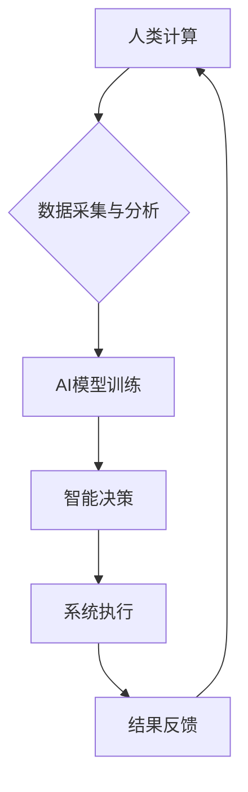

                 

## AI与人类计算：打造可持续发展的城市交通与基础设施建设规划

> 关键词：人工智能、城市交通、基础设施建设、可持续发展、人类计算、优化算法、机器学习、数据分析、预测模型

## 1. 背景介绍

随着全球人口的持续增长和城市化的加速推进，城市交通拥堵、基础设施老化等问题日益突出，严重影响着城市的可持续发展。传统交通管理和基础设施建设模式面临着巨大的挑战，亟需引入新的技术和理念来解决这些问题。人工智能（AI）作为一门新兴技术，凭借其强大的数据处理能力、学习能力和决策能力，为城市交通和基础设施建设的优化提供了新的思路和解决方案。

**1.1 城市交通与基础设施建设面临的挑战**

* **交通拥堵:** 城市交通拥堵是许多城市面临的共同问题，导致出行时间延长、能源消耗增加、环境污染加剧等一系列负面影响。
* **基础设施老化:** 随着时间的推移，城市基础设施逐渐老化，难以满足日益增长的需求，容易发生安全事故，影响城市正常运行。
* **资源浪费:** 传统交通管理和基础设施建设模式存在资源浪费问题，例如交通信号灯的非优化控制、道路建设的盲目扩张等。
* **数据孤岛:** 城市交通和基础设施建设数据分散，缺乏统一的管理平台，难以进行有效的数据分析和利用。

**1.2 AI技术在城市交通与基础设施建设中的应用潜力**

AI技术可以帮助城市解决上述问题，实现交通流量优化、基础设施智能化、资源高效利用等目标。

* **智能交通管理:** AI可以用于预测交通流量、优化交通信号灯控制、引导车辆行驶、缓解交通拥堵。
* **智能基础设施建设:** AI可以用于监测基础设施状态、预测故障风险、优化维护方案、延长基础设施使用寿命。
* **数据驱动决策:** AI可以对城市交通和基础设施建设数据进行分析，为决策者提供数据支持，帮助制定更科学、更有效的政策。

## 2. 核心概念与联系

**2.1 人类计算与AI计算**

人类计算是指人类利用自身的认知能力、经验和判断力进行计算和决策的过程。AI计算是指利用人工智能算法和模型进行计算和决策的过程。

**2.2 人类计算与AI计算的协同**

在城市交通和基础设施建设领域，人类计算和AI计算可以协同工作，发挥各自的优势。人类可以提供丰富的经验和判断力，AI可以提供数据分析和预测能力。

**2.3 核心概念架构**



**2.4 核心概念原理**

* **数据驱动:** AI算法依赖于大量的数据进行训练和优化，数据是AI发展的基础。
* **机器学习:** AI算法可以从数据中学习，不断提高其预测和决策能力。
* **深度学习:** 深度学习是机器学习的一种高级形式，可以处理更复杂的数据，获得更准确的预测结果。

## 3. 核心算法原理 & 具体操作步骤

**3.1 算法原理概述**

在城市交通和基础设施建设领域，常用的AI算法包括：

* **预测模型:** 用于预测交通流量、基础设施故障风险等。
* **优化算法:** 用于优化交通信号灯控制、道路规划等。
* **分类算法:** 用于识别交通违规行为、分类基础设施类型等。

**3.2 算法步骤详解**

以交通流量预测为例，其算法步骤如下：

1. **数据收集:** 收集历史交通流量数据、天气数据、时间数据等。
2. **数据预处理:** 对数据进行清洗、转换、特征提取等处理。
3. **模型选择:** 选择合适的预测模型，例如线性回归、神经网络等。
4. **模型训练:** 利用训练数据训练模型，调整模型参数。
5. **模型评估:** 利用测试数据评估模型性能，例如准确率、均方误差等。
6. **模型部署:** 将训练好的模型部署到实际系统中，用于预测未来交通流量。

**3.3 算法优缺点**

* **优点:** AI算法可以自动学习和优化，提高预测和决策的准确性，并能处理海量数据。
* **缺点:** AI算法需要大量的数据进行训练，训练过程耗时且需要专业知识。

**3.4 算法应用领域**

* **交通流量预测:** 预测道路交通流量，优化交通信号灯控制，缓解交通拥堵。
* **基础设施状态监测:** 监测桥梁、隧道、道路等基础设施状态，预测故障风险，及时进行维护。
* **城市规划:** 分析城市交通和基础设施数据，为城市规划提供决策支持。

## 4. 数学模型和公式 & 详细讲解 & 举例说明

**4.1 数学模型构建**

在城市交通和基础设施建设领域，常用的数学模型包括：

* **交通流量模型:** 用于描述交通流量的流动规律，例如四分之一规则、车流密度模型等。
* **基础设施寿命模型:** 用于预测基础设施的使用寿命，例如指数分布模型、威布尔分布模型等。

**4.2 公式推导过程**

以交通流量模型为例，四分之一规则是一种常用的交通流量模型，其公式如下：

$$
V = \frac{C}{4}
$$

其中：

* $V$ 表示交通流量
* $C$ 表示道路容量

该公式表明，交通流量与道路容量成正比，且流量不会超过道路容量的四分之一。

**4.3 案例分析与讲解**

假设一条道路的容量为1000辆/小时，根据四分之一规则，其最大交通流量为250辆/小时。如果实际交通流量超过250辆/小时，则会发生拥堵现象。

## 5. 项目实践：代码实例和详细解释说明

**5.1 开发环境搭建**

* 操作系统: Ubuntu 20.04
* Python 版本: 3.8
* 必要的库: pandas, numpy, scikit-learn, matplotlib

**5.2 源代码详细实现**

```python
import pandas as pd
from sklearn.linear_model import LinearRegression

# 数据加载
data = pd.read_csv('traffic_data.csv')

# 数据预处理
X = data[['hour', 'weather']]
y = data['traffic_volume']

# 模型训练
model = LinearRegression()
model.fit(X, y)

# 模型预测
new_data = pd.DataFrame({'hour': [16], 'weather': ['晴']})
predicted_traffic = model.predict(new_data)

# 结果展示
print(f'预测交通流量: {predicted_traffic[0]}')
```

**5.3 代码解读与分析**

* 代码首先加载交通数据，并进行数据预处理，提取特征变量和目标变量。
* 然后使用线性回归模型训练模型，并使用测试数据进行预测。
* 最后将预测结果打印出来。

**5.4 运行结果展示**

运行代码后，会输出预测的交通流量值。

## 6. 实际应用场景

**6.1 智能交通信号灯控制**

AI可以根据实时交通流量数据，优化交通信号灯的控制策略，减少红灯等待时间，提高交通效率。

**6.2 智能道路规划**

AI可以分析城市道路网络数据，规划最优的道路路线，避免交通拥堵，提高出行效率。

**6.3 智能基础设施维护**

AI可以监测基础设施状态，预测故障风险，及时进行维护，延长基础设施使用寿命。

**6.4 未来应用展望**

* **无人驾驶:** AI可以用于开发无人驾驶汽车，实现自动驾驶，提高交通安全性和效率。
* **智慧城市:** AI可以用于构建智慧城市，实现城市资源的优化利用，提高城市管理水平。

## 7. 工具和资源推荐

**7.1 学习资源推荐**

* **在线课程:** Coursera, edX, Udacity
* **书籍:** 《深度学习》、《机器学习实战》
* **开源项目:** TensorFlow, PyTorch

**7.2 开发工具推荐**

* **Python:** 广泛应用于AI开发
* **Jupyter Notebook:** 用于代码编写和数据分析
* **云计算平台:** AWS, Azure, GCP

**7.3 相关论文推荐**

* **交通流量预测:** "Deep Learning for Traffic Flow Prediction"
* **基础设施状态监测:** "Machine Learning for Infrastructure Health Monitoring"

## 8. 总结：未来发展趋势与挑战

**8.1 研究成果总结**

AI技术在城市交通和基础设施建设领域取得了显著的成果，例如交通流量预测、基础设施状态监测、智能交通信号灯控制等。

**8.2 未来发展趋势**

* **更精准的预测模型:** 利用更先进的机器学习算法和更丰富的传感器数据，提高预测模型的精度。
* **更智能的决策系统:** 开发更智能的决策系统，能够根据实时数据进行动态决策，提高系统响应速度和效率。
* **更广泛的应用场景:** 将AI技术应用到更多城市交通和基础设施建设场景，例如无人驾驶、智慧城市等。

**8.3 面临的挑战**

* **数据安全和隐私保护:** AI算法依赖于大量数据，如何保证数据安全和隐私保护是一个重要的挑战。
* **算法解释性和可信度:** AI算法的决策过程往往是复杂的，如何提高算法的解释性和可信度是一个重要的研究方向。
* **技术标准和规范:** 缺乏统一的技术标准和规范，制约了AI技术的推广应用。

**8.4 研究展望**

未来，AI技术将在城市交通和基础设施建设领域发挥越来越重要的作用，为打造更加智能、可持续的城市贡献力量。


## 9. 附录：常见问题与解答

**9.1 如何保证AI算法的公平性和公正性?**

AI算法的训练数据可能存在偏差，导致算法产生不公平或不公正的结果。为了解决这个问题，需要进行数据清洗和预处理，确保训练数据具有代表性，并采用公平性评估指标，监测算法的公平性。

**9.2 如何应对AI算法的不可解释性?**

一些AI算法的决策过程难以解释，这可能会导致人们对算法的信任度降低。为了解决这个问题，需要研究可解释性AI算法，并开发工具和方法，帮助人们理解算法的决策过程。

**9.3 如何确保AI算法的安全性和可靠性?**

AI算法的安全性和可靠性至关重要，需要进行严格的测试和验证，并采用安全机制，防止算法被恶意攻击或操纵。


作者：禅与计算机程序设计艺术 / Zen and the Art of Computer Programming 
<end_of_turn>

