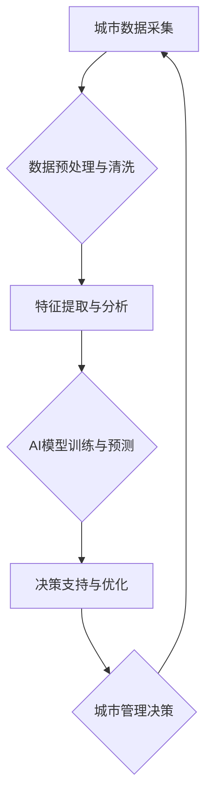

                 

## AI与人类计算：打造可持续发展的城市模型

> 关键词：人工智能、城市计算、可持续发展、数据驱动、优化算法、城市规划、智能交通、环境监测

## 1. 背景介绍

城市是人类文明的缩影，也是社会发展的重要引擎。然而，随着人口的快速增长和经济的快速发展，城市面临着诸多挑战，例如交通拥堵、环境污染、资源短缺等。这些问题严重影响着城市居民的生活质量和城市的可持续发展。

人工智能（AI）作为一种新兴技术，正在为解决城市问题提供新的思路和方法。AI能够通过学习和分析海量数据，识别城市中的复杂模式和趋势，并提供数据驱动的决策支持。

城市计算是指利用计算技术和数据分析手段，对城市运行状态进行实时监测、分析和优化，以提高城市效率、服务水平和居民生活质量。

将AI与城市计算相结合，可以构建一个智能城市模型，通过数据驱动和智能决策，实现城市的可持续发展。

## 2. 核心概念与联系

**2.1 城市计算模型**

城市计算模型是一个基于数据驱动的城市管理框架，它将城市中的各种数据收集、整合和分析，以提供城市运行状态的实时监测和决策支持。

**2.2 人工智能在城市计算中的应用**

AI技术在城市计算模型中扮演着至关重要的角色，它可以帮助我们：

* **预测城市发展趋势:** 通过分析历史数据和社会经济因素，AI可以预测城市人口增长、交通流量、能源需求等趋势，为城市规划提供决策依据。
* **优化城市资源配置:** AI可以根据实时数据，优化城市交通流量、能源分配、垃圾处理等资源配置，提高城市效率和资源利用率。
* **提升城市服务水平:** AI可以为市民提供个性化服务，例如智能交通导航、智能医疗诊断、智能家居控制等，提高城市服务水平和居民生活质量。

**2.3  AI与城市计算的交互流程**



## 3. 核心算法原理 & 具体操作步骤

**3.1 算法原理概述**

在AI与城市计算的结合中，常用的算法包括机器学习、深度学习、强化学习等。

* **机器学习:** 通过训练模型，让模型从数据中学习规律，并对新数据进行预测或分类。
* **深度学习:** 基于多层神经网络，能够学习更复杂的特征和模式。
* **强化学习:** 通过奖励机制，让智能体在环境中学习最优策略。

**3.2 算法步骤详解**

以机器学习为例，其基本步骤如下：

1. **数据收集:** 收集城市相关的各种数据，例如交通流量、人口密度、天气预报等。
2. **数据预处理:** 对收集到的数据进行清洗、转换和特征工程，使其适合模型训练。
3. **模型选择:** 根据具体应用场景选择合适的机器学习模型，例如线性回归、逻辑回归、决策树等。
4. **模型训练:** 使用训练数据训练模型，调整模型参数，使其能够准确预测或分类。
5. **模型评估:** 使用测试数据评估模型的性能，例如准确率、召回率、F1-score等。
6. **模型部署:** 将训练好的模型部署到实际应用场景中，用于预测或分类新数据。

**3.3 算法优缺点**

* **优点:** 能够从数据中学习规律，自动发现隐藏模式，并提供数据驱动的决策支持。
* **缺点:** 需要大量的训练数据，模型训练过程复杂，容易受到数据质量的影响。

**3.4 算法应用领域**

* **智能交通:** 预测交通流量、优化交通信号灯控制、智能导航等。
* **环境监测:** 监测空气质量、水质、噪音等环境指标，预测环境污染趋势。
* **城市规划:** 预测城市人口增长、土地利用变化等趋势，为城市规划提供决策依据。

## 4. 数学模型和公式 & 详细讲解 & 举例说明

**4.1 数学模型构建**

城市计算模型通常采用基于图的模型，将城市中的各个要素（例如居民、企业、道路、建筑等）表示为节点，并将它们之间的关系表示为边。

**4.2 公式推导过程**

例如，我们可以使用 PageRank 算法来计算城市中不同区域的权重，从而识别重要的城市区域。PageRank 算法的核心公式如下：

$$PR(A) = (1-d) + d \sum_{Page B links to A} \frac{PR(B)}{C(B)}$$

其中：

* $PR(A)$ 表示节点 A 的 PageRank 值。
* $d$ 是阻尼因子，通常取值为 0.85。
* $C(B)$ 表示节点 B 的出度数。

**4.3 案例分析与讲解**

我们可以将 PageRank 算法应用于城市交通网络，计算不同路段的权重，从而识别交通流量大的路段，并进行优化。

## 5. 项目实践：代码实例和详细解释说明

**5.1 开发环境搭建**

* 操作系统: Ubuntu 20.04
* Python 版本: 3.8
* 必要的库: pandas, numpy, scikit-learn, matplotlib

**5.2 源代码详细实现**

```python
import pandas as pd
from sklearn.linear_model import LinearRegression

# 加载城市交通数据
data = pd.read_csv("traffic_data.csv")

# 选择特征和目标变量
features = ["road_length", "average_speed"]
target = "traffic_volume"

# 训练线性回归模型
model = LinearRegression()
model.fit(data[features], data[target])

# 使用模型预测交通流量
new_data = pd.DataFrame({"road_length": [10], "average_speed": [50]})
predicted_traffic = model.predict(new_data)

# 打印预测结果
print(f"预测的交通流量: {predicted_traffic}")
```

**5.3 代码解读与分析**

* 代码首先加载城市交通数据，并选择特征和目标变量。
* 然后使用线性回归模型训练模型，并使用训练好的模型预测新的交通流量。
* 最后打印预测结果。

**5.4 运行结果展示**

运行结果将显示预测的交通流量值。

## 6. 实际应用场景

**6.1 智能交通管理**

AI可以用于优化交通信号灯控制、预测交通流量、提供智能导航等，从而缓解交通拥堵，提高交通效率。

**6.2 环境监测与保护**

AI可以用于监测空气质量、水质、噪音等环境指标，预测环境污染趋势，并提供相应的解决方案。

**6.3 城市规划与管理**

AI可以用于预测城市人口增长、土地利用变化等趋势，为城市规划提供决策依据，并优化城市资源配置。

**6.4 未来应用展望**

随着AI技术的不断发展，其在城市计算中的应用将更加广泛和深入。例如，AI可以用于个性化城市服务、智慧医疗、智慧教育等领域，为市民提供更加便捷、高效、智能的服务。

## 7. 工具和资源推荐

**7.1 学习资源推荐**

* **书籍:**
    * 《深度学习》
    * 《机器学习实战》
    * 《Python机器学习》
* **在线课程:**
    * Coursera: 深度学习
    * edX: 机器学习
    * Udacity: AI工程师

**7.2 开发工具推荐**

* **Python:** 广泛应用于AI开发，拥有丰富的库和框架。
* **TensorFlow:** Google开发的开源深度学习框架。
* **PyTorch:** Facebook开发的开源深度学习框架。
* **Scikit-learn:** Python机器学习库。

**7.3 相关论文推荐**

* 《城市计算: 概念、架构和应用》
* 《人工智能在城市计算中的应用》
* 《基于深度学习的城市交通流量预测》

## 8. 总结：未来发展趋势与挑战

**8.1 研究成果总结**

AI与城市计算的结合为解决城市问题提供了新的思路和方法，取得了一定的成果。例如，在智能交通、环境监测、城市规划等领域取得了显著进展。

**8.2 未来发展趋势**

* **边缘计算:** 将AI计算能力部署到城市边缘，降低数据传输延迟，提高实时性。
* **联邦学习:** 在不共享原始数据的情况下，训练联合模型，保护数据隐私。
* **多模态融合:** 将不同类型的数据（例如文本、图像、传感器数据）融合，提高模型的理解能力。

**8.3 面临的挑战**

* **数据质量:** 城市数据往往复杂、多源、不完整，需要进行有效的数据清洗和预处理。
* **算法解释性:** 许多AI算法是黑箱模型，难以解释其决策过程，需要提高算法的透明度和可解释性。
* **伦理问题:** AI在城市计算中的应用可能引发伦理问题，例如数据隐私、算法偏见等，需要进行伦理规范和风险评估。

**8.4 研究展望**

未来，AI与城市计算的研究将更加注重数据质量、算法解释性和伦理问题，并探索新的应用场景，为打造更加智能、可持续的城市贡献力量。

## 9. 附录：常见问题与解答

**9.1 如何获取城市数据？**

城市数据可以从政府开放数据平台、传感器网络、商业数据提供商等渠道获取。

**9.2 如何选择合适的AI算法？**

选择合适的AI算法需要根据具体应用场景和数据特点进行分析。

**9.3 如何评估AI模型的性能？**

可以使用准确率、召回率、F1-score等指标评估AI模型的性能。


作者：禅与计算机程序设计艺术 / Zen and the Art of Computer Programming 
<end_of_turn>

