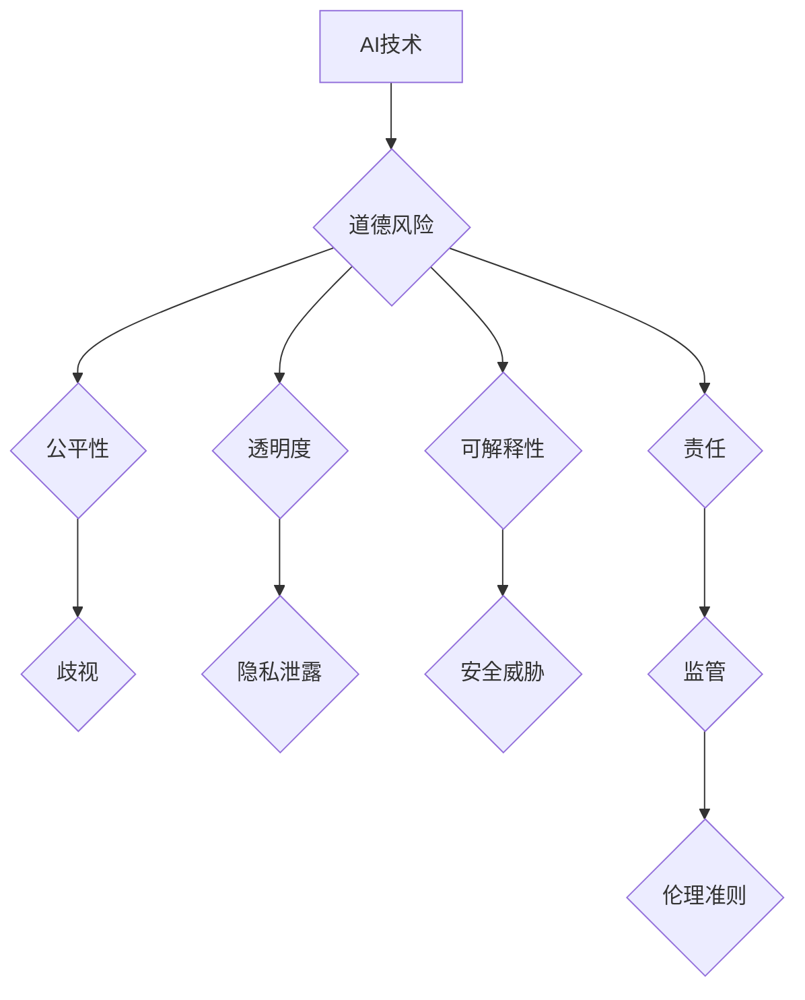

                 

## AI伦理：在模型开发中平衡效率与道德

> 关键词：人工智能伦理、模型开发、道德风险、公平性、透明度、可解释性、责任

### 1. 背景介绍

人工智能（AI）技术近年来突飞猛进，其应用领域不断拓展，从医疗保健到金融服务，再到自动驾驶，AI正在深刻地改变着我们的生活。然而，随着AI技术的快速发展，其潜在的伦理风险也日益凸显。如何确保AI技术的发展和应用符合人类的道德规范和价值观，成为一个亟待解决的难题。

AI伦理的核心问题在于如何平衡AI技术带来的效率提升与其可能带来的道德风险。一方面，AI技术可以帮助我们自动化繁琐的任务，提高工作效率，解决复杂问题，甚至创造新的价值。另一方面，AI模型的训练数据可能存在偏差，导致模型产生歧视性结果；AI系统的决策过程可能缺乏透明度，难以解释其背后的逻辑；AI技术的滥用可能带来隐私泄露、安全威胁等风险。

因此，在AI模型开发过程中，必须从一开始就将伦理考量纳入设计和决策流程，确保AI技术的发展和应用符合人类的道德规范和价值观。

### 2. 核心概念与联系

**2.1 核心概念**

* **人工智能（AI）：** 指能够模拟人类智能行为的计算机系统，例如学习、推理、决策、感知等。
* **AI伦理：** 指在人工智能技术开发、应用和监管过程中，遵循人类道德规范和价值观，确保AI技术的发展和应用符合人类利益的原则和准则。
* **道德风险：** 指AI技术可能带来的负面社会影响，例如歧视、偏见、隐私泄露、安全威胁等。
* **公平性：** 指AI模型的决策结果对所有群体都公平公正，不产生歧视或偏见。
* **透明度：** 指AI模型的决策过程能够被人类理解和解释。
* **可解释性：** 指能够解释AI模型的决策结果背后的逻辑和推理过程。
* **责任：** 指AI技术开发、应用和监管过程中，各方对AI技术带来的后果承担的责任。

**2.2  核心概念架构**



### 3. 核心算法原理 & 具体操作步骤

**3.1 算法原理概述**

在AI模型开发过程中，常用的算法包括监督学习、无监督学习和强化学习。

* **监督学习：** 利用标记数据训练模型，使模型能够从数据中学习到规律，并对新的数据进行预测。例如，图像分类、文本识别等。
* **无监督学习：** 利用未标记数据训练模型，使模型能够发现数据中的潜在结构和模式。例如，聚类分析、降维等。
* **强化学习：** 通过奖励和惩罚机制训练模型，使模型能够学习最优的策略。例如，游戏AI、机器人控制等。

**3.2 算法步骤详解**

以监督学习为例，其基本步骤如下：

1. **数据收集和预处理：** 收集相关数据，并进行清洗、转换、特征工程等预处理操作。
2. **模型选择：** 根据任务需求选择合适的模型算法，例如线性回归、逻辑回归、决策树、支持向量机等。
3. **模型训练：** 利用标记数据训练模型，调整模型参数，使模型能够准确地预测目标变量。
4. **模型评估：** 利用测试数据评估模型的性能，例如准确率、召回率、F1-score等。
5. **模型部署：** 将训练好的模型部署到实际应用场景中，用于预测新的数据。

**3.3 算法优缺点**

* **监督学习：** 优点：准确率高，可以解决各种分类和回归问题。缺点：需要大量的标记数据，数据偏差会影响模型性能。
* **无监督学习：** 优点：不需要标记数据，可以发现数据中的潜在结构和模式。缺点：模型解释性较差，难以评估模型性能。
* **强化学习：** 优点：可以学习复杂的策略，适用于动态环境。缺点：训练过程复杂，需要大量的试错和奖励机制设计。

**3.4 算法应用领域**

* **监督学习：** 医疗诊断、图像识别、文本分类、欺诈检测等。
* **无监督学习：** 客户画像、异常检测、数据聚类等。
* **强化学习：** 游戏AI、机器人控制、自动驾驶等。

### 4. 数学模型和公式 & 详细讲解 & 举例说明

**4.1 数学模型构建**

在机器学习中，常用的数学模型包括线性回归模型、逻辑回归模型、支持向量机模型等。

* **线性回归模型：** 用于预测连续变量，其数学模型如下：

$$y = w_0 + w_1x_1 + w_2x_2 + ... + w_nx_n + \epsilon$$

其中：

* $y$ 是预测变量
* $w_0, w_1, w_2, ..., w_n$ 是模型参数
* $x_1, x_2, ..., x_n$ 是输入特征
* $\epsilon$ 是误差项

* **逻辑回归模型：** 用于预测分类变量，其数学模型如下：

$$p(y=1|x) = \frac{1}{1 + e^{-(w_0 + w_1x_1 + w_2x_2 + ... + w_nx_n)}}$$

其中：

* $p(y=1|x)$ 是预测类别为1的概率
* $w_0, w_1, w_2, ..., w_n$ 是模型参数
* $x_1, x_2, ..., x_n$ 是输入特征

**4.2 公式推导过程**

模型参数的学习过程通常使用梯度下降算法，其目标是找到使模型预测结果与真实结果误差最小的参数值。梯度下降算法的基本原理是：

1. 计算模型预测结果与真实结果的误差
2. 计算误差对模型参数的梯度
3. 根据梯度更新模型参数

**4.3 案例分析与讲解**

例如，在图像分类任务中，可以使用卷积神经网络（CNN）模型进行训练。CNN模型可以学习图像的特征，并根据这些特征对图像进行分类。

### 5. 项目实践：代码实例和详细解释说明

**5.1 开发环境搭建**

使用Python语言开发AI模型，需要安装以下软件包：

* Python 3.x
* TensorFlow 或 PyTorch
* NumPy
* Pandas

**5.2 源代码详细实现**

以下是一个简单的线性回归模型的代码示例：

```python
import numpy as np
from sklearn.linear_model import LinearRegression

# 生成训练数据
X = np.array([[1], [2], [3], [4], [5]])
y = np.array([2, 4, 5, 4, 5])

# 创建线性回归模型
model = LinearRegression()

# 训练模型
model.fit(X, y)

# 预测新的数据
new_data = np.array([[6]])
prediction = model.predict(new_data)

# 打印预测结果
print(prediction)
```

**5.3 代码解读与分析**

* 首先，导入必要的库函数。
* 然后，生成训练数据，包括输入特征X和目标变量y。
* 创建线性回归模型对象。
* 使用`fit()`方法训练模型，将训练数据输入模型。
* 使用`predict()`方法预测新的数据。
* 打印预测结果。

**5.4 运行结果展示**

运行以上代码，可以得到预测结果，例如：

```
[5.8]
```

这意味着，对于输入特征为6的数据，模型预测的目标变量为5.8。

### 6. 实际应用场景

AI技术在各个领域都有广泛的应用场景，例如：

* **医疗保健：** AI可以辅助医生诊断疾病、预测患者风险、开发新药等。
* **金融服务：** AI可以用于欺诈检测、风险评估、个性化金融服务等。
* **自动驾驶：** AI可以帮助车辆感知周围环境、做出决策、自动驾驶等。
* **教育：** AI可以提供个性化学习方案、自动批改作业等。

### 6.4 未来应用展望

随着AI技术的不断发展，其应用场景将更加广泛，例如：

* **智能家居：** AI可以帮助家庭自动化，例如控制灯光、温度、安全等。
* **个性化推荐：** AI可以根据用户的喜好，推荐个性化的商品、服务、内容等。
* **虚拟助手：** AI可以作为虚拟助手，帮助用户完成各种任务，例如日程安排、信息查询等。

### 7. 工具和资源推荐

**7.1 学习资源推荐**

* **在线课程：** Coursera、edX、Udacity等平台提供丰富的AI课程。
* **书籍：** 《深度学习》、《机器学习实战》等书籍是学习AI的基础教材。
* **博客和论坛：** AI社区网站、博客和论坛可以获取最新的AI资讯和技术讨论。

**7.2 开发工具推荐**

* **TensorFlow：** Google开发的开源机器学习框架。
* **PyTorch：** Facebook开发的开源机器学习框架。
* **Scikit-learn：** Python机器学习库，提供各种经典算法的实现。

**7.3 相关论文推荐**

* **《ImageNet Classification with Deep Convolutional Neural Networks》**
* **《Attention Is All You Need》**
* **《BERT: Pre-training of Deep Bidirectional Transformers for Language Understanding》**

### 8. 总结：未来发展趋势与挑战

**8.1 研究成果总结**

近年来，AI技术取得了长足的进步，在图像识别、自然语言处理、语音识别等领域取得了突破性进展。

**8.2 未来发展趋势**

* **模型规模和复杂度提升：** 未来AI模型将更加庞大，更加复杂，能够处理更复杂的任务。
* **跨模态学习：** AI模型将能够学习多种模态数据，例如文本、图像、音频等，实现跨模态理解和生成。
* **边缘计算：** AI模型将部署到边缘设备，实现更实时、更低延迟的应用。

**8.3 面临的挑战**

* **数据安全和隐私保护：** AI模型的训练需要大量数据，如何确保数据的安全和隐私保护是一个重要挑战。
* **算法可解释性和透明度：** 许多AI模型的决策过程难以解释，如何提高算法的可解释性和透明度是一个关键问题。
* **算法公平性和偏见：** AI模型可能受到训练数据中的偏见影响，导致歧视性结果，如何确保算法的公平性和公正性是一个重要挑战。

**8.4 研究展望**

未来，AI研究将更加注重伦理、安全和可解释性，努力构建更加安全、可靠、可解释的AI系统，为人类社会带来更多福祉。

### 9. 附录：常见问题与解答

**9.1 如何评估AI模型的性能？**

常用的评估指标包括准确率、召回率、F1-score、AUC等。

**9.2 如何解决AI模型的过拟合问题？**

常用的方法包括正则化、交叉验证、Dropout等。

**9.3 如何确保AI模型的公平性？**

可以通过使用公平性评估指标、平衡训练数据、设计公平的算法等方式来确保AI模型的公平性。


作者：禅与计算机程序设计艺术 / Zen and the Art of Computer Programming 
<end_of_turn>

