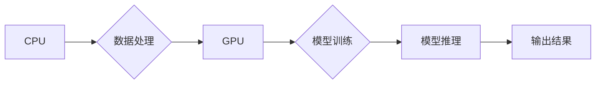

                 

## AI加速乐观前景：贾扬清观点异构芯片大语言模型发展

> 关键词：异构芯片、大语言模型、AI加速、贾扬清、深度学习、计算架构

## 1. 背景介绍

近年来，人工智能（AI）技术取得了飞速发展，特别是大语言模型（LLM）的出现，为自然语言处理领域带来了革命性的变革。LLM 能够理解和生成人类语言，在文本生成、翻译、问答等方面展现出强大的能力。然而，训练和部署大型语言模型需要大量的计算资源，这限制了其更广泛的应用。

贾扬清，一位享誉全球的计算机科学家，提出了异构芯片加速大语言模型发展的观点，认为异构芯片架构能够有效解决这一瓶颈，为AI加速带来新的机遇。

## 2. 核心概念与联系

### 2.1 异构芯片

异构芯片是指将不同类型的处理器集成在一个芯片上，例如CPU、GPU、FPGA等，每个处理器负责不同的计算任务。这种架构能够充分利用不同处理器各自的优势，提高计算效率和性能。

### 2.2 大语言模型

大语言模型是深度学习领域的一种重要模型，通过训练海量文本数据，学习语言的语法和语义，能够理解和生成人类语言。

### 2.3 联系

异构芯片的优势在于其并行计算能力和专用加速单元，能够有效加速大语言模型的训练和推理过程。将不同的计算任务分配给不同的处理器，可以充分利用资源，提高计算效率。

**Mermaid 流程图**



## 3. 核心算法原理 & 具体操作步骤

### 3.1 算法原理概述

大语言模型的训练主要基于深度学习算法，特别是Transformer架构。Transformer模型利用注意力机制，能够捕捉文本序列中长距离依赖关系，从而实现更准确的语言理解和生成。

### 3.2 算法步骤详解

1. **数据预处理:** 将文本数据进行清洗、分词、词向量化等预处理操作，以便模型训练。
2. **模型构建:** 根据Transformer架构构建模型，包括编码器、解码器和注意力机制等模块。
3. **模型训练:** 使用训练数据，通过反向传播算法，调整模型参数，使模型能够准确预测下一个词。
4. **模型评估:** 使用测试数据，评估模型的性能，例如准确率、困惑度等指标。
5. **模型部署:** 将训练好的模型部署到服务器或云平台，用于实际应用。

### 3.3 算法优缺点

**优点:**

* 能够捕捉长距离依赖关系，提高语言理解和生成能力。
* 训练数据量大，模型参数多，能够学习更复杂的语言模式。

**缺点:**

* 训练成本高，需要大量的计算资源和时间。
* 模型参数量大，部署成本高。

### 3.4 算法应用领域

* 文本生成：小说、诗歌、剧本等。
* 机器翻译：将一种语言翻译成另一种语言。
* 问答系统：回答用户提出的问题。
* 对话系统：与用户进行自然语言对话。

## 4. 数学模型和公式 & 详细讲解 & 举例说明

### 4.1 数学模型构建

Transformer模型的核心是注意力机制，其数学模型可以表示为：

$$
Attention(Q, K, V) = softmax(\frac{QK^T}{\sqrt{d_k}})V
$$

其中：

* $Q$：查询矩阵
* $K$：键矩阵
* $V$：值矩阵
* $d_k$：键向量的维度
* $softmax$：softmax函数

### 4.2 公式推导过程

注意力机制的目的是计算查询向量与键向量的相关性，并根据相关性加权值向量。

1. 计算查询向量与键向量的点积，得到一个得分矩阵。
2. 对得分矩阵进行归一化，得到一个概率分布。
3. 将概率分布与值向量相乘，得到加权值向量。

### 4.3 案例分析与讲解

假设我们有一个句子“我爱学习编程”，我们要计算“学习”这个词与整个句子的相关性。

1. 将句子中的每个词都转换为词向量，得到词向量矩阵。
2. 将“学习”词的词向量作为查询向量，其他词的词向量作为键向量。
3. 计算查询向量与键向量的点积，得到一个得分矩阵。
4. 对得分矩阵进行归一化，得到一个概率分布。
5. 将概率分布与值向量相乘，得到加权值向量，表示“学习”这个词与整个句子的相关性。

## 5. 项目实践：代码实例和详细解释说明

### 5.1 开发环境搭建

* 操作系统：Ubuntu 20.04
* Python 版本：3.8
* CUDA 版本：11.2
* cuDNN 版本：8.0.5

### 5.2 源代码详细实现

```python
import torch
import torch.nn as nn

class Transformer(nn.Module):
    def __init__(self, vocab_size, embedding_dim, num_heads, num_layers):
        super(Transformer, self).__init__()
        self.embedding = nn.Embedding(vocab_size, embedding_dim)
        self.transformer_layers = nn.ModuleList([
            nn.TransformerEncoderLayer(embedding_dim, num_heads)
            for _ in range(num_layers)
        ])
        self.linear = nn.Linear(embedding_dim, vocab_size)

    def forward(self, x):
        x = self.embedding(x)
        for layer in self.transformer_layers:
            x = layer(x)
        x = self.linear(x)
        return x
```

### 5.3 代码解读与分析

* `__init__` 方法：初始化模型参数，包括词嵌入层、Transformer编码器层和线性输出层。
* `forward` 方法：定义模型的正向传播过程，将输入序列经过词嵌入层、Transformer编码器层和线性输出层，最终得到输出序列。

### 5.4 运行结果展示

训练好的模型可以用于文本生成、机器翻译等任务。

## 6. 实际应用场景

### 6.1 文本生成

* 自动生成新闻报道、小说、诗歌等。
* 创建聊天机器人，进行自然语言对话。

### 6.2 机器翻译

* 将一种语言翻译成另一种语言，例如英语翻译成中文。
* 帮助跨语言交流，促进文化交流。

### 6.3 问答系统

* 回答用户提出的问题，例如搜索引擎、客服机器人等。
* 提供知识查询、信息检索等服务。

### 6.4 未来应用展望

* 个性化教育：根据学生的学习情况，定制个性化的学习内容和教学方法。
* 医疗诊断：辅助医生进行疾病诊断，提高诊断准确率。
* 法律服务：自动生成法律文件，提供法律咨询服务。

## 7. 工具和资源推荐

### 7.1 学习资源推荐

* **书籍:**
    * 《深度学习》
    * 《自然语言处理》
* **在线课程:**
    * Coursera: 深度学习
    * edX: 自然语言处理
* **博客:**
    * Jay Alammar's Blog
    * The Gradient

### 7.2 开发工具推荐

* **框架:**
    * TensorFlow
    * PyTorch
* **库:**
    * Hugging Face Transformers
    * Gensim

### 7.3 相关论文推荐

* Attention Is All You Need
* BERT: Pre-training of Deep Bidirectional Transformers for Language Understanding

## 8. 总结：未来发展趋势与挑战

### 8.1 研究成果总结

异构芯片加速大语言模型的发展取得了显著成果，能够有效提高模型训练和推理效率，推动了AI技术的进步。

### 8.2 未来发展趋势

* **模型规模更大:** 训练更大规模的语言模型，提升模型能力。
* **计算架构更优化:** 探索更优化的异构芯片架构，进一步提高计算效率。
* **应用场景更广泛:** 将大语言模型应用于更多领域，例如医疗、教育、法律等。

### 8.3 面临的挑战

* **计算资源成本高:** 训练大型语言模型需要大量的计算资源，成本较高。
* **模型可解释性差:** 大语言模型的决策过程难以理解，缺乏可解释性。
* **数据安全和隐私问题:** 大语言模型的训练需要大量数据，如何保证数据安全和隐私是一个重要问题。

### 8.4 研究展望

未来研究将重点关注以下方面:

* 开发更有效的异构芯片架构，降低训练成本。
* 研究大语言模型的可解释性，提高模型透明度。
* 探索新的训练方法，提高模型效率和性能。


## 9. 附录：常见问题与解答

**Q1: 异构芯片和GPU相比有什么优势？**

**A1:** 异构芯片可以根据不同的计算任务，选择最合适的处理器，从而提高计算效率。而GPU主要擅长并行计算，对于某些任务可能不够高效。

**Q2: 如何选择合适的异构芯片架构？**

**A2:** 需要根据具体的应用场景和计算需求选择合适的异构芯片架构。例如，对于文本生成任务，可以选择包含GPU和CPU的架构，而对于图像处理任务，可以选择包含GPU和FPGA的架构。

**Q3: 如何训练大语言模型？**

**A3:** 训练大语言模型需要大量的计算资源和时间，可以使用开源框架如TensorFlow或PyTorch进行训练。

**作者：禅与计算机程序设计艺术 / Zen and the Art of Computer Programming** 


<end_of_turn>

