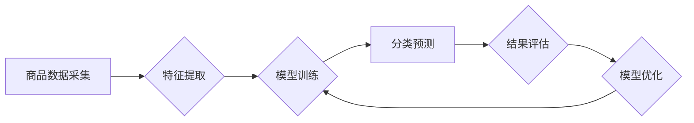

                 

## AI在电商品类管理中的应用

> 关键词：人工智能、电商、商品分类、机器学习、深度学习、自然语言处理、计算机视觉

## 1. 背景介绍

电子商务的蓬勃发展为商品分类带来了巨大的挑战。传统的人工分类方法效率低下、成本高昂，难以适应海量商品的快速增长和不断变化的市场需求。人工智能（AI）技术的快速发展为解决这一难题提供了新的思路和解决方案。

AI在电商商品分类中的应用，旨在利用机器学习、深度学习等算法，自动识别商品的属性和特征，并将其归类到相应的类别中。这不仅可以提高分类效率和准确性，还能为电商平台提供更精准的商品推荐、个性化营销和用户体验。

## 2. 核心概念与联系

### 2.1 商品分类的本质

商品分类是将商品按照其属性、特征或用途进行组织和归纳的过程。在电商平台中，商品分类是用户搜索、浏览和购买商品的关键环节，直接影响着用户体验和平台运营效率。

### 2.2 AI在商品分类中的作用

AI技术可以帮助电商平台实现自动化的商品分类，其核心原理是利用机器学习算法从海量商品数据中学习商品的特征和类别关系，并建立分类模型。

**AI商品分类流程图:**



### 2.3 关键技术

* **机器学习:**  利用算法从数据中学习，不断改进分类模型的准确性。
* **深度学习:**  利用多层神经网络，学习更复杂的商品特征和类别关系。
* **自然语言处理 (NLP):**  分析商品名称、描述等文本信息，提取商品属性和特征。
* **计算机视觉:**  分析商品图片，识别商品的外观特征和类别。

## 3. 核心算法原理 & 具体操作步骤

### 3.1 算法原理概述

常见的AI商品分类算法包括：

* **k-近邻算法 (KNN):**  根据商品特征与已知类别商品的相似度进行分类。
* **决策树算法:**  通过一系列规则，将商品分类到不同的类别。
* **支持向量机 (SVM):**  寻找最佳分类超平面，将商品分类到不同的类别。
* **随机森林算法:**  通过多个决策树的投票，提高分类准确性。
* **深度学习算法:**  利用多层神经网络，学习更复杂的商品特征和类别关系。

### 3.2 算法步骤详解

以k-近邻算法为例，其具体操作步骤如下：

1. **数据预处理:**  收集商品数据，并进行清洗、转换和特征提取。
2. **训练模型:**  将预处理后的数据用于训练k-近邻模型，确定k值。
3. **分类预测:**  将新商品数据输入模型，根据其特征与已知类别商品的相似度进行分类。

### 3.3 算法优缺点

**k-近邻算法:**

* **优点:**  算法简单易懂，易于实现。
* **缺点:**  计算复杂度高，对数据规模敏感，容易受到噪声数据的影响。

### 3.4 算法应用领域

k-近邻算法广泛应用于图像识别、文本分类、推荐系统等领域。

## 4. 数学模型和公式 & 详细讲解 & 举例说明

### 4.1 数学模型构建

k-近邻算法的数学模型可以表示为：

$$
d(x, y) = \sqrt{\sum_{i=1}^{n}(x_i - y_i)^2}
$$

其中：

* $x$ 和 $y$ 是两个商品数据点。
* $x_i$ 和 $y_i$ 是两个数据点在第 $i$ 个特征上的值。
* $n$ 是商品特征的个数。

### 4.2 公式推导过程

k-近邻算法的核心思想是将新商品数据点 $x$ 与已知类别商品数据点进行距离计算，选择距离最近的 $k$ 个数据点，并根据这些数据点的类别进行投票，最终将 $x$ 分类到获得最多投票的类别中。

### 4.3 案例分析与讲解

假设我们有一个商品数据集，包含商品名称、价格、颜色等特征，以及对应的类别信息。

我们想要将一个新商品数据点 $x$ 分类到相应的类别中。

1. 计算 $x$ 与所有已知类别商品数据点的距离。
2. 选择距离 $x$ 最近的 $k$ 个数据点，例如 $k=3$。
3. 统计这 $k$ 个数据点的类别信息，例如有 2 个数据点属于类别 A，1 个数据点属于类别 B。
4. 将 $x$ 分类到类别 A，因为类别 A 的投票数最多。

## 5. 项目实践：代码实例和详细解释说明

### 5.1 开发环境搭建

* Python 3.x
* scikit-learn 库
* pandas 库
* matplotlib 库

### 5.2 源代码详细实现

```python
from sklearn.neighbors import KNeighborsClassifier
from sklearn.model_selection import train_test_split
from sklearn.metrics import accuracy_score
import pandas as pd

# 加载商品数据
data = pd.read_csv('商品数据.csv')

# 选择特征和目标变量
features = ['价格', '颜色', '品牌']
target = '类别'

# 将数据分割为训练集和测试集
X_train, X_test, y_train, y_test = train_test_split(data[features], data[target], test_size=0.2)

# 创建k-近邻分类器
knn = KNeighborsClassifier(n_neighbors=3)

# 训练模型
knn.fit(X_train, y_train)

# 进行预测
y_pred = knn.predict(X_test)

# 计算准确率
accuracy = accuracy_score(y_test, y_pred)
print('准确率:', accuracy)
```

### 5.3 代码解读与分析

* 首先，我们加载商品数据，并选择特征和目标变量。
* 然后，我们将数据分割为训练集和测试集，用于训练和评估模型。
* 创建k-近邻分类器，并设置k值。
* 训练模型，并将训练好的模型用于预测测试集的类别。
* 最后，计算模型的准确率，评估模型的性能。

### 5.4 运行结果展示

运行上述代码后，会输出模型的准确率。

## 6. 实际应用场景

### 6.1 商品推荐

AI商品分类可以帮助电商平台根据用户的浏览历史、购买记录等信息，推荐与用户兴趣相关的商品。

### 6.2 个性化营销

AI商品分类可以帮助电商平台根据用户的商品偏好，进行个性化的营销推广。

### 6.3 搜索结果优化

AI商品分类可以帮助电商平台提高搜索结果的准确性和相关性，提升用户体验。

### 6.4 未来应用展望

* **多模态商品分类:**  结合文本、图像、音频等多模态数据进行商品分类，提高分类准确性。
* **动态商品分类:**  根据商品市场趋势和用户需求，动态调整商品分类规则。
* **个性化商品分类:**  根据用户的个性化偏好，进行个性化的商品分类。

## 7. 工具和资源推荐

### 7.1 学习资源推荐

* **书籍:**  《机器学习实战》、《深度学习》
* **在线课程:**  Coursera、edX、Udacity

### 7.2 开发工具推荐

* **Python:**  Python 是机器学习和深度学习的常用编程语言。
* **scikit-learn:**  scikit-learn 是 Python 的一个机器学习库，提供各种机器学习算法的实现。
* **TensorFlow:**  TensorFlow 是 Google 开发的深度学习框架。
* **PyTorch:**  PyTorch 是 Facebook 开发的深度学习框架。

### 7.3 相关论文推荐

* **《ImageNet Classification with Deep Convolutional Neural Networks》**
* **《Attention Is All You Need》**

## 8. 总结：未来发展趋势与挑战

### 8.1 研究成果总结

AI在电商商品分类领域取得了显著的成果，提高了分类效率和准确性，为电商平台提供了更精准的商品推荐、个性化营销和用户体验。

### 8.2 未来发展趋势

* **多模态商品分类:**  结合文本、图像、音频等多模态数据进行商品分类，提高分类准确性。
* **动态商品分类:**  根据商品市场趋势和用户需求，动态调整商品分类规则。
* **个性化商品分类:**  根据用户的个性化偏好，进行个性化的商品分类。

### 8.3 面临的挑战

* **数据质量:**  AI模型的性能依赖于数据质量，海量商品数据的清洗、标注和管理是一个挑战。
* **算法复杂度:**  一些AI算法的复杂度较高，需要强大的计算资源和技术支持。
* **解释性:**  一些AI模型的决策过程难以解释，这可能会导致用户信任度降低。

### 8.4 研究展望

未来，AI在电商商品分类领域将继续发展，并与其他技术融合，例如自然语言处理、计算机视觉、推荐系统等，为电商平台提供更智能、更精准的服务。

## 9. 附录：常见问题与解答

* **Q:  k-近邻算法的k值应该如何选择？**

* **A:**  k值的选择会影响模型的性能，一般可以通过交叉验证等方法进行调优。

* **Q:  AI商品分类算法的准确率如何保证？**

* **A:**  准确率取决于数据质量、算法选择和模型训练等因素，可以通过数据预处理、算法调优和模型评估等方法提高准确率。


作者：禅与计算机程序设计艺术 / Zen and the Art of Computer Programming 
<end_of_turn>

